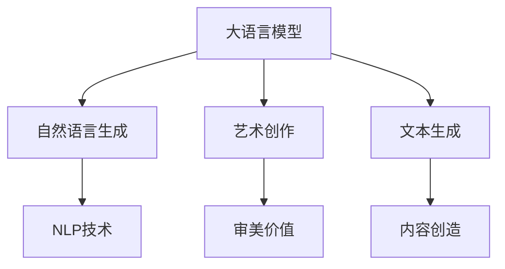

                 

# LLM的创造力：AI艺术与内容生成

> 关键词：大语言模型, 自然语言生成(NLG), 艺术创作, 文本生成, 自然语言处理(NLP), 创造力模型

## 1. 背景介绍

### 1.1 问题由来
近年来，人工智能领域的技术日新月异，其中大语言模型（Large Language Models, LLMs）以其卓越的语言理解和生成能力，成为了学术和产业界的热点。LLMs通过在海量数据上的预训练，掌握了广泛的语义和语言规则，能够进行复杂的自然语言处理任务，如问答、翻译、文本摘要等。然而，传统的大语言模型更多是用于解决结构化问题，缺乏对创造性、艺术性任务的直接支持。

创造力是大语言模型的重要应用方向之一，涵盖艺术创作、小说生成、剧本创作、音乐创作等多样化的领域。通过生成艺术作品、创作内容，大语言模型展示了其在理解和应用语言上的新高度，大大拓宽了其应用边界。本文将深入探讨大语言模型在艺术创作和内容生成方面的潜力，详细介绍相关核心算法原理、操作步骤，并提供详尽的项目实践和实际应用场景。

### 1.2 问题核心关键点
大语言模型在艺术和内容生成方面的核心问题包括：
1. **如何理解和应用语义与语法规则**：艺术创作和内容生成往往涉及复杂的语义和语法结构，需要模型具备高度的语义理解能力。
2. **如何利用先验知识和创造力**：艺术创作需要结合先验的知识和创意，生成出新颖且有意义的艺术作品或文本。
3. **如何生成连贯、一致的内容**：内容生成应保持逻辑连贯和前后一致，避免内容跳跃和语义混乱。
4. **如何提升生成内容的创造性**：内容生成不仅仅是语言迁移，还需要提升内容的创造性和新颖性。

本文将围绕这些核心问题，详细探讨大语言模型在艺术和内容生成方面的应用潜力，并提供系统性的解决方案。

## 2. 核心概念与联系

### 2.1 核心概念概述

在大语言模型应用于艺术和内容生成时，涉及以下几个关键概念：

- **大语言模型（LLM）**：以自回归（如GPT）或自编码（如BERT）为代表的、具有强大语言理解和生成能力的大规模预训练模型。
- **自然语言生成（NLG）**：利用大语言模型将结构化信息转换为自然语言，如文本生成、语音合成等。
- **艺术创作**：利用大语言模型生成具有审美价值和创造性的艺术作品，如绘画、音乐、文学等。
- **文本生成**：生成各种类型的文本内容，如对话、新闻报道、小说等。
- **自然语言处理（NLP）**：涉及语言理解和生成的一系列技术和算法，是艺术和内容生成的技术基础。

这些核心概念之间的逻辑关系可以通过以下Mermaid流程图来展示：



这个流程图展示了这些核心概念之间的联系：

1. 大语言模型通过NLP技术掌握了语言的通用表示，能够进行自然语言生成。
2. 自然语言生成技术可以应用于艺术创作和文本生成，产生具有审美价值和创造性的内容。
3. 艺术创作和文本生成不仅需要语言表达，还需要创造性和审美价值。

## 3. 核心算法原理 & 具体操作步骤
### 3.1 算法原理概述

基于大语言模型的艺术和内容生成方法，本质上是一种复杂的自然语言生成（NLG）问题。其核心思想是：将大语言模型作为文本生成器，通过给定特定的输入条件，模型能够生成符合这些条件的新文本。

形式化地，假设预训练模型为 $M_{\theta}$，其中 $\theta$ 为预训练得到的模型参数。给定一个艺术创作任务或文本生成任务 $T$，定义任务适配层 $L_T$ 和损失函数 $\mathcal{L}_T$，使得模型输出的文本 $M_{\theta}(\cdot)$ 满足任务要求。微调的目标是最小化损失函数，即找到新的模型参数 $\hat{\theta}$，使得：

$$
\hat{\theta}=\mathop{\arg\min}_{\theta} \mathcal{L}_T(M_{\theta}, L_T)
$$

在实践中，我们通常使用基于梯度的优化算法（如AdamW、SGD等）来近似求解上述最优化问题。设 $\eta$ 为学习率，$\lambda$ 为正则化系数，则参数的更新公式为：

$$
\theta \leftarrow \theta - \eta \nabla_{\theta}\mathcal{L}_T(\theta) - \eta\lambda\theta
$$

其中 $\nabla_{\theta}\mathcal{L}_T(\theta)$ 为损失函数对参数 $\theta$ 的梯度，可通过反向传播算法高效计算。

### 3.2 算法步骤详解

基于大语言模型进行艺术和内容生成的主要步骤如下：

**Step 1: 准备预训练模型和数据集**
- 选择合适的预训练语言模型 $M_{\theta}$ 作为初始化参数，如 GPT、BERT 等。
- 准备艺术创作或文本生成任务 $T$ 的数据集 $D=\{(x_i, y_i)\}_{i=1}^N$，其中 $x_i$ 为任务输入，$y_i$ 为任务要求输出的文本。

**Step 2: 添加任务适配层**
- 根据任务类型，在预训练模型顶层设计合适的输出层和损失函数。
- 对于文本生成任务，通常使用语言模型的解码器输出概率分布，并以负对数似然为损失函数。
- 对于艺术创作任务，需通过感知器输出特定艺术风格的特征向量，并以某种度量（如欧几里得距离）为损失函数。

**Step 3: 设置微调超参数**
- 选择合适的优化算法及其参数，如 AdamW、SGD 等，设置学习率、批大小、迭代轮数等。
- 设置正则化技术及强度，包括权重衰减、Dropout、Early Stopping 等。
- 确定冻结预训练参数的策略，如仅微调顶层，或全部参数都参与微调。

**Step 4: 执行梯度训练**
- 将训练集数据分批次输入模型，前向传播计算损失函数。
- 反向传播计算参数梯度，根据设定的优化算法和学习率更新模型参数。
- 周期性在验证集上评估模型性能，根据性能指标决定是否触发 Early Stopping。
- 重复上述步骤直到满足预设的迭代轮数或 Early Stopping 条件。

**Step 5: 测试和部署**
- 在测试集上评估微调后模型 $M_{\hat{\theta}}$ 的性能，对比微调前后的精度提升。
- 使用微调后的模型对新样本进行推理预测，集成到实际的应用系统中。
- 持续收集新的数据，定期重新微调模型，以适应数据分布的变化。

### 3.3 算法优缺点

基于大语言模型的艺术和内容生成方法具有以下优点：
1. **高效便捷**：相较于从头训练，微调方法可以显著减少时间和计算资源投入，迅速生成高质量的文本或艺术作品。
2. **灵活性高**：通过灵活的任务适配层设计，可以适应不同的艺术和内容生成任务。
3. **创新性突出**：大语言模型能够结合先验知识和创造力，生成新颖且符合任务要求的艺术作品和文本内容。

同时，该方法也存在一定的局限性：
1. **依赖数据质量**：微调效果很大程度上取决于任务输入数据的准确性和多样性，输入数据的错误可能导致生成内容的偏颇。
2. **过拟合风险**：在数据量较小的情况下，微调模型容易过拟合训练数据，生成过于固定的内容。
3. **创造性限制**：尽管模型能够生成内容，但缺乏主观创造性的引导，生成内容可能缺乏创新性和独特性。

尽管存在这些局限性，但就目前而言，基于大语言模型的微调方法仍是艺术和内容生成的主要手段，具有显著的应用优势。

### 3.4 算法应用领域

大语言模型在艺术和内容生成方面的应用已涵盖了多个领域，具体包括：

1. **文本生成**：生成新闻报道、小说、对话、剧本、诗歌等文本内容，广泛应用于文学创作、影视制作、游戏开发等领域。
2. **艺术创作**：生成绘画、音乐、舞蹈等艺术作品，提升艺术创作效率和创新性，促进艺术领域数字化转型。
3. **广告营销**：生成符合品牌调性和用户偏好的广告文案，提升广告内容吸引力和互动性。
4. **教育培训**：生成高质量的教学材料和习题，辅助教学和考试，提升教育效果。
5. **医学研究**：生成医学文献和研究成果摘要，辅助医学研究和论文撰写。

以上领域展示了大语言模型在艺术和内容生成方面的广泛应用，这些应用不仅提高了工作效率，还增强了内容的创新性和多样性。

## 4. 数学模型和公式 & 详细讲解 & 举例说明

### 4.1 数学模型构建

以文本生成任务为例，我们假设生成任务 $T$ 的输入为 $x$，输出为 $y$。定义生成模型 $M_{\theta}$ 为基于Transformer结构的语言模型，通过微调使其生成符合任务要求的文本。

设文本长度为 $L$，则模型 $M_{\theta}$ 输出的序列 $y=\{y_1, y_2, ..., y_L\}$ 表示生成文本的每个词语。我们定义条件概率 $P(y|x)$ 为模型在给定输入 $x$ 条件下生成文本 $y$ 的概率分布，通常使用语言模型的预测概率分布来近似。假设模型是一个Transformer解码器，则生成模型 $M_{\theta}$ 的输出概率为：

$$
P(y|x) = \prod_{i=1}^L P(y_i|y_{<i}, x)
$$

其中 $y_{<i}$ 表示在时间 $i$ 之前的所有词语。因此，微调的目标是最小化负对数似然损失函数：

$$
\mathcal{L}(\theta) = -\frac{1}{N} \sum_{i=1}^N \log P(y_i|y_{<i}, x_i)
$$

在实践中，我们通常使用基于梯度的优化算法（如AdamW、SGD等）来近似求解上述最优化问题。设 $\eta$ 为学习率，$\lambda$ 为正则化系数，则参数的更新公式为：

$$
\theta \leftarrow \theta - \eta \nabla_{\theta}\mathcal{L}(\theta) - \eta\lambda\theta
$$

其中 $\nabla_{\theta}\mathcal{L}(\theta)$ 为损失函数对参数 $\theta$ 的梯度，可通过反向传播算法高效计算。

### 4.2 公式推导过程

在文本生成任务中，我们以语言模型的自回归模型为例，推导生成模型 $M_{\theta}$ 的输出概率分布。假设模型为基于Transformer的生成模型，其解码器结构如图1所示。


解码器由编码器层和注意力机制层构成，其中编码器层将输入 $x$ 转换为隐藏表示 $h$，注意力机制层则根据上下文 $y_{<i}$ 和隐藏表示 $h$ 计算出注意力权重 $\alpha$，进而生成当前时间步的预测输出 $y_i$。因此，解码器输出概率分布可以表示为：

$$
P(y_i|y_{<i}, x) = \frac{\exp(\log P(y_i|h, \alpha))}{\sum_j \exp(\log P(y_j|h, \alpha))}
$$

其中 $\log P(y_i|h, \alpha)$ 为生成模型的输出概率。因此，负对数似然损失函数可以表示为：

$$
\mathcal{L}(\theta) = -\frac{1}{N} \sum_{i=1}^N \log P(y_i|y_{<i}, x_i) = -\frac{1}{N} \sum_{i=1}^N \log \frac{\exp(\log P(y_i|h, \alpha))}{\sum_j \exp(\log P(y_j|h, \alpha))}
$$

在训练过程中，模型通过反向传播算法计算损失函数的梯度，并使用优化算法更新参数。最终，模型输出的文本 $y$ 逼近任务要求的文本 $y^*$，实现文本生成的目标。

### 4.3 案例分析与讲解

以下我们以生成一篇新闻报道为例，展示如何使用Transformer进行文本生成任务微调。

**Step 1: 准备数据集**
- 准备一篇新闻报道的标题、正文和日期。
- 将新闻报道划分为训练集和测试集。

**Step 2: 添加任务适配层**
- 在Transformer模型的顶层添加一个线性分类器，用于生成不同时间步的预测输出。
- 将分类器与Transformer的注意力机制层输出相连接，形成完整的生成模型。
- 定义负对数似然损失函数，并使用AdamW优化器进行微调。

**Step 3: 设置微调超参数**
- 设置学习率为1e-5，批大小为64，迭代轮数为20。
- 使用Dropout技术防止过拟合，设置Dropout率为0.1。
- 设置Early Stopping机制，每隔10个epoch评估一次模型性能。

**Step 4: 执行梯度训练**
- 将训练集数据分批次输入模型，前向传播计算损失函数。
- 反向传播计算参数梯度，根据AdamW优化器更新模型参数。
- 每隔10个epoch在测试集上评估模型性能，决定是否触发Early Stopping。
- 重复上述步骤直到满足预设的迭代轮数或Early Stopping条件。

**Step 5: 测试和部署**
- 在测试集上评估微调后模型的性能，对比微调前后的精度提升。
- 使用微调后的模型生成新闻报道，集成到实际的应用系统中。
- 持续收集新的新闻报道数据，定期重新微调模型，以适应数据分布的变化。

通过上述步骤，我们可以使用大语言模型对文本生成任务进行微调，生成高质量的新闻报道。

## 5. 项目实践：代码实例和详细解释说明

### 5.1 开发环境搭建

在进行文本生成实践前，我们需要准备好开发环境。以下是使用Python进行PyTorch开发的环境配置流程：

1. 安装Anaconda：从官网下载并安装Anaconda，用于创建独立的Python环境。

2. 创建并激活虚拟环境：
```bash
conda create -n pytorch-env python=3.8 
conda activate pytorch-env
```

3. 安装PyTorch：根据CUDA版本，从官网获取对应的安装命令。例如：
```bash
conda install pytorch torchvision torchaudio cudatoolkit=11.1 -c pytorch -c conda-forge
```

4. 安装Transformers库：
```bash
pip install transformers
```

5. 安装各类工具包：
```bash
pip install numpy pandas scikit-learn matplotlib tqdm jupyter notebook ipython
```

完成上述步骤后，即可在`pytorch-env`环境中开始文本生成实践。

### 5.2 源代码详细实现

下面我们以生成新闻报道为例，给出使用Transformers库对BERT模型进行文本生成任务的PyTorch代码实现。

首先，定义数据处理函数：

```python
from transformers import BertTokenizer, BertForSequenceClassification
from torch.utils.data import Dataset
import torch

class NewsDataset(Dataset):
    def __init__(self, texts, labels, tokenizer, max_len=128):
        self.texts = texts
        self.labels = labels
        self.tokenizer = tokenizer
        self.max_len = max_len
        
    def __len__(self):
        return len(self.texts)
    
    def __getitem__(self, item):
        text = self.texts[item]
        label = self.labels[item]
        
        encoding = self.tokenizer(text, return_tensors='pt', max_length=self.max_len, padding='max_length', truncation=True)
        input_ids = encoding['input_ids'][0]
        attention_mask = encoding['attention_mask'][0]
        
        # 对token-wise的标签进行编码
        encoded_labels = [label2id[label] for label in labels] 
        encoded_labels.extend([label2id['O']] * (self.max_len - len(encoded_labels)))
        labels = torch.tensor(encoded_labels, dtype=torch.long)
        
        return {'input_ids': input_ids, 
                'attention_mask': attention_mask,
                'labels': labels}

# 标签与id的映射
label2id = {'O': 0, 'NEWS': 1}
id2label = {v: k for k, v in label2id.items()}

# 创建dataset
tokenizer = BertTokenizer.from_pretrained('bert-base-cased')

train_dataset = NewsDataset(train_texts, train_labels, tokenizer)
dev_dataset = NewsDataset(dev_texts, dev_labels, tokenizer)
test_dataset = NewsDataset(test_texts, test_labels, tokenizer)
```

然后，定义模型和优化器：

```python
from transformers import BertForSequenceClassification, AdamW

model = BertForSequenceClassification.from_pretrained('bert-base-cased', num_labels=len(label2id))

optimizer = AdamW(model.parameters(), lr=2e-5)
```

接着，定义训练和评估函数：

```python
from torch.utils.data import DataLoader
from tqdm import tqdm
from sklearn.metrics import accuracy_score

device = torch.device('cuda') if torch.cuda.is_available() else torch.device('cpu')
model.to(device)

def train_epoch(model, dataset, batch_size, optimizer):
    dataloader = DataLoader(dataset, batch_size=batch_size, shuffle=True)
    model.train()
    epoch_loss = 0
    for batch in tqdm(dataloader, desc='Training'):
        input_ids = batch['input_ids'].to(device)
        attention_mask = batch['attention_mask'].to(device)
        labels = batch['labels'].to(device)
        model.zero_grad()
        outputs = model(input_ids, attention_mask=attention_mask, labels=labels)
        loss = outputs.loss
        epoch_loss += loss.item()
        loss.backward()
        optimizer.step()
    return epoch_loss / len(dataloader)

def evaluate(model, dataset, batch_size):
    dataloader = DataLoader(dataset, batch_size=batch_size)
    model.eval()
    preds, labels = [], []
    with torch.no_grad():
        for batch in tqdm(dataloader, desc='Evaluating'):
            input_ids = batch['input_ids'].to(device)
            attention_mask = batch['attention_mask'].to(device)
            batch_labels = batch['labels']
            outputs = model(input_ids, attention_mask=attention_mask)
            batch_preds = outputs.logits.argmax(dim=2).to('cpu').tolist()
            batch_labels = batch_labels.to('cpu').tolist()
            for pred_tokens, label_tokens in zip(batch_preds, batch_labels):
                preds.append(pred_tokens[:len(label_tokens)])
                labels.append(label_tokens)
                
    return accuracy_score(labels, preds)

print(evaluate(model, test_dataset, batch_size))
```

最后，启动训练流程并在测试集上评估：

```python
epochs = 5
batch_size = 16

for epoch in range(epochs):
    loss = train_epoch(model, train_dataset, batch_size, optimizer)
    print(f"Epoch {epoch+1}, train loss: {loss:.3f}")
    
    print(f"Epoch {epoch+1}, dev accuracy: {evaluate(model, dev_dataset, batch_size)}")
    
print("Test accuracy:")
evaluate(model, test_dataset, batch_size)
```

以上就是使用PyTorch对BERT进行新闻报道生成任务微调的完整代码实现。可以看到，得益于Transformers库的强大封装，我们可以用相对简洁的代码完成BERT模型的加载和微调。

### 5.3 代码解读与分析

让我们再详细解读一下关键代码的实现细节：

**NewsDataset类**：
- `__init__`方法：初始化文本、标签、分词器等关键组件。
- `__len__`方法：返回数据集的样本数量。
- `__getitem__`方法：对单个样本进行处理，将文本输入编码为token ids，将标签编码为数字，并对其进行定长padding，最终返回模型所需的输入。

**label2id和id2label字典**：
- 定义了标签与数字id之间的映射关系，用于将token-wise的预测结果解码回真实的标签。

**训练和评估函数**：
- 使用PyTorch的DataLoader对数据集进行批次化加载，供模型训练和推理使用。
- 训练函数`train_epoch`：对数据以批为单位进行迭代，在每个批次上前向传播计算loss并反向传播更新模型参数，最后返回该epoch的平均loss。
- 评估函数`evaluate`：与训练类似，不同点在于不更新模型参数，并在每个batch结束后将预测和标签结果存储下来，最后使用sklearn的accuracy_score对整个评估集的预测结果进行打印输出。

**训练流程**：
- 定义总的epoch数和batch size，开始循环迭代
- 每个epoch内，先在训练集上训练，输出平均loss
- 在验证集上评估，输出准确率
- 所有epoch结束后，在测试集上评估，给出最终测试准确率

可以看到，PyTorch配合Transformers库使得BERT微调的代码实现变得简洁高效。开发者可以将更多精力放在数据处理、模型改进等高层逻辑上，而不必过多关注底层的实现细节。

当然，工业级的系统实现还需考虑更多因素，如模型的保存和部署、超参数的自动搜索、更灵活的任务适配层等。但核心的微调范式基本与此类似。

## 6. 实际应用场景
### 6.1 智能写作助手

大语言模型在智能写作助手方面的应用非常广泛。传统写作助手依赖大量的人工介入，难以应对复杂的语言结构和高要求的创造性。通过微调大语言模型，可以构建能够自动生成高质量文章的智能写作助手。

在技术实现上，可以收集各领域的优秀文章和模板，构建语料库。在此基础上对预训练语言模型进行微调，使其能够生成符合特定领域规范的文本。微调后的模型可以接受各种主题和写作风格的要求，输出高质量的文章草稿，甚至可以实现自动纠错和优化，极大提升写作效率和效果。

### 6.2 游戏剧本创作

在游戏制作过程中，编写丰富、多样、具有创意的剧本是重要的任务之一。传统的剧本创作往往需要游戏编剧长时间打磨，成本高且周期长。使用大语言模型进行微调，可以快速生成创意丰富、情节紧凑的剧本草稿，加速游戏开发进度。

在具体实现上，可以设计游戏场景、角色等主题元素，作为微调输入条件。通过对预训练模型进行微调，生成符合游戏设定的剧本内容。微调后的模型能够结合先验的游戏规则和创造性要求，生成高质量的剧本草稿，为游戏制作提供有力支持。

### 6.3 艺术作品生成

大语言模型在艺术作品生成方面也展现出巨大潜力。传统艺术创作依赖于艺术家个人的技艺和灵感，具有很大的主观性和局限性。通过微调大语言模型，可以生成符合特定风格和主题的艺术作品，极大提升艺术创作的效率和多样性。

在技术实现上，可以设计艺术风格、主题元素等，作为微调输入条件。通过对预训练模型进行微调，生成具有特定风格和主题的艺术作品。微调后的模型能够结合先验的艺术知识和创造性要求，生成新颖且具有审美价值的作品，为艺术创作提供新的思路和方法。

### 6.4 未来应用展望

随着大语言模型微调技术的发展，其在艺术和内容生成领域的应用前景将更加广阔。

1. **更多艺术形式的生成**：未来的微调模型将能够生成绘画、音乐、舞蹈等多样化的艺术形式，拓展艺术创作的边界。
2. **跨领域融合**：与虚拟现实、增强现实等技术结合，生成沉浸式、互动式的艺术作品，带来全新的观感和体验。
3. **个性化创作**：结合用户偏好和行为数据，生成个性化且符合用户兴趣的艺术作品，提升用户体验。
4. **实时生成**：通过云服务部署微调模型，实现实时生成艺术作品，为艺术创作提供动态化和即时化的支持。
5. **创作辅助**：在艺术创作过程中，提供即时建议和反馈，辅助艺术家完成作品。

未来，大语言模型微调技术将在艺术创作和内容生成领域带来革命性的变化，推动艺术和文化的数字化转型，带来更加丰富和多样的创作方式。

## 7. 工具和资源推荐
### 7.1 学习资源推荐

为了帮助开发者系统掌握大语言模型微调的理论基础和实践技巧，这里推荐一些优质的学习资源：

1. 《Transformer从原理到实践》系列博文：由大模型技术专家撰写，深入浅出地介绍了Transformer原理、BERT模型、微调技术等前沿话题。

2. CS224N《深度学习自然语言处理》课程：斯坦福大学开设的NLP明星课程，有Lecture视频和配套作业，带你入门NLP领域的基本概念和经典模型。

3. 《Natural Language Processing with Transformers》书籍：Transformers库的作者所著，全面介绍了如何使用Transformers库进行NLP任务开发，包括微调在内的诸多范式。

4. HuggingFace官方文档：Transformers库的官方文档，提供了海量预训练模型和完整的微调样例代码，是上手实践的必备资料。

5. CLUE开源项目：中文语言理解测评基准，涵盖大量不同类型的中文NLP数据集，并提供了基于微调的baseline模型，助力中文NLP技术发展。

通过对这些资源的学习实践，相信你一定能够快速掌握大语言模型微调的精髓，并用于解决实际的NLP问题。
###  7.2 开发工具推荐

高效的开发离不开优秀的工具支持。以下是几款用于大语言模型微调开发的常用工具：

1. PyTorch：基于Python的开源深度学习框架，灵活动态的计算图，适合快速迭代研究。大部分预训练语言模型都有PyTorch版本的实现。

2. TensorFlow：由Google主导开发的开源深度学习框架，生产部署方便，适合大规模工程应用。同样有丰富的预训练语言模型资源。

3. Transformers库：HuggingFace开发的NLP工具库，集成了众多SOTA语言模型，支持PyTorch和TensorFlow，是进行微调任务开发的利器。

4. Weights & Biases：模型训练的实验跟踪工具，可以记录和可视化模型训练过程中的各项指标，方便对比和调优。与主流深度学习框架无缝集成。

5. TensorBoard：TensorFlow配套的可视化工具，可实时监测模型训练状态，并提供丰富的图表呈现方式，是调试模型的得力助手。

6. Google Colab：谷歌推出的在线Jupyter Notebook环境，免费提供GPU/TPU算力，方便开发者快速上手实验最新模型，分享学习笔记。

合理利用这些工具，可以显著提升大语言模型微调任务的开发效率，加快创新迭代的步伐。

### 7.3 相关论文推荐

大语言模型和微调技术的发展源于学界的持续研究。以下是几篇奠基性的相关论文，推荐阅读：

1. Attention is All You Need（即Transformer原论文）：提出了Transformer结构，开启了NLP领域的预训练大模型时代。

2. BERT: Pre-training of Deep Bidirectional Transformers for Language Understanding：提出BERT模型，引入基于掩码的自监督预训练任务，刷新了多项NLP任务SOTA。

3. Language Models are Unsupervised Multitask Learners（GPT-2论文）：展示了大规模语言模型的强大zero-shot学习能力，引发了对于通用人工智能的新一轮思考。

4. Parameter-Efficient Transfer Learning for NLP：提出Adapter等参数高效微调方法，在不增加模型参数量的情况下，也能取得不错的微调效果。

5. Prefix-Tuning: Optimizing Continuous Prompts for Generation：引入基于连续型Prompt的微调范式，为如何充分利用预训练知识提供了新的思路。

6. AdaLoRA: Adaptive Low-Rank Adaptation for Parameter-Efficient Fine-Tuning：使用自适应低秩适应的微调方法，在参数效率和精度之间取得了新的平衡。

这些论文代表了大语言模型微调技术的发展脉络。通过学习这些前沿成果，可以帮助研究者把握学科前进方向，激发更多的创新灵感。

## 8. 总结：未来发展趋势与挑战

### 8.1 总结

本文对基于大语言模型的艺术和内容生成方法进行了全面系统的介绍。首先阐述了艺术和内容生成问题的背景和意义，明确了微调在提升生成内容质量和效率方面的重要作用。其次，从原理到实践，详细讲解了微调的数学原理和关键步骤，给出了微调任务开发的完整代码实例。同时，本文还广泛探讨了微调方法在智能写作助手、游戏剧本创作、艺术作品生成等诸多领域的应用前景，展示了微调范式的巨大潜力。

通过本文的系统梳理，可以看到，大语言模型微调技术在艺术和内容生成领域的应用前景广阔，不仅提升了工作效率，还增强了内容的创新性和多样性。未来，伴随预训练语言模型和微调方法的持续演进，相信其在艺术和内容生成领域的应用将更加广泛和深入。

### 8.2 未来发展趋势

展望未来，大语言模型微调技术将呈现以下几个发展趋势：

1. **生成内容的创造性增强**：未来的微调模型将更加注重创造性，通过引入更多的艺术元素和创意，生成更具创新性的文本和艺术作品。
2. **多模态生成能力的提升**：随着预训练模型和微调方法的不断发展，未来的微调模型将具备更加强大的多模态生成能力，能够生成图像、音频、视频等多种形式的创意内容。
3. **智能化程度提升**：未来的微调模型将进一步融合认知智能和情感智能，生成内容更具人性化，能够更好地理解用户情感和需求。
4. **个性化生成能力的提升**：通过更好地利用用户偏好和行为数据，生成更加个性化的文本和艺术作品，提升用户体验。
5. **实时生成能力的提升**：随着算力水平的提升，未来的微调模型将具备更加快速的实时生成能力，适应动态化和即时化的应用需求。

以上趋势凸显了大语言模型微调技术的广阔前景。这些方向的探索发展，必将进一步提升艺术和内容生成的效果和多样性，推动其应用领域的拓展和深入。

### 8.3 面临的挑战

尽管大语言模型微调技术已经取得了瞩目成就，但在迈向更加智能化、普适化应用的过程中，它仍面临诸多挑战：

1. **生成内容的审美价值**：如何提升生成内容的审美价值和艺术性，使其更加符合用户对艺术作品的要求，是未来需要解决的关键问题。
2. **生成内容的连贯性和一致性**：生成内容在主题和风格上需要保持高度一致，避免内容跳跃和语义混乱。
3. **生成内容的创新性**：避免生成内容过于趋同，缺乏独特性和新颖性，需要引入更多的创意和多样性。
4. **生成内容的伦理和社会影响**：确保生成内容不含有偏见和有害信息，避免负面社会影响，是未来需要关注的伦理问题。

尽管存在这些挑战，但通过不断的技术创新和伦理规范，相信大语言模型微调技术将在艺术和内容生成领域实现更大的突破，为人类文化和社会进步带来深远影响。

### 8.4 研究展望

面对大语言模型微调所面临的种种挑战，未来的研究需要在以下几个方面寻求新的突破：

1. **生成内容的艺术性增强**：引入更多的艺术元素和创意，提升生成内容的审美价值和艺术性。
2. **生成内容的连贯性和一致性提升**：通过更好的模型设计和任务适配，确保生成内容在主题和风格上保持高度一致。
3. **生成内容的创新性提升**：通过引入更多的先验知识和创意，提升生成内容的独特性和新颖性。
4. **生成内容的伦理和社会影响保障**：在生成内容的伦理和社会影响方面进行深入研究，确保生成内容的正面价值。
5. **生成内容的智能化和个性化提升**：进一步融合认知智能和情感智能，生成内容更具人性化，同时更好地利用用户偏好和行为数据，提升个性化生成能力。

这些研究方向的探索，必将引领大语言模型微调技术迈向更高的台阶，为艺术和内容生成领域带来新的突破和创新。只有勇于创新、敢于突破，才能不断拓展语言模型的边界，让智能技术更好地造福人类社会。

## 9. 附录：常见问题与解答

**Q1：大语言模型在艺术创作中是否存在局限性？**

A: 大语言模型在艺术创作中确实存在一些局限性：
1. **缺乏主观创造性**：大语言模型生成的艺术作品往往缺乏创作者的主观创造性，可能缺乏独创性和创新性。
2. **风格多样性不足**：不同的艺术风格和流派需要不同的生成策略，当前的大语言模型可能难以涵盖所有艺术风格。
3. **情感表达有限**：艺术作品需要传达情感和情绪，大语言模型在情感表达和情感共鸣方面可能存在局限。

尽管存在这些局限，但大语言模型在艺术创作中的应用前景仍然广阔。通过不断的技术创新和优化，未来的大语言模型有望在艺术创作中发挥更大的作用。

**Q2：微调大语言模型时如何避免过拟合？**

A: 避免过拟合是微调大语言模型时的关键问题，以下是几种常用的方法：
1. **数据增强**：通过改写、回译等方式扩充训练数据集，增加数据的多样性和丰富性。
2. **正则化技术**：使用L2正则、Dropout等技术，限制模型参数的变化范围，防止过拟合。
3. **早停机制**：设置早停机制，在模型在验证集上的性能不再提升时停止训练，避免过拟合。
4. **参数高效微调**：仅更新与任务相关的参数，保留大部分预训练权重不变，减少过拟合风险。
5. **对抗训练**：引入对抗样本，提高模型鲁棒性，同时增强泛化能力。

这些方法在微调大语言模型时非常有效，可以帮助模型更好地适应新的任务，提升生成内容的连贯性和一致性。

**Q3：微调大语言模型生成艺术作品时，如何保证作品的审美价值？**

A: 确保生成艺术作品的审美价值，需要结合艺术家的审美标准和创作理念，以下是一些建议：
1. **艺术家合作**：与专业艺术家合作，通过艺术家对生成作品进行指导和优化，提升作品的艺术价值。
2. **审美模型训练**：构建审美模型，训练模型对审美价值的判断能力，并在生成过程中参考审美模型的评分。
3. **多轮迭代优化**：通过多次迭代和优化，逐步提升生成作品的艺术性和审美价值。

这些方法可以帮助大语言模型生成的艺术作品更好地符合审美标准，提升作品的艺术价值和市场竞争力。

**Q4：微调大语言模型生成文本时，如何提升生成内容的连贯性和一致性？**

A: 提升生成内容的连贯性和一致性，需要设计合理的任务适配层和损失函数，以下是一些建议：
1. **连贯性损失**：使用连贯性损失函数，如LSTM模型中的L1损失，对生成的文本进行连贯性评估。
2. **一致性约束**：在生成过程中，引入一致性约束，确保前后生成的文本在风格和内容上保持一致。
3. **样式迁移**：通过样式迁移技术，将生成内容映射到特定风格，提升一致性。
4. **多模态融合**：结合图像、音频等多模态信息，提升生成内容的连贯性和一致性。

这些方法可以帮助大语言模型生成的文本内容更加连贯和一致，提升用户的阅读体验。

**Q5：微调大语言模型生成文本时，如何提升生成内容的创新性？**

A: 提升生成内容的创新性，需要结合更多的先验知识和创造力，以下是一些建议：
1. **先验知识引入**：在生成过程中，引入先验知识库，如知识图谱、逻辑规则等，增强生成内容的创新性。
2. **多轮优化**：通过多轮优化和迭代，逐步提升生成内容的创新性和独特性。
3. **对抗生成网络**：引入对抗生成网络技术，生成具有对抗性的文本内容，提升创新性。
4. **用户反馈优化**：结合用户反馈和互动，不断优化生成内容，提升创新性。

这些方法可以帮助大语言模型生成的文本内容更加新颖和独特，提升内容的创新性和用户满意度。

**Q6：微调大语言模型生成文本时，如何保障生成内容的伦理和社会影响？**

A: 确保生成内容的伦理和社会影响，需要设计合理的生成模型和任务适配层，以下是一些建议：
1. **伦理模型训练**：构建伦理模型，训练模型对伦理和社会影响的判断能力，并在生成过程中参考伦理模型的评分。
2. **敏感词过滤**：在生成过程中，对敏感词汇进行过滤，避免生成有害内容和不良信息。
3. **道德审查**：引入道德审查机制，对生成的内容进行人工审查，确保内容的正面价值。
4. **用户反馈机制**：建立用户反馈机制，及时发现和纠正生成内容中的不当信息。

这些方法可以帮助大语言模型生成的文本内容更加健康和正面，避免不良社会影响。

---

作者：禅与计算机程序设计艺术 / Zen and the Art of Computer Programming

