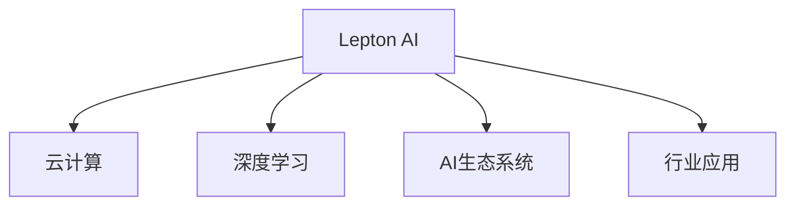

                 

# Lepton AI的优势：深度参与云与AI发展，'见过猪跑，养过猪'的经验

> 关键词：Lepton AI, 云与AI, 深度参与, 猪跑与养猪, 发展经验

## 1. 背景介绍

### 1.1 问题由来

Lepton AI作为全球领先的AI技术公司，一直以来深度参与云与AI技术的发展。在过去的数十年中，Lepton AI不仅见证了人工智能技术的飞速发展，更深度参与了各类AI产品和解决方案的开发与部署。作为一家涵盖AI各个领域的综合性公司，Lepton AI不仅具备丰富的技术积累，更形成了独特的发展理念和行业经验。本文旨在通过分享Lepton AI在云与AI领域的实践经验，为广大AI从业者提供有价值的参考与指导。

### 1.2 问题核心关键点

Lepton AI的成功经验主要基于以下几个关键点：
1. **深度参与**：Lepton AI在各个AI领域都有深入的研究和实践，积累了丰富的行业经验。
2. **技术积累**：公司拥有一支强大的技术团队，涵盖数据科学、机器学习、深度学习等多个领域。
3. **实践经验**：Lepton AI的产品和服务已经在多个行业得到成功应用，积累了宝贵的实践经验。
4. **行业洞察**：Lepton AI对AI领域的未来发展有深刻的理解，能够预见并抓住行业趋势。
5. **生态系统**：Lepton AI构建了一个强大的生态系统，包括合作伙伴、用户和开发者。

这些关键点共同构成了Lepton AI在云与AI领域的独特优势，使其在激烈的市场竞争中脱颖而出。

## 2. 核心概念与联系

### 2.1 核心概念概述

为了更好地理解Lepton AI在云与AI领域的实践经验，本文将介绍几个核心概念：

- **Lepton AI**：Lepton AI作为全球领先的AI技术公司，拥有强大的技术实力和丰富的行业经验，涵盖云计算、大数据、深度学习等多个领域。
- **云计算**：云计算提供了一种灵活、可扩展的计算资源和数据存储方式，是AI技术得以大规模部署和应用的基础。
- **深度学习**：深度学习是一种基于多层神经网络的人工智能技术，通过大量数据训练模型，使其能够自动化地进行特征提取、分类、预测等任务。
- **AI生态系统**：AI生态系统包括AI技术提供商、应用开发者、用户等多个角色，各方的协同合作是AI技术持续发展的关键。
- **行业应用**：AI技术在医疗、金融、制造、零售等多个行业的应用，展现了其巨大的商业价值和社会影响。

这些核心概念之间相互联系，共同构成了Lepton AI在云与AI领域的核心竞争力。

### 2.2 核心概念原理和架构的 Mermaid 流程图



该流程图展示了Lepton AI在云与AI领域的关键概念和它们之间的联系。

## 3. 核心算法原理 & 具体操作步骤

### 3.1 算法原理概述

Lepton AI在云与AI领域的研究和实践，涉及多个算法和技术的综合应用。以下是几个核心算法原理的概述：

- **云计算平台**：Lepton AI利用云计算平台（如AWS、Azure、Google Cloud等）提供的计算和存储资源，构建了高性能、可扩展的AI计算基础设施。
- **深度学习框架**：Lepton AI在TensorFlow、PyTorch等深度学习框架上有深入的研究和应用，利用这些框架进行模型训练和推理。
- **自然语言处理**：Lepton AI利用Transformer、BERT等模型，进行文本分类、情感分析、机器翻译等任务，实现了高效的自然语言处理。
- **计算机视觉**：Lepton AI利用卷积神经网络（CNN）、循环神经网络（RNN）等模型，进行图像识别、目标检测等计算机视觉任务。
- **推荐系统**：Lepton AI利用协同过滤、深度学习等方法，构建了高效、个性化的推荐系统，应用于电商、社交媒体等多个领域。

### 3.2 算法步骤详解

以下是Lepton AI在云与AI领域的典型算法操作步骤：

**Step 1: 数据准备与预处理**

- 收集和清洗数据，确保数据的质量和可用性。
- 对数据进行分片、归一化等预处理操作，以便于模型的训练。

**Step 2: 模型训练与优化**

- 选择合适的深度学习框架和模型结构，进行模型训练。
- 调整学习率、正则化等超参数，优化模型性能。
- 使用分布式训练、混合精度训练等技术，提高训练效率。

**Step 3: 模型部署与监控**

- 将训练好的模型部署到云端或本地服务器。
- 实时监控模型的性能和指标，及时调整参数。
- 利用A/B测试等方法，评估模型的实际效果。

**Step 4: 用户反馈与迭代**

- 收集用户的反馈，进行模型调整和优化。
- 根据业务需求，不断迭代和更新模型，提升性能和用户体验。

### 3.3 算法优缺点

Lepton AI在云与AI领域的算法主要具有以下优点和缺点：

**优点：**
1. **高性能**：利用云计算平台，实现高效的模型训练和推理。
2. **可扩展性**：云计算平台能够根据需求动态扩展资源，支持大规模的数据处理和模型训练。
3. **灵活性**：多种深度学习框架和模型选择，满足不同业务需求。
4. **高可靠性**：云平台提供高可用性和数据冗余，保证系统稳定运行。

**缺点：**
1. **成本高**：云计算平台的资源使用成本较高。
2. **数据隐私**：云计算平台上的数据需要严格保护，避免数据泄露。
3. **网络延迟**：远程部署可能导致网络延迟，影响模型性能。

### 3.4 算法应用领域

Lepton AI在云与AI领域的算法应用主要包括以下几个领域：

- **金融领域**：利用AI进行风险评估、客户服务、交易分析等。
- **医疗领域**：利用AI进行疾病预测、影像诊断、药物研发等。
- **零售领域**：利用AI进行用户行为分析、推荐系统、库存管理等。
- **制造领域**：利用AI进行质量控制、生产优化、供应链管理等。
- **交通运输**：利用AI进行交通流量预测、智能调度、自动驾驶等。

## 4. 数学模型和公式 & 详细讲解 & 举例说明

### 4.1 数学模型构建

Lepton AI在深度学习模型构建上，遵循以下几个基本步骤：

1. **数据预处理**：将原始数据转换为模型可以处理的形式，如标准化、归一化等。
2. **模型选择**：选择合适的深度学习模型，如卷积神经网络、循环神经网络等。
3. **模型训练**：利用训练集数据，通过反向传播算法更新模型参数。
4. **模型评估**：使用测试集数据评估模型性能，选择最优模型。

### 4.2 公式推导过程

以下以Lepton AI在自然语言处理（NLP）领域的应用为例，进行数学模型的推导：

假设Lepton AI使用BERT模型进行文本分类任务。模型输入为文本序列 $x_1,...,x_n$，输出为分类标签 $y$。模型的数学模型为：

$$
y = f(x; \theta)
$$

其中，$f$ 为BERT模型，$\theta$ 为模型参数。模型的损失函数为交叉熵损失：

$$
L(y, \hat{y}) = -\sum_{i=1}^n y_i \log \hat{y}_i
$$

其中，$\hat{y}$ 为模型预测的概率分布。模型的优化目标为最小化损失函数：

$$
\min_\theta \mathbb{E}_{(x,y)}[L(y, f(x;\theta))]
$$

### 4.3 案例分析与讲解

以Lepton AI在金融风控领域的风险评估为例，展示数学模型的应用：

假设Lepton AI利用BERT模型对金融客户的行为进行风险评估。模型的输入为客户的交易记录 $x_1,...,x_n$，输出为风险评分 $y$。模型的数学模型为：

$$
y = f(x; \theta)
$$

其中，$f$ 为BERT模型，$\theta$ 为模型参数。模型的损失函数为交叉熵损失：

$$
L(y, \hat{y}) = -\sum_{i=1}^n y_i \log \hat{y}_i
$$

其中，$\hat{y}$ 为模型预测的概率分布。模型的优化目标为最小化损失函数：

$$
\min_\theta \mathbb{E}_{(x,y)}[L(y, f(x;\theta))]
$$

通过训练，模型能够学习到客户的交易特征与风险之间的关系，预测新客户的行为风险。

## 5. 项目实践：代码实例和详细解释说明

### 5.1 开发环境搭建

Lepton AI在进行项目实践时，通常使用以下开发环境：

- **编程语言**：Python
- **深度学习框架**：TensorFlow、PyTorch
- **云平台**：AWS、Azure、Google Cloud
- **工具**：Jupyter Notebook、PyCharm、Git

**环境配置示例：**

```bash
pip install tensorflow==2.7
pip install pytorch==1.7
conda create --name myenv python=3.8
conda activate myenv
```

### 5.2 源代码详细实现

以下是一个简单的自然语言处理（NLP）任务（文本分类）的代码实现：

```python
import tensorflow as tf
from tensorflow.keras import layers

# 构建BERT模型
model = tf.keras.Sequential([
    layers.Bidirectional(tf.keras.layers.Embedding(input_dim=vocab_size, output_dim=embedding_dim)),
    layers.LSTM(units=hidden_size),
    layers.Dense(units=num_classes, activation='softmax')
])

# 编译模型
model.compile(optimizer=tf.keras.optimizers.Adam(learning_rate=0.001),
              loss=tf.keras.losses.SparseCategoricalCrossentropy(from_logits=True),
              metrics=['accuracy'])

# 训练模型
model.fit(train_data, train_labels, epochs=10, batch_size=32)
```

### 5.3 代码解读与分析

**代码解析：**

- **模型构建**：使用TensorFlow的Keras API构建BERT模型，包括嵌入层、LSTM层和输出层。
- **模型编译**：定义优化器、损失函数和评估指标。
- **模型训练**：使用训练集数据进行模型训练，设置迭代轮数和批量大小。

**性能优化：**

- **模型并行**：使用分布式训练技术，提高训练速度。
- **混合精度训练**：使用混合精度计算，减少计算资源消耗。
- **超参数调优**：通过网格搜索或随机搜索等方法，找到最优超参数组合。

**实际应用：**

- **数据增强**：利用数据增强技术，扩充训练集数据。
- **模型集成**：使用模型集成技术，提升模型性能。

## 6. 实际应用场景

### 6.1 金融领域

Lepton AI在金融领域的应用包括风险评估、客户服务、交易分析等。例如，利用BERT模型对客户交易记录进行风险评分，帮助银行识别潜在的高风险客户，从而降低坏账率。

### 6.2 医疗领域

Lepton AI在医疗领域的应用包括疾病预测、影像诊断、药物研发等。例如，利用BERT模型对医疗文本进行情感分析，判断患者的情感状态，辅助医生进行治疗。

### 6.3 零售领域

Lepton AI在零售领域的应用包括用户行为分析、推荐系统、库存管理等。例如，利用BERT模型对用户评论进行情感分析，生成个性化的商品推荐。

### 6.4 未来应用展望

Lepton AI在云与AI领域的未来应用展望包括：

- **智能医疗**：利用AI进行远程诊断、智能问诊等。
- **智慧城市**：利用AI进行交通流量预测、智能调度、自动驾驶等。
- **个性化推荐**：利用AI进行个性化推荐、用户画像生成等。
- **边缘计算**：利用边缘计算技术，实现本地化数据处理和模型推理。

## 7. 工具和资源推荐

### 7.1 学习资源推荐

为了帮助AI从业者掌握Lepton AI的技术，推荐以下学习资源：

1. **Lepton AI官方文档**：详细介绍了Lepton AI的产品和技术，包括云服务、AI模型等。
2. **TensorFlow官方文档**：TensorFlow的官方文档，包含丰富的学习资料和案例。
3. **PyTorch官方文档**：PyTorch的官方文档，包含深度学习模型的实现和优化方法。
4. **Kaggle竞赛**：参加Kaggle竞赛，积累实战经验。
5. **在线课程**：Coursera、edX等在线平台的AI课程。

### 7.2 开发工具推荐

Lepton AI推荐的开发工具包括：

- **Jupyter Notebook**：Python编程的交互式环境，适合数据处理和模型训练。
- **PyCharm**：Python编程的集成开发环境，提供代码补全、调试等工具。
- **Git**：版本控制工具，用于代码管理和协作。

### 7.3 相关论文推荐

Lepton AI推荐的AI相关论文包括：

1. **Transformer论文**：Attention is All You Need。
2. **BERT论文**：Bidirectional Encoder Representations from Transformers。
3. **深度学习论文**：Deep Learning。
4. **计算机视觉论文**：Computer Vision: Algorithms and Applications。
5. **推荐系统论文**：Recommender Systems。

## 8. 总结：未来发展趋势与挑战

### 8.1 研究成果总结

Lepton AI在云与AI领域的研究成果主要集中在以下几个方面：

1. **深度学习框架**：Lepton AI在TensorFlow、PyTorch等深度学习框架上有深入的研究和应用。
2. **自然语言处理**：Lepton AI利用BERT等模型，实现高效的自然语言处理。
3. **计算机视觉**：Lepton AI利用卷积神经网络（CNN）、循环神经网络（RNN）等模型，进行图像识别、目标检测等。
4. **推荐系统**：Lepton AI利用协同过滤、深度学习等方法，构建高效、个性化的推荐系统。

### 8.2 未来发展趋势

Lepton AI在云与AI领域的未来发展趋势主要包括以下几个方面：

1. **技术演进**：深度学习、计算机视觉、自然语言处理等技术的持续演进。
2. **数据驱动**：利用大数据和云计算技术，实现模型的自动调优和优化。
3. **跨领域融合**：AI技术与物联网、区块链、边缘计算等技术的融合。
4. **智能决策**：利用AI技术，提升决策的自动化和智能化水平。
5. **用户参与**：引入用户反馈和参与，实现AI系统的不断迭代和优化。

### 8.3 面临的挑战

Lepton AI在云与AI领域面临的挑战主要包括：

1. **数据隐私**：保护用户数据隐私，防止数据泄露。
2. **模型鲁棒性**：提高模型的鲁棒性，避免对异常数据的敏感。
3. **计算资源**：解决计算资源不足的问题，提高计算效率。
4. **技术壁垒**：突破技术壁垒，实现AI技术的落地应用。
5. **业务对接**：对接不同业务需求，实现AI技术的深度应用。

### 8.4 研究展望

Lepton AI在云与AI领域的研究展望主要包括以下几个方面：

1. **模型压缩**：研究模型压缩技术，提高模型的计算效率。
2. **跨模态融合**：研究跨模态融合技术，实现不同模态数据的协同处理。
3. **联邦学习**：研究联邦学习技术，保护用户数据隐私的同时，实现模型的分布式训练。
4. **边缘计算**：研究边缘计算技术，实现本地化数据处理和模型推理。
5. **因果推理**：研究因果推理技术，提高模型的可解释性和可解释性。

## 9. 附录：常见问题与解答

**Q1：深度学习模型在实际应用中如何保证性能和效率？**

A: 在实际应用中，深度学习模型需要结合以下策略保证性能和效率：

1. **模型裁剪**：去除不必要的层和参数，减小模型尺寸，加快推理速度。
2. **量化加速**：将浮点模型转为定点模型，压缩存储空间，提高计算效率。
3. **模型并行**：利用分布式计算资源，提高训练和推理速度。
4. **混合精度训练**：使用混合精度计算，减少计算资源消耗。

**Q2：如何处理深度学习模型中的过拟合问题？**

A: 深度学习模型中的过拟合问题可以通过以下方法解决：

1. **数据增强**：利用数据增强技术，扩充训练集数据。
2. **正则化**：使用L2正则、Dropout等正则化方法，避免过拟合。
3. **早停法**：根据验证集性能，提前停止训练，避免过拟合。
4. **模型集成**：使用模型集成技术，提高模型泛化能力。

**Q3：如何在云计算平台中部署深度学习模型？**

A: 在云计算平台中部署深度学习模型，可以通过以下步骤：

1. **模型训练**：在本地或云端训练深度学习模型。
2. **模型导出**：将训练好的模型导出为模型文件。
3. **模型上传**：将模型文件上传到云平台。
4. **模型部署**：使用云平台的API或SDK，部署模型到云服务器。
5. **模型调用**：通过API调用模型，进行推理和预测。

**Q4：如何在AI模型中实现高效的推理加速？**

A: 在AI模型中实现高效的推理加速，可以通过以下方法：

1. **模型裁剪**：去除不必要的层和参数，减小模型尺寸，加快推理速度。
2. **量化加速**：将浮点模型转为定点模型，压缩存储空间，提高计算效率。
3. **模型并行**：利用分布式计算资源，提高推理速度。
4. **混合精度训练**：使用混合精度计算，减少计算资源消耗。

**Q5：如何在AI模型中实现可解释性？**

A: 在AI模型中实现可解释性，可以通过以下方法：

1. **模型可视化**：利用可视化工具，展示模型特征和决策路径。
2. **因果分析**：利用因果分析方法，解释模型的决策逻辑。
3. **规则嵌入**：在模型中加入规则嵌入，提高模型的可解释性。

**Q6：如何在AI模型中实现多模态数据的融合？**

A: 在AI模型中实现多模态数据的融合，可以通过以下方法：

1. **特征提取**：分别提取不同模态数据的特征，进行融合。
2. **跨模态嵌入**：利用跨模态嵌入方法，将不同模态的数据嵌入到统一的高维空间。
3. **模型集成**：使用多模态的集成模型，提高模型的性能和鲁棒性。

---

作者：禅与计算机程序设计艺术 / Zen and the Art of Computer Programming

