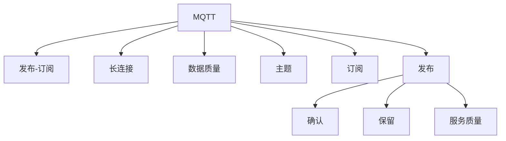

                 

# MQTT物联网通信协议详解

> 关键词：MQTT, 物联网通信协议, 发布-订阅模型, 轻量级通信, 数据可靠传输, 设备资源优化, 实时性, 安全认证

## 1. 背景介绍

### 1.1 问题由来
随着物联网(IoT)设备的普及和数量激增，如何高效、可靠地进行设备之间的通信成为首要挑战。传统的网络通信协议（如HTTP、TCP/UDP）虽然功能强大，但在处理海量设备间小数据量的实时传输时，显得效率低下，增加了网络开销和资源消耗。为应对这一问题，MQTT（Message Queuing Telemetry Transport）协议应运而生，通过简洁、高效的设计理念，成为物联网领域的经典通信协议之一。

### 1.2 问题核心关键点
MQTT协议的核心在于其简洁的发布-订阅模型，通过长连接和发布-订阅的方式，实现设备间轻量级、可靠的数据传输。MQTT协议的优势在于其低延迟、小数据量、高可靠性、低带宽消耗等特点，尤其适用于物联网设备的实时数据交换。

目前，MQTT协议已经广泛应用于智能家居、智能制造、智慧城市、车联网等领域，成为物联网设备间数据传输的桥梁。然而，MQTT协议的原理和实现细节复杂，开发者往往需要深入理解其工作机制，才能高效使用。本文将对MQTT协议的原理、设计思路、使用方法及应用场景进行全面介绍，帮助读者快速掌握这一重要技术。

### 1.3 问题研究意义
研究MQTT协议，对于推进物联网设备的智能化、网络化，提高数据传输的效率和可靠性，具有重要意义：

1. 提高物联网设备间的通信效率。MQTT协议的轻量级设计大大降低了数据传输的网络开销，减少了资源消耗。
2. 增强数据传输的可靠性。MQTT协议通过确认机制和重传策略，保证了数据传输的可靠性，减少数据丢失和误传输。
3. 优化设备资源利用。MQTT协议的低带宽消耗特性，使得物联网设备能够高效利用有限的计算资源和网络带宽。
4. 支持实时性需求。MQTT协议的快速发布-订阅机制，满足了物联网设备对数据实时传输的需求。
5. 增强数据安全。MQTT协议支持基于TLS的安全传输，保障了数据传输过程中的安全性和隐私性。

## 2. 核心概念与联系

### 2.1 核心概念概述

为更好地理解MQTT协议，本节将介绍几个密切相关的核心概念：

- MQTT协议（Message Queuing Telemetry Transport）：一种轻量级、高效、可靠的网络通信协议，广泛用于物联网设备的实时数据传输。
- 发布-订阅（Pub/Sub）模型：MQTT协议的核心通信模型，设备通过发布和订阅机制进行数据交换。
- 长连接（Persistent）：MQTT协议中的一种连接模式，设备与服务器保持长连接，便于快速传输数据。
- 数据质量（QoS）：MQTT协议中对数据传输可靠性的分级，分为三个等级：QoS 0、QoS 1和QoS 2。
- 主题（Topic）：MQTT协议中用于标识数据交换的命名规则，通常由主题名和主题路径组成。
- 订阅（Subscribe）：设备向服务器订阅主题，获取相关数据的发布信息。
- 发布（Publish）：设备向服务器发布数据，通过主题路径广播给订阅主题的设备。
- 确认（Acknowledgment）：MQTT协议中用于确认数据接收和处理结果的机制，确保数据传输的可靠性。
- 保留（Retained Message）：MQTT协议中用于缓存未被接收的发布数据，保证数据最终能够被订阅设备接收。
- 服务质量（Quality of Service，QoS）：MQTT协议中用于定义数据传输可靠性的参数，分为QoS 0、QoS 1和QoS 2三个等级。

这些核心概念之间的逻辑关系可以通过以下Mermaid流程图来展示：



这个流程图展示了大语言模型的核心概念及其之间的关系：

1. MQTT协议通过发布-订阅模型，实现设备间数据交换。
2. 长连接和数据质量参数，影响数据传输的可靠性。
3. 主题、订阅和发布是数据传输的关键组件。
4. 确认和保留机制，保障数据传输的完整性。
5. 服务质量（QoS）定义数据传输的可靠性和优先级。

## 3. 核心算法原理 & 具体操作步骤
### 3.1 算法原理概述

MQTT协议的核心原理基于发布-订阅模型，设备通过发布主题和订阅主题，实现数据传输。该模型的核心在于长连接和数据质量（QoS）的灵活配置，使得数据传输高效可靠。

MQTT协议的发布-订阅模型遵循以下步骤：

1. 设备通过网络连接至MQTT服务器，建立长连接。
2. 设备订阅一个或多个主题，向服务器发送订阅请求。
3. 服务器接收订阅请求，保存订阅信息。
4. 设备发布数据，通过主题路径广播给订阅主题的设备。
5. 订阅设备接收到数据后，根据确认机制进行确认。

### 3.2 算法步骤详解

MQTT协议的实现流程相对复杂，本节将详细讲解其关键步骤：

**Step 1: 网络连接建立**

MQTT协议通过TCP/IP协议建立连接。设备向MQTT服务器发起连接请求，服务器返回连接确认信息，建立长连接。连接建立后，设备与服务器保持常连接状态，以便快速传输数据。

**Step 2: 订阅请求处理**

设备通过`SUBSCRIBE`消息向服务器订阅主题，指定主题名和订阅级别。服务器接收订阅请求，保存订阅信息。订阅消息格式如下：

```
SUBSCRIBE <topic>/<topic-level>, <topic>/<topic-level>, ...
```

其中，`<topic>/<topic-level>`表示订阅的主题和级别。

**Step 3: 数据发布与广播**

设备通过`PUBLISH`消息发布数据，指定主题路径和数据内容。服务器接收数据发布请求，将其广播给订阅该主题的设备。数据发布消息格式如下：

```
PUBLISH <topic>/<topic-level>, <message>
```

其中，`<topic>/<topic-level>`表示发布的主题路径，`<message>`表示数据内容。

**Step 4: 数据确认与保留**

订阅设备接收到数据后，通过`PUBREC`消息向服务器发送确认请求。服务器返回`PUBACK`确认消息，表示数据接收成功。如果数据发布失败，服务器会返回`PUBCOMP`消息，表示数据发布已完成。如果服务器支持保留机制，会将未被接收的数据缓存，直到所有订阅设备都接收到数据。

**Step 5: 连接断开与清理**

设备与MQTT服务器断开连接时，通过`DISCONNECT`消息进行连接断开请求。服务器返回`CONNACK`确认消息，表示连接断开成功。服务器清理连接信息，等待下一次连接请求。

### 3.3 算法优缺点

MQTT协议具有以下优点：

1. 轻量级设计：MQTT协议的消息格式简单，占用的带宽和内存资源少，适合物联网设备的实时数据交换。
2. 高效传输：MQTT协议支持长连接和确认机制，能够快速传输数据，减少网络延迟。
3. 低带宽消耗：MQTT协议的消息格式小，数据传输量低，适合带宽受限的设备。
4. 高可靠性：MQTT协议支持数据质量（QoS）和确认机制，保障数据传输的可靠性。
5. 支持多种QoS等级：MQTT协议提供QoS 0、QoS 1和QoS 2三个等级，满足不同应用场景的需求。

同时，MQTT协议也存在以下缺点：

1. 连接管理复杂：MQTT协议需要维护长连接和订阅关系，增加了连接管理的复杂性。
2. 认证机制有限：MQTT协议虽然支持基于TLS的安全传输，但认证机制相对简单，容易受到攻击。
3. 无法处理复杂逻辑：MQTT协议的逻辑相对简单，不适用于需要复杂处理逻辑的应用场景。

### 3.4 算法应用领域

MQTT协议在物联网领域得到了广泛应用，涵盖以下领域：

- 智能家居：通过MQTT协议，智能家居设备能够实时传输温度、湿度、光线等传感器数据，实现设备间的智能控制。
- 智能制造：MQTT协议应用于工业物联网（IIoT），使得设备和传感器能够实时传输状态数据，优化生产流程。
- 智慧城市：MQTT协议在智慧城市建设中用于交通监控、环境监测、公共设施管理等场景，实现城市管理的智能化。
- 车联网：MQTT协议用于车辆与车联网平台之间的数据传输，实现车辆状态监控和自动驾驶。
- 农业物联网：MQTT协议应用于农业设备的监控和管理，实现农业生产的智能化和精准化。

MQTT协议的应用场景多种多样，通过其在轻量级设计、高可靠性等方面的优势，满足了物联网设备对数据传输的多种需求。

## 4. 数学模型和公式 & 详细讲解 & 举例说明

### 4.1 数学模型构建

MQTT协议的数学模型主要涉及数据传输的可靠性、确认机制和保留机制。

**数据质量（QoS）模型**：
MQTT协议支持三个数据质量等级，分别为QoS 0、QoS 1和QoS 2，其数学定义如下：

1. QoS 0：最轻量级的传输方式，不保证数据的可靠性和有序性。
2. QoS 1：通过确认机制保证数据可靠传输，但不保证数据的完整性和有序性。
3. QoS 2：通过确认机制和保留机制保证数据可靠传输，同时保证数据的完整性和有序性。

数据质量等级的数学表示为：

$$
\text{QoS} = \left\{
\begin{array}{ll}
0, & \text{如果\text{ack}\text{-}flag = 0} \\
1, & \text{如果\text{ack}\text{-}flag = 1\text{且}\text{ack}\text{-}\text{delivery}\text{-}flag = 0} \\
2, & \text{如果\text{ack}\text{-}flag = 1\text{且}\text{ack}\text{-}\text{delivery}\text{-}flag = 1}
\end{array}
\right.
$$

其中，`ack`表示确认机制的触发条件，`ack{-}delivery{-}flag`表示保留机制的触发条件。

**确认机制**：
MQTT协议的确认机制通过确认消息（ACK）和确认响应消息（ACK\text{-}acknowledgment）实现数据传输的可靠性。确认消息格式如下：

```
PUBREC <packet\text{-}identifier>
```

其中，`<packet\text{-}identifier>`表示数据包的标识符。

确认响应消息格式如下：

```
PUBACK <packet\text{-}identifier>
PUBREC <packet\text{-}identifier>
PUBCOMP <packet\text{-}identifier>
```

确认消息和确认响应消息的交互过程如下：

1. 设备通过`PUBLISH`消息发布数据，服务器接收数据。
2. 服务器向设备发送`PUBREC`消息，表示数据接收成功。
3. 设备接收到`PUBREC`消息，向服务器发送`PUBACK`确认消息。
4. 服务器收到`PUBACK`消息，确认数据接收成功。

确认机制的数学模型为：

$$
\text{ACK}\text{-}\text{flag} = \left\{
\begin{array}{ll}
1, & \text{如果数据包已完整传输} \\
0, & \text{如果数据包未完整传输}
\end{array}
\right.
$$

**保留机制**：
MQTT协议的保留机制通过`retain`标志实现数据的持久化存储。保留机制的数学模型为：

$$
\text{retain\text{-}flag} = \left\{
\begin{array}{ll}
1, & \text{如果主题支持保留机制} \\
0, & \text{如果主题不支持保留机制}
\end{array}
\right.
$$

**数据传输可靠性**：
MQTT协议通过确认机制和保留机制保证数据传输的可靠性。假设数据包数量为$n$，数据质量等级为$QoS_i$（$i \in \{0,1,2\}$），则数据传输可靠性模型为：

$$
\text{Reliability} = \left\{
\begin{array}{ll}
\text{Always reliable}, & \text{如果}\text{QoS} = 0 \\
\text{Sometimes reliable}, & \text{如果}\text{QoS} = 1 \\
\text{Always reliable}, & \text{如果}\text{QoS} = 2
\end{array}
\right.
$$

### 4.2 公式推导过程

以下我们以一个简单的MQTT数据传输过程为例，推导确认机制和保留机制的工作原理。

假设设备A发布一条数据消息，主题为`sensor/temperature`，数据内容为`25°C`。设备B订阅了该主题。

**步骤1：设备A发布数据**

设备A通过`PUBLISH`消息发布数据，格式如下：

```
PUBLISH sensor/temperature/0, 25°C
```

其中，`0`表示QoS 0。

**步骤2：服务器接收数据**

服务器接收数据消息，向设备A发送`PUBREC`消息：

```
PUBREC <packet\text{-}identifier>
```

其中，`<packet\text{-}identifier>`表示数据包的标识符。

**步骤3：设备A发送确认消息**

设备A接收到`PUBREC`消息，向服务器发送`PUBACK`确认消息：

```
PUBACK <packet\text{-}identifier>
```

**步骤4：服务器确认数据**

服务器收到`PUBACK`确认消息，确认数据接收成功。

**步骤5：设备B接收数据**

设备B接收到`PUBLISH`消息，确认数据接收成功。

### 4.3 案例分析与讲解

考虑一个智能家居系统，其中包含多个智能温度传感器和智能窗帘控制器。每个传感器定时采集室内温度数据，并将数据发布到MQTT服务器。智能窗帘控制器订阅传感器的主题，根据温度数据自动调节窗帘开合状态。

1. 传感器A通过`PUBLISH`消息发布温度数据，主题为`sensor1/temperature`，数据内容为`25°C`。
2. 服务器接收数据消息，向传感器A发送`PUBREC`消息。
3. 传感器A接收到`PUBREC`消息，向服务器发送`PUBACK`确认消息。
4. 服务器确认数据接收成功。
5. 窗帘控制器订阅了传感器1的主题，接收到`PUBLISH`消息，根据温度数据调节窗帘开合状态。

在此案例中，MQTT协议通过简洁的消息格式和高效的确认机制，实现了传感器数据的实时传输和窗帘控制器的智能调节，体现了其轻量级和高可靠性的优势。

## 5. 项目实践：代码实例和详细解释说明
### 5.1 开发环境搭建

在进行MQTT开发前，需要先配置好开发环境。以下是使用Python进行MQTT开发的配置步骤：

1. 安装Paho-MQTT库：
```bash
pip install paho-mqtt
```

2. 配置MQTT服务器：
```bash
mosquitto -c mosquitto.conf
```

3. 配置MQTT客户端：
```bash
mosquitto -c mosquitto.conf
```

### 5.2 源代码详细实现

下面我们以一个简单的MQTT发布-订阅为例，给出Python代码实现。

**发布者代码**：
```python
import paho.mqtt.client as mqtt

# MQTT broker地址和端口
broker = "localhost"
port = 1883

# 发布者设置
def on_publish(client, userdata, result):
    if result == 0:
        print("发布成功")
    else:
        print("发布失败")

# 创建MQTT客户端，连接服务器
client = mqtt.Client()
client.on_publish = on_publish
client.connect(broker, port)

# 发布数据
topic = "temperature/sensor1"
data = "25°C"
client.publish(topic, data)

# 断开连接
client.disconnect()
```

**订阅者代码**：
```python
import paho.mqtt.client as mqtt

# MQTT broker地址和端口
broker = "localhost"
port = 1883

# 订阅者设置
def on_connect(client, userdata, flags, rc):
    if rc == 0:
        print("连接成功")
        client.subscribe("temperature/sensor1")
    else:
        print("连接失败")

# 订阅数据
client = mqtt.Client()
client.on_connect = on_connect
client.connect(broker, port)

# 接收数据
client.loop_start()
while True:
    data = client.recv()
    print("接收数据：", data)

# 断开连接
client.loop_stop()
client.disconnect()
```

### 5.3 代码解读与分析

让我们再详细解读一下关键代码的实现细节：

**发布者代码**：
- `on_publish`方法：在数据发布成功后，打印成功或失败信息。
- `client.connect`方法：创建MQTT客户端，连接服务器。
- `client.publish`方法：发布数据到指定主题。

**订阅者代码**：
- `on_connect`方法：在连接成功后，订阅指定主题。
- `client.subscribe`方法：订阅主题。
- `client.recv`方法：接收数据消息。

在实际应用中，发布者和订阅者可以通过MQTT协议高效、可靠地交换数据。需要注意的是，MQTT协议的QoS参数需要根据实际需求进行配置，确保数据传输的可靠性和实时性。

## 6. 实际应用场景
### 6.1 智能家居系统

MQTT协议在智能家居系统中具有广泛应用。通过MQTT协议，智能家居设备可以实时传输传感器数据和控制指令，实现设备间的智能控制。

例如，智能温控器可以通过MQTT协议接收室内温度数据，并根据温度变化自动调节空调和窗户状态。智能安防系统可以通过MQTT协议接收门窗传感器数据，并自动报警和通知户主。智能照明系统可以通过MQTT协议接收光线传感器数据，并自动调整灯光亮度和颜色。

### 6.2 智能制造

MQTT协议在智能制造领域也有着广泛应用。通过MQTT协议，设备和传感器可以实时传输状态数据和控制指令，优化生产流程。

例如，智能工厂可以通过MQTT协议接收设备状态数据，并根据设备运行状态进行维护和调度。智能仓库可以通过MQTT协议接收货物位置数据，并自动调度货物分拣和运输。智能质量控制系统可以通过MQTT协议接收传感器数据，并实时监控产品质量。

### 6.3 智慧城市

MQTT协议在智慧城市建设中也有着广泛应用。通过MQTT协议，城市管理设备可以实时传输状态数据和控制指令，实现城市管理的智能化。

例如，智能交通系统可以通过MQTT协议接收交通信号灯状态数据，并自动调节交通流量。智慧环保系统可以通过MQTT协议接收环境监测设备数据，并实时监控空气质量和水质状况。智能能源管理系统可以通过MQTT协议接收能源设备状态数据，并自动调节能源使用。

### 6.4 车联网

MQTT协议在车联网领域也有着广泛应用。通过MQTT协议，车辆和车联网平台可以实时传输状态数据和控制指令，实现车辆状态监控和自动驾驶。

例如，智能汽车可以通过MQTT协议接收车辆状态数据，并自动调整行驶状态。智能导航系统可以通过MQTT协议接收交通信号灯状态数据，并自动规划最优路径。智能停车场可以通过MQTT协议接收车辆位置数据，并自动调度停车位。

## 7. 工具和资源推荐
### 7.1 学习资源推荐

为了帮助开发者系统掌握MQTT协议的理论基础和实践技巧，这里推荐一些优质的学习资源：

1. MQTT协议官方文档：详细介绍了MQTT协议的规范和实现细节，是学习MQTT协议的重要参考资料。

2. MQTT协议教程：通过浅显易懂的语言和实际案例，介绍了MQTT协议的基本概念和使用方法。

3. Paho-MQTT官方文档：详细介绍了Paho-MQTT库的使用方法，提供了丰富的样例代码和API文档。

4. 《MQTT协议实战指南》书籍：介绍了MQTT协议的原理和应用场景，通过实际案例演示了MQTT协议的开发和使用。

5. MQTT协议视频教程：通过视频讲解，深入浅出地介绍了MQTT协议的原理和实现细节。

通过这些资源的学习实践，相信你一定能够快速掌握MQTT协议的理论基础和实践技巧，并用于解决实际的NLP问题。

### 7.2 开发工具推荐

MQTT协议的开发离不开优秀的工具支持。以下是几款用于MQTT开发的常用工具：

1. Eclipse Paho：MQTT协议的客户端和服务器实现，支持多种编程语言和平台。

2. Mosquitto：MQTT协议的服务器实现，支持高并发和可扩展性。

3. PyMQTT：Python语言下的MQTT协议客户端库，使用简单，支持异步编程。

4. MQTT Explorer：MQTT协议的客户端工具，支持可视化界面和日志记录。

5. MQTT Studio：MQTT协议的客户端工具，支持MQTT协议的详细调试和分析。

合理利用这些工具，可以显著提升MQTT协议的开发效率，加快创新迭代的步伐。

### 7.3 相关论文推荐

MQTT协议的研究源于学界的持续研究。以下是几篇奠基性的相关论文，推荐阅读：

1. MQTT协议规范文档：详细介绍了MQTT协议的规范和实现细节。

2. MQTT协议的设计与实现：介绍了MQTT协议的设计思路和实现方法。

3. MQTT协议的优化与性能分析：研究了MQTT协议的性能瓶颈和优化方法。

4. MQTT协议的安全性研究：研究了MQTT协议的安全性和防护措施。

5. MQTT协议的未来发展方向：展望了MQTT协议的未来发展趋势和研究方向。

这些论文代表了大语言模型微调技术的发展脉络。通过学习这些前沿成果，可以帮助研究者把握学科前进方向，激发更多的创新灵感。

## 8. 总结：未来发展趋势与挑战

### 8.1 总结

本文对MQTT协议的原理、设计思路、使用方法及应用场景进行了全面介绍。首先阐述了MQTT协议的研究背景和意义，明确了协议在物联网设备间数据传输中的重要价值。其次，从原理到实践，详细讲解了MQTT协议的发布-订阅模型、数据质量等级、确认机制和保留机制，给出了完整的代码实现。同时，本文还广泛探讨了MQTT协议在智能家居、智能制造、智慧城市、车联网等领域的应用前景，展示了协议的广泛应用潜力。

通过本文的系统梳理，可以看到，MQTT协议通过简洁、高效的设计理念，满足了物联网设备对数据传输的高效性、可靠性和实时性需求。基于MQTT协议，开发者可以高效、可靠地实现设备间的实时数据交换，提升物联网系统的性能和可靠性。

### 8.2 未来发展趋势

展望未来，MQTT协议的发展趋势将呈现以下几个方向：

1. 持续优化和升级：MQTT协议将继续优化数据传输机制，提升数据传输的效率和可靠性。

2. 增强安全性：MQTT协议将进一步增强安全性，引入更多的安全认证和防护措施。

3. 扩展功能：MQTT协议将引入更多的功能模块，如设备管理、权限控制等，提升系统功能性和可扩展性。

4. 跨平台支持：MQTT协议将支持更多的编程语言和平台，提高开发效率和兼容性。

5. 实时性优化：MQTT协议将继续优化数据传输机制，提升数据传输的实时性和低延迟。

6. 设备资源优化：MQTT协议将进一步优化资源利用，减少设备计算和存储资源消耗。

以上趋势凸显了MQTT协议的广阔前景。这些方向的探索发展，将使得MQTT协议在物联网设备间的实时数据交换中发挥更大的作用，为物联网系统的智能化、网络化发展提供支持。

### 8.3 面临的挑战

尽管MQTT协议已经取得了显著成效，但在迈向更加智能化、网络化应用的过程中，仍面临诸多挑战：

1. 连接管理复杂：MQTT协议需要维护长连接和订阅关系，增加了连接管理的复杂性。

2. 认证机制有限：MQTT协议虽然支持基于TLS的安全传输，但认证机制相对简单，容易受到攻击。

3. 数据质量等级设置：MQTT协议的QoS参数需要根据实际需求进行配置，可能影响数据传输的实时性和可靠性。

4. 资源消耗问题：MQTT协议的轻量级设计在一定程度上牺牲了计算和存储资源，需要进一步优化。

5. 兼容性和互操作性：MQTT协议在不同设备间可能存在兼容性和互操作性问题，需要统一规范和标准。

6. 数据传输延时：MQTT协议的实时性性能需要进一步提升，以应对快速变化的物联网数据需求。

正视MQTT协议面临的这些挑战，积极应对并寻求突破，将使得协议在未来物联网设备间的数据传输中发挥更大的作用。

### 8.4 研究展望

面对MQTT协议所面临的挑战，未来的研究需要在以下几个方面寻求新的突破：

1. 引入新的数据传输机制：研究新的数据传输机制，提升数据传输的效率和可靠性。

2. 增强安全性：引入更多的安全认证和防护措施，保障数据传输的安全性和隐私性。

3. 扩展功能模块：引入新的功能模块，提升MQTT协议的系统功能和可扩展性。

4. 跨平台支持：引入更多的跨平台支持，提高MQTT协议的兼容性和互操作性。

5. 优化资源消耗：优化MQTT协议的计算和存储资源消耗，提高设备资源利用率。

6. 提升实时性：优化MQTT协议的数据传输机制，提升数据传输的实时性和低延迟。

这些研究方向将引领MQTT协议的持续优化和发展，使得协议在物联网设备间的实时数据交换中发挥更大的作用，满足物联网系统的智能化、网络化需求。面向未来，MQTT协议需要与其他人工智能技术进行更深入的融合，共同推动物联网系统的智能化发展。

## 9. 附录：常见问题与解答

**Q1：MQTT协议和HTTP协议有什么区别？**

A: MQTT协议和HTTP协议虽然都可以用于网络通信，但它们的设计思路和应用场景不同。HTTP协议主要用于Web浏览器和Web服务器之间的数据交换，适用于Web应用和网站开发。而MQTT协议则适用于物联网设备间的小数据量实时传输，适用于智能家居、智能制造、智慧城市、车联网等领域。

**Q2：MQTT协议的QoS参数如何设置？**

A: MQTT协议的QoS参数需要根据实际需求进行配置，通常有三种取值：QoS 0、QoS 1和QoS 2。QoS 0表示不保证数据可靠性和有序性，适用于数据传输量较小、对实时性要求不高的场景。QoS 1表示通过确认机制保证数据可靠传输，适用于数据传输量中等、对实时性要求较高的场景。QoS 2表示通过确认机制和保留机制保证数据可靠传输，适用于数据传输量较大、对实时性和可靠性要求极高的场景。

**Q3：MQTT协议的确认机制如何工作？**

A: MQTT协议的确认机制通过确认消息（ACK）和确认响应消息（ACK\text{-}acknowledgment）实现数据传输的可靠性。当设备发布数据后，服务器向设备发送确认消息（PUBREC）。设备接收到确认消息后，向服务器发送确认响应消息（PUBACK）。服务器收到确认响应消息后，确认数据接收成功。

**Q4：MQTT协议的保留机制如何工作？**

A: MQTT协议的保留机制通过`retain`标志实现数据的持久化存储。当设备发布数据时，若主题支持保留机制，则服务器会将未被接收的数据缓存，直到所有订阅设备都接收到数据。

**Q5：MQTT协议的连接管理复杂吗？**

A: MQTT协议的连接管理相对复杂，需要维护长连接和订阅关系。但MQTT协议的轻量级设计和高效传输机制，使得连接管理带来的复杂性得以缓解。

总之，MQTT协议通过简洁、高效的设计理念，满足了物联网设备对数据传输的多种需求。未来，随着技术的不断发展，MQTT协议将在智能化、网络化应用的各个领域中发挥更大的作用，推动物联网系统的持续优化和发展。

---

作者：禅与计算机程序设计艺术 / Zen and the Art of Computer Programming

