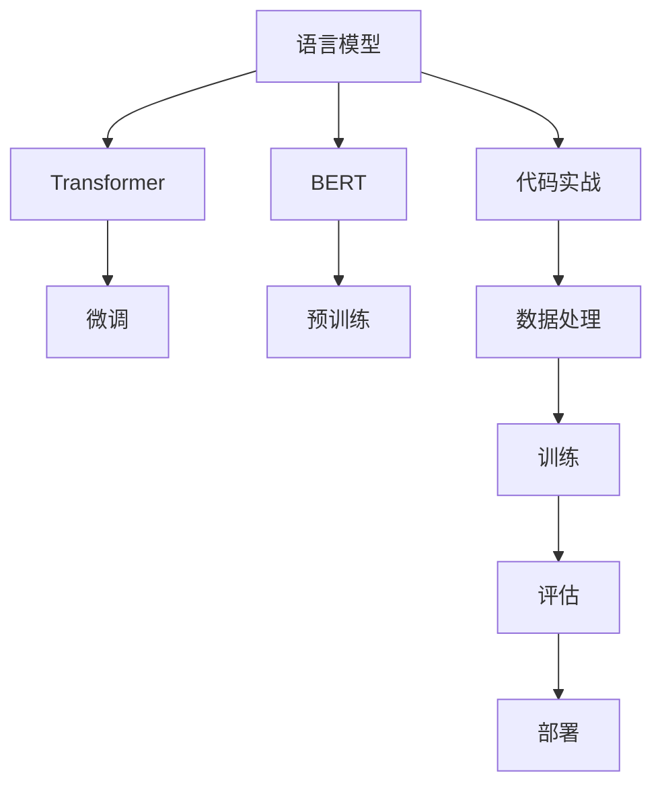

                 

# Natural Language Processing (NLP) 原理与代码实战案例讲解

> 关键词：自然语言处理, NLP, 文本分析, 机器学习, 深度学习, 代码实践, 语言模型, Transformer, PyTorch, Hugging Face, 案例研究

## 1. 背景介绍

### 1.1 问题由来
自然语言处理（Natural Language Processing，简称NLP）是人工智能（AI）领域的一个重要分支，致力于让计算机理解和处理人类语言。随着大规模语料库的建设、深度学习技术的成熟，NLP领域取得了诸多突破，出现了多种强大的语言模型，如BERT、GPT-3等。这些模型的出现，显著提升了NLP任务的性能，使得文本分析、机器翻译、情感分析、命名实体识别等任务得以广泛应用。

尽管如此，NLP领域的技术仍面临许多挑战。首先，现有模型常常需要在特定领域或特定任务上进行微调，以提升其在该任务上的性能。其次，模型的训练和部署涉及复杂的算法和大量的数据处理，需要系统的理论知识和实践经验。因此，深入理解NLP的原理，掌握其核心算法，并通过代码实战进行深入实践，是提升NLP技术应用能力的有效途径。

### 1.2 问题核心关键点
NLP的核心关键点包括：
- 语言模型：是NLP的基础，负责将输入的文本转换为模型能够理解和处理的向量表示。
- 机器翻译：将一种语言的文本翻译成另一种语言的文本。
- 文本分类：将文本分为预定义的类别，如垃圾邮件识别、情感分析等。
- 命名实体识别（Named Entity Recognition, NER）：识别文本中的人名、地名、组织名等命名实体。
- 文本生成：如对话生成、摘要生成、故事生成等。

本文将详细探讨这些核心NLP任务的技术原理和代码实现，帮助读者深入理解NLP的算法和模型，并通过实战案例掌握其应用。

## 2. 核心概念与联系

### 2.1 核心概念概述

为更好地理解NLP的核心概念，本节将介绍几个密切相关的核心概念：

- **语言模型（Language Model）**：是NLP的基础，用于估计给定文本序列出现的概率。常见的语言模型有n-gram模型、循环神经网络（RNN）、卷积神经网络（CNN）、长短期记忆网络（LSTM）、Transformer等。
- **Transformer模型**：是一种基于注意力机制的神经网络模型，特别适用于处理序列数据。Transformer模型通过自注意力和互注意力机制，能够捕捉文本中的长期依赖关系，从而在多个NLP任务上取得了显著的成果。
- **BERT（Bidirectional Encoder Representations from Transformers）**：是Google提出的一种预训练语言模型，通过双向掩码机制和Transformer架构，能够捕捉上下文信息，广泛用于各种NLP任务中。
- **PyTorch和TensorFlow**：是当前最流行的深度学习框架，提供了丰富的库和工具，支持各种深度学习模型的训练和推理。
- **Hugging Face Transformers**：是一个开源的深度学习库，提供了大量的预训练模型，并支持微调，是NLP领域常用的工具。
- **Fine-tuning（微调）**：指在预训练模型基础上，使用特定任务的数据进行微调，以适应该任务的要求，提升模型在该任务上的性能。

这些核心概念之间的逻辑关系可以通过以下Mermaid流程图来展示：



这个流程图展示了NLP的核心概念及其之间的关系：
1. 语言模型是NLP的基础，通过Transformer等架构进行模型设计。
2. BERT等预训练模型在大量无标签数据上进行预训练。
3. 微调过程通过特定任务的数据对预训练模型进行优化，提升模型在该任务上的性能。
4. 代码实战结合理论知识和实践经验，帮助开发者掌握NLP技术。
5. 数据处理、训练、评估、部署是NLP模型应用的关键环节。

## 3. 核心算法原理 & 具体操作步骤
### 3.1 算法原理概述

NLP的核心算法原理主要基于深度学习，通过构建不同的神经网络模型和训练框架，实现文本数据的处理和分析。以下是几种常见的NLP算法原理：

- **循环神经网络（RNN）**：通过循环结构，能够处理变长序列，常用于序列数据的生成和分类任务。
- **卷积神经网络（CNN）**：通过卷积操作，能够提取文本中的局部特征，常用于文本分类和情感分析。
- **长短期记忆网络（LSTM）**：通过门控机制，能够捕捉长期依赖关系，常用于文本生成和语言建模。
- **Transformer模型**：通过自注意力和互注意力机制，能够捕捉文本中的长期依赖关系，常用于各种NLP任务，如机器翻译、文本生成等。

### 3.2 算法步骤详解

以Transformer模型为例，其训练过程包括以下几个关键步骤：

1. **数据预处理**：将原始文本转换为模型能够处理的格式，包括分词、编码、填充、截断等。
2. **构建模型**：设计并实现Transformer模型，包括编码器、解码器和自注意力机制。
3. **模型训练**：使用标注数据对模型进行训练，最小化模型输出与真实标签之间的差距。
4. **模型评估**：使用测试集对模型进行评估，计算模型的准确率、召回率、F1值等指标。
5. **模型部署**：将训练好的模型部署到实际应用中，进行推理和预测。

### 3.3 算法优缺点

Transformer模型作为NLP的核心算法之一，具有以下优点：
1. **高效性**：通过自注意力机制，能够并行计算文本中的所有位置，提高计算效率。
2. **适应性强**：能够处理变长序列，适用于各种NLP任务。
3. **精度高**：在多项NLP任务上取得了最先进的结果。

但Transformer模型也存在一些局限性：
1. **参数量大**：由于模型结构复杂，需要大量的计算资源和存储空间。
2. **训练时间长**：由于模型规模大，训练时间较长。
3. **过拟合风险**：由于模型复杂，容易发生过拟合，需要采用正则化等方法进行优化。

### 3.4 算法应用领域

Transformer模型在NLP领域得到了广泛应用，覆盖了几乎所有常见的NLP任务，如机器翻译、文本分类、命名实体识别、文本生成等。此外，Transformer模型也在语音识别、图像描述生成等跨模态任务中取得了不错的成果。

## 4. 数学模型和公式 & 详细讲解 & 举例说明（备注：数学公式请使用latex格式，latex嵌入文中独立段落使用 $$，段落内使用 $)
### 4.1 数学模型构建

以下是Transformer模型和BERT模型的数学模型构建：

#### 4.1.1 Transformer模型

Transformer模型包含编码器和解码器，每个编码器和解码器由多头自注意力和前馈神经网络组成。假设输入序列为 $x = \{x_1, x_2, ..., x_n\}$，输出序列为 $y = \{y_1, y_2, ..., y_n\}$。则Transformer模型的目标是最小化损失函数：

$$
\mathcal{L} = -\frac{1}{N}\sum_{i=1}^N\sum_{j=1}^N\log p_{y_i|x_j}
$$

其中 $p_{y_i|x_j}$ 为给定输入 $x_j$ 时，输出 $y_i$ 的概率。Transformer模型的计算过程分为三个步骤：

1. **编码器自注意力**：计算输入序列 $x$ 的自注意力权重，得到编码器输出 $z$。

$$
z = \text{Attention}(QKV)
$$

其中 $Q = W_Qx$，$K = W_Kx$，$V = W_Vx$，$W_Q$、$W_K$、$W_V$ 为可学习参数。

2. **编码器前馈网络**：对编码器输出 $z$ 进行前馈神经网络处理，得到编码器输出 $z'$。

$$
z' = F(z) = z + \text{ReLU}(W_{FF}z)
$$

其中 $F$ 为前馈网络，$W_{FF}$ 为可学习参数。

3. **解码器自注意力**：计算输出序列 $y$ 的自注意力权重，得到解码器输出 $z'$。

$$
z' = \text{Attention}(QKV) + z
$$

其中 $Q = W_Q'x'$，$K = W_K'y'$，$V = W_V'y'$，$W_Q'$、$W_K'$、$W_V'$ 为可学习参数。

#### 4.1.2 BERT模型

BERT模型采用双向掩码机制，通过两个方向的Transformer编码器进行预训练。假设输入序列为 $x = \{x_1, x_2, ..., x_n\}$，目标是最小化损失函数：

$$
\mathcal{L} = -\frac{1}{N}\sum_{i=1}^N\sum_{j=1}^N\log p_{x_j|x_i}
$$

其中 $p_{x_j|x_i}$ 为给定输入 $x_i$ 时，输出 $x_j$ 的概率。BERT模型的预训练过程包括以下两个任务：

1. **掩码语言模型（Masked Language Model, MLM）**：通过随机掩码部分输入，让模型学习上下文信息。例如，将部分输入词汇替换为[MASK]，让模型预测被掩码的词汇。

$$
\mathcal{L}_{\text{MLM}} = -\frac{1}{N}\sum_{i=1}^N\sum_{j=1}^N\log p_{x_j|x_i}
$$

2. **下一句预测（Next Sentence Prediction, NSP）**：通过随机将两句话组合在一起，让模型判断是否是下一句话。例如，将一对句子随机排列，让模型预测第二句话是否与第一句话是连续的。

$$
\mathcal{L}_{\text{NSP}} = -\frac{1}{N}\sum_{i=1}^N\log p_{y_i|x_i}
$$

其中 $y_i = 1$ 表示第 $i$ 句话与第 $i+1$ 句话是连续的，$y_i = 0$ 表示不是连续的。

### 4.2 公式推导过程

以下是Transformer模型的数学推导过程：

假设输入序列为 $x = \{x_1, x_2, ..., x_n\}$，输出序列为 $y = \{y_1, y_2, ..., y_n\}$。Transformer模型的计算过程分为三个步骤：

1. **编码器自注意力**：计算输入序列 $x$ 的自注意力权重，得到编码器输出 $z$。

$$
z = \text{Attention}(QKV) = \text{Softmax}(\frac{QK^T}{\sqrt{d_k}})V
$$

其中 $Q = W_Qx$，$K = W_Kx$，$V = W_Vx$，$W_Q$、$W_K$、$W_V$ 为可学习参数，$d_k$ 为键向量的维度。

2. **编码器前馈网络**：对编码器输出 $z$ 进行前馈神经网络处理，得到编码器输出 $z'$。

$$
z' = F(z) = z + \text{ReLU}(W_{FF}z)
$$

其中 $F$ 为前馈网络，$W_{FF}$ 为可学习参数。

3. **解码器自注意力**：计算输出序列 $y$ 的自注意力权重，得到解码器输出 $z'$。

$$
z' = \text{Attention}(QKV) + z
$$

其中 $Q = W_Q'x'$，$K = W_K'y'$，$V = W_V'y'$，$W_Q'$、$W_K'$、$W_V'$ 为可学习参数。

### 4.3 案例分析与讲解

以BERT模型的预训练为例，其预训练过程包括以下两个任务：

1. **掩码语言模型（Masked Language Model, MLM）**：通过随机掩码部分输入，让模型学习上下文信息。例如，将部分输入词汇替换为[MASK]，让模型预测被掩码的词汇。

$$
\mathcal{L}_{\text{MLM}} = -\frac{1}{N}\sum_{i=1}^N\sum_{j=1}^N\log p_{x_j|x_i}
$$

2. **下一句预测（Next Sentence Prediction, NSP）**：通过随机将两句话组合在一起，让模型判断是否是下一句话。例如，将一对句子随机排列，让模型预测第二句话是否与第一句话是连续的。

$$
\mathcal{L}_{\text{NSP}} = -\frac{1}{N}\sum_{i=1}^N\log p_{y_i|x_i}
$$

其中 $y_i = 1$ 表示第 $i$ 句话与第 $i+1$ 句话是连续的，$y_i = 0$ 表示不是连续的。

## 5. 项目实践：代码实例和详细解释说明
### 5.1 开发环境搭建

在进行NLP项目实践前，我们需要准备好开发环境。以下是使用Python进行PyTorch开发的环境配置流程：

1. 安装Anaconda：从官网下载并安装Anaconda，用于创建独立的Python环境。

2. 创建并激活虚拟环境：
```bash
conda create -n pytorch-env python=3.8 
conda activate pytorch-env
```

3. 安装PyTorch：根据CUDA版本，从官网获取对应的安装命令。例如：
```bash
conda install pytorch torchvision torchaudio cudatoolkit=11.1 -c pytorch -c conda-forge
```

4. 安装Hugging Face Transformers库：
```bash
pip install transformers
```

5. 安装各类工具包：
```bash
pip install numpy pandas scikit-learn matplotlib tqdm jupyter notebook ipython
```

完成上述步骤后，即可在`pytorch-env`环境中开始NLP项目实践。

### 5.2 源代码详细实现

下面我们以BERT模型进行文本分类任务为例，给出使用Hugging Face Transformers库进行微调的PyTorch代码实现。

首先，定义文本分类任务的模型类：

```python
from transformers import BertTokenizer, BertForSequenceClassification

class TextClassificationModel:
    def __init__(self, model_name, num_labels):
        self.tokenizer = BertTokenizer.from_pretrained(model_name)
        self.model = BertForSequenceClassification.from_pretrained(model_name, num_labels=num_labels)
    
    def forward(self, input_ids, attention_mask, labels=None):
        outputs = self.model(input_ids=input_ids, attention_mask=attention_mask, labels=labels)
        return outputs.logits
```

然后，定义训练和评估函数：

```python
from torch.utils.data import Dataset, DataLoader
from sklearn.metrics import accuracy_score, precision_score, recall_score, f1_score
from tqdm import tqdm

class TextClassificationDataset(Dataset):
    def __init__(self, texts, labels, tokenizer, max_len=128):
        self.texts = texts
        self.labels = labels
        self.tokenizer = tokenizer
        self.max_len = max_len
        
    def __len__(self):
        return len(self.texts)
    
    def __getitem__(self, item):
        text = self.texts[item]
        label = self.labels[item]
        
        encoding = self.tokenizer(text, return_tensors='pt', max_length=self.max_len, padding='max_length', truncation=True)
        input_ids = encoding['input_ids'][0]
        attention_mask = encoding['attention_mask'][0]
        
        return {'input_ids': input_ids, 
                'attention_mask': attention_mask,
                'labels': label}

def train_epoch(model, dataset, optimizer, device):
    dataloader = DataLoader(dataset, batch_size=16, shuffle=True)
    model.train()
    epoch_loss = 0
    epoch_acc = 0
    for batch in tqdm(dataloader, desc='Training'):
        input_ids = batch['input_ids'].to(device)
        attention_mask = batch['attention_mask'].to(device)
        labels = batch['labels'].to(device)
        model.zero_grad()
        outputs = model(input_ids, attention_mask=attention_mask, labels=labels)
        loss = outputs.loss
        epoch_loss += loss.item()
        loss.backward()
        optimizer.step()
        epoch_acc += accuracy_score(labels, outputs.logits.argmax(dim=1))
    return epoch_loss / len(dataloader), epoch_acc / len(dataloader)

def evaluate(model, dataset, device):
    dataloader = DataLoader(dataset, batch_size=16)
    model.eval()
    preds, labels = [], []
    with torch.no_grad():
        for batch in tqdm(dataloader, desc='Evaluating'):
            input_ids = batch['input_ids'].to(device)
            attention_mask = batch['attention_mask'].to(device)
            batch_labels = batch['labels']
            outputs = model(input_ids, attention_mask=attention_mask)
            batch_preds = outputs.logits.argmax(dim=1).to('cpu').tolist()
            batch_labels = batch_labels.to('cpu').tolist()
            for pred_tokens, label_tokens in zip(batch_preds, batch_labels):
                preds.append(pred_tokens)
                labels.append(label_tokens)
    print('Accuracy: {:.4f}'.format(accuracy_score(labels, preds)))
    print('Precision: {:.4f}'.format(precision_score(labels, preds, average='macro')))
    print('Recall: {:.4f}'.format(recall_score(labels, preds, average='macro')))
    print('F1 Score: {:.4f}'.format(f1_score(labels, preds, average='macro')))
```

接着，定义训练流程：

```python
from torch.optim import AdamW
from torch.utils.tensorboard import SummaryWriter

model_name = 'bert-base-uncased'
num_labels = 2
device = torch.device('cuda') if torch.cuda.is_available() else torch.device('cpu')
model = TextClassificationModel(model_name, num_labels)
tokenizer = BertTokenizer.from_pretrained(model_name)
optimizer = AdamW(model.parameters(), lr=2e-5)

writer = SummaryWriter()

epochs = 5
batch_size = 16

for epoch in range(epochs):
    train_loss, train_acc = train_epoch(model, train_dataset, optimizer, device)
    writer.add_scalar('Train Loss', train_loss, epoch)
    writer.add_scalar('Train Accuracy', train_acc, epoch)
    
    eval_loss, eval_acc = evaluate(model, dev_dataset, device)
    writer.add_scalar('Eval Loss', eval_loss, epoch)
    writer.add_scalar('Eval Accuracy', eval_acc, epoch)
    
    print(f'Epoch {epoch+1}, train loss: {train_loss:.4f}, train acc: {train_acc:.4f}')
    print(f'Epoch {epoch+1}, dev loss: {eval_loss:.4f}, dev acc: {eval_acc:.4f}')
    
print('Test results:')
evaluate(model, test_dataset, device)
```

以上就是使用PyTorch和Hugging Face Transformers库进行BERT模型文本分类任务微调的完整代码实现。可以看到，得益于Hugging Face Transformers库的强大封装，我们可以用相对简洁的代码完成BERT模型的加载和微调。

### 5.3 代码解读与分析

让我们再详细解读一下关键代码的实现细节：

**TextClassificationModel类**：
- `__init__`方法：初始化BERT模型的分词器和模型。
- `forward`方法：前向传播，将输入序列通过BERT模型得到预测结果。

**TextClassificationDataset类**：
- `__init__`方法：初始化文本数据和标签，分词器，最大长度等关键参数。
- `__len__`方法：返回数据集的样本数量。
- `__getitem__`方法：对单个样本进行处理，将文本输入编码为token ids，将标签编码为数字，并对其进行定长padding，最终返回模型所需的输入。

**train_epoch函数**：
- 对数据以批为单位进行迭代，在每个批次上前向传播计算loss并反向传播更新模型参数，最后返回该epoch的平均loss和准确率。

**evaluate函数**：
- 与训练类似，不同点在于不更新模型参数，并在每个batch结束后将预测和标签结果存储下来，最后使用sklearn的accuracy_score等函数对整个评估集的预测结果进行打印输出。

**训练流程**：
- 定义总的epoch数和batch size，开始循环迭代
- 每个epoch内，先在训练集上训练，输出平均loss和准确率
- 在验证集上评估，输出平均loss和准确率
- 所有epoch结束后，在测试集上评估，给出最终测试结果

可以看到，Hugging Face Transformers库使得BERT微调的代码实现变得简洁高效。开发者可以将更多精力放在数据处理、模型改进等高层逻辑上，而不必过多关注底层的实现细节。

当然，工业级的系统实现还需考虑更多因素，如模型的保存和部署、超参数的自动搜索、更灵活的任务适配层等。但核心的微调范式基本与此类似。

## 6. 实际应用场景
### 6.1 智能客服系统

基于大语言模型微调的对话技术，可以广泛应用于智能客服系统的构建。传统客服往往需要配备大量人力，高峰期响应缓慢，且一致性和专业性难以保证。而使用微调后的对话模型，可以7x24小时不间断服务，快速响应客户咨询，用自然流畅的语言解答各类常见问题。

在技术实现上，可以收集企业内部的历史客服对话记录，将问题和最佳答复构建成监督数据，在此基础上对预训练对话模型进行微调。微调后的对话模型能够自动理解用户意图，匹配最合适的答案模板进行回复。对于客户提出的新问题，还可以接入检索系统实时搜索相关内容，动态组织生成回答。如此构建的智能客服系统，能大幅提升客户咨询体验和问题解决效率。

### 6.2 金融舆情监测

金融机构需要实时监测市场舆论动向，以便及时应对负面信息传播，规避金融风险。传统的人工监测方式成本高、效率低，难以应对网络时代海量信息爆发的挑战。基于大语言模型微调的文本分类和情感分析技术，为金融舆情监测提供了新的解决方案。

具体而言，可以收集金融领域相关的新闻、报道、评论等文本数据，并对其进行主题标注和情感标注。在此基础上对预训练语言模型进行微调，使其能够自动判断文本属于何种主题，情感倾向是正面、中性还是负面。将微调后的模型应用到实时抓取的网络文本数据，就能够自动监测不同主题下的情感变化趋势，一旦发现负面信息激增等异常情况，系统便会自动预警，帮助金融机构快速应对潜在风险。

### 6.3 个性化推荐系统

当前的推荐系统往往只依赖用户的历史行为数据进行物品推荐，无法深入理解用户的真实兴趣偏好。基于大语言模型微调技术，个性化推荐系统可以更好地挖掘用户行为背后的语义信息，从而提供更精准、多样的推荐内容。

在实践中，可以收集用户浏览、点击、评论、分享等行为数据，提取和用户交互的物品标题、描述、标签等文本内容。将文本内容作为模型输入，用户的后续行为（如是否点击、购买等）作为监督信号，在此基础上微调预训练语言模型。微调后的模型能够从文本内容中准确把握用户的兴趣点。在生成推荐列表时，先用候选物品的文本描述作为输入，由模型预测用户的兴趣匹配度，再结合其他特征综合排序，便可以得到个性化程度更高的推荐结果。

### 6.4 未来应用展望

随着大语言模型微调技术的发展，其在更多领域的应用前景将会更加广阔。除了传统的金融、客服、推荐系统外，大语言模型微调技术还将被广泛应用于医疗、教育、城市治理等多个领域，为各行业的智能化升级提供新的动力。

例如，在医疗领域，大语言模型微调技术可以用于电子病历分析、症状识别、治疗方案推荐等任务，提高医疗诊断和治疗的效率和精度。在教育领域，大语言模型微调技术可以用于智能辅导、考试自动批改、课程推荐等任务，因材施教，提高教学质量。在城市治理领域，大语言模型微调技术可以用于事件监测、舆情分析、应急指挥等环节，提高城市管理的自动化和智能化水平。

## 7. 工具和资源推荐
### 7.1 学习资源推荐

为了帮助开发者系统掌握NLP的理论基础和实践技巧，这里推荐一些优质的学习资源：

1. 《深度学习与自然语言处理》（第二版）：清华大学出版社，吴恩达等人著，全面介绍了深度学习在自然语言处理中的应用。
2. 《自然语言处理综论》（NLP）：英文版《Speech and Language Processing》，中文版《自然语言处理综论》，丹尼尔·马里尼克著，系统介绍了自然语言处理的基本概念和技术。
3. 《机器学习实战》：清华大学出版社，李航著，介绍了多种机器学习算法及其在NLP中的应用。
4. 《Python自然语言处理》：英文版《Natural Language Processing with Python》，中文版《Python自然语言处理》，斯图尔特·怀特曼著，提供了大量Python代码示例。
5. 《Hugging Face Transformers文档》：Hugging Face提供的官方文档，详细介绍了Transformer模型的构建和微调方法。

通过对这些资源的学习实践，相信你一定能够快速掌握NLP技术的精髓，并用于解决实际的NLP问题。
### 7.2 开发工具推荐

高效的开发离不开优秀的工具支持。以下是几款用于NLP开发的常用工具：

1. PyTorch：基于Python的开源深度学习框架，灵活动态的计算图，适合快速迭代研究。
2. TensorFlow：由Google主导开发的开源深度学习框架，生产部署方便，适合大规模工程应用。
3. Hugging Face Transformers：一个开源的深度学习库，提供了大量的预训练模型，并支持微调，是NLP领域常用的工具。
4. TensorBoard：TensorFlow配套的可视化工具，可实时监测模型训练状态，并提供丰富的图表呈现方式。
5. Weights & Biases：模型训练的实验跟踪工具，可以记录和可视化模型训练过程中的各项指标。
6. Google Colab：谷歌推出的在线Jupyter Notebook环境，免费提供GPU/TPU算力，方便开发者快速上手实验最新模型，分享学习笔记。

合理利用这些工具，可以显著提升NLP项目开发的效率，加快创新迭代的步伐。

### 7.3 相关论文推荐

NLP领域的研究论文众多，以下是几篇奠基性的相关论文，推荐阅读：

1. Attention is All You Need：NeurIPS 2017，提出Transformer模型，开启了NLP领域的预训练大模型时代。
2. BERT: Pre-training of Deep Bidirectional Transformers for Language Understanding：NeurIPS 2018，提出BERT模型，引入基于掩码的自监督预训练任务。
3. Language Models are Unsupervised Multitask Learners：NeurIPS 2019，展示了大规模语言模型的强大zero-shot学习能力。
4. GPT-3: Language Models are Few-Shot Learners：NeurIPS 2020，提出GPT-3模型，进一步提升了语言模型的零样本学习能力。
5. GPT-2: Language Models are Unsupervised Sequence Prediction Models：ACL 2019，提出GPT-2模型，展示了预训练语言模型在各种NLP任务上的强大表现。

这些论文代表了大语言模型在NLP领域的发展脉络。通过学习这些前沿成果，可以帮助研究者把握学科前进方向，激发更多的创新灵感。

## 8. 总结：未来发展趋势与挑战
### 8.1 总结

本文对NLP的原理与代码实战案例进行了详细讲解。首先，阐述了NLP的核心概念和任务，明确了微调在拓展预训练模型应用、提升下游任务性能方面的独特价值。其次，从原理到实践，详细讲解了NLP的核心算法和模型，并通过代码实现展示了微调过程。最后，探讨了NLP在多个领域的应用前景，展示了微调范式的广阔潜力。

通过本文的系统梳理，可以看到，NLP技术在大规模语料库和深度学习算法的支持下，在文本分类、机器翻译、情感分析、命名实体识别等任务上取得了显著的进展。大语言模型微调技术的应用，使得NLP系统更加灵活、高效、智能，能够更好地适应不同的业务场景。

### 8.2 未来发展趋势

展望未来，NLP领域的发展趋势包括以下几个方向：

1. **模型规模持续增大**：随着算力成本的下降和数据规模的扩张，预训练语言模型的参数量还将持续增长。超大规模语言模型蕴含的丰富语言知识，有望支撑更加复杂多变的NLP任务。
2. **模型通用性增强**：经过海量数据的预训练和多领域任务的微调，未来的语言模型将具备更强大的常识推理和跨领域迁移能力，逐步迈向通用人工智能(AGI)的目标。
3. **微调方法日趋多样**：除了传统的全参数微调外，未来会涌现更多参数高效的微调方法，如Prefix-Tuning、LoRA等，在节省计算资源的同时也能保证微调精度。
4. **多模态微调崛起**：当前的微调主要聚焦于纯文本数据，未来会进一步拓展到图像、视频、语音等多模态数据微调。多模态信息的融合，将显著提升语言模型对现实世界的理解和建模能力。
5. **自监督学习的应用**：自监督学习能够利用无标签数据进行模型训练，提升模型的泛化能力，未来将会被广泛应用。
6. **联邦学习的应用**：联邦学习能够在不共享数据的前提下，联合多个分散的模型进行训练，提升模型的鲁棒性和安全性，未来也将被广泛应用。

### 8.3 面临的挑战

尽管NLP领域取得了许多进展，但在迈向更加智能化、普适化应用的过程中，仍面临诸多挑战：

1. **数据质量与标注成本**：高质量标注数据的获取和标注成本高昂，是NLP任务发展的一大瓶颈。如何降低对标注数据的依赖，是未来亟需解决的问题。
2. **模型的泛化能力**：NLP模型在面对域外数据时，泛化性能往往大打折扣。如何提高模型的泛化能力，是未来的一个重要研究方向。
3. **推理效率**：大规模语言模型虽然精度高，但在实际部署时往往面临推理速度慢、内存占用大等效率问题。如何提升模型的推理效率，是未来需要重点解决的问题。
4. **模型的可解释性**：当前NLP模型的黑盒特性，使得其决策过程难以解释，这对于金融、医疗等高风险应用尤为重要。如何赋予模型更强的可解释性，是未来的一个重要研究方向。
5. **模型的安全性**：预训练语言模型可能会学习到有偏见、有害的信息，通过微调传递到下游任务，产生误导性、歧视性的输出，给实际应用带来安全隐患。如何从数据和算法层面消除模型偏见，避免恶意用途，确保输出的安全性，是未来的一个重要研究方向。

### 8.4 研究展望

面对NLP领域面临的挑战，未来的研究需要在以下几个方面寻求新的突破：

1. **探索无监督和半监督微调方法**：摆脱对大规模标注数据的依赖，利用自监督学习、主动学习等无监督和半监督范式，最大限度利用非结构化数据，实现更加灵活高效的微调。
2. **研究参数高效和计算高效的微调范式**：开发更加参数高效的微调方法，在固定大部分预训练参数的同时，只更新极少量的任务相关参数。同时优化微调模型的计算图，减少前向传播和反向传播的资源消耗，实现更加轻量级、实时性的部署。
3. **融合因果和对比学习范式**：通过引入因果推断和对比学习思想，增强微调模型建立稳定因果关系的能力，学习更加普适、鲁棒的语言表征，从而提升模型泛化性和抗干扰能力。
4. **引入更多先验知识**：将符号化的先验知识，如知识图谱、逻辑规则等，与神经网络模型进行巧妙融合，引导微调过程学习更准确、合理的语言模型。同时加强不同模态数据的整合，实现视觉、语音等多模态信息与文本信息的协同建模。
5. **纳入伦理道德约束**：在模型训练目标中引入伦理导向的评估指标，过滤和惩罚有偏见、有害的输出倾向。同时加强人工干预和审核，建立模型行为的监管机制，确保输出符合人类价值观和伦理道德。

这些研究方向的探索，必将引领NLP技术迈向更高的台阶，为构建安全、可靠、可解释、可控的智能系统铺平道路。面向未来，NLP技术还需要与其他人工智能技术进行更深入的融合，如知识表示、因果推理、强化学习等，多路径协同发力，共同推动自然语言理解和智能交互系统的进步。只有勇于创新、敢于突破，才能不断拓展语言模型的边界，让智能技术更好地造福人类社会。

## 9. 附录：常见问题与解答

**Q1：NLP的核心算法和模型有哪些？**

A: NLP的核心算法和模型包括：
1. 循环神经网络（RNN）：通过循环结构，能够处理变长序列，常用于序列数据的生成和分类任务。
2. 卷积神经网络（CNN）：通过卷积操作，能够提取文本中的局部特征，常用于文本分类和情感分析。
3. 长短期记忆网络（LSTM）：通过门控机制，能够捕捉长期依赖关系，常用于文本生成和语言建模。
4. Transformer模型：通过自注意力和互注意力机制，能够捕捉文本中的长期依赖关系，常用于各种NLP任务，如机器翻译、文本生成等。
5. BERT模型：通过双向掩码机制，能够捕捉上下文信息，广泛应用于各种NLP任务。

**Q2：如何选择合适的NLP模型进行微调？**

A: 选择NLP模型进行微调，需要考虑以下几个因素：
1. 任务类型：不同类型的NLP任务，需要选择不同的模型。例如，文本分类任务可以选择BERT，情感分析任务可以选择TextCNN等。
2. 数据规模：数据规模较大的任务，可以选择参数量较大的模型，如BERT、GPT-3等。数据规模较小的任务，可以选择参数量较小的模型，如ELMo等。
3. 计算资源：计算资源有限的场景，可以选择参数量较小的模型，并采用模型压缩等方法进行优化。计算资源充足的场景，可以选择参数量较大的模型，并利用分布式训练等技术提升训练效率。
4. 模型的泛化能力：选择泛化能力较强的模型，能够在不同数据分布上取得更好的性能。例如，Transformer模型的泛化能力较强，适用于多种NLP任务。
5. 模型的可解释性：选择可解释性较好的模型，便于对模型的决策过程进行分析和调试。例如，ELMo模型具有较好的可解释性，适合于情感分析等任务。

**Q3：NLP的微调过程需要注意哪些问题？**

A: NLP的微调过程需要注意以下问题：
1. 数据预处理：将原始文本转换为模型能够处理的格式，包括分词、编码、填充、截断等。
2. 模型构建：设计并实现NLP模型，包括编码器、解码器、自注意力机制等。
3. 模型训练：使用标注数据对模型进行训练，最小化模型输出与真实标签之间的差距。
4. 模型评估：使用测试集对模型进行评估，计算模型的准确率、召回率、F1值等指标。
5. 模型部署：将训练好的模型部署到实际应用中，进行推理和预测。
6. 超参数调优：选择合适的超参数，如学习率、批量大小、迭代轮数等，以优化模型性能。
7. 模型正则化：使用正则化技术，如L2正则、Dropout、Early Stopping等，防止模型过拟合。
8. 模型剪枝：通过剪枝等技术，去除不必要的层和参数，减小模型尺寸，加快推理速度。
9. 模型量化：将浮点模型转为定点模型，压缩存储空间，提高计算效率。

**Q4：NLP的微调过程如何进行超参数调优？**

A: NLP的微调过程进行超参数调优，需要根据具体任务和数据集进行调试，常用的方法包括：
1. 网格搜索：在预定的超参数范围内，对每个超参数进行枚举，选取最优的超参数组合。
2. 随机搜索：从预定的超参数范围内，随机选取超参数进行实验，选取最优的超参数组合。
3. 贝叶斯优化：通过贝叶斯公式，利用已有实验结果预测新超参数组合的性能，选取最优的超参数组合。
4. 学习率调度：选择合适的学习率调度策略，如warmup、cyclic等，以优化模型的收敛速度和性能。
5. 早停机制：设置早停阈值，在验证集上监测模型性能，提前停止训练以避免过拟合。

**Q5：NLP的微调过程如何进行模型正则化？**

A: NLP的微调过程进行模型正则化，可以采用以下方法：
1. L2正则：在损失函数中引入L2正则项，防止模型过拟合。
2. Dropout：在模型中引入Dropout层，随机丢弃一些神经元，以降低模型的复杂度。
3. Early Stopping：在训练过程中，定期在验证集上评估模型性能，一旦性能不再提升，提前停止训练以避免过拟合。
4. 数据增强：通过对训练样本进行改写、回译等方式丰富训练集多样性，防止模型过拟合。
5. 对抗训练：加入对抗样本，提高模型的鲁棒性，防止模型过拟合。

---

作者：禅与计算机程序设计艺术 / Zen and the Art of Computer Programming

