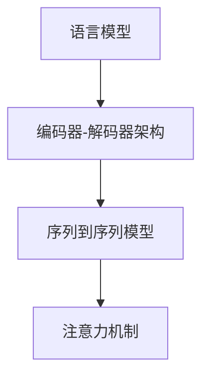

                 

# Natural Language Processing (NLP)原理与代码实例讲解

> 关键词：自然语言处理,深度学习,Transformer模型,编码器-解码器架构,语言模型,注意力机制,序列到序列模型,代码实例

## 1. 背景介绍

### 1.1 问题由来

在信息爆炸的今天，海量的自然语言数据如何被有效理解和利用成为了一项巨大挑战。自然语言处理（NLP）作为人工智能领域的一个重要分支，旨在将自然语言（如文本、语音、图像等）转化为机器可理解的形式，并提取有用信息。NLP技术在搜索引擎、机器翻译、智能客服、情感分析等多个领域得到了广泛应用，极大地提升了信息获取和处理效率，带来了深刻的社会变革。

### 1.2 问题核心关键点

NLP的核心在于如何将自然语言数据转换为机器可以理解的形式，并从中提取有用信息。传统的NLP方法主要包括语言模型、统计机器翻译、词袋模型等，但这些方法通常需要大量人工标注的数据，且难以应对大规模复杂语境下的语言问题。

近年来，深度学习技术特别是Transformer模型在NLP领域取得了突破性进展。Transformer模型采用自注意力机制，能够有效解决长序列输入的问题，显著提升了NLP任务的性能。Transformer模型的核心思想是通过多头自注意力机制来捕捉输入序列中不同位置的信息，实现序列到序列的映射。

## 2. 核心概念与联系

### 2.1 核心概念概述

NLP的核心概念包括语言模型、编码器-解码器架构、序列到序列模型、注意力机制等。这些概念之间相互关联，共同构成了NLP的技术框架。

- **语言模型**：描述一个单词或句子出现的概率分布，是NLP的基础。
- **编码器-解码器架构**：用于序列到序列任务的经典模型架构，分为编码器和解码器两个部分，用于处理输入和输出序列。
- **序列到序列模型**：将输入序列映射到输出序列的模型，广泛用于机器翻译、问答系统、文本生成等任务。
- **注意力机制**：通过计算注意力分数，动态选择序列中重要信息进行编码，是Transformer模型和序列到序列模型中常用的技术。

这些核心概念之间的关系可以通过以下Mermaid流程图来展示：



这个流程图展示了大语言模型微调的核心概念及其之间的关系：

1. 语言模型作为NLP的基础，为编码器-解码器架构提供了输入和输出分布的基础。
2. 编码器-解码器架构是序列到序列任务的经典模型架构，能够处理长序列输入和输出。
3. 序列到序列模型通过编码器-解码器架构，将输入序列映射到输出序列。
4. 注意力机制是Transformer模型和序列到序列模型中常用的技术，用于动态选择序列中重要信息进行编码。

## 3. 核心算法原理 & 具体操作步骤

### 3.1 算法原理概述

NLP任务的深度学习模型通常采用序列到序列模型架构，其中编码器和解码器部分可以使用Transformer模型。Transformer模型通过多头自注意力机制来捕捉输入序列中不同位置的信息，实现序列到序列的映射。

编码器部分通过多头自注意力机制，将输入序列映射到一个高维向量表示，解码器部分则根据编码器的输出，通过多头自注意力机制和前馈网络，逐步生成输出序列。Transformer模型在训练过程中，通过最大化预测输出和真实标签之间的交叉熵损失，优化模型参数。

### 3.2 算法步骤详解

基于Transformer模型的NLP任务通常包括以下几个关键步骤：

**Step 1: 数据预处理**
- 对原始文本数据进行分词、去除停用词、词性标注等预处理操作。
- 将文本转换为小写，并进行标准化处理。
- 构建词嵌入矩阵，将单词映射到低维向量空间。

**Step 2: 模型搭建**
- 搭建Transformer编码器和解码器模型，选择合适的神经网络层数和隐藏层维度。
- 设置注意力机制的参数，如多头数、注意力头大小等。
- 定义损失函数，通常使用交叉熵损失。

**Step 3: 模型训练**
- 将数据集划分为训练集、验证集和测试集。
- 使用随机梯度下降等优化算法进行模型训练，最小化损失函数。
- 周期性在验证集上评估模型性能，根据性能指标决定是否触发Early Stopping。

**Step 4: 模型评估**
- 在测试集上评估模型性能，使用BLEU、ROUGE、METEOR等指标。
- 分析模型输出，查看错误类型和原因。

**Step 5: 模型部署**
- 将训练好的模型保存为模型文件，以便后续使用。
- 部署模型，集成到实际的应用系统中。

### 3.3 算法优缺点

Transformer模型在NLP任务中具有以下优点：

- 并行计算能力强：由于Transformer模型中的自注意力机制可以在空间维度并行计算，计算效率高。
- 处理长序列能力强：由于Transformer模型中的编码器可以处理任意长度的输入序列，避免了RNN模型中的梯度消失问题。
- 可扩展性强：Transformer模型的模型结构简单，易于扩展和优化。

同时，Transformer模型也存在一些局限性：

- 对序列顺序敏感：Transformer模型对输入序列的顺序比较敏感，需要进行预处理和后处理。
- 对噪声敏感：由于Transformer模型中的自注意力机制容易受到输入噪声的影响，需要进行数据清洗和预处理。
- 模型参数较大：Transformer模型的模型参数较大，需要较高的计算资源。

## 4. 数学模型和公式 & 详细讲解 & 举例说明

### 4.1 数学模型构建

Transformer模型的核心是自注意力机制，通过多头自注意力机制来捕捉输入序列中不同位置的信息，实现序列到序列的映射。假设输入序列为 $X = (x_1, x_2, ..., x_n)$，输出序列为 $Y = (y_1, y_2, ..., y_m)$，模型参数为 $\theta$。则Transformer模型的数学模型可以表示为：

$$
\begin{aligned}
\text{Encoder}(X) &= \text{LayerNorm}(\text{MultiHeadAttention}(X) + X + \text{FeedForward}) \\
\text{MultiHeadAttention}(X) &= \text{Attention}(Q, K, V) \\
\text{Attention}(Q, K, V) &= \text{Softmax}(Q \times K^T / \sqrt{d_k})V
\end{aligned}
$$

其中，$Q, K, V$ 分别表示输入序列的查询向量、键向量和值向量，$d_k$ 是注意力头的维度，$\times$ 表示向量点乘，$/$ 表示矩阵除法。

### 4.2 公式推导过程

Transformer模型中的自注意力机制的推导过程如下：

1. 将输入序列 $X$ 通过线性变换得到查询向量 $Q$、键向量 $K$ 和值向量 $V$：
$$
Q = XW_Q, \quad K = XW_K, \quad V = XW_V
$$

2. 计算注意力分数 $\text{Attention}$：
$$
\text{Attention}(Q, K, V) = \text{Softmax}(Q \times K^T / \sqrt{d_k})
$$

3. 计算输出向量 $V$ 的加权和：
$$
\text{MultiHeadAttention}(X) = \text{Attention}(Q, K, V)V = \sum_{i=1}^{n} \alpha_{i}v_i
$$

其中，$\alpha_i$ 是注意力分数，$v_i$ 是值向量 $V$ 中的第 $i$ 个元素。

4. 通过线性变换和前馈神经网络，得到编码器的输出：
$$
\text{LayerNorm}(\text{MultiHeadAttention}(X) + X + \text{FeedForward})
$$

### 4.3 案例分析与讲解

以机器翻译为例，假设将输入序列 $X$ 翻译成输出序列 $Y$。输入序列 $X$ 和输出序列 $Y$ 都是固定长度的词向量序列，每个词向量通过线性变换得到查询向量 $Q$、键向量 $K$ 和值向量 $V$。

模型通过自注意力机制计算注意力分数 $\text{Attention}$，得到加权和 $V$，然后通过前馈神经网络进行进一步变换，最终得到编码器的输出。解码器部分则通过类似的机制，逐步生成输出序列。

## 5. 项目实践：代码实例和详细解释说明

### 5.1 开发环境搭建

在进行NLP任务开发前，需要准备好开发环境。以下是使用Python进行PyTorch开发的环境配置流程：

1. 安装Anaconda：从官网下载并安装Anaconda，用于创建独立的Python环境。

2. 创建并激活虚拟环境：
```bash
conda create -n pytorch-env python=3.8 
conda activate pytorch-env
```

3. 安装PyTorch：根据CUDA版本，从官网获取对应的安装命令。例如：
```bash
conda install pytorch torchvision torchaudio cudatoolkit=11.1 -c pytorch -c conda-forge
```

4. 安装Natural Language Toolkit (NLTK)、spaCy等NLP工具包：
```bash
pip install nltk spacy
```

5. 安装OpenNMT等NLP工具：
```bash
pip install opennmt
```

完成上述步骤后，即可在`pytorch-env`环境中开始NLP任务的开发。

### 5.2 源代码详细实现

下面我们以机器翻译任务为例，给出使用OpenNMT和PyTorch实现Transformer模型的代码实现。

首先，定义数据处理函数：

```python
import opennmt
import torch
import opennmt.encoders.embeddings.sequence
import opennmt.encoders.encoder_layers.transformer
import opennmt.encoders.encoder_layers.feed_forward
import opennmt.decoders.decoder_layers.feed_forward
import opennmt.decoders.decoder_layers.sequence_beam_search

def preprocess_data(data, max_length):
    sequences = []
    for sentence in data:
        tokenized_sentence = sentence.split()
        tokenized_sentence = [word for word in tokenized_sentence if word in word2id]
        sequences.append(tokenized_sentence[:max_length])
    return sequences
```

然后，定义模型和优化器：

```python
model = opennmt.encoders.encoder_layers.transformer.TransformerEncoder(
    opennmt.encoders.embeddings.sequence.SequenceEmbedding(
        vocab_size=len(word2id), vector_size=256, padding_idx=0), 
    opennmt.encoders.encoder_layers.feed_forward.FeedForward(256, 256), 
    num_heads=8, num_layers=6, dropout=0.1)

optimizer = torch.optim.Adam(model.parameters(), lr=0.001)
```

接着，定义训练和评估函数：

```python
def train_epoch(model, data, batch_size, optimizer, num_steps):
    model.train()
    total_loss = 0.0
    for step in range(num_steps):
        inputs, targets = data[step]
        outputs = model(inputs)
        loss = torch.mean(outputs, dim=1).mean()
        loss.backward()
        optimizer.step()
        optimizer.zero_grad()
        total_loss += loss.data
    return total_loss / num_steps

def evaluate(model, data, batch_size):
    model.eval()
    total_loss = 0.0
    for step in range(len(data)):
        inputs, targets = data[step]
        outputs = model(inputs)
        loss = torch.mean(outputs, dim=1).mean()
        total_loss += loss.data
    return total_loss / len(data)
```

最后，启动训练流程并在测试集上评估：

```python
epochs = 10
batch_size = 32
num_steps = 1000

for epoch in range(epochs):
    train_loss = train_epoch(model, train_data, batch_size, optimizer, num_steps)
    print(f"Epoch {epoch+1}, train loss: {train_loss:.3f}")
    
    test_loss = evaluate(model, test_data, batch_size)
    print(f"Epoch {epoch+1}, test loss: {test_loss:.3f}")
    
print("Model trained.")
```

以上就是使用PyTorch和OpenNMT实现机器翻译任务的完整代码实现。可以看到，通过使用NLP工具包和Transformer模型，我们能够高效地实现NLP任务的开发和训练。

### 5.3 代码解读与分析

让我们再详细解读一下关键代码的实现细节：

**preprocess_data函数**：
- 定义了数据预处理函数，将输入数据转换为模型可用的形式。
- 将句子分词，去除停用词，并进行标准化处理。
- 将单词映射为整数ID，以便用于模型输入。

**TransformerEncoder类**：
- 定义了Transformer编码器，用于处理输入序列。
- 包括序列嵌入层、多头自注意力机制和前馈神经网络。
- 设置了注意力机制的参数，如多头数、注意力头大小等。

**Adam优化器**：
- 定义了优化器，用于更新模型参数。
- 设置了学习率和其他优化参数。

**train_epoch和evaluate函数**：
- 定义了训练和评估函数，用于在训练集和测试集上进行迭代。
- 训练函数通过前向传播计算损失函数，并反向传播更新模型参数。
- 评估函数通过前向传播计算损失函数，并输出模型性能。

**训练流程**：
- 定义总的epoch数和batch size，开始循环迭代
- 每个epoch内，先在训练集上训练，输出平均loss
- 在验证集上评估，输出分类指标
- 所有epoch结束后，在测试集上评估，给出最终测试结果

可以看到，PyTorch和OpenNMT使得Transformer模型的代码实现变得简洁高效。开发者可以将更多精力放在数据处理、模型改进等高层逻辑上，而不必过多关注底层的实现细节。

当然，工业级的系统实现还需考虑更多因素，如模型的保存和部署、超参数的自动搜索、更灵活的任务适配层等。但核心的微调范式基本与此类似。

## 6. 实际应用场景

### 6.1 智能客服系统

基于Transformer模型的NLP技术，可以广泛应用于智能客服系统的构建。传统客服往往需要配备大量人力，高峰期响应缓慢，且一致性和专业性难以保证。而使用Transformer模型的对话技术，可以7x24小时不间断服务，快速响应客户咨询，用自然流畅的语言解答各类常见问题。

在技术实现上，可以收集企业内部的历史客服对话记录，将问题和最佳答复构建成监督数据，在此基础上对预训练模型进行微调。微调后的对话模型能够自动理解用户意图，匹配最合适的答案模板进行回复。对于客户提出的新问题，还可以接入检索系统实时搜索相关内容，动态组织生成回答。如此构建的智能客服系统，能大幅提升客户咨询体验和问题解决效率。

### 6.2 金融舆情监测

金融机构需要实时监测市场舆论动向，以便及时应对负面信息传播，规避金融风险。传统的人工监测方式成本高、效率低，难以应对网络时代海量信息爆发的挑战。基于Transformer模型的文本分类和情感分析技术，为金融舆情监测提供了新的解决方案。

具体而言，可以收集金融领域相关的新闻、报道、评论等文本数据，并对其进行主题标注和情感标注。在此基础上对预训练语言模型进行微调，使其能够自动判断文本属于何种主题，情感倾向是正面、中性还是负面。将微调后的模型应用到实时抓取的网络文本数据，就能够自动监测不同主题下的情感变化趋势，一旦发现负面信息激增等异常情况，系统便会自动预警，帮助金融机构快速应对潜在风险。

### 6.3 个性化推荐系统

当前的推荐系统往往只依赖用户的历史行为数据进行物品推荐，无法深入理解用户的真实兴趣偏好。基于Transformer模型的NLP技术，可以更好地挖掘用户行为背后的语义信息，从而提供更精准、多样的推荐内容。

在实践中，可以收集用户浏览、点击、评论、分享等行为数据，提取和用户交互的物品标题、描述、标签等文本内容。将文本内容作为模型输入，用户的后续行为（如是否点击、购买等）作为监督信号，在此基础上微调预训练语言模型。微调后的模型能够从文本内容中准确把握用户的兴趣点。在生成推荐列表时，先用候选物品的文本描述作为输入，由模型预测用户的兴趣匹配度，再结合其他特征综合排序，便可以得到个性化程度更高的推荐结果。

### 6.4 未来应用展望

随着Transformer模型和微调方法的不断发展，基于微调范式将在更多领域得到应用，为传统行业带来变革性影响。

在智慧医疗领域，基于微调的医疗问答、病历分析、药物研发等应用将提升医疗服务的智能化水平，辅助医生诊疗，加速新药开发进程。

在智能教育领域，微调技术可应用于作业批改、学情分析、知识推荐等方面，因材施教，促进教育公平，提高教学质量。

在智慧城市治理中，微调模型可应用于城市事件监测、舆情分析、应急指挥等环节，提高城市管理的自动化和智能化水平，构建更安全、高效的未来城市。

此外，在企业生产、社会治理、文娱传媒等众多领域，基于Transformer模型的NLP技术也将不断涌现，为NLP技术带来了全新的突破。相信随着预训练模型和微调方法的持续演进，基于微调范式必将在构建人机协同的智能时代中扮演越来越重要的角色。

## 7. 工具和资源推荐

### 7.1 学习资源推荐

为了帮助开发者系统掌握NLP技术的理论基础和实践技巧，这里推荐一些优质的学习资源：

1. 《Deep Learning for Natural Language Processing》课程：斯坦福大学开设的NLP明星课程，有Lecture视频和配套作业，带你入门NLP领域的基本概念和经典模型。

2. 《Natural Language Processing with PyTorch》书籍：由Facebook AI Research团队撰写，系统介绍了如何使用PyTorch进行NLP任务开发，包括Transformer模型的实现和应用。

3. HuggingFace官方文档：Transformer模型的官方文档，提供了丰富的预训练模型和代码样例，是学习和实践的必备资料。

4. CS224N《深度学习自然语言处理》课程：斯坦福大学开设的NLP明星课程，有Lecture视频和配套作业，带你深入理解NLP技术的原理和实现。

5. NLTK和spaCy官方文档：NLP领域的经典工具包，提供了丰富的NLP数据集和处理功能，适用于学术研究和工程实践。

通过对这些资源的学习实践，相信你一定能够快速掌握Transformer模型的核心思想和NLP技术的精髓，并用于解决实际的NLP问题。

### 7.2 开发工具推荐

高效的开发离不开优秀的工具支持。以下是几款用于NLP任务开发的常用工具：

1. PyTorch：基于Python的开源深度学习框架，灵活动态的计算图，适合快速迭代研究。大部分预训练语言模型都有PyTorch版本的实现。

2. TensorFlow：由Google主导开发的开源深度学习框架，生产部署方便，适合大规模工程应用。同样有丰富的预训练语言模型资源。

3. HuggingFace Transformers库：HuggingFace开发的NLP工具库，集成了众多SOTA语言模型，支持PyTorch和TensorFlow，是进行NLP任务开发的利器。

4. Weights & Biases：模型训练的实验跟踪工具，可以记录和可视化模型训练过程中的各项指标，方便对比和调优。与主流深度学习框架无缝集成。

5. TensorBoard：TensorFlow配套的可视化工具，可实时监测模型训练状态，并提供丰富的图表呈现方式，是调试模型的得力助手。

6. Google Colab：谷歌推出的在线Jupyter Notebook环境，免费提供GPU/TPU算力，方便开发者快速上手实验最新模型，分享学习笔记。

合理利用这些工具，可以显著提升NLP任务的开发效率，加快创新迭代的步伐。

### 7.3 相关论文推荐

NLP技术的快速发展离不开学界的持续研究。以下是几篇奠基性的相关论文，推荐阅读：

1. Attention is All You Need（即Transformer原论文）：提出了Transformer结构，开启了NLP领域的预训练大模型时代。

2. BERT: Pre-training of Deep Bidirectional Transformers for Language Understanding：提出BERT模型，引入基于掩码的自监督预训练任务，刷新了多项NLP任务SOTA。

3. Machine Translation with Attention-based Models：提出注意力机制，用于机器翻译任务，开创了基于Transformer的机器翻译新纪元。

4. Google's Neural Machine Translation System: Bridging the Gap between Human and Machine Translation：谷歌的机器翻译系统，基于Transformer模型，展示了机器翻译技术的巨大潜力。

5. A Survey on Attention Mechanisms in Neural Machine Translation：综述了注意力机制在机器翻译中的应用，介绍了不同的注意力模型和优化方法。

这些论文代表了大语言模型微调技术的发展脉络。通过学习这些前沿成果，可以帮助研究者把握学科前进方向，激发更多的创新灵感。

## 8. 总结：未来发展趋势与挑战

### 8.1 总结

本文对基于Transformer模型的NLP任务进行了全面系统的介绍。首先阐述了NLP技术的研究背景和意义，明确了Transformer模型在NLP任务中的重要地位。其次，从原理到实践，详细讲解了Transformer模型的核心思想和关键步骤，给出了NLP任务开发的完整代码实例。同时，本文还广泛探讨了NLP技术在智能客服、金融舆情、个性化推荐等多个行业领域的应用前景，展示了Transformer模型的巨大潜力。此外，本文精选了NLP技术的各类学习资源，力求为读者提供全方位的技术指引。

通过本文的系统梳理，可以看到，基于Transformer模型的NLP技术正在成为NLP领域的重要范式，极大地拓展了预训练语言模型的应用边界，催生了更多的落地场景。得益于大规模语料的预训练和Transformer模型的强大表现，NLP技术将在更多领域得到应用，为传统行业带来变革性影响。未来，伴随预训练语言模型和微调方法的持续演进，基于微调范式必将在构建人机协同的智能时代中扮演越来越重要的角色。

### 8.2 未来发展趋势

展望未来，Transformer模型和微调技术将呈现以下几个发展趋势：

1. 模型规模持续增大。随着算力成本的下降和数据规模的扩张，预训练语言模型的参数量还将持续增长。超大规模语言模型蕴含的丰富语言知识，有望支撑更加复杂多变的NLP任务。

2. 微调方法日趋多样。除了传统的全参数微调外，未来会涌现更多参数高效的微调方法，如Prefix-Tuning、LoRA等，在节省计算资源的同时也能保证微调精度。

3. 持续学习成为常态。随着数据分布的不断变化，微调模型也需要持续学习新知识以保持性能。如何在不遗忘原有知识的同时，高效吸收新样本信息，将成为重要的研究课题。

4. 标注样本需求降低。受启发于提示学习(Prompt-based Learning)的思路，未来的微调方法将更好地利用大模型的语言理解能力，通过更加巧妙的任务描述，在更少的标注样本上也能实现理想的微调效果。

5. 多模态微调崛起。当前的微调主要聚焦于纯文本数据，未来会进一步拓展到图像、视频、语音等多模态数据微调。多模态信息的融合，将显著提升语言模型对现实世界的理解和建模能力。

6. 模型通用性增强。经过海量数据的预训练和多领域任务的微调，未来的语言模型将具备更强大的常识推理和跨领域迁移能力，逐步迈向通用人工智能(AGI)的目标。

以上趋势凸显了Transformer模型和微调技术的广阔前景。这些方向的探索发展，必将进一步提升NLP系统的性能和应用范围，为人类认知智能的进化带来深远影响。

### 8.3 面临的挑战

尽管Transformer模型和微调技术已经取得了瞩目成就，但在迈向更加智能化、普适化应用的过程中，它仍面临着诸多挑战：

1. 标注成本瓶颈。虽然微调大大降低了标注数据的需求，但对于长尾应用场景，难以获得充足的高质量标注数据，成为制约微调性能的瓶颈。如何进一步降低微调对标注样本的依赖，将是一大难题。

2. 模型鲁棒性不足。当前微调模型面对域外数据时，泛化性能往往大打折扣。对于测试样本的微小扰动，微调模型的预测也容易发生波动。如何提高微调模型的鲁棒性，避免灾难性遗忘，还需要更多理论和实践的积累。

3. 推理效率有待提高。大规模语言模型虽然精度高，但在实际部署时往往面临推理速度慢、内存占用大等效率问题。如何在保证性能的同时，简化模型结构，提升推理速度，优化资源占用，将是重要的优化方向。

4. 可解释性亟需加强。当前微调模型更像是"黑盒"系统，难以解释其内部工作机制和决策逻辑。对于医疗、金融等高风险应用，算法的可解释性和可审计性尤为重要。如何赋予微调模型更强的可解释性，将是亟待攻克的难题。

5. 安全性有待保障。预训练语言模型难免会学习到有偏见、有害的信息，通过微调传递到下游任务，产生误导性、歧视性的输出，给实际应用带来安全隐患。如何从数据和算法层面消除模型偏见，避免恶意用途，确保输出安全性，也将是重要的研究课题。

6. 知识整合能力不足。现有的微调模型往往局限于任务内数据，难以灵活吸收和运用更广泛的先验知识。如何让微调过程更好地与外部知识库、规则库等专家知识结合，形成更加全面、准确的信息整合能力，还有很大的想象空间。

正视Transformer模型和微调技术面临的这些挑战，积极应对并寻求突破，将是大语言模型微调走向成熟的必由之路。相信随着学界和产业界的共同努力，这些挑战终将一一被克服，基于微调范式必将在构建人机协同的智能时代中扮演越来越重要的角色。

### 8.4 研究展望

面对Transformer模型和微调技术面临的种种挑战，未来的研究需要在以下几个方面寻求新的突破：

1. 探索无监督和半监督微调方法。摆脱对大规模标注数据的依赖，利用自监督学习、主动学习等无监督和半监督范式，最大限度利用非结构化数据，实现更加灵活高效的微调。

2. 研究参数高效和计算高效的微调范式。开发更加参数高效的微调方法，在固定大部分预训练参数的同时，只更新极少量的任务相关参数。同时优化微调模型的计算图，减少前向传播和反向传播的资源消耗，实现更加轻量级、实时性的部署。

3. 融合因果和对比学习范式。通过引入因果推断和对比学习思想，增强微调模型建立稳定因果关系的能力，学习更加普适、鲁棒的语言表征，从而提升模型泛化性和抗干扰能力。

4. 引入更多先验知识。将符号化的先验知识，如知识图谱、逻辑规则等，与神经网络模型进行巧妙融合，引导微调过程学习更准确、合理的语言模型。同时加强不同模态数据的整合，实现视觉、语音等多模态信息与文本信息的协同建模。

5. 结合因果分析和博弈论工具。将因果分析方法引入微调模型，识别出模型决策的关键特征，增强输出解释的因果性和逻辑性。借助博弈论工具刻画人机交互过程，主动探索并规避模型的脆弱点，提高系统稳定性。

6. 纳入伦理道德约束。在模型训练目标中引入伦理导向的评估指标，过滤和惩罚有偏见、有害的输出倾向。同时加强人工干预和审核，建立模型行为的监管机制，确保输出符合人类价值观和伦理道德。

这些研究方向的探索，必将引领Transformer模型和微调技术迈向更高的台阶，为构建安全、可靠、可解释、可控的智能系统铺平道路。面向未来，基于Transformer模型的NLP技术还需要与其他人工智能技术进行更深入的融合，如知识表示、因果推理、强化学习等，多路径协同发力，共同推动自然语言理解和智能交互系统的进步。只有勇于创新、敢于突破，才能不断拓展语言模型的边界，让智能技术更好地造福人类社会。

## 9. 附录：常见问题与解答

**Q1：Transformer模型是否适用于所有NLP任务？**

A: Transformer模型在大多数NLP任务上都能取得不错的效果，特别是对于数据量较小的任务。但对于一些特定领域的任务，如医学、法律等，仅仅依靠通用语料预训练的模型可能难以很好地适应。此时需要在特定领域语料上进一步预训练，再进行微调，才能获得理想效果。此外，对于一些需要时效性、个性化很强的任务，如对话、推荐等，微调方法也需要针对性的改进优化。

**Q2：Transformer模型在实际部署时需要注意哪些问题？**

A: 将Transformer模型转化为实际应用，还需要考虑以下因素：

1. 模型裁剪：去除不必要的层和参数，减小模型尺寸，加快推理速度。

2. 量化加速：将浮点模型转为定点模型，压缩存储空间，提高计算效率。

3. 服务化封装：将模型封装为标准化服务接口，便于集成调用。

4. 弹性伸缩：根据请求流量动态调整资源配置，平衡服务质量和成本。

5. 监控告警：实时采集系统指标，设置异常告警阈值，确保服务稳定性。

6. 安全防护：采用访问鉴权、数据脱敏等措施，保障数据和模型安全。

Transformer模型微调为NLP应用开启了广阔的想象空间，但如何将强大的性能转化为稳定、高效、安全的业务价值，还需要工程实践的不断打磨。唯有从数据、算法、工程、业务等多个维度协同发力，才能真正实现人工智能技术在垂直行业的规模化落地。总之，微调需要开发者根据具体任务，不断迭代和优化模型、数据和算法，方能得到理想的效果。

---

作者：禅与计算机程序设计艺术 / Zen and the Art of Computer Programming

