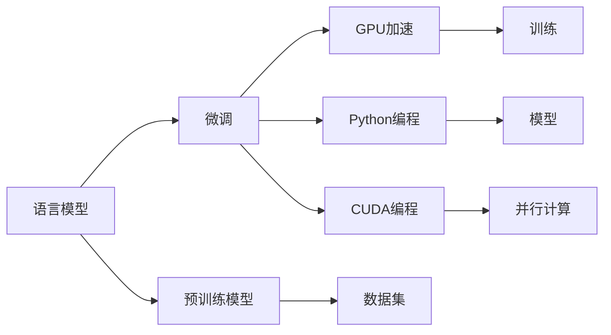

                 

## 1. 背景介绍

在人工智能(AI)领域，语言模型(Language Models)已经成为了一个重要研究方向。语言模型能够对自然语言进行处理，包括语言生成、文本分类、机器翻译等任务，极大地推动了NLP技术的发展。本文将介绍从零开始构建语言模型，重点讨论使用Python、C和CUDA实现语言模型。

## 2. 核心概念与联系

### 2.1 核心概念概述

1. **语言模型(Language Model)**：语言模型是一种概率模型，它能够根据已知的语言序列预测下一个词或一个短句出现的概率。语言模型的应用广泛，如机器翻译、文本生成、对话系统等。

2. **预训练模型(Pre-trained Models)**：预训练模型是指在无标签的大规模文本数据上训练的模型，通常用于初始化语言模型，以提高模型的泛化能力。

3. **微调(Fine-tuning)**：微调是指在预训练模型的基础上，使用小规模的带标签数据进行进一步的训练，以适应特定任务。

4. **GPU加速(GPU Acceleration)**：使用GPU硬件加速可以大幅提高模型训练和推理的速度，适用于大规模和高并发的计算任务。

5. **CUDA(CUDA Programming)**：CUDA是NVIDIA开发的一种用于GPU编程的并行计算平台，能够充分利用GPU的并行处理能力。

6. **Python(Programming Language)**：Python是一种高级编程语言，简单易学，且拥有丰富的科学计算和机器学习库，是构建语言模型的常用语言。

7. **模型训练(Training)**：模型训练是指使用数据集对模型进行参数优化，以提高模型的预测能力。

### 2.2 核心概念原理和架构的 Mermaid 流程图



这个流程图展示了语言模型从预训练到微调再到训练和应用的过程。预训练模型提供初始化的权重，微调过程通过小规模带标签数据进行进一步训练，GPU加速和CUDA编程用于提高计算效率，Python用于模型的实现和训练，最后应用到各种NLP任务中。

## 3. 核心算法原理 & 具体操作步骤

### 3.1 算法原理概述

语言模型的构建主要基于统计语言模型和神经网络模型。统计语言模型通过计算已知序列的概率来预测下一个词，如n-gram模型。神经网络语言模型则通过训练一个神经网络来预测下一个词。

神经网络语言模型的训练通常采用最大似然估计法(Maximum Likelihood Estimation, MLE)，即最大化给定上下文情况下下一个词的条件概率：

$$
\arg\max_{\theta} \prod_{i=1}^{N} P(w_i | w_{i-1}, \ldots, w_1; \theta)
$$

其中，$N$ 为序列长度，$w_i$ 为第$i$个词，$\theta$ 为模型参数。

神经网络语言模型通常采用循环神经网络(RNN)或长短时记忆网络(LSTM)，这些模型通过反向传播算法(Backpropagation Through Time, BPTT)计算梯度，更新模型参数。

### 3.2 算法步骤详解

#### 3.2.1 数据预处理

数据预处理是构建语言模型的第一步，包括文本清洗、分词、向量化等步骤。

1. **文本清洗**：去除文本中的噪声，如HTML标签、特殊符号等。

2. **分词**：将文本分割成词或子词，可以使用分词库，如jieba、NLTK等。

3. **向量化**：将文本转换为数值向量，可以使用词嵌入模型，如Word2Vec、GloVe等。

#### 3.2.2 构建模型

模型构建包括选择模型架构、定义损失函数、设置超参数等步骤。

1. **模型架构**：选择合适的神经网络架构，如RNN、LSTM、Transformer等。

2. **损失函数**：定义模型预测与真实标签之间的差异，如交叉熵损失、负对数似然损失等。

3. **超参数**：设置学习率、批大小、迭代轮数等超参数，影响模型的训练效果。

#### 3.2.3 训练模型

模型训练是指使用数据集对模型进行参数优化，以提高模型的预测能力。

1. **初始化模型**：将模型参数随机初始化，如使用Xavier初始化。

2. **前向传播**：将输入文本通过模型，计算预测概率。

3. **反向传播**：计算损失函数对模型参数的梯度，更新模型参数。

4. **优化器**：选择优化算法，如SGD、Adam等，更新模型参数。

#### 3.2.4 微调模型

微调是指在预训练模型的基础上，使用小规模带标签数据进行进一步的训练，以适应特定任务。

1. **冻结部分参数**：只更新模型的顶层参数，保持预训练模型的权重不变。

2. **设置学习率**：选择较小的学习率，以免破坏预训练的权重。

3. **正则化**：使用正则化技术，如L2正则、Dropout等，防止模型过拟合。

4. **数据增强**：通过回译、近义替换等方式扩充训练集。

5. **评估模型**：在验证集上评估模型的性能，根据性能指标决定是否继续训练。

### 3.3 算法优缺点

#### 3.3.1 优点

1. **泛化能力强**：预训练模型在大量无标签数据上学习语言知识，能够很好地泛化到新任务。

2. **计算效率高**：GPU加速和CUDA编程能够大幅提高模型训练和推理的速度。

3. **灵活性高**：Python和C语言结合，能够灵活实现各种模型和算法。

#### 3.3.2 缺点

1. **资源消耗大**：大规模预训练模型需要大量的计算资源，如GPU、内存等。

2. **训练时间长**：大规模模型的训练时间较长，可能需要多天甚至几周。

3. **可解释性差**：神经网络模型缺乏可解释性，难以理解模型内部工作机制。

### 3.4 算法应用领域

语言模型在NLP领域有广泛的应用，如文本分类、情感分析、机器翻译、文本生成等。在实际应用中，可以根据具体任务选择不同的模型架构和训练策略。

## 4. 数学模型和公式 & 详细讲解 & 举例说明

### 4.1 数学模型构建

#### 4.1.1 神经网络语言模型

神经网络语言模型由输入层、隐藏层和输出层组成。假设输入序列为$w_{1:T}$，输出为$y$，模型参数为$\theta$，则模型的输出概率为：

$$
P(y | w_{1:T}; \theta) = \frac{\exp(\log(\text{softmax}(\text{LSTM}(w_{1:T}; \theta)))}{\sum_{y' \in \mathcal{Y}} \exp(\log(\text{softmax}(\text{LSTM}(w_{1:T}; \theta)))}
$$

其中，$\text{softmax}$函数将隐藏层的输出转换为概率分布，$\text{LSTM}$函数表示长短时记忆网络。

### 4.2 公式推导过程

#### 4.2.1 交叉熵损失函数

交叉熵损失函数定义为：

$$
\mathcal{L} = -\frac{1}{N} \sum_{i=1}^{N} \sum_{j=1}^{V} y_j \log \hat{y}_j
$$

其中，$N$ 为样本数，$V$ 为词汇表大小，$y$ 为真实标签，$\hat{y}$ 为模型预测的概率分布。

### 4.3 案例分析与讲解

以一个简单的LSTM语言模型为例，分析其训练过程。

1. **初始化模型**：将模型参数随机初始化，如使用Xavier初始化。

2. **前向传播**：将输入序列通过模型，计算预测概率。

3. **计算损失**：计算交叉熵损失，$L = -\frac{1}{N} \sum_{i=1}^{N} \log(\hat{y}_i)$。

4. **反向传播**：计算损失函数对模型参数的梯度，$\nabla_{\theta} L$。

5. **更新参数**：使用优化算法，如Adam，更新模型参数，$\theta \leftarrow \theta - \eta \nabla_{\theta} L$。

6. **迭代训练**：重复上述步骤，直到模型收敛。

## 5. 项目实践：代码实例和详细解释说明

### 5.1 开发环境搭建

#### 5.1.1 安装Python

Python是构建语言模型的常用语言，可以使用Anaconda或Miniconda进行安装。

```bash
wget https://repo.anaconda.com/miniconda/Miniconda3-latest-Linux-x86_64.sh
bash Miniconda3-latest-Linux-x86_64.sh
source ~/.bashrc
conda init
```

#### 5.1.2 安装依赖包

安装必要的依赖包，如TensorFlow、PyTorch、Keras等。

```bash
conda install tensorflow
conda install pytorch torchvision torchaudio -c pytorch
conda install keras
```

### 5.2 源代码详细实现

#### 5.2.1 数据预处理

```python
import jieba
import numpy as np
from tensorflow.keras.preprocessing.text import Tokenizer
from tensorflow.keras.preprocessing.sequence import pad_sequences

# 分词
texts = jieba.lcut(text, cut_all=False)

# 构建词典
tokenizer = Tokenizer()
tokenizer.fit_on_texts(texts)

# 序列化
sequences = tokenizer.texts_to_sequences(texts)

# 填充序列
maxlen = max(len(seq) for seq in sequences)
padded_sequences = pad_sequences(sequences, maxlen=maxlen, padding='post', truncating='post')
```

#### 5.2.2 构建模型

```python
from tensorflow.keras.models import Sequential
from tensorflow.keras.layers import Embedding, LSTM, Dense

# 构建模型
model = Sequential([
    Embedding(input_dim=vocab_size, output_dim=embedding_dim, input_length=maxlen),
    LSTM(units=128),
    Dense(units=num_classes, activation='softmax')
])

# 编译模型
model.compile(optimizer='adam', loss='categorical_crossentropy', metrics=['accuracy'])
```

#### 5.2.3 训练模型

```python
# 训练模型
model.fit(x_train, y_train, epochs=10, batch_size=32, validation_data=(x_val, y_val))
```

#### 5.2.4 微调模型

```python
from tensorflow.keras.models import Model

# 冻结部分参数
base_model = Model(inputs=model.input, outputs=model.layers[-2].output)
base_model.trainable = False

# 构建微调模型
final_model = Model(inputs=model.input, outputs=model.output)

# 设置学习率
lr = 0.01

# 微调模型
final_model.compile(optimizer=SGD(lr=lr), loss='categorical_crossentropy', metrics=['accuracy'])
final_model.fit(x_train, y_train, epochs=5, batch_size=32, validation_data=(x_val, y_val))
```

### 5.3 代码解读与分析

#### 5.3.1 数据预处理

1. **分词**：使用jieba库进行中文分词，将文本分割成词或子词。

2. **构建词典**：使用Keras的Tokenizer类构建词典，将文本序列化为数值向量。

3. **填充序列**：使用pad_sequences函数填充序列，使其长度一致。

#### 5.3.2 构建模型

1. **Embedding层**：将文本转换为向量表示，每个词嵌入到一个固定大小的向量中。

2. **LSTM层**：使用长短时记忆网络进行序列建模。

3. **输出层**：使用Dense层进行分类，输出每个类别的概率。

#### 5.3.3 训练模型

1. **编译模型**：使用Keras的compile函数编译模型，指定优化器、损失函数和评估指标。

2. **训练模型**：使用fit函数训练模型，指定训练数据、验证数据、迭代次数、批大小等参数。

#### 5.3.4 微调模型

1. **冻结部分参数**：使用Keras的Model类冻结部分参数，保持预训练模型的权重不变。

2. **构建微调模型**：使用Model类构建微调模型，指定输入和输出。

3. **设置学习率**：设置较小的学习率，以免破坏预训练的权重。

4. **微调模型**：使用fit函数微调模型，指定训练数据、验证数据、迭代次数、批大小等参数。

### 5.4 运行结果展示

训练过程中，可以使用TensorBoard进行模型可视化，了解模型的训练状态和性能指标。

```python
from tensorflow.keras.callbacks import TensorBoard

# 记录TensorBoard日志
tensorboard = TensorBoard(log_dir='logs')
model.fit(x_train, y_train, epochs=10, batch_size=32, validation_data=(x_val, y_val), callbacks=[tensorboard])
```

## 6. 实际应用场景

### 6.1 智能客服系统

智能客服系统可以应用于在线客服、呼叫中心等场景，提升客户体验和效率。使用预训练的语言模型进行微调，可以构建智能问答系统，自动回答客户的常见问题，提升客服系统的智能化水平。

### 6.2 金融舆情监测

金融舆情监测系统可以实时监测社交媒体、新闻网站等渠道的舆情变化，帮助金融机构及时应对市场风险。使用预训练的语言模型进行微调，可以构建情感分析系统，自动识别舆情中的正面、负面和中性情绪，及时预警风险。

### 6.3 个性化推荐系统

个性化推荐系统可以推荐用户可能感兴趣的产品、内容等。使用预训练的语言模型进行微调，可以构建用户画像系统，根据用户的历史行为和兴趣，推荐符合用户偏好的内容。

### 6.4 未来应用展望

未来，随着深度学习技术的发展，语言模型将在更多领域得到应用，如智慧医疗、智慧教育、智慧城市等。语言模型可以构建智能助手、智能监控系统、智能交通系统等，提升各行各业的智能化水平。

## 7. 工具和资源推荐

### 7.1 学习资源推荐

1. **《深度学习》书籍**：由Ian Goodfellow等人编写，全面介绍了深度学习的基本概念和常用技术。

2. **《TensorFlow实战Google深度学习框架》书籍**：由李沐等人编写，介绍了TensorFlow的使用方法和实践案例。

3. **《Keras实战深度学习》书籍**：由Vahid Mirjalili等人编写，介绍了Keras的使用方法和实践案例。

4. **《自然语言处理》课程**：由斯坦福大学开设的NLP课程，涵盖NLP的基本概念和常用技术。

5. **《Python机器学习》课程**：由Andreas C. Müller等人编写，介绍了Python在机器学习中的应用方法和实践案例。

### 7.2 开发工具推荐

1. **Anaconda**：Python发行版，支持科学计算和机器学习库的安装和更新。

2. **Jupyter Notebook**：Python的交互式开发环境，支持代码编写、可视化展示和交互式计算。

3. **TensorBoard**：TensorFlow配套的可视化工具，支持模型训练和推理过程的可视化。

4. **Keras Tuner**：Keras的超参数优化库，支持自动搜索最优超参数配置。

5. **PyTorch Lightning**：PyTorch的模型训练框架，支持模型自动化训练和部署。

### 7.3 相关论文推荐

1. **《Attention is All You Need》论文**：由Google大脑团队发表，提出了Transformer模型，开启了NLP领域的预训练大模型时代。

2. **《BERT: Pre-training of Deep Bidirectional Transformers for Language Understanding》论文**：由Google团队发表，提出了BERT模型，刷新了多项NLP任务SOTA。

3. **《Language Models are Unsupervised Multitask Learners》论文**：由OpenAI团队发表，展示了大语言模型的强大zero-shot学习能力。

4. **《AdaLoRA: Adaptive Low-Rank Adaptation for Parameter-Efficient Fine-Tuning》论文**：由CMU团队发表，提出了AdaLoRA方法，使用自适应低秩适应的微调方法，提高微调效率和精度。

## 8. 总结：未来发展趋势与挑战

### 8.1 研究成果总结

从预训练模型到微调模型，语言模型的构建过程经历了从简单到复杂、从易到难的发展历程。目前，预训练模型已经成为了NLP领域的重要工具，广泛应用于各种任务。微调技术进一步提高了模型的泛化能力和适应性，使其能够更好地适应特定任务。

### 8.2 未来发展趋势

1. **预训练模型规模扩大**：随着计算资源的增加，预训练模型将越来越庞大，能够学习更多的语言知识。

2. **微调技术优化**：未来的微调技术将更加高效、参数更少，能够适应更多规模和类型的任务。

3. **模型应用多样化**：语言模型将应用于更多领域，如医疗、金融、教育等，推动这些行业的智能化进程。

### 8.3 面临的挑战

1. **资源消耗大**：大规模预训练模型需要大量的计算资源，如GPU、内存等。

2. **训练时间长**：大规模模型的训练时间较长，可能需要多天甚至几周。

3. **可解释性差**：神经网络模型缺乏可解释性，难以理解模型内部工作机制。

### 8.4 研究展望

1. **模型压缩与优化**：如何高效压缩和优化大规模预训练模型，减小计算资源消耗，是未来的研究重点。

2. **模型解释性提升**：如何提升神经网络模型的可解释性，使其能够更好地解释输出结果，是未来的研究难点。

3. **模型迁移能力增强**：如何增强模型的跨领域迁移能力，使其能够更好地适应新的数据和任务，是未来的研究方向。

## 9. 附录：常见问题与解答

### 9.1 Q1: 大语言模型微调是否适用于所有NLP任务？

A: 大语言模型微调在大多数NLP任务上都能取得不错的效果，特别是对于数据量较小的任务。但对于一些特定领域的任务，如医学、法律等，仅仅依靠通用语料预训练的模型可能难以很好地适应。此时需要在特定领域语料上进一步预训练，再进行微调，才能获得理想效果。此外，对于一些需要时效性、个性化很强的任务，如对话、推荐等，微调方法也需要针对性的改进优化。

### 9.2 Q2: 微调过程中如何选择合适的学习率？

A: 微调的学习率一般要比预训练时小1-2个数量级，如果使用过大的学习率，容易破坏预训练的权重，导致过拟合。一般建议从1e-5开始调参，逐步减小学习率，直至收敛。也可以使用warmup策略，在开始阶段使用较小的学习率，再逐渐过渡到预设值。需要注意的是，不同的优化器(如AdamW、Adafactor等)以及不同的学习率调度策略，可能需要设置不同的学习率阈值。

### 9.3 Q3: 采用大模型微调时会面临哪些资源瓶颈？

A: 目前主流的预训练大模型动辄以亿计的参数规模，对算力、内存、存储都提出了很高的要求。GPU/TPU等高性能设备是必不可少的，但即便如此，超大批次的训练和推理也可能遇到显存不足的问题。因此需要采用一些资源优化技术，如梯度积累、混合精度训练、模型并行等，来突破硬件瓶颈。同时，模型的存储和读取也可能占用大量时间和空间，需要采用模型压缩、稀疏化存储等方法进行优化。

### 9.4 Q4: 如何缓解微调过程中的过拟合问题？

A: 过拟合是微调面临的主要挑战，尤其是在标注数据不足的情况下。常见的缓解策略包括：
1. 数据增强：通过回译、近义替换等方式扩充训练集
2. 正则化：使用L2正则、Dropout、Early Stopping等避免过拟合
3. 对抗训练：引入对抗样本，提高模型鲁棒性
4. 参数高效微调：只调整少量参数(如Adapter、Prefix等)，减小过拟合风险
5. 多模型集成：训练多个微调模型，取平均输出，抑制过拟合

这些策略往往需要根据具体任务和数据特点进行灵活组合。只有在数据、模型、训练、推理等各环节进行全面优化，才能最大限度地发挥大模型微调的威力。

### 9.5 Q5: 微调模型在落地部署时需要注意哪些问题？

A: 将微调模型转化为实际应用，还需要考虑以下因素：
1. 模型裁剪：去除不必要的层和参数，减小模型尺寸，加快推理速度
2. 量化加速：将浮点模型转为定点模型，压缩存储空间，提高计算效率
3. 服务化封装：将模型封装为标准化服务接口，便于集成调用
4. 弹性伸缩：根据请求流量动态调整资源配置，平衡服务质量和成本
5. 监控告警：实时采集系统指标，设置异常告警阈值，确保服务稳定性
6. 安全防护：采用访问鉴权、数据脱敏等措施，保障数据和模型安全

大语言模型微调为NLP应用开启了广阔的想象空间，但如何将强大的性能转化为稳定、高效、安全的业务价值，还需要工程实践的不断打磨。唯有从数据、算法、工程、业务等多个维度协同发力，才能真正实现人工智能技术在垂直行业的规模化落地。

总之，微调需要开发者根据具体任务，不断迭代和优化模型、数据和算法，方能得到理想的效果。

---

作者：禅与计算机程序设计艺术 / Zen and the Art of Computer Programming

