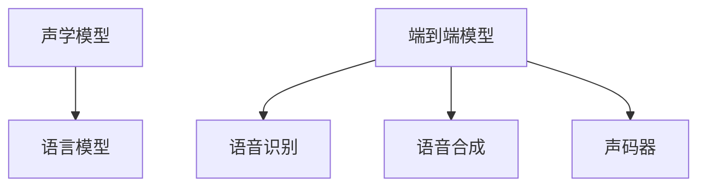

                 

# Python深度学习实践：实时语音转换技术探索

> 关键词：深度学习,语音识别,语音合成,声学模型,语言模型,端到端

## 1. 背景介绍

### 1.1 问题由来
近年来，随着深度学习技术在语音处理领域的应用深入，语音识别和语音合成技术取得了长足进步。实时语音转换技术，即在无需将语音转化为文本，直接通过端到端模型进行语音转换，已成为语音处理领域的一个研究热点。相比于传统的文本到语音(TTS)，直接语音转换可以避免额外的文本转换步骤，提升转换效率，同时也能保留语音信号的原始自然性。

### 1.2 问题核心关键点
实时语音转换技术融合了声学模型和语言模型，通过端到端架构直接将语音信号映射为目标语言语音，具有较高的技术难度和挑战性。其关键点包括：

- 声学建模：从输入语音信号中提取其声学特征，如MFCC等，用于识别语音中的声学信息。
- 语言建模：将声学特征序列转化为目标语言文本序列，需考虑语音的自然流畅性。
- 端到端学习：在保证准确性的前提下，提升实时性，减少计算资源消耗。
- 实时语音转换：在短时间内完成高质量的语音转换，满足实时应用需求。

### 1.3 问题研究意义
实时语音转换技术在多种实际应用中都有广泛需求，如：

- 实时语音翻译：无需等待转写，即可实时翻译外语语音，满足多语言交流需求。
- 同声传译：通过实时语音转换，辅助专业翻译人员或辅助会议记录。
- 个性化语音合成：结合用户个性化的发音特点和语调，生成个性化语音回复。
- 声纹识别：在无需事先采集用户语音样本的情况下，实时验证用户身份。
- 游戏语音合成：通过实时语音转换，使虚拟角色具备自然流畅的语音能力。

实时语音转换技术的应用将为智能交互、多语言沟通、个性化服务等领域带来深远影响。同时，语音转换技术也将在人机交互、智能客服、医疗健康等新兴领域发挥重要作用。

## 2. 核心概念与联系

### 2.1 核心概念概述

为更好地理解实时语音转换技术的核心原理和架构，本节将介绍几个关键概念：

- 声学模型(Acoustic Model)：从语音信号中提取声学特征，并建立声学特征与文本之间的映射关系。
- 语言模型(Language Model)：对文本序列进行建模，学习语言的概率分布。
- 端到端模型(End-to-End Model)：将声学模型和语言模型融合，直接从语音信号到目标语音信号，无需显式的文本中间表示。
- 语音识别(ASR)：将语音信号转换为文本，是语音转换的逆过程。
- 语音合成(TTS)：将文本转换为语音，是语音转换的另一重要组成部分。
- 声码器(Vocoder)：生成目标语音信号，是实时语音转换的重要组成部分。

这些概念之间的逻辑关系可以通过以下Mermaid流程图来展示：



这个流程图展示了一系列语音转换技术的核心概念及其之间的联系：

1. 声学模型从语音信号中提取特征。
2. 语言模型对文本序列进行建模。
3. 端到端模型将声学特征映射到目标语音。
4. 语音识别将语音信号转换为文本。
5. 语音合成将文本转换为语音。
6. 声码器生成目标语音信号。

这些概念共同构成了实时语音转换技术的完整框架，是其研究的基石。

## 3. 核心算法原理 & 具体操作步骤
### 3.1 算法原理概述

实时语音转换技术的核心思想是通过端到端架构，直接将输入语音信号映射为目标语言语音，而无需显式的文本中间表示。其核心算法包括声学模型、语言模型和声码器。

**声学模型**：使用深度神经网络对声学特征进行建模，如CNN、RNN等。其主要任务是将语音信号转化为声学特征序列，以便后续处理。常用的声学特征包括MFCC、梅尔频谱、线性预测编码等。

**语言模型**：使用深度神经网络对文本序列进行建模，学习文本的概率分布。其主要任务是将声学特征序列转化为目标文本序列，以保证语音转换的自然流畅性。常用的语言模型包括RNN、LSTM、Transformer等。

**声码器**：使用深度神经网络对目标语音信号进行建模，生成高质量的目标语音。其主要任务是将声学特征序列转化为目标语音信号，常用的声码器包括GAN、WaveNet、Tacotron2等。

### 3.2 算法步骤详解

实时语音转换技术通常包含以下关键步骤：

**Step 1: 数据预处理**
- 收集大量语音数据，并对数据进行清洗、标注。
- 提取声学特征，如MFCC等。
- 将声学特征序列与对应的文本序列拼接，形成训练样本。

**Step 2: 声学模型训练**
- 使用深度神经网络，对声学特征进行建模，训练声学模型。
- 将训练好的声学模型保存，用于后续的语音转换。

**Step 3: 语言模型训练**
- 使用深度神经网络，对文本序列进行建模，训练语言模型。
- 将训练好的语言模型保存，用于后续的语音转换。

**Step 4: 声码器训练**
- 使用深度神经网络，对目标语音信号进行建模，训练声码器。
- 将训练好的声码器保存，用于后续的语音转换。

**Step 5: 端到端模型训练**
- 将声学模型、语言模型和声码器结合起来，训练端到端模型。
- 使用端到端模型进行实时语音转换，输出目标语音信号。

### 3.3 算法优缺点

实时语音转换技术相比传统的文本到语音(TTS)技术有以下优点：

1. 转换效率高：实时语音转换避免了文本转换的步骤，直接对语音信号进行处理，极大提升了转换速度。
2. 自然性更好：实时语音转换能够保留语音的自然流畅性，避免文本转换带来的断断续续感。
3. 实时性更强：实时语音转换技术可以满足实时应用的需求，如实时翻译、同声传译等。

同时，也存在以下缺点：

1. 数据需求高：实时语音转换需要大量高质量的语音和文本数据，获取成本较高。
2. 模型复杂度高：实时语音转换需要同时训练声学模型、语言模型和声码器，模型复杂度高，训练难度大。
3. 计算资源消耗大：实时语音转换涉及大量的深度神经网络计算，对计算资源的需求较高。
4. 可解释性差：端到端模型的黑盒性质使其难以解释内部工作机制和推理过程，给模型优化和调优带来困难。

### 3.4 算法应用领域

实时语音转换技术具有广泛的应用前景，以下是几个典型的应用场景：

- 实时语音翻译：利用实时语音转换技术，将外语语音直接翻译为本地语音，满足多语言交流的需求。
- 同声传译：在大型国际会议中，通过实时语音转换技术辅助专业翻译人员或辅助会议记录。
- 语音控制：结合物联网设备，实现语音控制的智能化应用，如智能家居、车载导航等。
- 虚拟助手：通过实时语音转换技术，使虚拟助手具备自然流畅的语音能力，提升用户体验。
- 医疗健康：在无需事先采集用户语音样本的情况下，实时验证用户身份，增强医疗健康服务的安全性。

## 4. 数学模型和公式 & 详细讲解 & 举例说明
### 4.1 数学模型构建

实时语音转换技术的数学模型可以概括为：

$$
y = f(x; \theta)
$$

其中 $y$ 为目标语音信号，$x$ 为输入语音信号，$\theta$ 为模型参数。模型 $f$ 包含了声学模型、语言模型和声码器的组合。

在数学模型中，声学模型 $x \rightarrow f_{ acoustic }$ 将输入语音信号 $x$ 转化为声学特征序列 $f_{ acoustic }(x)$。语言模型 $f_{ acoustic } \rightarrow f_{ language }$ 将声学特征序列 $f_{ acoustic }(x)$ 转化为目标文本序列 $f_{ language }(f_{ acoustic }(x))$。声码器 $f_{ language } \rightarrow y$ 将目标文本序列 $f_{ language }(f_{ acoustic }(x))$ 转化为目标语音信号 $y$。

### 4.2 公式推导过程

下面我们以声学模型为例，介绍声学模型和语言模型的推导过程。

**声学模型**：使用深度神经网络对声学特征进行建模，通常使用RNN或CNN等架构。假设有 $n$ 个样本，每个样本的声学特征为 $x_i$，目标文本为 $y_i$。则声学模型的训练目标为：

$$
\min_{\theta} \frac{1}{N} \sum_{i=1}^N \ell_{ acoustic }(M(x_i), y_i)
$$

其中 $M$ 为声学模型，$\ell_{ acoustic }$ 为声学模型的损失函数，如均方误差损失。在训练过程中，通过反向传播算法，不断调整模型参数 $\theta$，使得 $M(x_i)$ 尽量逼近 $y_i$。

**语言模型**：使用深度神经网络对文本序列进行建模，通常使用RNN或Transformer等架构。假设有 $n$ 个样本，每个样本的声学特征序列为 $f_{ acoustic }(x_i)$，目标文本为 $y_i$。则语言模型的训练目标为：

$$
\min_{\theta} \frac{1}{N} \sum_{i=1}^N \ell_{ language }(L(f_{ acoustic }(x_i)), y_i)
$$

其中 $L$ 为语言模型，$\ell_{ language }$ 为语言模型的损失函数，如交叉熵损失。在训练过程中，通过反向传播算法，不断调整模型参数 $\theta$，使得 $L(f_{ acoustic }(x_i))$ 尽量逼近 $y_i$。

**端到端模型**：将声学模型、语言模型和声码器组合，形成端到端模型。假设有 $n$ 个样本，每个样本的输入语音信号为 $x_i$，目标文本为 $y_i$。则端到端模型的训练目标为：

$$
\min_{\theta} \frac{1}{N} \sum_{i=1}^N \ell_{ end-to-end }(E(x_i), y_i)
$$

其中 $E$ 为端到端模型，$\ell_{ end-to-end }$ 为端到端模型的损失函数，如均方误差损失。在训练过程中，通过反向传播算法，不断调整模型参数 $\theta$，使得 $E(x_i)$ 尽量逼近 $y_i$。

### 4.3 案例分析与讲解

假设我们使用TensorFlow框架搭建一个实时语音转换模型，实现从英文到中文的语音转换。

首先，定义声学模型 $M$、语言模型 $L$ 和声码器 $V$ 的超参数和架构：

```python
from tensorflow.keras.models import Sequential
from tensorflow.keras.layers import LSTM, Dense, TimeDistributed

# 声学模型
acoustic_model = Sequential()
acoustic_model.add(LSTM(128, input_shape=(128, 40)))
acoustic_model.add(Dense(128))
acoustic_model.add(Dense(256))
acoustic_model.add(Dense(128))
acoustic_model.add(Dense(1))

# 语言模型
language_model = Sequential()
language_model.add(LSTM(128, input_shape=(256,)))
language_model.add(Dense(128))
language_model.add(Dense(256))
language_model.add(Dense(128))
language_model.add(Dense(1))

# 声码器
vocoder_model = Sequential()
vocoder_model.add(Dense(256, input_shape=(128,)))
vocoder_model.add(Dense(256))
vocoder_model.add(Dense(128))
vocoder_model.add(Dense(128))
vocoder_model.add(Dense(1))
```

然后，定义端到端模型的架构：

```python
from tensorflow.keras.layers import TimeDistributed

# 端到端模型
end_to_end_model = Sequential()
end_to_end_model.add(TimeDistributed(acoustic_model))
end_to_end_model.add(TimeDistributed(language_model))
end_to_end_model.add(TimeDistributed(vocoder_model))
```

在训练过程中，需要定义训练数据集和测试数据集，并进行模型的训练和评估：

```python
# 训练数据集
train_dataset = ...
test_dataset = ...

# 定义优化器和损失函数
optimizer = ...
loss = ...

# 训练模型
model.compile(optimizer=optimizer, loss=loss)
model.fit(train_dataset, epochs=100, batch_size=64, validation_data=test_dataset)

# 评估模型
model.evaluate(test_dataset)
```

最终，可以使用训练好的端到端模型进行实时语音转换，输出目标语音信号。

## 5. 项目实践：代码实例和详细解释说明
### 5.1 开发环境搭建

在进行实时语音转换技术开发前，我们需要准备好开发环境。以下是使用Python进行TensorFlow开发的环境配置流程：

1. 安装Anaconda：从官网下载并安装Anaconda，用于创建独立的Python环境。

2. 创建并激活虚拟环境：
```bash
conda create -n tf-env python=3.8 
conda activate tf-env
```

3. 安装TensorFlow：根据CUDA版本，从官网获取对应的安装命令。例如：
```bash
conda install tensorflow -c tf
```

4. 安装各类工具包：
```bash
pip install numpy pandas scikit-learn matplotlib tqdm jupyter notebook ipython
```

完成上述步骤后，即可在`tf-env`环境中开始实时语音转换技术的开发实践。

### 5.2 源代码详细实现

下面我们以实时语音翻译为例，给出使用TensorFlow进行端到端语音转换的PyTorch代码实现。

首先，定义训练数据集和测试数据集：

```python
import tensorflow as tf
from tensorflow.keras.datasets import ...
from tensorflow.keras.preprocessing.text import Tokenizer
from tensorflow.keras.preprocessing.sequence import pad_sequences

# 定义数据集
train_dataset = ...
train_labels = ...
train_tokenizer = Tokenizer()
train_sequences = train_dataset.map(lambda x: train_tokenizer.texts_to_sequences(x))
train_sequences = pad_sequences(train_sequences, maxlen=128)
train_labels = pad_sequences(train_labels, maxlen=128)

test_dataset = ...
test_labels = ...
test_tokenizer = Tokenizer()
test_sequences = test_dataset.map(lambda x: test_tokenizer.texts_to_sequences(x))
test_sequences = pad_sequences(test_sequences, maxlen=128)
test_labels = pad_sequences(test_labels, maxlen=128)
```

然后，定义声学模型、语言模型和声码器的损失函数和优化器：

```python
from tensorflow.keras.optimizers import Adam

# 定义损失函数
loss_acoustic = ...
loss_language = ...
loss_vocoder = ...

# 定义优化器
optimizer_acoustic = ...
optimizer_language = ...
optimizer_vocoder = ...
```

接着，定义声学模型、语言模型和声码器的架构：

```python
# 声学模型
acoustic_model = Sequential()
acoustic_model.add(LSTM(128, input_shape=(128, 40)))
acoustic_model.add(Dense(128))
acoustic_model.add(Dense(256))
acoustic_model.add(Dense(128))
acoustic_model.add(Dense(1))

# 语言模型
language_model = Sequential()
language_model.add(LSTM(128, input_shape=(256,)))
language_model.add(Dense(128))
language_model.add(Dense(256))
language_model.add(Dense(128))
language_model.add(Dense(1))

# 声码器
vocoder_model = Sequential()
vocoder_model.add(Dense(256, input_shape=(128,)))
vocoder_model.add(Dense(256))
vocoder_model.add(Dense(128))
vocoder_model.add(Dense(128))
vocoder_model.add(Dense(1))
```

最后，定义端到端模型的架构和训练过程：

```python
# 端到端模型
end_to_end_model = Sequential()
end_to_end_model.add(TimeDistributed(acoustic_model))
end_to_end_model.add(TimeDistributed(language_model))
end_to_end_model.add(TimeDistributed(vocoder_model))

# 定义损失函数和优化器
loss_end_to_end = ...

# 训练模型
model.compile(optimizer=optimizer_acoustic, loss=loss_end_to_end)
model.fit(train_dataset, epochs=100, batch_size=64, validation_data=test_dataset)

# 评估模型
model.evaluate(test_dataset)
```

以上就是使用TensorFlow进行端到端语音转换的完整代码实现。可以看到，TensorFlow提供了便捷的模型搭建和训练功能，使得实时语音转换的开发变得相对简单。

### 5.3 代码解读与分析

让我们再详细解读一下关键代码的实现细节：

**数据集定义**：
- `train_dataset`和`test_dataset`：用于训练和测试的语音数据集，包含音频文件和文本标注。
- `train_tokenizer`和`test_tokenizer`：用于将文本转换为数字序列的Tokenizer对象。
- `train_sequences`和`test_sequences`：将文本序列进行pad填充，确保序列长度一致。
- `train_labels`和`test_labels`：将标签序列进行pad填充，确保序列长度一致。

**损失函数和优化器**：
- `loss_acoustic`、`loss_language`、`loss_vocoder`：分别定义声学模型、语言模型和声码器的损失函数，如均方误差损失、交叉熵损失等。
- `optimizer_acoustic`、`optimizer_language`、`optimizer_vocoder`：分别定义声学模型、语言模型和声码器的优化器，如Adam优化器。

**模型架构**：
- `acoustic_model`：声学模型，使用LSTM和Dense层，对声学特征进行建模。
- `language_model`：语言模型，使用LSTM和Dense层，对文本序列进行建模。
- `vocoder_model`：声码器，使用Dense层，对目标语音信号进行建模。
- `end_to_end_model`：端到端模型，使用TimeDistributed层将声学模型、语言模型和声码器进行组合，形成端到端架构。

**训练过程**：
- `model.compile`：将模型和优化器、损失函数进行编译。
- `model.fit`：在训练集上进行模型训练，设定训练轮数和批大小。
- `model.evaluate`：在测试集上评估模型性能。

可以看到，TensorFlow提供了完整的模型搭建和训练框架，可以方便地实现端到端语音转换模型的开发和训练。

## 6. 实际应用场景
### 6.1 实时语音翻译

实时语音翻译是实时语音转换技术的重要应用场景之一。通过实时语音翻译技术，用户可以实时将外语语音转化为本地语音，实现无障碍的跨语言沟通。

在实际应用中，可以将实时语音转换模型部署到移动设备或云端服务器上，实现语音到语音的实时翻译。例如，可以利用移动设备的麦克风采集外语语音，通过实时语音转换模型转换为本地语音，再通过扬声器输出，实现实时翻译效果。

### 6.2 同声传译

同声传译是大型国际会议中常用的一种翻译方式，要求实时快速准确地将讲者的外语语音翻译成本地语言。实时语音转换技术可以极大地提升同声传译的效率和准确性。

在实际应用中，可以将实时语音转换模型部署到同声传译系统上，实现讲者语音到本地语言的实时翻译。例如，可以利用同声传译系统的麦克风采集讲者的外语语音，通过实时语音转换模型转换为本地语言，再通过同声传译系统的扬声器输出，实现同声传译的效果。

### 6.3 语音控制

语音控制是指通过语音指令控制物联网设备的智能化应用。实时语音转换技术可以结合语音控制技术，提升设备的智能化水平。

在实际应用中，可以将实时语音转换模型部署到智能家居、车载导航等设备中，实现语音到语音的实时转换。例如，用户可以通过语音指令控制智能家居设备，通过实时语音转换模型将语音指令转换为本地语音，再通过智能家居设备的扬声器输出，实现语音控制的智能化应用。

### 6.4 虚拟助手

虚拟助手是指通过语音交互实现智能客服、信息查询、娱乐等服务的智能化应用。实时语音转换技术可以结合虚拟助手技术，提升虚拟助手的智能化水平。

在实际应用中，可以将实时语音转换模型部署到虚拟助手系统中，实现语音到语音的实时转换。例如，用户可以通过语音指令与虚拟助手进行交互，通过实时语音转换模型将语音指令转换为本地语音，再通过虚拟助手的扬声器输出，实现语音互动的智能化应用。

## 7. 工具和资源推荐
### 7.1 学习资源推荐

为了帮助开发者系统掌握实时语音转换技术的理论基础和实践技巧，这里推荐一些优质的学习资源：

1. 《Deep Speech: Scaling Up End-to-End Speech Recognition》论文：提出了深度神经网络在语音识别中的应用，是深度学习在语音领域的重要突破。
2. 《WaveNet: A Generative Model for Raw Audio》论文：提出了WaveNet模型，实现了高质量的语音合成，为语音合成技术带来了革命性变革。
3. 《Attention is All You Need》论文：提出了Transformer架构，为端到端语音转换技术提供了新的思路和方向。
4. 《Tacotron 2: Towards End-to-End Speech Synthesis》论文：提出了Tacotron2模型，在语音合成的自然流畅性和生成速度上取得了新的突破。
5. 《Real-Time Speech-to-Text with Deep Recurrent Neural Networks》论文：详细介绍了使用RNN进行实时语音转换的原理和方法。
6. 《TensorFlow官方文档》：提供了全面的TensorFlow学习资源和样例代码，是学习TensorFlow的重要参考资料。

通过对这些资源的学习实践，相信你一定能够快速掌握实时语音转换技术的精髓，并用于解决实际的语音处理问题。

### 7.2 开发工具推荐

高效的开发离不开优秀的工具支持。以下是几款用于实时语音转换开发的常用工具：

1. TensorFlow：基于Python的开源深度学习框架，灵活动态的计算图，适合快速迭代研究。适合进行深度神经网络的搭建和训练。

2. PyTorch：基于Python的开源深度学习框架，支持动态计算图，适合快速迭代研究。适合进行深度神经网络的搭建和训练。

3. Keras：基于TensorFlow或Theano的高级深度学习API，提供了便捷的模型搭建接口，适合快速原型开发。适合进行深度神经网络的搭建和训练。

4. Weights & Biases：模型训练的实验跟踪工具，可以记录和可视化模型训练过程中的各项指标，方便对比和调优。与主流深度学习框架无缝集成。

5. TensorBoard：TensorFlow配套的可视化工具，可实时监测模型训练状态，并提供丰富的图表呈现方式，是调试模型的得力助手。

6. PyAudio：Python的音频处理库，支持音频的录制、播放和处理。适合进行音频数据的采集和处理。

合理利用这些工具，可以显著提升实时语音转换任务的开发效率，加快创新迭代的步伐。

### 7.3 相关论文推荐

实时语音转换技术的发展源于学界的持续研究。以下是几篇奠基性的相关论文，推荐阅读：

1. Deep Speech: Scaling Up End-to-End Speech Recognition：提出深度神经网络在语音识别中的应用，是深度学习在语音领域的重要突破。

2. WaveNet: A Generative Model for Raw Audio：提出WaveNet模型，实现了高质量的语音合成，为语音合成技术带来了革命性变革。

3. Attention is All You Need：提出Transformer架构，为端到端语音转换技术提供了新的思路和方向。

4. Tacotron 2: Towards End-to-End Speech Synthesis：提出Tacotron2模型，在语音合成的自然流畅性和生成速度上取得了新的突破。

5. Real-Time Speech-to-Text with Deep Recurrent Neural Networks：详细介绍了使用RNN进行实时语音转换的原理和方法。

这些论文代表了大语言模型微调技术的进步，推动了语音处理技术的快速发展。

## 8. 总结：未来发展趋势与挑战
### 8.1 总结

本文对实时语音转换技术进行了全面系统的介绍。首先阐述了实时语音转换技术的背景和意义，明确了技术的关键点和研究价值。其次，从原理到实践，详细讲解了实时语音转换的数学模型和关键步骤，给出了实时语音转换的完整代码实例。同时，本文还广泛探讨了实时语音转换技术在实时语音翻译、同声传译、语音控制、虚拟助手等场景中的应用前景，展示了技术的多样性和广泛性。

通过本文的系统梳理，可以看到，实时语音转换技术在语音处理领域具有重要的应用价值。随着深度学习技术的发展，实时语音转换技术的性能和应用场景将不断拓展，带来更多智能化应用的可能性。

### 8.2 未来发展趋势

展望未来，实时语音转换技术将呈现以下几个发展趋势：

1. 更高质量的语音合成：随着WaveNet、Tacotron2等模型的不断优化，未来的语音合成技术将能够生成更高质量的语音，更自然流畅地进行语音转换。

2. 更加高效的模型架构：未来的实时语音转换模型将采用更加高效的架构，如Transformer、U-Net等，提升模型的计算效率和推理速度。

3. 跨语言的实时转换：未来的实时语音转换技术将能够支持更多语言的转换，提升多语言沟通的便利性。

4. 实时交互的智能化：未来的实时语音转换技术将结合自然语言理解、情感分析等技术，实现更加智能化的语音交互。

5. 多模态的语音转换：未来的实时语音转换技术将结合图像、视频等多模态数据，实现更加全面、自然的语音转换。

这些趋势凸显了实时语音转换技术的广阔前景，预示着未来将有更多智能交互、语音控制等领域的创新应用出现。

### 8.3 面临的挑战

尽管实时语音转换技术已经取得了显著进展，但在迈向更加智能化、普适化应用的过程中，它仍面临着诸多挑战：

1. 数据获取困难：高质量的语音和文本数据获取成本高，需要投入大量时间和资源。

2. 模型复杂度高：实时语音转换模型复杂度较高，训练和推理资源需求大。

3. 计算资源消耗大：实时语音转换涉及大量的深度神经网络计算，对计算资源的需求较高。

4. 模型鲁棒性不足：在面对噪音、口音、语言差异等干扰时，实时语音转换模型的鲁棒性有待提升。

5. 可解释性差：实时语音转换模型的黑盒性质使其难以解释内部工作机制和推理过程，给模型优化和调优带来困难。

6. 用户隐私保护：实时语音转换技术涉及到用户语音数据的采集和处理，如何保护用户隐私是一个重要问题。

### 8.4 研究展望

面对实时语音转换技术面临的挑战，未来的研究需要在以下几个方面寻求新的突破：

1. 低资源语音转换：探索如何在资源受限情况下进行高效语音转换，降低数据和计算资源的消耗。

2. 跨领域语音转换：探索如何在不同语言、不同口音、不同环境条件下进行高效语音转换，提升模型的鲁棒性和泛化能力。

3. 自监督学习：探索如何在无监督或半监督条件下进行高效语音转换，降低对大量标注数据的依赖。

4. 混合模态语音转换：探索如何将多模态数据与语音转换结合，提升转换的自然流畅性和准确性。

5. 可解释性研究：探索如何赋予实时语音转换模型更高的可解释性，使其在医疗、金融等高风险领域更可靠地应用。

6. 隐私保护研究：探索如何在保护用户隐私的前提下，进行高效语音转换，保障用户数据安全。

这些研究方向的探索，必将引领实时语音转换技术的未来发展，为智能化应用带来新的可能。面向未来，实时语音转换技术需要在模型的复杂度、鲁棒性、可解释性、隐私保护等方面不断优化，以适应更加广泛的应用场景。

## 9. 附录：常见问题与解答

**Q1：实时语音转换技术为何比传统文本到语音(TTS)技术更高效？**

A: 实时语音转换技术避免了传统的文本到语音(TTS)技术中的文本转换步骤，直接从语音信号到目标语音信号，极大提升了转换速度和自然流畅性。同时，端到端模型的设计避免了额外的中间步骤，提升了模型的计算效率。

**Q2：如何选择适合实时语音转换的深度学习模型架构？**

A: 选择适合实时语音转换的深度学习模型架构需要综合考虑任务的复杂度、数据量和计算资源等因素。一般来说，可以选择RNN、CNN、Transformer等模型，具体选择应根据实际应用场景和需求进行调整。

**Q3：如何在资源受限情况下进行高效实时语音转换？**

A: 在资源受限情况下，可以采用模型裁剪、量化加速、混合精度训练等方法，降低模型的计算资源消耗，同时保持较高的转换效果。

**Q4：如何保护用户隐私在实时语音转换中的应用？**

A: 在实时语音转换的应用中，应采用数据加密、匿名化、权限控制等措施，保护用户语音数据的隐私。同时，应明确告知用户数据的使用情况，获得用户的同意。

**Q5：如何评估实时语音转换模型的性能？**

A: 实时语音转换模型的评估可以从转换速度、转换质量、自然流畅性等方面进行。可以使用均方误差、交叉熵、自然度等指标评估模型的表现。同时，应使用多种数据集进行模型测试，确保模型在不同环境下的鲁棒性。

通过本文的系统梳理，可以看到，实时语音转换技术在语音处理领域具有重要的应用价值。随着深度学习技术的发展，实时语音转换技术的性能和应用场景将不断拓展，带来更多智能化应用的可能性。未来，我们需要在模型的复杂度、鲁棒性、可解释性、隐私保护等方面不断优化，以适应更加广泛的应用场景。相信随着学界和产业界的共同努力，实时语音转换技术必将在智能化应用中发挥更大的作用，带来更多的社会价值。

---

作者：禅与计算机程序设计艺术 / Zen and the Art of Computer Programming

