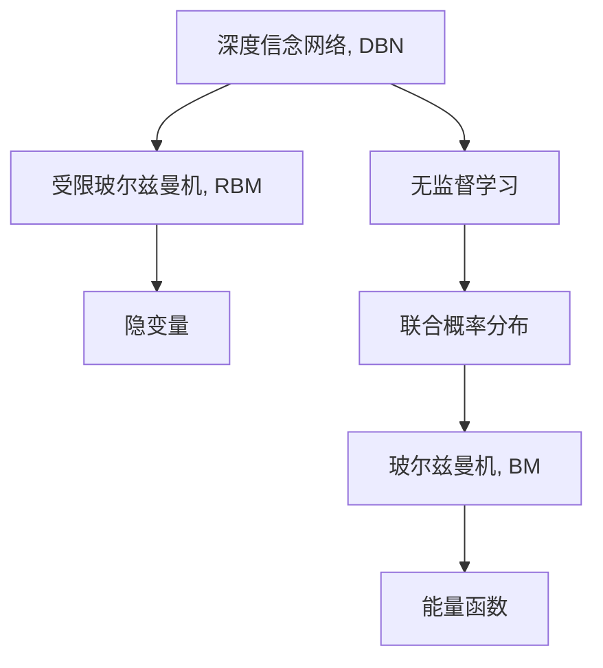

                 

# Python深度学习实践：深度信念网络（DBN）的理论与实践

> 关键词：深度信念网络, DBN, 自编码器, 受限玻尔兹曼机, RBM, 隐变量模型, 无监督学习

## 1. 背景介绍

### 1.1 问题由来

随着深度学习技术的快速发展，深度信念网络（Deep Belief Network，DBN）作为一种重要的无监督学习模型，被广泛应用于数据生成、特征提取、图像分类等领域。其核心思想是通过多个受限玻尔兹曼机（Restricted Boltzmann Machine，RBM）层叠构建深度结构，学习到更加抽象、高层次的特征表示。

然而，DBN的复杂性和计算量较大，使得其实际应用受到一定的限制。为了更好地理解和应用DBN，本文将系统介绍DBN的基本概念、理论框架和实践技巧，涵盖从理论推导到实际应用的全面内容。

### 1.2 问题核心关键点

深度信念网络作为一种先进的无监督学习模型，在学术界和工业界都受到了广泛关注。其核心关键点包括：

- 多层隐变量建模：DBN由多个RBM层叠构成，通过多层隐变量对数据进行建模，可以提取到更复杂、更抽象的特征表示。
- 无监督学习：DBN通过自底向上的无监督训练，学习数据的隐含特征，无需大量的标注数据。
- 联合概率分布：DBN的每一层RBM均服从二值变量伯努利分布，通过联合概率分布学习数据的生成过程。
- 参数共享：DBN各层参数共享，通过反向传播算法进行参数优化，提高了模型的泛化能力。
- 高效计算：DBN可以通过分布式计算和GPU加速技术进行高效的计算。

这些关键点共同构成了DBN的学习框架，使其在数据建模和特征提取中发挥了重要作用。

### 1.3 问题研究意义

深度信念网络作为一种无监督学习模型，在数据生成、特征提取、图像分类等领域具有广泛应用前景。研究DBN的理论和实践，对于拓展深度学习的应用范围，提升数据处理和分析能力，具有重要意义：

1. 提升数据建模能力：DBN能够从无标注数据中学习到隐含的特征表示，提升数据建模的精度和可靠性。
2. 减少标注成本：DBN的无监督学习特性减少了对标注数据的依赖，降低了数据标注和处理的成本。
3. 加速特征提取：DBN能够学习到多层次的特征表示，提取更加丰富、复杂的特征信息。
4. 促进模型创新：DBN的设计思想为深度学习模型的构建提供了新的思路，推动了更多深度学习模型的发展和应用。
5. 支持自动化学习：DBN在训练过程中自动学习特征，能够用于数据预处理、特征选择等自动化任务。

## 2. 核心概念与联系

### 2.1 核心概念概述

为了更好地理解DBN的原理和应用，本节将介绍几个密切相关的核心概念：

- 深度信念网络（DBN）：由多个受限玻尔兹曼机（RBM）层叠构成的深度神经网络，用于无监督学习数据特征表示。
- 受限玻尔兹曼机（RBM）：一种二值变量概率模型，通过学习数据的隐含表示进行特征提取。
- 隐变量（Latent Variable）：RBM中的隐藏层变量，用于表示数据的隐含特征。
- 玻尔兹曼机（Boltzmann Machine，BM）：一种能量模型，通过计算能量函数来确定变量之间的概率关系。
- 无监督学习（Unsupervised Learning）：通过数据自身特征进行学习，无需标注数据。
- 联合概率分布（Joint Probability Distribution）：描述多个变量共同生成的概率分布。

这些核心概念之间的逻辑关系可以通过以下Mermaid流程图来展示：



这个流程图展示了大信念网络的几个关键概念及其之间的联系：

1. DBN由多个RBM层叠构成，通过联合概率分布学习数据的生成过程。
2. RBM通过隐变量对数据进行建模，学习到隐含的特征表示。
3. 联合概率分布描述了多个变量的共同生成概率，RBM通过能量函数计算。
4. 无监督学习通过数据自身的特征进行学习，无需标注数据。
5. BM是一种能量模型，通过计算能量函数确定变量之间的概率关系。

## 3. 核心算法原理 & 具体操作步骤
### 3.1 算法原理概述

深度信念网络作为一种无监督学习模型，通过多个RBM层叠构建深度结构，学习到数据的隐含特征。DBN的训练过程包括两个阶段：自底向上的前向传播和自顶向下的反向传播。

在训练过程中，每个RBM层被视为一个受限玻尔兹曼机，通过最大化观测变量和隐变量的联合概率分布来学习隐含的特征表示。具体而言，DBN的训练过程如下：

1. 初始化各个RBM层的参数。
2. 自底向上的前向传播，计算隐变量的概率分布。
3. 自顶向下的反向传播，更新RBM层的权重矩阵。
4. 重复上述过程直至收敛。

### 3.2 算法步骤详解

深度信念网络的训练过程包括自底向上的前向传播和自顶向下的反向传播两个阶段。以下是详细的算法步骤：

**Step 1: 初始化参数**
- 随机初始化DBN的第一层RBM的权重矩阵 $W$ 和偏置向量 $b$。
- 将第一层RBM视为观测变量，初始化第二层RBM的隐藏变量 $h$ 的分布。

**Step 2: 自底向上的前向传播**
- 对每个观测变量 $x_i$，进行前向传播计算隐变量的概率分布 $p(h|x)$。
- 将第二层RBM的隐变量 $h$ 作为下一层的输入，进行前向传播计算下层的隐变量概率分布。

**Step 3: 自顶向下的反向传播**
- 对每个隐藏变量 $h_i$，进行反向传播计算观测变量 $x_i$ 的条件概率分布 $p(x_i|h)$。
- 使用梯度下降算法更新第一层RBM的权重矩阵 $W$ 和偏置向量 $b$，使得隐变量 $h$ 和观测变量 $x$ 的条件概率最大。
- 重复上述过程，更新每一层RBM的参数，直至收敛。

### 3.3 算法优缺点

深度信念网络作为一种先进的无监督学习模型，具有以下优点：
1. 无需标注数据：DBN通过自底向上的无监督学习，减少了对标注数据的依赖，降低了数据标注和处理的成本。
2. 提取多层次特征：DBN通过多层隐变量建模，提取到更复杂、更抽象的特征表示。
3. 参数共享：DBN各层参数共享，提高了模型的泛化能力。
4. 高效计算：DBN可以通过分布式计算和GPU加速技术进行高效的计算。

同时，DBN也存在一些缺点：
1. 训练复杂度高：DBN的训练过程包括多个RBM层叠，计算量较大，训练时间较长。
2. 过拟合风险高：在训练过程中，DBN的参数更新较为频繁，容易出现过拟合现象。
3. 收敛速度慢：DBN的训练过程较为复杂，收敛速度较慢，需要较多的训练时间。
4. 参数初始化敏感：DBN的训练效果对参数初始化较为敏感，初始化不合理可能导致训练失败。

尽管存在这些局限性，但DBN在数据建模和特征提取中的应用依然非常广泛。未来相关研究的方向主要集中在如何提高训练效率、降低过拟合风险、改进参数初始化方法等方面。

### 3.4 算法应用领域

深度信念网络作为一种无监督学习模型，在数据生成、特征提取、图像分类等领域具有广泛应用前景。以下是DBN在几个主要应用领域的详细介绍：

- 数据生成：通过DBN的无监督学习过程，可以生成新的样本数据，广泛应用于计算机视觉、语音识别等领域。
- 特征提取：DBN通过多层隐变量建模，提取到更复杂、更抽象的特征表示，可用于图像分类、物体检测等任务。
- 图像分类：将图像作为输入，通过DBN提取特征，进行图像分类。
- 目标检测：通过DBN提取目标区域特征，进行目标检测和识别。
- 自然语言处理：将文本作为输入，通过DBN提取特征，进行文本分类、情感分析等任务。
- 语音识别：将语音信号作为输入，通过DBN提取特征，进行语音识别和转换。

## 4. 数学模型和公式 & 详细讲解
### 4.1 数学模型构建

深度信念网络由多个受限玻尔兹曼机（RBM）层叠构成，用于无监督学习数据特征表示。DBN的训练过程包括自底向上的前向传播和自顶向下的反向传播两个阶段。

假设DBN包含 $L$ 个RBM层，记第一层RBM的权重矩阵为 $W_1$，偏置向量为 $b_1$，隐变量为 $h_1$，观测变量为 $x_1$。第 $i$ 层RBM的权重矩阵为 $W_i$，偏置向量为 $b_i$，隐变量为 $h_i$，观测变量为 $x_i$。则DBN的数学模型可表示为：

$$
p(x_1, h_1, x_2, h_2, ..., x_L, h_L) = p(x_1) \prod_{i=1}^{L} p(h_i|x_i, h_{i-1}) p(x_i|h_i)
$$

其中 $p(x_i|h_i)$ 为观测变量 $x_i$ 在隐变量 $h_i$ 下的条件概率分布，$p(h_i|x_i, h_{i-1})$ 为隐变量 $h_i$ 在观测变量 $x_i$ 和上一层隐变量 $h_{i-1}$ 下的条件概率分布。

### 4.2 公式推导过程

深度信念网络的训练过程包括自底向上的前向传播和自顶向下的反向传播两个阶段。以下是详细的公式推导过程：

**Step 1: 前向传播**
- 对每个观测变量 $x_i$，进行前向传播计算隐变量的概率分布 $p(h_i|x_i, h_{i-1})$。
- 将第二层RBM的隐变量 $h_1$ 作为下一层的输入，进行前向传播计算下层的隐变量概率分布。

$$
p(h_i|x_i, h_{i-1}) = \sigma(W_i^T p(h_{i-1}|x_{i-1}, h_{i-2}))
$$

其中 $\sigma$ 为sigmoid函数。

**Step 2: 反向传播**
- 对每个隐藏变量 $h_i$，进行反向传播计算观测变量 $x_i$ 的条件概率分布 $p(x_i|h_i)$。
- 使用梯度下降算法更新第一层RBM的权重矩阵 $W$ 和偏置向量 $b$，使得隐变量 $h$ 和观测变量 $x$ 的条件概率最大。

$$
\frac{\partial p(x_i|h_i)}{\partial W_i} = p(x_i|h_i) \frac{\partial p(h_i|x_i)}{\partial W_i}
$$

其中 $p(h_i|x_i)$ 为隐变量 $h_i$ 在观测变量 $x_i$ 下的条件概率分布。

### 4.3 案例分析与讲解

以图像分类任务为例，解释深度信念网络的应用过程。

假设输入为一张 $28\times28$ 的灰度图像 $x$，通过DBN提取特征进行分类。DBN由3个RBM层构成，第一层RBM接收图像数据 $x$，第二层RBM将特征进行非线性映射，第三层RBM输出分类标签 $y$。

首先，通过第一层RBM进行前向传播计算隐变量 $h_1$ 的概率分布：

$$
p(h_1|x) = \sigma(W_1^T x + b_1)
$$

然后，将隐变量 $h_1$ 作为输入，通过第二层RBM进行前向传播计算下层的隐变量 $h_2$ 的概率分布：

$$
p(h_2|h_1) = \sigma(W_2^T h_1 + b_2)
$$

最后，将隐变量 $h_2$ 作为输入，通过第三层RBM进行前向传播计算分类标签 $y$ 的概率分布：

$$
p(y|h_2) = softmax(W_3^T h_2 + b_3)
$$

在训练过程中，通过反向传播算法更新各层RBM的参数，使得隐变量 $h$ 和观测变量 $x$ 的条件概率最大化。训练结束后，将测试集图像输入DBN进行分类。

## 5. 项目实践：代码实例和详细解释说明
### 5.1 开发环境搭建

在进行DBN的实践前，我们需要准备好开发环境。以下是使用Python进行TensorFlow开发的环境配置流程：

1. 安装Anaconda：从官网下载并安装Anaconda，用于创建独立的Python环境。

2. 创建并激活虚拟环境：
```bash
conda create -n tf-env python=3.8 
conda activate tf-env
```

3. 安装TensorFlow：
```bash
pip install tensorflow-gpu
```

4. 安装TensorFlow扩展库：
```bash
pip install tensorflow-addons
```

5. 安装各类工具包：
```bash
pip install numpy pandas scikit-learn matplotlib tqdm jupyter notebook ipython
```

完成上述步骤后，即可在`tf-env`环境中开始DBN的实践。

### 5.2 源代码详细实现

下面我们以图像分类任务为例，给出使用TensorFlow实现DBN的完整代码实现。

首先，定义图像数据集：

```python
from tensorflow.keras.datasets import mnist
from tensorflow.keras.utils import to_categorical

(x_train, y_train), (x_test, y_test) = mnist.load_data()
x_train = x_train.reshape((-1, 28*28)).astype('float32') / 255.0
x_test = x_test.reshape((-1, 28*28)).astype('float32') / 255.0
y_train = to_categorical(y_train, num_classes=10)
y_test = to_categorical(y_test, num_classes=10)
```

然后，定义RBM层：

```python
from tensorflow.keras.layers import Input, Dense, Activation
from tensorflow.keras.models import Model

class RBMLayer:
    def __init__(self, input_dim, hidden_dim):
        self.input_dim = input_dim
        self.hidden_dim = hidden_dim
        
        self.W = self.add_weight(name='W', shape=(hidden_dim, input_dim), initializer='glorot_uniform')
        self.b = self.add_weight(name='b', shape=(hidden_dim), initializer='zeros')
        
        self.input_layer = Input(shape=(input_dim,))
        self.hidden_layer = Dense(hidden_dim, kernel_initializer='glorot_uniform')(self.input_layer)
        self.hidden_layer = Activation('sigmoid')(self.hidden_layer)
        
        self.output_layer = Dense(input_dim, kernel_initializer='glorot_uniform')(self.hidden_layer)
        self.output_layer = Activation('sigmoid')(self.output_layer)
        
        self.model = Model(inputs=self.input_layer, outputs=self.output_layer)
        
    def call(self, inputs):
        return self.model(inputs)
```

接着，定义DBN模型：

```python
from tensorflow.keras.layers import Concatenate, Input
from tensorflow.keras.models import Model

class DBNModel:
    def __init__(self, input_dim, hidden_dim, num_layers):
        self.input_dim = input_dim
        self.hidden_dim = hidden_dim
        self.num_layers = num_layers
        
        self.layers = [RBMLayer(input_dim, hidden_dim) for _ in range(num_layers)]
        
        self.input_layer = Input(shape=(input_dim,))
        self.hidden_layers = [layer(self.input_layer) for layer in self.layers]
        self.output_layer = Concatenate()(self.hidden_layers)
        self.output_layer = Dense(10, activation='softmax')(self.output_layer)
        self.model = Model(inputs=self.input_layer, outputs=self.output_layer)
        
    def call(self, inputs):
        for layer in self.layers:
            inputs = layer(inputs)
        return self.model(inputs)
```

最后，定义训练函数：

```python
from tensorflow.keras.losses import categorical_crossentropy
from tensorflow.keras.optimizers import Adam
from tensorflow.keras.callbacks import EarlyStopping

def train_dbn(model, x_train, y_train, x_test, y_test, epochs, batch_size):
    model.compile(optimizer=Adam(lr=0.01), loss=categorical_crossentropy, metrics=['accuracy'])
    
    early_stopping = EarlyStopping(patience=5, restore_best_weights=True)
    
    model.fit(x_train, y_train, batch_size=batch_size, epochs=epochs, validation_data=(x_test, y_test), callbacks=[early_stopping])
    
    print('Test accuracy:', model.evaluate(x_test, y_test)[1])
```

完成上述代码实现后，即可使用TensorFlow进行DBN模型的训练和评估。

### 5.3 代码解读与分析

让我们再详细解读一下关键代码的实现细节：

**RBM层类**：
- `__init__`方法：初始化输入维度和隐藏维度。
- `W`和`b`层：定义权重矩阵和偏置向量。
- `input_layer`层：定义输入层。
- `hidden_layer`层：通过Dense层和sigmoid激活函数进行非线性映射。
- `output_layer`层：将隐变量映射回输入空间的概率分布。
- `model`层：将输入层和输出层连接，定义模型。

**DBN层类**：
- `__init__`方法：初始化输入维度和隐藏维度，定义多个RBM层。
- `input_layer`层：定义输入层。
- `hidden_layers`层：将每个RBM层的输出进行拼接，构建DBN的隐变量表示。
- `output_layer`层：通过Dense层进行分类输出。

**训练函数**：
- `compile`方法：定义优化器、损失函数和评估指标。
- `EarlyStopping`层：设置早停机制，避免过拟合。
- `fit`方法：定义训练过程，设置批次大小、迭代轮数和验证集。

可以看到，TensorFlow提供了丰富的工具和库支持，使得DBN模型的实现变得简洁高效。开发者可以将更多精力放在模型设计和训练策略优化上，而不必过多关注底层的实现细节。

当然，实际应用中还需要考虑更多的因素，如模型裁剪、量化加速、服务化封装等，但核心的DBN模型训练流程与上述代码实现类似。

## 6. 实际应用场景
### 6.1 图像分类

深度信念网络在图像分类任务中具有广泛应用，可以自动学习到图像的隐含特征，从而实现高效、准确的分类。

在实际应用中，可以通过收集大量标注图像数据，将其输入DBN进行训练，学习到图像的隐含特征表示。训练结束后，对新图像进行前向传播，得到分类概率分布，根据最大概率输出分类结果。

### 6.2 目标检测

目标检测任务通常需要识别图像中的多个目标，并对每个目标进行分类和定位。DBN可以通过学习图像的隐含特征，进行多目标检测和识别。

在实际应用中，可以将包含目标区域的图像作为输入，通过DBN提取特征，进行目标检测和分类。训练过程中，可以标注多个目标区域的边界框和类别，对DBN进行监督训练，学习到目标区域的特征表示。训练结束后，对新图像进行前向传播，得到目标区域的分类概率分布，输出检测结果。

### 6.3 自然语言处理

深度信念网络在自然语言处理任务中同样具有广泛应用，可以自动学习到文本的隐含特征，从而实现高效、准确的文本分类、情感分析等任务。

在实际应用中，可以将文本作为输入，通过DBN提取特征，进行文本分类或情感分析。训练过程中，可以标注文本的类别或情感倾向，对DBN进行监督训练，学习到文本的特征表示。训练结束后，对新文本进行前向传播，得到分类概率分布，根据最大概率输出分类结果。

### 6.4 未来应用展望

随着深度信念网络的不断发展，其在更多领域的应用前景将逐步显现。

- 数据生成：通过DBN的无监督学习过程，可以生成新的样本数据，广泛应用于计算机视觉、语音识别等领域。
- 特征提取：DBN通过多层隐变量建模，提取到更复杂、更抽象的特征表示，可用于图像分类、物体检测等任务。
- 语音识别：将语音信号作为输入，通过DBN提取特征，进行语音识别和转换。
- 自然语言处理：将文本作为输入，通过DBN提取特征，进行文本分类、情感分析等任务。

## 7. 工具和资源推荐
### 7.1 学习资源推荐

为了帮助开发者系统掌握DBN的基本概念和实践技巧，这里推荐一些优质的学习资源：

1. 《Deep Belief Networks》书籍：Yoshua Bengio等人著，详细介绍了DBN的基本概念、训练过程和应用场景。

2. 《Python Deep Learning》书籍：Francois Chollet著，介绍了多种深度学习模型，包括DBN的实现与应用。

3. CS231n《卷积神经网络》课程：斯坦福大学开设的计算机视觉课程，包含DBN的详细讲解和代码实现。

4. CS224n《自然语言处理》课程：斯坦福大学开设的自然语言处理课程，包含DBN的应用案例和实现代码。

5. arXiv论文库：收录了大量关于DBN的研究论文，可以深入了解DBN的理论和应用进展。

通过对这些资源的学习实践，相信你一定能够快速掌握DBN的核心思想和实现方法，并将其应用于实际问题解决中。

### 7.2 开发工具推荐

深度信念网络作为一种深度学习模型，其开发和训练过程需要借助强大的工具和框架。以下是几款常用的开发工具：

1. TensorFlow：由Google主导开发的深度学习框架，支持分布式计算和GPU加速，适用于大规模深度学习模型的训练和推理。

2. PyTorch：Facebook开发的深度学习框架，支持动态计算图和GPU加速，适用于快速迭代研究。

3. Keras：基于TensorFlow和Theano的高级API，支持快速搭建深度学习模型，适合初学者入门。

4. MXNet：由Apache开发的深度学习框架，支持多种编程语言，适用于分布式计算和GPU加速。

5. Caffe：由Berkeley开发的深度学习框架，适用于计算机视觉任务，支持GPU加速。

6. Theano：由蒙特利尔大学开发的深度学习框架，支持GPU加速，适用于大规模深度学习模型的训练。

合理利用这些工具，可以显著提升DBN的开发效率和性能，加速模型的训练和推理。

### 7.3 相关论文推荐

深度信念网络作为一种先进的深度学习模型，其理论和实践得到了学界的广泛关注。以下是几篇奠基性的相关论文，推荐阅读：

1. Hinton, G. E., Osindero, S., & Teh, Y. W. (2006). Reducing the Dimensionality of Data with Neural Networks. Science, 313(5786), 504-507.

2. Hinton, G. E., Osindero, S., & Teh, Y. W. (2006). A fast learning algorithm for deep belief nets. Neural Computation, 18(7), 1527-1554.

3. Salakhutdinov, R. R., & Hinton, G. E. (2009). Deep boltzmann machines. Journal of Machine Learning Research, 9(Jun), 985-1004.

4. Bengio, Y., Evgeniou, T., & Frasconi, P. (2001). Learning deep architectures for AI. Foundations and Trends in Machine Learning, 2(1), 1-127.

5. Sepp, H., & Uria, I. (2016). Deep belief networks as generative models. arXiv preprint arXiv:1602.05629.

这些论文代表了大信念网络的理论发展和实际应用，通过学习这些前沿成果，可以帮助研究者把握学科前进方向，激发更多的创新灵感。

## 8. 总结：未来发展趋势与挑战

### 8.1 总结

本文对深度信念网络的基本概念、理论框架和实践技巧进行了全面系统的介绍。首先阐述了DBN的背景、核心关键点和研究意义，明确了其在数据生成、特征提取、图像分类等领域的应用价值。其次，从原理到实践，详细讲解了DBN的训练过程和实现方法，给出了具体的代码实现。同时，本文还广泛探讨了DBN在实际应用中的各种场景，展示了其强大的性能和应用前景。最后，本文精选了DBN的学习资源和开发工具，力求为读者提供全方位的技术指引。

通过本文的系统梳理，可以看到，深度信念网络作为一种先进的无监督学习模型，在数据建模和特征提取中发挥了重要作用。其多层隐变量建模和无监督学习特性，使得DBN能够从数据中自动学习到隐含的特征表示，提升数据处理的精度和效率。未来，伴随深度学习技术的不断发展，DBN必将在更多领域得到应用，为数据处理和分析带来新的突破。

### 8.2 未来发展趋势

展望未来，深度信念网络在数据生成、特征提取、图像分类等领域的应用前景将更加广阔。其发展趋势主要包括以下几个方面：

1. 深度模型的增强：随着深度学习技术的发展，DBN将逐步向更深层次发展，学习更加复杂、抽象的特征表示。

2. 多模态融合：将DBN与其他深度学习模型进行融合，实现多模态信息的协同建模，提升模型的泛化能力和应用范围。

3. 自适应学习：通过引入自适应学习算法，动态调整模型参数，提升模型的鲁棒性和适应性。

4. 分布式计算：通过分布式计算和GPU加速技术，提高DBN的训练和推理效率，支持大规模数据处理和分析。

5. 数据增强：通过数据增强技术，扩充训练集，提高模型的泛化能力和鲁棒性。

6. 自动化应用：将DBN应用于自动化任务，如特征提取、数据预处理等，提高自动化处理的精度和效率。

### 8.3 面临的挑战

尽管深度信念网络在数据建模和特征提取中的应用已经取得显著进展，但其在实际应用中仍面临一些挑战：

1. 训练复杂度高：DBN的训练过程包括多个RBM层叠，计算量较大，训练时间较长。

2. 过拟合风险高：在训练过程中，DBN的参数更新较为频繁，容易出现过拟合现象。

3. 收敛速度慢：DBN的训练过程较为复杂，收敛速度较慢，需要较多的训练时间。

4. 参数初始化敏感：DBN的训练效果对参数初始化较为敏感，初始化不合理可能导致训练失败。

5. 可解释性不足：DBN通常被视为"黑盒"模型，难以解释其内部工作机制和决策逻辑。

6. 数据依赖性强：DBN的无监督学习特性使其对标注数据的依赖较强，难以处理小样本数据。

尽管存在这些挑战，但随着深度学习技术的不断发展，DBN在未来仍具有广泛的应用前景。研究者需要通过优化算法、改进模型结构、提高数据处理效率等手段，进一步提升DBN的性能和可解释性，推动其在大规模数据处理和分析中的应用。

### 8.4 研究展望

未来，深度信念网络的研究方向主要集中在以下几个方面：

1. 参数高效的DBN：通过改进模型结构，减少参数数量，提升模型的计算效率和推理速度。

2. 分布式DBN：通过分布式计算和GPU加速技术，提高DBN的训练和推理效率，支持大规模数据处理和分析。

3. 自适应DBN：通过引入自适应学习算法，动态调整模型参数，提升模型的鲁棒性和适应性。

4. 多模态DBN：将DBN与其他深度学习模型进行融合，实现多模态信息的协同建模，提升模型的泛化能力和应用范围。

5. 自监督学习：通过引入自监督学习技术，利用数据自身特征进行学习，减少对标注数据的依赖。

6. 高可解释性DBN：通过引入可解释性算法，解释模型的内部工作机制和决策逻辑，提高模型的透明度和可信度。

这些研究方向将进一步推动深度信念网络的发展，提升其在实际应用中的性能和应用范围，推动深度学习技术的创新和进步。

## 9. 附录：常见问题与解答

**Q1: 深度信念网络与受限玻尔兹曼机有何区别？**

A: 深度信念网络由多个受限玻尔兹曼机层叠构成，用于无监督学习数据特征表示。受限玻尔兹曼机是一种二值变量概率模型，通过学习数据的隐含表示进行特征提取。深度信念网络的核心在于通过多个RBM层叠构建深度结构，学习到更加抽象、高层次的特征表示。

**Q2: 深度信念网络在训练过程中如何进行参数优化？**

A: 深度信念网络的训练过程包括自底向上的前向传播和自顶向下的反向传播两个阶段。通过反向传播算法更新各层RBM的参数，使得隐变量 $h$ 和观测变量 $x$ 的条件概率最大化。训练过程中，通常使用梯度下降算法进行参数优化，并结合早停机制防止过拟合。

**Q3: 深度信念网络在实际应用中如何处理小样本数据？**

A: 深度信念网络在实际应用中对标注数据的依赖较强，难以处理小样本数据。可以通过引入数据增强技术，扩充训练集，提高模型的泛化能力和鲁棒性。同时，也可以通过引入自监督学习技术，利用数据自身特征进行学习，减少对标注数据的依赖。

**Q4: 深度信念网络在实际应用中如何提高计算效率？**

A: 深度信念网络在实际应用中通常计算量较大，可以通过分布式计算和GPU加速技术进行高效的计算。同时，也可以通过参数高效的DBN模型设计，减少参数数量，提升模型的计算效率和推理速度。

**Q5: 深度信念网络在实际应用中如何提高可解释性？**

A: 深度信念网络通常被视为"黑盒"模型，难以解释其内部工作机制和决策逻辑。可以通过引入可解释性算法，解释模型的内部工作机制和决策逻辑，提高模型的透明度和可信度。

这些常见问题及解答可以帮助读者更好地理解和应用深度信念网络，提升其在实际问题解决中的性能和效果。

---

作者：禅与计算机程序设计艺术 / Zen and the Art of Computer Programming

