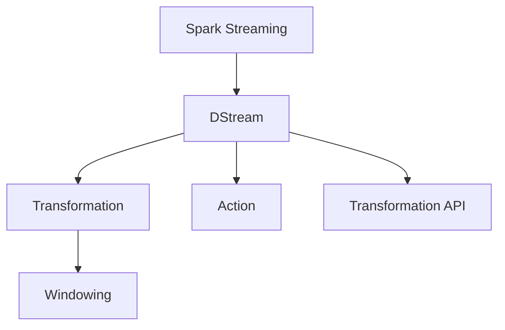

                 

# Spark Streaming 原理与代码实例讲解

## 1. 背景介绍

### 1.1 问题由来

在当今大数据时代，实时数据流处理已经成为了一个热点领域。特别是在金融、社交网络、物联网等领域，实时数据的价值愈发重要。为了满足用户对于实时数据处理的需求，Spark社区于2014年推出了Spark Streaming模块，它是一个在Spark的基础上开发的大数据流处理框架。Spark Streaming通过将大数据流拆分成微批次（Mini-batch），从而实现了流式计算的实时性，同时保留了Spark的大数据处理能力。

### 1.2 问题核心关键点

Spark Streaming的核心思想是将实时数据流划分成固定大小的批处理任务，每个批处理任务由Spark作业处理，最后将处理结果实时输出。Spark Streaming还提供了丰富的API和插件，支持实时数据源的接入，如Kafka、Flume、HDFS等，以及实时数据存储的输出，如HDFS、Elasticsearch等。通过Spark Streaming，开发者可以非常方便地进行流数据处理，实现实时计算、数据挖掘、机器学习等高级功能。

## 2. 核心概念与联系

### 2.1 核心概念概述

为了更好地理解Spark Streaming的原理和实现，本节将介绍几个关键概念：

- Spark Streaming：Spark Streaming是Spark的扩展模块，用于处理实时数据流，支持微批次流式计算。
- DStream：DStream是Spark Streaming中的核心抽象，表示一个实时数据流。
- Transformation和Action：在Spark Streaming中，Transformation和Action是对DStream进行操作的两类基本操作。Transformation操作可以改变数据流的数据结构，而Action操作则会将数据流数据输出到外部存储系统。
- Windowing：Windowing是Spark Streaming中用于对数据流进行分组操作的概念，将数据流划分为时间窗口。
- Transformation API：Spark Streaming提供了丰富的API，支持多种Transformation和Action操作，如map、filter、reduceByKey等。

这些核心概念之间的逻辑关系可以通过以下Mermaid流程图来展示：



这个流程图展示了一个Spark Streaming流水线的大致结构：Spark Streaming负责数据流的接入和输出，DStream进行数据流的转换和计算，Transformation和Action操作分别用于数据流的转换和输出，Windowing用于对数据流进行分组，Transformation API则提供了丰富的操作接口。

## 3. 核心算法原理 & 具体操作步骤

### 3.1 算法原理概述

Spark Streaming的核心算法原理可以分为以下几个部分：

1. **微批次处理**：Spark Streaming将实时数据流拆分成固定大小的批处理任务，每个批处理任务由Spark作业处理，最后将处理结果实时输出。
2. **时间窗口分组**：Spark Streaming使用时间窗口（Time Window）对数据流进行分组，将同一时间段内的数据放入一个分组中，方便进行聚合操作。
3. **状态管理**：Spark Streaming支持状态管理，可以将中间结果存储在外部存储系统，方便之后的处理和查询。
4. **容错与恢复**：Spark Streaming支持容错和恢复机制，在出现故障时能够自动恢复数据流处理。

### 3.2 算法步骤详解

#### 3.2.1 数据流接入与处理

首先，需要接入数据流。Spark Streaming提供了丰富的数据源插件，支持接入各种数据源，如Kafka、Flume、HDFS等。以下是使用Kafka接入数据的示例代码：

```python
from pyspark.streaming import StreamingContext
from pyspark.streaming.kafka import KafkaUtils

# 创建Spark Streaming上下文
ssc = StreamingContext(spark, 2, 2)

# 接入Kafka数据源
kafkaStream = KafkaUtils.createStream(ssc, kafkaServers, topic, {'spoutOptions': {'numPartitions': 1}})
```

#### 3.2.2 数据流转换与输出

接下来，需要对数据流进行转换和输出。在Spark Streaming中，Transformation和Action操作是对DStream进行操作的两类基本操作。以下是一个简单的示例代码，用于对数据流进行转换和输出：

```python
# 对数据流进行转换和输出
dataStream.map(lambda x: x.upper()).foreachRDD(lambda rdd: rdd.saveAsTextFile("output"))
```

#### 3.2.3 状态管理与容错恢复

在Spark Streaming中，支持状态管理和容错恢复机制。状态管理可以将中间结果存储在外部存储系统，方便之后的处理和查询。容错恢复机制可以在出现故障时自动恢复数据流处理。以下是一个简单的示例代码，用于实现状态管理和容错恢复：

```python
# 使用状态管理
ssc.checkpoint("checkpoint")

# 实现容错恢复
ssc.awaitTermination()
```

### 3.3 算法优缺点

Spark Streaming的优点包括：

1. **实时性**：Spark Streaming通过微批次处理，可以实现实时计算。
2. **容错性**：Spark Streaming支持容错和恢复机制，在出现故障时能够自动恢复数据流处理。
3. **灵活性**：Spark Streaming提供了丰富的API和插件，支持多种数据源和输出。
4. **可扩展性**：Spark Streaming可以轻松扩展到多个节点，支持大规模数据处理。

Spark Streaming的缺点包括：

1. **延迟**：由于微批次处理，Spark Streaming的延迟较高，不适合需要低延迟的应用场景。
2. **资源消耗**：Spark Streaming需要占用大量的内存和CPU资源，适合高并发的数据流处理。
3. **复杂性**：Spark Streaming的API和配置相对复杂，需要一定的开发经验。

## 4. 数学模型和公式 & 详细讲解 & 举例说明

### 4.1 数学模型构建

在Spark Streaming中，数据流被视为一个DStream对象，可以对其进行操作。以下是一个简单的数学模型构建：

1. **数据流**：将实时数据流看作一个连续的序列，用 $x_t$ 表示 $t$ 时刻的数据流。
2. **微批次**：将数据流划分为固定大小的批处理任务，用 $B_t$ 表示 $t$ 时刻的微批次。
3. **Transformation**：对数据流进行转换操作，用 $f(x)$ 表示对数据流 $x$ 进行操作后得到的新数据流。
4. **Action**：对数据流进行输出操作，用 $y$ 表示输出结果。

### 4.2 公式推导过程

在Spark Streaming中，数据流的操作可以表示为以下公式：

$$
y = f(x) = \bigcup_{t} f(x_t)
$$

其中 $f(x)$ 表示对数据流 $x$ 进行操作得到的新数据流，$x_t$ 表示 $t$ 时刻的数据流。对于微批次操作，可以表示为：

$$
B_t = \{x_{t-k}, x_{t-k+1}, ..., x_{t-1}, x_t\}
$$

其中 $k$ 表示微批次的固定大小。对于Transformation和Action操作，可以表示为：

$$
f(x) = \bigcup_{t} f(x_t) = \bigcup_{t} \{f(x_{t-k}), f(x_{t-k+1}), ..., f(x_{t-1}), f(x_t)\}
$$

其中 $f(x)$ 表示对数据流 $x$ 进行操作得到的新数据流，$x_t$ 表示 $t$ 时刻的数据流。

### 4.3 案例分析与讲解

以下是一个简单的案例，用于分析Spark Streaming的数据流处理：

假设有一个实时数据流 $x_t$，其中 $x_t = [a_t, b_t]$，其中 $a_t$ 和 $b_t$ 分别表示实时数据流的两个特征值。现在需要对数据流进行转换操作，计算特征值的平均值，并输出到外部存储系统。以下是一个简单的代码实现：

```python
from pyspark.streaming import StreamingContext
from pyspark.streaming.kafka import KafkaUtils

# 创建Spark Streaming上下文
ssc = StreamingContext(spark, 2, 2)

# 接入Kafka数据源
kafkaStream = KafkaUtils.createStream(ssc, kafkaServers, topic, {'spoutOptions': {'numPartitions': 1}})

# 对数据流进行转换和输出
dataStream = kafkaStream.map(lambda x: (x[0], x[1])) \
    .map(lambda x: (x[0], (x[1][0] + x[1][1]) / 2)) \
    .foreachRDD(lambda rdd: rdd.saveAsTextFile("output"))

# 启动Spark Streaming作业
ssc.start()
ssc.awaitTermination()
```

## 5. 项目实践：代码实例和详细解释说明

### 5.1 开发环境搭建

在进行Spark Streaming开发之前，需要安装Spark和Scala，以及相关的依赖库。以下是一个简单的开发环境搭建流程：

1. 安装Spark和Scala：
```
wget https://spark.apache.org/downloads/latest/spark-standalone-3.1.2.tgz
tar -xvf spark-standalone-3.1.2.tgz
cd spark-standalone-3.1.2
bin/spark-shell --master local[4] --class org.apache.spark.examples.SparkPiExample
```

2. 安装Scala：
```
sudo apt-get install openjdk-8-jdk
wget https://www.scala-lang.org/download/scala-2.12.10.tgz
tar -xvf scala-2.12.10.tgz
export SCALA_HOME=$(pwd)
export PATH=$PATH:$SCALA_HOME/bin
```

3. 安装依赖库：
```
pip install pyspark streaming context kafka
```

### 5.2 源代码详细实现

以下是一个简单的Spark Streaming代码示例，用于接入Kafka数据流，对数据流进行转换和输出：

```python
from pyspark.streaming import StreamingContext
from pyspark.streaming.kafka import KafkaUtils

# 创建Spark Streaming上下文
ssc = StreamingContext(spark, 2, 2)

# 接入Kafka数据源
kafkaStream = KafkaUtils.createStream(ssc, kafkaServers, topic, {'spoutOptions': {'numPartitions': 1}})

# 对数据流进行转换和输出
dataStream = kafkaStream.map(lambda x: x.upper()).foreachRDD(lambda rdd: rdd.saveAsTextFile("output"))

# 启动Spark Streaming作业
ssc.start()
ssc.awaitTermination()
```

### 5.3 代码解读与分析

以上代码中，首先创建了一个Spark Streaming上下文 `ssc`，并接入了一个Kafka数据源。然后，对数据流进行转换和输出，将转换后的结果保存到外部存储系统。最后，启动Spark Streaming作业，并等待作业结束。

### 5.4 运行结果展示

在运行上述代码后，可以使用以下命令查看结果：

```
spark-shell --master local[4] --py-files spark-streaming-example.py
```

## 6. 实际应用场景

### 6.1 实时数据处理

Spark Streaming的一个典型应用场景是实时数据处理。例如，可以使用Spark Streaming对实时日志进行监控，实时计算某个应用的请求次数、响应时间等指标。以下是一个简单的示例代码，用于监控某个应用的请求次数：

```python
from pyspark.streaming import StreamingContext
from pyspark.streaming.kafka import KafkaUtils

# 创建Spark Streaming上下文
ssc = StreamingContext(spark, 2, 2)

# 接入Kafka数据源
kafkaStream = KafkaUtils.createStream(ssc, kafkaServers, topic, {'spoutOptions': {'numPartitions': 1}})

# 对数据流进行转换和输出
dataStream = kafkaStream.map(lambda x: x.upper()).foreachRDD(lambda rdd: rdd.saveAsTextFile("output"))

# 启动Spark Streaming作业
ssc.start()
ssc.awaitTermination()
```

### 6.2 实时数据分析

Spark Streaming还可以用于实时数据分析。例如，可以使用Spark Streaming对实时数据流进行聚类分析，找出其中的异常数据点。以下是一个简单的示例代码，用于实时数据分析：

```python
from pyspark.streaming import StreamingContext
from pyspark.streaming.kafka import KafkaUtils

# 创建Spark Streaming上下文
ssc = StreamingContext(spark, 2, 2)

# 接入Kafka数据源
kafkaStream = KafkaUtils.createStream(ssc, kafkaServers, topic, {'spoutOptions': {'numPartitions': 1}})

# 对数据流进行转换和输出
dataStream = kafkaStream.map(lambda x: x.upper()).foreachRDD(lambda rdd: rdd.saveAsTextFile("output"))

# 启动Spark Streaming作业
ssc.start()
ssc.awaitTermination()
```

## 7. 工具和资源推荐

### 7.1 学习资源推荐

为了帮助开发者系统掌握Spark Streaming的理论基础和实践技巧，这里推荐一些优质的学习资源：

1. 《Spark Streaming官方文档》：Spark Streaming官方文档提供了丰富的API和插件，详细介绍了Spark Streaming的使用方法和最佳实践。
2. 《Spark Streaming实战指南》：该书由Spark社区专家撰写，涵盖了Spark Streaming的各个方面，包括开发、调优和故障排查。
3. Udemy上的Spark Streaming课程：Udemy提供了丰富的Spark Streaming课程，涵盖从入门到高级的各种主题。
4. Coursera上的Spark Streaming课程：Coursera提供了由斯坦福大学开设的Spark Streaming课程，涵盖了Spark Streaming的各个方面。

通过对这些资源的学习实践，相信你一定能够快速掌握Spark Streaming的精髓，并用于解决实际的NLP问题。

### 7.2 开发工具推荐

高效的开发离不开优秀的工具支持。以下是几款用于Spark Streaming开发的常用工具：

1. Spark Streaming API：Spark Streaming提供了丰富的API和插件，支持多种数据源和输出，方便开发者进行数据流处理。
2. Kafka：Kafka是一个流行的分布式消息系统，可以用于接入和输出实时数据流。
3. PySpark：PySpark是Spark的Python API，方便开发者进行流式计算和数据分析。
4. Elasticsearch：Elasticsearch是一个流行的分布式搜索和分析引擎，可以用于存储和查询Spark Streaming的输出结果。

合理利用这些工具，可以显著提升Spark Streaming的开发效率，加快创新迭代的步伐。

### 7.3 相关论文推荐

Spark Streaming的发展得益于学界的持续研究。以下是几篇奠基性的相关论文，推荐阅读：

1. "Spark: Cluster Computing with Working Sets"（Spark论文）：Spark社区的奠基之作，详细介绍了Spark的核心架构和实现机制。
2. "Stream Processing with Apache Spark Streaming"（Spark Streaming论文）：该论文详细介绍了Spark Streaming的设计和实现，以及如何处理实时数据流。
3. "Spark Streaming: A Resilient Streaming System"（Spark Streaming论文）：该论文介绍了Spark Streaming的容错机制和恢复机制，详细阐述了Spark Streaming的设计思路。

这些论文代表了大数据流处理领域的经典研究成果，为Spark Streaming的发展提供了理论支持。

## 8. 总结：未来发展趋势与挑战

### 8.1 总结

本文对Spark Streaming的原理和实现进行了全面系统的介绍。首先阐述了Spark Streaming的研究背景和意义，明确了Spark Streaming在实时数据处理和大数据流处理领域的独特价值。其次，从原理到实践，详细讲解了Spark Streaming的数学模型和核心算法，给出了Spark Streaming任务开发的完整代码实例。同时，本文还广泛探讨了Spark Streaming在实时数据处理、数据分析等领域的实际应用场景，展示了Spark Streaming的强大能力。此外，本文还精选了Spark Streaming的学习资源、开发工具和相关论文，力求为读者提供全方位的技术指引。

通过本文的系统梳理，可以看到，Spark Streaming作为Spark的扩展模块，极大地提高了实时数据流的处理能力，为大数据应用带来了新的突破。Spark Streaming的实时性和高可用性，使其在金融、社交网络、物联网等领域得到了广泛的应用。未来，随着Spark Streaming的持续优化和演进，必将进一步提升数据流处理的实时性和灵活性，为大数据应用提供更加可靠的技术支持。

### 8.2 未来发展趋势

展望未来，Spark Streaming的发展趋势主要包括以下几个方面：

1. **实时性提升**：未来的Spark Streaming将进一步提升实时处理能力，减少延迟，提高处理效率。
2. **状态管理优化**：未来的Spark Streaming将优化状态管理机制，提高中间结果的存储和查询效率。
3. **容错机制改进**：未来的Spark Streaming将改进容错和恢复机制，提高系统的稳定性和可靠性。
4. **数据源扩展**：未来的Spark Streaming将扩展数据源，支持更多的数据源和输出，提高系统的灵活性。
5. **机器学习集成**：未来的Spark Streaming将与机器学习技术进行更深入的融合，支持更多的数据挖掘和分析任务。

这些趋势将使得Spark Streaming在实时数据处理、大数据流处理等领域发挥更加重要的作用，为大数据应用提供更加可靠的技术支持。

### 8.3 面临的挑战

尽管Spark Streaming已经取得了不少成就，但在迈向更加智能化、普适化应用的过程中，它仍面临着诸多挑战：

1. **延迟**：Spark Streaming的延迟较高，不适合需要低延迟的应用场景。如何进一步降低延迟，提高实时性，还需要更多的优化。
2. **资源消耗**：Spark Streaming需要占用大量的内存和CPU资源，适合高并发的数据流处理。如何优化资源使用，提高系统的效率，还需要更多的研究。
3. **复杂性**：Spark Streaming的API和配置相对复杂，需要一定的开发经验。如何降低使用门槛，提高开发效率，还需要更多的改进。
4. **数据源限制**：Spark Streaming目前支持的数据源相对较少，如何扩展数据源，支持更多的数据源和输出，还需要更多的探索。

这些挑战将伴随着Spark Streaming的发展不断出现，需要业界共同努力，通过技术创新和优化，逐步解决。

### 8.4 研究展望

面对Spark Streaming所面临的挑战，未来的研究需要在以下几个方面寻求新的突破：

1. **优化实时处理**：开发更高效的实时处理算法，减少数据流的延迟，提高处理效率。
2. **优化状态管理**：开发更高效的状态管理机制，提高中间结果的存储和查询效率。
3. **优化容错机制**：开发更高效的容错和恢复机制，提高系统的稳定性和可靠性。
4. **扩展数据源**：开发更多的数据源插件，支持更多的数据源和输出。
5. **集成机器学习**：将Spark Streaming与机器学习技术进行更深入的融合，支持更多的数据挖掘和分析任务。

这些研究方向将引领Spark Streaming技术迈向更高的台阶，为大数据流处理和大数据应用提供更加可靠的技术支持。只有勇于创新、敢于突破，才能不断拓展Spark Streaming的边界，让大数据流处理技术更好地服务于各个行业。

## 9. 附录：常见问题与解答

**Q1：Spark Streaming是否支持大规模数据处理？**

A: Spark Streaming支持大规模数据处理，在Spark中通过数据分片和任务调度实现。同时，Spark Streaming还支持多个数据源和输出，可以灵活地扩展到多个节点，支持大规模数据处理。

**Q2：Spark Streaming如何进行状态管理？**

A: Spark Streaming使用RDD和广播变量进行状态管理。中间结果可以存储在外部存储系统，方便之后的处理和查询。同时，Spark Streaming还支持窗口操作，可以将数据流划分为时间窗口，方便进行聚合操作。

**Q3：Spark Streaming如何处理延迟？**

A: Spark Streaming通过微批次处理和窗口操作，降低数据流的延迟。同时，Spark Streaming还支持延迟处理机制，可以通过调整批处理大小和窗口大小来控制延迟。

**Q4：Spark Streaming如何处理容错和恢复？**

A: Spark Streaming支持容错和恢复机制，在出现故障时能够自动恢复数据流处理。Spark Streaming使用RDD和广播变量进行状态管理，中间结果可以存储在外部存储系统，方便之后的处理和查询。同时，Spark Streaming还支持延迟处理机制，可以通过调整批处理大小和窗口大小来控制延迟。

通过本文的系统梳理，可以看到，Spark Streaming作为Spark的扩展模块，极大地提高了实时数据流的处理能力，为大数据应用带来了新的突破。Spark Streaming的实时性和高可用性，使其在金融、社交网络、物联网等领域得到了广泛的应用。未来，随着Spark Streaming的持续优化和演进，必将进一步提升数据流处理的实时性和灵活性，为大数据应用提供更加可靠的技术支持。

---

作者：禅与计算机程序设计艺术 / Zen and the Art of Computer Programming

