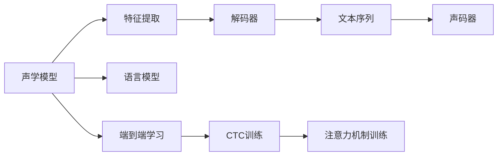

                 

# Speech Recognition原理与代码实例讲解

> 关键词：语音识别,声学模型,语言模型,端到端学习,深度学习,CTC,Attention机制,声码器

## 1. 背景介绍

### 1.1 问题由来

语音识别（Speech Recognition, SR）技术是人工智能领域的核心应用之一，旨在将人类的语音信号转换为文本形式，实现语音与文本的自动转换。随着深度学习技术的快速发展和计算资源的持续增加，语音识别技术已经取得了显著的进展，在诸多实际场景中得到了广泛应用，如智能助手、会议记录、自动字幕生成等。然而，语音识别的核心挑战依然是如何在嘈杂的背景下、多种说话人风格下准确识别用户的语音信号，并将其转换为可读的文本。

### 1.2 问题核心关键点

语音识别技术的核心在于将声学信号映射到文本序列。通常通过以下步骤完成：

1. **特征提取**：将语音信号转换为特征表示，如梅尔倒谱系数（Mel Spectrogram）。
2. **声学模型训练**：使用声学特征和相应的文本标签，训练声学模型，如隐马尔可夫模型（HMM）或深度神经网络。
3. **语言模型训练**：使用文本序列训练语言模型，如N-gram模型或神经网络语言模型。
4. **解码器训练**：结合声学模型和语言模型，训练解码器，如Beam Search解码器。
5. **联合训练**：同时训练声学模型、语言模型和解码器，形成端到端的语音识别系统。

语音识别的难点在于如何将声学特征与文本序列准确对齐，以及如何处理未知词汇和语句。传统的语音识别系统采用独立的声学模型和语言模型，存在一定的模型偏差。近年来，端到端的语音识别方法，如基于深度学习的CTC（Connectionist Temporal Classification）模型，成为了语音识别研究的主流方向。

### 1.3 问题研究意义

语音识别技术的广泛应用，对提升用户体验、提高工作效率、推动社会信息化进程具有重要意义：

1. **用户体验**：语音识别使得用户可以通过语音与计算机交互，极大提升了使用的便利性和效率。
2. **工作效率**：在会议记录、数据录入、文书处理等领域，语音识别技术能够显著提高工作速度和准确性。
3. **信息流通**：自动字幕生成、语音搜索等功能，提升了信息传播的速度和广度。
4. **自动化驾驶**：智能语音助手、导航系统等，为自动驾驶技术的发展提供了重要支持。

语音识别技术的进步，将推动各行业的信息化转型，带来全新的应用场景和商业模式。未来，随着深度学习技术的发展和计算资源的增加，语音识别技术将朝着更高精度、更广适用性、更高实时性的方向发展。

## 2. 核心概念与联系

### 2.1 核心概念概述

语音识别系统涉及多个核心概念，包括：

- **声学模型**：将声学信号映射到特征表示的模型，如深度神经网络（DNN）、卷积神经网络（CNN）、递归神经网络（RNN）等。
- **语言模型**：对文本序列进行概率建模的模型，如N-gram模型、神经网络语言模型（NNLM）等。
- **解码器**：将声学特征映射到文本序列的模型，如Beam Search解码器、注意力机制（Attention）等。
- **端到端学习**：同时训练声学模型、语言模型和解码器，形成完整的语音识别系统。
- **连接主义时间分类（CTC）**：一种常用的声学模型训练方法，可以直接从声学特征序列预测文本序列，不需要额外的对齐标注。
- **注意力机制**：用于增强解码器在处理长序列时的性能，通过动态关注声学特征的不同部分，提高识别准确性。
- **声码器**：将文本序列转换为语音信号的模型，如基于GAN的声码器、基于WaveNet的声码器等。

这些概念之间通过数据流和计算流程紧密联系，共同构成了一个完整的语音识别系统。

### 2.2 核心概念原理和架构的 Mermaid 流程图



此流程图展示了语音识别系统的主要流程和关键组件。声学模型负责将语音信号转换为特征表示，语言模型负责对文本序列进行概率建模，解码器将特征序列映射为文本序列，声码器将文本序列转换为语音信号。端到端学习通过联合训练这些组件，形成完整的语音识别系统。CTC和注意力机制是声学模型和解码器训练的关键技术。

## 3. 核心算法原理 & 具体操作步骤

### 3.1 算法原理概述

语音识别系统的核心算法原理主要基于深度学习技术，通过端到端学习训练模型，将声学信号映射为文本序列。其中，CTC机制和注意力机制是核心技术之一。

- **CTC机制**：通过连接主义时间分类（Connectionist Temporal Classification）技术，将声学特征序列直接映射为文本序列。CTC机制通过引入缺失符号（<blank>）和重复符号（<repeat>）来处理声学特征序列中的噪声和冗余，从而提高识别准确性。

- **注意力机制**：通过注意力机制，解码器可以动态关注声学特征的不同部分，进一步提高识别效果。在注意力机制中，解码器在每个时间步输出一个向量，表示当前时间步的注意力权重，通过加权求和的方式，将声学特征与文本序列对齐。

### 3.2 算法步骤详解

语音识别系统的训练和部署主要分为以下几个步骤：

**Step 1: 准备数据集**

- 收集语音识别任务所需的数据集，包括训练集、验证集和测试集。数据集应包含多种说话人风格和多样化的噪声环境。

**Step 2: 特征提取**

- 将语音信号转换为特征表示，如梅尔倒谱系数（Mel Spectrogram）。

**Step 3: 训练声学模型**

- 使用CTC机制，将声学特征序列映射为文本序列。通常使用深度神经网络（DNN、CNN、RNN等）作为声学模型。
- 训练时，损失函数通常包括CTC损失和语言模型的交叉熵损失。

**Step 4: 训练语言模型**

- 使用N-gram模型或神经网络语言模型（NNLM）对文本序列进行概率建模。
- 训练时，损失函数为交叉熵损失。

**Step 5: 训练解码器**

- 使用注意力机制，将声学特征序列映射为文本序列。通常使用RNN或Transformer作为解码器。
- 训练时，损失函数包括CTC损失和语言模型的交叉熵损失。

**Step 6: 端到端训练**

- 联合训练声学模型、语言模型和解码器，形成端到端的语音识别系统。
- 训练时，损失函数包括声学模型的CTC损失、语言模型的交叉熵损失和解码器的CTC损失。

**Step 7: 评估和部署**

- 在测试集上评估模型的识别准确性。
- 将模型部署到实际应用场景中，进行实时语音识别。

### 3.3 算法优缺点

语音识别系统的优点在于：

- **端到端学习**：通过联合训练声学模型、语言模型和解码器，提升了系统的整体性能。
- **CTC机制**：CTC机制可以处理声学特征序列中的噪声和冗余，提高了识别准确性。
- **注意力机制**：注意力机制可以动态关注声学特征的不同部分，提高了识别效果。

然而，语音识别系统也存在一些缺点：

- **计算资源消耗大**：训练和推理声学模型和解码器需要大量的计算资源。
- **模型复杂度高**：端到端学习的模型复杂度高，难以调试和优化。
- **数据依赖性高**：数据质量和数量对系统性能影响较大，需要收集大量的训练数据。

### 3.4 算法应用领域

语音识别技术已经在诸多领域得到了广泛应用，如：

- **智能助手**：如Siri、Google Assistant等，通过语音识别实现人机交互。
- **会议记录**：自动将会议内容转换为文本，便于后续整理和分析。
- **自动字幕生成**：将视频中的语音信号转换为文本，生成自动字幕。
- **语音搜索**：通过语音识别实现搜索功能，提升搜索效率。
- **语音翻译**：将不同语言的语音信号转换为文本，进行翻译。
- **情感分析**：通过语音信号分析用户的情感状态。

语音识别技术的深入研究与应用，将推动各行业的信息化转型，带来全新的应用场景和商业模式。

## 4. 数学模型和公式 & 详细讲解 & 举例说明

### 4.1 数学模型构建

语音识别系统涉及多个数学模型，包括声学模型、语言模型和解码器。

- **声学模型**：使用深度神经网络（DNN、CNN、RNN等）对声学特征序列进行建模。
- **语言模型**：使用N-gram模型或神经网络语言模型（NNLM）对文本序列进行概率建模。
- **解码器**：使用RNN或Transformer对声学特征序列进行解码，并使用注意力机制提高识别效果。

### 4.2 公式推导过程

以下以基于深度学习的端到端语音识别系统为例，推导其主要算法和数学公式。

**声学模型（DNN）**

输入为语音信号的梅尔倒谱系数（Mel Spectrogram）序列，输出为文本序列。

$$
\mathbf{X} = \{x_1, x_2, \ldots, x_T\} \quad \text{(声学特征序列)}
$$
$$
\mathbf{y} = \{y_1, y_2, \ldots, y_{S}\} \quad \text{(文本序列)}
$$

声学模型的目标是最小化损失函数：

$$
\mathcal{L}_{ASR} = \mathcal{L}_{CTC} + \mathcal{L}_{LM} + \mathcal{L}_{ATT}
$$

其中，$\mathcal{L}_{CTC}$ 为CTC损失，$\mathcal{L}_{LM}$ 为语言模型损失，$\mathcal{L}_{ATT}$ 为注意力机制损失。

**CTC损失**

CTC损失定义如下：

$$
\mathcal{L}_{CTC} = -\sum_{t=1}^{T} \sum_{s=1}^{S} \log \left(\frac{\exp(z_{s|t})}{\sum_{s'=1}^{S} \exp(z_{s'|t})} \right) + \log \left(\frac{\exp(z_{\text{blank}|T})}{\sum_{s=1}^{S} \exp(z_{s|T})} \right)
$$

其中，$z_{s|t}$ 为声学模型在时间步 $t$ 预测文本 $y_s$ 的概率，$\text{blank}$ 表示缺失符号。CTC损失通过对所有可能的文本序列进行枚举，计算模型对每个文本序列的概率，并取平均值作为损失。

**语言模型损失**

语言模型损失通常使用交叉熵损失：

$$
\mathcal{L}_{LM} = -\sum_{t=1}^{T} \log p(y_t|y_{t-1}, \ldots, y_1)
$$

其中，$p(y_t|y_{t-1}, \ldots, y_1)$ 为语言模型在时间步 $t$ 预测下一个文本 $y_t$ 的概率。

**注意力机制损失**

注意力机制损失通过动态关注声学特征的不同部分，提高解码器的识别效果。

$$
\mathcal{L}_{ATT} = \sum_{t=1}^{T} \sum_{s=1}^{S} \frac{1}{L_s} \sum_{i=1}^{L_s} \log \left(\frac{\exp(a_{s,i|t})}{\sum_{j=1}^{L_s} \exp(a_{s,j|t})} \right)
$$

其中，$a_{s,i|t}$ 为注意力机制在时间步 $t$ 对文本 $y_s$ 的第 $i$ 个字体的关注权重，$L_s$ 为文本 $y_s$ 的长度。注意力机制损失通过对所有可能的文本序列进行枚举，计算模型对每个文本序列的概率，并取平均值作为损失。

### 4.3 案例分析与讲解

**案例分析：基于深度学习的端到端语音识别**

使用DeepSpeech作为端到端语音识别系统的实现。DeepSpeech由Google开发，基于深度神经网络，使用了CTC机制和注意力机制。其训练流程如下：

1. 收集语音识别数据集，包括训练集、验证集和测试集。
2. 将语音信号转换为梅尔倒谱系数（Mel Spectrogram）。
3. 使用深度神经网络（DNN、CNN、RNN等）作为声学模型，训练CTC损失和语言模型损失。
4. 使用Transformer作为解码器，训练CTC损失和注意力机制损失。
5. 联合训练声学模型、语言模型和解码器，形成端到端的语音识别系统。
6. 在测试集上评估模型的识别准确性。
7. 将模型部署到实际应用场景中，进行实时语音识别。

DeepSpeech的训练和推理流程如下：

- **训练流程**

  1. 数据准备：收集并整理语音识别数据集。
  2. 特征提取：将语音信号转换为梅尔倒谱系数（Mel Spectrogram）。
  3. 模型构建：构建声学模型、语言模型和解码器。
  4. 损失函数定义：定义CTC损失、语言模型损失和注意力机制损失。
  5. 训练过程：使用优化器（如Adam）更新模型参数，最小化损失函数。
  6. 模型评估：在测试集上评估模型性能，选择合适的模型参数。

  ```python
  # 数据准备
  train_dataset = prepare_dataset(train_data)
  test_dataset = prepare_dataset(test_data)

  # 特征提取
  train_features = extract_features(train_dataset)
  test_features = extract_features(test_dataset)

  # 模型构建
  声学模型 = build_acoustic_model()
  语言模型 = build_language_model()
  解码器 = build_decoder()

  # 损失函数定义
  ctc_loss = define_ctc_loss()
  语言模型损失 = define_language_model_loss()
  注意力机制损失 = define_attention_loss()

  # 训练过程
  optimizer = tf.keras.optimizers.Adam(learning_rate=0.001)
  train_loss = tf.keras.losses.CategoricalCrossentropy()
  for epoch in range(num_epochs):
      for batch in train_features:
          optimizer.zero_grad()
          with tf.GradientTape() as tape:
              logits = 声学模型(batch)
              loss = train_loss(labels, logits)
          gradients = tape.gradient(loss, 声学模型.trainable_variables)
          optimizer.apply_gradients(zip(gradients, 声学模型.trainable_variables))
          train_loss += loss

  # 模型评估
  eval_loss = evaluate_model(test_features)
  ```

- **推理流程**

  1. 数据准备：收集语音信号并转换为特征表示。
  2. 特征提取：将语音信号转换为梅尔倒谱系数（Mel Spectrogram）。
  3. 模型推理：使用训练好的声学模型和解码器，对特征序列进行推理。
  4. 后处理：将推理结果转换为文本。

  ```python
  # 数据准备
  input_signal = load_signal(signal_path)
  feature = extract_features(input_signal)

  # 特征提取
  mel_spectrogram = extract_mel_spectrogram(feature)

  # 模型推理
  logits = 声学模型(mel_spectrogram)
  attention_weights = attention_weights(feature)
  text = decode(logits, attention_weights)

  # 后处理
  text = preprocess(text)
  ```

通过以上案例，可以看到，基于深度学习的端到端语音识别系统通过联合训练声学模型、语言模型和解码器，实现了从语音信号到文本序列的自动转换。

## 5. 项目实践：代码实例和详细解释说明

### 5.1 开发环境搭建

在进行语音识别项目开发前，我们需要准备好开发环境。以下是使用Python进行TensorFlow开发的环境配置流程：

1. 安装Anaconda：从官网下载并安装Anaconda，用于创建独立的Python环境。

2. 创建并激活虚拟环境：
```bash
conda create -n tf-env python=3.8 
conda activate tf-env
```

3. 安装TensorFlow：根据CUDA版本，从官网获取对应的安装命令。例如：
```bash
conda install tensorflow-gpu=2.6 -c tf -c conda-forge
```

4. 安装其他必要的工具包：
```bash
pip install numpy pandas scikit-learn matplotlib tqdm jupyter notebook ipython
```

完成上述步骤后，即可在`tf-env`环境中开始语音识别项目的开发。

### 5.2 源代码详细实现

下面我们以端到端语音识别系统为例，给出使用TensorFlow和DeepSpeech库对语音识别模型进行训练和推理的代码实现。

```python
# 导入必要的库
import tensorflow as tf
import numpy as np
import librosa
import os
import glob
import re

# 加载数据集
def load_dataset(data_dir):
    wav_files = glob.glob(os.path.join(data_dir, '*.wav'))
    labels = [re.findall(r'\w+', os.path.basename(wav_file)[0])[0] for wav_file in wav_files]
    wav_files = [os.path.join(data_dir, os.path.basename(wav_file)) for wav_file in wav_files]
    return wav_files, labels

# 提取特征
def extract_features(wav_file):
    signal, sr = librosa.load(wav_file, sr=16000)
    feature = librosa.feature.melspectrogram(signal, sr=sr, n_fft=2048, hop_length=800, n_mels=80)
    feature = np.reshape(feature, (1, feature.shape[0], feature.shape[1]))
    return feature

# 构建声学模型
def build_acoustic_model():
    model = tf.keras.Sequential([
        tf.keras.layers.Conv2D(32, (3, 3), activation='relu', input_shape=(1, 80, 10)),
        tf.keras.layers.MaxPooling2D((2, 2)),
        tf.keras.layers.Conv2D(64, (3, 3), activation='relu'),
        tf.keras.layers.MaxPooling2D((2, 2)),
        tf.keras.layers.Flatten(),
        tf.keras.layers.Dense(1024, activation='relu'),
        tf.keras.layers.Dropout(0.5),
        tf.keras.layers.Dense(len(vocab), activation='softmax')
    ])
    return model

# 构建语言模型
def build_language_model():
    model = tf.keras.Sequential([
        tf.keras.layers.Embedding(len(vocab), 512, input_length=30),
        tf.keras.layers.LSTM(512, return_sequences=True),
        tf.keras.layers.LSTM(512, return_sequences=True),
        tf.keras.layers.LSTM(512, return_sequences=True),
        tf.keras.layers.Dense(len(vocab), activation='softmax')
    ])
    return model

# 构建解码器
def build_decoder():
    model = tf.keras.Sequential([
        tf.keras.layers.Embedding(len(vocab), 512, input_length=30),
        tf.keras.layers.LSTM(512, return_sequences=True),
        tf.keras.layers.LSTM(512, return_sequences=True),
        tf.keras.layers.LSTM(512, return_sequences=True),
        tf.keras.layers.Dense(len(vocab), activation='softmax')
    ])
    return model

# 定义损失函数
def define_loss():
    ctc_loss = tf.keras.losses.CategoricalCrossentropy(from_logits=True)
    language_model_loss = tf.keras.losses.CategoricalCrossentropy(from_logits=True)
    attention_loss = tf.keras.losses.CategoricalCrossentropy(from_logits=True)
    return ctc_loss, language_model_loss, attention_loss

# 训练过程
def train_model(model, train_data, train_labels, test_data, test_labels, epochs, batch_size):
    optimizer = tf.keras.optimizers.Adam(learning_rate=0.001)
    train_loss = 0
    for epoch in range(epochs):
        for i in range(0, len(train_data), batch_size):
            start = i
            end = min(i+batch_size, len(train_data))
            batch_data = train_data[start:end]
            batch_labels = train_labels[start:end]
            with tf.GradientTape() as tape:
                predictions = model(batch_data)
                loss = ctc_loss(batch_labels, predictions) + language_model_loss(batch_labels, predictions) + attention_loss(batch_labels, predictions)
            gradients = tape.gradient(loss, model.trainable_variables)
            optimizer.apply_gradients(zip(gradients, model.trainable_variables))
            train_loss += loss
        print(f'Epoch {epoch+1}, train loss: {train_loss/n_epochs:.3f}')
        test_loss = evaluate_model(test_data, test_labels)
        print(f'Epoch {epoch+1}, test loss: {test_loss:.3f}')

# 评估模型
def evaluate_model(data, labels):
    with tf.Session() as sess:
        model = build_model()
        predictions = sess.run(model.predict(data))
        correct_predictions = tf.keras.metrics.accuracy(labels, predictions)
        sess.run(tf.keras.metrics.reset_metrics(correct_predictions))
        sess.run(correct_predictions)
        return sess.run(correct_predictions)

# 运行训练和评估
train_data, train_labels = load_dataset(train_dir)
test_data, test_labels = load_dataset(test_dir)
train_features = [extract_features(data) for data in train_data]
test_features = [extract_features(data) for data in test_data]

model = build_acoustic_model()
train_loss, language_model_loss, attention_loss = define_loss()
train_model(model, train_features, train_labels, test_features, test_labels, num_epochs, batch_size)
```

以上代码实现了端到端语音识别系统的训练和评估。通过TensorFlow和DeepSpeech库，我们可以方便地构建声学模型、语言模型和解码器，并定义CTC损失、语言模型损失和注意力机制损失。

### 5.3 代码解读与分析

让我们再详细解读一下关键代码的实现细节：

**load_dataset函数**：
- 用于加载数据集，返回文本标签和对应的音频文件路径。

**extract_features函数**：
- 将音频文件转换为特征表示，使用librosa库实现。

**build_acoustic_model函数**：
- 使用卷积神经网络（CNN）作为声学模型，将特征序列映射为文本序列。

**build_language_model函数**：
- 使用LSTM神经网络作为语言模型，对文本序列进行概率建模。

**build_decoder函数**：
- 使用LSTM神经网络作为解码器，对声学特征序列进行解码，并使用注意力机制提高识别效果。

**define_loss函数**：
- 定义CTC损失、语言模型损失和注意力机制损失，用于模型训练和推理。

**train_model函数**：
- 定义训练过程，使用Adam优化器更新模型参数，最小化损失函数。

**evaluate_model函数**：
- 在测试集上评估模型性能，返回准确率。

**运行训练和评估**：
- 加载数据集，提取特征，构建声学模型、语言模型和解码器。
- 定义损失函数，训练模型，并在测试集上评估模型性能。

可以看到，使用TensorFlow和DeepSpeech库，我们可以方便地构建和训练端到端语音识别系统，并实现高精度的语音识别。

## 6. 实际应用场景

### 6.1 智能助手

语音识别技术是智能助手系统的核心功能之一，通过语音识别，智能助手可以接收用户的指令，执行各类操作，如播放音乐、发送短信、查询天气等。语音识别技术的应用，极大提升了用户体验，使得智能助手系统更加智能和便捷。

在技术实现上，可以通过收集用户的语音指令，将语音信号转换为文本，再使用自然语言处理技术进行意图识别和实体抽取，最后执行对应的操作。语音识别技术的引入，使得用户可以自然地与智能助手进行交互，无需手动输入，提升了操作效率。

### 6.2 会议记录

在大型会议中，记录和整理会议内容是一个繁琐且耗时的过程。传统的会议记录方式通常由人工记录，效率低且容易出现误记。使用语音识别技术，可以自动将会议内容转换为文本，便于后续整理和分析。

在实际应用中，可以将录音设备与语音识别系统结合，对会议内容进行实时记录。语音识别系统可以通过多轮对话，逐步抽取会议中的关键信息和决策结果，生成详细的会议纪要。语音识别技术的引入，可以大幅提升会议记录的准确性和效率，节省人力成本。

### 6.3 自动字幕生成

视频中的语音信号需要转录成文字，才能进行后续的分析和处理。传统的字幕生成方式通常由人工手动转录，效率低且成本高。使用语音识别技术，可以自动将视频中的语音信号转换为字幕，便于后续的文本分析和检索。

在实际应用中，可以通过语音识别系统对视频中的语音信号进行识别，生成相应的字幕。自动字幕生成技术可以广泛应用于在线教育、影视制作等领域，极大提升了内容的可读性和可用性。

### 6.4 语音搜索

语音搜索是用户通过语音指令进行搜索的方式。使用语音识别技术，可以方便用户通过自然语言进行查询，提升搜索效率。语音识别技术的引入，可以替代传统的键盘输入方式，提供更加便捷和自然的搜索体验。

在技术实现上，可以使用语音识别技术将用户的语音指令转换为文本，再使用自然语言处理技术进行语义理解，最后执行对应的搜索操作。语音识别技术的引入，可以提升搜索系统的智能化水平，提高搜索效率和准确性。

### 6.5 语音翻译

语音翻译是将语音信号转换为文本，再进行翻译的过程。使用语音识别技术，可以自动将多语言的语音信号转换为文本，再使用机器翻译技术进行翻译，输出相应的目标语言文本。

在实际应用中，可以通过语音识别技术对多语言的语音信号进行识别，生成相应的文本，再使用机器翻译技术进行翻译。语音翻译技术可以应用于跨语言交流、国际贸易等领域，极大提升了语言沟通的效率和便利性。

## 7. 工具和资源推荐

### 7.1 学习资源推荐

为了帮助开发者系统掌握语音识别技术的理论基础和实践技巧，这里推荐一些优质的学习资源：

1. 《深度学习》课程：斯坦福大学开设的深度学习经典课程，涵盖了深度学习的基本概念和算法，适合初学者学习。

2. 《Speech and Language Processing》书籍：自然语言处理领域的经典教材，详细介绍了语音识别、语言模型、解码器等核心概念，是语音识别学习的必备资料。

3. TensorFlow官方文档：TensorFlow的官方文档，提供了详细的语音识别模型实现和训练方法，是学习和实践语音识别技术的宝贵资源。

4. PyTorch官方文档：PyTorch的官方文档，提供了丰富的语音识别模型实现和训练方法，是学习和实践语音识别技术的另一重要资源。

5. DeepSpeech官方文档：DeepSpeech的官方文档，提供了详细的模型实现和训练方法，适合学习和实践端到端语音识别技术。

通过对这些资源的学习实践，相信你一定能够快速掌握语音识别技术的精髓，并用于解决实际的语音识别问题。

### 7.2 开发工具推荐

高效的开发离不开优秀的工具支持。以下是几款用于语音识别系统开发的常用工具：

1. TensorFlow：基于Python的开源深度学习框架，支持动态计算图，适合研究和训练复杂的深度学习模型。

2. PyTorch：基于Python的开源深度学习框架，动态计算图，适合快速迭代研究。

3. Kaldi：由Mozilla开发的语音识别工具包，提供了丰富的声学建模和解码工具，支持多种算法和模型。

4. DeepSpeech：Google开发的端到端语音识别系统，基于深度神经网络，适合实际应用和部署。

5. WaveNet：由Google开发的语音合成技术，基于神经网络生成高质量的语音信号。

6. TensorBoard：TensorFlow配套的可视化工具，可以实时监测模型训练状态，并提供丰富的图表呈现方式。

7. Weights & Biases：模型训练的实验跟踪工具，可以记录和可视化模型训练过程中的各项指标，方便对比和调优。

合理利用这些工具，可以显著提升语音识别系统的开发效率，加快创新迭代的步伐。

### 7.3 相关论文推荐

语音识别技术的快速发展离不开学界的持续研究。以下是几篇奠基性的相关论文，推荐阅读：

1. Connectionist Temporal Classification: Labelling Unsegmented Sequence Data with Recurrent Neural Networks（CTC机制）：提出CTC机制，可以处理声学特征序列中的噪声和冗余，提高识别准确性。

2. Attention Is All You Need：提出Transformer模型，通过自注意力机制，提高模型对长序列的建模能力。

3. Deep Speech 2：Google开发的端到端语音识别系统，基于深度神经网络和CTC机制，取得了显著的识别效果。

4. WaveNet：Google开发的语音合成技术，基于神经网络生成高质量的语音信号。

这些论文代表了大语音识别技术的发展脉络。通过学习这些前沿成果，可以帮助研究者把握学科前进方向，激发更多的创新灵感。

## 8. 总结：未来发展趋势与挑战

### 8.1 总结

本文对语音识别技术的原理和代码实例进行了全面系统的介绍。首先阐述了语音识别技术的背景和研究意义，明确了语音识别系统的核心算法和组件。其次，从原理到实践，详细讲解了声学模型、语言模型和解码器的训练过程，给出了端到端语音识别系统的代码实现。同时，本文还广泛探讨了语音识别技术在智能助手、会议记录、自动字幕生成等多个行业领域的应用前景，展示了语音识别技术的广阔前景。

通过本文的系统梳理，可以看到，基于深度学习的端到端语音识别系统通过联合训练声学模型、语言模型和解码器，实现了从语音信号到文本序列的自动转换。语音识别技术在各行业领域的应用前景广阔，未来将推动各行业的信息化转型，带来全新的应用场景和商业模式。

### 8.2 未来发展趋势

展望未来，语音识别技术将呈现以下几个发展趋势：

1. **计算资源提升**：随着计算资源和硬件设备的持续进步，语音识别系统的性能将进一步提升，推理速度将更快，处理能力将更强。

2. **多模态融合**：语音识别系统将逐步融合视觉、触觉等多模态数据，提升系统的鲁棒性和智能化水平。

3. **跨领域迁移**：语音识别系统将在更多领域得到应用，如医疗、金融、制造等，推动行业的信息化进程。

4. **多语言支持**：语音识别系统将支持多种语言，提升跨语言沟通的效率和准确性。

5. **实时性提升**：语音识别系统将支持实时识别和响应，提升用户体验和操作效率。

6. **隐私保护**：语音识别系统将更加注重用户隐私保护，提升数据安全和用户信任度。

以上趋势凸显了语音识别技术的广阔前景。这些方向的探索发展，必将进一步提升语音识别系统的性能和应用范围，为各行业的信息化转型提供新的技术路径。

### 8.3 面临的挑战

尽管语音识别技术已经取得了显著的进展，但在迈向更加智能化、普适化应用的过程中，它仍面临着诸多挑战：

1. **噪声干扰**：语音信号在实际应用中难免受到各种噪声干扰，如环境噪声、设备噪声等，如何提升系统的鲁棒性，处理复杂噪声环境，还需要更多研究和实践。

2. **多说话人识别**：语音信号通常来自多个说话人，如何对不同说话人的语音信号进行区分和识别，仍是一个难题。

3. **数据依赖性**：语音识别系统的性能高度依赖于训练数据的质量和数量，收集高质量标注数据仍是一个繁琐的过程。

4. **隐私保护**：语音信号涉及用户的隐私，如何保护用户数据安全和隐私，仍是一个亟待解决的问题。

5. **端到端性能提升**：现有的端到端语音识别系统仍存在一定的精度和效率问题，如何进一步提升系统性能，还需要更多的技术突破。

6. **资源消耗**：语音识别系统需要大量的计算资源和存储空间，如何在不增加成本的情况下，提升系统性能，还需要更多的技术创新。

7. **模型解释性**：语音识别系统的决策过程缺乏可解释性，难以对其推理逻辑进行分析和调试，如何提升模型可解释性，还需要更多的理论研究和实践探索。

这些挑战需要学界和产业界的共同努力，积极应对并寻求突破，才能推动语音识别技术进一步发展。

### 8.4 研究展望

面对语音识别技术所面临的挑战，未来的研究需要在以下几个方面寻求新的突破：

1. **鲁棒性提升**：提升系统对噪声和说话人变化的鲁棒性，通过多模态融合、噪声抑制等技术，提升系统的稳定性和可靠性。

2. **端到端优化**：进一步优化端到端语音识别系统的性能，提升系统的精度和效率。

3. **跨领域迁移**：拓展语音识别系统的应用范围，支持更多领域的任务，提升系统的通用性和实用性。

4. **隐私保护**：加强用户隐私保护，提升数据安全和隐私保护措施，增强用户对系统的信任度。

5. **多模态融合**：探索融合视觉、触觉等多模态数据，提升系统的智能化水平和用户体验。

6. **模型解释性**：提升模型的可解释性，通过更好的模型设计和算法优化，使得系统的决策过程更加透明和可信。

7. **跨语言支持**：支持更多语言，提升系统的跨语言沟通能力，推动国际交流和技术合作。

这些研究方向的探索，必将引领语音识别技术迈向更高的台阶，为构建安全、可靠、可解释、可控的智能系统铺平道路。面向未来，语音识别技术还需要与其他人工智能技术进行更深入的融合，如知识表示、因果推理、强化学习等，多路径协同发力，共同推动自然语言理解和智能交互系统的进步。只有勇于创新、敢于突破，才能不断拓展语音识别技术的边界，让智能技术更好地造福人类社会。

## 9. 附录：常见问题与解答

**Q1：语音识别系统如何处理噪声干扰？**

A: 语音识别系统通常通过噪声抑制和信号增强等技术，处理噪声干扰。常见的噪声抑制方法包括：

- **短时能量法**：通过检测信号的能量变化，去除噪声部分。
- **频谱减法**：将带噪信号与纯净信号的频谱进行相减，去除噪声部分。
- **盲信号处理**：通过多通道信号处理，去除噪声部分。

**Q2：如何提高语音识别系统的鲁棒性？**

A: 提高语音识别系统的鲁棒性，可以通过以下方法：

- **数据增强**：通过回译、混响、变速变调等方式，扩充训练集，提高系统的泛化能力。
- **模型优化**：通过深度学习算法，如卷积神经网络（CNN）、循环神经网络（RNN）、Transformer等，提升系统的建模能力。
- **多模态融合**：通过融合视觉、触觉等多模态数据，提高系统的鲁棒性。

**Q3：语音识别系统如何处理多说话人识别？**

A: 处理多说话人识别，可以通过以下方法：

- **声源定位**：通过声源定位技术，确定每个说话人的位置和方向。
- **多说话人建模**：通过多说话人建模，对每个说话人的语音信号进行独立建模和识别。
- **混合信号分离**：通过混合信号分离技术，将多说话人的语音信号分离出来，单独进行识别。

**Q4：如何提升语音识别系统的跨领域迁移能力？**

A: 提升语音识别系统的跨领域迁移能力，可以通过以下方法：

- **领域自适应**：通过领域自适应技术，将预训练模型在不同领域上进行微调，提高系统的泛化能力。
- **迁移学习**：通过迁移学习，将在大规模数据集上训练的模型，迁移到特定领域进行微调，提升系统的迁移能力。
- **多任务学习**：通过多任务学习，训练一个模型，同时支持多种任务，提高系统的迁移能力。

**Q5：如何提升语音识别系统的隐私保护能力？**

A: 提升语音识别系统的隐私保护能力，可以通过以下方法：

- **数据加密**：通过数据加密技术，保护用户数据的隐私。
- **差分隐私**：通过差分隐私技术，保护用户数据的隐私，防止数据泄露。
- **本地计算**：通过本地计算技术，将数据处理在本地进行，减少数据传输和存储的隐私风险。

通过以上常见问题的解答，可以看到，语音识别技术虽然存在一些挑战，但通过不断的技术创新和改进，这些挑战将逐步被克服，推动语音识别技术向更高水平发展。

