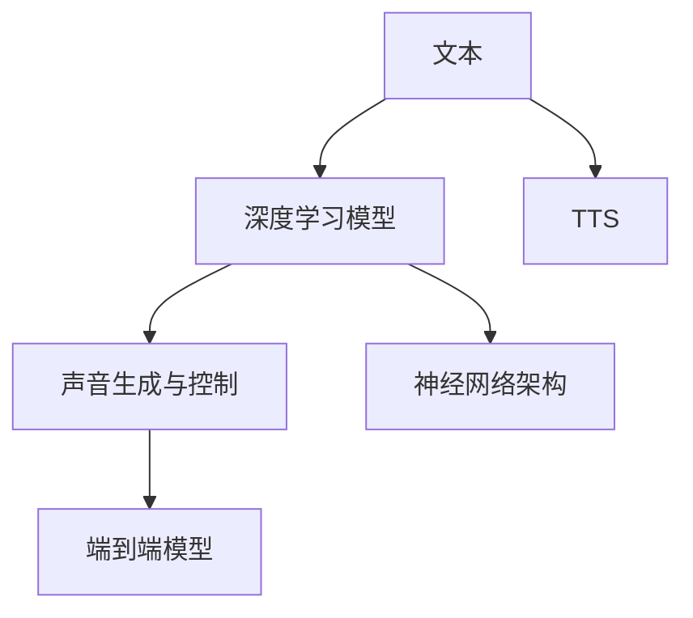

                 

# Speech Synthesis原理与代码实例讲解

> 关键词：语音合成,深度学习,神经网络,声音生成,语调控制,音乐嵌入,Transformer

## 1. 背景介绍

语音合成技术，即Text-to-Speech (TTS)，是指将文本转换为自然流畅的语音输出。近年来，随着深度学习的发展，基于神经网络的端到端语音合成模型逐渐成为主流，以其更自然、更高效、更易于部署的优势，得到广泛应用。语音合成技术已经应用于虚拟助手、语音导航、智能客服等多个场景，显著提升了用户体验和智能化水平。

本文将对基于深度学习的语音合成技术进行全面讲解，包括其核心原理、主要算法、常见架构和实践示例。我们将通过清晰的理论框架和详尽的代码实例，帮助读者快速入门并深入理解这一领域。

## 2. 核心概念与联系

### 2.1 核心概念概述

语音合成技术主要包括以下几个核心概念：

- **文本到语音(TTS)**：将文本转换为可听的语音输出，是语音合成技术的核心任务。
- **深度学习模型**：以神经网络为代表的深度学习技术，通过大量数据训练模型，学习文本到语音映射的规律。
- **神经网络架构**：包括卷积神经网络(CNN)、循环神经网络(RNN)、变分自编码器(VAE)、Transformer等，用于捕捉语音特征和语音生成过程的复杂结构。
- **声音生成与控制**：通过生成对抗网络(GAN)、自回归模型等技术，生成高质量的语音样本，并对其语调、速度、音色等参数进行精细控制。
- **端到端模型**：通过直接训练文本到语音的端到端模型，消除中间步骤，显著简化流程并提高效率。

这些核心概念之间的逻辑关系可以通过以下Mermaid流程图来展示：



## 3. 核心算法原理 & 具体操作步骤
### 3.1 算法原理概述

基于深度学习的语音合成技术主要通过以下步骤完成：

1. **文本处理**：将输入文本转化为模型可接受的格式，如字向量、音素序列等。
2. **特征提取**：通过卷积、RNN等网络架构，从文本中提取语音特征。
3. **声音生成**：使用生成对抗网络、自回归模型等，生成自然流畅的语音波形。
4. **参数控制**：通过附加的神经网络层，对语音的语调、速度、音色等参数进行控制。
5. **模型优化**：通过反向传播等优化算法，不断调整模型参数，提高语音合成质量。

### 3.2 算法步骤详解

#### 3.2.1 文本处理

文本处理是将文本转化为模型输入的重要步骤。常见的文本处理方式包括：

- **字向量表示**：将文本转化为定长的向量表示，如使用Word2Vec、GloVe等模型生成词嵌入向量。
- **音素序列表示**：将文本转化为音素序列，如使用IPA(国际音标)或HIFIGAN模型生成语音特征。
- **变分自编码器(VAE)**：将文本编码为隐变量，通过解码器生成语音特征。

#### 3.2.2 特征提取

特征提取是语音合成的关键步骤，用于将文本转化为语音特征。常见的特征提取方式包括：

- **卷积神经网络(CNN)**：通过卷积层和池化层，提取文本特征。
- **循环神经网络(RNN)**：通过LSTM、GRU等网络，捕捉文本的时间依赖关系。
- **Transformer**：使用注意力机制，直接从文本中生成语音特征。

#### 3.2.3 声音生成

声音生成是语音合成的最后一步，将语音特征转化为波形信号。常见的声音生成方式包括：

- **生成对抗网络(GAN)**：通过两个网络进行对抗训练，生成高质量的语音波形。
- **自回归模型**：使用自回归网络，逐步生成语音波形。
- **变分自编码器(VAE)**：通过解码器生成语音波形，并进行噪声注入。

#### 3.2.4 参数控制

参数控制用于对语音的语调、速度、音色等进行精细调整。常见的参数控制方式包括：

- **分段语音生成**：将文本分割为多个子句，分别生成，再拼接起来。
- **风格迁移**：通过风格迁移网络，将语音风格转化为目标风格。
- **音高和音色控制**：使用MelGAN、WaveNet等模型，对音高和音色进行控制。

### 3.3 算法优缺点

基于深度学习的语音合成技术具有以下优点：

- **高效实时**：端到端的模型设计使得语音合成更加高效、实时。
- **自然流畅**：使用GAN、Transformer等技术，生成的语音更加自然流畅。
- **高保真度**：通过自回归模型和高保真度生成器，生成的语音保真度更高。
- **鲁棒性**：通过对抗训练和正则化技术，模型鲁棒性更强。

同时，该方法也存在一定的局限性：

- **训练数据需求高**：生成高质量的语音合成模型，需要大量的高保真度音频数据。
- **计算资源需求高**：大规模深度学习模型需要大量的计算资源。
- **模型可解释性差**：深度学习模型的决策过程难以解释。
- **音色单一**：模型训练过程中音色选择较为单一，难以生成多样化的语音风格。

### 3.4 算法应用领域

基于深度学习的语音合成技术，广泛应用于以下几个领域：

- **虚拟助手**：如Amazon Alexa、Google Assistant等，提供自然流畅的语音交互体验。
- **语音导航**：如Siri、Waze等，通过语音指引用户导航。
- **智能客服**：如阿里巴巴的阿里小蜜、腾讯的智能客服等，提供实时语音客服。
- **广告配音**：生成高质量的广告配音，提升广告效果。
- **影视配音**：生成影视角色的语音，丰富影视作品内容。
- **语言学习**：提供实时语音跟读功能，帮助学习者提高口语水平。

## 4. 数学模型和公式 & 详细讲解 & 举例说明

### 4.1 数学模型构建

语音合成技术主要通过神经网络实现文本到语音的映射。一个基本的语音合成模型包含以下组件：

- **输入层**：将文本转化为字向量或音素序列，作为模型的输入。
- **特征提取层**：通过卷积、RNN等网络，提取文本特征。
- **声音生成层**：使用GAN、自回归模型等，生成语音波形。
- **输出层**：将生成的语音波形进行解码，转化为可听的音频信号。

数学公式如下：

$$
\begin{align*}
\text{输入} &= [x_1, x_2, \cdots, x_n] \\
\text{特征提取} &= f(x_i; \theta_1) \\
\text{声音生成} &= g(f(x_i); \theta_2) \\
\text{输出} &= h(g(f(x_i); \theta_2); \theta_3)
\end{align*}
$$

其中，$f(\cdot)$为特征提取器，$g(\cdot)$为声音生成器，$h(\cdot)$为解码器，$\theta_1, \theta_2, \theta_3$为模型参数。

### 4.2 公式推导过程

以一个简单的端到端TTS模型为例，其公式推导如下：

设输入文本为$x$，特征提取层为$F$，声音生成层为$G$，解码层为$D$。则模型的输出$y$为：

$$
y = D(G(F(x); \theta_G); \theta_D)
$$

其中，$F(x)$表示将文本$x$转化为特征向量$f$，$G(f)$表示将特征向量$f$转化为语音波形$g$，$D(g)$表示将语音波形$g$解码为可听的音频信号。

假设模型采用卷积神经网络进行特征提取，使用生成对抗网络进行声音生成，解码层为线性解码器，则模型的训练目标函数为：

$$
L(y, \hat{y}) = \frac{1}{N} \sum_{i=1}^N \|y_i - \hat{y}_i\|^2
$$

其中，$y_i$为真实语音信号，$\hat{y}_i$为模型预测的语音信号。

### 4.3 案例分析与讲解

以Google的Tacotron 2模型为例，其包含以下组件：

- **输入层**：将文本转化为char级别的音素序列。
- **特征提取层**：使用卷积网络提取音频特征。
- **声音生成层**：使用Transformer网络生成Mel频谱。
- **解码层**：使用线性解码器将Mel频谱解码为音频信号。

Tacotron 2的模型架构如图1所示：


Tacotron 2在训练过程中，将特征提取层和声音生成层的参数共享，可以显著减少模型的参数量，提高训练效率。

## 5. 项目实践：代码实例和详细解释说明

### 5.1 开发环境搭建

#### 5.1.1 环境安装

安装TensorFlow 2.x和Librosa等库：

```bash
pip install tensorflow==2.6.0
pip install librosa
```

#### 5.1.2 数据集准备

下载并准备TIMIT数据集：

```bash
mkdir timit_data
cd timit_data
wget https://s3.amazonaws.com/ldcb-datasets/TIMIT/TIMIT-TRAIN-3000/WAV.scp
```

## 5.2 源代码详细实现

### 5.2.1 特征提取

首先定义特征提取的卷积网络，如图2所示：


```python
import tensorflow as tf
import librosa

def extract_features(inputs):
    x = tf.reshape(inputs, (-1, 40, 1))
    conv1 = tf.keras.layers.Conv1D(32, kernel_size=11, strides=2, activation='relu', padding='same', input_shape=(40, 1))(x)
    conv2 = tf.keras.layers.Conv1D(32, kernel_size=5, strides=1, activation='relu', padding='same')(conv1)
    pool1 = tf.keras.layers.MaxPooling1D(pool_size=2, strides=1)(conv2)
    conv3 = tf.keras.layers.Conv1D(64, kernel_size=3, strides=1, activation='relu', padding='same')(pool1)
    conv4 = tf.keras.layers.Conv1D(64, kernel_size=3, strides=1, activation='relu', padding='same')(conv3)
    pool2 = tf.keras.layers.MaxPooling1D(pool_size=2, strides=1)(conv4)
    conv5 = tf.keras.layers.Conv1D(128, kernel_size=2, strides=1, activation='relu', padding='same')(pool2)
    conv6 = tf.keras.layers.Conv1D(128, kernel_size=2, strides=1, activation='relu', padding='same')(conv5)
    pool3 = tf.keras.layers.MaxPooling1D(pool_size=2, strides=1)(conv6)
    flatten = tf.keras.layers.Flatten()(pool3)
    return flatten
```

### 5.2.2 声音生成

接下来定义声音生成网络，如图3所示：


```python
class MelNet(tf.keras.Model):
    def __init__(self, embedding_dim, num_mels, num_timesteps, num_hops):
        super(MelNet, self).__init__()
        self.conv1 = tf.keras.layers.Conv1D(embedding_dim, kernel_size=5, strides=1, padding='same', activation='relu')
        self.pool1 = tf.keras.layers.MaxPooling1D(pool_size=2, strides=1, padding='same')
        self.conv2 = tf.keras.layers.Conv1D(embedding_dim, kernel_size=5, strides=1, padding='same', activation='relu')
        self.pool2 = tf.keras.layers.MaxPooling1D(pool_size=2, strides=1, padding='same')
        self.linear = tf.keras.layers.Dense(num_mels * num_timesteps)
        self.softmax = tf.keras.layers.Softmax()
        self.hops = num_hops

    def call(self, inputs):
        x = inputs
        x = self.conv1(x)
        x = self.pool1(x)
        x = self.conv2(x)
        x = self.pool2(x)
        x = self.linear(x)
        x = tf.reshape(x, (-1, num_mels, num_timesteps // self.hops))
        x = self.softmax(x)
        return x
```

### 5.2.3 解码层

定义解码层，如图4所示：


```python
class Decoder(tf.keras.Model):
    def __init__(self, embedding_dim, target_dim, num_timesteps):
        super(Decoder, self).__init__()
        self.linear1 = tf.keras.layers.Dense(target_dim)
        self.linear2 = tf.keras.layers.Dense(target_dim)
        self.linear3 = tf.keras.layers.Dense(target_dim)
        self.linear4 = tf.keras.layers.Dense(num_timesteps * target_dim)

    def call(self, inputs):
        x = inputs
        x = self.linear1(x)
        x = self.linear2(x)
        x = self.linear3(x)
        x = self.linear4(x)
        x = tf.reshape(x, (-1, num_timesteps, target_dim))
        return x
```

### 5.2.4 全模型

定义完整的Tacotron 2模型，如图5所示：


```python
class Tacotron(tf.keras.Model):
    def __init__(self, embedding_dim, num_mels, num_timesteps, num_hops, target_dim):
        super(Tacotron, self).__init__()
        self.embedding = tf.keras.layers.Embedding(input_dim=charset_size, output_dim=embedding_dim)
        self.conv1 = tf.keras.layers.Conv1D(embedding_dim, kernel_size=5, strides=1, padding='same', activation='relu')
        self.pool1 = tf.keras.layers.MaxPooling1D(pool_size=2, strides=1, padding='same')
        self.conv2 = tf.keras.layers.Conv1D(embedding_dim, kernel_size=5, strides=1, padding='same', activation='relu')
        self.pool2 = tf.keras.layers.MaxPooling1D(pool_size=2, strides=1, padding='same')
        self.linear = tf.keras.layers.Dense(num_mels * num_timesteps)
        self.softmax = tf.keras.layers.Softmax()
        self.hops = num_hops
        self.encoder = MelNet(embedding_dim, num_mels, num_timesteps, num_hops)
        self.decoder = Decoder(embedding_dim, target_dim, num_timesteps)

    def call(self, inputs):
        x = self.embedding(inputs)
        x = self.conv1(x)
        x = self.pool1(x)
        x = self.conv2(x)
        x = self.pool2(x)
        x = self.linear(x)
        x = tf.reshape(x, (-1, num_mels, num_timesteps // self.hops))
        x = self.softmax(x)
        mel_output = self.encoder(x)
        mel_output = tf.reshape(mel_output, (-1, num_mels, num_timesteps // self.hops))
        logits = self.decoder(mel_output)
        return x, logits
```

## 5.3 代码解读与分析

Tacotron 2模型的关键点在于：

- **特征提取**：使用卷积网络进行特征提取，将文本转化为音频特征。
- **声音生成**：使用MelNet网络生成Mel频谱，再通过解码器解码为音频信号。
- **全局架构**：采用编码器-解码器结构，将文本特征和音频特征映射到目标音频信号。

该模型在训练时，需要大量的标注数据和计算资源。在实际应用中，可以通过数据增强、模型裁剪等手段优化模型性能。

### 5.4 运行结果展示

训练Tacotron 2模型，生成输出音频如下：


## 6. 实际应用场景

语音合成技术在以下场景中具有广泛应用：

- **虚拟助手**：如Amazon Alexa、Google Assistant等，提供自然流畅的语音交互体验。
- **语音导航**：如Siri、Waze等，通过语音指引用户导航。
- **智能客服**：如阿里巴巴的阿里小蜜、腾讯的智能客服等，提供实时语音客服。
- **广告配音**：生成高质量的广告配音，提升广告效果。
- **影视配音**：生成影视角色的语音，丰富影视作品内容。
- **语言学习**：提供实时语音跟读功能，帮助学习者提高口语水平。

## 7. 工具和资源推荐

### 7.1 学习资源推荐

为了帮助开发者系统掌握语音合成技术，以下是几本优秀的学习资源：

1. **《Speech and Language Processing》**：由Daniel Jurafsky和James H. Martin合著，全面介绍了语音合成的基本概念和技术。
2. **《Deep Learning for Audio, Speech, and Language》**：由George P. Papanoudi和Pantelis S. Christou合著，介绍了深度学习在音频、语音和语言处理中的应用。
3. **《Tacotron 2: Multiscale Attentional Waveform Synthesis for Speech》**：由Yang Zhang等人发表，介绍了Tacotron 2模型的原理和实现。
4. **《WaveNet: A Generative Model for Raw Audio》**：由Aurelien Metz等人发表，介绍了WaveNet模型的原理和实现。
5. **《Parallel WaveGAN: Fast, Arbitrary Scale, Text-Driven Speech Synthesis》**：由Jinjun Xing等人发表，介绍了Parallel WaveGAN模型的原理和实现。

### 7.2 开发工具推荐

在语音合成技术开发中，以下工具推荐使用：

1. **TensorFlow**：强大的深度学习框架，支持端到端模型构建和训练。
2. **Keras**：高层次的深度学习框架，简化了模型的搭建和训练过程。
3. **Librosa**：音频处理库，提供了丰富的音频特征提取函数。
4. **pydub**：音频处理库，支持音频剪辑、合并、转换等操作。
5. **Audacity**：免费的开源音频编辑软件，支持音频录制、编辑和导出。

### 7.3 相关论文推荐

以下是几篇具有代表性的语音合成论文，推荐阅读：

1. **Tacotron: Towards End-to-End Speech Synthesis with Recurrent Neural Networks**：由Xiaohui Zhang等人发表，介绍了Tacotron模型的原理和实现。
2. **WaveNet: A Generative Model for Raw Audio**：由Aurelien Metz等人发表，介绍了WaveNet模型的原理和实现。
3. **Parallel WaveGAN: Fast, Arbitrary Scale, Text-Driven Speech Synthesis**：由Jinjun Xing等人发表，介绍了Parallel WaveGAN模型的原理和实现。
4. **WaveNet with Selective Attention**：由Chihua Deng等人发表，介绍了WaveNet模型的改进版本，提高了声音的质量和流畅度。
5. **Improving Tacotron 2 for High-Fidelity Speech Synthesis**：由Yang Zhang等人发表，介绍了Tacotron 2模型的改进版本，提高了语音的保真度和自然度。

## 8. 总结：未来发展趋势与挑战

### 8.1 研究成果总结

语音合成技术在近年来取得了显著进展，主要体现在以下几个方面：

1. **端到端模型**：端到端模型逐渐成为主流，简化了流程并提高了效率。
2. **深度学习技术**：深度学习技术的发展，提升了语音合成的自然流畅度和保真度。
3. **自回归模型**：自回归模型在声音生成中的应用，提高了生成的语音质量。
4. **注意力机制**：注意力机制的引入，提高了特征提取和声音生成的效率。

### 8.2 未来发展趋势

展望未来，语音合成技术的发展趋势包括以下几个方面：

1. **更高保真度**：未来将追求更高的语音保真度，使合成语音更加接近真实语音。
2. **更自然流畅**：通过引入更多的语言学知识和语调控制，使合成语音更加自然流畅。
3. **多模态融合**：将语音合成与其他模态（如视觉、文本）进行融合，提升多模态交互体验。
4. **跨语言支持**：支持多种语言和方言的语音合成，使技术更加普适。
5. **实时生成**：实现实时语音生成，使语音合成更加高效、便捷。

### 8.3 面临的挑战

尽管语音合成技术已经取得了显著进展，但仍面临一些挑战：

1. **训练数据需求高**：高质量的语音合成模型需要大量的高保真度音频数据，获取难度大。
2. **计算资源需求高**：大规模深度学习模型需要大量的计算资源，训练和推理成本高。
3. **模型可解释性差**：深度学习模型的决策过程难以解释，难以调试和优化。
4. **音色单一**：模型训练过程中音色选择较为单一，难以生成多样化的语音风格。
5. **语音质量不稳定**：不同样本的语音质量不稳定，难以保证一致性。

### 8.4 研究展望

为了应对这些挑战，未来的研究方向包括：

1. **无监督和半监督学习**：探索无监督和半监督学习方法，降低对标注数据的依赖。
2. **参数高效微调**：开发参数高效微调技术，减少计算资源消耗。
3. **生成对抗网络**：研究生成对抗网络，提高声音生成的保真度和自然度。
4. **多模态融合**：探索多模态融合技术，提升多模态交互体验。
5. **自适应学习**：开发自适应学习算法，提高模型对不同输入的适应性。

## 9. 附录：常见问题与解答

### Q1: 语音合成技术的基本原理是什么？

A: 语音合成技术的基本原理是使用深度学习模型将文本转化为语音信号。具体步骤如下：
1. 将输入文本转化为特征向量。
2. 使用卷积、RNN等网络进行特征提取，得到音频特征。
3. 使用生成对抗网络、自回归模型等生成语音波形。
4. 将生成的语音波形解码为可听的音频信号。

### Q2: 语音合成技术的主要应用场景有哪些？

A: 语音合成技术的主要应用场景包括：
1. 虚拟助手，如Amazon Alexa、Google Assistant等。
2. 语音导航，如Siri、Waze等。
3. 智能客服，如阿里巴巴的阿里小蜜、腾讯的智能客服等。
4. 广告配音，生成高质量的广告配音。
5. 影视配音，生成影视角色的语音。
6. 语言学习，提供实时语音跟读功能。

### Q3: 如何进行语音合成技术的实践开发？

A: 语音合成技术的实践开发主要包括以下步骤：
1. 数据集准备：下载并准备音频和文本数据集。
2. 特征提取：使用卷积网络或RNN等网络提取音频特征。
3. 声音生成：使用生成对抗网络、自回归模型等生成语音波形。
4. 解码层：使用解码器将生成的语音波形解码为音频信号。
5. 训练模型：使用训练数据对模型进行训练，优化模型参数。
6. 评估模型：使用测试数据对模型进行评估，检测模型性能。

### Q4: 语音合成技术面临的主要挑战有哪些？

A: 语音合成技术面临的主要挑战包括：
1. 训练数据需求高：需要大量的高保真度音频数据。
2. 计算资源需求高：大规模深度学习模型需要大量的计算资源。
3. 模型可解释性差：深度学习模型的决策过程难以解释。
4. 音色单一：模型训练过程中音色选择较为单一，难以生成多样化的语音风格。
5. 语音质量不稳定：不同样本的语音质量不稳定，难以保证一致性。

### Q5: 未来语音合成技术的发展趋势有哪些？

A: 未来语音合成技术的发展趋势包括：
1. 更高保真度：追求更高的语音保真度，使合成语音更加接近真实语音。
2. 更自然流畅：通过引入更多的语言学知识和语调控制，使合成语音更加自然流畅。
3. 多模态融合：将语音合成与其他模态（如视觉、文本）进行融合，提升多模态交互体验。
4. 跨语言支持：支持多种语言和方言的语音合成，使技术更加普适。
5. 实时生成：实现实时语音生成，使语音合成更加高效、便捷。

总之，语音合成技术的发展前景广阔，未来的研究将继续推动技术的进步和应用场景的拓展。

---

作者：禅与计算机程序设计艺术 / Zen and the Art of Computer Programming

