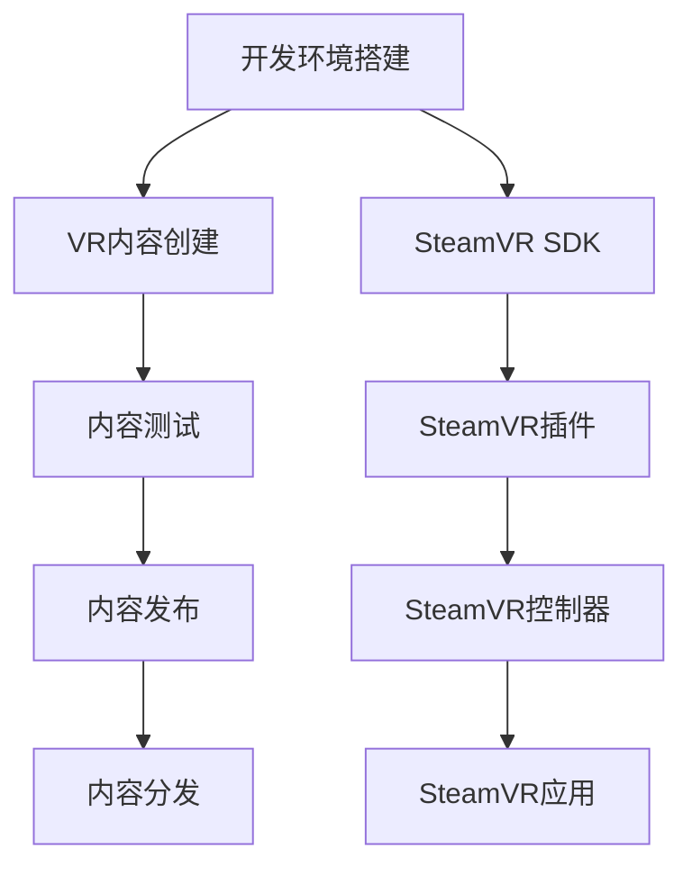

                 

# SteamVR 集成：在 Steam 上发布 VR 内容

在当今数字时代，虚拟现实 (VR) 技术正逐渐成为游戏、娱乐和教育领域不可或缺的一部分。Steam平台作为全球最大的数字内容分发平台之一，为VR开发者提供了极佳的展示和分发渠道。本文将深入探讨如何将VR内容集成并发布到Steam平台，帮助开发者更好地掌握相关技术，提升在Steam上的曝光率。

## 1. 背景介绍

### 1.1 虚拟现实技术

虚拟现实是一种通过计算机模拟出一个虚拟环境，让用户可以沉浸式地与之互动的技术。VR技术通常通过头戴显示器（HMD）和手柄等设备实现，为用户带来身临其境的体验。SteamVR生态系统依托于Steam平台，支持广泛的VR硬件，包括Oculus Rift、HTC Vive等主流设备，为开发者提供了一个开放且易于访问的平台。

### 1.2 SteamVR平台

SteamVR是Steam平台的一个组件，专门用于支持VR内容开发和发布。SteamVR平台提供了强大的工具和API，支持VR内容从设计、测试到发布的整个生命周期。通过SteamVR，开发者可以轻松创建、测试和发布VR游戏、应用和体验。

### 1.3 文章目标

本文旨在详细介绍如何将VR内容集成到Steam平台，包括开发环境搭建、VR内容创建、内容测试、内容发布和内容分发等关键步骤。通过实践操作和案例分析，本文将帮助开发者全面掌握SteamVR集成技术，确保VR内容顺利发布到Steam平台。

## 2. 核心概念与联系

### 2.1 核心概念概述

- **SteamVR SDK**：SteamVR软件开发工具包，提供了VR内容开发所需的API和工具，支持VR设备的跟踪和交互。
- **SteamVR插件**：在Unity或Unreal等游戏引擎中，SteamVR插件用于将VR内容与SteamVR SDK集成。
- **SteamVR控制器**：VR设备中的控制器，用于模拟用户的输入，如手柄和运动控制器。
- **SteamVR应用**：在Steam平台上发布的VR应用，通常通过SteamVR插件打包和分发。

### 2.2 Mermaid 流程图

下面的Mermaid流程图展示了SteamVR内容开发、测试和发布的总体流程：



这个流程图展示了SteamVR内容开发、测试和发布的各个阶段。开发者需按照流程逐步进行，确保每个环节顺利进行。

## 3. 核心算法原理 & 具体操作步骤

### 3.1 算法原理概述

SteamVR集成的核心原理是通过SteamVR SDK和插件，将VR内容与Steam平台无缝集成。开发人员可以利用SteamVR SDK提供的API，编写VR应用，并在SteamVR插件的支持下，将VR应用打包并上传到Steam平台。SteamVR控制器通过SDK与VR应用交互，实现用户的输入和输出。

### 3.2 算法步骤详解

#### 3.2.1 开发环境搭建

1. **安装SteamVR SDK**：
   - 访问SteamVR官网，下载SteamVR SDK并安装。
   - 根据你的设备类型（如Oculus Rift、HTC Vive）选择相应的SDK版本。

2. **安装SteamVR插件**：
   - 对于Unity或Unreal等游戏引擎，安装相应的SteamVR插件。
   - 插件通常可以从SteamVR官网或Unity、Unreal等引擎的资产商店下载。

3. **安装SteamVR控制器**：
   - 为你的VR设备准备相应的控制器。
   - 在SteamVR SDK或插件设置中，配置控制器的映射和设置。

#### 3.2.2 VR内容创建

1. **创建VR应用**：
   - 使用Unity或Unreal等游戏引擎创建VR应用。
   - 确保应用支持SteamVR插件和SDK，并正确配置控制器输入和输出。

2. **测试VR内容**：
   - 在SteamVR环境中测试VR应用，确保交互和渲染效果正常。
   - 记录和解决测试中发现的问题，进行迭代优化。

#### 3.2.3 内容测试

1. **测试VR应用性能**：
   - 在SteamVR环境中，进行性能测试，确保应用在目标设备上的运行流畅。
   - 使用SteamVR提供的性能测试工具，记录并优化帧率、渲染质量等性能指标。

2. **测试VR应用兼容性**：
   - 在不同设备上测试VR应用，确保兼容性。
   - 记录并解决设备兼容问题，确保应用在多种VR设备上都能正常运行。

#### 3.2.4 内容发布

1. **打包VR应用**：
   - 使用SteamVR插件提供的工具，将VR应用打包成Steam支持的格式。
   - 确保应用符合SteamVR的发布标准和要求。

2. **上传VR应用**：
   - 登录Steam开发者账户，上传打包好的VR应用。
   - 在SteamVR发布平台上填写应用信息，包括应用名称、描述、截图、视频等。

3. **发布VR应用**：
   - 提交应用审核，通过审核后，应用将发布到Steam商店。
   - 审核过程中，根据Steam审核团队反馈进行修改和调整。

#### 3.2.5 内容分发

1. **分发到Steam商店**：
   - 用户通过Steam商店下载并安装VR应用。
   - 通过Steam平台，用户可以方便地访问和购买VR应用。

2. **分发到SteamVR平台**：
   - SteamVR平台支持在线和离线模式，用户可以随时访问和体验VR应用。
   - 用户通过SteamVR控制器，交互和享受VR内容。

### 3.3 算法优缺点

#### 3.3.1 优点

- **广泛支持**：SteamVR支持广泛的VR设备和控制器，开发者可以根据需求选择最适合的硬件。
- **集成方便**：SteamVR提供丰富的API和工具，开发过程更加简便和高效。
- **用户基础**：Steam平台拥有庞大的用户基础，可以轻松推广VR内容。
- **生态系统**：SteamVR拥有活跃的开发者社区和丰富的第三方资源，开发者可以获取大量帮助和支持。

#### 3.3.2 缺点

- **学习曲线**：SteamVR集成技术相对复杂，新手开发者可能需要一定时间学习和适应。
- **性能要求**：VR应用需要高性能设备支持，设备要求较高。
- **内容审核**：Steam平台对内容有严格审核机制，开发者需注意内容符合平台规定。
- **成本投入**：VR设备和软件开发需要投入一定的成本，开发和测试周期较长。

### 3.4 算法应用领域

SteamVR集成技术广泛应用于游戏开发、教育培训、虚拟旅游、医疗健康等多个领域。以下是几个具体的应用场景：

1. **游戏开发**：
   - 开发者可以利用SteamVR平台，发布高质量的VR游戏，如《Beat Saber》《Superhot VR》等。
   - VR游戏在沉浸式体验和互动性方面表现优异，受到玩家广泛欢迎。

2. **教育培训**：
   - 通过VR技术，创建虚拟教室和实验室，提供沉浸式学习体验。
   - 例如，利用VR模拟飞行训练、虚拟解剖等，提升学习效果。

3. **虚拟旅游**：
   - 利用VR技术，创建虚拟旅游体验，让用户身临其境地游览名胜古迹。
   - 例如，虚拟游览长城、故宫等著名景点，提升旅游体验。

4. **医疗健康**：
   - 通过VR技术，创建虚拟医疗环境，帮助病人进行心理康复和治疗。
   - 例如，虚拟治疗室和虚拟心理辅导，提升医疗效果。

5. **虚拟会议**：
   - 利用VR技术，创建虚拟会议环境，提供沉浸式互动体验。
   - 例如，虚拟商务会议和虚拟课堂，提升沟通效率。

## 4. 数学模型和公式 & 详细讲解 & 举例说明

### 4.1 数学模型构建

SteamVR集成的数学模型涉及虚拟场景渲染、控制器输入和输出等。以下是一个简单的数学模型示例：

$$
\text{场景渲染} = f(\text{帧率}, \text{渲染质量}, \text{输入参数})
$$

其中，帧率和渲染质量是关键参数，影响VR应用的性能和体验。输入参数包括用户输入、控制器状态等，通过SteamVR SDK和插件进行捕捉和处理。

### 4.2 公式推导过程

#### 4.2.1 帧率计算

帧率（Frame Rate, Fps）是衡量VR应用性能的重要指标，公式如下：

$$
\text{帧率} = \frac{\text{渲染帧数}}{\text{时间间隔}}
$$

其中，渲染帧数是指单位时间内渲染的帧数，时间间隔是指渲染时间。通过公式，可以计算出应用在特定时间内的帧率，优化渲染效率。

#### 4.2.2 渲染质量计算

渲染质量（Rendering Quality）是影响VR应用视觉体验的关键参数，公式如下：

$$
\text{渲染质量} = \text{纹理分辨率} \times \text{光照强度} \times \text{贴图数量}
$$

其中，纹理分辨率影响图像清晰度，光照强度影响渲染效果，贴图数量影响渲染复杂度。通过公式，可以量化渲染质量，优化图像细节和渲染速度。

### 4.3 案例分析与讲解

#### 4.3.1 案例背景

某VR应用公司希望将自研VR游戏《VR星球》发布到Steam平台。游戏以太空探险为主题，用户通过VR控制器控制飞船，探索未知星球和挑战敌人。

#### 4.3.2 案例分析

1. **开发环境搭建**：
   - 选择Unity引擎，并下载SteamVR插件。
   - 安装Oculus Rift设备，并配置SteamVR控制器。

2. **VR内容创建**：
   - 创建VR游戏场景，确保支持SteamVR插件和SDK。
   - 配置VR控制器输入和输出，实现飞船控制和互动效果。

3. **内容测试**：
   - 在SteamVR环境中测试游戏，记录帧率、渲染质量等性能指标。
   - 通过性能测试工具，优化渲染效果和控制器响应速度。

4. **内容发布**：
   - 打包游戏，上传至SteamVR平台。
   - 填写应用信息，并通过Steam平台审核发布。

5. **内容分发**：
   - 用户通过Steam商店下载游戏，并使用Oculus Rift设备体验。
   - 用户通过SteamVR控制器，控制飞船探索星球，享受游戏乐趣。

## 5. 项目实践：代码实例和详细解释说明

### 5.1 开发环境搭建

1. **安装SteamVR SDK**：
   - 访问SteamVR官网，下载SDK并安装。
   - 根据你的设备类型，选择相应的SDK版本。

2. **安装SteamVR插件**：
   - 在Unity或Unreal等游戏引擎中，下载并安装SteamVR插件。
   - 插件通常可以从SteamVR官网或引擎的资产商店下载。

3. **安装SteamVR控制器**：
   - 为你的VR设备准备相应的控制器。
   - 在SteamVR SDK或插件设置中，配置控制器的映射和设置。

### 5.2 源代码详细实现

#### 5.2.1 Unity环境搭建

1. **创建新Unity项目**：
   ```javascript
   File -> New Scene
   ```

2. **添加SteamVR插件**：
   ```javascript
   File -> Import Package -> Add New Package...
   Package Manager -> Search "SteamVR" -> Import
   ```

3. **配置VR控制器**：
   ```javascript
   Edit -> Project Settings -> Input Management -> Add Input
   Input -> Add New Input -> SteamVR -> Camera
   Input -> Add New Input -> SteamVR -> Controller
   ```

4. **创建VR场景**：
   ```javascript
   Hierarchy -> Create Empty -> Name "VR Camera"
   Hierarchy -> Create Empty -> Name "Player"
   ```

5. **配置控制器输入**：
   ```javascript
   Hierarchy -> Selection -> SteamVR -> Camera
   Hierarchy -> Selection -> SteamVR -> Controller
   ```

### 5.3 代码解读与分析

#### 5.3.1 代码实现

```csharp
using UnityEngine;
using UnityEngine.XR.Interaction.Toolkit;

public class VRPlayerController : MonoBehaviour
{
    public SteamVRController controller;
    public Camera mainCamera;

    private void Start()
    {
        controller = GetComponent<SteamVRController>();
        mainCamera = GameObject.Find("VR Camera").GetComponent<Camera>();
    }

    private void Update()
    {
        float moveSpeed = 5f;
        float rotateSpeed = 3f;

        if (controller positon)
        {
            // 获取控制器位置
            Vector3 playerPos = controller.readPositon;

            // 获取控制器旋转角度
            float playerRot = controller.readRotation;

            // 移动玩家位置
            mainCamera.transform.position = playerPos;

            // 旋转玩家方向
            mainCamera.transform.rotation = Quaternion.Euler(playerRot, playerRot, playerRot);
        }
    }
}
```

#### 5.3.2 代码解读

1. **VRPlayerController类**：
   - 继承 MonoBehaviour 类，用于处理 VR 玩家控制器。
   - 通过 SteamVRController 组件获取控制器对象，并通过 Camera 组件获取主相机。

2. **Start方法**：
   - 在 Start 方法中，获取 SteamVRController 和 Camera 组件，并进行初始化。

3. **Update方法**：
   - 在 Update 方法中，获取控制器的位置和旋转角度，更新玩家的位置和旋转方向。

### 5.4 运行结果展示

1. **启动 Unity 编辑器**：
   - 启动 Unity 编辑器，加载 VR 场景。

2. **运行场景**：
   - 点击 "Play" 按钮，启动场景，VR 玩家控制器将在 SteamVR 环境中启动。

3. **测试控制器**：
   - 使用 SteamVR 控制器，移动玩家，测试控制器输入和输出是否正常。
   - 记录并优化控制器响应速度和渲染质量，确保用户体验流畅。

## 6. 实际应用场景

### 6.1 游戏开发

SteamVR平台在游戏开发中具有重要应用。开发者可以利用SteamVR发布高质量的VR游戏，提升游戏的沉浸感和互动性。

1. **开发环境搭建**：
   - 选择Unity或Unreal等游戏引擎，并下载SteamVR插件。
   - 安装Oculus Rift、HTC Vive等VR设备，并配置SteamVR控制器。

2. **VR内容创建**：
   - 创建VR游戏场景，确保支持SteamVR插件和SDK。
   - 配置VR控制器输入和输出，实现游戏角色控制和互动效果。

3. **内容测试**：
   - 在SteamVR环境中测试游戏，记录帧率、渲染质量等性能指标。
   - 通过性能测试工具，优化渲染效果和控制器响应速度。

4. **内容发布**：
   - 打包游戏，上传至SteamVR平台。
   - 填写应用信息，并通过Steam平台审核发布。

5. **内容分发**：
   - 用户通过Steam商店下载游戏，并使用VR设备体验。
   - 用户通过SteamVR控制器，控制游戏角色，享受游戏乐趣。

### 6.2 教育培训

SteamVR平台在教育培训领域也有广泛应用，利用VR技术创建虚拟教室和实验室，提升学习效果。

1. **开发环境搭建**：
   - 选择Unity或Unreal等游戏引擎，并下载SteamVR插件。
   - 安装VR设备，如Oculus Rift、HTC Vive等。
   - 配置SteamVR控制器，支持互动操作。

2. **VR内容创建**：
   - 创建虚拟教室和实验室场景，确保支持SteamVR插件和SDK。
   - 配置VR控制器输入和输出，实现互动教学效果。

3. **内容测试**：
   - 在SteamVR环境中测试VR内容，记录帧率、渲染质量等性能指标。
   - 通过性能测试工具，优化渲染效果和控制器响应速度。

4. **内容发布**：
   - 打包VR应用，上传至SteamVR平台。
   - 填写应用信息，并通过Steam平台审核发布。

5. **内容分发**：
   - 用户通过Steam商店下载VR应用，并使用VR设备体验。
   - 用户通过SteamVR控制器，进行互动学习，提升学习效果。

## 7. 工具和资源推荐

### 7.1 学习资源推荐

为了帮助开发者全面掌握SteamVR集成技术，以下是一些推荐的资源：

1. **SteamVR官方文档**：
   - 访问SteamVR官网，阅读官方文档和API文档。
   - 文档包括开发指南、API参考和常见问题解答。

2. **SteamVR开发者社区**：
   - 访问SteamVR开发者社区，获取开发者经验和资源。
   - 社区提供开发论坛、教程和代码示例，帮助开发者解决技术问题。

3. **Unity Asset Store**：
   - 访问Unity Asset Store，下载SteamVR插件和资源包。
   - 插件和资源包包括VR控制器、VR场景、VR动画等，丰富开发者的选择。

4. **Unreal Engine VR开发教程**：
   - 访问Unreal Engine官方文档，学习VR开发教程和指南。
   - 教程包括VR开发基础、VR控制器配置和VR场景设计。

### 7.2 开发工具推荐

SteamVR集成的开发需要使用Unity、Unreal等游戏引擎，以下是一些推荐的开发工具：

1. **Unity**：
   - Unity是广泛使用的游戏引擎，支持VR内容开发和发布。
   - 提供SteamVR插件，支持VR设备配置和控制器输入输出。

2. **Unreal Engine**：
   - Unreal Engine是强大的游戏引擎，支持高质量的VR内容开发。
   - 提供SteamVR插件，支持VR设备配置和控制器输入输出。

3. **SteamVR SDK**：
   - SteamVR SDK是SteamVR开发的基础工具，提供API和工具，支持VR内容开发和测试。

4. **SteamVR控制器**：
   - 支持多种VR设备的控制器，如Oculus Rift、HTC Vive等。

### 7.3 相关论文推荐

SteamVR集成的研究涉及虚拟现实技术和游戏引擎开发，以下是几篇相关的论文：

1. **"SteamVR: An Open Platform for VR Development and Discovery"**：
   - 介绍SteamVR平台的发展历程、特点和优势。
   - 详细描述SteamVR开发和发布流程，提供实际案例和代码示例。

2. **"Unity and SteamVR: Building Virtual Reality Applications for Steam"**：
   - 介绍Unity和SteamVR的集成开发流程。
   - 提供Unity环境搭建、VR内容创建和测试的具体方法。

3. **"Unreal Engine VR Development with SteamVR"**：
   - 介绍Unreal Engine与SteamVR的集成开发流程。
   - 提供Unreal Engine环境搭建、VR内容创建和测试的具体方法。

## 8. 总结：未来发展趋势与挑战

### 8.1 研究成果总结

SteamVR集成技术已经成为VR内容开发和发布的重要工具。通过SteamVR平台，开发者可以轻松创建、测试和发布高质量的VR应用，提升用户体验和内容质量。SteamVR集成的广泛应用，推动了VR技术在各个领域的发展和普及。

### 8.2 未来发展趋势

1. **VR硬件普及**：随着VR设备的普及和性能提升，VR内容将迎来更多受众，提升市场潜力。
2. **VR内容多样化**：VR内容将涵盖更多领域，如教育、医疗、旅游等，拓展VR应用场景。
3. **AI与VR结合**：利用AI技术优化VR体验，如虚拟助手、自动调节环境参数等。
4. **5G与VR结合**：5G技术将提升VR应用的网络传输和用户体验，提升VR内容分发效率。

### 8.3 面临的挑战

1. **硬件成本高**：VR设备的成本较高，需要投入大量的硬件和软件资源。
2. **技术门槛高**：VR集成技术较为复杂，需要开发者具备一定的技术积累和经验。
3. **用户体验优化**：如何提升VR应用的性能和体验，提高用户满意度，仍是重要课题。
4. **内容审核严格**：Steam平台对内容有严格审核机制，开发者需注意内容符合平台规定。

### 8.4 研究展望

未来SteamVR集成的研究将重点关注以下几个方向：

1. **跨平台兼容性**：开发跨平台兼容的VR内容，支持更多设备和平台。
2. **AI与VR结合**：利用AI技术优化VR体验，提升交互性和实时性。
3. **低成本设备**：开发低成本的VR设备，降低VR内容开发的硬件门槛。
4. **高质量内容**：提升VR内容的画质和渲染质量，提升用户满意度。

总之，SteamVR集成技术为VR内容开发和分发提供了强大支持，推动了VR技术在各个领域的发展和应用。未来，随着技术的不断进步，SteamVR集成将带来更多创新和突破，为VR内容的推广和普及带来更多可能性。

---

作者：禅与计算机程序设计艺术 / Zen and the Art of Computer Programming

