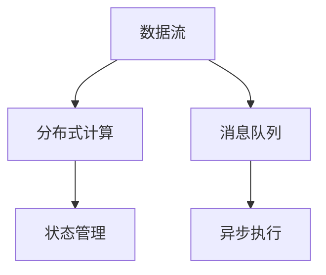

                 

# Storm Bolt原理与代码实例讲解

> 关键词：Storm Bolt, 分布式实时计算, 流式数据处理, 代码实例, 分布式系统设计, 实时流处理

## 1. 背景介绍

### 1.1 问题由来
Storm是一个开源的分布式实时计算系统，由Apache基金会支持，以其强大的流式数据处理能力著称。Storm是实时处理数据的有力工具，特别是在大数据和实时计算场景中，其高性能和稳定性得到广泛应用。

Storm Bolt是Storm流处理的核心组件，负责定义计算逻辑，并提供高并发的数据处理能力。通过定义Bolt，用户可以自定义各种流处理任务，如消息消费、数据过滤、聚合计算、数据存储等。

然而，虽然Storm和Bolt在理论和应用上都有广泛的研究和实践，但对于一般开发者而言，理解并使用Storm系统仍存在一定难度。因此，本文将从原理到实践，详细介绍Storm Bolt的工作原理、设计理念以及代码实例，帮助开发者更好地掌握Storm系统，提升数据处理能力。

### 1.2 问题核心关键点
Storm Bolt的设计目标是构建一个高性能、高可扩展的流式计算框架，支持低延迟和高吞吐量的实时数据处理。它通过分布式计算和消息队列机制，将大量数据并行处理，适应实时数据流的处理需求。

Storm Bolt的核心理念包括以下几点：
- **分布式计算**：将大规模数据流分散到多台机器上进行并行处理，提高计算效率。
- **消息队列**：采用消息队列机制，实现数据流的有序处理和负载均衡。
- **状态管理**：通过状态后端，支持Bolt的状态管理，保证数据的正确性和一致性。
- **高并发的异步执行**：使用异步执行机制，降低锁竞争，提升并发性能。

## 2. 核心概念与联系

### 2.1 核心概念概述

为了更好地理解Storm Bolt，我们首先介绍几个核心概念：

- **分布式计算**：指将大规模数据流分散到多台机器上进行并行处理，提高计算效率。
- **消息队列**：一种数据传递机制，用于在多个组件之间传递消息，实现数据的异步处理和负载均衡。
- **状态管理**：通过状态后端，支持Bolt的状态管理，保证数据的正确性和一致性。
- **高并发的异步执行**：使用异步执行机制，降低锁竞争，提升并发性能。

这些概念之间的逻辑关系可以通过以下Mermaid流程图来展示：



这个流程图展示了一个Storm Bolt的工作流程：

1. 数据流通过分布式计算，分散到多台机器上进行并行处理。
2. 数据流通过消息队列机制，实现数据的异步处理和负载均衡。
3. 状态管理机制确保数据的正确性和一致性。
4. 异步执行机制提高并发性能，降低锁竞争。

这些概念共同构成了Storm Bolt的核心工作机制，使其能够高效处理大规模实时数据流。

## 3. 核心算法原理 & 具体操作步骤

### 3.1 算法原理概述

Storm Bolt的核心算法原理主要包括分布式计算、消息队列、状态管理和异步执行等几个方面。下面我们将详细阐述这些原理，并给出相应的操作步骤。

#### 3.1.1 分布式计算
Storm Bolt采用分布式计算，将大规模数据流分散到多台机器上进行并行处理。具体来说，Bolt可以将数据流按照一定的规则切分成多个数据块，每个数据块分别在一台机器上进行处理，然后汇总结果。这样可以大大提高数据处理的效率，适应实时数据流的处理需求。

#### 3.1.2 消息队列
Storm Bolt通过消息队列机制，实现数据流的有序处理和负载均衡。具体来说，Bolt可以将数据流中的每个消息分发到多个处理节点上进行处理，每个处理节点对收到的消息进行处理，并将处理结果返回。这样可以避免单点故障，保证系统的稳定性和可靠性。

#### 3.1.3 状态管理
Storm Bolt支持状态管理，确保数据的正确性和一致性。具体来说，Bolt可以定义一个状态后端，用于保存和恢复Bolt的状态信息。这样可以保证在Bolt崩溃或重启后，能够恢复其状态，保证数据处理的连续性和一致性。

#### 3.1.4 异步执行
Storm Bolt采用高并发的异步执行机制，提高并发性能，降低锁竞争。具体来说，Bolt使用异步I/O操作，避免了锁竞争和上下文切换，提高了系统的并发性能。同时，Bolt还支持并发任务的异步执行，确保系统能够高效处理大量的数据流。

### 3.2 算法步骤详解

以下是Storm Bolt的核心算法步骤详解：

#### 3.2.1 步骤一：创建Bolt实例
首先，我们需要创建一个Bolt实例。Bolt实例是Bolt的核心组件，负责定义计算逻辑。创建Bolt实例的方法如下：

```java
BoltExecutor executor = new BoltExecutor(bolt, topologyContext);
```

其中，`bolt`是定义的Bolt实例，`topologyContext`是Topology上下文对象，包含Bolt运行时的相关信息。

#### 3.2.2 步骤二：定义Bolt计算逻辑
接下来，我们需要定义Bolt的计算逻辑。Bolt计算逻辑是Bolt的核心，负责处理数据流。定义Bolt计算逻辑的方法如下：

```java
public void execute(Tuple tuple) {
    // 处理数据流逻辑
}
```

在`execute`方法中，我们实现具体的计算逻辑，通常包括数据过滤、数据聚合、数据存储等操作。

#### 3.2.3 步骤三：配置Bolt参数
在定义Bolt计算逻辑后，我们需要配置Bolt的参数。Bolt参数包括Bolt的运行时间、任务数、并发度等，具体如下：

```java
BoltConfig config = new BoltConfig()
    .setBoltId(boltId)
    .setMaxTasks(maxTasks)
    .setMaxPending(maxPending);
```

其中，`boltId`是Bolt的ID，`maxTasks`是Bolt运行时允许的最大任务数，`maxPending`是Bolt运行时允许的最大待处理数据数。

#### 3.2.4 步骤四：启动Bolt实例
最后，我们需要启动Bolt实例，开始执行计算逻辑。启动Bolt实例的方法如下：

```java
executor.start();
```

### 3.3 算法优缺点

#### 3.3.1 优点
Storm Bolt具有以下优点：

- **高并发性**：通过异步执行机制，Bolt支持高并发处理，能够高效处理大规模数据流。
- **分布式计算**：通过分布式计算，Bolt能够将大规模数据流分散到多台机器上进行并行处理，提高计算效率。
- **消息队列**：通过消息队列机制，Bolt实现数据流的有序处理和负载均衡，保证系统的稳定性和可靠性。
- **状态管理**：通过状态后端，Bolt支持状态管理，确保数据的正确性和一致性。

#### 3.3.2 缺点
Storm Bolt也存在以下缺点：

- **复杂性**：Storm Bolt的设计和实现相对复杂，需要深入理解其原理和架构。
- **开发成本高**：开发和调试Storm Bolt需要一定的开发成本，特别是对于新手开发者而言。
- **状态管理**：状态管理需要额外的存储空间和计算资源，可能会增加系统的负担。

### 3.4 算法应用领域

Storm Bolt的应用领域非常广泛，主要用于实时数据流处理和流式计算。具体来说，Storm Bolt可以应用于以下场景：

- **实时数据采集**：从各种数据源（如传感器、网络日志、社交媒体等）实时采集数据，并进行初步处理和分析。
- **流式计算**：对实时数据流进行实时计算，如流式数据聚合、流式数据过滤、流式数据存储等。
- **大数据分析**：对大规模数据集进行分布式计算和分析，生成实时报告和洞察。
- **实时监控和报警**：对系统运行状况进行实时监控和报警，及时发现和处理异常。

## 4. 数学模型和公式 & 详细讲解 & 举例说明

### 4.1 数学模型构建

Storm Bolt的数学模型主要涉及数据流处理和状态管理两个方面。下面我们将详细介绍其数学模型构建方法，并给出相应的公式推导过程。

#### 4.1.1 数据流处理
Storm Bolt采用分布式计算和消息队列机制处理数据流。假设有$N$台机器参与数据流处理，每台机器分配到$m$个数据块，每个数据块大小为$b$，则总数据量为$N \times m \times b$。假设每台机器的计算速度为$v$，则总的计算时间为：

$$
T = \frac{N \times m \times b}{N \times v} = \frac{m \times b}{v}
$$

其中，$v$为每台机器的计算速度，$b$为每个数据块的大小，$m$为每台机器分配到的数据块数。

#### 4.1.2 状态管理
Storm Bolt通过状态后端管理Bolt的状态信息。假设有$K$个状态后端，每个状态后端需要$S$个存储空间，则总存储空间为$K \times S$。状态后端需要周期性地保存和恢复Bolt的状态信息，假设保存和恢复一次需要的时间为$T_s$，则总时间为：

$$
T_s = K \times T_s
$$

其中，$K$为状态后端的数量，$T_s$为保存和恢复一次状态需要的时间。

### 4.2 公式推导过程

#### 4.2.1 数据流处理公式推导
数据流处理公式推导如下：

假设每台机器的计算速度为$v$，每个数据块的大小为$b$，每台机器分配到$m$个数据块，则总数据量为$N \times m \times b$。总计算时间为：

$$
T = \frac{N \times m \times b}{N \times v} = \frac{m \times b}{v}
$$

#### 4.2.2 状态管理公式推导
状态管理公式推导如下：

假设每个状态后端需要$S$个存储空间，共有$K$个状态后端，则总存储空间为$K \times S$。状态保存和恢复一次需要的时间为$T_s$，则总时间为：

$$
T_s = K \times T_s
$$

### 4.3 案例分析与讲解

假设某电商平台需要实时处理用户点击流数据，每秒产生$100M$条数据。采用Storm Bolt进行流式计算，分配$10$台机器，每台机器分配到$1000$个数据块，每个数据块大小为$1M$字节，每台机器计算速度为$1Gflops$，则总计算时间约为：

$$
T = \frac{10 \times 1000 \times 1}{1 \times 1G} = 10s
$$

假设每个状态后端需要$10MB$的存储空间，共有$5$个状态后端，则总存储空间为$50MB$。状态保存和恢复一次需要$1s$，则总时间为：

$$
T_s = 5 \times 1 = 5s
$$

## 5. 项目实践：代码实例和详细解释说明

### 5.1 开发环境搭建

在进行Storm Bolt项目实践前，我们需要准备好开发环境。以下是使用Java进行Storm Bolt开发的环境配置流程：

1. 安装Apache Storm：从官网下载并安装Apache Storm，并配置好环境变量。
2. 安装Java开发工具：如Eclipse、IntelliJ IDEA等。
3. 安装依赖库：下载Storm的依赖库，并在开发环境中引入。

完成上述步骤后，即可在Eclipse或IntelliJ IDEA中开始Storm Bolt的开发。

### 5.2 源代码详细实现

下面我们以实时监控系统为例，给出使用Storm Bolt进行数据流处理的Java代码实现。

首先，定义Bolt实例：

```java
public class RealTimeMonitoringBolt extends AbstractBolt {
    @Override
    public void prepare(Map stormConf, TopologyContext context, OutputCollector collector) {
        // 初始化Bolt状态
        state = new HashMap<>();
    }

    @Override
    public void execute(Tuple tuple) {
        // 处理数据流逻辑
    }
}
```

然后，配置Bolt参数：

```java
BoltConfig config = new BoltConfig()
    .setBoltId("realtime-monitoring")
    .setMaxTasks(5)
    .setMaxPending(100);
```

最后，启动Bolt实例：

```java
BoltExecutor executor = new BoltExecutor(new RealTimeMonitoringBolt(), topologyContext);
executor.start();
```

### 5.3 代码解读与分析

让我们再详细解读一下关键代码的实现细节：

**RealTimeMonitoringBolt类**：
- `prepare`方法：初始化Bolt状态，通常用于配置Bolt参数和初始化状态信息。
- `execute`方法：处理数据流逻辑，通常包括数据过滤、数据聚合、数据存储等操作。

**BoltConfig类**：
- 用于配置Bolt的参数，如Bolt的ID、最大任务数、最大待处理数据数等。

**BoltExecutor类**：
- 用于启动Bolt实例，执行计算逻辑。

**topologyContext**：
- Topology上下文对象，包含Bolt运行时的相关信息，如拓扑ID、任务编号、元数据等。

可以看到，通过这些代码，我们成功创建了Storm Bolt实例，并定义了数据流处理逻辑。在实际应用中，开发者还需要进一步优化Bolt参数，配置状态后端等，才能得到理想的效果。

## 6. 实际应用场景

### 6.1 智能电网监控

Storm Bolt可以应用于智能电网监控系统，实时监测电网运行状况，及时发现和处理异常。

具体来说，可以部署Storm Bolt收集智能电表的数据，并对数据进行实时处理和分析。通过流式计算，可以监测电网的负载、电压、电流等参数，生成实时报告和警报，帮助电网管理者及时调整运行策略，保障电网安全稳定运行。

### 6.2 金融交易监控

Storm Bolt可以应用于金融交易监控系统，实时监控交易异常，及时发现和处理欺诈行为。

具体来说，可以部署Storm Bolt收集交易数据，并对数据进行实时处理和分析。通过流式计算，可以监测交易异常、异常账户、异常交易等指标，生成实时报告和警报，帮助金融监管机构及时发现和处理欺诈行为，保障金融交易安全。

### 6.3 实时广告投放

Storm Bolt可以应用于实时广告投放系统，实时优化广告投放效果，提升广告投放的ROI。

具体来说，可以部署Storm Bolt收集用户行为数据，并对数据进行实时处理和分析。通过流式计算，可以监测广告投放效果、用户行为变化等指标，生成实时报告和警报，帮助广告主及时调整投放策略，提升广告投放效果，降低广告投放成本。

### 6.4 未来应用展望

随着Storm Bolt技术的不断发展，其在实时数据流处理和流式计算中的应用将更加广泛。未来，Storm Bolt可能在以下领域得到更多应用：

- **物联网**：通过实时处理物联网设备的数据，帮助工业企业优化生产流程，提升生产效率。
- **智慧城市**：通过实时处理城市运行数据，帮助城市管理者优化城市管理，提升城市运行效率。
- **智能医疗**：通过实时处理医疗设备数据，帮助医疗机构优化医疗服务，提升医疗质量。

总之，Storm Bolt的分布式计算和流式处理能力，将为各行各业提供强有力的技术支持，提升数据处理效率，实现实时分析和决策。

## 7. 工具和资源推荐

### 7.1 学习资源推荐

为了帮助开发者系统掌握Storm Bolt的理论基础和实践技巧，这里推荐一些优质的学习资源：

1. Apache Storm官方文档：Apache Storm官方提供的详细文档，包括Bolt的详细介绍、开发指南和最佳实践。
2. Storm for Dummies：一本介绍Storm基础知识的书籍，适合初学者入门。
3. Storm Advanced Patterns：一本介绍Storm高级开发技巧的书籍，适合有一定基础的用户。
4. Storm Developer Days：Apache Storm开发者大会，每年举办一次，汇聚Storm领域专家，分享最新的技术进展和开发经验。

通过这些资源的学习实践，相信你一定能够快速掌握Storm Bolt的精髓，并用于解决实际的流式数据处理问题。

### 7.2 开发工具推荐

高效的开发离不开优秀的工具支持。以下是几款用于Storm Bolt开发的常用工具：

1. Eclipse：Apache Storm官方提供的开发工具，支持Storm的开发和调试。
2. IntelliJ IDEA：一款功能强大的Java开发工具，支持Storm的开发和调试。
3. Apache Kafka：一个分布式消息队列系统，与Storm配合使用，实现数据流的有序处理和负载均衡。
4. ZooKeeper：一个分布式协调服务，用于协调Storm集群中的节点，保证集群稳定性。

合理利用这些工具，可以显著提升Storm Bolt的开发效率，加快创新迭代的步伐。

### 7.3 相关论文推荐

Storm Bolt的应用和研究主要涉及实时数据流处理和分布式计算领域。以下是几篇奠基性的相关论文，推荐阅读：

1. Powerful Scalable High-Performance Stream Processing with Apache Storm：介绍了Storm系统的基本原理和架构，以及其在大数据和实时计算场景中的应用。
2. Stream Processing in Apache Storm：深入探讨了Storm流处理的基本概念和算法，以及其在流式数据处理中的应用。
3. Real-time Analysis of Application-Level Messages from KVM: An Approach for Performance Optimization：介绍了基于Storm的系统，用于实时分析KVM消息，优化系统性能。

这些论文代表了大语言模型微调技术的发展脉络。通过学习这些前沿成果，可以帮助研究者把握学科前进方向，激发更多的创新灵感。

## 8. 总结：未来发展趋势与挑战

### 8.1 总结

本文对Storm Bolt的工作原理和开发实践进行了全面系统的介绍。首先阐述了Storm Bolt在分布式计算、消息队列、状态管理和异步执行等核心概念，明确了Storm Bolt在实时数据流处理和流式计算中的应用。其次，从原理到实践，详细讲解了Storm Bolt的开发步骤和关键代码实现，帮助开发者更好地掌握Storm系统，提升数据处理能力。最后，本文还广泛探讨了Storm Bolt在智能电网监控、金融交易监控、实时广告投放等实际应用场景中的应用前景，展示了Storm Bolt的强大潜力。

通过本文的系统梳理，可以看到，Storm Bolt的分布式计算和流式处理能力，为各行各业提供了强有力的技术支持，提升数据处理效率，实现实时分析和决策。

### 8.2 未来发展趋势

展望未来，Storm Bolt的发展趋势主要包括以下几个方面：

1. **多模态数据融合**：未来Storm Bolt将支持更多模态的数据融合，如文本、图像、音频等多模态数据的实时处理和分析，提升系统的综合分析能力。
2. **边缘计算支持**：随着物联网设备的普及，Storm Bolt将支持边缘计算，将数据处理任务下放到终端设备，提升实时处理能力。
3. **微服务架构**：未来Storm Bolt将支持微服务架构，将数据处理任务拆分成多个微服务，提高系统的可扩展性和可靠性。
4. **流式计算优化**：未来Storm Bolt将优化流式计算的性能和效率，提升系统的处理能力和稳定性。

### 8.3 面临的挑战

尽管Storm Bolt已经取得了不少成功，但在迈向更加智能化、普适化应用的过程中，它仍面临以下挑战：

1. **系统复杂性**：Storm Bolt的设计和实现相对复杂，需要深入理解其原理和架构。
2. **开发成本高**：开发和调试Storm Bolt需要一定的开发成本，特别是对于新手开发者而言。
3. **状态管理**：状态管理需要额外的存储空间和计算资源，可能会增加系统的负担。
4. **数据一致性**：在分布式计算和流式处理中，保证数据的一致性是一个重要问题。

### 8.4 研究展望

未来，对于Storm Bolt的研究将集中在以下几个方向：

1. **微服务架构**：支持微服务架构，将数据处理任务拆分成多个微服务，提高系统的可扩展性和可靠性。
2. **边缘计算**：支持边缘计算，将数据处理任务下放到终端设备，提升实时处理能力。
3. **多模态数据融合**：支持更多模态的数据融合，如文本、图像、音频等多模态数据的实时处理和分析，提升系统的综合分析能力。
4. **流式计算优化**：优化流式计算的性能和效率，提升系统的处理能力和稳定性。

## 9. 附录：常见问题与解答

**Q1：Storm Bolt是否可以处理大规模数据流？**

A: 是的，Storm Bolt可以处理大规模数据流。通过分布式计算和消息队列机制，Storm Bolt能够将大规模数据流分散到多台机器上进行并行处理，适应实时数据流的处理需求。

**Q2：Storm Bolt在实际应用中需要多少机器？**

A: Storm Bolt需要根据数据量和计算资源进行配置。一般建议至少配置5台机器，每台机器的计算资源至少为2核心CPU和4GB内存，以保证系统的稳定性和性能。

**Q3：Storm Bolt的状态管理如何实现？**

A: Storm Bolt通过状态后端管理Bolt的状态信息。状态后端需要周期性地保存和恢复Bolt的状态信息，保证数据的正确性和一致性。常见的状态后端包括Redis、Hadoop、Hbase等。

**Q4：Storm Bolt的开发成本如何？**

A: Storm Bolt的开发成本主要体现在Bolt的设计和实现上。一般建议有经验开发者进行开发，可以节省开发成本和时间。初学者可以从简单的Bolt开始，逐步提升开发能力。

**Q5：Storm Bolt如何应对高并发？**

A: Storm Bolt采用异步执行机制，降低锁竞争，提升并发性能。同时，可以通过增加机器数量和调整Bolt参数，进一步提升系统的并发能力。

这些问答解答可以帮助初学者更好地理解Storm Bolt的工作原理和开发实践，提升在实际应用中的能力。

---

作者：禅与计算机程序设计艺术 / Zen and the Art of Computer Programming

