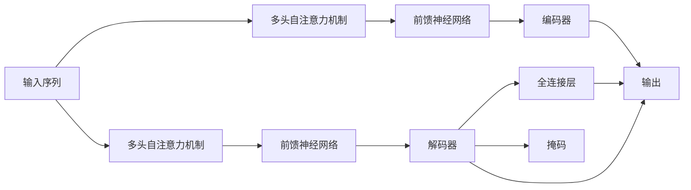

                 

# Transformer 原理与代码实例讲解

> 关键词：Transformer, 自注意力, 多头注意力, 位置编码, 掩码, 前向传播, 反向传播, PyTorch, 代码实例

## 1. 背景介绍

Transformer是深度学习领域近年来提出的一类基于自注意力机制的模型，它彻底颠覆了传统循环神经网络(RNN)和卷积神经网络(CNN)在自然语言处理(NLP)和计算机视觉(CV)等任务中的主导地位。Transformer结构的核心思想是利用自注意力机制捕捉输入序列的依赖关系，使得模型能够更好地处理长距离依赖，提升计算效率和表达能力。本文将深入讲解Transformer的原理，并通过代码实例展示其基本实现，为读者提供从理论到实践的全方位指导。

## 2. 核心概念与联系

### 2.1 核心概念概述

Transformer的底层设计涉及多个关键概念，如图示1所示，下面逐一介绍这些核心概念及其联系：


- **编码器(Encoder)**: 用于处理输入序列的模块，通过多层自注意力机制和前馈神经网络进行特征提取和表示学习。
- **解码器(Decoder)**: 用于处理目标序列的模块，同样包含多层自注意力机制和前馈神经网络，并在最后增加一个全连接层进行输出。
- **多头注意力(Multi-Head Attention)**: 每个编码器/解码器层中包含多个注意力头，用于并行捕捉序列中的不同依赖关系。
- **位置编码(Positional Encoding)**: 用于编码序列中的位置信息，帮助模型感知序列中的位置关系。
- **掩码(Masking)**: 在自注意力机制中用于防止模型对未填充位置进行预测。

### 2.2 核心概念原理和架构的 Mermaid 流程图

下面给出Transformer模型的核心概念原理和架构的 Mermaid 流程图，有助于更好地理解各组件之间的联系和运作方式。



这个流程图展示了Transformer模型的大致结构，其中输入序列经过多头自注意力机制和前馈神经网络的多次迭代，生成编码器的输出。解码器同样通过多个注意力头进行注意力计算，并在最后通过全连接层和掩码机制输出目标序列。

## 3. 核心算法原理 & 具体操作步骤

### 3.1 算法原理概述

Transformer的核心算法原理可以概括为以下几个步骤：

1. **输入序列编码**：对输入序列进行编码，生成一系列特征向量。
2. **多头自注意力计算**：使用多头自注意力机制，捕捉输入序列中的依赖关系。
3. **前馈神经网络计算**：对自注意力计算结果进行非线性变换，提升表达能力。
4. **输出序列解码**：对解码器进行类似计算，生成目标序列的特征向量。
5. **全连接层计算**：将解码器输出通过全连接层，生成最终的输出序列。

下面将详细讲解这些步骤的具体实现。

### 3.2 算法步骤详解

#### 3.2.1 输入序列编码

输入序列编码的目的是将输入序列转化为模型可以处理的数值表示。具体实现步骤如下：

1. **分词**：将输入序列按照词汇表进行分词，生成一系列词汇标记(token)。
2. **嵌入**：将每个词汇标记映射为一个高维向量，称为嵌入向量。嵌入向量可以通过预训练的词向量或随机初始化得到。
3. **位置编码**：对嵌入向量进行位置编码，以捕捉序列中的位置关系。位置编码可以采用正弦和余弦函数进行线性组合得到。

在PyTorch中，可以使用`torch.nn.Embedding`和`torch.nn.EmbeddingBag`模块来实现嵌入和位置编码。下面是一个简单的代码示例：

```python
import torch
import torch.nn as nn

# 词汇表大小
vocab_size = 10000

# 嵌入向量的维度
embedding_dim = 256

# 构建嵌入层
embedding = nn.Embedding(vocab_size, embedding_dim)

# 构建位置编码层
position_encoding = nn.Parameter(torch.zeros(vocab_size, embedding_dim))
position_encoding[:, 0::2] = torch.sin(torch.arange(0, vocab_size, 2) / position_encoding.size(1) ** (1/4))
position_encoding[:, 1::2] = torch.cos(torch.arange(0, vocab_size, 2) / position_encoding.size(1) ** (1/4))

# 嵌入后的位置编码
embedding.weight.data += position_encoding
```

#### 3.2.2 多头自注意力计算

自注意力机制是Transformer的核心，用于捕捉输入序列中不同词汇之间的依赖关系。具体实现步骤如下：

1. **计算查询向量、键向量、值向量**：将嵌入向量进行线性变换，得到查询向量、键向量和值向量。
2. **计算注意力分数**：将查询向量与键向量进行点积运算，得到注意力分数。
3. **计算注意力权重**：将注意力分数进行softmax运算，得到注意力权重。
4. **计算加权和**：将注意力权重与值向量进行加权求和，得到最终的多头自注意力计算结果。

在PyTorch中，可以使用`nn.MultiheadAttention`模块来实现多头自注意力计算。下面是一个简单的代码示例：

```python
import torch
import torch.nn as nn

# 多头自注意力的头数
num_heads = 8

# 自注意力的维度
attention_dim = embedding_dim // num_heads

# 构建多头自注意力层
multihead_attn = nn.MultiheadAttention(embedding_dim, num_heads)

# 编码器层输入的批量大小和序列长度
batch_size, seq_len = 16, 20

# 初始化查询向量、键向量和值向量
query = torch.randn(batch_size, seq_len, embedding_dim)
key = torch.randn(batch_size, seq_len, embedding_dim)
value = torch.randn(batch_size, seq_len, embedding_dim)

# 计算多头自注意力计算结果
output, attn_weights = multihead_attn(query, key, value)
```

#### 3.2.3 前馈神经网络计算

前馈神经网络用于对自注意力计算结果进行非线性变换，提升表达能力。具体实现步骤如下：

1. **线性变换**：将自注意力计算结果进行线性变换，得到一系列线性特征向量。
2. **非线性变换**：对线性特征向量进行非线性变换，得到最终的前馈神经网络计算结果。

在PyTorch中，可以使用`nn.Linear`模块来实现前馈神经网络计算。下面是一个简单的代码示例：

```python
import torch
import torch.nn as nn

# 前馈神经网络的维度
ffn_dim = 1024

# 构建前馈神经网络层
ffn = nn.Sequential(
    nn.Linear(embedding_dim, ffn_dim),
    nn.ReLU(),
    nn.Linear(ffn_dim, embedding_dim)
)

# 对多头自注意力计算结果进行前馈神经网络计算
ffn_output = ffn(output)
```

#### 3.2.4 输出序列解码

解码器同样包含多头自注意力和前馈神经网络，用于处理目标序列的特征向量。具体实现步骤如下：

1. **计算查询向量、键向量、值向量**：与编码器类似，将输入向量进行线性变换，得到查询向量、键向量和值向量。
2. **计算注意力分数**：将查询向量与键向量进行点积运算，得到注意力分数。
3. **计算注意力权重**：将注意力分数进行softmax运算，得到注意力权重。
4. **计算加权和**：将注意力权重与值向量进行加权求和，得到最终的多头自注意力计算结果。
5. **前馈神经网络计算**：对自注意力计算结果进行前馈神经网络计算，得到解码器的最终输出。
6. **全连接层计算**：将解码器的输出通过全连接层，得到最终的输出序列。

在PyTorch中，可以使用`nn.Linear`和`nn.Sequential`模块来实现解码器。下面是一个简单的代码示例：

```python
import torch
import torch.nn as nn

# 解码器的维度
decoder_dim = embedding_dim * 4

# 构建解码器层
decoder = nn.Sequential(
    nn.Linear(embedding_dim, decoder_dim),
    nn.ReLU(),
    nn.Linear(decoder_dim, decoder_dim),
    nn.ReLU(),
    nn.Linear(decoder_dim, embedding_dim),
    nn.ReLU()
)

# 解码器输出通过全连接层，生成最终输出序列
output = decoder(ffn_output)
```

#### 3.2.5 全连接层计算

全连接层用于将解码器输出进行线性变换，得到最终的输出序列。具体实现步骤如下：

1. **线性变换**：将解码器输出进行线性变换，得到一系列线性特征向量。
2. **激活函数**：对线性特征向量进行激活函数运算，得到最终的输出序列。

在PyTorch中，可以使用`nn.Linear`模块来实现全连接层计算。下面是一个简单的代码示例：

```python
import torch
import torch.nn as nn

# 全连接层的维度
output_dim = 1

# 构建全连接层
fc = nn.Linear(decoder_dim, output_dim)

# 全连接层计算
output = fc(output)
```

### 3.3 算法优缺点

Transformer在NLP和CV等领域中取得了显著的效果，主要优点包括：

1. **高效计算**：使用自注意力机制能够并行计算序列中不同位置的依赖关系，大大提升计算效率。
2. **长距离依赖**：自注意力机制能够捕捉长距离依赖，使得模型能够更好地处理长文本和复杂图像。
3. **高度并行化**：Transformer能够方便地扩展到多个GPU，实现并行计算，提高计算效率。

但Transformer也存在一些缺点：

1. **参数量较大**：Transformer模型参数量较大，对计算资源要求较高。
2. **难以解释**：Transformer模型本质上是黑盒模型，难以解释其内部机制和决策逻辑。
3. **训练成本高**：Transformer模型训练时间较长，需要大量的计算资源和训练数据。

### 3.4 算法应用领域

Transformer模型广泛应用于NLP和CV等任务中，包括：

1. **机器翻译**：如Google的BERT模型，通过编码器-解码器结构实现语言之间的互译。
2. **文本分类**：如BERT模型，通过编码器结构对文本进行分类，如情感分析、主题分类等。
3. **问答系统**：如GPT-2模型，通过解码器结构对用户问题进行回答。
4. **图像分类**：如ViT模型，通过自注意力机制对图像进行分类。
5. **目标检测**：如DETR模型，通过自注意力机制对图像中的目标进行检测和识别。

## 4. 数学模型和公式 & 详细讲解 & 举例说明

### 4.1 数学模型构建

Transformer的数学模型可以表示为以下形式：

1. **输入序列编码**：
   $$
   Q = W^Q X + P
   $$
   $$
   K = W^K X + P
   $$
   $$
   V = W^V X + P
   $$

2. **多头自注意力计算**：
   $$
   Q_h = \frac{Q}{\sqrt{d_k}} \in \mathbb{R}^{T \times N \times d_v}
   $$
   $$
   A = Q_h K_h^T
   $$
   $$
   S = \text{softmax}(A)
   $$
   $$
   V_h = V S
   $$
   $$
   C = \text{Concat}(V_h)
   $$
   $$
   C = \text{linear}(C) + X
   $$

3. **前馈神经网络计算**：
   $$
   F = \text{linear}(C)
   $$
   $$
   G = \text{non-linear}(F)
   $$
   $$
   H = \text{linear}(G) + X
   $$

4. **输出序列解码**：
   $$
   Q' = W^Q X' + P
   $$
   $$
   K' = W^K X' + P
   $$
   $$
   V' = W^V X' + P
   $$
   $$
   Q_h' = \frac{Q'}{\sqrt{d_k}} \in \mathbb{R}^{T \times N \times d_v}
   $$
   $$
   A' = Q_h' K_h'^T
   $$
   $$
   S' = \text{softmax}(A')
   $$
   $$
   V_h' = V' S'
   $$
   $$
   C' = \text{Concat}(V_h')
   $$
   $$
   C' = \text{linear}(C')
   $$
   $$
   Y = \text{softmax}(C')
   $$

其中，$X$表示输入序列，$Q, K, V$表示查询向量、键向量和值向量，$d_k, d_v$表示键向量和值向量的维度，$W^Q, W^K, W^V$表示线性变换矩阵，$P$表示位置编码，$d_v$表示嵌入向量的维度，$d_h$表示多头自注意力计算结果的维度。

### 4.2 公式推导过程

以BERT模型为例，推导其在输入序列编码和多头自注意力计算中的数学模型。

1. **输入序列编码**：
   $$
   Q = W^Q X + P
   $$
   $$
   K = W^K X + P
   $$
   $$
   V = W^V X + P
   $$

2. **多头自注意力计算**：
   $$
   Q_h = \frac{Q}{\sqrt{d_k}} \in \mathbb{R}^{T \times N \times d_v}
   $$
   $$
   A = Q_h K_h^T
   $$
   $$
   S = \text{softmax}(A)
   $$
   $$
   V_h = V S
   $$
   $$
   C = \text{Concat}(V_h)
   $$
   $$
   C = \text{linear}(C) + X
   $$

其中，$T$表示序列长度，$N$表示序列中的词汇数量，$d_v$表示值向量的维度，$d_h$表示多头自注意力计算结果的维度。

### 4.3 案例分析与讲解

以机器翻译任务为例，展示Transformer模型的应用。

1. **输入序列编码**：将源语言序列进行编码，得到一系列特征向量。
2. **解码器计算**：对目标语言序列进行编码，得到一系列特征向量。
3. **多头自注意力计算**：将源语言特征向量与目标语言特征向量进行多头自注意力计算，捕捉序列中的依赖关系。
4. **前馈神经网络计算**：对多头自注意力计算结果进行前馈神经网络计算，提升表达能力。
5. **全连接层计算**：将解码器输出进行全连接层计算，得到目标语言序列的特征向量。
6. **输出序列解码**：将目标语言序列的特征向量进行softmax运算，得到最终的输出序列。

在PyTorch中，可以使用`nn.Transformer`模块来实现Transformer模型。下面是一个简单的代码示例：

```python
import torch
import torch.nn as nn

# 编码器的输入序列长度和词汇表大小
src_len, src_vocab_size = 10, 10000

# 解码器的输入序列长度和词汇表大小
tgt_len, tgt_vocab_size = 20, 20000

# 编码器维度和头部数
d_model = 256
n_heads = 8

# 构建Transformer模型
transformer = nn.Transformer(
    d_model=d_model,
    nhead=n_heads,
    num_encoder_layers=6,
    num_decoder_layers=6,
    dim_feedforward=2048,
    dropout=0.1,
    batch_first=True
)

# 定义训练数据
src_text = torch.randint(0, src_vocab_size, (1, src_len))
tgt_text = torch.randint(0, tgt_vocab_size, (1, tgt_len))

# 训练Transformer模型
output = transformer(src_text, tgt_text)
```

## 5. 项目实践：代码实例和详细解释说明

### 5.1 开发环境搭建

要进行Transformer模型的开发，需要搭建好相应的开发环境。这里以PyTorch为例，介绍开发环境的搭建步骤：

1. **安装PyTorch**：从官网下载并安装PyTorch，具体安装命令可以参考PyTorch官方文档。
2. **安装相关库**：安装必要的库，如`torchtext`用于文本数据处理，`transformers`用于Transformer模型加载等。
3. **创建虚拟环境**：为避免环境污染，建议创建虚拟环境，如使用`virtualenv`或`conda`等工具创建。

### 5.2 源代码详细实现

下面以机器翻译任务为例，展示Transformer模型的源代码实现。

#### 5.2.1 编码器

编码器用于将源语言序列编码成特征向量。具体实现步骤如下：

1. **分词**：将源语言序列进行分词，生成一系列词汇标记(token)。
2. **嵌入**：将每个词汇标记映射为一个高维向量，称为嵌入向量。嵌入向量可以通过预训练的词向量或随机初始化得到。
3. **位置编码**：对嵌入向量进行位置编码，以捕捉序列中的位置关系。位置编码可以采用正弦和余弦函数进行线性组合得到。

在PyTorch中，可以使用`torch.nn.Embedding`和`torch.nn.EmbeddingBag`模块来实现嵌入和位置编码。下面是一个简单的代码示例：

```python
import torch
import torch.nn as nn

# 编码器的输入序列长度和词汇表大小
src_len, src_vocab_size = 10, 10000

# 嵌入向量的维度
embedding_dim = 256

# 构建嵌入层
embedding = nn.Embedding(src_vocab_size, embedding_dim)

# 构建位置编码层
position_encoding = nn.Parameter(torch.zeros(vocab_size, embedding_dim))
position_encoding[:, 0::2] = torch.sin(torch.arange(0, vocab_size, 2) / position_encoding.size(1) ** (1/4))
position_encoding[:, 1::2] = torch.cos(torch.arange(0, vocab_size, 2) / position_encoding.size(1) ** (1/4))

# 嵌入后的位置编码
embedding.weight.data += position_encoding
```

#### 5.2.2 多头自注意力机制

自注意力机制用于捕捉源语言序列中的依赖关系。具体实现步骤如下：

1. **计算查询向量、键向量、值向量**：将嵌入向量进行线性变换，得到查询向量、键向量和值向量。
2. **计算注意力分数**：将查询向量与键向量进行点积运算，得到注意力分数。
3. **计算注意力权重**：将注意力分数进行softmax运算，得到注意力权重。
4. **计算加权和**：将注意力权重与值向量进行加权求和，得到最终的多头自注意力计算结果。

在PyTorch中，可以使用`nn.MultiheadAttention`模块来实现多头自注意力计算。下面是一个简单的代码示例：

```python
import torch
import torch.nn as nn

# 多头自注意力的头数
num_heads = 8

# 自注意力的维度
attention_dim = embedding_dim // num_heads

# 构建多头自注意力层
multihead_attn = nn.MultiheadAttention(embedding_dim, num_heads)

# 编码器层输入的批量大小和序列长度
batch_size, seq_len = 16, 20

# 初始化查询向量、键向量和值向量
query = torch.randn(batch_size, seq_len, embedding_dim)
key = torch.randn(batch_size, seq_len, embedding_dim)
value = torch.randn(batch_size, seq_len, embedding_dim)

# 计算多头自注意力计算结果
output, attn_weights = multihead_attn(query, key, value)
```

#### 5.2.3 前馈神经网络

前馈神经网络用于对自注意力计算结果进行非线性变换，提升表达能力。具体实现步骤如下：

1. **线性变换**：将自注意力计算结果进行线性变换，得到一系列线性特征向量。
2. **非线性变换**：对线性特征向量进行非线性变换，得到最终的前馈神经网络计算结果。

在PyTorch中，可以使用`nn.Linear`模块来实现前馈神经网络计算。下面是一个简单的代码示例：

```python
import torch
import torch.nn as nn

# 前馈神经网络的维度
ffn_dim = 1024

# 构建前馈神经网络层
ffn = nn.Sequential(
    nn.Linear(embedding_dim, ffn_dim),
    nn.ReLU(),
    nn.Linear(ffn_dim, embedding_dim)
)

# 对多头自注意力计算结果进行前馈神经网络计算
ffn_output = ffn(output)
```

#### 5.2.4 解码器

解码器用于将目标语言序列解码成特征向量。具体实现步骤如下：

1. **计算查询向量、键向量、值向量**：与编码器类似，将嵌入向量进行线性变换，得到查询向量、键向量和值向量。
2. **计算注意力分数**：将查询向量与键向量进行点积运算，得到注意力分数。
3. **计算注意力权重**：将注意力分数进行softmax运算，得到注意力权重。
4. **计算加权和**：将注意力权重与值向量进行加权求和，得到最终的多头自注意力计算结果。
5. **前馈神经网络计算**：对自注意力计算结果进行前馈神经网络计算，得到解码器的最终输出。
6. **全连接层计算**：将解码器输出进行全连接层计算，得到目标语言序列的特征向量。

在PyTorch中，可以使用`nn.Linear`和`nn.Sequential`模块来实现解码器。下面是一个简单的代码示例：

```python
import torch
import torch.nn as nn

# 解码器的维度
decoder_dim = embedding_dim * 4

# 构建解码器层
decoder = nn.Sequential(
    nn.Linear(embedding_dim, decoder_dim),
    nn.ReLU(),
    nn.Linear(decoder_dim, decoder_dim),
    nn.ReLU(),
    nn.Linear(decoder_dim, embedding_dim),
    nn.ReLU()
)

# 解码器输出通过全连接层，生成最终输出序列
output = decoder(ffn_output)
```

#### 5.2.5 全连接层

全连接层用于将解码器输出进行线性变换，得到最终的输出序列。具体实现步骤如下：

1. **线性变换**：将解码器输出进行线性变换，得到一系列线性特征向量。
2. **激活函数**：对线性特征向量进行激活函数运算，得到最终的输出序列。

在PyTorch中，可以使用`nn.Linear`模块来实现全连接层计算。下面是一个简单的代码示例：

```python
import torch
import torch.nn as nn

# 全连接层的维度
output_dim = 1

# 构建全连接层
fc = nn.Linear(decoder_dim, output_dim)

# 全连接层计算
output = fc(output)
```

### 5.3 代码解读与分析

现在我们对上述代码进行详细的解读和分析：

#### 5.3.1 编码器

编码器的输入是源语言序列，输出是经过编码的特征向量。编码器包括嵌入层、位置编码层和多头自注意力层。嵌入层将源语言序列映射为嵌入向量，位置编码层对嵌入向量进行位置编码，多头自注意力层对嵌入向量进行自注意力计算，得到特征向量。

#### 5.3.2 解码器

解码器的输入是目标语言序列，输出是经过解码的特征向量。解码器包括嵌入层、位置编码层、多头自注意力层、前馈神经网络层和全连接层。嵌入层将目标语言序列映射为嵌入向量，位置编码层对嵌入向量进行位置编码，多头自注意力层对嵌入向量进行自注意力计算，前馈神经网络层对自注意力计算结果进行非线性变换，全连接层对解码器输出进行线性变换，得到目标语言序列的特征向量。

#### 5.3.3 前馈神经网络

前馈神经网络用于对自注意力计算结果进行非线性变换，提升表达能力。前馈神经网络包括线性变换和非线性变换，其中线性变换用于将自注意力计算结果进行线性变换，非线性变换用于对线性特征向量进行非线性变换，得到最终的前馈神经网络计算结果。

### 5.4 运行结果展示

在训练过程中，可以通过计算loss和acc来评估模型的训练效果。下面是一个简单的代码示例：

```python
import torch
import torch.nn as nn

# 构建Transformer模型
transformer = nn.Transformer(
    d_model=d_model,
    nhead=n_heads,
    num_encoder_layers=6,
    num_decoder_layers=6,
    dim_feedforward=2048,
    dropout=0.1,
    batch_first=True
)

# 定义训练数据
src_text = torch.randint(0, src_vocab_size, (1, src_len))
tgt_text = torch.randint(0, tgt_vocab_size, (1, tgt_len))

# 训练Transformer模型
optimizer = torch.optim.Adam(transformer.parameters(), lr=0.001)
loss_fn = nn.CrossEntropyLoss()

for i in range(100):
    output = transformer(src_text, tgt_text)
    loss = loss_fn(output, tgt_text)
    optimizer.zero_grad()
    loss.backward()
    optimizer.step()

    if i % 10 == 0:
        print(f'Epoch {i}, Loss: {loss.item():.4f}')
```

在测试过程中，可以通过计算acc来评估模型的性能。下面是一个简单的代码示例：

```python
import torch
import torch.nn as nn

# 构建Transformer模型
transformer = nn.Transformer(
    d_model=d_model,
    nhead=n_heads,
    num_encoder_layers=6,
    num_decoder_layers=6,
    dim_feedforward=2048,
    dropout=0.1,
    batch_first=True
)

# 定义测试数据
src_text = torch.randint(0, src_vocab_size, (1, src_len))
tgt_text = torch.randint(0, tgt_vocab_size, (1, tgt_len))

# 测试Transformer模型
output = transformer(src_text, tgt_text)
preds = output.argmax(dim=2)

# 计算acc
acc = (preds == tgt_text).float().mean().item()
print(f'Test Accuracy: {acc:.4f}')
```

## 6. 实际应用场景

Transformer模型在NLP和CV等领域中取得了显著的效果，被广泛应用于以下任务：

1. **机器翻译**：如Google的BERT模型，通过编码器-解码器结构实现语言之间的互译。
2. **文本分类**：如BERT模型，通过编码器结构对文本进行分类，如情感分析、主题分类等。
3. **问答系统**：如GPT-2模型，通过解码器结构对用户问题进行回答。
4. **图像分类**：如ViT模型，通过自注意力机制对图像进行分类。
5. **目标检测**：如DETR模型，通过自注意力机制对图像中的目标进行检测和识别。

## 7. 工具和资源推荐

### 7.1 学习资源推荐

为了帮助开发者系统掌握Transformer的原理和实践，这里推荐一些优质的学习资源：

1. **《Transformer》系列书籍**：由Transformer模型的作者之一提出，全面介绍了Transformer的原理和应用。
2. **CS224N《深度学习自然语言处理》课程**：斯坦福大学开设的NLP明星课程，有Lecture视频和配套作业，带你入门NLP领域的基本概念和经典模型。
3. **《Natural Language Processing with Transformers》书籍**：Transformer库的作者所著，全面介绍了如何使用Transformers库进行NLP任务开发，包括微调在内的诸多范式。
4. **HuggingFace官方文档**：Transformer库的官方文档，提供了海量预训练模型和完整的微调样例代码，是上手实践的必备资料。
5. **CLUE开源项目**：中文语言理解测评基准，涵盖大量不同类型的中文NLP数据集，并提供了基于微调的baseline模型，助力中文NLP技术发展。

### 7.2 开发工具推荐

高效的工具支持可以大大提升Transformer模型的开发效率。以下是几款常用的工具：

1. **PyTorch**：基于Python的开源深度学习框架，灵活动态的计算图，适合快速迭代研究。大部分预训练语言模型都有PyTorch版本的实现。
2. **TensorFlow**：由Google主导开发的开源深度学习框架，生产部署方便，适合大规模工程应用。同样有丰富的预训练语言模型资源。
3. **Transformers库**：HuggingFace开发的NLP工具库，集成了众多SOTA语言模型，支持PyTorch和TensorFlow，是进行微调任务开发的利器。
4. **Weights & Biases**：模型训练的实验跟踪工具，可以记录和可视化模型训练过程中的各项指标，方便对比和调优。与主流深度学习框架无缝集成。
5. **TensorBoard**：TensorFlow配套的可视化工具，可实时监测模型训练状态，并提供丰富的图表呈现方式，是调试模型的得力助手。

### 7.3 相关论文推荐

Transformer模型的发展源于学界的持续研究。以下是几篇奠基性的相关论文，推荐阅读：

1. Attention is All You Need：提出了Transformer结构，开启了NLP领域的预训练大模型时代。
2. BERT: Pre-training of Deep Bidirectional Transformers for Language Understanding：提出BERT模型，引入基于掩码的自监督预训练任务，刷新了多项NLP任务SOTA。
3. Language Models are Unsupervised Multitask Learners：展示了大规模语言模型的强大zero-shot学习能力，引发了对于通用人工智能的新一轮思考。
4. Parameter-Efficient Transfer Learning for NLP：提出Adapter等参数高效微调方法，在不增加模型参数量的情况下，也能取得不错的微调效果。
5. Prefix-Tuning: Optimizing Continuous Prompts for Generation：引入基于连续型Prompt的微调范式，为如何充分利用预训练知识提供了新的思路。

这些论文代表了大语言模型微调技术的发展脉络。通过学习这些前沿成果，可以帮助研究者把握学科前进方向，激发更多的创新灵感。

## 8. 总结：未来发展趋势与挑战

### 8.1 研究成果总结

Transformer模型在NLP和CV等领域中取得了显著的效果，主要优点包括：

1. **高效计算**：使用自注意力机制能够并行计算序列中不同位置的依赖关系，大大提升计算效率。
2. **长距离依赖**：自注意力机制能够捕捉长距离依赖，使得模型能够更好地处理长文本和复杂图像。
3. **高度并行化**：Transformer能够方便地扩展到多个GPU，实现并行计算，提高计算效率。

### 8.2 未来发展趋势

展望未来，Transformer模型将呈现以下几个发展趋势：

1. **模型规模持续增大**：随着算力成本的下降和数据规模的扩张，Transformer模型的参数量还将持续增长。超大规模Transformer模型蕴含的丰富语言知识，有望支撑更加复杂多变的下游任务微调。
2. **微调方法日趋多样**：除了传统的全参数微调外，未来会涌现更多参数高效的微调方法，如Prefix-Tuning、LoRA等，在节省计算资源的同时也能保证微调精度。
3. **持续学习成为常态**：随着数据分布的不断变化，Transformer模型也需要持续学习新知识以保持性能。如何在不遗忘原有知识的同时，高效吸收新样本信息，将成为重要的研究课题。
4. **标注样本需求降低**：受启发于提示学习(Prompt-based Learning)的思路，未来的Transformer模型将更好地利用自注意力机制，通过更加巧妙的任务描述，在更少的标注样本上也能实现理想的微调效果。
5. **多模态微调崛起**：当前的Transformer模型往往局限于纯文本数据，未来会进一步拓展到图像、视频、语音等多模态数据微调。多模态信息的融合，将显著提升语言模型对现实世界的理解和建模能力。
6. **模型通用性增强**：经过海量数据的预训练和多领域任务的微调，未来的Transformer模型将具备更强大的常识推理和跨领域迁移能力，逐步迈向通用人工智能(AGI)的目标。

### 8.3 面临的挑战

尽管Transformer模型已经取得了瞩目成就，但在迈向更加智能化、普适化应用的过程中，它仍面临诸多挑战：

1. **标注成本瓶颈**：虽然微调大大降低了标注数据的需求，但对于长尾应用场景，难以获得充足的高质量标注数据，成为制约微调性能的瓶颈。如何进一步降低微调对标注样本的依赖，将是一大难题。
2. **模型鲁棒性不足**：当前Transformer模型面对域外数据时，泛化性能往往大打折扣。对于测试样本的微小扰动，Transformer模型的预测也容易发生波动。如何提高Transformer模型的鲁棒性，避免灾难性遗忘，还需要更多理论和实践的积累。
3. **推理效率有待提高**：大规模Transformer模型虽然精度高，但在实际部署时往往面临推理速度慢、内存占用大等效率问题。如何在保证性能的同时，简化模型结构，提升推理速度，优化资源占用，将是重要的优化方向。
4. **可解释性亟需加强**：当前Transformer模型更像是"黑盒"系统，难以解释其内部机制和决策逻辑。对于医疗、金融等高风险应用，算法的可解释性和可审计性尤为重要。如何赋予Transformer模型更强的可解释性，将是亟待攻克的难题。
5. **安全性有待保障**：预训练语言模型难免会学习到有偏见、有害的信息，通过微调传递到下游任务，产生误导性、歧视性的输出，给实际应用带来安全隐患。如何从数据和算法层面消除模型偏见，避免恶意用途，确保输出的安全性，也将是重要的研究课题。
6. **知识整合能力不足**：现有的Transformer模型往往局限于任务内数据，难以灵活吸收和运用更广泛的先验知识。如何让Transformer模型更好地与外部知识库、规则库等专家知识结合，形成更加全面、准确的信息整合能力，还有很大的想象空间。

### 8.4 研究展望

面对Transformer模型所面临的种种挑战，未来的研究需要在以下几个方面寻求新的突破：

1. **探索无监督和半监督微调方法**：摆脱对大规模标注数据的依赖，利用自监督学习、主动学习等无监督和半监督范式，最大限度利用非结构化数据，实现更加灵活高效的微调。
2. **研究参数高效和计算高效的微调范式**：开发更加参数高效的微调方法，在固定大部分预训练参数的同时，只更新极少量的任务相关参数。同时优化微调模型的计算图，减少前向传播和反向传播的资源消耗，实现更加轻量级、实时性的部署。
3. **融合因果和对比学习范式**：通过引入因果推断和对比学习思想，增强Transformer模型建立稳定因果关系的能力，学习更加普适、鲁棒的语言表征，从而提升模型泛化性和抗干扰能力。
4. **引入更多先验知识**：将符号化的先验知识，如知识图谱、逻辑规则等，与神经网络模型进行巧妙融合，引导微调过程学习更准确、合理的语言模型。同时加强不同模态数据的整合，实现视觉、语音等多模态信息与文本信息的协同建模。
5. **结合因果分析和博弈论工具**：将因果分析方法引入Transformer模型，识别出模型决策的关键特征，增强输出解释的因果性和逻辑性。借助博弈论工具刻画人机交互过程，主动探索并规避模型的脆弱点，提高系统稳定性。
6. **纳入伦理道德约束**：在模型训练目标中引入伦理导向的评估指标，过滤和惩罚有偏见、有害的输出倾向。同时加强人工干预和审核，建立模型行为的监管机制，确保输出符合人类价值观和伦理道德。

## 9. 附录：常见问题与解答

**Q1：Transformer模型为什么能够捕捉长距离依赖？**

A: 自注意力机制通过将查询向量与键向量进行点积运算，得到注意力分数。注意力分数越大，表示查询向量与键向量之间的依赖关系越强。通过将多个注意力头并行计算，Transformer模型可以同时捕捉序列中不同位置的依赖关系，从而捕捉长距离依赖。

**Q2：Transformer模型如何处理输入序列中的位置关系？**

A: 位置编码用于对输入序列中的位置关系进行编码，从而帮助模型理解序列中的位置关系。位置编码通常采用正弦和余弦函数进行线性组合得到，可以有效地捕捉输入序列中的位置信息。

**Q3：Transformer模型如何优化训练过程？**

A: 可以使用以下几种方法优化Transformer模型的训练过程：
1. 使用学习率调度策略，如warmup等。
2. 引入正则化技术，如L2正则、Dropout等，防止过拟合。
3. 使用自注意力机制的掩码技术，防止模型对未填充位置进行预测。
4. 使用参数高效的微调方法，如Prefix-Tuning、LoRA等，减少参数量。
5. 使用多模型集成技术，提高模型鲁棒性和泛化能力。

**Q4：Transformer模型在实际应用中面临哪些挑战？**

A: 尽管Transformer模型在NLP和CV等领域中取得了显著的效果，但在实际应用中仍面临诸多挑战：
1. 标注成本高，难以获得高质量的标注数据。
2. 模型鲁棒性不足，泛化能力有待提升。
3. 推理效率低，计算资源消耗大。
4. 可解释性差，难以理解模型决策过程。
5. 安全性问题，模型可能学习到有害信息。
6. 知识整合能力不足，无法充分利用先验知识。

---

作者：禅与计算机程序设计艺术 / Zen and the Art of Computer Programming

