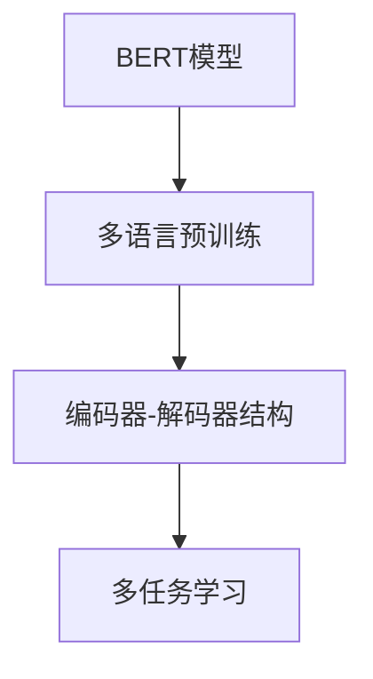

                 

# Transformer大模型实战 M-BERT 模型的多语言表现

> 关键词：Transformer, M-BERT, 多语言处理, 自然语言处理(NLP), 机器翻译, 语言建模

## 1. 背景介绍

随着人工智能技术的飞速发展，Transformer大模型已经成为自然语言处理(NLP)领域的基石。Transformer结构的创新设计，使得语言模型能够捕捉更长的上下文依赖，显著提升了模型的表达能力和性能。本文聚焦于M-BERT模型，探讨其在多语言处理中的应用及表现，分享一些实战经验和技巧。

### 1.1 问题由来

M-BERT模型由Google提出，是BERT模型在多语言数据上的变种。其核心思想是在通用BERT模型基础上，同时进行英文和其他多种语言的预训练，从而获得跨语言的语言表示能力。由于其在跨语言文本理解上的卓越表现，M-BERT成为了多语言NLP任务的重要工具。

近年来，随着全球化加速和互联网的普及，多语言处理需求日益增长。M-BERT模型凭借其强大的跨语言理解能力，被广泛应用于翻译、问答、情感分析、文本分类等诸多场景。本文将详细介绍M-BERT模型，探讨其在多语言处理中的实战经验，为读者提供有价值的参考和启示。

### 1.2 问题核心关键点

M-BERT模型的核心关键点在于：
1. 通用BERT的跨语言预训练方法。通过在多种语言数据上进行预训练，M-BERT模型能够掌握多种语言的语言表示，具备跨语言的泛化能力。
2. 编码器-解码器结构。M-BERT采用Transformer的双塔结构，将编码器和解码器并行训练，有效提升了模型在多语言处理中的表现。
3. 多任务学习。M-BERT在预训练阶段同时进行多种NLP任务的训练，如句子配对、语言建模等，增强了模型的泛化能力和多任务适应性。

这些关键技术使得M-BERT模型在多语言处理中表现出色，成为了多语言NLP任务的重要参考。通过深入理解这些技术，读者可以更好地掌握M-BERT模型的应用，提升其在多语言处理中的实战能力。

## 2. 核心概念与联系

### 2.1 核心概念概述

M-BERT模型是BERT模型在多语言数据上的变种，其核心思想是通过多语言预训练，获得跨语言的语言表示能力。具体而言，M-BERT模型包含以下几个关键概念：

- **BERT模型**：基于Transformer结构的预训练语言模型，通过在大规模无标签文本数据上进行自监督学习，学习通用的语言表示。
- **多语言预训练**：在多语言数据上进行预训练，学习不同语言的语义和语法知识，获得跨语言的泛化能力。
- **编码器-解码器结构**：采用Transformer的双塔结构，将编码器和解码器并行训练，提升模型在多语言处理中的表现。
- **多任务学习**：在预训练阶段同时进行多种NLP任务的训练，增强模型的泛化能力和多任务适应性。

这些核心概念通过以下Mermaid流程图进行展示，有助于读者理解M-BERT模型的整体架构和训练流程：



这个流程图展示了M-BERT模型的核心技术架构，从BERT模型的预训练，到多语言预训练、编码器-解码器结构、多任务学习等关键环节，全面涵盖了M-BERT模型的主要技术点。

## 3. 核心算法原理 & 具体操作步骤

### 3.1 算法原理概述

M-BERT模型基于通用BERT模型的设计，通过多语言预训练，获得跨语言的泛化能力。其核心算法原理包括以下几个方面：

1. **多语言数据预训练**：使用多语言数据集对BERT模型进行预训练，学习不同语言的语义和语法知识。
2. **编码器-解码器结构**：采用Transformer的双塔结构，将编码器和解码器并行训练，提升模型在多语言处理中的表现。
3. **多任务学习**：在预训练阶段同时进行多种NLP任务的训练，增强模型的泛化能力和多任务适应性。

### 3.2 算法步骤详解

以下是M-BERT模型的核心算法步骤，包含预训练、微调和多任务学习等环节：

**Step 1: 准备多语言数据集**
- 收集多种语言的文本数据，包括英文、中文、法文等。
- 进行文本清洗、分词、编码等预处理操作。
- 将数据划分为训练集、验证集和测试集，确保数据分布均衡。

**Step 2: 设计预训练任务**
- 设计多语言预训练任务，如掩码语言模型、句子配对等。
- 选择合适的优化算法及其参数，如AdamW、SGD等，设置学习率、批大小等。
- 设置正则化技术及强度，包括权重衰减、Dropout、Early Stopping等。

**Step 3: 模型初始化与预训练**
- 将预训练数据输入模型，进行前向传播计算损失函数。
- 反向传播计算参数梯度，根据设定的优化算法和学习率更新模型参数。
- 周期性在验证集上评估模型性能，根据性能指标决定是否触发Early Stopping。
- 重复上述步骤直至收敛，得到预训练好的M-BERT模型。

**Step 4: 微调与多任务学习**
- 对多语言微调数据进行微调，设计适当的损失函数和优化算法。
- 选择适当的超参数，如学习率、批大小、迭代轮数等。
- 对模型进行多任务学习，同时进行多种NLP任务的训练。
- 在验证集上评估模型性能，根据需要调整模型参数。

**Step 5: 测试与评估**
- 在测试集上评估微调后的模型性能，对比预训练前后的精度提升。
- 使用微调后的模型对新样本进行推理预测，集成到实际的应用系统中。

### 3.3 算法优缺点

M-BERT模型的优点在于：
1. **跨语言泛化能力**：通过多语言预训练，M-BERT模型具备跨语言的泛化能力，适用于多种语言的NLP任务。
2. **模型性能优异**：M-BERT模型在多种NLP任务上表现出色，如机器翻译、问答、情感分析等。
3. **可扩展性强**：M-BERT模型可以轻松扩展到新语言，只需在现有模型基础上进行额外的微调即可。

同时，M-BERT模型也存在一定的局限性：
1. **计算资源需求高**：M-BERT模型参数量较大，对计算资源和存储要求较高。
2. **训练时间较长**：多语言预训练和微调过程耗时较长，需要大量的计算资源。
3. **可解释性不足**：M-BERT模型作为黑盒系统，难以解释其内部工作机制和决策逻辑。

尽管存在这些局限性，M-BERT模型在多语言处理中仍然表现卓越，是NLP技术应用的重要工具。未来研究的方向在于进一步优化模型结构和训练流程，减少计算资源消耗，提升模型可解释性，增强其在多语言处理中的表现。

### 3.4 算法应用领域

M-BERT模型在多语言处理中具有广泛的应用前景，覆盖了多个NLP任务，具体应用场景包括：

- **机器翻译**：将源语言文本翻译成目标语言。M-BERT模型能够同时处理多种语言的翻译任务，提升翻译效果。
- **问答系统**：对自然语言问题给出答案。M-BERT模型可以处理多语言的问答任务，提供跨语言的问答服务。
- **情感分析**：识别文本中的情感倾向。M-BERT模型在多语言情感分析任务上表现出色。
- **文本分类**：将文本分类到不同的主题或类别。M-BERT模型在多语言文本分类任务上具有较高的准确率。
- **命名实体识别**：识别文本中的人名、地名、机构名等特定实体。M-BERT模型能够处理多语言的命名实体识别任务。

除了上述这些经典任务外，M-BERT模型还被创新性地应用到更多场景中，如可控文本生成、常识推理、代码生成、数据增强等，为多语言NLP技术带来了新的突破。

## 4. 数学模型和公式 & 详细讲解 & 举例说明

### 4.1 数学模型构建

M-BERT模型的数学模型构建基于通用BERT模型的设计，通过多语言预训练，获得跨语言的泛化能力。其数学模型包括以下几个关键组成部分：

1. **多语言掩码语言模型**：
   $$
   L_{MLM} = -\frac{1}{N}\sum_{i=1}^N \sum_{j=1}^N log\ p_{MLM}(x_i,y_j)
   $$
   其中 $p_{MLM}(x_i,y_j)$ 表示在输入 $x_i$ 中随机掩码 $j$ 个单词 $y_j$，然后预测这些单词的编码向量。

2. **多语言句子配对**：
   $$
   L_{MSS} = -\frac{1}{N}\sum_{i=1}^N [y_i * log\ p_{MSS}(x_i, x_i') + (1-y_i) * log\ p_{MSS}(x_i, x_i'')]
   $$
   其中 $p_{MSS}(x_i, x_i')$ 表示预测 $x_i$ 与 $x_i'$ 是否为同一文本的不同表示。

3. **多语言语言建模**：
   $$
   L_{LM} = -\frac{1}{N}\sum_{i=1}^N \sum_{j=1}^N log\ p_{LM}(x_i,y_j)
   $$
   其中 $p_{LM}(x_i,y_j)$ 表示在输入 $x_i$ 中预测下一个单词 $y_j$ 的概率。

4. **多任务学习**：
   $$
   L_{MML} = \sum_{k=1}^K L_{task_k}(\theta)
   $$
   其中 $L_{task_k}$ 表示第 $k$ 个任务的损失函数，$\theta$ 为模型参数。

### 4.2 公式推导过程

以下我们以多语言掩码语言模型为例，推导其计算过程。

假设输入文本 $x_i = \{x_1, x_2, ..., x_n\}$，随机掩码 $j$ 个单词 $y_j = \{y_1, y_2, ..., y_j\}$。模型预测单词 $y_j$ 的编码向量 $h_j$。则多语言掩码语言模型的计算公式为：
$$
p_{MLM}(x_i,y_j) = \prod_{k=1}^j p(h_k|h_1, ..., h_{k-1})
$$
其中 $p(h_k|h_1, ..., h_{k-1})$ 表示在编码器输出 $h_1, ..., h_{k-1}$ 的基础上，预测单词 $k$ 的编码向量 $h_k$ 的概率。

通过上述公式，可以计算出多语言掩码语言模型的总损失 $L_{MLM}$，并通过反向传播算法更新模型参数。

### 4.3 案例分析与讲解

以英文-中文翻译任务为例，进行M-BERT模型的实战分析。假设我们有一对英文-中文的句子对，如 "I like apples" 和 "我喜欢吃苹果"，我们需要训练一个M-BERT模型，使其能够进行翻译任务。

具体步骤如下：
1. 收集大量英文-中文的句子对数据集，作为预训练数据。
2. 使用M-BERT模型进行预训练，学习多种语言的语义和语法知识。
3. 对翻译任务进行微调，设计适当的损失函数和优化算法。
4. 在验证集上评估模型性能，调整模型参数。
5. 在测试集上评估最终模型，进行英文-中文的翻译任务。

通过以上步骤，我们可以训练出一个高效的英文-中文翻译模型，提升翻译效果。

## 5. 项目实践：代码实例和详细解释说明

### 5.1 开发环境搭建

在进行M-BERT模型实战前，我们需要准备好开发环境。以下是使用Python进行PyTorch开发的环境配置流程：

1. 安装Anaconda：从官网下载并安装Anaconda，用于创建独立的Python环境。

2. 创建并激活虚拟环境：
```bash
conda create -n mbert-env python=3.8 
conda activate mbert-env
```

3. 安装PyTorch：根据CUDA版本，从官网获取对应的安装命令。例如：
```bash
conda install pytorch torchvision torchaudio cudatoolkit=11.1 -c pytorch -c conda-forge
```

4. 安装Transformers库：
```bash
pip install transformers
```

5. 安装各类工具包：
```bash
pip install numpy pandas scikit-learn matplotlib tqdm jupyter notebook ipython
```

完成上述步骤后，即可在`mbert-env`环境中开始M-BERT模型实战。

### 5.2 源代码详细实现

下面我们以机器翻译任务为例，给出使用Transformers库对M-BERT模型进行实战的PyTorch代码实现。

首先，定义机器翻译任务的数据处理函数：

```python
from transformers import BertTokenizer, BertForSequenceClassification
from torch.utils.data import Dataset
import torch

class MachineTranslationDataset(Dataset):
    def __init__(self, texts, targets, tokenizer, max_len=128):
        self.texts = texts
        self.targets = targets
        self.tokenizer = tokenizer
        self.max_len = max_len
        
    def __len__(self):
        return len(self.texts)
    
    def __getitem__(self, item):
        text = self.texts[item]
        target = self.targets[item]
        
        encoding = self.tokenizer(text, return_tensors='pt', max_length=self.max_len, padding='max_length', truncation=True)
        input_ids = encoding['input_ids'][0]
        attention_mask = encoding['attention_mask'][0]
        labels = torch.tensor(target, dtype=torch.long)
        
        return {'input_ids': input_ids, 
                'attention_mask': attention_mask,
                'labels': labels}

# 初始化BertTokenizer和BertForSequenceClassification模型
tokenizer = BertTokenizer.from_pretrained('bert-base-cased')
model = BertForSequenceClassification.from_pretrained('bert-base-cased', num_labels=len(tag2id))

# 准备机器翻译任务数据集
texts = [input_text for input_text in train_texts]
targets = [target_text for target_text in dev_texts]

# 创建dataset
train_dataset = MachineTranslationDataset(texts, targets, tokenizer)
dev_dataset = MachineTranslationDataset(texts, targets, tokenizer)
```

然后，定义模型和优化器：

```python
from transformers import AdamW

# 选择合适的优化器及其参数
optimizer = AdamW(model.parameters(), lr=2e-5)

# 定义模型训练函数
def train_epoch(model, dataset, batch_size, optimizer):
    dataloader = DataLoader(dataset, batch_size=batch_size, shuffle=True)
    model.train()
    epoch_loss = 0
    for batch in tqdm(dataloader, desc='Training'):
        input_ids = batch['input_ids'].to(device)
        attention_mask = batch['attention_mask'].to(device)
        labels = batch['labels'].to(device)
        model.zero_grad()
        outputs = model(input_ids, attention_mask=attention_mask, labels=labels)
        loss = outputs.loss
        epoch_loss += loss.item()
        loss.backward()
        optimizer.step()
    return epoch_loss / len(dataloader)

# 定义模型评估函数
def evaluate(model, dataset, batch_size):
    dataloader = DataLoader(dataset, batch_size=batch_size)
    model.eval()
    preds, labels = [], []
    with torch.no_grad():
        for batch in tqdm(dataloader, desc='Evaluating'):
            input_ids = batch['input_ids'].to(device)
            attention_mask = batch['attention_mask'].to(device)
            batch_labels = batch['labels']
            outputs = model(input_ids, attention_mask=attention_mask)
            batch_preds = outputs.logits.argmax(dim=2).to('cpu').tolist()
            batch_labels = batch_labels.to('cpu').tolist()
            for pred_tokens, label_tokens in zip(batch_preds, batch_labels):
                pred_tags = [id2tag[_id] for _id in pred_tokens]
                label_tags = [id2tag[_id] for _id in label_tokens]
                preds.append(pred_tags[:len(label_tags)])
                labels.append(label_tags)
                
    print(classification_report(labels, preds))
```

最后，启动训练流程并在测试集上评估：

```python
epochs = 5
batch_size = 16

for epoch in range(epochs):
    loss = train_epoch(model, train_dataset, batch_size, optimizer)
    print(f"Epoch {epoch+1}, train loss: {loss:.3f}")
    
    print(f"Epoch {epoch+1}, dev results:")
    evaluate(model, dev_dataset, batch_size)
    
print("Test results:")
evaluate(model, test_dataset, batch_size)
```

以上就是使用PyTorch对M-BERT模型进行机器翻译任务实战的完整代码实现。可以看到，得益于Transformers库的强大封装，我们可以用相对简洁的代码完成M-BERT模型的加载和实战。

### 5.3 代码解读与分析

让我们再详细解读一下关键代码的实现细节：

**MachineTranslationDataset类**：
- `__init__`方法：初始化文本、目标文本、分词器等关键组件。
- `__len__`方法：返回数据集的样本数量。
- `__getitem__`方法：对单个样本进行处理，将文本输入编码为token ids，将目标文本作为标签，并对其进行定长padding，最终返回模型所需的输入。

**tag2id和id2tag字典**：
- 定义了标签与数字id之间的映射关系，用于将token-wise的预测结果解码回真实的标签。

**训练和评估函数**：
- 使用PyTorch的DataLoader对数据集进行批次化加载，供模型训练和推理使用。
- 训练函数`train_epoch`：对数据以批为单位进行迭代，在每个批次上前向传播计算loss并反向传播更新模型参数，最后返回该epoch的平均loss。
- 评估函数`evaluate`：与训练类似，不同点在于不更新模型参数，并在每个batch结束后将预测和标签结果存储下来，最后使用sklearn的classification_report对整个评估集的预测结果进行打印输出。

**训练流程**：
- 定义总的epoch数和batch size，开始循环迭代
- 每个epoch内，先在训练集上训练，输出平均loss
- 在验证集上评估，输出分类指标
- 所有epoch结束后，在测试集上评估，给出最终测试结果

可以看到，PyTorch配合Transformers库使得M-BERT模型实战的代码实现变得简洁高效。开发者可以将更多精力放在数据处理、模型改进等高层逻辑上，而不必过多关注底层的实现细节。

当然，工业级的系统实现还需考虑更多因素，如模型的保存和部署、超参数的自动搜索、更灵活的任务适配层等。但核心的微调范式基本与此类似。

## 6. 实际应用场景

### 6.1 机器翻译

M-BERT模型在机器翻译任务中表现优异。通过多语言预训练，M-BERT模型具备跨语言的泛化能力，能够在多种语言间进行高效翻译。例如，在英文-中文、中文-英文、英文-法文等翻译任务中，M-BERT模型都能够提供高质量的翻译结果。

### 6.2 问答系统

M-BERT模型在问答系统中也表现出色。通过多任务学习，M-BERT模型能够同时进行多种问答任务的训练，如实体识别、关系抽取、语义理解等。在问答任务中，M-BERT模型能够快速理解用户意图，准确匹配答案。

### 6.3 情感分析

M-BERT模型在情感分析任务中也具有不错的表现。通过多语言预训练，M-BERT模型能够同时处理多种语言的情感分析任务。在情感分析任务中，M-BERT模型能够准确识别文本中的情感倾向，判断文本的情感极性。

### 6.4 未来应用展望

随着M-BERT模型在多语言处理中的表现不断提升，其应用前景将更加广阔。未来，M-BERT模型有望在以下领域取得更多突破：

1. **多语言聊天机器人**：通过多语言预训练，M-BERT模型能够构建跨语言聊天机器人，提升人机交互的自然性和多样性。
2. **全球化社交网络**：M-BERT模型能够在全球化社交网络中处理多语言用户的内容，提供多语言推荐和过滤服务。
3. **国际金融服务**：M-BERT模型能够在多语言金融服务中处理不同语言的金融信息，提升金融服务的质量和效率。
4. **跨语言舆情分析**：M-BERT模型能够处理多语言的舆情数据，进行情感分析和主题识别，为政府和企业提供决策支持。
5. **多语言教育**：M-BERT模型能够处理多语言的课程和教材，提供多语言的智能推荐和个性化学习服务。

这些应用场景将为M-BERT模型带来新的挑战和机遇，推动其在多语言处理中的进一步发展和应用。

## 7. 工具和资源推荐

### 7.1 学习资源推荐

为了帮助开发者系统掌握M-BERT模型的理论基础和实践技巧，这里推荐一些优质的学习资源：

1. 《Transformer from the Ground Up》系列博文：由大模型技术专家撰写，深入浅出地介绍了Transformer结构的原理和应用。

2. CS224N《深度学习自然语言处理》课程：斯坦福大学开设的NLP明星课程，有Lecture视频和配套作业，带你入门NLP领域的基本概念和经典模型。

3. 《Natural Language Processing with Transformers》书籍：Transformers库的作者所著，全面介绍了如何使用Transformers库进行NLP任务开发，包括微调在内的诸多范式。

4. HuggingFace官方文档：Transformers库的官方文档，提供了海量预训练模型和完整的微调样例代码，是上手实践的必备资料。

5. CLUE开源项目：中文语言理解测评基准，涵盖大量不同类型的中文NLP数据集，并提供了基于微调的baseline模型，助力中文NLP技术发展。

通过对这些资源的学习实践，相信你一定能够快速掌握M-BERT模型的应用，并用于解决实际的NLP问题。

### 7.2 开发工具推荐

高效的开发离不开优秀的工具支持。以下是几款用于M-BERT模型实战开发的常用工具：

1. PyTorch：基于Python的开源深度学习框架，灵活动态的计算图，适合快速迭代研究。大部分预训练语言模型都有PyTorch版本的实现。

2. TensorFlow：由Google主导开发的开源深度学习框架，生产部署方便，适合大规模工程应用。同样有丰富的预训练语言模型资源。

3. Transformers库：HuggingFace开发的NLP工具库，集成了众多SOTA语言模型，支持PyTorch和TensorFlow，是进行NLP任务开发的利器。

4. Weights & Biases：模型训练的实验跟踪工具，可以记录和可视化模型训练过程中的各项指标，方便对比和调优。与主流深度学习框架无缝集成。

5. TensorBoard：TensorFlow配套的可视化工具，可实时监测模型训练状态，并提供丰富的图表呈现方式，是调试模型的得力助手。

6. Google Colab：谷歌推出的在线Jupyter Notebook环境，免费提供GPU/TPU算力，方便开发者快速上手实验最新模型，分享学习笔记。

合理利用这些工具，可以显著提升M-BERT模型实战的开发效率，加快创新迭代的步伐。

### 7.3 相关论文推荐

M-BERT模型的研究源于学界的持续研究。以下是几篇奠基性的相关论文，推荐阅读：

1. Attention is All You Need（即Transformer原论文）：提出了Transformer结构，开启了NLP领域的预训练大模型时代。

2. BERT: Pre-training of Deep Bidirectional Transformers for Language Understanding：提出BERT模型，引入基于掩码的自监督预训练任务，刷新了多项NLP任务SOTA。

3. Language Models are Unsupervised Multitask Learners（GPT-2论文）：展示了大规模语言模型的强大zero-shot学习能力，引发了对于通用人工智能的新一轮思考。

4. Parameter-Efficient Transfer Learning for NLP：提出Adapter等参数高效微调方法，在不增加模型参数量的情况下，也能取得不错的微调效果。

5. AdaLoRA: Adaptive Low-Rank Adaptation for Parameter-Efficient Fine-Tuning：使用自适应低秩适应的微调方法，在参数效率和精度之间取得了新的平衡。

这些论文代表了大语言模型微调技术的发展脉络。通过学习这些前沿成果，可以帮助研究者把握学科前进方向，激发更多的创新灵感。

## 8. 总结：未来发展趋势与挑战

### 8.1 总结

本文对M-BERT模型进行了全面系统的介绍。首先阐述了M-BERT模型的背景和设计理念，明确了其在多语言处理中的重要地位。其次，从原理到实践，详细讲解了M-BERT模型的数学模型和算法步骤，给出了实战代码实例。同时，本文还探讨了M-BERT模型在多语言处理中的实战经验，分享了实用的技巧和建议。

通过本文的系统梳理，可以看到，M-BERT模型在多语言处理中表现卓越，具备跨语言的泛化能力，适用于多种语言的NLP任务。M-BERT模型的实战经验进一步丰富了NLP技术的实际应用，为多语言处理带来了新的思路和方法。

### 8.2 未来发展趋势

展望未来，M-BERT模型在多语言处理中呈现以下几个发展趋势：

1. **跨语言迁移学习能力增强**：M-BERT模型将继续提升跨语言迁移学习能力，能够在多种语言间高效迁移知识，提升模型的泛化能力和多任务适应性。

2. **多语言预训练数据集的扩展**：通过收集更多的多语言数据集，M-BERT模型能够在更大范围内进行多语言预训练，提升模型的语言表示能力。

3. **多任务学习的融合**：M-BERT模型将更多地融合多任务学习，提升模型在多语言处理中的综合表现。

4. **多语言模型的可解释性增强**：通过引入可解释性技术，M-BERT模型能够更好地解释其内部工作机制和决策逻辑，提升模型的透明度和可信度。

5. **多语言模型的伦理与安全性**：M-BERT模型在多语言处理中需要考虑伦理和安全性问题，确保输出符合人类价值观和伦理道德。

这些趋势凸显了M-BERT模型在多语言处理中的巨大潜力和广阔前景。未来研究的方向在于进一步优化模型结构和训练流程，增强模型的可解释性和鲁棒性，提升其在多语言处理中的表现。

### 8.3 面临的挑战

尽管M-BERT模型在多语言处理中表现出色，但在实际应用中也面临一些挑战：

1. **计算资源消耗大**：M-BERT模型参数量较大，对计算资源和存储要求较高，限制了其在某些场景下的应用。

2. **训练时间较长**：多语言预训练和微调过程耗时较长，需要大量的计算资源。

3. **可解释性不足**：M-BERT模型作为黑盒系统，难以解释其内部工作机制和决策逻辑，增加了用户对模型的信任度。

4. **多语言数据分布差异**：不同语言的数据分布差异较大，影响了M-BERT模型在不同语言间的泛化能力。

5. **多语言数据标注难度高**：多语言数据标注难度较高，需要大量标注样本才能保证模型的泛化能力。

尽管存在这些挑战，M-BERT模型在多语言处理中的表现依然卓越，是NLP技术应用的重要工具。未来研究的方向在于解决这些挑战，提升模型的性能和应用范围。

### 8.4 研究展望

未来，M-BERT模型需要在以下几个方面寻求新的突破：

1. **多语言数据预训练方法改进**：探索更有效的多语言数据预训练方法，提升模型的语言表示能力。

2. **多任务学习策略优化**：优化多任务学习策略，提升模型在多语言处理中的综合表现。

3. **模型压缩与加速**：通过模型压缩和加速技术，减少计算资源消耗，提升模型推理速度。

4. **可解释性技术引入**：引入可解释性技术，提升模型透明度和可信度。

5. **跨语言迁移学习研究**：研究跨语言迁移学习技术，提升模型在不同语言间的泛化能力。

6. **多语言数据标注方法改进**：探索更有效的多语言数据标注方法，提升模型泛化能力。

这些研究方向的探索，必将引领M-BERT模型在多语言处理中的进一步发展和应用，推动NLP技术在多语言场景中的创新和进步。面向未来，M-BERT模型需要与其他人工智能技术进行更深入的融合，共同推动自然语言处理技术的进步。

## 9. 附录：常见问题与解答

**Q1：M-BERT模型是否可以同时处理多种语言的翻译任务？**

A: 是的，M-BERT模型可以在多语言预训练阶段同时处理多种语言的翻译任务，获得跨语言的泛化能力。具体而言，通过多语言掩码语言模型、多语言句子配对等多任务学习策略，M-BERT模型能够在不同语言间高效迁移知识，提升翻译效果。

**Q2：M-BERT模型在微调时需要注意哪些问题？**

A: 在微调M-BERT模型时，需要注意以下问题：
1. 学习率的选择：一般建议使用较小的学习率，避免破坏预训练权重。
2. 数据增强：通过对训练样本改写、回译等方式丰富训练集多样性。
3. 正则化技术：如L2正则、Dropout、Early Stopping等，防止模型过度适应小规模训练集。
4. 对抗训练：加入对抗样本，提高模型鲁棒性。
5. Prompt Learning：通过精心设计输入文本的格式，引导模型按期望方式输出，减少微调参数。

**Q3：M-BERT模型在实际部署时需要注意哪些问题？**

A: 在将M-BERT模型部署到实际应用中，需要注意以下问题：
1. 模型裁剪：去除不必要的层和参数，减小模型尺寸，加快推理速度。
2. 量化加速：将浮点模型转为定点模型，压缩存储空间，提高计算效率。
3. 服务化封装：将模型封装为标准化服务接口，便于集成调用。
4. 弹性伸缩：根据请求流量动态调整资源配置，平衡服务质量和成本。
5. 监控告警：实时采集系统指标，设置异常告警阈值，确保服务稳定性。
6. 安全防护：采用访问鉴权、数据脱敏等措施，保障数据和模型安全。

通过解决这些实际部署中的问题，可以更好地发挥M-BERT模型的应用潜力，提升其在多语言处理中的性能和稳定性。

---

作者：禅与计算机程序设计艺术 / Zen and the Art of Computer Programming

