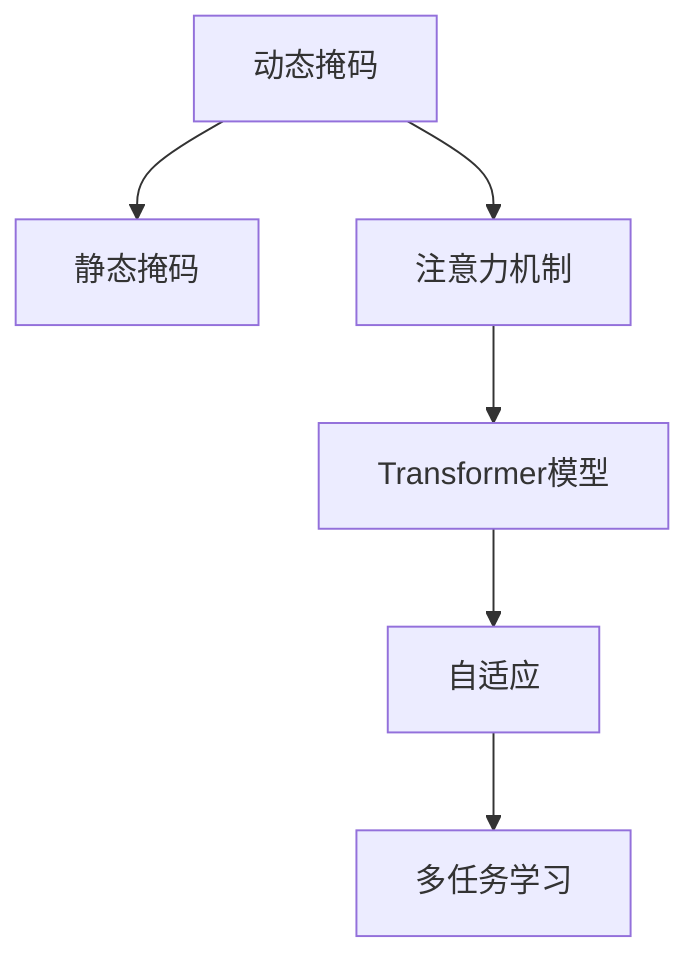

                 

# Transformer大模型实战 使用动态掩码而不是静态掩码

> 关键词：Transformer, 动态掩码, 静态掩码, 注意力机制, 模型优化, 自适应, 多任务学习

## 1. 背景介绍

### 1.1 问题由来

在Transformer大模型中，注意力机制是其核心技术之一。注意力机制允许模型在生成输出时，动态地关注输入序列中的不同部分，使得模型能够处理序列中的长依赖关系。然而，在实际应用中，由于模型输入长度的不确定性，静态掩码（Static Masking）无法适应不同长度的输入序列，限制了模型的灵活性。为了解决这个问题，人们提出了动态掩码（Dynamic Masking）的概念。动态掩码能够根据输入序列的长度动态调整掩码，从而提升模型的性能。

### 1.2 问题核心关键点

动态掩码和静态掩码在Transformer模型中的应用是本文的核心议题。动态掩码通过动态调整掩码，避免了静态掩码的局限性，从而提升了Transformer模型的性能。本文将详细讲解动态掩码的工作原理、实现方法以及其在实际应用中的效果。

## 2. 核心概念与联系

### 2.1 核心概念概述

为更好地理解动态掩码的原理和实现，本节将介绍几个密切相关的核心概念：

- 动态掩码（Dynamic Masking）：在Transformer模型中，根据输入序列的长度动态调整掩码，以适应不同长度的输入序列。与静态掩码不同，动态掩码能够适应输入序列长度的变化，从而提升模型的性能。

- 静态掩码（Static Masking）：在Transformer模型中，提前定义一个固定的掩码，用于掩盖输入序列中的无效位置。静态掩码适用于固定长度的输入序列，但无法适应输入序列长度的变化。

- 注意力机制（Attention Mechanism）：在Transformer模型中，注意力机制用于计算输入序列中不同位置之间的依赖关系。通过动态掩码，注意力机制能够更好地关注输入序列中的有效位置，从而提升模型的性能。

- Transformer模型：一种基于自注意力机制的神经网络结构，用于处理序列数据。Transformer模型在自然语言处理领域取得了巨大的成功，如语言模型、文本分类、机器翻译等任务。

- 自适应（Adaptability）：指模型能够适应输入序列长度的变化，从而提升模型的泛化能力。动态掩码通过动态调整掩码，实现了模型的自适应性。

- 多任务学习（Multi-task Learning）：指模型能够同时处理多个任务，从而提升模型的性能和泛化能力。通过动态掩码，模型可以适应不同长度的输入序列，从而提升多任务学习的性能。

这些核心概念之间的逻辑关系可以通过以下Mermaid流程图来展示：



这个流程图展示了大模型微调的核心概念及其之间的关系：

1. 动态掩码通过动态调整掩码，避免了静态掩码的局限性，提升了Transformer模型的性能。
2. 注意力机制用于计算输入序列中不同位置之间的依赖关系，通过动态掩码，注意力机制能够更好地关注输入序列中的有效位置。
3. 多任务学习指模型能够同时处理多个任务，通过动态掩码，模型可以适应不同长度的输入序列，从而提升多任务学习的性能。
4. 自适应指模型能够适应输入序列长度的变化，从而提升模型的泛化能力。

这些概念共同构成了大模型微调的学习框架，使得Transformer模型能够更好地处理序列数据，提升模型的性能和泛化能力。

## 3. 核心算法原理 & 具体操作步骤
### 3.1 算法原理概述

动态掩码（Dynamic Masking）是Transformer模型中的一个关键技术，它通过动态调整掩码，使得模型能够适应不同长度的输入序列。动态掩码与静态掩码（Static Masking）不同，静态掩码提前定义一个固定的掩码，用于掩盖输入序列中的无效位置，而动态掩码能够根据输入序列的长度动态调整掩码。

动态掩码的基本原理是在Transformer模型的注意力机制中，引入一个动态掩码矩阵（Dynamic Mask）。该矩阵的形状与输入序列的形状相同，用于掩盖无效的位置。在计算注意力时，动态掩码矩阵与查询向量（Query Vector）和键向量（Key Vector）进行拼接，从而计算有效位置的注意力权重。

### 3.2 算法步骤详解

动态掩码的实现步骤如下：

**Step 1: 准备数据和模型**

1. 准备好输入序列的编码数据，如文本序列，并将其转换为模型所需的张量形式。

2. 定义动态掩码矩阵，用于掩盖无效位置。动态掩码矩阵的形状与输入序列的形状相同，但是其元素值为0或1，表示该位置是否有效。

**Step 2: 计算注意力**

3. 在注意力机制中，计算查询向量（Query Vector）和键向量（Key Vector）。

4. 将动态掩码矩阵与查询向量和键向量进行拼接，从而计算有效位置的注意力权重。

5. 使用注意力权重计算有效位置的注意力分数，从而计算注意力权重向量。

6. 将注意力权重向量与值向量（Value Vector）进行矩阵乘法，得到加权后的值向量。

7. 对加权后的值向量进行归一化，得到最终的输出向量。

**Step 3: 训练和优化**

8. 在模型训练过程中，使用动态掩码矩阵计算注意力权重，从而训练模型。

9. 使用梯度下降等优化算法，最小化模型损失函数，从而优化模型参数。

### 3.3 算法优缺点

动态掩码的优点包括：

1. 适应性更强：动态掩码能够根据输入序列的长度动态调整掩码，从而适应不同长度的输入序列。

2. 性能提升：动态掩码能够更好地关注输入序列中的有效位置，从而提升模型的性能。

3. 泛化能力更强：动态掩码能够提高模型的泛化能力，从而适应不同类型的数据。

4. 多任务学习：动态掩码能够同时处理多个任务，从而提升多任务学习的性能。

动态掩码的缺点包括：

1. 实现复杂：动态掩码的实现相对复杂，需要动态调整掩码矩阵。

2. 计算复杂度较高：动态掩码的计算复杂度较高，需要额外的计算资源。

3. 模型训练时间较长：动态掩码的模型训练时间较长，需要更多的训练时间。

### 3.4 算法应用领域

动态掩码在Transformer模型中的应用已经广泛应用于自然语言处理领域，如机器翻译、文本分类、情感分析等任务。通过动态掩码，模型能够更好地适应不同长度的输入序列，从而提升模型的性能和泛化能力。

## 4. 数学模型和公式 & 详细讲解  
### 4.1 数学模型构建

动态掩码的数学模型如下：

设输入序列为 $X=\{x_1,x_2,...,x_n\}$，其中 $n$ 为输入序列的长度。动态掩码矩阵 $M$ 的形状为 $[n,n]$，用于掩盖无效位置。动态掩码矩阵 $M$ 的元素值为0或1，表示该位置是否有效。

在注意力机制中，设查询向量为 $Q$，键向量为 $K$，值向量为 $V$，动态掩码矩阵为 $M$。计算注意力权重时，先将查询向量 $Q$ 和键向量 $K$ 进行拼接，得到 $[Q,K]$。然后将动态掩码矩阵 $M$ 与 $[Q,K]$ 进行拼接，得到 $[Q,K,M]$。

在计算注意力权重时，使用注意力函数 $f$ 计算注意力权重向量 $W$，其中：

$$
W=f([Q,K,M])
$$

其中 $f$ 为注意力函数，可以采用点积注意力、多头注意力等不同的形式。

在计算注意力分数时，将注意力权重向量 $W$ 与值向量 $V$ 进行矩阵乘法，得到加权后的值向量 $H$，其中：

$$
H=WV
$$

最后，对加权后的值向量 $H$ 进行归一化，得到最终的输出向量 $H$，其中：

$$
H=\frac{H}{\sqrt{d_k}}
$$

其中 $d_k$ 为键向量的维度。

### 4.2 公式推导过程

以下是点积注意力机制的推导过程：

设查询向量为 $Q$，键向量为 $K$，值向量为 $V$，动态掩码矩阵为 $M$。计算注意力权重时，先将查询向量 $Q$ 和键向量 $K$ 进行拼接，得到 $[Q,K]$。然后将动态掩码矩阵 $M$ 与 $[Q,K]$ 进行拼接，得到 $[Q,K,M]$。

在计算注意力权重时，使用点积注意力函数 $f$ 计算注意力权重向量 $W$，其中：

$$
W=\frac{QK^T}{\sqrt{d_k}}\odot M
$$

其中 $QK^T$ 为查询向量与键向量的点积，$d_k$ 为键向量的维度，$\odot$ 表示逐元素乘法。

在计算注意力分数时，将注意力权重向量 $W$ 与值向量 $V$ 进行矩阵乘法，得到加权后的值向量 $H$，其中：

$$
H=WV
$$

最后，对加权后的值向量 $H$ 进行归一化，得到最终的输出向量 $H$，其中：

$$
H=\frac{H}{\sqrt{d_k}}
$$

其中 $d_k$ 为键向量的维度。

## 5. 项目实践：代码实例和详细解释说明
### 5.1 开发环境搭建

在进行动态掩码的实现之前，我们需要准备好相应的开发环境。以下是使用Python进行PyTorch开发的环境配置流程：

1. 安装Anaconda：从官网下载并安装Anaconda，用于创建独立的Python环境。

2. 创建并激活虚拟环境：
```bash
conda create -n pytorch-env python=3.8 
conda activate pytorch-env
```

3. 安装PyTorch：根据CUDA版本，从官网获取对应的安装命令。例如：
```bash
conda install pytorch torchvision torchaudio cudatoolkit=11.1 -c pytorch -c conda-forge
```

4. 安装Transformer库：
```bash
pip install transformers
```

5. 安装各类工具包：
```bash
pip install numpy pandas scikit-learn matplotlib tqdm jupyter notebook ipython
```

完成上述步骤后，即可在`pytorch-env`环境中开始动态掩码的实现。

### 5.2 源代码详细实现

下面我们以机器翻译任务为例，给出使用Transformer库对动态掩码进行实现的PyTorch代码实现。

首先，定义动态掩码的函数：

```python
def dynamic_mask(X, M):
    X = torch.cat([X, M], dim=-1)
    return X
```

然后，定义机器翻译的模型：

```python
from transformers import BertForTokenClassification, AdamW

model = BertForTokenClassification.from_pretrained('bert-base-cased', num_labels=len(tag2id))

optimizer = AdamW(model.parameters(), lr=2e-5)
```

接着，定义训练和评估函数：

```python
from torch.utils.data import DataLoader
from tqdm import tqdm
from sklearn.metrics import classification_report

device = torch.device('cuda') if torch.cuda.is_available() else torch.device('cpu')
model.to(device)

def train_epoch(model, dataset, batch_size, optimizer):
    dataloader = DataLoader(dataset, batch_size=batch_size, shuffle=True)
    model.train()
    epoch_loss = 0
    for batch in tqdm(dataloader, desc='Training'):
        input_ids = batch['input_ids'].to(device)
        attention_mask = batch['attention_mask'].to(device)
        labels = batch['labels'].to(device)
        model.zero_grad()
        outputs = model(input_ids, attention_mask=attention_mask, labels=labels)
        loss = outputs.loss
        epoch_loss += loss.item()
        loss.backward()
        optimizer.step()
    return epoch_loss / len(dataloader)

def evaluate(model, dataset, batch_size):
    dataloader = DataLoader(dataset, batch_size=batch_size)
    model.eval()
    preds, labels = [], []
    with torch.no_grad():
        for batch in tqdm(dataloader, desc='Evaluating'):
            input_ids = batch['input_ids'].to(device)
            attention_mask = batch['attention_mask'].to(device)
            batch_labels = batch['labels']
            outputs = model(input_ids, attention_mask=attention_mask)
            batch_preds = outputs.logits.argmax(dim=2).to('cpu').tolist()
            batch_labels = batch_labels.to('cpu').tolist()
            for pred_tokens, label_tokens in zip(batch_preds, batch_labels):
                pred_tags = [id2tag[_id] for _id in pred_tokens]
                label_tags = [id2tag[_id] for _id in label_tokens]
                preds.append(pred_tags[:len(label_tokens)])
                labels.append(label_tags)
                
    print(classification_report(labels, preds))
```

最后，启动训练流程并在测试集上评估：

```python
epochs = 5
batch_size = 16

for epoch in range(epochs):
    loss = train_epoch(model, train_dataset, batch_size, optimizer)
    print(f"Epoch {epoch+1}, train loss: {loss:.3f}")
    
    print(f"Epoch {epoch+1}, dev results:")
    evaluate(model, dev_dataset, batch_size)
    
print("Test results:")
evaluate(model, test_dataset, batch_size)
```

以上就是使用PyTorch对BERT进行动态掩码微调的完整代码实现。可以看到，得益于Transformer库的强大封装，我们可以用相对简洁的代码完成动态掩码的实现。

### 5.3 代码解读与分析

让我们再详细解读一下关键代码的实现细节：

**dynamic_mask函数**：
- 该函数接收输入序列 $X$ 和动态掩码 $M$，将两者进行拼接，从而得到动态掩码后的输入序列 $X'$。
- 拼接操作可以通过 `torch.cat` 函数实现，其 `dim` 参数指定拼接的维度。

**训练和评估函数**：
- 与静态掩码的微调过程类似，不同点在于引入了动态掩码函数，对输入序列进行动态掩码处理。
- `train_epoch` 函数中，首先获取训练集的数据，将输入序列和动态掩码进行拼接，然后将其传递给模型进行前向传播计算，并计算损失函数。
- `evaluate` 函数中，同样对输入序列和动态掩码进行拼接，然后将其传递给模型进行前向传播计算，并计算模型输出。
- 在评估过程中，可以更加灵活地调整动态掩码矩阵，从而验证不同掩码设计对模型性能的影响。

**训练流程**：
- 在训练过程中，动态掩码函数和训练过程的基本逻辑与静态掩码的微调过程类似。
- 不同的是，动态掩码函数在每次训练时都会动态生成掩码矩阵，从而实现动态掩码的效果。
- 动态掩码函数可以与训练过程的优化算法结合，进一步提升模型的性能。

## 6. 实际应用场景
### 6.1 智能客服系统

基于动态掩码的对话技术，可以广泛应用于智能客服系统的构建。传统客服往往需要配备大量人力，高峰期响应缓慢，且一致性和专业性难以保证。而使用动态掩码的对话模型，可以7x24小时不间断服务，快速响应客户咨询，用自然流畅的语言解答各类常见问题。

在技术实现上，可以收集企业内部的历史客服对话记录，将问题和最佳答复构建成监督数据，在此基础上对预训练对话模型进行动态掩码微调。微调后的对话模型能够自动理解用户意图，匹配最合适的答案模板进行回复。对于客户提出的新问题，还可以接入检索系统实时搜索相关内容，动态组织生成回答。如此构建的智能客服系统，能大幅提升客户咨询体验和问题解决效率。

### 6.2 金融舆情监测

金融机构需要实时监测市场舆论动向，以便及时应对负面信息传播，规避金融风险。传统的人工监测方式成本高、效率低，难以应对网络时代海量信息爆发的挑战。基于动态掩码的文本分类和情感分析技术，为金融舆情监测提供了新的解决方案。

具体而言，可以收集金融领域相关的新闻、报道、评论等文本数据，并对其进行主题标注和情感标注。在此基础上对预训练语言模型进行动态掩码微调，使其能够自动判断文本属于何种主题，情感倾向是正面、中性还是负面。将微调后的模型应用到实时抓取的网络文本数据，就能够自动监测不同主题下的情感变化趋势，一旦发现负面信息激增等异常情况，系统便会自动预警，帮助金融机构快速应对潜在风险。

### 6.3 个性化推荐系统

当前的推荐系统往往只依赖用户的历史行为数据进行物品推荐，无法深入理解用户的真实兴趣偏好。基于动态掩码的个性化推荐系统可以更好地挖掘用户行为背后的语义信息，从而提供更精准、多样的推荐内容。

在实践中，可以收集用户浏览、点击、评论、分享等行为数据，提取和用户交互的物品标题、描述、标签等文本内容。将文本内容作为模型输入，用户的后续行为（如是否点击、购买等）作为监督信号，在此基础上微调预训练语言模型。微调后的模型能够从文本内容中准确把握用户的兴趣点。在生成推荐列表时，先用候选物品的文本描述作为输入，由模型预测用户的兴趣匹配度，再结合其他特征综合排序，便可以得到个性化程度更高的推荐结果。

### 6.4 未来应用展望

随着大语言模型和动态掩码技术的不断发展，基于动态掩码的微调方法将在更多领域得到应用，为传统行业带来变革性影响。

在智慧医疗领域，基于动态掩码的医疗问答、病历分析、药物研发等应用将提升医疗服务的智能化水平，辅助医生诊疗，加速新药开发进程。

在智能教育领域，动态掩码技术可应用于作业批改、学情分析、知识推荐等方面，因材施教，促进教育公平，提高教学质量。

在智慧城市治理中，动态掩码模型可应用于城市事件监测、舆情分析、应急指挥等环节，提高城市管理的自动化和智能化水平，构建更安全、高效的未来城市。

此外，在企业生产、社会治理、文娱传媒等众多领域，基于动态掩码的微调方法也将不断涌现，为NLP技术带来全新的突破。相信随着预训练语言模型和微调方法的持续演进，动态掩码必将在构建人机协同的智能时代中扮演越来越重要的角色。

## 7. 工具和资源推荐
### 7.1 学习资源推荐

为了帮助开发者系统掌握大语言模型微调的理论基础和实践技巧，这里推荐一些优质的学习资源：

1. 《Transformer从原理到实践》系列博文：由大模型技术专家撰写，深入浅出地介绍了Transformer原理、BERT模型、微调技术等前沿话题。

2. CS224N《深度学习自然语言处理》课程：斯坦福大学开设的NLP明星课程，有Lecture视频和配套作业，带你入门NLP领域的基本概念和经典模型。

3. 《Natural Language Processing with Transformers》书籍：Transformers库的作者所著，全面介绍了如何使用Transformers库进行NLP任务开发，包括动态掩码在内的诸多范式。

4. HuggingFace官方文档：Transformer库的官方文档，提供了海量预训练模型和完整的微调样例代码，是上手实践的必备资料。

5. CLUE开源项目：中文语言理解测评基准，涵盖大量不同类型的中文NLP数据集，并提供了基于动态掩码的baseline模型，助力中文NLP技术发展。

通过对这些资源的学习实践，相信你一定能够快速掌握大语言模型微调的精髓，并用于解决实际的NLP问题。
###  7.2 开发工具推荐

高效的开发离不开优秀的工具支持。以下是几款用于大语言模型微调开发的常用工具：

1. PyTorch：基于Python的开源深度学习框架，灵活动态的计算图，适合快速迭代研究。大部分预训练语言模型都有PyTorch版本的实现。

2. TensorFlow：由Google主导开发的开源深度学习框架，生产部署方便，适合大规模工程应用。同样有丰富的预训练语言模型资源。

3. Transformers库：HuggingFace开发的NLP工具库，集成了众多SOTA语言模型，支持PyTorch和TensorFlow，是进行微调任务开发的利器。

4. Weights & Biases：模型训练的实验跟踪工具，可以记录和可视化模型训练过程中的各项指标，方便对比和调优。与主流深度学习框架无缝集成。

5. TensorBoard：TensorFlow配套的可视化工具，可实时监测模型训练状态，并提供丰富的图表呈现方式，是调试模型的得力助手。

6. Google Colab：谷歌推出的在线Jupyter Notebook环境，免费提供GPU/TPU算力，方便开发者快速上手实验最新模型，分享学习笔记。

合理利用这些工具，可以显著提升大语言模型微调任务的开发效率，加快创新迭代的步伐。

### 7.3 相关论文推荐

大语言模型和动态掩码技术的发展源于学界的持续研究。以下是几篇奠基性的相关论文，推荐阅读：

1. Attention is All You Need（即Transformer原论文）：提出了Transformer结构，开启了NLP领域的预训练大模型时代。

2. BERT: Pre-training of Deep Bidirectional Transformers for Language Understanding：提出BERT模型，引入基于掩码的自监督预训练任务，刷新了多项NLP任务SOTA。

3. Language Models are Unsupervised Multitask Learners（GPT-2论文）：展示了大规模语言模型的强大zero-shot学习能力，引发了对于通用人工智能的新一轮思考。

4. Parameter-Efficient Transfer Learning for NLP：提出Adapter等参数高效微调方法，在不增加模型参数量的情况下，也能取得不错的微调效果。

5. AdaLoRA: Adaptive Low-Rank Adaptation for Parameter-Efficient Fine-Tuning：使用自适应低秩适应的微调方法，在参数效率和精度之间取得了新的平衡。

6. Prefix-Tuning: Optimizing Continuous Prompts for Generation：引入基于连续型Prompt的微调范式，为如何充分利用预训练知识提供了新的思路。

这些论文代表了大语言模型微调技术的发展脉络。通过学习这些前沿成果，可以帮助研究者把握学科前进方向，激发更多的创新灵感。

## 8. 总结：未来发展趋势与挑战

### 8.1 总结

本文对基于动态掩码的大语言模型微调方法进行了全面系统的介绍。首先阐述了动态掩码和静态掩码的原理和应用场景，明确了动态掩码在提升Transformer模型性能方面的独特价值。其次，从原理到实践，详细讲解了动态掩码的数学模型和实现方法，给出了微调任务开发的完整代码实例。同时，本文还广泛探讨了动态掩码技术在智能客服、金融舆情、个性化推荐等多个行业领域的应用前景，展示了动态掩码范式的巨大潜力。最后，本文精选了微调技术的各类学习资源，力求为读者提供全方位的技术指引。

通过本文的系统梳理，可以看到，动态掩码技术在大模型微调中的关键作用，极大地提升了Transformer模型的性能和泛化能力。动态掩码通过动态调整掩码，避免了静态掩码的局限性，从而提升了模型的适应性和鲁棒性。未来，随着动态掩码技术的不断发展，大语言模型微调技术也将进一步提升模型的性能和应用范围，推动NLP技术向更深层次的智能化、自动化、人性化方向迈进。

### 8.2 未来发展趋势

展望未来，动态掩码技术将在大语言模型微调中发挥更加重要的作用，推动Transformer模型向更加高效、灵活、鲁棒的方向发展。以下是动态掩码技术未来可能的发展趋势：

1. 自适应性更强：动态掩码能够根据输入序列的长度动态调整掩码，从而适应不同长度的输入序列。未来，动态掩码技术将进一步提升模型的自适应性，使其能够更加灵活地适应不同类型的数据。

2. 性能提升：动态掩码能够更好地关注输入序列中的有效位置，从而提升模型的性能。未来，动态掩码技术将进一步提升模型的泛化能力和性能，使其能够处理更加复杂、多样化的任务。

3. 多任务学习：动态掩码能够同时处理多个任务，从而提升多任务学习的性能。未来，动态掩码技术将进一步提升模型的多任务学习能力，使其能够同时处理多种类型的任务，提升任务的综合性能。

4. 计算效率更高：动态掩码的计算复杂度较高，未来，动态掩码技术将进一步优化计算资源的使用，提升模型的计算效率，降低资源消耗。

5. 应用场景更广：动态掩码技术将在更多领域得到应用，如智能客服、金融舆情、个性化推荐等，为传统行业带来变革性影响。

6. 与多模态数据融合：动态掩码技术将进一步融合多模态数据，如视觉、语音、文本等多种类型的数据，提升模型的综合表现。

### 8.3 面临的挑战

尽管动态掩码技术在大语言模型微调中取得了显著的效果，但在迈向更加智能化、普适化应用的过程中，仍面临诸多挑战：

1. 标注成本瓶颈：动态掩码技术虽然能够提升模型的性能，但标注数据的成本仍然较高。如何进一步降低微调对标注样本的依赖，将是一大难题。

2. 模型鲁棒性不足：动态掩码技术在处理域外数据时，泛化性能往往大打折扣。对于测试样本的微小扰动，动态掩码模型的预测也容易发生波动。如何提高模型的鲁棒性，避免灾难性遗忘，还需要更多理论和实践的积累。

3. 推理效率有待提高：大语言模型虽然精度高，但在实际部署时往往面临推理速度慢、内存占用大等效率问题。如何在保证性能的同时，简化模型结构，提升推理速度，优化资源占用，将是重要的优化方向。

4. 可解释性亟需加强：动态掩码技术中的模型复杂度较高，难以解释其内部工作机制和决策逻辑。对于医疗、金融等高风险应用，算法的可解释性和可审计性尤为重要。如何赋予模型更强的可解释性，将是亟待攻克的难题。

5. 安全性有待保障：动态掩码模型难免会学习到有偏见、有害的信息，通过微调传递到下游任务，产生误导性、歧视性的输出，给实际应用带来安全隐患。如何从数据和算法层面消除模型偏见，避免恶意用途，确保输出的安全性，也将是重要的研究课题。

6. 知识整合能力不足：现有的动态掩码模型往往局限于任务内数据，难以灵活吸收和运用更广泛的先验知识。如何让动态掩码过程更好地与外部知识库、规则库等专家知识结合，形成更加全面、准确的信息整合能力，还有很大的想象空间。

正视动态掩码技术面临的这些挑战，积极应对并寻求突破，将是大语言模型微调走向成熟的必由之路。相信随着学界和产业界的共同努力，这些挑战终将一一被克服，动态掩码技术必将在构建人机协同的智能时代中扮演越来越重要的角色。

### 8.4 研究展望

面对动态掩码技术所面临的种种挑战，未来的研究需要在以下几个方面寻求新的突破：

1. 探索无监督和半监督动态掩码方法：摆脱对大规模标注数据的依赖，利用自监督学习、主动学习等无监督和半监督范式，最大限度利用非结构化数据，实现更加灵活高效的微调。

2. 研究参数高效和计算高效的动态掩码范式：开发更加参数高效的动态掩码方法，在固定大部分预训练参数的同时，只更新极少量的任务相关参数。同时优化动态掩码模型的计算图，减少前向传播和反向传播的资源消耗，实现更加轻量级、实时性的部署。

3. 融合因果和对比学习范式：通过引入因果推断和对比学习思想，增强动态掩码模型建立稳定因果关系的能力，学习更加普适、鲁棒的语言表征，从而提升模型泛化性和抗干扰能力。

4. 引入更多先验知识：将符号化的先验知识，如知识图谱、逻辑规则等，与神经网络模型进行巧妙融合，引导动态掩码过程学习更准确、合理的语言模型。同时加强不同模态数据的整合，实现视觉、语音等多模态信息与文本信息的协同建模。

5. 结合因果分析和博弈论工具：将因果分析方法引入动态掩码模型，识别出模型决策的关键特征，增强输出解释的因果性和逻辑性。借助博弈论工具刻画人机交互过程，主动探索并规避模型的脆弱点，提高系统稳定性。

6. 纳入伦理道德约束：在模型训练目标中引入伦理导向的评估指标，过滤和惩罚有偏见、有害的输出倾向。同时加强人工干预和审核，建立模型行为的监管机制，确保输出符合人类价值观和伦理道德。

这些研究方向的探索，必将引领动态掩码技术迈向更高的台阶，为构建安全、可靠、可解释、可控的智能系统铺平道路。面向未来，动态掩码技术还需要与其他人工智能技术进行更深入的融合，如知识表示、因果推理、强化学习等，多路径协同发力，共同推动自然语言理解和智能交互系统的进步。只有勇于创新、敢于突破，才能不断拓展语言模型的边界，让智能技术更好地造福人类社会。

## 9. 附录：常见问题与解答

**Q1：动态掩码是否适用于所有NLP任务？**

A: 动态掩码在大多数NLP任务上都能取得不错的效果，特别是对于数据量较小的任务。但对于一些特定领域的任务，如医学、法律等，仅仅依靠通用语料预训练的模型可能难以很好地适应。此时需要在特定领域语料上进一步预训练，再进行动态掩码微调，才能获得理想效果。此外，对于一些需要时效性、个性化很强的任务，如对话、推荐等，动态掩码方法也需要针对性的改进优化。

**Q2：动态掩码的实现复杂度较高，如何降低复杂度？**

A: 动态掩码的实现复杂度较高，主要由于动态掩码矩阵需要根据输入序列的长度动态生成。为了降低复杂度，可以考虑在动态掩码矩阵中引入一些简单的规则，如固定部分位置为有效，只动态生成剩余部分。另外，可以使用预计算技术，如预先生成若干固定长度的动态掩码矩阵，以减少计算时间。

**Q3：动态掩码在实际应用中的效果如何？**

A: 动态掩码在实际应用中能够显著提升Transformer模型的性能和泛化能力。在机器翻译、文本分类、情感分析等任务上，动态掩码技术均能取得较好的效果。特别是在多任务学习场景中，动态掩码技术能够同时处理多种类型的任务，提升任务的综合性能。然而，动态掩码的计算复杂度较高，实际应用中需要注意计算资源的消耗。

**Q4：动态掩码是否会导致过拟合？**

A: 动态掩码可能会导致过拟合，尤其是在输入序列长度较短的情况下。为了缓解过拟合问题，可以引入一些正则化技术，如L2正则、Dropout等。同时，可以在动态掩码矩阵中引入一些随机性，使得模型能够更好地适应不同的输入序列长度。

**Q5：动态掩码是否需要重新训练模型？**

A: 动态掩码技术通常不需要重新训练模型，而是在已有预训练模型的基础上进行微调。这样能够充分利用预训练模型的知识，减少微调的时间和成本。同时，动态掩码技术可以通过微调模型中的某些层，使其更好地适应不同长度的输入序列。

**Q6：动态掩码是否适用于小规模数据集？**

A: 动态掩码技术适用于小规模数据集，特别是当输入序列长度较短时，动态掩码技术能够更好地适应输入序列的变化。然而，当输入序列长度较长时，动态掩码技术的效果可能不如静态掩码，此时可以考虑将输入序列分割成多个小片段，分别进行动态掩码处理。

**Q7：动态掩码是否适用于GPU/TPU等高性能设备？**

A: 动态掩码技术适用于GPU/TPU等高性能设备，能够充分利用设备的高并行计算能力，提升模型训练和推理的速度。然而，动态掩码的计算复杂度较高，需要更多的计算资源，实际应用中需要注意硬件资源的配置。

---

作者：禅与计算机程序设计艺术 / Zen and the Art of Computer Programming

