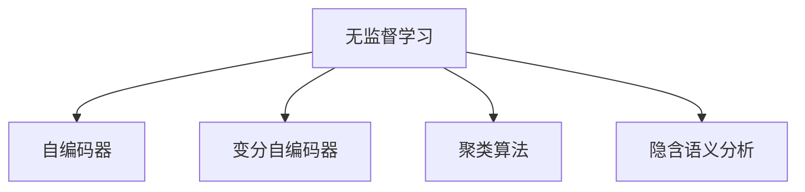

                 

# Unsupervised Learning 原理与代码实战案例讲解

> 关键词：无监督学习,机器学习,深度学习,自组织,生成模型,隐含语义分析,聚类,神经网络

## 1. 背景介绍

### 1.1 问题由来
近年来，随着人工智能技术的飞速发展，无监督学习（Unsupervised Learning, UL）成为了机器学习领域的焦点之一。相比传统的有监督学习（Supervised Learning, SL），无监督学习能够从数据中自动挖掘出有意义的结构和模式，而不依赖于人工标注的数据。

无监督学习在自然语言处理（NLP）、计算机视觉（CV）、数据挖掘等领域均有广泛应用，如词嵌入学习、聚类、主题建模等。其中，生成模型（Generative Models）如自编码器（Autoencoders）和变分自编码器（Variational Autoencoders, VAEs）等方法更是成为了研究热点。

然而，无监督学习的理论框架和应用方法相对复杂，初学者往往难以快速上手。因此，本文旨在以结构清晰、易于理解的行文风格，详细讲解无监督学习的核心原理和实战案例，帮助读者系统掌握这一重要技术。

### 1.2 问题核心关键点
无监督学习的核心在于从数据中自动学习到有意义的表示，并从中提取有效的模式。相较于有监督学习，无监督学习不依赖标注数据，能够更好地处理大规模数据集，且对于新任务的适应性更强。

无监督学习的核心算法和应用方法包括：

- **自编码器（Autoencoders）**：通过将输入数据映射到低维隐空间，然后尝试重构原数据，从而学习到数据的隐含特征表示。
- **变分自编码器（VAEs）**：引入概率分布，通过最大化数据似然，学习到数据的隐含特征和潜在空间表示。
- **聚类算法（Clustering）**：将相似的数据点分组，形成不同的数据簇。
- **隐含语义分析（Latent Semantic Analysis, LSA）**：通过矩阵分解，学习到文本的语义表示。

这些方法从不同角度处理数据，揭示数据的潜在结构，为后续任务提供了有力支持。通过理解这些核心算法，读者可以更好地掌握无监督学习的思想和应用。

## 2. 核心概念与联系

### 2.1 核心概念概述

为帮助读者更好地理解无监督学习，本节将介绍几个关键概念及其联系：

- **无监督学习（Unsupervised Learning, UL）**：无需标注数据，从原始数据中自动学习出有意义的结构和模式。
- **自编码器（Autoencoder, AE）**：通过将输入数据映射到低维隐空间，并尝试重构原数据，学习到数据的隐含特征表示。
- **变分自编码器（Variational Autoencoder, VAE）**：通过引入概率分布，最大化数据似然，学习到数据的隐含特征和潜在空间表示。
- **聚类算法（Clustering）**：将相似的数据点分组，形成不同的数据簇，揭示数据的局部结构。
- **隐含语义分析（Latent Semantic Analysis, LSA）**：通过矩阵分解，学习到文本的语义表示。

这些概念之间的联系可以通过以下Mermaid流程图来展示：



这个流程图展示无监督学习的核心概念及其联系：

1. 无监督学习是自动从数据中学习结构和模式的过程。
2. 自编码器、变分自编码器、聚类算法和隐含语义分析是实现无监督学习的主要方法。
3. 不同的方法从不同角度揭示数据的潜在结构，相互之间存在一定的关联性。

## 3. 核心算法原理 & 具体操作步骤
### 3.1 算法原理概述

无监督学习主要包括自编码器、变分自编码器、聚类算法和隐含语义分析等方法，它们的核心思想是不同的。

- **自编码器（Autoencoder）**：通过将输入数据映射到低维隐空间，并尝试重构原数据，学习到数据的隐含特征表示。
- **变分自编码器（VAEs）**：通过引入概率分布，最大化数据似然，学习到数据的隐含特征和潜在空间表示。
- **聚类算法（Clustering）**：将相似的数据点分组，形成不同的数据簇，揭示数据的局部结构。
- **隐含语义分析（LSA）**：通过矩阵分解，学习到文本的语义表示。

这些方法的核心思想是自动从数据中学习出有意义的结构和模式，从而揭示数据的潜在信息。

### 3.2 算法步骤详解

无监督学习的主要步骤包括数据预处理、模型训练和结果分析。

#### 3.2.1 数据预处理
- **数据清洗**：去除噪声和异常值，确保数据的质量。
- **特征提取**：将原始数据转换为适合模型输入的形式。

#### 3.2.2 模型训练
- **自编码器**：通过将输入数据映射到低维隐空间，并尝试重构原数据，训练自编码器模型。
- **变分自编码器**：通过引入概率分布，最大化数据似然，训练变分自编码器模型。
- **聚类算法**：通过相似性度量，将数据点分组，形成数据簇。
- **隐含语义分析**：通过矩阵分解，学习到文本的语义表示。

#### 3.2.3 结果分析
- **自编码器**：分析隐空间中的特征表示。
- **变分自编码器**：分析潜在空间中的数据分布。
- **聚类算法**：分析数据簇的结构和特征。
- **隐含语义分析**：分析文本的语义结构和主题分布。

### 3.3 算法优缺点
#### 3.3.1 自编码器的优缺点
**优点**：
- 无需标注数据，可以自动学习数据的特征表示。
- 可以用于降维，将高维数据压缩到低维空间。
- 自编码器模型训练简单，易于实现。

**缺点**：
- 训练过程容易过拟合，需要额外的正则化技术。
- 隐空间中的特征表示不一定有意义。
- 自编码器不保证数据重构的准确性。

#### 3.3.2 变分自编码器的优缺点
**优点**：
- 引入概率分布，可以更好地捕捉数据分布的复杂性。
- 通过最大化数据似然，学习到更加准确的隐空间表示。
- 可以生成新的数据样本，具有很强的生成能力。

**缺点**：
- 训练过程相对复杂，需要优化多层神经网络。
- 模型难以调试和理解。
- 计算成本较高，需要较大的内存和计算资源。

#### 3.3.3 聚类算法的优缺点
**优点**：
- 无需标注数据，可以自动将数据点分组。
- 简单易用，训练速度快。
- 可以揭示数据的局部结构，适用于数据探索。

**缺点**：
- 聚类结果受初始中心点选择的影响较大。
- 对于高维数据的聚类效果不佳。
- 难以解释聚类结果的含义。

#### 3.3.4 隐含语义分析的优缺点
**优点**：
- 可以揭示文本的语义结构，适用于文本分析。
- 简单易用，训练速度快。
- 可以生成文本的语义表示，用于后续任务。

**缺点**：
- 对于小样本数据的表示效果不佳。
- 模型对于新文本的泛化能力有限。
- 计算成本较高，需要较大的内存和计算资源。

### 3.4 算法应用领域
无监督学习在多个领域均有广泛应用，包括：

- **计算机视觉**：如图像去噪、图像生成等。
- **自然语言处理**：如文本聚类、文本生成等。
- **信号处理**：如语音去噪、信号重构等。
- **生物信息学**：如基因序列分析、蛋白质结构预测等。
- **金融分析**：如交易数据聚类、风险预测等。

无监督学习的应用领域广泛，可以处理大规模数据集，揭示数据的潜在结构和模式。

## 4. 数学模型和公式 & 详细讲解 & 举例说明
### 4.1 数学模型构建

无监督学习的数学模型包括自编码器、变分自编码器和聚类算法等。

#### 4.1.1 自编码器的数学模型
自编码器通过将输入数据映射到低维隐空间，并尝试重构原数据，学习到数据的隐含特征表示。其数学模型如下：

设输入数据 $x \in \mathbb{R}^d$，隐空间表示 $z \in \mathbb{R}^k$，输出重构数据 $\hat{x} \in \mathbb{R}^d$。自编码器由编码器和解码器组成：

$$
z = f(x; \theta_e) \\
\hat{x} = g(z; \theta_d)
$$

其中，$\theta_e$ 和 $\theta_d$ 分别表示编码器和解码器的权重。

### 4.2 公式推导过程

以自编码器的训练过程为例，推导其参数更新的公式。

设损失函数为均方误差（MSE）：

$$
L(x, \hat{x}) = \frac{1}{2} ||x - \hat{x}||^2
$$

则自编码器的训练目标为：

$$
\min_{\theta_e, \theta_d} L(x, g(f(x; \theta_e); \theta_d))
$$

通过反向传播算法，可以计算出编码器和解码器的梯度：

$$
\frac{\partial L(x, \hat{x})}{\partial \theta_e} = -(f(x; \theta_e) - z)\frac{\partial f(x; \theta_e)}{\partial \theta_e}
$$

$$
\frac{\partial L(x, \hat{x})}{\partial \theta_d} = -(g(z; \theta_d) - x)\frac{\partial g(z; \theta_d)}{\partial \theta_d}
$$

通过参数更新公式，自编码器可以不断调整编码器和解码器的权重，最小化损失函数，实现数据重构。

### 4.3 案例分析与讲解

以MNIST手写数字识别数据集为例，进行自编码器的训练和分析。

#### 4.3.1 数据预处理
MNIST数据集包含60,000张28x28像素的手写数字图片，首先将图片转换为灰度图像，并将像素值归一化到[0,1]之间。

#### 4.3.2 模型构建
使用一个3层神经网络作为自编码器，包括一个2层卷积层、一个池化层和一个全连接层。

#### 4.3.3 训练过程
1. 设置损失函数为均方误差（MSE），设置优化器为Adam。
2. 使用80%的数据进行训练，20%的数据进行验证。
3. 每训练一个epoch，输出验证集的MSE损失。
4. 使用t-SNE对隐空间进行可视化，展示学习到的特征表示。

```python
import torch
import torch.nn as nn
import torchvision.transforms as transforms
import torchvision.datasets as datasets
import matplotlib.pyplot as plt
from sklearn.manifold import TSNE

# 数据预处理
transform = transforms.Compose([
    transforms.ToTensor(),
    transforms.Normalize((0.1307,), (0.3081,))
])

train_dataset = datasets.MNIST(root='./data', train=True, transform=transform, download=True)
test_dataset = datasets.MNIST(root='./data', train=False, transform=transform, download=True)

train_loader = torch.utils.data.DataLoader(train_dataset, batch_size=64, shuffle=True)
test_loader = torch.utils.data.DataLoader(test_dataset, batch_size=64, shuffle=False)

# 模型构建
class Autoencoder(nn.Module):
    def __init__(self):
        super(Autoencoder, self).__init__()
        self.encoder = nn.Sequential(
            nn.Conv2d(1, 32, 3, 1, 1),
            nn.MaxPool2d(2, 2),
            nn.Conv2d(32, 16, 3, 1, 1),
            nn.MaxPool2d(2, 2),
            nn.Conv2d(16, 8, 3, 1, 1),
            nn.MaxPool2d(2, 2),
            nn.Flatten(),
            nn.Linear(8 * 8 * 8, 128)
        )
        self.decoder = nn.Sequential(
            nn.Linear(128, 8 * 8 * 8),
            nn.Reshape((8, 8, 8)),
            nn.ConvTranspose2d(8, 16, 3, 1, 1),
            nn.ReLU(inplace=True),
            nn.ConvTranspose2d(16, 32, 3, 1, 1),
            nn.ReLU(inplace=True),
            nn.ConvTranspose2d(32, 1, 3, 1, 1),
            nn.Sigmoid()
        )

    def forward(self, x):
        encoded = self.encoder(x)
        decoded = self.decoder(encoded)
        return encoded, decoded

# 训练过程
model = Autoencoder()
optimizer = torch.optim.Adam(model.parameters(), lr=0.001)
loss_fn = nn.MSELoss()

num_epochs = 50
for epoch in range(num_epochs):
    train_loss = 0
    valid_loss = 0
    model.train()
    for data, target in train_loader:
        optimizer.zero_grad()
        encoded, decoded = model(data)
        loss = loss_fn(decoded, data)
        loss.backward()
        optimizer.step()
        train_loss += loss.item()
    model.eval()
    with torch.no_grad():
        for data, target in test_loader:
            encoded, decoded = model(data)
            loss = loss_fn(decoded, data)
            valid_loss += loss.item()
    print(f'Epoch {epoch+1}, train loss: {train_loss/len(train_loader):.4f}, valid loss: {valid_loss/len(test_loader):.4f}')

# 可视化隐空间
z = model.encoder(data[0].unsqueeze(0))
z = z.cpu().numpy()[0]
tsne = TSNE(n_components=2)
z = tsne.fit_transform(z)
plt.scatter(z[:, 0], z[:, 1])
plt.show()
```

## 5. 项目实践：代码实例和详细解释说明
### 5.1 开发环境搭建

为了进行无监督学习的实践，我们需要准备好Python开发环境。以下是Python环境配置的步骤：

1. 安装Anaconda：从官网下载并安装Anaconda，用于创建独立的Python环境。

2. 创建并激活虚拟环境：
```bash
conda create -n ul-env python=3.8 
conda activate ul-env
```

3. 安装必要的包：
```bash
pip install torch torchvision numpy matplotlib pandas scikit-learn sklearn
```

### 5.2 源代码详细实现

下面以变分自编码器（VAE）为例，展示其实现过程。

#### 5.2.1 数据预处理
- **数据读取**：使用MNIST数据集，将图像数据转换为张量形式，并将像素值归一化到[0,1]之间。

#### 5.2.2 模型构建
- **编码器**：使用一个3层卷积神经网络（CNN）作为编码器，将输入图片压缩到低维隐空间。
- **解码器**：使用一个3层卷积神经网络（CNN）作为解码器，将隐空间表示重构为原始图片。

#### 5.2.3 损失函数和优化器
- **损失函数**：使用变分下界的均值和标准差作为损失函数，最大化数据似然。
- **优化器**：使用Adam优化器进行参数更新。

#### 5.2.4 训练过程
- **数据迭代**：使用训练集数据进行迭代训练，每个epoch计算一次损失函数。
- **隐空间可视化**：使用t-SNE对隐空间进行可视化，展示学习到的特征表示。

```python
import torch
import torch.nn as nn
import torchvision.transforms as transforms
import torchvision.datasets as datasets
from sklearn.manifold import TSNE
import matplotlib.pyplot as plt

# 数据预处理
transform = transforms.Compose([
    transforms.ToTensor(),
    transforms.Normalize((0.1307,), (0.3081,))
])

train_dataset = datasets.MNIST(root='./data', train=True, transform=transform, download=True)
test_dataset = datasets.MNIST(root='./data', train=False, transform=transform, download=True)

train_loader = torch.utils.data.DataLoader(train_dataset, batch_size=64, shuffle=True)
test_loader = torch.utils.data.DataLoader(test_dataset, batch_size=64, shuffle=False)

# 模型构建
class VAE(nn.Module):
    def __init__(self):
        super(VAE, self).__init__()
        self.encoder = nn.Sequential(
            nn.Conv2d(1, 32, 3, 1, 1),
            nn.ReLU(inplace=True),
            nn.MaxPool2d(2, 2),
            nn.Conv2d(32, 16, 3, 1, 1),
            nn.ReLU(inplace=True),
            nn.MaxPool2d(2, 2),
            nn.Conv2d(16, 8, 3, 1, 1),
            nn.ReLU(inplace=True),
            nn.MaxPool2d(2, 2),
            nn.Flatten(),
            nn.Linear(8 * 8 * 8, 128)
        )
        self.decoder = nn.Sequential(
            nn.Linear(128, 8 * 8 * 8),
            nn.Reshape((8, 8, 8)),
            nn.ConvTranspose2d(8, 16, 3, 1, 1),
            nn.ReLU(inplace=True),
            nn.ConvTranspose2d(16, 32, 3, 1, 1),
            nn.ReLU(inplace=True),
            nn.ConvTranspose2d(32, 1, 3, 1, 1),
            nn.Sigmoid()
        )

    def encode(self, x):
        encoded = self.encoder(x)
        return encoded

    def reparameterize(self, encoded):
        mu = encoded[:, :128]
        logvar = encoded[:, 128:]
        std = torch.exp(0.5 * logvar)
        epsilon = torch.randn_like(std)
        z = mu + epsilon * std
        return z

    def decode(self, z):
        decoded = self.decoder(z)
        return decoded

    def forward(self, x):
        encoded = self.encode(x)
        z = self.reparameterize(encoded)
        decoded = self.decode(z)
        return z, decoded

# 损失函数和优化器
loss_fn = nn.MSELoss()
optimizer = torch.optim.Adam(model.parameters(), lr=0.001)

num_epochs = 50
for epoch in range(num_epochs):
    train_loss = 0
    valid_loss = 0
    model.train()
    for data, target in train_loader:
        optimizer.zero_grad()
        z, decoded = model(data)
        mu, logvar = z.chunk(2, dim=1)
        loss = loss_fn(decoded, data) - 0.5 * torch.mean(-var + logvar.exp() + (mu - z).pow(2).exp().sum(dim=-1))
        loss.backward()
        optimizer.step()
        train_loss += loss.item()
    model.eval()
    with torch.no_grad():
        for data, target in test_loader:
            z, decoded = model(data)
            mu, logvar = z.chunk(2, dim=1)
            loss = loss_fn(decoded, data) - 0.5 * torch.mean(-var + logvar.exp() + (mu - z).pow(2).exp().sum(dim=-1))
            valid_loss += loss.item()
    print(f'Epoch {epoch+1}, train loss: {train_loss/len(train_loader):.4f}, valid loss: {valid_loss/len(test_loader):.4f}')

# 可视化隐空间
z = model.encoder(data[0].unsqueeze(0))
z = z.cpu().numpy()[0]
tsne = TSNE(n_components=2)
z = tsne.fit_transform(z)
plt.scatter(z[:, 0], z[:, 1])
plt.show()
```

### 5.3 代码解读与分析

以上代码展示了变分自编码器的实现过程。

**VAE类**：
- **构造函数**：定义编码器和解码器结构，并定义encode、reparameterize和decode等方法。
- **encode方法**：将输入数据经过编码器压缩到低维隐空间。
- **reparameterize方法**：根据隐空间的均值和方差生成随机变量，实现隐空间的随机性。
- **decode方法**：将隐空间表示重构为原始图片。
- **forward方法**：将输入数据映射到隐空间，并生成重构图片。

**损失函数和优化器**：
- **损失函数**：使用变分下界的均值和标准差作为损失函数，最大化数据似然。
- **优化器**：使用Adam优化器进行参数更新。

**训练过程**：
- **数据迭代**：使用训练集数据进行迭代训练，每个epoch计算一次损失函数。
- **隐空间可视化**：使用t-SNE对隐空间进行可视化，展示学习到的特征表示。

## 6. 实际应用场景
### 6.1 生成对抗网络（GANs）
生成对抗网络（GANs）是无监督学习中的重要应用之一，能够从噪声数据生成逼真的图像、视频等。GANs由生成器和判别器组成，生成器生成逼真样本，判别器判断样本的真实性。通过训练，生成器逐渐生成高质量的样本，判别器逐渐提高鉴别能力，最终生成器能够生成逼真的样本。

GANs在图像生成、视频生成、数据增强等领域有广泛应用。例如，GANs可以用于生成高分辨率的图像、生成逼真的视频帧、增强医学影像数据等。

### 6.2 主题建模（Topic Modeling）
主题建模是无监督学习中的重要应用之一，能够从大规模文本数据中自动挖掘出主题和隐含结构。常见的主题模型包括潜在狄利克雷分布（LDA）和隐含语义分析（LSA）等。

主题建模在文本挖掘、文档聚类、信息检索等领域有广泛应用。例如，主题建模可以用于分析新闻文章、发现潜在主题、自动生成文章摘要等。

### 6.3 自编码器在图像去噪中的应用
自编码器在图像去噪中的应用非常广泛。通过训练自编码器，可以学习到图像的特征表示，并通过解码器重构图像，去除噪声。

自编码器在图像去噪、图像补全、图像超分辨率等领域有广泛应用。例如，自编码器可以用于图像去噪、超分辨率、补全丢失的图像部分等。

### 6.4 未来应用展望
随着无监督学习技术的不断发展，其应用领域将更加广泛，未来可能的应用场景包括：

- **自动生成代码**：通过训练生成模型，自动生成代码，减少编程工作量。
- **自动化数据清洗**：通过训练数据清洗模型，自动清洗数据，提高数据质量。
- **增强现实（AR）和虚拟现实（VR）**：通过生成模型，生成逼真的虚拟环境，增强AR和VR体验。
- **机器人学习**：通过无监督学习，训练机器人学习新技能，提升机器人性能。
- **智能推荐系统**：通过无监督学习，分析用户行为数据，生成个性化的推荐内容。

无监督学习的应用前景广阔，未来将会有更多的创新应用涌现，为各行各业带来变革性的影响。

## 7. 工具和资源推荐
### 7.1 学习资源推荐

为了帮助读者系统掌握无监督学习的理论和实践，这里推荐一些优质的学习资源：

1. **《Python机器学习》**：使用Python语言介绍机器学习的基本概念和算法，包括无监督学习。
2. **《深度学习》**：斯坦福大学开设的深度学习课程，涵盖无监督学习的核心算法和应用。
3. **《无监督学习算法》**：讲述无监督学习的常用算法和应用，适合初学者入门。
4. **《Python数据科学手册》**：介绍Python在数据科学中的应用，包括无监督学习。
5. **《TensorFlow官方文档》**：介绍TensorFlow框架的使用，包括无监督学习的实现。

通过学习这些资源，读者可以系统掌握无监督学习的基本原理和实现方法，并应用于实际项目中。

### 7.2 开发工具推荐

无监督学习的开发离不开优秀的工具支持。以下是几款常用的开发工具：

1. **TensorFlow**：谷歌推出的深度学习框架，支持无监督学习的实现。
2. **PyTorch**：Facebook开发的深度学习框架，支持无监督学习的实现。
3. **Keras**：高层神经网络API，支持多种深度学习框架，包括TensorFlow和PyTorch。
4. **Scikit-learn**：Python的机器学习库，支持无监督学习的常用算法和应用。
5. **Jupyter Notebook**：交互式的开发环境，适合无监督学习的实验和分析。

合理利用这些工具，可以显著提升无监督学习的开发效率，加快创新迭代的步伐。

### 7.3 相关论文推荐

无监督学习的相关研究论文众多，以下是几篇经典论文，推荐阅读：

1. **《Generative Adversarial Nets》**：提出GANs模型，用于图像生成、视频生成等。
2. **《Latent Dirichlet Allocation》**：提出LDA主题模型，用于文本挖掘和主题分析。
3. **《Autoencoders: Towards a Unified Model for Visual and Textual Data》**：介绍自编码器的应用，包括图像去噪、图像超分辨率等。
4. **《Variational Autoencoders》**：提出VAEs模型，用于生成高质量的样本。
5. **《Scalable Text Generation with Continuous Vector Arithmetic》**：提出文本生成模型，用于自动生成文章摘要、对话系统等。

这些论文代表了无监督学习领域的研究进展，通过学习这些前沿成果，可以帮助研究者把握学科前进方向，激发更多的创新灵感。

## 8. 总结：未来发展趋势与挑战
### 8.1 总结

本文对无监督学习的核心原理和实战案例进行了详细讲解，帮助读者系统掌握这一重要技术。无监督学习通过自动从数据中学习出有意义的结构和模式，能够揭示数据的潜在信息，适用于多种任务和领域。

通过理解自编码器、变分自编码器、聚类算法和隐含语义分析等核心算法，读者可以更好地掌握无监督学习的思想和应用。本文还提供了无监督学习的代码实例，并分析了其实现过程，帮助读者实践和应用。

### 8.2 未来发展趋势

无监督学习的未来发展趋势主要包括以下几个方面：

1. **深度强化学习（DRL）与无监督学习结合**：无监督学习可以与深度强化学习结合，用于智能体自动学习策略，提升决策能力。
2. **联邦学习（FL）与无监督学习结合**：无监督学习可以与联邦学习结合，用于分布式数据的学习和分析，提升模型泛化能力。
3. **生成对抗网络（GANs）的改进**：未来GANs的训练和优化技术将进一步提升，生成更加高质量的样本。
4. **自编码器与预训练模型的结合**：自编码器可以与预训练模型结合，用于预训练特征的微调和优化。
5. **多模态数据的融合**：无监督学习可以应用于多模态数据的学习和分析，提升数据表示的准确性和鲁棒性。

这些趋势将推动无监督学习技术的不断进步，为更多实际应用提供有力支持。

### 8.3 面临的挑战

无监督学习在实际应用中也面临一些挑战，主要包括：

1. **模型的可解释性不足**：无监督学习模型往往难以解释其内部机制和决策过程，难以进行调试和优化。
2. **训练过程容易过拟合**：无监督学习模型容易过拟合，尤其是在训练数据较少的情况下。
3. **数据分布的变化**：无监督学习模型难以适应数据分布的变化，需要持续训练和更新。
4. **计算资源的限制**：无监督学习模型通常需要较大的计算资源，特别是在高维数据和大规模数据的情况下。
5. **模型的泛化能力**：无监督学习模型在测试集上的泛化能力有限，需要进一步优化和改进。

### 8.4 研究展望

无监督学习在未来需要进一步解决这些问题，推动技术的不断进步。以下是一些未来研究的方向：

1. **增强模型的可解释性**：通过引入符号化的先验知识，增强模型的可解释性和可解释性。
2. **优化模型的泛化能力**：通过改进损失函数和正则化技术，提升模型的泛化能力和鲁棒性。
3. **提升计算效率**：通过优化算法和模型结构，提升无监督学习模型的训练和推理效率。
4. **多模态数据的融合**：通过无监督学习，实现多模态数据的联合表示和分析。
5. **无监督学习和监督学习的结合**：结合无监督学习和监督学习，实现更高效的模型训练和优化。

这些研究方向将为无监督学习技术的进步提供有力支持，推动其在更多实际应用中的落地。

## 9. 附录：常见问题与解答

**Q1: 无监督学习与有监督学习有什么区别？**

A: 无监督学习和有监督学习的主要区别在于是否依赖标注数据。有监督学习需要标注数据来训练模型，而无监督学习则从原始数据中自动学习出有意义的结构和模式，不依赖标注数据。

**Q2: 无监督学习的应用场景有哪些？**

A: 无监督学习在多个领域均有广泛应用，包括自然语言处理（NLP）、计算机视觉（CV）、信号处理、金融分析、医学分析等。

**Q3: 如何提高无监督学习模型的泛化能力？**

A: 提高无监督学习模型的泛化能力可以通过以下方法：
1. 增加数据量，提高模型的数据泛化能力。
2. 使用正则化技术，如L2正则、Dropout等，防止过拟合。
3. 优化损失函数，如使用变分下界、最大似然等。
4. 引入先验知识，如符号化的先验知识，增强模型的泛化能力。

**Q4: 无监督学习的常用算法有哪些？**

A: 无监督学习的常用算法包括自编码器、变分自编码器、聚类算法、隐含语义分析等。

**Q5: 无监督学习的优势和劣势是什么？**

A: 无监督学习的优势在于无需标注数据，能够自动学习出数据的结构和模式。其劣势在于模型的泛化能力和可解释性有限，难以解释其内部机制和决策过程。

---

作者：禅与计算机程序设计艺术 / Zen and the Art of Computer Programming

