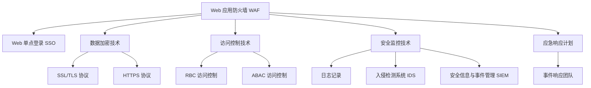

                 

# Web 安全策略实施：保护网站和应用程序免受威胁

## 1. 背景介绍

### 1.1 问题由来

在互联网的浪潮下，网络安全问题日益凸显。随着Web应用的普及，恶意攻击、数据泄露、身份认证等问题愈发严重，对企业和用户造成了巨大的损失。如何有效防范网络威胁，保障Web应用的安全，成为当前技术界的一大挑战。

为了解决这些问题，Web安全策略应运而生。通过一系列行之有效的技术和策略，Web安全策略旨在识别和应对各种网络威胁，保护Web应用的安全性和稳定性。其核心在于通过综合应用多种安全技术和方法，构建一个多层防御体系，有效抵御各种攻击。

### 1.2 问题核心关键点

Web安全策略的实施需要从多个维度进行综合考量，包括但不限于：

- **身份验证**：确保用户的合法性和身份的真实性，防止未授权访问。
- **数据加密**：保护数据在传输和存储过程中的机密性，防止数据泄露。
- **访问控制**：控制用户访问权限，限制对敏感资源的访问。
- **安全监控**：实时监控系统行为，及时发现和响应安全事件。
- **应急响应**：建立应急响应机制，快速应对安全事件，减轻损失。
- **合规性**：确保安全策略符合相关法律法规和标准，如GDPR、ISO 27001等。

这些核心关键点构成了Web安全策略的基石，也是实现Web应用安全的重要保障。

### 1.3 问题研究意义

研究Web安全策略的实施，对于提升Web应用的安全性、保护用户隐私和数据安全、增强企业的竞争力具有重要意义：

1. **提高Web应用的安全性**：通过实施Web安全策略，可以有效防范各种网络攻击，保障Web应用的安全性和稳定性。
2. **保护用户隐私**：安全策略可以有效防止用户数据泄露和滥用，保护用户隐私和个人信息。
3. **增强企业竞争力**：安全策略是企业竞争力的重要组成部分，可以增强用户信任，提升品牌形象。
4. **符合法律法规**：安全策略应符合相关法律法规和标准，确保企业合法合规运营。
5. **应对复杂多变的安全威胁**：网络攻击手段不断演进，安全策略需要灵活应对，确保Web应用始终处于安全状态。

## 2. 核心概念与联系

### 2.1 核心概念概述

为更好地理解Web安全策略的实施过程，本节将介绍几个密切相关的核心概念：

- **Web应用防火墙 (WAF)**：通过拦截、检测和缓解网络攻击，保护Web应用免受各种威胁。
- **Web单点登录 (SSO)**：实现单点登录，简化用户身份验证过程，提升用户体验。
- **数据加密技术**：包括SSL/TLS协议、HTTPS协议等，用于保护数据在传输和存储过程中的机密性和完整性。
- **访问控制技术**：如RBAC、ABAC等，用于控制用户对资源的访问权限。
- **安全监控技术**：包括日志记录、入侵检测系统(IDS)、安全信息与事件管理(SIEM)等，用于实时监控和分析系统行为。
- **应急响应计划**：建立应急响应机制，应对安全事件，减少损失和影响。

这些核心概念之间的逻辑关系可以通过以下Mermaid流程图来展示：



这个流程图展示了几大核心概念之间的联系，并通过互连的箭头表示它们在Web安全策略中的协同作用。

## 3. 核心算法原理 & 具体操作步骤
### 3.1 算法原理概述

Web安全策略的实施基于一系列安全技术和方法，通过综合应用这些技术，构建一个多层次的防御体系。其核心算法原理包括：

1. **拦截和检测**：通过Web应用防火墙 (WAF) 拦截恶意请求，利用入侵检测系统 (IDS) 和日志记录检测异常行为。
2. **身份验证和授权**：通过单点登录 (SSO)、OAuth等机制进行身份验证，利用访问控制技术 (RBAC、ABAC) 控制用户访问权限。
3. **数据加密**：使用SSL/TLS协议和HTTPS协议保护数据在传输和存储过程中的机密性和完整性。
4. **安全监控和响应**：通过安全信息与事件管理 (SIEM) 实时监控系统行为，建立应急响应机制，快速响应安全事件。

### 3.2 算法步骤详解

基于Web安全策略的实施，一般包括以下几个关键步骤：

**Step 1: 安全需求分析**
- 确定Web应用的安全需求，识别潜在的安全威胁和风险。
- 制定安全策略，确定安全目标和保护措施。

**Step 2: 安全架构设计**
- 设计Web应用的安全架构，包括网络、设备和应用程序层面的安全防护措施。
- 确定数据流和访问路径，设计访问控制策略。

**Step 3: 安全技术部署**
- 部署Web应用防火墙 (WAF)、入侵检测系统 (IDS)、单点登录 (SSO)、OAuth等安全技术。
- 配置访问控制策略，实现用户身份验证和授权。

**Step 4: 安全监控和响应**
- 配置安全监控系统，实现实时日志记录和异常检测。
- 建立应急响应计划，包括事件检测、响应和恢复措施。

**Step 5: 安全评估和优化**
- 定期进行安全评估，发现和修复安全漏洞。
- 根据安全评估结果，不断优化安全策略和措施。

### 3.3 算法优缺点

Web安全策略的实施具有以下优点：

1. **全面防护**：通过综合应用多种安全技术和方法，构建多层次的防御体系，有效防范各种网络威胁。
2. **灵活性**：可以根据不同的安全需求和威胁变化，灵活调整安全策略和措施。
3. **用户友好**：简化身份验证和授权过程，提升用户体验。
4. **合规性**：符合相关法律法规和标准，确保合法合规运营。

同时，Web安全策略的实施也存在一些局限性：

1. **成本高**：实施Web安全策略需要投入大量资源，包括硬件、软件和人力成本。
2. **复杂度高**：安全策略的实施和维护需要专业知识，可能对企业造成一定挑战。
3. **动态响应**：网络攻击手段不断演进，需要不断更新和调整安全策略。
4. **数据泄露风险**：安全策略虽然可以防范大部分威胁，但仍存在数据泄露的风险。

尽管存在这些局限性，但就目前而言，Web安全策略仍是保障Web应用安全的重要手段。未来相关研究的重点在于如何进一步降低安全策略的实施成本，提高其灵活性和可操作性，同时兼顾安全性和用户体验。

### 3.4 算法应用领域

Web安全策略的实施在Web应用开发、企业信息化建设、公共服务等多个领域都有广泛应用，成为保障网络安全的重要保障。

- **Web应用开发**：在Web应用开发过程中，嵌入安全策略，确保应用从设计到部署的全过程安全。
- **企业信息化建设**：通过实施Web安全策略，保障企业内外部系统的安全，提升企业信息系统的安全性和稳定性。
- **公共服务**：在公共服务领域，实施Web安全策略，确保服务的安全性和可靠性，保障公众利益。

除了上述这些应用领域外，Web安全策略还被创新性地应用于金融、医疗、教育等诸多行业，为行业数字化转型提供了坚实的基础。随着Web应用的不断普及，Web安全策略的应用场景将更加广泛。

## 4. 数学模型和公式 & 详细讲解 & 举例说明

### 4.1 数学模型构建

Web安全策略的实施需要构建一系列数学模型，用于描述安全策略的设计和优化过程。以下以Web应用防火墙 (WAF) 为例，介绍其数学模型的构建过程。

**定义**：
- $S$：Web应用防火墙的安全策略，包括拦截规则、检测规则等。
- $P$：恶意请求的概率分布，假设为均匀分布。
- $D$：检测规则的准确率和误报率。
- $L$：日志记录的数据量。
- $T$：响应时间。

**目标函数**：
- 最小化恶意请求的漏检率和误报率，最大化系统响应速度。

**优化模型**：
$$
\min_{S} \left( \int_{0}^{1} p(S) dp - D(S) L + T(S) \right)
$$

其中，$p(S)$ 表示策略 $S$ 的性能，$D(S)$ 表示检测规则的误报率，$L$ 表示日志记录的数据量，$T(S)$ 表示响应时间。

### 4.2 公式推导过程

以Web应用防火墙 (WAF) 为例，推导其拦截和检测的数学模型。

**拦截规则**：
假设恶意请求的概率为 $p$，WAF 的拦截规则为 $R$，则拦截效果可以表示为：
$$
E(R) = p(1 - R)
$$
其中，$E(R)$ 表示拦截规则的有效性，$R$ 表示拦截规则的命中率。

**检测规则**：
假设检测规则的准确率为 $A$，误报率为 $F$，则检测效果可以表示为：
$$
D(S) = F + A(1 - F)
$$
其中，$D(S)$ 表示检测规则的误报率，$A$ 表示检测规则的准确率，$F$ 表示误报率。

**优化目标**：
最小化漏检率和误报率，最大化系统响应速度。数学表达式为：
$$
\min_{R,A,F} \left( p(1 - R) + D(S) L + T \right)
$$
其中，$R$ 表示拦截规则的命中率，$A$ 表示检测规则的准确率，$F$ 表示误报率。

**求解步骤**：
1. 设定优化目标函数和约束条件。
2. 使用优化算法（如遗传算法、模拟退火等）求解最优解。
3. 根据求解结果，调整WAF的拦截和检测规则。

### 4.3 案例分析与讲解

以一个具体的案例来说明Web安全策略的实施过程。假设某电商平台需要部署Web应用防火墙 (WAF) 来保障系统的安全性。

**需求分析**：
- 识别出常见的攻击类型，如SQL注入、跨站脚本 (XSS)、跨站请求伪造 (CSRF) 等。
- 确定保护目标，如交易系统、客户服务系统等。

**安全架构设计**：
- 在网络层面，部署Nginx、Apache等Web服务器，配置SSL/TLS协议，实现HTTPS访问。
- 在设备层面，配置入侵检测系统 (IDS)，实时监控网络流量，检测异常行为。
- 在应用程序层面，部署Web应用防火墙 (WAF)，拦截恶意请求，检测异常行为。

**安全技术部署**：
- 配置WAF的拦截规则，如SQL注入、XSS、CSRF等。
- 配置IDS的检测规则，如IP地址黑名单、流量异常检测等。
- 配置单点登录 (SSO)，实现用户身份验证和授权。
- 配置OAuth，实现第三方登录和授权。

**安全监控和响应**：
- 配置日志记录系统，实时记录系统行为。
- 配置安全信息与事件管理 (SIEM)，实时分析日志数据，检测异常行为。
- 建立应急响应计划，包括事件检测、响应和恢复措施。

**安全评估和优化**：
- 定期进行安全评估，发现和修复安全漏洞。
- 根据安全评估结果，不断优化安全策略和措施。

## 5. 项目实践：代码实例和详细解释说明
### 5.1 开发环境搭建

在进行Web安全策略实施的实践前，我们需要准备好开发环境。以下是使用Python进行Nginx部署的安全策略实现环境配置流程：

1. 安装Anaconda：从官网下载并安装Anaconda，用于创建独立的Python环境。

2. 创建并激活虚拟环境：
```bash
conda create -n web-security-env python=3.8 
conda activate web-security-env
```

3. 安装必要的Python包：
```bash
pip install requests flask cgi-bin
```

4. 安装Nginx：
```bash
sudo apt-get update
sudo apt-get install nginx
```

5. 配置Nginx：
```bash
sudo nano /etc/nginx/nginx.conf
```

6. 重启Nginx服务：
```bash
sudo systemctl restart nginx
```

7. 部署Web应用：
```bash
cd /path/to/your/application
```

### 5.2 源代码详细实现

下面我们以Web应用防火墙 (WAF) 的部署为例，给出使用Python和Flask框架进行Nginx配置的代码实现。

```python
from flask import Flask, request

app = Flask(__name__)

@app.route('/')
def index():
    return 'Welcome to Web Application Firewall (WAF)'

@app.route('/waf')
def waf():
    x_forwarded_for = request.environ.get('HTTP_X_FORWARDED_FOR')
    if x_forwarded_for:
        remote_ip = x_forwarded_for.split(':')[0]
    else:
        remote_ip = request.remote_addr
    if remote_ip in ['192.168.0.1', '10.0.0.1']:
        return 'This IP is blocked by WAF'
    else:
        return 'Access allowed by WAF'

if __name__ == '__main__':
    app.run(host='0.0.0.0', port=8080)
```

### 5.3 代码解读与分析

让我们再详细解读一下关键代码的实现细节：

**Flask框架**：
- Flask是一个轻量级的Web框架，支持路由、视图和模板等特性，适合快速开发Web应用。
- 使用Flask构建WAF，可以通过编写路由和视图函数，实现简单的拦截和检测功能。

**路由配置**：
- `@app.route('/')`：表示根路由，用户访问主页时触发。
- `@app.route('/waf')`：表示WAF路由，用户访问WAF时触发。

**请求处理**：
- `request.environ.get('HTTP_X_FORWARDED_FOR')`：获取HTTP请求头中的IP地址。
- `request.remote_addr`：获取HTTP请求的真实IP地址。
- 根据IP地址，判断是否为允许访问，返回拦截或允许结果。

**运行结果展示**：
- 当用户访问根路由时，返回欢迎信息。
- 当用户访问WAF路由时，根据IP地址进行拦截或允许操作。

## 6. 实际应用场景
### 6.1 智能客服系统

智能客服系统通过Web应用防火墙 (WAF) 可以防范各种网络攻击，保障系统的稳定性和安全性。以下是具体实现过程：

1. **需求分析**：
   - 识别常见的攻击类型，如SQL注入、XSS等。
   - 确定保护目标，如客户服务系统。

2. **安全架构设计**：
   - 在网络层面，部署Nginx、Apache等Web服务器，配置SSL/TLS协议，实现HTTPS访问。
   - 在设备层面，配置入侵检测系统 (IDS)，实时监控网络流量，检测异常行为。
   - 在应用程序层面，部署Web应用防火墙 (WAF)，拦截恶意请求，检测异常行为。

3. **安全技术部署**：
   - 配置WAF的拦截规则，如SQL注入、XSS等。
   - 配置IDS的检测规则，如IP地址黑名单、流量异常检测等。
   - 配置单点登录 (SSO)，实现用户身份验证和授权。
   - 配置OAuth，实现第三方登录和授权。

4. **安全监控和响应**：
   - 配置日志记录系统，实时记录系统行为。
   - 配置安全信息与事件管理 (SIEM)，实时分析日志数据，检测异常行为。
   - 建立应急响应计划，包括事件检测、响应和恢复措施。

5. **安全评估和优化**：
   - 定期进行安全评估，发现和修复安全漏洞。
   - 根据安全评估结果，不断优化安全策略和措施。

通过实施Web安全策略，智能客服系统可以有效地防范网络攻击，保障系统的安全性和稳定性，提升用户体验。

### 6.2 金融舆情监测

金融舆情监测系统通过Web应用防火墙 (WAF) 可以防范各种网络攻击，保障系统的安全性和稳定性。以下是具体实现过程：

1. **需求分析**：
   - 识别常见的攻击类型，如SQL注入、XSS等。
   - 确定保护目标，如金融数据系统。

2. **安全架构设计**：
   - 在网络层面，部署Nginx、Apache等Web服务器，配置SSL/TLS协议，实现HTTPS访问。
   - 在设备层面，配置入侵检测系统 (IDS)，实时监控网络流量，检测异常行为。
   - 在应用程序层面，部署Web应用防火墙 (WAF)，拦截恶意请求，检测异常行为。

3. **安全技术部署**：
   - 配置WAF的拦截规则，如SQL注入、XSS等。
   - 配置IDS的检测规则，如IP地址黑名单、流量异常检测等。
   - 配置单点登录 (SSO)，实现用户身份验证和授权。
   - 配置OAuth，实现第三方登录和授权。

4. **安全监控和响应**：
   - 配置日志记录系统，实时记录系统行为。
   - 配置安全信息与事件管理 (SIEM)，实时分析日志数据，检测异常行为。
   - 建立应急响应计划，包括事件检测、响应和恢复措施。

5. **安全评估和优化**：
   - 定期进行安全评估，发现和修复安全漏洞。
   - 根据安全评估结果，不断优化安全策略和措施。

通过实施Web安全策略，金融舆情监测系统可以有效地防范网络攻击，保障系统的安全性和稳定性，提升数据安全和用户信任。

### 6.3 个性化推荐系统

个性化推荐系统通过Web应用防火墙 (WAF) 可以防范各种网络攻击，保障系统的安全性和稳定性。以下是具体实现过程：

1. **需求分析**：
   - 识别常见的攻击类型，如SQL注入、XSS等。
   - 确定保护目标，如推荐系统。

2. **安全架构设计**：
   - 在网络层面，部署Nginx、Apache等Web服务器，配置SSL/TLS协议，实现HTTPS访问。
   - 在设备层面，配置入侵检测系统 (IDS)，实时监控网络流量，检测异常行为。
   - 在应用程序层面，部署Web应用防火墙 (WAF)，拦截恶意请求，检测异常行为。

3. **安全技术部署**：
   - 配置WAF的拦截规则，如SQL注入、XSS等。
   - 配置IDS的检测规则，如IP地址黑名单、流量异常检测等。
   - 配置单点登录 (SSO)，实现用户身份验证和授权。
   - 配置OAuth，实现第三方登录和授权。

4. **安全监控和响应**：
   - 配置日志记录系统，实时记录系统行为。
   - 配置安全信息与事件管理 (SIEM)，实时分析日志数据，检测异常行为。
   - 建立应急响应计划，包括事件检测、响应和恢复措施。

5. **安全评估和优化**：
   - 定期进行安全评估，发现和修复安全漏洞。
   - 根据安全评估结果，不断优化安全策略和措施。

通过实施Web安全策略，个性化推荐系统可以有效地防范网络攻击，保障系统的安全性和稳定性，提升用户体验和推荐效果。

### 6.4 未来应用展望

随着Web应用和网络攻击手段的不断发展，Web安全策略的应用将更加广泛和深入。未来，Web安全策略将展现出以下趋势：

1. **自动化**：通过引入人工智能和机器学习技术，实现自动化威胁检测和响应。
2. **智能化**：结合大数据分析，提升威胁检测的精准性和响应效率。
3. **协同化**：建立跨领域的合作机制，实现安全策略的协同防御。
4. **弹性化**：根据网络流量的动态变化，实时调整安全策略和资源配置。
5. **个性化**：根据不同的安全需求和应用场景，定制化的安全策略和措施。
6. **可信化**：通过区块链等技术，提升安全策略的可信性和透明性。

## 7. 工具和资源推荐
### 7.1 学习资源推荐

为了帮助开发者系统掌握Web安全策略的实施理论基础和实践技巧，这里推荐一些优质的学习资源：

1. **《Web安全攻防技术与实战》书籍**：深入浅出地介绍了Web应用的安全威胁和防御技术，提供了丰富的案例分析和实战经验。

2. **CS855《Web安全与软件工程》课程**：提供Web应用安全技术与策略的系统学习，涵盖从理论到实践的全方位内容。

3. **《Web安全技术与应用》书籍**：全面介绍Web安全技术和工具，包括WAF、SSO、OAuth等。

4. **Web安全工具指南**：包含Nginx、Apache、OWASP等Web安全工具的使用指南，方便开发者上手操作。

5. **Web安全社区**：提供Web安全知识的共享和交流平台，丰富的学习资源和实战案例。

通过对这些资源的学习实践，相信你一定能够快速掌握Web安全策略的精髓，并用于解决实际的Web安全问题。

### 7.2 开发工具推荐

高效的开发离不开优秀的工具支持。以下是几款用于Web安全策略实施开发的常用工具：

1. **Nginx**：轻量级Web服务器，支持SSL/TLS协议、反向代理等功能，适合构建Web应用防火墙 (WAF)。

2. **Apache**：功能强大的Web服务器，支持SSL/TLS协议、反向代理等功能，适合构建Web应用防火墙 (WAF)。

3. **OWASP**：开源的网络安全社区，提供丰富的安全工具和指南，包括Web应用防火墙 (WAF)、入侵检测系统 (IDS)、入侵防御系统 (IPS)等。

4. **Flask**：轻量级的Web框架，支持路由、视图和模板等特性，适合快速开发Web应用和WAF。

5. **cgi-bin**：CGI脚本的支持工具，可以在Nginx和Apache中实现动态网页和WAF。

6. **nginx-nan墙**：基于Nginx实现的开源Web应用防火墙 (WAF)，简单易用，适合中小型Web应用。

合理利用这些工具，可以显著提升Web安全策略实施的开发效率，加快创新迭代的步伐。

### 7.3 相关论文推荐

Web安全策略的研究和应用源于学界的持续研究。以下是几篇奠基性的相关论文，推荐阅读：

1. **Web安全防御技术综述**：综述了Web安全防御技术的发展历程和应用现状，为Web安全策略的实施提供了理论基础。

2. **Web应用防火墙技术研究**：介绍了Web应用防火墙 (WAF) 的基本原理和实现方法，为WAF的部署提供了技术参考。

3. **Web单点登录技术研究**：介绍了单点登录 (SSO) 的基本原理和实现方法，为SSO的部署提供了技术参考。

4. **Web安全监控技术研究**：介绍了入侵检测系统 (IDS)、安全信息与事件管理 (SIEM) 等安全监控技术的原理和实现方法，为安全监控提供了技术参考。

5. **Web安全策略与实践**：探讨了Web安全策略的实施步骤和方法，为Web安全策略的实施提供了实践指南。

这些论文代表了大语言模型微调技术的发展脉络。通过学习这些前沿成果，可以帮助研究者把握学科前进方向，激发更多的创新灵感。

## 8. 总结：未来发展趋势与挑战

### 8.1 总结

本文对Web安全策略的实施进行了全面系统的介绍。首先阐述了Web安全策略的研究背景和意义，明确了安全策略在Web应用中的重要性和必要性。其次，从原理到实践，详细讲解了Web安全策略的设计和优化过程，给出了安全策略实施的完整代码实例。同时，本文还探讨了Web安全策略在多个行业领域的应用场景，展示了安全策略的广泛应用前景。最后，本文精选了安全策略实施的学习资源和工具，力求为开发者提供全方位的技术指引。

通过本文的系统梳理，可以看到，Web安全策略的实施是保障Web应用安全性的重要手段。通过综合应用多种安全技术和方法，构建多层次的防御体系，可以有效防范各种网络威胁，保障Web应用的安全性和稳定性。未来，随着Web应用的不断普及和网络攻击手段的不断演进，Web安全策略的研究和应用将继续深入，为Web应用的安全护航。

### 8.2 未来发展趋势

展望未来，Web安全策略的发展将呈现以下几个趋势：

1. **自动化**：通过引入人工智能和机器学习技术，实现自动化的威胁检测和响应。
2. **智能化**：结合大数据分析，提升威胁检测的精准性和响应效率。
3. **协同化**：建立跨领域的合作机制，实现安全策略的协同防御。
4. **弹性化**：根据网络流量的动态变化，实时调整安全策略和资源配置。
5. **个性化**：根据不同的安全需求和应用场景，定制化的安全策略和措施。
6. **可信化**：通过区块链等技术，提升安全策略的可信性和透明性。

这些趋势表明，Web安全策略的研究和应用将继续深入，为Web应用的安全护航。

### 8.3 面临的挑战

尽管Web安全策略已经取得了不小的成就，但在迈向更加智能化、普适化应用的过程中，它仍面临着诸多挑战：

1. **成本高**：实施Web安全策略需要投入大量资源，包括硬件、软件和人力成本。
2. **复杂度高**：安全策略的实施和维护需要专业知识，可能对企业造成一定挑战。
3. **动态响应**：网络攻击手段不断演进，需要不断更新和调整安全策略。
4. **数据泄露风险**：安全策略虽然可以防范大部分威胁，但仍存在数据泄露的风险。
5. **用户信任**：用户对安全策略的信任度可能受到各种因素的影响，需要不断提升。

尽管存在这些挑战，但通过技术创新和管理优化，Web安全策略必将在未来得到更好的应用和发展。未来研究需要在以下几个方面寻求新的突破：

1. **引入人工智能和机器学习**：利用人工智能和机器学习技术，提升威胁检测和响应的自动化和智能化水平。
2. **引入区块链技术**：通过区块链技术，提升安全策略的可信性和透明性，保障数据安全和隐私。
3. **引入边缘计算**：利用边缘计算技术，提升安全策略的实时性和响应速度。
4. **引入大数据分析**：结合大数据分析技术，提升威胁检测的精准性和响应效率。
5. **引入多模态安全技术**：结合视觉、听觉等多模态信息，提升安全策略的全面性和有效性。

这些研究方向的探索，必将引领Web安全策略技术迈向更高的台阶，为Web应用的安全护航。

### 8.4 研究展望

面对Web安全策略面临的种种挑战，未来的研究需要在以下几个方面寻求新的突破：

1. **引入人工智能和机器学习**：利用人工智能和机器学习技术，提升威胁检测和响应的自动化和智能化水平。
2. **引入区块链技术**：通过区块链技术，提升安全策略的可信性和透明性，保障数据安全和隐私。
3. **引入边缘计算**：利用边缘计算技术，提升安全策略的实时性和响应速度。
4. **引入大数据分析**：结合大数据分析技术，提升威胁检测的精准性和响应效率。
5. **引入多模态安全技术**：结合视觉、听觉等多模态信息，提升安全策略的全面性和有效性。

这些研究方向的探索，必将引领Web安全策略技术迈向更高的台阶，为Web应用的安全护航。

## 9. 附录：常见问题与解答

**Q1：Web安全策略的实施是否适用于所有Web应用？**

A: Web安全策略的实施适用于大多数Web应用，尤其是那些对数据和用户隐私要求较高的应用。但对于一些特定领域的应用，如医疗、金融等，需要根据具体需求和法规要求进行定制化的安全策略设计。

**Q2：如何选择合适的Web应用防火墙 (WAF)？**

A: 选择合适的WAF需要考虑以下几个因素：
- 防护能力：选择能够防护常见攻击的WAF，如SQL注入、XSS等。
- 配置灵活性：选择易于配置和维护的WAF，支持自定义规则。
- 性能表现：选择响应速度快的WAF，避免影响Web应用性能。
- 兼容性：选择支持Web服务器（如Nginx、Apache）的WAF，确保系统稳定运行。

**Q3：Web安全策略的实施是否会增加Web应用的开销？**

A: Web安全策略的实施确实会增加Web应用的开销，主要包括硬件、软件和人力成本。但这些开销是为了保障Web应用的安全性和稳定性，对于高风险领域的应用，是必要的投入。

**Q4：Web安全策略的实施是否会影响Web应用的性能？**

A: 合理的Web安全策略实施不会显著影响Web应用的性能。WAF等安全设备可以配置成无状态模式，不会对Web应用的后端逻辑产生影响。但如果不合理配置，WAF等设备可能会影响Web应用的性能。

**Q5：Web安全策略的实施是否会影响用户体验？**

A: Web安全策略的实施可能会影响用户体验，尤其是在安全策略配置不当时。但通过合理的安全策略设计，可以避免这种影响，甚至提升用户体验。例如，单点登录 (SSO) 可以简化用户身份验证过程，提升用户体验。

通过合理实施Web安全策略，可以在保障Web应用安全性的同时，最大程度提升用户体验，确保Web应用的稳定性和可靠性。

