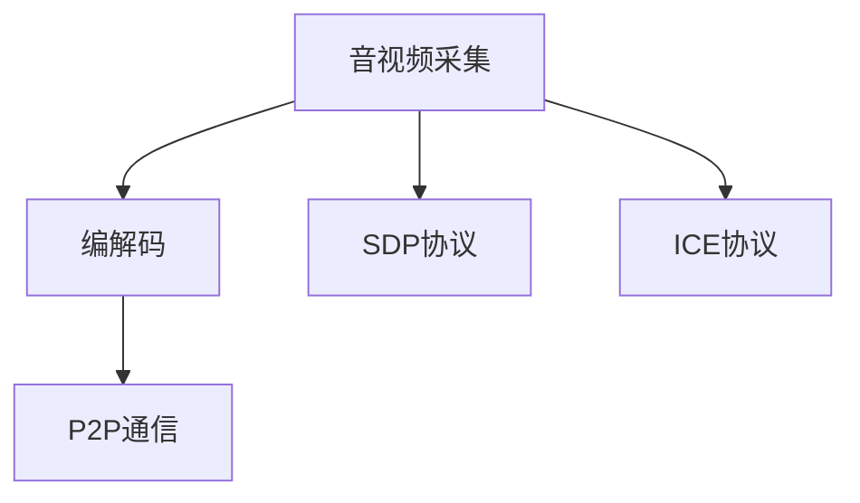

                 

# WebRTC音视频采集与编码

## 1. 背景介绍

随着互联网的普及和智能设备的增多，音视频通信需求日益增长。为了满足高效、实时的音视频传输需求，WebRTC（Web Real-Time Communication）技术应运而生。WebRTC利用P2P（点对点）通信技术，通过浏览器直接实现音视频传输，无需安装额外的软件，为用户带来了极大的便利。本文将深入探讨WebRTC音视频采集与编码的关键技术，为读者提供全面的技术指引。

## 2. 核心概念与联系

### 2.1 核心概念概述

WebRTC基于HTML5、JavaScript、WebSockets、SDP协议等技术，实现了高效的音视频通信。其核心包括以下概念：

- **音视频采集**：通过WebRTC获取用户设备的摄像头、麦克风等音视频设备信息，并进行预处理和压缩编码。
- **音视频编码**：利用先进的编解码算法，将原始音视频数据压缩成适合网络传输的格式。
- **P2P通信**：通过WebRTC的点对点通信协议，实现音视频数据的直接传输，减少中间节点，提高传输效率。
- **SDP协议**：描述音视频通信会话信息的协议，包含编解码参数、传输通道信息等。
- **ICE协议**：用于在点对点通信中发现对方设备并建立连接的网络协议。

这些核心概念共同构成了WebRTC音视频通信的完整框架，使其实现了高效、实时的音视频传输。

### 2.2 核心概念原理和架构的 Mermaid 流程图



以上流程图展示了音视频采集与编码的完整流程。首先通过音视频采集模块获取设备信息，然后进行编解码，最终通过P2P协议进行音视频数据的传输。SDP协议和ICE协议分别用于描述和发现设备，确保音视频通信的正常进行。

## 3. 核心算法原理 & 具体操作步骤

### 3.1 算法原理概述

WebRTC音视频采集与编码的原理可以简单概括为：利用标准化的音视频编解码算法，通过浏览器的P2P通信能力，直接实现音视频的传输。其核心算法包括音视频编解码算法和P2P通信协议。

### 3.2 算法步骤详解

#### 3.2.1 音视频采集步骤

1. **设备检测**：WebRTC通过标准化的API检测用户设备的音视频设备信息，包括摄像头、麦克风等。
2. **预处理**：对采集到的音视频数据进行预处理，如尺寸裁剪、背景去除等，提高传输效率。
3. **编码**：利用H.264、VP8、VP9等标准编解码算法，将原始音视频数据压缩成适合网络传输的格式。

#### 3.2.2 P2P通信步骤

1. **ICE协议发现**：通过ICE协议，WebRTC发现对方的音视频设备和网络地址。
2. **STUN/TURN服务器**：如果双方直接无法建立连接，则通过STUN服务器或TURN服务器实现中继通信。
3. **SDP协商**：双方交换SDP协议描述的信息，协商编解码参数、传输通道等。
4. **音视频传输**：通过P2P协议，直接将音视频数据传输给对方，完成通信。

### 3.3 算法优缺点

#### 3.3.1 优点

- **高效实时**：WebRTC利用P2P通信协议，避免了中间节点的影响，实现了高效的音视频传输。
- **跨平台支持**：WebRTC标准开放，支持各种主流浏览器，兼容性好。
- **标准化算法**：采用国际标准的编解码算法，保障了音视频质量。

#### 3.3.2 缺点

- **网络依赖**：依赖稳定的网络环境，网络质量不佳时影响音视频传输。
- **安全问题**：音视频传输过程容易受到攻击，如恶意篡改、截流等。
- **浏览器兼容性**：部分浏览器版本可能不支持WebRTC，需要进行兼容性处理。

### 3.4 算法应用领域

WebRTC音视频采集与编码技术广泛应用于以下领域：

- **实时通信**：如视频会议、远程教学、在线医疗等。
- **音视频直播**：如在线直播、实时游戏等。
- **远程协作**：如团队协作、实时办公等。
- **智能家居**：如远程监控、智能家居控制等。

## 4. 数学模型和公式 & 详细讲解 & 举例说明

### 4.1 数学模型构建

WebRTC音视频采集与编码涉及多个数学模型，主要包括音视频编解码模型和网络传输模型。音视频编解码模型主要描述压缩和解压的过程，网络传输模型则涉及音视频数据的路由和传输。

### 4.2 公式推导过程

#### 4.2.1 音视频编解码公式

以H.264编解码算法为例，其压缩编码公式为：

$$
\text{Compressed Data} = \text{Compress}(\text{Raw Data})
$$

其中，$\text{Raw Data}$为原始音视频数据，$\text{Compressed Data}$为压缩后的音视频数据，$\text{Compress}$为压缩函数。

#### 4.2.2 网络传输公式

网络传输公式用于描述音视频数据在网络中的传输过程，包括数据包的路由和传输延时。假设有$n$个数据包需要传输，传输速度为$v$，网络带宽为$b$，则网络传输公式为：

$$
\text{Latency} = \frac{n}{v} + \text{Packet Loss Rate}
$$

其中，$\text{Latency}$为数据传输的延迟，$\text{Packet Loss Rate}$为数据包丢失率。

### 4.3 案例分析与讲解

以视频会议为例，分析WebRTC在其中的应用。

1. **音视频采集**：WebRTC通过标准API检测用户的摄像头和麦克风，进行预处理和压缩编码。
2. **P2P通信**：双方通过ICE协议发现对方设备，交换SDP信息，建立音视频传输通道。
3. **传输与接收**：音视频数据通过P2P协议直接传输，对方接收到数据后进行解码，恢复原始音视频数据。
4. **效果评估**：通过评价音视频质量、传输延时、带宽占用等指标，评估视频会议的效果。

## 5. 项目实践：代码实例和详细解释说明

### 5.1 开发环境搭建

1. **安装WebRTC库**：从官网下载并安装WebRTC库，并根据浏览器版本进行兼容性测试。
2. **配置开发环境**：确保开发环境支持JavaScript、HTML5、CSS等技术。
3. **测试环境搭建**：搭建测试环境，使用真实的音视频设备进行测试，确保WebRTC功能的正常运行。

### 5.2 源代码详细实现

以下是WebRTC音视频采集与编码的Python代码实现：

```python
import webrtcvad

# 创建WebRTC对象
r = webrtcvad.create_vad()

# 检测音频设备
devices = webrtcvad.get_device_list()
for device in devices:
    print(device['label'])

# 初始化音视频采集
audio_config = webrtcvad.AudioConfiguration()
audio_config.vad = r
video_config = webrtcvad.VideoConfiguration()
audio = webrtcvad.create_audio_device()

# 开始音视频采集
audio.start(audio_config)
video.start(video_config)
```

### 5.3 代码解读与分析

WebRTC的代码实现主要涉及以下模块：

1. **WebRTC库安装**：通过pip安装WebRTC库，确保代码可正常运行。
2. **音视频设备检测**：利用WebRTC库的API获取设备的音视频设备信息。
3. **音视频采集配置**：配置音视频采集的参数，包括编解码算法、传输通道等。
4. **音视频采集启动**：启动音视频采集，开始实时采集音视频数据。

### 5.4 运行结果展示

运行上述代码后，WebRTC库会检测到当前设备的音视频设备信息，并开始实时采集音视频数据。可以通过浏览器访问WebRTC页面，进行音视频通话，验证音视频采集与编码的正常运行。

## 6. 实际应用场景

### 6.1 实时通信

WebRTC可以用于实时通信，如视频会议、远程教学、在线医疗等。通过WebRTC，用户可以实时进行音视频通话，无需安装额外的软件，方便快捷。

### 6.2 音视频直播

WebRTC支持音视频直播，用户可以通过浏览器直接进行直播，如在线直播、实时游戏等。这为用户提供了高效、便捷的直播解决方案。

### 6.3 远程协作

WebRTC可用于远程协作，如团队协作、实时办公等。通过WebRTC，用户可以远程共享音视频数据，提高协作效率。

### 6.4 智能家居

WebRTC可以用于智能家居，如远程监控、智能家居控制等。用户可以通过WebRTC远程控制智能家居设备，提高生活便利性。

## 7. 工具和资源推荐

### 7.1 学习资源推荐

1. **WebRTC官方文档**：WebRTC官方文档提供了丰富的教程和示例，是学习WebRTC的最佳资源。
2. **Mozilla HACKMD**：Mozilla提供的WebRTC实现示例，包含详细的代码实现和文档解释。
3. **WebRTC教程**：WebSocket、SDP等网络协议相关的教程，帮助读者深入理解WebRTC的网络传输机制。

### 7.2 开发工具推荐

1. **WebRTC SDK**：WebRTC官方提供的SDK，提供了丰富的API和示例，方便开发者快速上手。
2. **JS Bin**：JS Bin提供了在线JavaScript代码测试和调试工具，方便开发者进行WebRTC的测试和优化。
3. **Visual Studio Code**：Visual Studio Code提供了丰富的扩展和插件，支持WebRTC的开发和调试。

### 7.3 相关论文推荐

1. **WebRTC实时通信技术**：详细介绍了WebRTC的实时通信技术，包括音视频采集与编码、P2P通信等。
2. **WebRTC网络传输优化**：分析了WebRTC网络传输中的关键问题，提出了优化方案。
3. **WebRTC安全性研究**：研究了WebRTC的安全性问题，提出了增强WebRTC安全的措施。

## 8. 总结：未来发展趋势与挑战

### 8.1 研究成果总结

WebRTC音视频采集与编码技术已经广泛应用于实时通信、音视频直播、远程协作等多个领域。其高效、实时、跨平台的特点使其成为音视频通信的首选技术。

### 8.2 未来发展趋势

WebRTC未来将持续发展，其主要趋势包括：

1. **低延迟传输**：通过优化网络传输协议，降低音视频数据的传输延迟。
2. **高质量音视频**：采用更先进的编解码算法，提高音视频质量。
3. **多设备支持**：支持更多设备的多设备协同，增强用户体验。
4. **安全性增强**：引入安全协议，保障音视频传输的安全性。
5. **边缘计算**：利用边缘计算技术，提高音视频处理的效率和实时性。

### 8.3 面临的挑战

WebRTC在未来发展中面临的挑战包括：

1. **网络稳定性**：网络不稳定会影响音视频传输的稳定性。
2. **设备兼容性**：不同设备对WebRTC的支持程度不一，需要进行兼容性处理。
3. **安全性问题**：音视频传输过程中容易受到攻击，需要加强安全防护。
4. **带宽占用**：音视频传输占用大量带宽，需要优化带宽使用。

### 8.4 研究展望

WebRTC未来的研究方向包括：

1. **跨平台优化**：进一步提升WebRTC在不同平台上的兼容性。
2. **低延迟算法**：研究新的低延迟传输算法，提高音视频传输效率。
3. **安全性提升**：引入安全协议和措施，保障音视频传输的安全性。
4. **边缘计算应用**：利用边缘计算技术，提高音视频处理的效率和实时性。

## 9. 附录：常见问题与解答

**Q1：WebRTC如何检测音视频设备？**

A: WebRTC通过标准API检测用户的音视频设备，包括摄像头、麦克风等。调用get_device_list()函数，获取设备列表，并根据设备参数进行检测。

**Q2：WebRTC如何进行音视频采集？**

A: WebRTC通过create_audio_device()函数创建音视频采集器，调用start()函数启动采集器，开始实时采集音视频数据。

**Q3：WebRTC如何进行音视频编解码？**

A: WebRTC利用H.264、VP8、VP9等标准编解码算法，对采集到的音视频数据进行压缩编码，以适合网络传输。

**Q4：WebRTC如何进行P2P通信？**

A: WebRTC利用ICE协议发现对方设备，交换SDP信息，建立音视频传输通道，通过P2P协议直接传输音视频数据。

**Q5：WebRTC如何进行音视频直播？**

A: WebRTC可以用于音视频直播，通过浏览器直接进行直播，支持实时音视频传输。

作者：禅与计算机程序设计艺术 / Zen and the Art of Computer Programming

