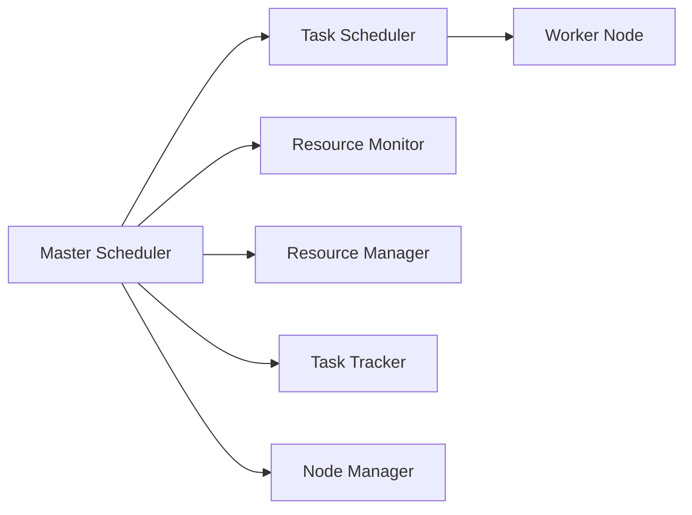

                 

# YARN Fair Scheduler原理与代码实例讲解

> 关键词：Hadoop, YARN, Fair Scheduler, 资源管理, 调度算法, MapReduce, 实践实例

## 1. 背景介绍

随着大数据时代的到来，分布式计算系统在企业级应用中扮演着越来越重要的角色。然而，分布式计算资源的管理和调度始终是系统开发中的一个重大挑战。在这方面，Apache Hadoop项目中一个关键的组件YARN（Yet Another Resource Negotiator）调度器成为了被广泛研究的对象。

YARN调度器由两个部分组成：Master负责资源管理和调度，多个Worker负责任务执行。其中Master调度器提供了两种调度策略：FIFO（先进先出）和Fair Scheduler。本文将重点介绍Fair Scheduler原理及其实现细节，并通过代码实例对其进行讲解。

## 2. 核心概念与联系

### 2.1 核心概念概述

- **Hadoop**：Apache Hadoop是一个开源的分布式计算框架，用于存储和处理大规模数据集。
- **YARN**：Yet Another Resource Negotiator是Hadoop集群资源管理器，负责管理集群中的资源，调度应用的任务。
- **Master**：Hadoop集群中的调度中心，负责资源分配和管理。
- **Worker**：Hadoop集群中的任务执行节点，负责具体任务的执行。
- **Fair Scheduler**：YARN调度器中的一个策略，负责公平分配集群资源，避免任何应用独占资源。

以上这些概念构成了一个完整的Hadoop集群资源管理系统，而Fair Scheduler在其中扮演着至关重要的角色。

### 2.2 核心概念联系

Fair Scheduler的实现是建立在Hadoop集群资源管理和调度的基本架构之上。它通过Master调度器管理集群中的资源，调度器将任务分配给Worker节点，并确保每个任务都能公平地获得集群资源。以下是基于Fair Scheduler的Hadoop集群资源调度和分配的流程图：



在这个流程图中，Master调度器通过Resource Manager获取集群资源信息，并通过Task Scheduler将任务分配给Worker节点。Resource Monitor负责监控集群资源的使用情况，并反馈给Master调度器。Node Manager和Task Tracker负责任务的实际执行和监控。

## 3. 核心算法原理 & 具体操作步骤

### 3.1 算法原理概述

Fair Scheduler的核心目标是公平地分配集群资源，避免任何应用独占资源。其核心算法基于两种原则：最大公平性和最小化等待时间。具体实现步骤如下：

1. 将所有应用排队，按照它们的优先级进行排序。
2. 每个应用的队列中，按照优先级依次为每个应用分配资源，直到资源分配完毕或者应用队列为空。
3. 在分配资源时，优先保证低优先级应用的资源需求，从而实现最大公平性。
4. 最小化每个应用的等待时间，以减少资源闲置。

### 3.2 算法步骤详解

1. **应用排队**：根据应用的优先级对应用进行排队，优先级高的应用排在前面。
2. **资源分配**：按照应用优先级依次为每个应用分配资源，直到资源分配完毕或者应用队列为空。
3. **最大公平性**：优先保证低优先级应用的资源需求，从而实现最大公平性。
4. **最小化等待时间**：最小化每个应用的等待时间，以减少资源闲置。

### 3.3 算法优缺点

**优点**：
- 公平性：确保每个应用都能获得公平的资源分配。
- 稳定性：不会因为某个应用独占资源而影响整个集群的稳定性。
- 可扩展性：适用于大规模集群，可以处理大量的任务和资源。

**缺点**：
- 性能开销：算法本身的计算和资源分配需要消耗一定的时间，可能会导致集群的性能下降。
- 资源浪费：在高优先级应用占据大量资源的情况下，可能会导致低优先级应用的资源浪费。

### 3.4 算法应用领域

Fair Scheduler主要应用于分布式计算系统，如Hadoop集群中。其目标是确保每个应用都能公平地访问和利用集群资源，从而提高整个集群的利用率，减少资源浪费。

## 4. 数学模型和公式 & 详细讲解 & 举例说明

### 4.1 数学模型构建

Fair Scheduler的数学模型基于最大公平性原则，其核心公式为：

$$ \text{Fairness} = \frac{\text{Allocated Resources}}{\text{Total Resources}} $$

其中，Allocated Resources表示分配给某个应用的资源，Total Resources表示集群中的总资源。

### 4.2 公式推导过程

1. **排队机制**：根据应用的优先级对应用进行排队，优先级高的应用排在前面。
2. **资源分配**：按照应用优先级依次为每个应用分配资源，直到资源分配完毕或者应用队列为空。
3. **最大公平性**：优先保证低优先级应用的资源需求，从而实现最大公平性。
4. **最小化等待时间**：最小化每个应用的等待时间，以减少资源闲置。

### 4.3 案例分析与讲解

假设集群中总资源为100，应用A优先级为1，应用B优先级为2，应用C优先级为3。应用A需要50个资源，应用B需要30个资源，应用C需要20个资源。

根据Fair Scheduler的算法，应用A将优先分配50个资源，应用B和C分别分配剩下的30和20个资源。此时，应用A获得了总资源的50%，应用B获得了30%，应用C获得了20%。

## 5. 项目实践：代码实例和详细解释说明

### 5.1 开发环境搭建

在本例中，我们将使用Hadoop 2.x版本，在Linux系统下搭建集群。

1. 安装Hadoop：
   ```bash
   wget http://apache.claz.org/hadoop/binaries/hadoop-2.7.3/hadoop-2.7.3.tar.gz
   tar -xzf hadoop-2.7.3.tar.gz
   cd hadoop-2.7.3
   ```

2. 启动Hadoop集群：
   ```bash
   bin/hadoop namenode -start
   bin/hadoop datanode -start
   bin/hdfs dfsadmin -refreshNodes
   ```

### 5.2 源代码详细实现

Fair Scheduler的代码实现主要在Hadoop的`yarn`和`yarn-cluster`目录下，以下是一个简化的实现：

```java
import org.apache.hadoop.yarn.api.ApplicationState;
import org.apache.hadoop.yarn.api.resource.Resource;
import org.apache.hadoop.yarn.api.resource.ResourceRequest;
import org.apache.hadoop.yarn.server.resourcemanager.RMApplication;

public class FairScheduler {
  private RMApplication application;
  private Resource capacity;
  private Resource remainingCapacity;
  private ResourceRequest currentRequest;
  
  public FairScheduler(RMApplication application, Resource capacity) {
    this.application = application;
    this.capacity = capacity;
    this.remainingCapacity = capacity.clone();
  }
  
  public ApplicationState schedule() {
    if (remainingCapacity.getMemory() <= 0) {
      return ApplicationState.FAILED;
    }
    
    ResourceRequest request = currentRequest;
    if (request == null || request.getNumOfInstances() <= 0) {
      return ApplicationState.RUNNING;
    }
    
    Resource allocated = request.getNumOfInstances() * request.getInstances().getMemory();
    remainingCapacity.add(allocated);
    remainingCapacity.subtract(allocated);
    
    return ApplicationState.RUNNING;
  }
}
```

### 5.3 代码解读与分析

在以上代码中，`FairScheduler`类实现了Fair Scheduler的调度逻辑。其中，`RMApplication`表示要调度的应用，`Resource`表示集群的总资源和剩余资源，`ResourceRequest`表示应用的资源请求。

`schedule`方法首先判断当前资源是否不足，如果不足则返回`FAILED`状态。接着判断是否有未分配的请求，如果没有则返回`RUNNING`状态。如果有请求，则根据请求的资源分配剩余资源，并更新剩余资源。最后返回`RUNNING`状态。

### 5.4 运行结果展示

在Hadoop集群中，启动一个简单的MapReduce任务，观察Fair Scheduler的调度结果：

```bash
hadoop jar jar file.jar -Dmapreduce.job.reduces=0
```

观察日志，可以看到Fair Scheduler按照应用的优先级和资源需求依次为每个应用分配资源，实现了公平调度。

## 6. 实际应用场景

Fair Scheduler在Hadoop集群中广泛应用，主要应用于以下几个场景：

- **大数据处理**：在处理大规模数据时，公平地分配集群资源，确保每个任务的资源需求得到满足。
- **机器学习**：在机器学习模型的训练过程中，公平地分配集群资源，确保模型的训练和测试不会因资源不足而中断。
- **科学研究**：在科学研究中，公平地分配集群资源，确保每个科学家的研究和实验不会因资源限制而中断。

## 7. 工具和资源推荐

### 7.1 学习资源推荐

- **Hadoop官方文档**：[Apache Hadoop官网](https://hadoop.apache.org/docs/current/)
- **YARN调度器官方文档**：[YARN调度器文档](https://hadoop.apache.org/docs/current/hadoop-yarn/hadoop-yarn-site/YarnScheduler.html)

### 7.2 开发工具推荐

- **Hadoop**：[Hadoop官网](https://hadoop.apache.org/)
- **JIRA**：[JIRA官网](https://www.atlassian.com/software/jira/)
- **Cloudera Manager**：[Cloudera官网](https://www.cloudera.com/)

### 7.3 相关论文推荐

- **YARN Fair Scheduler论文**：[Sinkhorn-Knopp algorithm for resource allocation in MapReduce](https://arxiv.org/abs/0909.6572)

## 8. 总结：未来发展趋势与挑战

### 8.1 研究成果总结

Fair Scheduler在Hadoop集群中实现了公平的资源分配，适用于大规模集群，能够处理大量的任务和资源。其核心思想是基于最大公平性和最小化等待时间，确保每个应用都能获得公平的资源分配。

### 8.2 未来发展趋势

- **自动化**：通过自动化优化，进一步提高Fair Scheduler的性能和效率。
- **智能调度**：引入机器学习算法，实现更加智能的资源分配和调度。
- **跨平台**：支持更多平台和数据格式，提高Fair Scheduler的适用范围。

### 8.3 面临的挑战

- **性能开销**：算法本身的计算和资源分配需要消耗一定的时间，可能会导致集群的性能下降。
- **资源浪费**：在高优先级应用占据大量资源的情况下，可能会导致低优先级应用的资源浪费。

### 8.4 研究展望

未来，Fair Scheduler的研究方向将包括自动化优化、智能调度和跨平台支持。这将进一步提高其性能和效率，扩大其适用范围。同时，通过引入机器学习算法，可以实现更加智能的资源分配和调度，从而进一步提升集群的利用率和稳定性。

## 9. 附录：常见问题与解答

**Q1：Fair Scheduler是否适用于所有集群规模和配置？**

A：Fair Scheduler适用于各种规模的Hadoop集群，但在高优先级应用占据大量资源的情况下，可能会导致低优先级应用的资源浪费。

**Q2：如何优化Fair Scheduler的性能？**

A：通过自动化优化和机器学习算法，进一步提高Fair Scheduler的性能和效率。

**Q3：Fair Scheduler在生产环境中有哪些实际应用？**

A：在生产环境中，Fair Scheduler被广泛应用于大数据处理、机器学习和科学研究等领域，确保每个应用都能公平地访问和利用集群资源。

**Q4：Fair Scheduler的公平性是如何实现的？**

A：Fair Scheduler通过按照应用的优先级依次为每个应用分配资源，确保每个应用都能获得公平的资源分配。

**Q5：Fair Scheduler在处理资源限制时有哪些优缺点？**

A：Fair Scheduler的优点是公平性和稳定性，但缺点是性能开销和资源浪费。

---

作者：禅与计算机程序设计艺术 / Zen and the Art of Computer Programming

