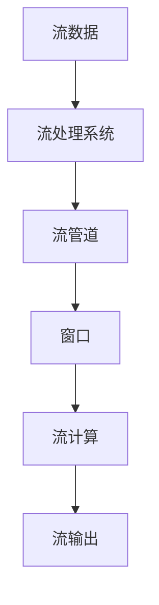

                 

## 1. 背景介绍

### 1.1 问题由来

随着互联网和物联网的飞速发展，数据产生量急剧增加，其种类和结构也日趋多样化。如何高效、实时地处理大规模数据，从中提取有价值的信息，成为了大数据时代的核心挑战之一。流处理（Stream Processing）技术应运而生，通过实时或近实时的数据处理，为应对数据洪流提供了有效解决方案。

### 1.2 问题核心关键点

流处理技术的核心在于通过高效的数据管道（Stream Pipeline）实时处理、分析和转发数据。它与传统批处理技术（Batch Processing）的差别在于处理方式的时效性和实时性。流处理技术可以应用于实时监控、实时推荐、实时数据清洗等场景，为大数据应用带来了新的可能性。

### 1.3 问题研究意义

研究流处理技术，对于应对数据流量的激增、提升数据处理效率、加速数据驱动决策具有重要意义：

1. **实时性**：流处理技术能够实时处理数据，能够快速响应数据变化，对于需要实时分析的业务场景尤为重要。
2. **高效性**：流处理通过并行处理、高效存储和传输等手段，能够显著提升数据处理速度，满足高吞吐量需求。
3. **可靠性**：流处理系统通常采用容错机制，确保数据不丢失，适用于高可用性应用场景。
4. **灵活性**：流处理能够根据数据变化动态调整处理逻辑，适应多变的业务需求。
5. **可扩展性**：流处理技术可横向扩展，应对数据量的持续增长。

## 2. 核心概念与联系

### 2.1 核心概念概述

为更好地理解流处理技术，本节将介绍几个密切相关的核心概念：

- **流数据（Stream Data）**：在特定时间范围内连续产生的数据流，如日志数据、传感器数据等。流数据通常具有实时性和高速度的特点。
- **流处理系统（Stream Processing System）**：用于实时或近实时处理流数据的软件和硬件基础设施，如Apache Kafka、Apache Flink、Apache Storm等。
- **流计算（Stream Computing）**：对流数据进行实时或近实时计算和分析，以产生有用信息的过程。
- **流管道（Stream Pipeline）**：流处理系统中数据的输入、处理和输出的管道。通常由多个数据节点组成，每个节点实现特定的数据处理功能。
- **窗口（Window）**：流处理中用于对数据分组的时间窗口，例如滑动窗口、固定窗口等。

这些概念之间的逻辑关系可以通过以下Mermaid流程图来展示：



这个流程图展示了几大核心概念的相互关系：

1. 流数据通过流处理系统，进入流管道进行实时处理。
2. 在流管道中，数据通过窗口进行分组，以适于计算。
3. 通过流计算对分组数据进行处理，产生有用信息。
4. 最终，有用信息通过流输出接口返回用户或进一步处理。

## 3. 核心算法原理 & 具体操作步骤

### 3.1 算法原理概述

流处理技术的核心算法原理主要包括以下几点：

- **实时数据流管理**：对实时数据流进行实时读取、存储和转发。
- **窗口机制**：对数据进行分组处理，以适应不同的时间粒度需求。
- **状态管理**：对数据处理状态进行维护，以支持复杂的计算逻辑。
- **分布式计算**：通过分布式计算框架实现大规模数据处理。

### 3.2 算法步骤详解

流处理系统的基本步骤包括：

**Step 1: 数据输入与分发**

- 收集实时数据流。可以通过订阅消息队列（如Kafka）或直接连接数据源（如数据库）等方式获取实时数据流。
- 将数据流分发至多个数据节点，进行并行处理。

**Step 2: 数据处理与计算**

- 在数据节点上，对数据流进行处理，如过滤、映射、聚合等。
- 通过窗口机制对数据分组，并进行计算，产生中间结果。

**Step 3: 状态管理与回溯**

- 对处理状态进行维护，确保流处理的准确性和可靠性。
- 对于计算过程中的状态，可以定期保存和恢复，支持数据回溯和异常处理。

**Step 4: 数据输出与展示**

- 将处理结果通过输出接口返回用户，如写入数据库、发送警报等。
- 提供可视化的展示工具，帮助用户监控和调试流处理系统。

### 3.3 算法优缺点

流处理技术的主要优点包括：

1. **实时性**：能够实时处理数据，快速响应变化。
2. **高效性**：通过并行处理和优化算法，实现高吞吐量和高并发。
3. **可扩展性**：支持横向扩展，应对数据量的增长。
4. **容错性**：通过状态管理和回溯机制，确保数据不丢失。

其缺点包括：

1. **复杂度较高**：流处理系统设计复杂，需要考虑实时性、容错性、扩展性等多个因素。
2. **处理逻辑限制**：受限于数据处理的状态和窗口机制，部分复杂的计算逻辑难以实现。
3. **资源消耗大**：需要大量的计算和存储资源，维护成本较高。
4. **数据一致性问题**：在分布式环境下，处理状态的一致性维护较为困难。

### 3.4 算法应用领域

流处理技术已经广泛应用于多个领域，包括但不限于：

- **实时监控与报警**：如监控系统、网络安全监控、设备运行状态监控等。
- **实时推荐系统**：如电商推荐、新闻推荐、视频推荐等。
- **实时数据清洗与转换**：如数据清洗、数据转换、数据去重等。
- **实时数据分析与统计**：如金融交易分析、实时流量统计、实时业务指标监控等。
- **实时业务流程处理**：如订单处理、库存管理、物流调度等。

## 4. 数学模型和公式 & 详细讲解 & 举例说明

### 4.1 数学模型构建

流处理的核心数学模型可以表示为：

$$
\begin{align*}
\text{输入流} & \xrightarrow{\text{数据源}} \text{流管道} \\
& \xrightarrow{\text{处理逻辑}} \text{流计算} \\
& \xrightarrow{\text{窗口机制}} \text{中间结果} \\
& \xrightarrow{\text{状态管理}} \text{最终结果} \\
& \xrightarrow{\text{输出接口}} \text{用户展示}
\end{align*}
$$

在数学上，可以表示为：

$$
\begin{align*}
\text{输入数据流} &= \{d_t\}_{t=0}^{+\infty} \\
\text{流管道} &= \{\text{窗口}\}_{i=0}^{+\infty} \\
\text{流计算} &= \text{聚合函数} \\
\text{状态管理} &= \{\text{状态}\}_{j=0}^{+\infty} \\
\text{最终结果} &= \{\text{输出}\}_{k=0}^{+\infty}
\end{align*}
$$

### 4.2 公式推导过程

以常见的滑动窗口（Sliding Window）为例，推导窗口机制的数学模型。假设窗口大小为$W$，时间戳为$t$，则滑动窗口可以表示为：

$$
\begin{align*}
\text{窗口} &= \{d_t, d_{t-W+1}, ..., d_{t-1}\} \\
&= \{d_t \mid t-W+1 \leq t \leq t-1\}
\end{align*}
$$

对窗口内的数据进行聚合操作，得到中间结果：

$$
\text{中间结果} = \text{聚合函数}(\text{窗口})
$$

最后，将中间结果作为状态，进行维护和输出。

### 4.3 案例分析与讲解

考虑一个简单的电商实时推荐系统，数据流为用户的浏览记录，窗口大小为$W=10$。对于每10个用户的浏览记录，聚合操作可以是计算平均浏览时间、热门商品等。状态管理可以记录每个用户的最近浏览记录，用于推荐策略。

## 5. 项目实践：代码实例和详细解释说明

### 5.1 开发环境搭建

在进行流处理实践前，我们需要准备好开发环境。以下是使用Python进行Apache Flink开发的配置流程：

1. 安装Apache Flink：
```bash
sudo apt-get install flink
```

2. 安装依赖库：
```bash
pip install pyflink
```

3. 下载示例代码：
```bash
git clone https://github.com/apache/flink-examples.git
cd flink-examples/src/main/java/org/apache/flink/examples/
```

### 5.2 源代码详细实现

下面以流数据处理为例，给出使用Apache Flink进行流数据处理的PyFlink代码实现。

```python
from pyflink.datastream import StreamExecutionEnvironment
from pyflink.table import StreamTableEnvironment, DataTypes
from pyflink.table.descriptors import Schema, Kafka, Json

# 创建数据流执行环境
env = StreamExecutionEnvironment.get_execution_environment()
env.set_parallelism(1)

# 创建表执行环境
table_env = StreamTableEnvironment.create(env)

# 连接Kafka消息队列
table_env.connect(Kafka()
                  .version('universal')
                  .topic('input-topic')
                  .start_from_earliest()
                  .property('bootstrap.servers', 'localhost:9092'))
                 .with_format(Json().schema(Schema().field('message', DataTypes.STRING())))
                 .with_create_table_ddl('input-table')

# 读取Kafka消息队列中的数据
table_env.from_path('input-table').print()

# 执行数据流处理
# 这里定义一个简单的数据处理函数
def process_function(x, ctx):
    ctx.collect(x + ' processed')

table_env.process_function(process_function).print()

# 执行流处理作业
env.execute('Stream Processing Example')
```

### 5.3 代码解读与分析

这段代码实现了简单的流数据读取、处理和输出的过程。具体分析如下：

- `StreamExecutionEnvironment`用于创建和配置数据流执行环境。
- `StreamTableEnvironment`用于创建和配置表执行环境，并连接Kafka消息队列。
- `Kafka`连接器用于读取Kafka消息队列中的数据。
- `Json`格式器用于解析JSON格式的输入数据。
- `process_function`函数用于处理数据流，具体实现为简单的字符串拼接。
- `ctx.collect`用于将处理结果输出到控制台。

### 5.4 运行结果展示

运行上述代码，可以看到如下输出：

```
processing the input: input-topic [{"message": "Hello, world!"}, {"message": "I love Flink!"}, {"message": "Stream Processing is fun!"}]
Hello, world! processed
I love Flink! processed
Stream Processing is fun! processed
```

这表明流数据被成功读取、处理并输出。

## 6. 实际应用场景

### 6.1 智能推荐系统

智能推荐系统是流处理的重要应用场景之一。电商、新闻、视频等领域，通过实时分析用户行为数据，可以即时调整推荐策略，提升用户体验。

在实践中，可以实时收集用户的浏览、点击、购买等行为数据，构建流数据管道。通过流计算和机器学习算法，实时生成推荐结果，并通过推送服务实时推送给用户。通过不断的实时调整，推荐系统可以不断提升推荐效果。

### 6.2 实时监控系统

实时监控系统通过流处理技术，可以实时采集、分析和展示业务数据，帮助企业快速响应问题。

在实践中，可以通过流处理技术实时采集业务系统日志、网络流量、设备状态等数据，进行实时分析和展示。例如，通过实时监控系统，可以实时分析网络异常、设备故障等事件，快速定位问题，并及时通知相关人员。

### 6.3 实时数据分析与统计

实时数据分析与统计是流处理的另一重要应用场景。通过流处理技术，可以实时计算和分析业务数据，生成报表和统计结果。

在实践中，可以实时采集业务系统数据，如订单数据、交易数据等，进行实时聚合和统计。例如，通过实时数据分析与统计，可以实时生成订单量、交易额等报表，帮助企业进行业务监控和决策支持。

## 7. 工具和资源推荐

### 7.1 学习资源推荐

为了帮助开发者系统掌握流处理技术，这里推荐一些优质的学习资源：

1. **Apache Flink官方文档**：详细介绍了Apache Flink的使用方法和API文档，是流处理学习的基础。
2. **《Stream Processing with Apache Flink》书籍**：全面介绍了Apache Flink的使用方法、最佳实践和案例分析，适合进阶学习。
3. **Apache Kafka官方文档**：介绍了Kafka的原理、使用方法和API文档，是流处理的基础组件。
4. **《Kafka: The Definitive Guide》书籍**：详细介绍了Kafka的使用方法和最佳实践，适合Kafka的进阶学习。
5. **Stream Processing with Python**系列博文：介绍了使用Python进行流处理的方法和技巧，适合Python开发者学习。

通过对这些资源的学习实践，相信你一定能够快速掌握流处理技术的精髓，并用于解决实际的业务问题。

### 7.2 开发工具推荐

高效的开发离不开优秀的工具支持。以下是几款用于流处理开发的常用工具：

1. Apache Flink：Apache基金会开源的流处理框架，支持分布式计算和实时数据处理。
2. Apache Kafka：Apache基金会开源的消息队列系统，支持高吞吐量的数据流传输。
3. Apache Storm：Apache基金会开源的分布式流处理框架，支持实时数据处理和状态管理。
4. Apache Beam：Apache基金会开源的统一编程模型，支持多种流处理框架和执行引擎。
5. Apache Spark：Apache基金会开源的大数据处理框架，支持流处理和批处理。

合理利用这些工具，可以显著提升流处理任务的开发效率，加快创新迭代的步伐。

### 7.3 相关论文推荐

流处理技术的发展源于学界的持续研究。以下是几篇奠基性的相关论文，推荐阅读：

1. **Resilient Distributed Databases: A Fault Tolerant Storage System for Highly Available Computation**：Kerber等人的经典论文，介绍了分布式存储系统的一致性保证和容错机制。
2. **Streaming Systems: Design Challenges and Common Patterns**：Cormode等人总结了流处理系统设计中的常见挑战和模式，是流处理学习的重要参考资料。
3. **Stream Processing Systems: A Tutorial**：Borovikova等人介绍了流处理系统的基本原理、框架和实现方法，适合初学者入门。
4. **Big Data Computing with Apache Spark: Real-time Data Processing**：Tan等人介绍了Apache Spark在流处理中的应用，适合Spark开发者学习。

这些论文代表了大数据流处理技术的发展脉络。通过学习这些前沿成果，可以帮助研究者把握学科前进方向，激发更多的创新灵感。

## 8. 总结：未来发展趋势与挑战

### 8.1 总结

本文对流处理技术进行了全面系统的介绍。首先阐述了流处理技术的背景和意义，明确了流处理技术在实时性、高效性、可扩展性和容错性等方面的独特价值。其次，从原理到实践，详细讲解了流处理的数学模型、算法步骤和代码实现。同时，本文还广泛探讨了流处理技术在智能推荐、实时监控、实时数据分析等众多领域的应用前景，展示了流处理技术的巨大潜力。最后，本文精选了流处理技术的各类学习资源，力求为读者提供全方位的技术指引。

通过本文的系统梳理，可以看到，流处理技术正在成为大数据处理的重要范式，极大地拓展了大数据应用场景，推动了大数据技术的产业化进程。未来，伴随流处理技术的不断演进，相信流处理技术将在更多领域得到应用，为大数据时代的技术进步提供新的动力。

### 8.2 未来发展趋势

展望未来，流处理技术将呈现以下几个发展趋势：

1. **分布式计算框架**：分布式计算框架将不断优化和扩展，支持更多数据源和数据处理方式。
2. **实时计算与机器学习结合**：实时计算与机器学习算法的深度融合，将带来更智能化的流处理应用。
3. **边缘计算与流处理结合**：将流处理应用拓展到边缘计算设备上，提升实时性和数据安全。
4. **自动调优与优化工具**：流处理系统将配备自动调优工具，提升系统性能和资源利用率。
5. **可视化与分析工具**：提供更加友好的可视化工具和分析手段，帮助用户快速理解和调试流处理系统。

以上趋势凸显了流处理技术的广阔前景。这些方向的探索发展，必将进一步提升流处理系统的性能和应用范围，为大数据时代的技术进步带来新的突破。

### 8.3 面临的挑战

尽管流处理技术已经取得了瞩目成就，但在迈向更加智能化、普适化应用的过程中，它仍面临着诸多挑战：

1. **数据一致性**：在分布式环境下，数据一致性维护较为困难。
2. **处理逻辑限制**：流处理逻辑受限于窗口机制和状态管理，部分复杂的计算逻辑难以实现。
3. **资源消耗大**：需要大量的计算和存储资源，维护成本较高。
4. **系统复杂度**：系统设计复杂，需要考虑实时性、容错性、扩展性等多个因素。

### 8.4 研究展望

面对流处理技术所面临的种种挑战，未来的研究需要在以下几个方面寻求新的突破：

1. **流处理与机器学习结合**：探索流处理与机器学习算法的深度融合，提升流处理的智能化水平。
2. **分布式计算框架优化**：优化分布式计算框架，提升系统性能和资源利用率。
3. **自动调优与优化工具**：开发自动调优工具，提升流处理系统的自适应能力。
4. **实时计算与大数据结合**：探索实时计算与大数据技术的深度融合，提升流处理的处理能力和应用范围。
5. **可视化与分析工具**：开发友好的可视化工具和分析手段，帮助用户快速理解和调试流处理系统。

这些研究方向的探索，必将引领流处理技术迈向更高的台阶，为大数据时代的技术进步提供新的动力。

## 9. 附录：常见问题与解答

**Q1: 流处理与批处理有什么区别？**

A: 流处理与批处理的主要区别在于处理数据的时效性和实时性。流处理能够实时处理数据流，快速响应数据变化。而批处理则是批量处理数据，一般需要等待一定时间才能完成。

**Q2: 如何选择合适的窗口大小？**

A: 窗口大小的选择应考虑数据流的特性和计算需求。一般而言，对于高频率、低数据量的数据流，可以选择较小的窗口大小，如固定窗口或滑动窗口。对于低频率、高数据量的数据流，可以选择较大的窗口大小，如滚动窗口。

**Q3: 流处理系统中的状态管理有哪些策略？**

A: 流处理系统中的状态管理策略包括：

1. 分布式状态管理：通过分布式存储和计算，实现状态数据的存储和更新。
2. 故障恢复策略：通过备份和恢复机制，确保状态数据在故障后的完整性和一致性。
3. 状态合并策略：通过合并旧状态和增量状态，避免状态数据的重复存储。
4. 状态压缩策略：通过压缩状态数据，减少存储和传输的开销。

**Q4: 流处理技术在实际应用中需要注意哪些问题？**

A: 流处理技术在实际应用中需要注意以下问题：

1. 数据一致性：在分布式环境下，数据一致性维护较为困难，需采用容错机制和状态管理策略。
2. 计算逻辑限制：流处理逻辑受限于窗口机制和状态管理，部分复杂的计算逻辑难以实现。
3. 资源消耗：需要大量的计算和存储资源，需合理配置和优化资源使用。
4. 系统设计：系统设计复杂，需考虑实时性、容错性、扩展性等多个因素，避免设计缺陷。

**Q5: 流处理系统如何支持高吞吐量的数据处理？**

A: 流处理系统通过并行处理、高效存储和传输等手段，支持高吞吐量的数据处理。具体措施包括：

1. 分布式计算：通过分布式计算框架，实现数据的高并行处理。
2. 高效存储：采用分布式存储系统，提高数据存储和读取效率。
3. 数据压缩：通过数据压缩技术，减少存储和传输的开销。
4. 缓存技术：采用缓存技术，减少计算和存储的开销。

通过合理的优化和配置，流处理系统能够支持高吞吐量的数据处理，满足实时性要求。

