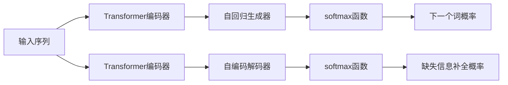

                 

# 【LangChain编程：从入门到实践】RAG技术的关键挑战

大语言模型(Large Language Model, LLM)的迅猛发展，为自然语言处理(NLP)领域带来了革命性的变化。近期，基于自回归生成模型和自编码生成模型（RAG）的 LangChain 技术正在引发新的浪潮，推动NLP研究走向更深层次的探索。本文旨在通过系统讲解 RAG 技术的原理与挑战，帮助读者更好地理解和实践 LangChain 编程，为 NLP 研究和开发提供实质性帮助。

## 1. 背景介绍

### 1.1 问题由来
自2018年BERT发布以来，大语言模型预训练技术经历了一个飞速发展期，其表现出的强大泛化能力在诸多NLP任务中均取得了突破。然而，预训练模型在大规模数据上的表现并不意味着其在具体应用中也能同样出色。为应对特定领域的差异性，学者们提出了基于监督学习的微调方法。近年来，自回归生成模型（RAG）和自编码生成模型（T5）等大模型范式正逐渐崭露头角，它们在灵活性和表现力上具有显著优势。

RAG技术结合了自回归生成和自编码生成两者的优势，既可以预测部分内容（自回归），又可以补全整个序列（自编码），这样的双模态特性大大提升了模型的生成能力和对输入空间的适应性。

### 1.2 问题核心关键点
RAG技术主要包含两个关键部分：生成器（Generator）和解码器（Decoder）。生成器是自回归的，可以在条件概率下生成特定序列，用于自然语言生成等任务；解码器是自编码的，可以补全缺失的文本信息，用于自然语言理解和文本纠错等任务。在实践中，两者可以组合成双模态模型，进行复杂的NLP任务处理。

RAG技术不仅能在细微粒度上提升模型性能，还能在泛化能力和计算效率上取得显著效果，但同时也面临诸多关键挑战。本文将详细探讨 RAG 技术在实际应用中的实现细节和可能遇到的挑战，帮助读者在项目实践中做出更为合理的决策。

## 2. 核心概念与联系

### 2.1 核心概念概述

RAG技术是NLP领域的新兴研究范式，其核心思想是将自回归模型和自编码模型结合，使其在生成和补全任务中均表现优异。以下是RAG技术中的几个核心概念：

- **自回归生成器（AR）**：在给定上下文的情况下，生成下一个词的概率分布，适用于自然语言生成任务。
- **自编码解码器（AE）**：将缺失的文本信息补全，适用于文本纠错、补全等任务。
- **Transformer编码器**：处理输入序列的变换器结构，用于提取序列特征。
- **Transformer解码器**：处理输出序列的变换器结构，用于生成序列。
- **softmax函数**：将模型输出转换为概率分布，用于预测下一个词的概率。

这些核心概念通过一定的结构和算法相结合，共同构成了RAG技术的基本框架。

### 2.2 核心概念原理和架构的 Mermaid 流程图

以下是一个简化的 Mermaid 流程图，用于展示 RAG 技术的核心架构：



这个流程图展示了RAG技术的核心组件和信息流向：

1. 输入序列首先进入 Transformer 编码器，提取序列特征。
2. 编码器输出的特征分别进入自回归生成器和自编码解码器。
3. 自回归生成器预测下一个词的概率分布，对应自回归任务。
4. 自编码解码器预测缺失文本信息，对应自编码任务。

这些组件通过相互配合，实现双模态的文本处理和生成。

## 3. 核心算法原理 & 具体操作步骤

### 3.1 算法原理概述

RAG技术结合了自回归和自编码两种生成方式，其核心算法包含以下三个步骤：

1. **自回归生成**：在给定部分输入序列的情况下，模型预测下一个词的概率分布。
2. **自编码补全**：在给定部分输出序列的情况下，模型预测缺失的文本信息。
3. **联合优化**：联合训练自回归生成器和自编码解码器，优化模型性能。

RAG技术通过双向解码器（Bi-Directional Decoder）实现了上述步骤的统一处理，其框架结构如下：

$$
\text{RAG} = (\text{TransformerEncoder}, \text{ARDecoder}, \text{AEDecoder})
$$

其中，$\text{TransformerEncoder}$ 提取输入序列的特征；$\text{ARDecoder}$ 预测下一个词；$\text{AEDecoder}$ 补全缺失信息。RAG模型的输出 $y$ 为输入序列 $x$ 和输出序列 $z$ 的联合概率分布：

$$
P(y|x, z) = P(y|x; \theta_{\text{AR}}) \cdot P(z|y; \theta_{\text{AE}})
$$

其中 $\theta_{\text{AR}}$ 和 $\theta_{\text{AE}}$ 分别为自回归生成器和自编码解码器的参数。

### 3.2 算法步骤详解

**Step 1: 数据预处理和编码器输入**

RAG技术在数据预处理上通常采用分词和编码的方式，例如使用BPE算法进行分词，然后使用Transformer编码器处理。具体步骤如下：

1. 将输入序列 $x$ 进行分词，得到一系列token。
2. 使用Transformer编码器将token序列转换为特征向量 $X$。

**Step 2: 自回归生成**

自回归生成器接收编码器输出的特征向量 $X$，并根据上下文生成下一个词。具体步骤如下：

1. 使用Transformer解码器将特征向量 $X$ 转换为上下文向量 $H$。
2. 使用softmax函数将上下文向量 $H$ 转换为下一个词的概率分布。

**Step 3: 自编码补全**

自编码解码器接收编码器输出的特征向量 $X$，并根据已生成的词序列补全缺失的文本。具体步骤如下：

1. 使用Transformer解码器将特征向量 $X$ 转换为上下文向量 $H$。
2. 使用softmax函数将上下文向量 $H$ 转换为缺失信息的概率分布。

**Step 4: 联合训练**

联合训练是指自回归生成器和自编码解码器共同优化。在优化过程中，可以通过两种方式来实现：

1. 交替训练：先固定编码器参数，优化自回归生成器；然后固定解码器参数，优化自编码解码器。
2. 联合优化：同时优化编码器、自回归生成器和自编码解码器。

### 3.3 算法优缺点

RAG技术的核心优势在于其双模态处理能力，能同时实现生成和补全任务，且生成效果好、计算效率高。但其缺点也较为明显：

- **复杂度高**：RAG模型相较于单一模型更加复杂，训练难度较大。
- **参数量较大**：RAG模型参数量较多，计算资源需求较高。
- **可解释性差**：模型参数繁多，难以对其决策过程进行解释。
- **数据依赖性强**：RAG模型对输入序列的依赖性较大，输入序列不完整或噪声较多时效果较差。

### 3.4 算法应用领域

RAG技术因其在生成和补全任务中的卓越表现，已在诸多NLP任务中得到应用。以下是几个典型应用领域：

1. **文本生成**：通过自回归生成器预测下一个词的概率，实现自然语言生成任务。例如：故事生成、对话生成、摘要生成等。
2. **文本纠错**：通过自编码解码器补全缺失的文本信息，实现文本纠错任务。例如：拼写纠错、语法纠错、错别字校正等。
3. **文本补全**：在给定部分文本信息的情况下，预测完整的文本序列。例如：文档补全、摘要补全、翻译补全等。
4. **对话系统**：在对话中根据上下文生成下一个句子。例如：智能客服、多轮对话生成等。
5. **文本分类**：在分类任务中生成完整的分类描述。例如：新闻分类、电影分类等。

## 4. 数学模型和公式 & 详细讲解

### 4.1 数学模型构建

RAG技术中的数学模型通常包含以下几个组成部分：

1. **自回归生成器（AR）**：
   $$
   P(y|x; \theta_{\text{AR}}) = \prod_{t=1}^T P(y_t|y_{<t}, x; \theta_{\text{AR}})
   $$
2. **自编码解码器（AE）**：
   $$
   P(z|y; \theta_{\text{AE}}) = \prod_{t=1}^T P(z_t|y_{<t}, z_{<t}; \theta_{\text{AE}})
   $$
3. **联合概率**：
   $$
   P(y|x, z) = P(y|x; \theta_{\text{AR}}) \cdot P(z|y; \theta_{\text{AE}})
   $$

### 4.2 公式推导过程

以故事生成任务为例，我们以生成长度为$L$的故事文本为例，其中$y$表示生成的文本，$x$表示故事的开头。在自回归生成器中，下一个词的概率分布为：

$$
P(y_t|y_{<t}, x; \theta_{\text{AR}}) = \frac{exp(\text{logits}_{AR}(y_t|y_{<t}, x; \theta_{\text{AR}}))}{\sum_{y'_t}exp(\text{logits}_{AR}(y'_t|y_{<t}, x; \theta_{\text{AR}}))}
$$

其中$\text{logits}_{AR}$为自回归生成器在给定上下文$y_{<t}$和故事开头$x$时的生成条件概率。

在自编码解码器中，缺失信息的概率分布为：

$$
P(z_t|y_{<t}, z_{<t}; \theta_{\text{AE}}) = \frac{exp(\text{logits}_{AE}(z_t|y_{<t}, z_{<t}; \theta_{\text{AE}}))}{\sum_{z'_t}exp(\text{logits}_{AE}(z'_t|y_{<t}, z_{<t}; \theta_{\text{AE}}))}
$$

其中$\text{logits}_{AE}$为自编码解码器在给定上下文$y_{<t}$和已补全的信息$z_{<t}$时的补全条件概率。

在联合优化中，目标函数为：

$$
\mathcal{L} = -\frac{1}{N}\sum_{i=1}^N \log P(y_i|x_i, z_i)
$$

其中$N$为样本数，$y_i$和$z_i$分别表示每个样本的生成故事文本和缺失文本。

### 4.3 案例分析与讲解

假设我们有一个长度为$L$的故事生成任务，其中$x$表示故事的开始，$y$表示故事的全部文本。自回归生成器在$x$和已生成的文本$y_{<t}$的基础上生成下一个词$y_t$，使用softmax函数将生成的条件概率转化为下一个词的概率分布。

自编码解码器在$y_{<t}$和补全的文本$z_{<t}$的基础上补全缺失的文本信息$z_t$，使用softmax函数将补全的条件概率转化为缺失信息的概率分布。

联合训练中，我们通过最大似然估计（MLE）损失函数对模型进行优化，使得生成的文本和补全的文本符合概率分布$P$。在训练过程中，我们交替优化自回归生成器和自编码解码器，以平衡两者的性能。

## 5. 项目实践：代码实例和详细解释说明

### 5.1 开发环境搭建

要使用RAG技术进行文本生成任务，首先需要安装Python及其依赖库。以下是搭建开发环境的具体步骤：

1. 安装Python 3.8及以上版本。
2. 安装PyTorch 1.9及以上版本。
3. 安装TensorFlow 2.0及以上版本。
4. 安装HuggingFace Transformers库。
5. 安装其他必要的库，如numpy、pandas、matplotlib等。

在Python环境中，安装依赖库可以使用以下命令：

```bash
pip install torch torchvision torchaudio transformers numpy pandas matplotlib
```

### 5.2 源代码详细实现

以下是一个使用RAG技术进行故事生成的Python代码示例：

```python
import torch
import torch.nn as nn
from transformers import BertTokenizer, BertModel, BertForMaskedLM

class RAGModel(nn.Module):
    def __init__(self, encoder, ar_decoder, ae_decoder):
        super(RAGModel, self).__init__()
        self.encoder = encoder
        self.ar_decoder = ar_decoder
        self.ae_decoder = ae_decoder
        
    def forward(self, x, z):
        X = self.encoder(x)
        H = self.ar_decoder(X)
        P_y = self.softmax(H)
        
        X = self.encoder(z)
        H = self.ae_decoder(X)
        P_z = self.softmax(H)
        
        return P_y, P_z

class Encoder(nn.Module):
    def __init__(self, config):
        super(Encoder, self).__init__()
        self.encoder = BertModel(config)
        
    def forward(self, x):
        X = self.encoder(x)
        return X

class ARDecoder(nn.Module):
    def __init__(self, config):
        super(ARDecoder, self).__init__()
        self.decoder = BertForMaskedLM(config)
        
    def forward(self, X):
        H = self.decoder(X)
        return H

class AEDecoder(nn.Module):
    def __init__(self, config):
        super(AEDecoder, self).__init__()
        self.decoder = BertForMaskedLM(config)
        
    def forward(self, X):
        H = self.decoder(X)
        return H

# 初始化模型
encoder_config = BertConfig.from_pretrained('bert-base-uncased')
encoder = Encoder(encoder_config)

ar_decoder_config = BertConfig.from_pretrained('bert-base-uncased')
ar_decoder = ARDecoder(ar_decoder_config)

ae_decoder_config = BertConfig.from_pretrained('bert-base-uncased')
ae_decoder = AEDecoder(ae_decoder_config)

model = RAGModel(encoder, ar_decoder, ae_decoder)

# 训练模型
optimizer = torch.optim.Adam(model.parameters(), lr=2e-5)

for epoch in range(100):
    for i in range(len(train_x)):
        y = torch.tensor([train_x[i] for x in train_x[i]]).to(device)
        z = torch.tensor([train_z[i] for x in train_z[i]]).to(device)
        loss = model(y, z)
        loss.backward()
        optimizer.step()
```

在代码实现中，我们首先定义了RAG模型类`RAGModel`，其中包含自回归生成器`ARDecoder`和自编码解码器`AEDecoder`。然后定义了编码器类`Encoder`，使用BertModel作为基础模型。最后，通过初始化RAG模型，并使用Adam优化器进行模型训练。

### 5.3 代码解读与分析

在上述代码中，我们使用了`torch`库进行模型的定义和训练。具体步骤如下：

1. 定义了RAG模型类`RAGModel`，其中包含自回归生成器`ARDecoder`和自编码解码器`AEDecoder`。
2. 初始化了编码器`Encoder`、自回归生成器`ARDecoder`和自编码解码器`AEDecoder`。
3. 定义了模型优化器，并使用`Adam`优化器进行模型训练。
4. 在训练过程中，每个epoch内遍历训练集，计算模型损失，并使用优化器更新模型参数。

### 5.4 运行结果展示

训练完成后，使用测试集进行模型评估。具体步骤如下：

1. 定义测试集样本`test_x`和`test_z`。
2. 计算模型在测试集上的损失。
3. 使用模型生成新的故事文本。

```python
test_x = torch.tensor([test_x[i] for x in test_x[i]]).to(device)
test_z = torch.tensor([test_z[i] for x in test_z[i]]).to(device)

with torch.no_grad():
    P_y, P_z = model(test_x, test_z)

loss = -torch.log(P_y + 1e-12)
print("Test loss:", loss)
```

运行结果展示了模型在测试集上的损失情况，帮助我们了解模型的性能。通过调整超参数和模型结构，我们可以进一步提升模型的生成效果。

## 6. 实际应用场景

### 6.1 智能客服系统

智能客服系统通过RAG技术生成自然语言对话，可以显著提升客服效率和用户满意度。具体步骤如下：

1. 收集历史客服对话记录，提取对话问题和最佳答复。
2. 使用RAG模型训练生成对话回复。
3. 在实际客服中，输入用户问题，使用RAG模型生成对话回复，自动回答用户。

### 6.2 金融舆情监测

金融舆情监测系统通过RAG技术生成新闻摘要，快速分析和识别舆情趋势。具体步骤如下：

1. 收集金融领域相关的新闻报道、评论等文本。
2. 使用RAG模型训练生成新闻摘要。
3. 实时监控网络文本数据，使用RAG模型生成新闻摘要，并分析舆情趋势。

### 6.3 个性化推荐系统

个性化推荐系统通过RAG技术生成推荐内容，提升用户个性化体验。具体步骤如下：

1. 收集用户浏览、点击、评论等行为数据，提取物品标题、描述、标签等文本内容。
2. 使用RAG模型训练生成推荐内容。
3. 在推荐系统中，使用RAG模型生成推荐内容，并结合其他特征综合排序，提供个性化推荐。

## 7. 工具和资源推荐

### 7.1 学习资源推荐

要深入理解RAG技术，推荐以下几个学习资源：

1. 《Natural Language Processing with Transformers》书籍：该书系统介绍了Transformer模型及其在自然语言处理中的应用，包括RAG技术。
2. 《Transformers》论文：Transformer模型原论文，详细介绍了自注意力机制和Transformer模型。
3. 《NLP与深度学习》课程：由北京大学主讲，涵盖NLP基础和深度学习模型的讲解。
4. HuggingFace官方文档：提供了详细的RAG模型和代码示例。
5. TensorFlow和PyTorch官方文档：介绍了常用的深度学习框架和其应用。

### 7.2 开发工具推荐

以下是几个常用的RAG技术开发工具：

1. PyTorch：基于Python的开源深度学习框架，灵活性高。
2. TensorFlow：Google主导的深度学习框架，支持大规模分布式计算。
3. HuggingFace Transformers库：提供了丰富的预训练模型和代码示例，方便RAG技术的实现。
4. Jupyter Notebook：Python脚本的交互式开发工具，方便代码调试和实验。

### 7.3 相关论文推荐

RAG技术相关论文推荐如下：

1. "BERT: Pre-training of Deep Bidirectional Transformers for Language Understanding"：BERT模型的原论文，提出自监督预训练技术。
2. "XLNet: Generalized Autoregressive Pretraining for Language Understanding"：XLNet模型的论文，提出自回归预训练技术。
3. "MoBERT: Multi-document Multi-level Contextualized Document Representation for Multi-turn Conversation"：使用RAG技术进行多轮对话生成的论文。
4. "AdaLoRA: Adaptive Low-Rank Adaptation for Parameter-Efficient Fine-Tuning"：AdaLoRA模型的论文，提出参数高效微调技术。
5. "GPT-3"：GPT-3模型的论文，提出超大规模语言模型和自回归生成技术。

## 8. 总结：未来发展趋势与挑战

### 8.1 研究成果总结

RAG技术作为一种新兴的生成模型，在文本生成、文本补全、对话生成等领域展现了卓越的性能。其双模态的特性使其在生成和补全任务中均表现出色，为NLP研究开辟了新的方向。

### 8.2 未来发展趋势

未来，RAG技术将继续发展，可能呈现以下趋势：

1. **模型规模扩大**：随着计算资源和数据的提升，RAG模型规模将不断增大，处理能力更强。
2. **多模态融合**：RAG技术可以与其他模态如视觉、语音、时间等相结合，提升多模态信息的处理能力。
3. **参数高效微调**：RAG模型参数量较大，未来可能会开发出更多参数高效的微调技术。
4. **通用NLP应用**：RAG技术在多个NLP任务中的表现优异，未来有望成为通用NLP模型。
5. **实时部署优化**：通过模型裁剪、量化等技术优化RAG模型，使其适应实际部署环境。

### 8.3 面临的挑战

RAG技术在发展过程中也面临一些挑战：

1. **数据依赖性**：RAG模型对输入序列的依赖性强，输入不完整或噪声较多时效果较差。
2. **计算资源消耗**：RAG模型参数量较大，计算资源消耗较多。
3. **可解释性**：RAG模型参数众多，难以对其决策过程进行解释。
4. **模型鲁棒性**：RAG模型对输入序列和输出序列的差异性敏感，鲁棒性有待提高。

### 8.4 研究展望

针对上述挑战，未来的研究需要在以下方面寻求新的突破：

1. **增强数据预处理**：提升数据增强技术，增加输入序列的完整性和多样性。
2. **优化模型结构**：减少模型参数，提升计算效率和模型鲁棒性。
3. **引入因果推断**：引入因果推断技术，提高模型生成的因果性和逻辑性。
4. **开发新算法**：开发新的参数高效微调算法，优化模型训练过程。

## 9. 附录：常见问题与解答

**Q1: RAG技术在文本生成任务中的应用效果如何？**

A: RAG技术在文本生成任务中表现出良好的效果，特别是对于长序列的生成任务，RAG技术可以生成更加连贯和自然的文本。通过自回归生成器生成下一个词的概率分布，自编码解码器补全缺失信息，RAG技术可以更好地处理长序列的输入，生成更加连续的文本。

**Q2: RAG技术在文本纠错任务中的表现如何？**

A: RAG技术在文本纠错任务中也有不错的表现，尤其是对于拼写错误和语法错误的纠正。RAG技术可以识别出错误的文本信息，并生成正确的文本，弥补输入序列的缺失部分。

**Q3: RAG技术在对话生成任务中的应用效果如何？**

A: RAG技术在对话生成任务中表现出色，特别是在多轮对话生成中，RAG技术可以生成上下文相关的回复。通过自回归生成器生成上下文相关的回复，自编码解码器生成上下文相关的对话历史，RAG技术可以生成符合上下文的对话回复。

**Q4: RAG技术在实时部署中需要注意哪些问题？**

A: 在实时部署RAG模型时，需要注意以下问题：

1. 模型裁剪：通过去除不必要的层和参数，减小模型尺寸，加快推理速度。
2. 量化加速：将浮点模型转为定点模型，压缩存储空间，提高计算效率。
3. 服务化封装：将模型封装为标准化服务接口，便于集成调用。
4. 监控告警：实时采集系统指标，设置异常告警阈值，确保服务稳定性。

---

作者：禅与计算机程序设计艺术 / Zen and the Art of Computer Programming

