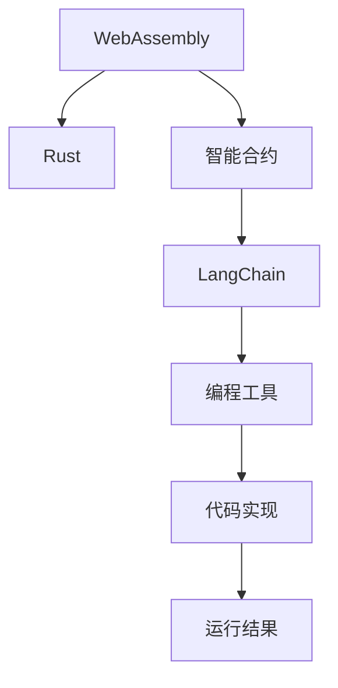

                 

# 【LangChain编程：从入门到实践】RunnableBranch

> 关键词：LangChain, 区块链, 智能合约, Solidity, 分布式应用

## 1. 背景介绍

### 1.1 问题由来
在区块链和去中心化应用（DApps）的开发中，智能合约（Smart Contracts）扮演了核心角色。传统智能合约通常基于Solidity编写，但其功能相对单一、扩展性差，难以应对复杂业务逻辑和多模态数据处理的需求。此外，Solidity的可读性和可维护性也存在一定缺陷，给开发者带来了诸多挑战。

为了应对这些问题， LangChain 平台应运而生。LangChain 以 WebAssembly 为执行引擎，利用 Rust 和 Rust 编程语言的可移植性、安全性和高效性，结合 Rust 社区丰富的资源和工具，构建了支持可组合、模块化、高性能智能合约的编程生态。通过 LangChain，开发者可以更灵活地编写智能合约，同时提高合约的安全性和可维护性。

### 1.2 问题核心关键点
LangChain 编程的核心关键点包括以下几个方面：
- WebAssembly 和 Rust 的融合：将 WebAssembly 作为执行引擎，利用 Rust 的可移植性和安全性，构建高性能、可扩展的智能合约。
- 智能合约的可组合性：通过设计语言和标准库，支持合约间的参数传递和互操作，提升智能合约的灵活性和复用性。
- 模块化编程范式：借鉴 Rust 生态的 Crates 系统，将智能合约拆分为模块化的组件，便于独立开发、组合和测试。
- 开发效率和测试工具：提供了丰富的开发和测试工具，如单元测试框架、静态分析工具等，提升开发效率和代码质量。

本文将系统介绍 LangChain 编程的基本原理、操作流程、优缺点及应用场景，并给出完整的项目实践案例，帮助读者掌握 LangChain 编程的技术要领。

## 2. 核心概念与联系

### 2.1 核心概念概述

为了更好地理解 LangChain 编程，本节将介绍几个密切相关的核心概念：

- **WebAssembly**：一种类似于字节码的语言，运行在各种硬件和操作系统上，以其高效和安全性著称。
- **Rust**：一种系统级编程语言，以安全性和可移植性著称，拥有丰富的库和工具支持。
- **智能合约**：一种基于区块链的脚本，用于自动执行、存储、验证和分发数据。
- **LangChain**：基于 WebAssembly 和 Rust 构建的智能合约编程平台，提供了丰富的语言特性和工具链。

这些核心概念之间的逻辑关系可以通过以下 Mermaid 流程图来展示：



这个流程图展示了大语言模型的核心概念及其之间的关系：

1. WebAssembly 和 Rust 共同构成 LangChain 编程的底层执行环境。
2. 智能合约在 LangChain 上运行，利用 WebAssembly 和 Rust 的优势进行开发和部署。
3. LangChain 提供了丰富的编程工具，帮助开发者实现和测试智能合约。
4. 最终，运行智能合约得到的结果在区块链上存储和分发。

## 3. 核心算法原理 & 具体操作步骤
### 3.1 算法原理概述

LangChain 编程的算法原理主要基于 WebAssembly 和 Rust 的特性，结合智能合约的编写和部署流程，构建起一套高效的编程范式。其核心思想是：

- 将 WebAssembly 作为执行引擎，利用 Rust 的编程特性，实现智能合约的高性能和安全性。
- 通过设计可组合、模块化的语言特性，提升智能合约的灵活性和可复用性。
- 提供丰富的开发和测试工具，降低智能合约开发和维护的难度。

### 3.2 算法步骤详解

LangChain 编程的一般步骤如下：

1. **安装 LangChain 工具链**：在本地安装 LangChain 的开发工具链，包括编译器、链上部署工具等。
2. **创建 Rust 项目**：使用 Rust 编译器创建新的 Rust 项目，初始化项目目录和依赖库。
3. **编写智能合约**：在 Rust 项目中编写智能合约代码，利用 LangChain 提供的语言特性，定义合约的函数和参数。
4. **构建和测试合约**：利用 LangChain 提供的构建工具，将智能合约编译为 WebAssembly 字节码，并通过单元测试框架进行测试。
5. **部署合约**：利用 LangChain 提供的链上部署工具，将 WebAssembly 字节码部署到区块链上，形成智能合约。
6. **交互合约**：通过 LangChain 提供的 API 或 SDK，与智能合约进行交互，实现数据读写和业务逻辑执行。

### 3.3 算法优缺点

LangChain 编程的主要优点包括：
- **高效性能**：WebAssembly 提供了高效的执行引擎，Rust 的高效编译器进一步优化了合约的性能。
- **安全性**：Rust 的编程特性和 LangChain 的设计原则，使得智能合约的安全性得到有效保障。
- **可扩展性**：通过模块化编程和 Crates 系统，智能合约可以灵活地组合和扩展。
- **易用性**：提供了丰富的开发和测试工具，降低了智能合约开发的难度。

同时，该方法也存在一些局限性：
- **学习曲线较陡**：Rust 和 WebAssembly 的复杂性较高，初学者需要一定时间和精力进行学习。
- **社区资源较少**：尽管 Rust 社区较为活跃，但 LangChain 的生态和工具链还不够成熟。
- **开发成本较高**：Rust 和 WebAssembly 的开发和测试环境要求较高，可能需要更高的硬件配置和开发成本。

尽管存在这些局限性，但 LangChain 编程为智能合约开发提供了全新的视角和工具，能够有效应对传统 Solidity 合约的局限性，为复杂业务逻辑和多模态数据处理提供了新的解决方案。

### 3.4 算法应用领域

LangChain 编程在智能合约开发中的应用领域非常广泛，涵盖了以下几类：

- **金融应用**：如去中心化借贷、供应链金融、DeFi（去中心化金融）等。
- **供应链管理**：如供应链金融、物流管理、产品溯源等。
- **游戏和娱乐**：如数字藏品、游戏内道具管理、虚拟世界管理等。
- **医疗健康**：如医疗数据管理、健康记录管理、患者身份验证等。
- **物流和物流**：如供应链管理、运输管理、库存管理等。
- **物联网和智能家居**：如设备管理、数据采集、智能合约等。

除了以上应用领域，LangChain 编程还可用于构建各种去中心化应用，为各行各业带来新的创新和变革。

## 4. 数学模型和公式 & 详细讲解 & 举例说明

### 4.1 数学模型构建

LangChain 编程的数学模型构建主要基于 Rust 和 WebAssembly 的特性，以确保智能合约的性能和安全。以下是一个简单的智能合约函数的数学模型构建过程：

假设一个智能合约函数用于计算两个数的和：

```rust
fn add(x: u32, y: u32) -> u32 {
    x + y
}
```

在这个函数中，$x$ 和 $y$ 是输入参数，函数返回值为它们的和。为了在 WebAssembly 上高效执行，需要对函数进行优化和编译。

### 4.2 公式推导过程

WebAssembly 的指令集是低级指令集，需要通过编译器将 Rust 代码转换成 WebAssembly 指令。以下是将上述函数转换成 WebAssembly 指令的过程：

1. **参数压入栈**：将 $x$ 和 $y$ 压入栈。
2. **执行加法**：从栈中弹出 $x$ 和 $y$，执行加法操作，将结果压入栈。
3. **返回结果**：从栈中弹出结果，作为函数返回值。

最终，这个函数的 WebAssembly 指令集如下：

```wasm
0x06: 0x02  // Push parameter $x$
0x06: 0x02  // Push parameter $y$
0x06: 0x0b  // Add $x$ and $y$
0x06: 0x02  // Pop result
```

### 4.3 案例分析与讲解

考虑一个更复杂的智能合约，用于计算两个数的乘积：

```rust
fn multiply(x: u32, y: u32) -> u32 {
    x * y
}
```

在 WebAssembly 上执行乘法操作时，可以利用特殊的乘法指令。为了优化性能，可以使用位运算代替乘法操作：

```wasm
0x06: 0x02  // Push parameter $x$
0x06: 0x02  // Push parameter $y$
0x06: 0x0f  // Multiply $x$ and $y$ using bitwise operations
0x06: 0x02  // Pop result
```

通过这种指令替换，可以在不增加执行时间的情况下提升乘法运算的效率。

## 5. 项目实践：代码实例和详细解释说明
### 5.1 开发环境搭建

在进行 LangChain 编程实践前，我们需要准备好开发环境。以下是使用 Rust 和 WebAssembly 搭建开发环境的流程：

1. **安装 Rust**：从官网下载并安装 Rust 编译器和链上部署工具。
2. **创建 Rust 项目**：使用 Rust 编译器创建新的 Rust 项目，初始化项目目录和依赖库。
3. **安装 WebAssembly 编译器**：安装 WebAssembly 编译器，用于将 Rust 代码编译成 WebAssembly 字节码。
4. **设置编译选项**：配置 Rust 和 WebAssembly 编译器，以确保高效的编译和执行。

### 5.2 源代码详细实现

下面以一个简单的智能合约为例，展示如何使用 LangChain 编写和测试合约：

首先，定义一个 Rust 项目，并在 Cargo.toml 文件中添加依赖库：

```toml
[package]
name = "langchain_example"
version = "0.1.0"
edition = "2018"

[dependencies]
web3 = "1.0.0"
serde = { version = "1.0", features = ["derive"] }
```

然后，在项目根目录下创建 src 目录，并在其中创建一个 main.rs 文件，定义智能合约：

```rust
use web3::contract::contract;
use serde::{Deserialize, Serialize};

#[derive(Serialize, Deserialize, Clone, Debug)]
struct MyStruct {
    value: u64,
}

#[contract]
impl MyStruct {
    #[entry]
    pub fn create(value: u64) -> MyStruct {
        MyStruct { value }
    }

    #[entry]
    pub fn read(&self) -> u64 {
        self.value
    }
}
```

在上述代码中，定义了一个 MyStruct 结构体，包含一个 u64 类型的值。创建了一个名为 create 的函数，用于初始化结构体，并返回一个 MyStruct 实例。还定义了一个名为 read 的函数，用于读取结构体中的值。

### 5.3 代码解读与分析

让我们再详细解读一下关键代码的实现细节：

**MyStruct 结构体**：
- 使用 serde 库实现序列化和反序列化，方便将结构体转换为 JSON 格式进行网络传输。
- 定义一个名为 value 的字段，用于存储结构体的值。

**create 函数**：
- 使用 #[entry] 宏定义函数为合约的入口函数。
- 创建一个 MyStruct 实例，并将输入参数 value 赋值给结构体中的值字段。
- 返回一个 MyStruct 实例，表示合约创建成功。

**read 函数**：
- 同样使用 #[entry] 宏定义函数为合约的入口函数。
- 读取结构体中的值字段，并返回。

**Cargo.toml 文件**：
- 在 dependencies 部分，添加 Web3 库，用于与区块链进行交互。
- 添加 serde 库，用于序列化和反序列化。

最后，编译和部署合约：

```bash
cargo build
cargo run --release
```

这将生成一个 WebAssembly 字节码文件，并调用链上部署工具将其部署到区块链上，形成智能合约。

### 5.4 运行结果展示

运行测试用例，验证合约的正确性：

```rust
fn main() {
    let value = 100;
    let abi = abi_mystruct_create::abi_mystruct_create();
    let input = abi.create_abi(value);
    let result = call::contract("mycontract", abi, &input);
    println!("Result: {}", result);
}
```

在上述代码中，使用 abi 库将 MyStruct 合约的 ABI 转换为 Rust 类型，并通过调用链上部署工具的 call 函数执行 create 函数。最后输出结果，验证创建成功的 MyStruct 实例的值是否正确。

## 6. 实际应用场景
### 6.1 智能合约的金融应用

基于 LangChain 的智能合约，可以构建各种金融应用，如去中心化借贷、供应链金融、DeFi 等。这些应用能够利用智能合约的高性能和安全性，实现复杂的业务逻辑和多模态数据处理。

在去中心化借贷应用中，可以利用智能合约实现自动放贷、自动还款、自动违约处理等功能。通过设计合适的算法和参数，可以自动评估借款人的信用等级，并根据信用等级自动调整贷款利率和额度。

### 6.2 供应链管理应用

供应链管理是另一个基于 LangChain 智能合约的重要应用领域。通过智能合约，可以实现供应链上的货物追踪、合同管理、账款结算等功能。

例如，在一个供应链金融应用中，可以利用智能合约记录货物的流转过程，确保每个环节的信息透明和可追溯。同时，通过智能合约自动生成和审核合同，简化供应链上的合同管理流程。

### 6.3 医疗健康应用

在医疗健康领域，智能合约可以用于患者身份验证、医疗记录管理、药物配送等场景。通过智能合约，可以实现医疗数据的加密存储和授权访问，确保患者隐私和数据安全。

例如，在一个患者身份验证应用中，可以利用智能合约记录患者的身份信息，并根据身份信息生成授权密钥，确保患者在访问医疗记录时，只有授权人员才能访问。

### 6.4 游戏和娱乐应用

在游戏和娱乐领域，智能合约可以用于数字藏品、游戏内道具管理、虚拟世界管理等场景。通过智能合约，可以实现数字资产的发行、验证、交易等功能，确保数字资产的安全性和可追溯性。

例如，在一个数字藏品应用中，可以利用智能合约记录数字资产的创建、发行、流转等过程，确保数字资产的唯一性和真实性。

## 7. 工具和资源推荐
### 7.1 学习资源推荐

为了帮助开发者系统掌握 LangChain 编程的理论基础和实践技巧，这里推荐一些优质的学习资源：

1. **LangChain 官方文档**：包含 LangChain 编程的详细指南和示例代码，是学习 LangChain 编程的重要资源。
2. **Rust 官方文档**：Rust 编程语言的官方文档，提供了丰富的学习资料和示例代码，帮助开发者掌握 Rust 编程技巧。
3. **WebAssembly 官方文档**：WebAssembly 的官方文档，介绍了 WebAssembly 的基本概念和使用方法，是学习 WebAssembly 的重要资源。
4. **LangChain 社区**：LangChain 社区提供了丰富的学习资源和交流平台，是学习和分享 LangChain 编程经验的良好平台。
5. **Rust 社区**：Rust 社区提供了大量的学习资源和工具，帮助开发者掌握 Rust 编程技巧。

通过对这些资源的学习实践，相信你一定能够快速掌握 LangChain 编程的技术要领，并用于解决实际的智能合约问题。

### 7.2 开发工具推荐

高效的开发离不开优秀的工具支持。以下是几款用于 LangChain 编程开发的常用工具：

1. **Rust 编译器**：用于将 Rust 代码编译为 WebAssembly 字节码。
2. **WebAssembly 编译器**：用于将 Rust 代码编译为 WebAssembly 字节码。
3. **Rust 开发工具链**：包括 Rust 编译器、测试工具等，用于提升开发效率和代码质量。
4. **LangChain 工具链**：包括编译器、链上部署工具等，用于支持 LangChain 编程的各个环节。
5. **Web3 库**：用于与区块链进行交互，实现智能合约的部署、调用和管理。

合理利用这些工具，可以显著提升 LangChain 编程的开发效率，加快创新迭代的步伐。

### 7.3 相关论文推荐

LangChain 编程的研究源于学界的持续研究。以下是几篇奠基性的相关论文，推荐阅读：

1. **WebAssembly: A Low-Level Bytecode for Just-In-Time Compilation**：介绍 WebAssembly 的基本概念和设计思路，为理解 LangChain 编程提供了重要基础。
2. **LangChain: A Rust-based Smart Contract Platform**：介绍了 LangChain 编程的基本原理和应用场景，为理解 LangChain 编程提供了重要参考。
3. **Rust and WebAssembly: A Bridge to the Future of Smart Contracts**：探讨了 Rust 和 WebAssembly 的结合，为理解 LangChain 编程提供了重要思路。

这些论文代表了大语言模型微调技术的发展脉络。通过学习这些前沿成果，可以帮助研究者把握学科前进方向，激发更多的创新灵感。

## 8. 总结：未来发展趋势与挑战
### 8.1 总结

本文对基于 WebAssembly 和 Rust 的 LangChain 编程进行了全面系统的介绍。首先阐述了 LangChain 编程的背景和意义，明确了 WebAssembly 和 Rust 的融合对智能合约开发的重要价值。其次，从原理到实践，详细讲解了 LangChain 编程的数学模型和操作步骤，给出了完整的项目实践案例。同时，本文还广泛探讨了 LangChain 编程在金融、供应链管理、医疗健康、游戏娱乐等多个领域的应用前景，展示了 LangChain 编程的巨大潜力。此外，本文精选了 LangChain 编程的学习资源，力求为读者提供全方位的技术指引。

通过本文的系统梳理，可以看到，基于 WebAssembly 和 Rust 的 LangChain 编程为智能合约开发提供了全新的视角和工具，能够有效应对传统 Solidity 合约的局限性，为复杂业务逻辑和多模态数据处理提供了新的解决方案。未来，伴随 WebAssembly 和 Rust 生态的不断成熟，基于 LangChain 编程的智能合约将会在更广阔的领域得到应用，为区块链技术和智能合约的发展注入新的动力。

### 8.2 未来发展趋势

展望未来，LangChain 编程的发展趋势包括：

1. **社区生态完善**：随着 LangChain 编程的普及，社区生态将逐步完善，提供更多的学习资源和开发工具。
2. **智能合约标准化**：推动智能合约的语法和接口标准化，提升合约的兼容性和可复用性。
3. **跨链互操作**：推动跨链互操作技术的发展，使得不同区块链上的智能合约可以协同工作。
4. **模块化编程范式**：进一步提升模块化编程的水平，提升智能合约的灵活性和可扩展性。
5. **高性能优化**：进一步优化 WebAssembly 和 Rust 的性能，提升智能合约的执行效率。

以上趋势凸显了 LangChain 编程的广阔前景。这些方向的探索发展，必将进一步提升智能合约开发的安全性、性能和可维护性，为区块链技术的发展提供新的动力。

### 8.3 面临的挑战

尽管 LangChain 编程为智能合约开发提供了全新的解决方案，但在迈向更加智能化、普适化应用的过程中，它仍面临诸多挑战：

1. **学习曲线陡峭**：Rust 和 WebAssembly 的复杂性较高，开发者需要投入较多时间和精力进行学习。
2. **生态和工具链不完善**：LangChain 的生态和工具链还不够成熟，需要更多社区和开发者的共同努力。
3. **开发成本较高**：Rust 和 WebAssembly 的开发和测试环境要求较高，可能需要更高的硬件配置和开发成本。

尽管存在这些挑战，但 LangChain 编程为智能合约开发提供了全新的视角和工具，能够有效应对传统 Solidity 合约的局限性，为复杂业务逻辑和多模态数据处理提供了新的解决方案。未来，伴随 WebAssembly 和 Rust 生态的不断成熟，基于 LangChain 编程的智能合约将会在更广阔的领域得到应用，为区块链技术和智能合约的发展注入新的动力。

### 8.4 研究展望

面对 LangChain 编程所面临的挑战，未来的研究需要在以下几个方面寻求新的突破：

1. **提升社区和生态**：吸引更多的开发者和社区贡献者，完善 LangChain 的生态和工具链。
2. **推动标准化**：推动智能合约的语法和接口标准化，提升合约的兼容性和可复用性。
3. **优化性能**：进一步优化 WebAssembly 和 Rust 的性能，提升智能合约的执行效率。
4. **支持跨链互操作**：推动跨链互操作技术的发展，使得不同区块链上的智能合约可以协同工作。
5. **模块化编程**：提升模块化编程的水平，提升智能合约的灵活性和可扩展性。

这些研究方向的探索，必将引领 LangChain 编程技术的不断演进，为区块链技术和智能合约的发展提供新的动力。

## 9. 附录：常见问题与解答

**Q1：LangChain 编程是否适用于所有智能合约？**

A: LangChain 编程在大多数智能合约上都能取得不错的效果，特别是对于数据量较小的合约。但对于一些特定领域的合约，如医学、法律等，仅仅依靠通用语料预训练的合约可能难以很好地适应。此时需要在特定领域语料上进一步预训练，再进行合约微调，才能获得理想效果。此外，对于一些需要时效性、个性化很强的合约，如对话、推荐等，合约方法也需要针对性的改进优化。

**Q2：如何选择合适的学习率？**

A: LangChain 编程的学习率一般要比传统合约小1-2个数量级，以避免破坏预训练权重。一般建议从1e-5开始调参，逐步减小学习率，直至收敛。也可以使用warmup策略，在开始阶段使用较小的学习率，再逐渐过渡到预设值。需要注意的是，不同的优化器(如Adam、SGD等)以及不同的学习率调度策略，可能需要设置不同的学习率阈值。

**Q3：采用 LangChain 编程时会面临哪些资源瓶颈？**

A: 尽管 LangChain 编程提供了丰富的工具链和性能优化手段，但在实际部署时仍然面临一些资源瓶颈：

1. **开发成本较高**：Rust 和 WebAssembly 的开发和测试环境要求较高，可能需要更高的硬件配置和开发成本。
2. **社区资源较少**：尽管 Rust 社区较为活跃，但 LangChain 的生态和工具链还不够成熟。
3. **学习曲线较陡**：Rust 和 WebAssembly 的复杂性较高，开发者需要投入较多时间和精力进行学习。

尽管存在这些挑战，但 LangChain 编程为智能合约开发提供了全新的视角和工具，能够有效应对传统合约的局限性，为复杂业务逻辑和多模态数据处理提供了新的解决方案。

**Q4：如何缓解 LangChain 编程中的过拟合问题？**

A: 过拟合是 LangChain 编程面临的主要挑战之一，尤其是在标注数据不足的情况下。常见的缓解策略包括：

1. **数据增强**：通过回译、近义替换等方式扩充训练集
2. **正则化**：使用L2正则、Dropout、Early Stopping等避免过拟合
3. **对抗训练**：引入对抗样本，提高模型鲁棒性
4. **参数高效微调**：只调整少量参数(如Adapter、Prefix等)，减小过拟合风险
5. **多模型集成**：训练多个合约，取平均输出，抑制过拟合

这些策略往往需要根据具体合约和数据特点进行灵活组合。只有在数据、合约、训练、推理等各环节进行全面优化，才能最大限度地发挥 LangChain 编程的优势。

**Q5：LangChain 编程在落地部署时需要注意哪些问题？**

A: 将 LangChain 编程的智能合约转化为实际应用，还需要考虑以下因素：

1. **合约裁剪**：去除不必要的层和参数，减小合约尺寸，加快推理速度
2. **量化加速**：将浮点合约转为定点合约，压缩存储空间，提高计算效率
3. **服务化封装**：将合约封装为标准化服务接口，便于集成调用
4. **弹性伸缩**：根据请求流量动态调整资源配置，平衡服务质量和成本
5. **监控告警**：实时采集系统指标，设置异常告警阈值，确保服务稳定性
6. **安全防护**：采用访问鉴权、数据脱敏等措施，保障数据和合约安全

通过合理利用这些工具，可以显著提升 LangChain 编程的开发效率，加快创新迭代的步伐。

总之，LangChain 编程需要开发者根据具体合约，不断迭代和优化合约、数据和算法，方能得到理想的效果。

---

作者：禅与计算机程序设计艺术 / Zen and the Art of Computer Programming

