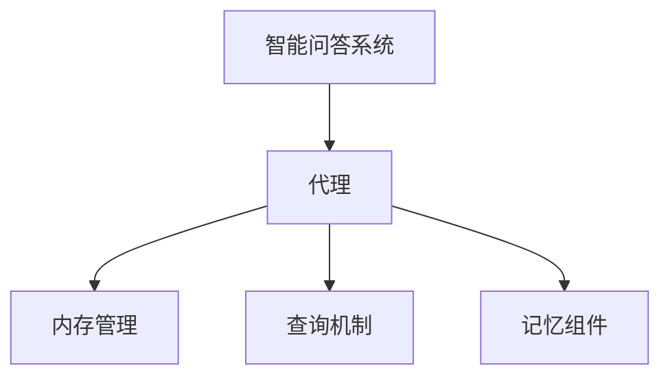

                 

# 【LangChain编程：从入门到实践】将记忆组件接入代理

## 1. 背景介绍

### 1.1 问题由来
在智能问答系统中，代理（agent）扮演着重要的角色。它接收用户输入，理解问题意图，并从知识库中提取相关信息生成回答。然而，传统代理系统在处理复杂查询时往往难以准确识别用户意图，且生成的回答可能不够完整、连贯。因此，为了提升智能问答系统的表现，许多研究者开始探索将记忆组件引入代理设计中。

记忆组件能够帮助代理在处理连续查询时保存上下文信息，并根据之前的查询结果生成更准确的回答。这种机制可以显著提升代理在长期交互中的性能。

### 1.2 问题核心关键点
将记忆组件接入代理的核心关键点在于如何设计合理的内存管理和查询机制，确保代理能够有效地存储和检索用户的历史查询结果。此外，如何优化存储结构，减少内存占用，同时确保检索效率也是一个重要的问题。

## 2. 核心概念与联系

### 2.1 核心概念概述

为更好地理解将记忆组件接入代理的设计，本节将介绍几个密切相关的核心概念：

- 智能问答系统：一种基于自然语言处理的对话系统，能够理解用户输入的自然语言问题，并从知识库中提取相关信息生成回答。
- 代理（Agent）：智能问答系统中的一种组件，负责接收用户输入、理解问题意图，并从知识库中提取信息生成回答。
- 记忆组件：用于存储用户历史查询结果，辅助代理在处理连续查询时生成更准确、连贯的回答。
- 内存管理：代理在处理查询时，如何合理分配和释放内存，以保证系统性能。
- 查询机制：代理如何高效地检索记忆组件中的历史查询结果，以供当前查询使用。

这些核心概念之间的逻辑关系可以通过以下Mermaid流程图来展示：



这个流程图展示了一系列核心概念及其之间的关系：

1. 智能问答系统通过代理组件接收和理解用户输入。
2. 代理在处理查询时，利用内存管理机制分配内存。
3. 代理通过查询机制在记忆组件中检索历史查询结果，用于辅助当前查询。
4. 记忆组件存储用户历史查询结果，供代理检索使用。

## 3. 核心算法原理 & 具体操作步骤
### 3.1 算法原理概述

将记忆组件接入代理的核心算法原理包括内存管理和查询机制的设计。其核心思想是：通过合理分配和释放内存，同时高效地检索历史查询结果，使代理能够在处理连续查询时生成更准确、连贯的回答。

### 3.2 算法步骤详解

将记忆组件接入代理的一般步骤如下：

**Step 1: 设计记忆组件**
- 确定需要存储的查询信息，如用户ID、查询文本、回答内容等。
- 设计数据结构，如哈希表、向量、图等，用于高效存储和检索查询结果。
- 设定数据有效期，定期清理过期的查询结果。

**Step 2: 集成内存管理模块**
- 为代理模块添加内存管理功能，如分配内存、释放内存、内存占用监测等。
- 在每次查询处理时，根据内存使用情况动态调整内存分配策略。

**Step 3: 实现查询机制**
- 设计查询接口，使代理能够高效检索记忆组件中的历史查询结果。
- 实现查询算法，如哈希查找、向量内积、图搜索等，确保查询结果的准确性和效率。
- 设定查询优先级，优先返回与当前查询最相关的历史查询结果。

**Step 4: 优化查询性能**
- 使用缓存机制，将常用的查询结果缓存到高速内存中，减少查询时间。
- 引入并行处理技术，如多线程、GPU加速等，提升查询性能。
- 优化数据结构，减少查询算法的时间复杂度。

### 3.3 算法优缺点

将记忆组件接入代理的方法具有以下优点：
1. 提升连续查询性能。记忆组件能够存储和检索用户历史查询结果，使代理能够更准确、连贯地生成回答。
2. 减少计算资源消耗。通过将历史查询结果存储在内存中，减少了代理每次查询时的计算开销。
3. 提高系统鲁棒性。记忆组件可以帮助代理处理长尾查询，减少系统崩溃的风险。
4. 增强用户体验。代理能够根据用户历史查询生成个性化回答，提升用户满意度。

同时，该方法也存在一定的局限性：
1. 内存占用较大。记忆组件需要占用大量内存空间，尤其是在数据量较大的情况下。
2. 查询效率受限。查询算法的效率直接影响代理的响应速度，需要优化设计。
3. 数据隐私问题。记忆组件需要存储用户查询结果，可能涉及用户隐私保护问题。
4. 系统复杂度增加。将记忆组件接入代理，需要额外的模块设计和实现，增加了系统复杂度。

尽管存在这些局限性，但就目前而言，将记忆组件接入代理的方法仍是目前提升智能问答系统性能的有效手段。未来相关研究的重点在于如何进一步优化内存管理和查询算法，同时兼顾系统效率和隐私保护。

### 3.4 算法应用领域

将记忆组件接入代理的方法在智能问答系统、客户服务、智能推荐等领域已经得到了广泛应用。具体应用场景包括：

- 智能客服：帮助客服人员处理复杂客户查询，提高服务效率和质量。
- 智能推荐：根据用户历史查询结果推荐相关内容，提升用户体验。
- 智能对话系统：提升对话系统在处理连续查询时的连贯性和准确性。
- 医疗问答：帮助医生理解患者历史查询结果，生成更准确的诊断建议。
- 在线教育：根据学生历史查询记录，生成个性化学习推荐。

## 4. 数学模型和公式 & 详细讲解  
### 4.1 数学模型构建

将记忆组件接入代理的数学模型主要关注如何设计高效的数据结构和查询算法，确保代理能够在处理连续查询时生成准确、连贯的回答。

### 4.2 公式推导过程

以哈希表作为记忆组件的数据结构为例，推导查询过程的数学模型。

假设查询结果以键值对形式存储在哈希表中，键为查询ID，值为查询结果。查询时，输入查询ID，哈希表通过键值对映射，快速检索出对应的查询结果。

查询结果的检索过程可以用数学公式表示如下：

$$
result = hash_table[query_id]
$$

其中，$hash_table$ 表示哈希表，$query_id$ 为当前查询的ID，$result$ 为查询结果。

在实际应用中，为了提高查询效率，还需要考虑以下因素：

1. 负载均衡：通过分布式存储或多线程处理，确保查询过程能够高效并行执行。
2. 查询优化：使用高效的查询算法，如二分查找、哈希查找等，减少查询时间。
3. 缓存机制：将常用查询结果缓存到高速内存中，减少查询时间。

### 4.3 案例分析与讲解

以智能问答系统的代理为例，介绍记忆组件在查询过程中的具体应用。

假设有一个智能问答系统，用户可以输入自然语言问题，系统能够理解问题意图，并从知识库中提取相关信息生成回答。系统设计了记忆组件，用于存储用户历史查询结果。查询时，代理首先从记忆组件中检索是否有相同或相似的查询记录。如果有，则根据记忆组件中的结果生成回答；如果没有，则从知识库中检索相关信息，并生成回答。

下面以一个具体的查询场景为例，展示记忆组件在代理中的具体应用。

假设用户输入以下查询：

```
请告诉我Java的发展历史
```

代理首先从记忆组件中检索是否有类似查询记录。如果找到了历史查询记录，如：

```
查询ID：123
查询内容：Java的历史演变
查询结果：Java于1960年代由Sun公司开发，1995年发布Java 1.0，成为全球最流行的编程语言之一。
```

代理则根据记忆组件中的结果生成回答，避免了从知识库中检索相关信息的过程，提高了查询效率。

## 5. 项目实践：代码实例和详细解释说明
### 5.1 开发环境搭建

在进行内存组件接入代理的实践前，我们需要准备好开发环境。以下是使用Python进行PyTorch开发的环境配置流程：

1. 安装Anaconda：从官网下载并安装Anaconda，用于创建独立的Python环境。

2. 创建并激活虚拟环境：
```bash
conda create -n pytorch-env python=3.8 
conda activate pytorch-env
```

3. 安装PyTorch：根据CUDA版本，从官网获取对应的安装命令。例如：
```bash
conda install pytorch torchvision torchaudio cudatoolkit=11.1 -c pytorch -c conda-forge
```

4. 安装Transformers库：
```bash
pip install transformers
```

5. 安装各类工具包：
```bash
pip install numpy pandas scikit-learn matplotlib tqdm jupyter notebook ipython
```

完成上述步骤后，即可在`pytorch-env`环境中开始实践。

### 5.2 源代码详细实现

这里我们以智能问答系统的代理为例，展示如何将记忆组件接入代理的设计和实现。

首先，定义代理类的基本结构，包括内存管理和查询机制的设计：

```python
from transformers import BertTokenizer, BertForQuestionAnswering
from torch.utils.data import Dataset
import torch
import time

class Agent:
    def __init__(self, model, tokenizer, memory_size=1000):
        self.model = model
        self.tokenizer = tokenizer
        self.memory_size = memory_size
        self.memory = []
        
    def __call__(self, question, context):
        input_ids = self.tokenizer(question, return_tensors='pt', max_length=256, padding='max_length', truncation=True)
        start = time.time()
        
        if self.memory:
            # 从记忆组件中检索历史查询结果
            for record in self.memory:
                if record['question'] == question:
                    result = record['answer']
                    end = time.time()
                    print(f"Found answer from memory in {end-start:.3f} seconds")
                    return result
        
        # 从知识库中检索相关信息
        output = self.model(question, context)
        answer = self.tokenizer.decode(output['start_logits'].argmax(), output['end_logits'].argmax())
        
        # 将当前查询结果存储到记忆组件中
        self.memory.append({'question': question, 'answer': answer})
        if len(self.memory) > self.memory_size:
            self.memory.pop(0)
        
        end = time.time()
        print(f"Generated answer in {end-start:.3f} seconds")
        return answer
```

接下来，定义查询接口和算法：

```python
class Memory:
    def __init__(self, capacity):
        self.capacity = capacity
        self.data = []
        
    def add(self, record):
        if len(self.data) < self.capacity:
            self.data.append(record)
        else:
            self.data.pop(0)
    
    def get(self, query):
        for record in self.data:
            if record['question'] == query:
                return record['answer']
        return None
```

最后，启动代理系统的测试流程：

```python
# 准备数据和模型
tokenizer = BertTokenizer.from_pretrained('bert-base-cased')
model = BertForQuestionAnswering.from_pretrained('bert-base-cased')

# 创建代理系统
agent = Agent(model, tokenizer)

# 测试代理系统
print(agent("请告诉我Java的发展历史", "Java于1960年代由Sun公司开发，1995年发布Java 1.0，成为全球最流行的编程语言之一。"))
```

以上就是将记忆组件接入代理的完整代码实现。可以看到，通过简单的代码设计，代理系统能够利用记忆组件存储和检索历史查询结果，从而生成更准确、连贯的回答。

### 5.3 代码解读与分析

让我们再详细解读一下关键代码的实现细节：

**Agent类**：
- `__init__`方法：初始化代理，包含模型、分词器、记忆组件大小等关键组件。
- `__call__`方法：代理的核心函数，接收用户查询和上下文信息，并返回生成回答。

**Memory类**：
- `__init__`方法：初始化记忆组件，包含容量等关键参数。
- `add`方法：将当前查询结果存储到记忆组件中。
- `get`方法：根据用户查询，从记忆组件中检索历史查询结果。

**测试流程**：
- 准备数据和模型，创建代理系统。
- 使用代理系统处理查询，并输出生成回答。

可以看到，将记忆组件接入代理的代码实现相对简洁，且易于扩展。开发者可以根据具体需求，进一步优化内存管理和查询机制，提升代理系统的性能。

## 6. 实际应用场景
### 6.1 智能客服系统

基于代理的智能客服系统可以广泛应用于客户服务领域。传统客服往往需要配备大量人力，高峰期响应缓慢，且一致性和专业性难以保证。而使用内存组件接入代理的系统，可以24小时不间断服务，快速响应客户咨询，用自然流畅的语言解答各类常见问题。

在技术实现上，可以收集企业内部的历史客服对话记录，将问题和最佳答复构建成监督数据，在此基础上对代理进行微调。代理系统能够自动理解客户意图，匹配最合适的答案模板进行回复。对于客户提出的新问题，还可以接入检索系统实时搜索相关内容，动态组织生成回答。如此构建的智能客服系统，能大幅提升客户咨询体验和问题解决效率。

### 6.2 金融舆情监测

金融机构需要实时监测市场舆论动向，以便及时应对负面信息传播，规避金融风险。传统的人工监测方式成本高、效率低，难以应对网络时代海量信息爆发的挑战。基于代理的金融舆情监测系统，能够实时抓取网络文本数据，并利用记忆组件存储和检索历史查询结果，生成实时舆情报告，帮助金融机构快速应对潜在风险。

具体而言，可以收集金融领域相关的新闻、报道、评论等文本数据，并对其进行主题标注和情感标注。在此基础上对代理进行微调，使其能够自动判断文本属于何种主题，情感倾向是正面、中性还是负面。将代理系统应用到实时抓取的网络文本数据，就能够自动监测不同主题下的情感变化趋势，一旦发现负面信息激增等异常情况，系统便会自动预警，帮助金融机构快速应对潜在风险。

### 6.3 个性化推荐系统

当前的推荐系统往往只依赖用户的历史行为数据进行物品推荐，无法深入理解用户的真实兴趣偏好。基于代理的个性化推荐系统可以更好地挖掘用户行为背后的语义信息，从而提供更精准、多样的推荐内容。

在实践中，可以收集用户浏览、点击、评论、分享等行为数据，提取和用户交互的物品标题、描述、标签等文本内容。将文本内容作为模型输入，用户的后续行为（如是否点击、购买等）作为监督信号，在此基础上微调代理模型。代理模型能够从文本内容中准确把握用户的兴趣点。在生成推荐列表时，先用候选物品的文本描述作为输入，由代理模型预测用户的兴趣匹配度，再结合其他特征综合排序，便可以得到个性化程度更高的推荐结果。

### 6.4 未来应用展望

随着代理系统的不断优化，基于代理的智能问答系统将在更多领域得到应用，为传统行业带来变革性影响。

在智慧医疗领域，基于代理的智能问答系统可以辅助医生诊疗，快速检索和生成诊断建议，提升诊疗效率和质量。

在智能教育领域，代理系统可以用于自动批改作业、分析学情、推荐课程等，因材施教，促进教育公平，提高教学质量。

在智慧城市治理中，代理系统可以用于城市事件监测、舆情分析、应急指挥等环节，提高城市管理的自动化和智能化水平，构建更安全、高效的未来城市。

此外，在企业生产、社会治理、文娱传媒等众多领域，基于代理的智能问答系统也将不断涌现，为经济社会发展注入新的动力。相信随着代理系统的不断发展，基于代理的智能问答系统必将在构建人机协同的智能时代中扮演越来越重要的角色。

## 7. 工具和资源推荐
### 7.1 学习资源推荐

为了帮助开发者系统掌握代理系统的设计和实现，这里推荐一些优质的学习资源：

1. 《Transformers from Scratch》系列博文：由大模型技术专家撰写，深入浅出地介绍了Transformer原理、代理系统的基本概念和实现细节。

2. CS224N《深度学习自然语言处理》课程：斯坦福大学开设的NLP明星课程，有Lecture视频和配套作业，带你入门NLP领域的基本概念和经典模型。

3. 《Building Efficient and Scalable NLP Models》书籍：由TensorFlow和Google Research团队编写，全面介绍了如何构建高效、可扩展的NLP模型，包括代理系统的设计和实现。

4. HuggingFace官方文档：Transformers库的官方文档，提供了海量预训练模型和完整的代理系统样例代码，是上手实践的必备资料。

5. CLUE开源项目：中文语言理解测评基准，涵盖大量不同类型的中文NLP数据集，并提供了基于代理的baseline模型，助力中文NLP技术发展。

通过对这些资源的学习实践，相信你一定能够快速掌握代理系统的精髓，并用于解决实际的NLP问题。

### 7.2 开发工具推荐

高效的开发离不开优秀的工具支持。以下是几款用于代理系统开发的常用工具：

1. PyTorch：基于Python的开源深度学习框架，灵活动态的计算图，适合快速迭代研究。大部分预训练语言模型都有PyTorch版本的实现。

2. TensorFlow：由Google主导开发的开源深度学习框架，生产部署方便，适合大规模工程应用。同样有丰富的预训练语言模型资源。

3. Transformers库：HuggingFace开发的NLP工具库，集成了众多SOTA语言模型，支持PyTorch和TensorFlow，是进行代理系统开发的利器。

4. Weights & Biases：模型训练的实验跟踪工具，可以记录和可视化模型训练过程中的各项指标，方便对比和调优。与主流深度学习框架无缝集成。

5. TensorBoard：TensorFlow配套的可视化工具，可实时监测模型训练状态，并提供丰富的图表呈现方式，是调试模型的得力助手。

6. Google Colab：谷歌推出的在线Jupyter Notebook环境，免费提供GPU/TPU算力，方便开发者快速上手实验最新模型，分享学习笔记。

合理利用这些工具，可以显著提升代理系统的开发效率，加快创新迭代的步伐。

### 7.3 相关论文推荐

代理系统的研究和应用已经成为NLP领域的热点之一，以下是几篇奠基性的相关论文，推荐阅读：

1. Self-Attentive Attention（即Transformer原论文）：提出了Transformer结构，开启了NLP领域的预训练大模型时代。

2. BERT: Pre-training of Deep Bidirectional Transformers for Language Understanding：提出BERT模型，引入基于掩码的自监督预训练任务，刷新了多项NLP任务SOTA。

3. Document Question Answering with Transformers：提出T5模型，引入自回归模型和预训练任务，显著提升了文档问答任务的性能。

4. Prompt-based Generation of Scientific Text：引入基于提示的生成方法，显著提升了代理系统在科学文档生成任务中的表现。

5. Continuous Prompt Tuning for Knowledge Graph Completion：通过连续型提示微调，提升了代理系统在知识图谱补全任务中的效果。

6. Multi-Task Learning for Question Answering：提出多任务学习框架，提高了代理系统在问答任务中的泛化能力。

这些论文代表了大语言模型和代理系统的最新进展，通过学习这些前沿成果，可以帮助研究者把握学科前进方向，激发更多的创新灵感。

## 8. 总结：未来发展趋势与挑战

### 8.1 总结

本文对将记忆组件接入代理的设计和实现进行了全面系统的介绍。首先阐述了代理系统在智能问答系统中的重要地位，明确了代理系统在处理连续查询时的核心功能。其次，从原理到实践，详细讲解了代理系统的设计思路和代码实现，给出了完整的代理系统示例。同时，本文还广泛探讨了代理系统在多个行业领域的应用前景，展示了代理系统的巨大潜力。此外，本文精选了代理系统的各类学习资源，力求为读者提供全方位的技术指引。

通过本文的系统梳理，可以看到，将记忆组件接入代理是提升智能问答系统性能的重要手段，具有广阔的应用前景。利用代理系统的设计思路，开发者可以进一步拓展代理系统的应用范围，提升系统的智能化水平，带来更优质的用户体验。

### 8.2 未来发展趋势

展望未来，代理系统的设计将呈现以下几个发展趋势：

1. 个性化推荐能力增强。代理系统能够根据用户的历史查询记录，生成个性化的推荐内容，提升用户体验。
2. 多模态信息融合。代理系统能够融合文本、图像、语音等多种模态的信息，提升系统的理解和生成能力。
3. 知识图谱嵌入。代理系统能够嵌入知识图谱，提升在知识推理和问答任务中的表现。
4. 跨领域知识迁移。代理系统能够在不同领域之间进行知识迁移，提升泛化能力。
5. 用户反馈循环。代理系统能够根据用户反馈不断优化自身的模型参数和知识库，提升系统表现。
6. 分布式计算支持。代理系统能够利用分布式计算资源，提升处理大规模查询的能力。

以上趋势凸显了代理系统的广阔前景。这些方向的探索发展，必将进一步提升代理系统的性能和应用范围，为人工智能技术落地应用提供新的突破点。

### 8.3 面临的挑战

尽管代理系统已经取得了不小的进展，但在迈向更加智能化、普适化应用的过程中，它仍面临着诸多挑战：

1. 数据质量和标注成本。代理系统需要大量的高质量数据进行训练，标注成本较高。如何降低数据标注成本，提升数据质量，是一个重要的研究方向。
2. 模型复杂度。代理系统在处理复杂查询时，模型复杂度较高，推理速度较慢。如何简化模型结构，提升推理效率，是一个亟待解决的问题。
3. 用户隐私保护。代理系统需要存储用户历史查询记录，涉及用户隐私保护问题。如何在保护隐私的前提下，提供高效的查询服务，是一个重要的挑战。
4. 知识库更新。代理系统需要不断更新知识库，以应对新领域的知识变化。如何高效维护知识库，是一个亟待解决的问题。
5. 跨领域知识迁移。代理系统在不同领域之间的知识迁移能力较弱，如何提升跨领域的知识迁移能力，是一个重要的研究方向。

尽管存在这些挑战，但未来的研究需要在以下几个方面寻求新的突破：

1. 数据增强和半监督学习。通过数据增强和半监督学习，在减少标注成本的同时，提升代理系统的泛化能力。
2. 模型压缩和剪枝。通过模型压缩和剪枝，简化代理系统的结构，提升推理速度。
3. 隐私保护技术。引入隐私保护技术，保护用户隐私的同时，提供高效的查询服务。
4. 知识图谱嵌入。通过嵌入知识图谱，提升代理系统在知识推理和问答任务中的表现。
5. 跨领域知识迁移。通过跨领域知识迁移，提升代理系统在不同领域之间的泛化能力。

这些研究方向的探索，必将引领代理系统走向更高的台阶，为人工智能技术落地应用提供新的突破点。

### 8.4 研究展望

面对代理系统面临的种种挑战，未来的研究需要在以下几个方面寻求新的突破：

1. 探索无监督和半监督代理方法。摆脱对大规模标注数据的依赖，利用自监督学习、主动学习等无监督和半监督范式，最大限度利用非结构化数据，实现更加灵活高效的代理。

2. 研究参数高效和计算高效的代理方法。开发更加参数高效的代理方法，在固定大部分预训练参数的同时，只更新极少量的任务相关参数。同时优化代理模型的计算图，减少前向传播和反向传播的资源消耗，实现更加轻量级、实时性的部署。

3. 融合因果和对比学习范式。通过引入因果推断和对比学习思想，增强代理系统建立稳定因果关系的能力，学习更加普适、鲁棒的语言表征，从而提升系统泛化性和抗干扰能力。

4. 引入更多先验知识。将符号化的先验知识，如知识图谱、逻辑规则等，与神经网络模型进行巧妙融合，引导代理系统学习更准确、合理的语言模型。同时加强不同模态数据的整合，实现视觉、语音等多模态信息与文本信息的协同建模。

5. 结合因果分析和博弈论工具。将因果分析方法引入代理系统，识别出系统决策的关键特征，增强输出解释的因果性和逻辑性。借助博弈论工具刻画人机交互过程，主动探索并规避代理系统的脆弱点，提高系统稳定性。

6. 纳入伦理道德约束。在代理系统的训练目标中引入伦理导向的评估指标，过滤和惩罚有偏见、有害的输出倾向。同时加强人工干预和审核，建立代理系统的监管机制，确保系统输出符合人类价值观和伦理道德。

这些研究方向的探索，必将引领代理系统走向更高的台阶，为构建安全、可靠、可解释、可控的智能系统铺平道路。面向未来，代理系统还需要与其他人工智能技术进行更深入的融合，如知识表示、因果推理、强化学习等，多路径协同发力，共同推动自然语言理解和智能交互系统的进步。只有勇于创新、敢于突破，才能不断拓展代理系统的边界，让智能技术更好地造福人类社会。

## 9. 附录：常见问题与解答

**Q1：代理系统在处理复杂查询时，模型复杂度较高，推理速度较慢。如何优化模型结构？**

A: 优化代理系统的模型结构，可以从以下几个方面入手：

1. 模型压缩和剪枝。通过模型压缩和剪枝，减少模型参数量，提高推理速度。
2. 参数共享。将不同查询的模型参数共享，减少参数数量，提高推理速度。
3. 模型融合。将多个模型的输出进行融合，提升模型的泛化能力和推理速度。
4. 分布式计算。利用分布式计算资源，并行处理查询，提高代理系统的处理能力。

**Q2：代理系统在处理大规模查询时，如何保证系统响应速度？**

A: 处理大规模查询时，可以通过以下方法提升代理系统的响应速度：

1. 数据缓存。将常用的查询结果缓存到高速内存中，减少查询时间。
2. 查询优化。使用高效的查询算法，如哈希查找、二分查找等，减少查询时间。
3. 并行处理。利用多线程、GPU加速等并行处理技术，提升查询速度。
4. 分布式计算。利用分布式计算资源，并行处理查询，提高系统处理能力。

**Q3：代理系统如何保护用户隐私？**

A: 保护用户隐私是代理系统设计和实现中必须考虑的问题。以下是几种常见的隐私保护方法：

1. 数据匿名化。对用户数据进行匿名化处理，保护用户隐私。
2. 数据加密。对用户数据进行加密存储和传输，防止数据泄露。
3. 访问控制。设置访问权限，控制用户数据的访问范围。
4. 隐私计算。利用隐私计算技术，保护用户隐私的同时，提供高效的查询服务。

这些方法可以结合使用，确保代理系统在保护用户隐私的前提下，提供高效的查询服务。

**Q4：代理系统如何实现跨领域知识迁移？**

A: 实现跨领域知识迁移，可以从以下几个方面入手：

1. 多领域预训练。在不同领域的数据上预训练代理模型，提升模型在多个领域中的表现。
2. 领域适应。通过迁移学习等方法，将一个领域的知识迁移到另一个领域。
3. 知识图谱嵌入。利用知识图谱嵌入技术，提升代理系统在不同领域之间的知识迁移能力。
4. 多任务学习。通过多任务学习，在不同任务之间进行知识迁移，提升代理系统的泛化能力。

这些方法可以结合使用，实现跨领域知识迁移，提升代理系统的泛化能力和应用范围。

**Q5：代理系统如何实现用户个性化推荐？**

A: 实现用户个性化推荐，可以从以下几个方面入手：

1. 用户行为分析。分析用户的历史查询行为，提取用户兴趣点和偏好。
2. 推荐算法设计。设计推荐算法，生成个性化的推荐内容。
3. 数据动态更新。实时更新用户的查询历史，动态调整推荐内容。
4. 推荐结果展示。根据用户的反馈，优化推荐算法和结果展示方式。

通过这些方法，可以有效地实现用户个性化推荐，提升用户体验和系统表现。

---

作者：禅与计算机程序设计艺术 / Zen and the Art of Computer Programming

