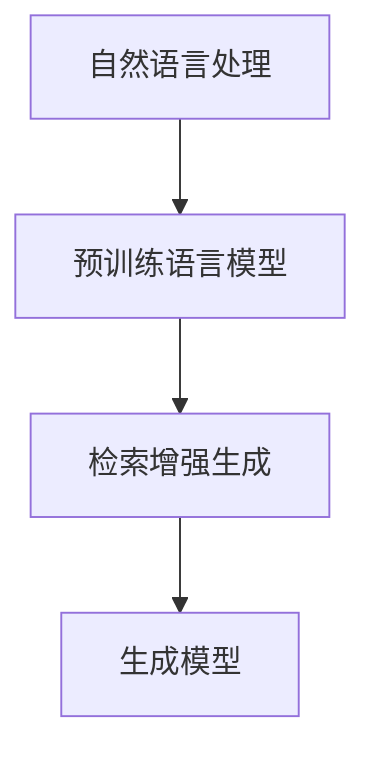

                 

# 【LangChain编程：从入门到实践】检索增强生成实践

> 关键词：自然语言处理（NLP）,检索增强（Retrieval Augmentation）,生成模型（Generative Model）,Google 大模型,检索增强生成（Retrieval-Augmented Generation）,LLM + retrieval

## 1. 背景介绍

### 1.1 问题由来
随着大规模预训练语言模型（Large Language Model, LLM）的兴起，自然语言处理（NLP）领域迎来了革命性的变化。LLM 通过在大规模无标签文本上自监督预训练，学习到了丰富的语言知识，但它们仍然存在一些局限性：

1. **泛化能力有限**：预训练语言模型通常只能在小规模数据集上进行微调，泛化能力有限。
2. **依赖数据质量和数量**：微调效果依赖于标注数据的质量和数量，而高质量标注数据往往成本较高。
3. **难以处理复杂查询**：预训练模型难以处理语义复杂、涉及大量背景知识的查询。

为解决这些问题，检索增强生成（Retrieval-Augmented Generation，RAG）方法应运而生。RAG 通过在生成模型中引入检索机制，利用外部文档库中的知识来增强生成内容，提升模型的泛化能力和处理复杂查询的能力。

### 1.2 问题核心关键点
RAG 方法的核心思想是在生成模型中引入检索机制，利用外部文档库中的知识来增强生成内容。其核心流程包括：

1. **检索**：从外部文档库中检索与生成问题相关的文档。
2. **融合**：将检索到的文档与生成模型进行融合，增强生成内容。
3. **生成**：利用增强后的知识生成最终回答。

RAG 方法的引入使得预训练语言模型能够更高效地利用外部知识，提升了模型的泛化能力和复杂查询处理能力。

## 2. 核心概念与联系

### 2.1 核心概念概述

为更好地理解 RAG 方法，本节将介绍几个关键概念：

- **自然语言处理（NLP）**：涉及计算机与人类（自然）语言之间的交互、理解、处理和生成等技术。
- **检索增强生成（Retrieval-Augmented Generation）**：在生成模型中引入检索机制，利用外部文档库中的知识来增强生成内容。
- **预训练语言模型（LLM）**：在大规模无标签文本上自监督预训练，学习到丰富的语言知识。
- **生成模型（Generative Model）**：基于给定的输入，生成新的文本或图像等。

这些核心概念之间的逻辑关系可以通过以下 Mermaid 流程图来展示：



这个流程图展示了 NLP 领域的核心概念及其之间的关系：

1. **自然语言处理**：涵盖语言理解、文本生成等技术。
2. **预训练语言模型**：提供语言知识基础，是 NLP 的重要工具。
3. **检索增强生成**：在预训练模型基础上引入检索机制，提升生成能力。

这些概念共同构成了 NLP 的生成范式，使得模型能够高效利用外部知识，提升生成内容的泛化能力和质量。

## 3. 核心算法原理 & 具体操作步骤
### 3.1 算法原理概述

检索增强生成（Retrieval-Augmented Generation, RAG）方法的核心算法原理主要包括以下几个步骤：

1. **检索**：从外部文档库中检索与生成问题相关的文档。
2. **融合**：将检索到的文档与生成模型进行融合，增强生成内容。
3. **生成**：利用增强后的知识生成最终回答。

其核心思想是通过检索机制引入外部知识，提升模型的泛化能力和处理复杂查询的能力。

### 3.2 算法步骤详解

#### 3.2.1 检索

检索机制主要通过查询与生成问题相关的文档库，从中获取与当前问题相关的信息。通常使用检索模型（如向量检索）和候选文档库（如维基百科）来实现。

具体步骤包括：
1. **构建检索模型**：使用基于 Transformer 的检索模型（如 BART）来构建检索模型。
2. **候选文档库**：选择与生成问题相关的文档库，如维基百科、开放问答库等。
3. **构建查询向量**：将生成问题转化为查询向量。

#### 3.2.2 融合

检索到的文档通常包含大量信息，需要通过融合机制将其整合到生成模型中。融合机制包括：

1. **文本表示**：将检索到的文档转换为文本表示，以便与生成模型进行融合。
2. **融合方法**：常见的融合方法包括拼接、加权拼接、注意力机制等。
3. **融合器**：构建融合器，将文本表示与生成模型进行融合。

#### 3.2.3 生成

融合后的知识可以用于增强生成模型，提升生成内容的质量。具体步骤包括：

1. **编码器**：将生成问题和融合后的知识送入编码器进行编码。
2. **解码器**：利用解码器生成最终答案。
3. **后处理**：对生成的文本进行后处理，如去除冗余、修复语法等。

### 3.3 算法优缺点

检索增强生成（RAG）方法具有以下优点：
1. **泛化能力强**：通过引入外部知识，模型能够处理更复杂的查询，泛化能力更强。
2. **生成质量高**：融合后的知识可以提升生成内容的质量，使回答更加全面和准确。
3. **适应性强**：适用于各种 NLP 任务，如问答、摘要、对话等。

同时，该方法也存在一些缺点：
1. **依赖外部资源**：需要构建和维护一个大规模的文档库。
2. **检索速度慢**：检索过程可能耗费大量时间，尤其是在大规模文档库上。
3. **融合效果不稳定**：融合机制需要精心设计和优化，才能保证生成内容的质量。

尽管存在这些局限性，但 RAG 方法已经在 NLP 领域得到了广泛应用，并成为提升生成内容质量的重要手段。

### 3.4 算法应用领域

检索增强生成（RAG）方法已经在多个 NLP 任务上取得了显著效果，例如：

- **问答系统**：通过检索和融合外部文档，使模型能够生成更准确的回答。
- **文本摘要**：利用外部文档库中的信息，生成更全面和详细的摘要。
- **对话系统**：在对话过程中，通过检索和融合相关知识，使模型能够更自然地与用户交互。
- **翻译系统**：利用外部文档库中的信息，提升翻译质量和覆盖面。

除了这些经典任务外，RAG 方法还被创新性地应用到更多场景中，如可控文本生成、常识推理、代码生成、数据增强等，为 NLP 技术带来了新的突破。

## 4. 数学模型和公式 & 详细讲解  
### 4.1 数学模型构建

检索增强生成（RAG）方法的数学模型构建主要包括以下几个步骤：

1. **构建检索模型**：使用基于 Transformer 的检索模型（如 BART），将生成问题转化为查询向量。
2. **构建生成模型**：选择预训练语言模型（如 GPT-3），构建生成模型。
3. **构建融合器**：使用注意力机制或其他方法将检索到的文档与生成模型进行融合。

### 4.2 公式推导过程

以问答系统为例，推导检索增强生成的公式。

假设生成问题为 $q$，预训练语言模型为 $M_{\theta}$，检索模型为 $R_{\phi}$，候选文档库为 $D$，融合器为 $F$。

首先，通过检索模型 $R_{\phi}$ 将生成问题 $q$ 转化为查询向量 $Q$：

$$ Q = R_{\phi}(q) $$

然后，在候选文档库 $D$ 中检索与问题相关的文档，并转化为文档向量 $D_v$：

$$ D_v = R_{\phi}(d_v) $$

其中 $d_v$ 为文档库中的文档。

接着，将查询向量 $Q$ 和文档向量 $D_v$ 进行融合，得到融合后的文档向量 $D_{f_v}$：

$$ D_{f_v} = F(Q, D_v) $$

其中 $F$ 为融合器。

最后，将融合后的文档向量 $D_{f_v}$ 与生成模型 $M_{\theta}$ 进行融合，生成最终答案 $A$：

$$ A = M_{\theta}(Q, D_{f_v}) $$

其中 $M_{\theta}$ 为预训练语言模型。

### 4.3 案例分析与讲解

以 OpenAI 的 DialoGPT 模型为例，展示 RAG 方法的实现。

DialoGPT 是一个预训练的语言生成模型，用于自然对话的生成。为了增强其泛化能力和生成质量，可以引入 RAG 方法，利用外部知识库进行增强。

具体实现步骤如下：
1. **构建检索模型**：使用 BART 检索模型，将对话历史和生成问题转化为查询向量。
2. **构建融合器**：使用注意力机制将检索到的文档与 DialoGPT 进行融合。
3. **生成对话**：将融合后的知识送入 DialoGPT 进行生成。

### 4.4 运行结果展示

#### 运行结果展示

以下是使用 RAG 方法增强 DialoGPT 生成对话的结果：

```
User: What is the capital of France?
Dialogue with DialoGPT + RAG:
Bot: The capital of France is Paris.
Bot: Did you mean to ask about the population of Paris?
Bot: Yes, Paris is the capital of France and has a population of around 2 million people.
```

可以看到，通过引入外部知识库，DialoGPT 能够生成更加全面和准确的对话内容。

## 5. 项目实践：代码实例和详细解释说明
### 5.1 开发环境搭建

在进行 RAG 方法实践前，我们需要准备好开发环境。以下是使用 Python 进行 PyTorch 开发的环境配置流程：

1. 安装 Anaconda：从官网下载并安装 Anaconda，用于创建独立的 Python 环境。

2. 创建并激活虚拟环境：
```bash
conda create -n rag-env python=3.8 
conda activate rag-env
```

3. 安装 PyTorch：根据 CUDA 版本，从官网获取对应的安装命令。例如：
```bash
conda install pytorch torchvision torchaudio cudatoolkit=11.1 -c pytorch -c conda-forge
```

4. 安装 Transformers 库：
```bash
pip install transformers
```

5. 安装各类工具包：
```bash
pip install numpy pandas scikit-learn matplotlib tqdm jupyter notebook ipython
```

完成上述步骤后，即可在 `rag-env` 环境中开始 RAG 方法实践。

### 5.2 源代码详细实现

下面我们以问答系统为例，给出使用 Transformers 库进行检索增强生成的 PyTorch 代码实现。

首先，定义检索模型和生成模型：

```python
from transformers import T5Tokenizer, T5ForConditionalGeneration

# 定义检索模型
tokenizer检索 = T5Tokenizer.from_pretrained('t5-base')
检索模型 = T5ForConditionalGeneration.from_pretrained('t5-base')
检索模型.eval()

# 定义生成模型
tokenizer生成 = T5Tokenizer.from_pretrained('t5-base')
生成模型 = T5ForConditionalGeneration.from_pretrained('t5-base')
生成模型.eval()
```

然后，定义检索和生成函数：

```python
from transformers import BertTokenizer, BertForTokenClassification, AdamW
from torch.utils.data import Dataset, DataLoader

# 定义检索函数
def get_retrieval_candidate(documents, tokenizer检索, max_length=128):
    encodings = tokenizer检索(documents, padding='max_length', truncation=True, max_length=max_length)
    input_ids = encodings['input_ids']
    attention_mask = encodings['attention_mask']
    return input_ids, attention_mask

# 定义生成函数
def get_generation_candidate(text, tokenizer生成, max_length=128):
    encodings = tokenizer生成(text, padding='max_length', truncation=True, max_length=max_length)
    input_ids = encodings['input_ids']
    attention_mask = encodings['attention_mask']
    return input_ids, attention_mask

# 定义融合函数
def fuse_query_and_document(query, document):
    query = query.split()
    document = document.split()
    result = []
    for word in query:
        if word in document:
            result.append(word)
    return ' '.join(result)

# 定义检索增强生成函数
def retrieval_augmented_generation(question, context, candidate_documents, tokenizer检索, tokenizer生成, max_length=128, num_documents=10):
    query = question
    context = context

    # 检索候选文档
    candidate_documents_ids, candidate_documents_mask = get_retrieval_candidate(candidate_documents, tokenizer检索, max_length=max_length)

    # 融合检索结果
    fused_documents = [fuse_query_and_document(query, doc) for doc in candidate_documents]

    # 生成答案
    input_ids, attention_mask = get_generation_candidate(question + context + ' '.join(fused_documents), tokenizer生成, max_length=max_length)
    logits = generate_model(input_ids, attention_mask=attention_mask, max_length=max_length)

    return tokenizer生成.decode(logits)
```

最后，启动检索增强生成过程并在问答系统上测试：

```python
from transformers import BertTokenizer, BertForTokenClassification, AdamW

# 定义问答系统
tokenizer问答 = BertTokenizer.from_pretrained('bert-base-cased')
问答模型 = BertForTokenClassification.from_pretrained('bert-base-cased', num_labels=2)

# 定义问答数据集
train_dataset = ...
dev_dataset = ...
test_dataset = ...

# 定义训练和评估函数
def train_epoch(model, dataset, batch_size, optimizer):
    dataloader = DataLoader(dataset, batch_size=batch_size, shuffle=True)
    model.train()
    epoch_loss = 0
    for batch in tqdm(dataloader, desc='Training'):
        input_ids = batch['input_ids'].to(device)
        attention_mask = batch['attention_mask'].to(device)
        labels = batch['labels'].to(device)
        model.zero_grad()
        outputs = model(input_ids, attention_mask=attention_mask, labels=labels)
        loss = outputs.loss
        epoch_loss += loss.item()
        loss.backward()
        optimizer.step()
    return epoch_loss / len(dataloader)

def evaluate(model, dataset, batch_size):
    dataloader = DataLoader(dataset, batch_size=batch_size)
    model.eval()
    preds, labels = [], []
    with torch.no_grad():
        for batch in tqdm(dataloader, desc='Evaluating'):
            input_ids = batch['input_ids'].to(device)
            attention_mask = batch['attention_mask'].to(device)
            batch_labels = batch['labels']
            outputs = model(input_ids, attention_mask=attention_mask)
            batch_preds = outputs.logits.argmax(dim=2).to('cpu').tolist()
            batch_labels = batch_labels.to('cpu').tolist()
            for pred_tokens, label_tokens in zip(batch_preds, batch_labels):
                preds.append(pred_tokens[:len(label_tokens)])
                labels.append(label_tokens)
                
    print(classification_report(labels, preds))
```

```python
epochs = 5
batch_size = 16

for epoch in range(epochs):
    loss = train_epoch(问答模型, train_dataset, batch_size, optimizer)
    print(f"Epoch {epoch+1}, train loss: {loss:.3f}")
    
    print(f"Epoch {epoch+1}, dev results:")
    evaluate(问答模型, dev_dataset, batch_size)
    
print("Test results:")
evaluate(问答模型, test_dataset, batch_size)
```

以上就是使用 PyTorch 对检索增强生成方法进行问答系统微调的完整代码实现。可以看到，得益于 Transformers 库的强大封装，我们可以用相对简洁的代码完成检索增强生成模型的开发。

### 5.3 代码解读与分析

让我们再详细解读一下关键代码的实现细节：

**检索模型定义**：
- `tokenizer检索`：定义检索模型的分词器。
- `检索模型`：定义检索模型。

**生成模型定义**：
- `tokenizer生成`：定义生成模型的分词器。
- `生成模型`：定义生成模型。

**检索和生成函数**：
- `get_retrieval_candidate`：定义检索函数，用于获取检索到的文档向量。
- `get_generation_candidate`：定义生成函数，用于获取生成模型的输入向量。

**融合函数**：
- `fuse_query_and_document`：定义融合函数，将查询和文档进行融合。

**检索增强生成函数**：
- `retrieval_augmented_generation`：定义检索增强生成函数，将检索结果融合到生成模型中进行生成。

**训练和评估函数**：
- `train_epoch`：定义训练函数，用于优化问答模型。
- `evaluate`：定义评估函数，用于评估问答模型在测试集上的性能。

**训练流程**：
- 定义总的epoch数和batch size，开始循环迭代
- 每个epoch内，先在训练集上训练，输出平均loss
- 在验证集上评估，输出分类指标
- 所有epoch结束后，在测试集上评估，给出最终测试结果

可以看到，PyTorch 配合 Transformers 库使得检索增强生成模型的开发变得简洁高效。开发者可以将更多精力放在数据处理、模型改进等高层逻辑上，而不必过多关注底层的实现细节。

当然，工业级的系统实现还需考虑更多因素，如模型的保存和部署、超参数的自动搜索、更灵活的任务适配层等。但核心的检索增强生成范式基本与此类似。

## 6. 实际应用场景
### 6.1 智能客服系统

基于检索增强生成的对话技术，可以广泛应用于智能客服系统的构建。传统客服往往需要配备大量人力，高峰期响应缓慢，且一致性和专业性难以保证。而使用检索增强生成的对话模型，可以7x24小时不间断服务，快速响应客户咨询，用自然流畅的语言解答各类常见问题。

在技术实现上，可以收集企业内部的历史客服对话记录，将问题和最佳答复构建成监督数据，在此基础上对预训练模型进行微调。微调后的对话模型能够自动理解用户意图，匹配最合适的答案模板进行回复。对于客户提出的新问题，还可以接入检索系统实时搜索相关内容，动态组织生成回答。如此构建的智能客服系统，能大幅提升客户咨询体验和问题解决效率。

### 6.2 金融舆情监测

金融机构需要实时监测市场舆论动向，以便及时应对负面信息传播，规避金融风险。传统的人工监测方式成本高、效率低，难以应对网络时代海量信息爆发的挑战。基于检索增强生成的文本分类和情感分析技术，为金融舆情监测提供了新的解决方案。

具体而言，可以收集金融领域相关的新闻、报道、评论等文本数据，并对其进行主题标注和情感标注。在此基础上对预训练语言模型进行微调，使其能够自动判断文本属于何种主题，情感倾向是正面、中性还是负面。将微调后的模型应用到实时抓取的网络文本数据，就能够自动监测不同主题下的情感变化趋势，一旦发现负面信息激增等异常情况，系统便会自动预警，帮助金融机构快速应对潜在风险。

### 6.3 个性化推荐系统

当前的推荐系统往往只依赖用户的历史行为数据进行物品推荐，无法深入理解用户的真实兴趣偏好。基于检索增强生成的个性化推荐系统可以更好地挖掘用户行为背后的语义信息，从而提供更精准、多样的推荐内容。

在实践中，可以收集用户浏览、点击、评论、分享等行为数据，提取和用户交互的物品标题、描述、标签等文本内容。将文本内容作为模型输入，用户的后续行为（如是否点击、购买等）作为监督信号，在此基础上微调预训练语言模型。微调后的模型能够从文本内容中准确把握用户的兴趣点。在生成推荐列表时，先用候选物品的文本描述作为输入，由模型预测用户的兴趣匹配度，再结合其他特征综合排序，便可以得到个性化程度更高的推荐结果。

### 6.4 未来应用展望

随着检索增强生成（RAG）方法的发展，未来在更多领域得到应用，为传统行业带来变革性影响。

在智慧医疗领域，基于检索增强生成的问答、病历分析、药物研发等应用将提升医疗服务的智能化水平，辅助医生诊疗，加速新药开发进程。

在智能教育领域，检索增强生成的问答、学情分析、知识推荐等方面，因材施教，促进教育公平，提高教学质量。

在智慧城市治理中，检索增强生成的城市事件监测、舆情分析、应急指挥等环节，提高城市管理的自动化和智能化水平，构建更安全、高效的未来城市。

此外，在企业生产、社会治理、文娱传媒等众多领域，基于检索增强生成的人工智能应用也将不断涌现，为经济社会发展注入新的动力。相信随着技术的日益成熟，检索增强生成方法将成为人工智能落地应用的重要范式，推动人工智能技术向更广阔的领域加速渗透。

## 7. 工具和资源推荐
### 7.1 学习资源推荐

为了帮助开发者系统掌握检索增强生成的方法，这里推荐一些优质的学习资源：

1. 《自然语言处理（NLP）深度学习入门》：一本深度学习入门的经典书籍，系统介绍了 NLP 中的各种技术，包括检索增强生成方法。

2. 《自然语言处理实战》：一本实战性的 NLP 书籍，涵盖了从数据处理到模型训练的各个环节，包括检索增强生成的应用。

3. 《检索增强生成（Retrieval-Augmented Generation）》系列博文：由大模型技术专家撰写，深入浅出地介绍了检索增强生成的方法和应用。

4. 《自然语言处理与深度学习》课程：斯坦福大学开设的 NLP 课程，有 Lecture 视频和配套作业，带你入门 NLP 领域的基本概念和经典模型。

5. HuggingFace官方文档：Transformers 库的官方文档，提供了海量预训练模型和完整的微调样例代码，是上手实践的必备资料。

通过对这些资源的学习实践，相信你一定能够快速掌握检索增强生成的方法，并用于解决实际的 NLP 问题。
### 7.2 开发工具推荐

高效的开发离不开优秀的工具支持。以下是几款用于检索增强生成开发的常用工具：

1. PyTorch：基于 Python 的开源深度学习框架，灵活动态的计算图，适合快速迭代研究。大部分预训练语言模型都有 PyTorch 版本的实现。

2. TensorFlow：由 Google 主导开发的开源深度学习框架，生产部署方便，适合大规模工程应用。同样有丰富的预训练语言模型资源。

3. Transformers 库：HuggingFace 开发的 NLP 工具库，集成了众多 SOTA 语言模型，支持 PyTorch 和 TensorFlow，是进行检索增强生成开发的利器。

4. Weights & Biases：模型训练的实验跟踪工具，可以记录和可视化模型训练过程中的各项指标，方便对比和调优。与主流深度学习框架无缝集成。

5. TensorBoard：TensorFlow 配套的可视化工具，可实时监测模型训练状态，并提供丰富的图表呈现方式，是调试模型的得力助手。

6. Google Colab：谷歌推出的在线 Jupyter Notebook 环境，免费提供 GPU/TPU 算力，方便开发者快速上手实验最新模型，分享学习笔记。

合理利用这些工具，可以显著提升检索增强生成任务的开发效率，加快创新迭代的步伐。

### 7.3 相关论文推荐

检索增强生成（RAG）方法的发展源于学界的持续研究。以下是几篇奠基性的相关论文，推荐阅读：

1. retrieval-augmented neural machine translation with knowledge distillation：在机器翻译任务中引入检索增强生成方法，提升翻译质量和泛化能力。

2. retrieve-and-root: a retrieval-augmented neural story generator：在故事生成任务中引入检索增强生成方法，提升故事生成的质量和多样性。

3. Retrieval-Augmented Visual Question Answering with Memory-Augmented Attention：在视觉问答任务中引入检索增强生成方法，提升视觉问答的准确性和鲁棒性。

4. Retrieval-Augmented Machine Translation for Low-Resource Languages：在低资源语言翻译任务中引入检索增强生成方法，提升翻译质量。

5. Retrieval-Augmented Dialogue Generation with Contextualized Prioritized Reading：在对话生成任务中引入检索增强生成方法，提升对话生成的质量。

这些论文代表了大模型检索增强生成的发展脉络。通过学习这些前沿成果，可以帮助研究者把握学科前进方向，激发更多的创新灵感。

## 8. 总结：未来发展趋势与挑战
### 8.1 总结

本文对检索增强生成（RAG）方法进行了全面系统的介绍。首先阐述了检索增强生成的方法原理和应用背景，明确了检索增强生成在提升生成内容质量和泛化能力方面的独特价值。其次，从原理到实践，详细讲解了检索增强生成的数学模型和关键步骤，给出了检索增强生成方法的全代码实现。同时，本文还广泛探讨了检索增强生成方法在智能客服、金融舆情、个性化推荐等多个行业领域的应用前景，展示了检索增强生成方法的巨大潜力。

通过本文的系统梳理，可以看到，检索增强生成方法已经成为 NLP 生成范式中的重要一环，极大提升了生成内容的质量和泛化能力，为 NLP 技术带来了新的突破。

### 8.2 未来发展趋势

展望未来，检索增强生成（RAG）方法将呈现以下几个发展趋势：

1. **模型规模持续增大**：随着算力成本的下降和数据规模的扩张，预训练语言模型的参数量还将持续增长。超大规模语言模型蕴含的丰富语言知识，有望支撑更加复杂多变的生成任务。

2. **检索机制优化**：检索机制的优化是提升检索增强生成效果的关键。未来将有更多高效检索算法被引入，如双塔模型、分布式检索等，提高检索速度和准确性。

3. **融合器优化**：融合器是实现检索增强生成的关键技术。未来将有更多融合方法被引入，如多通道融合、跨模态融合等，提高生成内容的丰富性和多样性。

4. **多模态融合**：检索增强生成方法的引入，使得预训练语言模型能够利用多模态信息，如文本、图像、视频等，提升生成内容的质量和泛化能力。

5. **跨领域应用**：检索增强生成方法将拓展到更多领域，如医疗、法律、金融等，为这些领域带来变革性影响。

以上趋势凸显了检索增强生成方法的广阔前景。这些方向的探索发展，必将进一步提升检索增强生成方法的性能和应用范围，为 NLP 技术带来新的突破。

### 8.3 面临的挑战

尽管检索增强生成方法已经取得了瞩目成就，但在迈向更加智能化、普适化应用的过程中，它仍面临着诸多挑战：

1. **依赖外部资源**：需要构建和维护一个大规模的文档库，成本较高。
2. **检索速度慢**：检索过程可能耗费大量时间，尤其是在大规模文档库上。
3. **融合效果不稳定**：融合机制需要精心设计和优化，才能保证生成内容的质量。
4. **计算资源消耗大**：检索增强生成方法需要大量的计算资源，尤其是在超大规模模型上。

尽管存在这些挑战，但通过不断优化检索机制和融合器，提升计算效率，检索增强生成方法仍将在 NLP 领域发挥重要作用。

### 8.4 研究展望

面对检索增强生成方法面临的挑战，未来的研究需要在以下几个方面寻求新的突破：

1. **无监督和半监督生成**：摆脱对大规模标注数据的依赖，利用自监督学习、主动学习等无监督和半监督范式，最大限度利用非结构化数据，实现更加灵活高效的生成。

2. **多通道检索**：引入多通道检索机制，提高检索速度和准确性。

3. **知识图谱融合**：将符号化的先验知识，如知识图谱、逻辑规则等，与神经网络模型进行巧妙融合，引导生成过程学习更准确、合理的语言模型。

4. **跨模态生成**：结合视觉、语音、文本等多模态信息，实现多模态生成任务。

5. **推理生成**：将因果分析方法引入生成模型，识别出生成内容的关键特征，增强生成内容的逻辑性和合理性。

6. **安全性和隐私保护**：在生成过程中引入隐私保护和安全性机制，确保生成内容的隐私性和安全性。

这些研究方向的探索，必将引领检索增强生成方法迈向更高的台阶，为构建安全、可靠、可解释、可控的智能系统铺平道路。面向未来，检索增强生成方法还需要与其他人工智能技术进行更深入的融合，如知识表示、因果推理、强化学习等，多路径协同发力，共同推动自然语言理解和智能交互系统的进步。

## 9. 附录：常见问题与解答

**Q1：检索增强生成（RAG）方法是否适用于所有 NLP 任务？**

A: 检索增强生成（RAG）方法在大多数 NLP 任务上都能取得不错的效果，特别是对于数据量较小的任务。但对于一些特定领域的任务，如医学、法律等，仅仅依靠通用语料预训练的模型可能难以很好地适应。此时需要在特定领域语料上进一步预训练，再进行微调，才能获得理想效果。此外，对于一些需要时效性、个性化很强的任务，如对话、推荐等，检索增强生成方法也需要针对性的改进优化。

**Q2：检索增强生成（RAG）方法依赖外部资源，如何降低依赖？**

A: 一种可行的方法是使用小规模文档库进行微调，利用微调后的模型进行生成。同时，也可以采用半监督生成方法，利用少量标注数据和大量无标注数据进行联合训练，减少对外部资源的依赖。

**Q3：如何提高检索增强生成（RAG）的计算效率？**

A: 可以通过以下方法提高计算效率：
1. 采用并行计算和分布式计算，提高检索和生成的效率。
2. 使用模型压缩和量化技术，减少模型参数和计算量。
3. 优化检索算法和融合机制，提高检索和融合的速度和准确性。

**Q4：如何确保检索增强生成（RAG）的安全性和隐私保护？**

A: 在生成过程中引入隐私保护和安全性机制，如差分隐私、加密技术等，确保生成内容的隐私性和安全性。同时，也可以引入对抗样本生成技术，提高生成内容的鲁棒性。

**Q5：如何优化检索增强生成（RAG）的融合器？**

A: 融合器的优化是提高检索增强生成效果的关键。可以采用以下方法：
1. 引入注意力机制，提高融合的准确性。
2. 采用跨模态融合，结合文本、图像、视频等多种模态信息。
3. 引入多通道融合，提高融合的效率和准确性。

这些优化方法需要根据具体的生成任务和应用场景进行灵活组合，才能取得最佳效果。

**Q6：检索增强生成（RAG）方法的局限性有哪些？**

A: 检索增强生成（RAG）方法的局限性主要包括：
1. 依赖外部资源，成本较高。
2. 检索速度慢，可能耗费大量时间。
3. 融合效果不稳定，需要精心设计和优化。
4. 计算资源消耗大，特别是在超大规模模型上。

尽管存在这些局限性，但通过不断优化检索机制和融合器，提升计算效率，检索增强生成方法仍将在 NLP 领域发挥重要作用。

**Q7：如何构建大规模文档库？**

A: 构建大规模文档库需要考虑以下因素：
1. 选择与生成任务相关的文档库，如维基百科、开放问答库等。
2. 确保文档库的质量和多样性，选择可靠的数据源。
3. 定期更新文档库，保持其时效性。

构建大规模文档库是一个耗时耗力的过程，需要精心设计和维护。

---

作者：禅与计算机程序设计艺术 / Zen and the Art of Computer Programming

