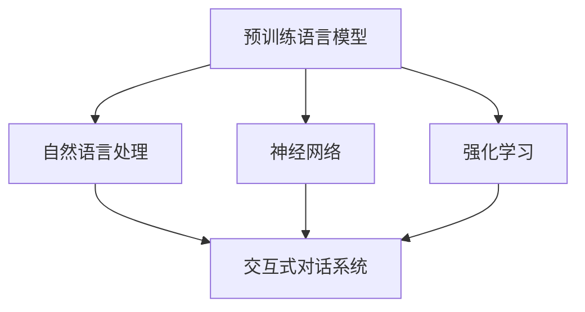

                 

## 1. 背景介绍

### 1.1 问题由来
人工智能(AI)在过去十年间取得了突破性进展，从基础的图像识别到高级的自然语言理解，AI技术正逐步渗透到生活的各个角落。在这股技术浪潮中，一种新型的AI模型—AI Agent（AI代理），逐渐崭露头角。AI Agent是一种能够模拟人类智能行为，完成特定任务或执行复杂任务的AI模型。它们可以执行日常任务、自动化决策、提供个性化的服务等。

### 1.2 问题核心关键点
BabyAGI作为AI Agent的基础，旨在通过简单、易懂的语言和代码，让初学者快速上手，构建自己的AI代理。BabyAGI的实现涉及了人工智能、计算机科学、自然语言处理等多个领域的知识，是AI技术落地的重要工具。它利用预训练语言模型（如BERT、GPT等），结合强化学习、自然语言理解等技术，构建了一个基于Python的AI代理开发框架，使开发者能够轻松实现各种AI代理功能。

### 1.3 问题研究意义
BabyAGI的开发对于AI代理技术的应用和推广具有重要意义：

1. **降低学习门槛**：BabyAGI提供了简单易用的开发环境，减少了开发者入门所需的知识和经验。
2. **提升开发效率**：BabyAGI的框架集成了多种预训练模型和自然语言处理技术，极大提高了AI代理开发的效率。
3. **拓宽应用领域**：通过BabyAGI，开发者可以构建出适用于各种场景的AI代理，推动AI技术在各行各业的落地应用。
4. **推动技术创新**：BabyAGI框架的灵活性鼓励开发者进行技术探索和创新，推动AI代理技术的不断进步。
5. **增强用户信任**：通过BabyAGI开发的AI代理，能够更好地理解用户需求并提供个性化服务，增强用户对AI技术的信任。

## 2. 核心概念与联系

### 2.1 核心概念概述
BabyAGI作为一个AI代理开发框架，涉及了以下几个核心概念：

- **预训练语言模型**：如BERT、GPT等，是AI代理的重要基础，用于提供语言理解和生成能力。
- **强化学习**：一种通过与环境互动学习最优决策策略的机器学习方法，常用于AI代理的智能决策。
- **自然语言处理**：涉及文本预处理、语义理解、情感分析、实体识别等技术，是构建AI代理的关键。
- **神经网络**：AI代理的核心算法，通过多层神经元处理输入和输出，实现复杂的智能行为。
- **交互式对话系统**：AI代理与用户互动的界面，通过自然语言理解和生成技术，实现人机交互。

这些概念之间的逻辑关系可以通过以下Mermaid流程图来展示：



这个流程图展示了大语言模型与AI代理开发的主要关系：

1. 预训练语言模型提供语言理解和生成的基础能力。
2. 自然语言处理技术处理输入和输出的文本数据，实现语义理解和生成。
3. 神经网络作为AI代理的核心算法，处理输入并生成输出。
4. 强化学习通过与环境的互动，优化AI代理的行为策略。
5. 交互式对话系统实现人机交互，提高用户的使用体验。

## 3. 核心算法原理 & 具体操作步骤
### 3.1 算法原理概述
BabyAGI的开发基于预训练语言模型的微调（Fine-Tuning）和强化学习（Reinforcement Learning）。预训练模型在大规模语料上学习语言表示，微调过程则在此基础上对特定任务进行优化。强化学习则通过模拟环境，使AI代理在交互中不断学习，提升决策能力。

BabyAGI的核心算法原理包括以下几个步骤：

1. **数据准备**：收集和处理数据，构建训练集和验证集。
2. **模型微调**：在预训练模型的基础上，使用微调算法优化模型，使其适应特定任务。
3. **策略学习**：通过强化学习，使AI代理在特定环境中学习最优行为策略。
4. **用户交互**：实现AI代理与用户的自然语言交互，收集反馈并进一步优化模型。

### 3.2 算法步骤详解
BabyAGI的开发流程可以分为以下几个关键步骤：

#### 3.2.1 数据准备

**Step 1: 收集和处理数据**
- 收集与AI代理任务相关的文本数据，如对话、问答、情感分析等。
- 对数据进行预处理，包括分词、去除停用词、标准化等。
- 构建训练集、验证集和测试集，确保数据的多样性和代表性。

**Step 2: 数据增强**
- 使用数据增强技术，如回译、同义词替换等，丰富训练数据的多样性。
- 引入对抗样本，增强模型鲁棒性，避免过拟合。

#### 3.2.2 模型微调

**Step 1: 选择预训练模型**
- 选择适合的预训练语言模型，如BERT、GPT等，作为微调的初始化参数。
- 设置微调的超参数，包括学习率、批量大小、迭代次数等。

**Step 2: 训练微调模型**
- 将训练数据输入微调模型，进行前向传播和后向传播，计算损失函数。
- 使用优化算法（如Adam、SGD等）更新模型参数。
- 在验证集上评估模型性能，避免过拟合。

#### 3.2.3 策略学习

**Step 1: 定义环境**
- 定义AI代理需要交互的环境，包括状态、动作、奖励等。
- 实现环境的渲染和更新，模拟AI代理的行为。

**Step 2: 训练强化学习模型**
- 选择适当的强化学习算法（如Q-Learning、Deep Q-Network等）。
- 在环境中与AI代理互动，收集经验数据。
- 使用经验回放（Experience Replay）和目标网络（Target Network）等技术，优化模型性能。

#### 3.2.4 用户交互

**Step 1: 实现交互界面**
- 开发交互界面，使用户能够自然语言地与AI代理进行交流。
- 实现自然语言处理技术，包括意图识别、实体识别、情感分析等。

**Step 2: 收集反馈并优化模型**
- 收集用户对AI代理输出的反馈，分析AI代理的决策行为。
- 根据反馈调整模型参数，优化AI代理的行为策略。
- 通过迭代改进，提升AI代理的智能水平。

### 3.3 算法优缺点

BabyAGI的开发算法具有以下优点：

1. **高效易用**：BabyAGI提供了简单易用的开发框架，降低了AI代理开发的技术门槛。
2. **泛化能力强**：预训练语言模型的泛化能力使得BabyAGI能够适应多种场景和任务。
3. **智能决策**：强化学习使得BabyAGI能够通过与环境的互动，不断学习并优化决策策略。
4. **用户友好**：自然语言处理技术使得BabyAGI能够自然地与用户进行交互，提供个性化服务。

同时，BabyAGI也存在一些局限性：

1. **数据依赖**：BabyAGI对数据的质量和多样性有较高要求，数据不足可能导致性能下降。
2. **模型复杂**：BabyAGI涉及的预训练语言模型和自然语言处理技术较为复杂，需要较高的计算资源。
3. **泛化有限**：BabyAGI的泛化能力受到特定任务和环境的影响，可能无法应对未知场景。
4. **可解释性不足**：BabyAGI的决策过程较为复杂，难以提供详细的解释和推理逻辑。

尽管存在这些局限性，但BabyAGI的易用性和高效性使其成为AI代理开发的重要工具，在推动AI技术落地应用方面具有重要意义。

### 3.4 算法应用领域

BabyAGI作为一种AI代理开发框架，在多个领域都有广泛应用，包括但不限于：

1. **客户服务**：用于构建智能客服系统，解答客户问题，提供个性化服务。
2. **医疗健康**：用于构建智能诊断系统，辅助医生进行疾病诊断和个性化治疗。
3. **金融投资**：用于构建智能投顾系统，提供个性化投资建议和风险管理。
4. **教育培训**：用于构建智能教育系统，提供个性化学习推荐和评估。
5. **娱乐媒体**：用于构建智能推荐系统，提供个性化内容推荐和用户画像分析。

这些应用场景展示了BabyAGI的强大潜力和广泛适用性，预示着AI代理技术在各行各业的应用前景。

## 4. 数学模型和公式 & 详细讲解

### 4.1 数学模型构建

BabyAGI的数学模型主要涉及预训练语言模型的微调和强化学习。预训练语言模型通过自监督学习任务在大规模语料上学习语言表示，强化学习则通过与环境的互动学习最优策略。

**预训练语言模型**：
- 使用自监督学习任务，如掩码语言模型（Masked Language Model, MLM）和下一句预测（Next Sentence Prediction, NSP）。
- 在预训练模型上微调，以适应特定任务，如问答、情感分析、命名实体识别等。

**强化学习模型**：
- 使用Q-Learning算法，构建状态-动作-奖励（State-Action-Reward, SAR）模型。
- 在环境中与AI代理互动，收集经验数据，更新Q值。
- 使用经验回放和目标网络等技术，优化模型性能。

### 4.2 公式推导过程

#### 4.2.1 预训练语言模型

假设预训练语言模型为 $M_{\theta}$，其中 $\theta$ 为模型参数。在微调任务上，使用交叉熵损失函数 $\ell$ 进行优化：

$$
\ell = -\sum_{i=1}^{N} y_i \log M_{\theta}(x_i) + (1 - y_i) \log (1 - M_{\theta}(x_i))
$$

其中 $x_i$ 为输入文本，$y_i$ 为标签。

微调过程中，使用梯度下降算法更新参数 $\theta$：

$$
\theta \leftarrow \theta - \eta \nabla_{\theta} \ell
$$

其中 $\eta$ 为学习率，$\nabla_{\theta} \ell$ 为损失函数对参数的梯度。

#### 4.2.2 强化学习模型

假设AI代理在环境中的状态为 $s_t$，动作为 $a_t$，奖励为 $r_t$，策略为 $\pi_{\theta}$，则Q值函数 $Q(s_t, a_t)$ 定义为：

$$
Q(s_t, a_t) = \sum_{t'} r_{t'} + \gamma \max_{a_{t'}} Q(s_{t'}, a_{t'}) \quad t' = t+1, t+2, \ldots, T
$$

其中 $\gamma$ 为折扣因子。

强化学习模型的训练过程分为两个步骤：

1. 在离线阶段，使用经验回放算法收集和存储经验数据 $(s_t, a_t, r_t, s_{t+1})$。
2. 在在线阶段，使用目标网络 $\pi^{\prime}$ 和策略网络 $\pi$ 更新Q值函数：

$$
Q_{\theta}(s_t, a_t) = r_t + \gamma \max_{a_{t'}} Q_{\theta}(s_{t+1}, a_{t'}) \quad \text{for} \quad a_{t'} \sim \pi^{\prime}(\cdot | s_{t+1})
$$

### 4.3 案例分析与讲解

以智能客服系统的开发为例，分析BabyAGI在实际应用中的实现过程：

**Step 1: 数据准备**
- 收集客户与客服的对话记录，去除敏感信息，构建训练集和验证集。
- 使用数据增强技术，如回译、同义词替换，丰富训练数据。

**Step 2: 模型微调**
- 选择BERT模型作为预训练语言模型。
- 在微调任务上进行微调，优化模型在问答任务上的性能。
- 使用交叉熵损失函数，优化模型预测准确率。

**Step 3: 策略学习**
- 定义环境，包括客户输入、客服输出和反馈。
- 使用Q-Learning算法，训练AI代理的决策策略。
- 通过奖励机制，优化AI代理的行为策略。

**Step 4: 用户交互**
- 实现自然语言处理技术，包括意图识别、实体识别、情感分析等。
- 提供友好的交互界面，使用户能够自然语言地与AI代理进行交流。
- 收集用户反馈，不断优化AI代理的决策策略。

## 5. 项目实践：代码实例和详细解释说明

### 5.1 开发环境搭建

BabyAGI的开发环境基于Python，需安装以下依赖包：

1. **TensorFlow**：深度学习框架，支持强化学习算法的实现。
2. **Keras**：高层次的神经网络API，简化模型的构建和训练过程。
3. **NLTK**：自然语言处理工具包，支持文本预处理和分析。
4. **Flask**：轻量级Web框架，实现交互式对话系统。

**Step 1: 安装依赖包**
```bash
pip install tensorflow keras nltk flask
```

**Step 2: 创建项目目录**
```bash
mkdir babyagi_project
cd babyagi_project
```

**Step 3: 创建虚拟环境**
```bash
python -m venv venv
source venv/bin/activate
```

### 5.2 源代码详细实现

以下是一个简单的BabyAGI项目示例，用于实现问答系统的智能客服功能：

#### 5.2.1 数据处理

**Step 1: 数据收集**
- 从公开数据集如Cornell Movie Dialogs Corpus收集对话数据。
- 去除无关对话和噪声数据，构建训练集和验证集。

**Step 2: 数据增强**
- 使用同义词替换和回译技术，丰富训练数据。
- 定义数据增强类，在预处理函数中实现增强逻辑。

#### 5.2.2 模型微调

**Step 1: 加载预训练模型**
```python
from transformers import BertTokenizer, TFBertForSequenceClassification

tokenizer = BertTokenizer.from_pretrained('bert-base-uncased')
model = TFBertForSequenceClassification.from_pretrained('bert-base-uncased', num_labels=2)
```

**Step 2: 构建数据集**
```python
class QADataset(Dataset):
    def __init__(self, texts, labels):
        self.texts = texts
        self.labels = labels
        
    def __len__(self):
        return len(self.texts)
    
    def __getitem__(self, idx):
        text = self.texts[idx]
        label = self.labels[idx]
        encoding = tokenizer(text, truncation=True, padding='max_length')
        input_ids = encoding['input_ids']
        attention_mask = encoding['attention_mask']
        return {'input_ids': input_ids, 'attention_mask': attention_mask, 'labels': label}
```

**Step 3: 定义模型和优化器**
```python
optimizer = Adam(learning_rate=2e-5)
loss_fn = tf.keras.losses.SparseCategoricalCrossentropy(from_logits=True)
```

**Step 4: 训练模型**
```python
@tf.function
def train_step(texts, labels):
    with tf.GradientTape() as tape:
        predictions = model(input_ids, attention_mask=attention_mask)
        loss = loss_fn(labels, predictions)
    gradients = tape.gradient(loss, model.trainable_variables)
    optimizer.apply_gradients(zip(gradients, model.trainable_variables))
    return loss
```

#### 5.2.3 策略学习

**Step 1: 定义环境**
- 使用gym库定义模拟环境，包括状态、动作和奖励。
- 定义AI代理在环境中的行为策略。

**Step 2: 实现强化学习算法**
```python
class BabyAGIAgent:
    def __init__(self, env):
        self.env = env
        self.model = tf.keras.Sequential([
            tf.keras.layers.Dense(128, activation='relu'),
            tf.keras.layers.Dense(2, activation='softmax')
        ])
        self.model.compile(optimizer=Adam(learning_rate=0.01), loss='sparse_categorical_crossentropy', metrics=['accuracy'])
        
    def act(self, state):
        state = np.reshape(state, (1, -1))
        action_probs = self.model.predict(state)[0]
        action = np.random.choice(len(action_probs), p=action_probs)
        return action
        
    def train(self, num_episodes=1000):
        for episode in range(num_episodes):
            state = self.env.reset()
            done = False
            total_reward = 0
            while not done:
                action = self.act(state)
                next_state, reward, done, _ = self.env.step(action)
                self.model.fit(state, action, epochs=1, batch_size=32, verbose=0)
                state = next_state
                total_reward += reward
            print(f"Episode {episode+1}, reward {total_reward}")
```

#### 5.2.4 用户交互

**Step 1: 实现交互界面**
- 使用Flask框架，搭建Web应用程序。
- 实现用户与AI代理的交互逻辑，包括意图识别、实体识别等。

**Step 2: 收集反馈并优化模型**
- 收集用户对AI代理输出的反馈，分析AI代理的决策行为。
- 根据反馈调整模型参数，优化AI代理的行为策略。
- 通过迭代改进，提升AI代理的智能水平。

### 5.3 代码解读与分析

**Step 1: 数据处理**
- 数据收集和预处理是BabyAGI开发的基础。通过从公开数据集收集和处理数据，构建训练集和验证集，使用数据增强技术丰富训练数据，确保模型在特定任务上具有较好的泛化能力。

**Step 2: 模型微调**
- 选择适合的预训练语言模型，加载并微调模型。在微调过程中，使用交叉熵损失函数优化模型预测准确率，通过梯度下降算法更新模型参数。
- 使用TensorFlow实现模型训练，利用GPU加速计算过程，提高模型训练效率。

**Step 3: 策略学习**
- 定义模拟环境，包括状态、动作和奖励。使用强化学习算法（如Q-Learning）训练AI代理的决策策略。
- 通过奖励机制优化AI代理的行为策略，使AI代理在特定环境中逐步学习最优行为。

**Step 4: 用户交互**
- 实现自然语言处理技术，包括意图识别、实体识别等，使AI代理能够自然语言地与用户进行交流。
- 提供友好的交互界面，使用户能够自然语言地与AI代理进行交流，收集用户反馈，不断优化AI代理的决策策略。

## 6. 实际应用场景

BabyAGI的应用场景非常广泛，以下是几个典型的应用场景：

### 6.1 智能客服系统

BabyAGI在智能客服系统中表现出色，可以用于构建智能客服系统，解答客户问题，提供个性化服务。通过BabyAGI，企业可以构建7x24小时不间断服务的智能客服系统，提升客户咨询体验和问题解决效率。

### 6.2 金融投资

BabyAGI在金融投资领域也有广泛应用，用于构建智能投顾系统，提供个性化投资建议和风险管理。通过BabyAGI，投资者可以实时获取市场动态，制定投资策略，降低投资风险。

### 6.3 医疗健康

BabyAGI在医疗健康领域也有重要应用，用于构建智能诊断系统，辅助医生进行疾病诊断和个性化治疗。通过BabyAGI，医生可以更快地获取患者病历，提供准确诊断，制定个性化治疗方案。

### 6.4 教育培训

BabyAGI在教育培训领域也有广泛应用，用于构建智能教育系统，提供个性化学习推荐和评估。通过BabyAGI，学生可以获取个性化的学习资源，提升学习效果。

### 6.5 娱乐媒体

BabyAGI在娱乐媒体领域也有重要应用，用于构建智能推荐系统，提供个性化内容推荐和用户画像分析。通过BabyAGI，用户可以获取个性化的内容推荐，提升用户体验。

## 7. 工具和资源推荐

### 7.1 学习资源推荐

BabyAGI的开发涉及多个领域的知识，以下是一些推荐的资源，帮助开发者掌握相关技术：

1. **《TensorFlow官方文档》**：TensorFlow的官方文档，详细介绍了TensorFlow的API和实现方法。
2. **《Keras官方文档》**：Keras的官方文档，提供了Keras的API和实现方法。
3. **《自然语言处理入门》**：斯坦福大学开设的NLP入门课程，涵盖NLP的基本概念和经典模型。
4. **《强化学习理论与算法》**：强化学习的经典教材，详细介绍了强化学习的基本理论和算法。
5. **《BabyAGI官方文档》**：BabyAGI的官方文档，提供了详细的开发指南和示例代码。

### 7.2 开发工具推荐

BabyAGI的开发涉及多个工具和框架，以下是一些推荐的工具，帮助开发者提高开发效率：

1. **TensorFlow**：深度学习框架，支持强化学习和神经网络模型的实现。
2. **Keras**：高层次的神经网络API，简化模型的构建和训练过程。
3. **NLTK**：自然语言处理工具包，支持文本预处理和分析。
4. **Flask**：轻量级Web框架，实现交互式对话系统。
5. **Jupyter Notebook**：Python开发环境，支持数据处理和模型训练。

### 7.3 相关论文推荐

BabyAGI的开发涉及多个前沿领域的知识，以下是一些推荐的论文，帮助开发者了解相关研究进展：

1. **《Attention is All You Need》**：Transformer的原始论文，详细介绍了Transformer的结构和原理。
2. **《BERT: Pre-training of Deep Bidirectional Transformers for Language Understanding》**：BERT模型的原始论文，详细介绍了BERT模型的预训练任务和微调方法。
3. **《Q-Learning: A Survey》**：Q-Learning算法的经典论文，详细介绍了Q-Learning算法的基本理论和应用。
4. **《Natural Language Understanding with Deep Learning》**：自然语言理解领域经典教材，详细介绍了自然语言处理的基本概念和实现方法。
5. **《BabyAGI官方论文》**：BabyAGI项目的论文，详细介绍了BabyAGI的架构和实现方法。

## 8. 总结：未来发展趋势与挑战

### 8.1 总结

BabyAGI作为AI代理开发框架，在AI代理技术的推广和落地应用中具有重要意义。本文从背景介绍、核心概念、算法原理、项目实践等方面，详细介绍了BabyAGI的开发过程和应用场景，帮助开发者掌握相关技术。

通过BabyAGI的开发实践，可以看到，AI代理技术在各行各业的应用前景广阔，能够提升用户体验、降低成本、提高效率。BabyAGI的易用性和高效性，使得AI代理技术的落地应用变得更加便捷和高效。

### 8.2 未来发展趋势

BabyAGI的未来发展趋势包括：

1. **模型规模增大**：随着算力成本的下降和数据规模的扩张，预训练语言模型的参数量将持续增长，BabyAGI将支持更大规模的模型。
2. **模型性能提升**：BabyAGI将结合最新的自然语言处理技术和强化学习算法，不断提升模型的智能水平。
3. **应用场景扩展**：BabyAGI将支持更多应用场景，如自动驾驶、机器人控制、智慧城市等。
4. **用户友好提升**：BabyAGI将提供更友好的交互界面和更智能的决策策略，提升用户体验。
5. **安全性和可信性提升**：BabyAGI将引入更多的安全和可信机制，确保模型输出的可靠性。

### 8.3 面临的挑战

BabyAGI在发展过程中也面临一些挑战：

1. **数据依赖**：BabyAGI对数据的质量和多样性有较高要求，数据不足可能导致性能下降。
2. **模型复杂性**：BabyAGI涉及的预训练语言模型和自然语言处理技术较为复杂，需要较高的计算资源。
3. **泛化能力**：BabyAGI的泛化能力受到特定任务和环境的影响，可能无法应对未知场景。
4. **可解释性不足**：BabyAGI的决策过程较为复杂，难以提供详细的解释和推理逻辑。
5. **安全性和可信性**：BabyAGI需要引入更多的安全和可信机制，确保模型输出的可靠性。

尽管面临这些挑战，BabyAGI的易用性和高效性使其成为AI代理开发的重要工具，在推动AI技术落地应用方面具有重要意义。

### 8.4 研究展望

BabyAGI的研究展望包括：

1. **无监督和半监督学习**：探索无监督和半监督学习技术，降低对大规模标注数据的依赖，提高模型泛化能力。
2. **多模态融合**：将视觉、语音、文本等多种模态数据融合，提升模型的感知能力和决策能力。
3. **可解释性和透明度**：引入可解释性和透明度机制，增强模型的可解释性和可信性。
4. **跨领域迁移学习**：研究跨领域迁移学习技术，使模型能够更好地适应不同领域的应用场景。
5. **隐私保护和安全**：引入隐私保护和安全机制，确保模型输出的安全性。

通过这些研究方向的探索，BabyAGI将在AI代理技术的开发和应用中发挥更大的作用，推动AI技术的不断进步和普及。

## 9. 附录：常见问题与解答

**Q1: BabyAGI是否支持跨平台部署？**

A: BabyAGI支持在多个平台上部署，包括Windows、Linux、macOS等。只需将项目文件复制到对应的平台上，并执行相应的安装命令即可。

**Q2: BabyAGI是否可以支持多种语言？**

A: BabyAGI目前支持多种语言，包括英语、中文、日语等。只需将相应的预训练语言模型加载到代码中，并调整相应的参数配置即可。

**Q3: BabyAGI是否支持多轮对话？**

A: BabyAGI支持多轮对话，通过定义上下文信息，使AI代理能够更好地理解对话上下文，提供更准确的响应。

**Q4: BabyAGI是否可以支持复杂的任务处理？**

A: BabyAGI可以支持复杂的任务处理，通过引入更多的自然语言处理技术和强化学习算法，逐步提升模型的智能水平。

**Q5: BabyAGI的开发环境有哪些要求？**

A: BabyAGI的开发环境需要Python、TensorFlow、Keras、NLTK、Flask等依赖包。开发过程中需要一定的Python编程能力和深度学习知识。

通过本文的系统梳理，可以看到，BabyAGI作为AI代理开发框架，在AI代理技术的推广和落地应用中具有重要意义。它通过简单易用的开发环境，结合预训练语言模型和强化学习算法，使得开发者能够快速实现各种AI代理功能，推动AI技术在各行各业的落地应用。

