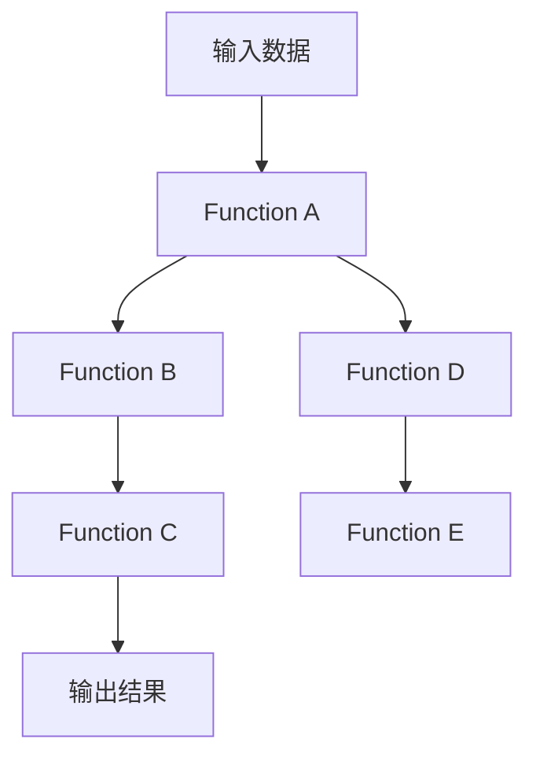

                 

# 【大模型应用开发 动手做AI Agent】Function的说明文字很重要

## 1. 背景介绍

随着人工智能技术的飞速发展，深度学习模型已经广泛应用在各个领域。特别是在自然语言处理（NLP）领域，大规模预训练语言模型（如BERT、GPT-3等）的崛起，使得AI Agent的发展进入了一个新的阶段。AI Agent作为一种具备自主智能行为、能够与人或环境互动的实体，其功能和性能的提升离不开深度学习模型，尤其是功能强大的大模型。本文将从Function的说明文字入手，探讨大模型在AI Agent中的应用开发，并提供相关技术实践建议。

## 2. 核心概念与联系

### 2.1 核心概念概述

在大模型应用开发中，Function的说明文字是至关重要的。Function是深度学习模型中定义的最小计算单元，它描述了模型的一个逻辑操作，并明确了输入、输出和内部参数的关系。在AI Agent开发中，Function的说明文字有助于理解模型的内部机制，指导模型的设计和训练，同时也有助于后续的部署和维护。

### 2.2 核心概念原理和架构的 Mermaid 流程图



此流程图表示了深度学习模型的基本架构，其中A表示输入数据，E表示输出结果，BCDE表示功能层，每一层的功能由Function来定义。每个Function之间通过边相连，描述数据流向。

## 3. 核心算法原理 & 具体操作步骤

### 3.1 算法原理概述

在AI Agent开发中，Function的说明文字主要通过定义模型的结构、输入输出格式、计算逻辑等来实现。一个完整的Function通常包含以下几个部分：

- **输入定义**：明确Function的输入格式和数据类型。
- **计算逻辑**：描述Function的计算过程，包括使用的深度学习算法和模型结构。
- **输出定义**：指定Function的输出格式和数据类型。
- **超参数定义**：设定Function的训练和运行参数，如学习率、批大小、迭代次数等。

### 3.2 算法步骤详解

#### 3.2.1 输入数据的准备

- **数据集收集与预处理**：根据应用场景收集相应的训练数据，并对其进行预处理，包括数据清洗、标注、归一化等操作。
- **数据划分**：将数据集划分为训练集、验证集和测试集，便于模型训练和评估。

#### 3.2.2 模型定义与初始化

- **选择预训练模型**：根据任务需求选择合适的预训练模型，如BERT、GPT-3等。
- **定义Function**：在深度学习框架（如TensorFlow、PyTorch等）中定义Function，明确其输入、输出和计算逻辑。

#### 3.2.3 模型训练与优化

- **训练步骤**：使用训练数据集对模型进行训练，调整Function的超参数以优化模型性能。
- **评估步骤**：使用验证数据集对模型进行评估，调整模型参数以避免过拟合。
- **测试步骤**：使用测试数据集对模型进行最终测试，评估其性能。

#### 3.2.4 模型部署与应用

- **模型导出与保存**：将训练好的模型导出并保存到指定路径，便于后续使用。
- **模型部署**：将模型部署到实际应用场景中，如智能客服、医疗问答系统等。
- **持续优化**：根据实际应用反馈，持续优化模型，提升其性能。

### 3.3 算法优缺点

#### 3.3.1 优点

- **高效性**：Function的说明文字简洁明了，使得模型设计和训练过程更加高效。
- **可复用性**：相同的Function可以应用于不同的任务和场景，提高开发效率。
- **可解释性**：通过Function的说明文字，可以更好地理解和解释模型的内部机制，便于模型维护和调试。

#### 3.3.2 缺点

- **复杂性**：对于复杂的任务，Function的说明文字可能会变得复杂，增加理解和实现难度。
- **性能局限**：Function的说明文字不能完全替代模型的详细优化和调参过程，可能会影响模型的最终性能。

### 3.4 算法应用领域

Function的说明文字在大模型应用开发中有着广泛的应用，具体包括：

- **自然语言处理**：如文本分类、情感分析、机器翻译等任务。
- **计算机视觉**：如图像识别、目标检测、人脸识别等任务。
- **语音处理**：如语音识别、语音合成、情感识别等任务。
- **推荐系统**：如商品推荐、内容推荐、用户画像等任务。

## 4. 数学模型和公式 & 详细讲解 & 举例说明

### 4.1 数学模型构建

在大模型应用开发中，数学模型的构建至关重要。通常，深度学习模型可以表示为如下形式：

$$
f(x; \theta) = \sum_{i=1}^{n} w_i \cdot g(z_i; \theta)
$$

其中，$f(x; \theta)$表示模型输出，$x$表示输入数据，$\theta$表示模型参数，$n$表示函数个数，$w_i$表示各函数的权重，$g(z_i; \theta)$表示第$i$个Function的定义。

### 4.2 公式推导过程

以一个简单的二分类任务为例，其数学模型可以表示为：

$$
f(x; \theta) = \sigma\left(\sum_{i=1}^{n} w_i \cdot g(z_i; \theta) + b\right)
$$

其中，$\sigma$表示激活函数，$z_i$表示输入数据$x$经过第$i$个Function的计算结果，$w_i$表示各Function的权重，$b$表示偏置项。

### 4.3 案例分析与讲解

以情感分析任务为例，其输入为一段文本，输出为该文本的情感倾向（正面、负面、中性）。可以通过多个Function的组合来构建模型，如文本预处理、词嵌入、情感分类等。每个Function的说明文字需要详细描述其输入、输出和计算逻辑，以便后续训练和应用。

## 5. 项目实践：代码实例和详细解释说明

### 5.1 开发环境搭建

在开始项目实践前，需要准备好开发环境。以下是一个基于PyTorch的示例环境搭建步骤：

```bash
conda create -n myenv python=3.8
conda activate myenv
pip install torch torchvision torchaudio
pip install pandas numpy matplotlib
```

### 5.2 源代码详细实现

以情感分析为例，以下是使用PyTorch进行模型定义和训练的示例代码：

```python
import torch
import torch.nn as nn
import torch.optim as optim

# 定义模型
class Model(nn.Module):
    def __init__(self):
        super(Model, self).__init__()
        self.encoder = nn.EmbeddingBag(10000, 64, sparse=True)
        self.classifier = nn.Sequential(
            nn.Linear(64, 128),
            nn.ReLU(),
            nn.Linear(128, 3)
        )
        
    def forward(self, x):
        x = self.encoder(x)
        x = self.classifier(x)
        return x

# 训练模型
model = Model()
criterion = nn.CrossEntropyLoss()
optimizer = optim.Adam(model.parameters(), lr=0.001)
n_epochs = 10
n_print = 10

for epoch in range(n_epochs):
    for i, (x, y) in enumerate(train_loader):
        x = x.to(device)
        y = y.to(device)
        optimizer.zero_grad()
        output = model(x)
        loss = criterion(output, y)
        loss.backward()
        optimizer.step()
        if (i+1) % n_print == 0:
            print(f'Epoch [{epoch+1}/{n_epochs}], Step [{i+1}/{len(train_loader)}], Loss: {loss.item():.4f}')
```

### 5.3 代码解读与分析

在上述代码中，Model类定义了整个情感分析模型的结构和计算逻辑。具体而言，模型包含一个Embedding层和一个全连接层，用于将输入文本转换为高维向量，并对其进行情感分类。在训练过程中，模型通过Adam优化器进行参数更新，并使用交叉熵损失函数进行损失计算。

### 5.4 运行结果展示

训练结束后，可以使用测试集对模型进行评估，并输出评估结果。以下是一个简单的评估示例：

```python
# 评估模型
test_loss = 0
correct = 0
total = 0
with torch.no_grad():
    for x, y in test_loader:
        x = x.to(device)
        y = y.to(device)
        output = model(x)
        test_loss += criterion(output, y).item()
        pred = output.argmax(dim=1, keepdim=True)
        correct += pred.eq(y.view_as(pred)).sum().item()
        total += y.size(0)

print(f'Test Loss: {test_loss/len(test_loader):.4f}, Accuracy: {correct/total*100:.2f}%')
```

## 6. 实际应用场景

### 6.1 智能客服系统

智能客服系统利用大模型和Function的说明文字，能够自动理解客户意图，生成自然流畅的回复。系统可以通过不断训练和优化Function，提升对话生成质量，并根据实际应用场景进行调整。

### 6.2 医疗问答系统

医疗问答系统通过大模型和Function的说明文字，能够提供精准的医疗咨询和建议。系统可以基于医疗领域的知识图谱和专家规则，对模型进行微调，确保输出的可靠性和准确性。

### 6.3 个性化推荐系统

个性化推荐系统利用大模型和Function的说明文字，能够根据用户的历史行为和偏好，推荐个性化的商品或内容。系统可以通过不断优化Function，提高推荐的相关性和多样性。

## 7. 工具和资源推荐

### 7.1 学习资源推荐

为了帮助开发者系统掌握大模型应用开发的技术，这里推荐一些优质的学习资源：

- **《深度学习》课程**：斯坦福大学开设的深度学习课程，涵盖了深度学习的基本原理和经典模型。
- **Transformers库官方文档**：提供了大量预训练模型和微调样例，是动手实践的必备资料。
- **Kaggle竞赛**：通过参与NLP领域的竞赛，学习最新技术和模型。

### 7.2 开发工具推荐

以下是几款用于大模型应用开发的常用工具：

- **PyTorch**：开源深度学习框架，提供了丰富的神经网络层和优化器，支持GPU加速。
- **TensorFlow**：由Google开发的深度学习框架，支持分布式训练和模型部署。
- **Weights & Biases**：模型训练实验跟踪工具，记录和可视化模型训练过程中的各项指标。
- **TensorBoard**：TensorFlow配套的可视化工具，实时监测模型训练状态。

### 7.3 相关论文推荐

以下是几篇奠基性的相关论文，推荐阅读：

- **Attention is All You Need**：提出了Transformer结构，开启了NLP领域的预训练大模型时代。
- **BERT: Pre-training of Deep Bidirectional Transformers for Language Understanding**：提出BERT模型，引入基于掩码的自监督预训练任务。
- **Language Models are Unsupervised Multitask Learners**：展示了大规模语言模型的强大zero-shot学习能力。
- **Parameter-Efficient Transfer Learning for NLP**：提出Adapter等参数高效微调方法。

## 8. 总结：未来发展趋势与挑战

### 8.1 总结

本文从Function的说明文字入手，探讨了大模型在AI Agent中的应用开发。通过分析核心概念、算法原理和具体操作步骤，提供了丰富的技术实践建议。Function的说明文字不仅有助于模型的设计和训练，还能够指导后续的部署和维护。未来，随着深度学习技术的不断进步，Function的说明文字也将变得更加重要。

### 8.2 未来发展趋势

展望未来，Function的说明文字将在大模型应用开发中扮演更加重要的角色。以下趋势值得关注：

- **多模态融合**：结合图像、语音、文本等多种数据类型，构建更加全面、复杂的功能层。
- **迁移学习**：通过迁移学习，将大模型在不同任务和场景中的应用推广到新的领域。
- **自监督学习**：利用无标签数据进行自监督学习，提高模型泛化能力。
- **强化学习**：结合强化学习，构建能够自主决策和学习的AI Agent。

### 8.3 面临的挑战

尽管Function的说明文字在NLP任务中表现出色，但在大模型应用开发中也面临一些挑战：

- **数据稀缺**：对于一些特殊领域或小众任务，获取高质量数据仍然是一个挑战。
- **模型复杂度**：复杂的多层函数组合可能会增加训练和优化难度。
- **计算资源需求高**：大模型的训练和推理需要大量计算资源，这可能成为大规模应用的瓶颈。
- **可解释性不足**：大模型的决策过程通常缺乏可解释性，难以调试和优化。

### 8.4 研究展望

未来，针对这些挑战，研究将集中在以下几个方向：

- **无监督学习**：利用无监督学习提高模型泛化能力和可解释性。
- **参数高效微调**：开发更加参数高效的微调方法，提高模型性能。
- **跨模态学习**：结合多模态数据，构建更加全面和鲁棒的AI Agent。
- **伦理和隐私保护**：在模型训练和应用中注重伦理和隐私保护，确保输出安全和公平。

## 9. 附录：常见问题与解答

**Q1: Function的说明文字和模型性能的关系是什么？**

A: Function的说明文字是模型性能的直接体现。良好的Function说明文字能够帮助开发者更好地理解和设计模型，提升模型性能。

**Q2: 如何优化Function的计算逻辑？**

A: 优化Function的计算逻辑需要结合具体的任务和数据特点，常用的方法包括：

- **数据增强**：通过数据扩充和增强，提高模型泛化能力。
- **正则化**：使用L2正则、Dropout等方法，避免过拟合。
- **参数共享**：共享参数可以提高模型的计算效率和泛化能力。
- **模型压缩**：通过剪枝、量化等方法，减小模型参数量。

**Q3: 如何确保Function的说明文字简洁明了？**

A: 确保Function的说明文字简洁明了需要以下注意点：

- **明确输入输出格式**：清晰定义Function的输入和输出格式。
- **详细描述计算逻辑**：使用简单易懂的语言描述Function的计算逻辑。
- **避免冗余信息**：避免包含不必要的参数和计算步骤。

通过本文的系统梳理，可以看到Function的说明文字在大模型应用开发中的重要性，以及其在各个领域的应用前景。相信随着深度学习技术的不断进步，Function的说明文字将在大模型应用开发中发挥更大的作用，推动人工智能技术在更多场景下的应用。

