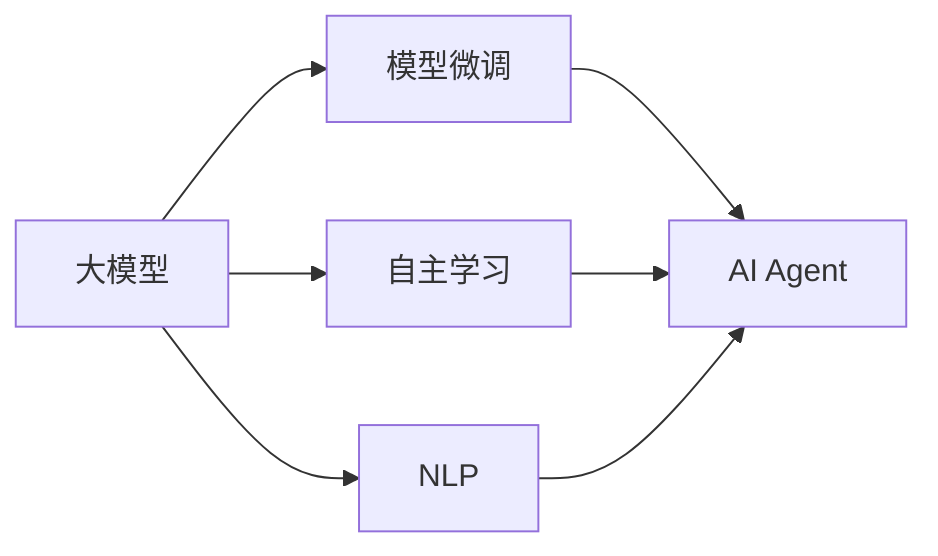

                 

# 【大模型应用开发 动手做AI Agent】自主创建页面标题

> 关键词：大模型,AI Agent,自主创建,应用开发,动手实践

## 1. 背景介绍

### 1.1 问题由来
近年来，随着深度学习技术的快速发展，大模型在自然语言处理（NLP）、计算机视觉（CV）、推荐系统等领域取得了显著的进展。这些模型通过大规模的预训练和微调，具备了强大的泛化能力和适应性，可以应用于各种复杂的应用场景中。AI Agent 作为大模型应用的一个重要方向，通过自主学习和决策，能够执行各种任务，从简单的信息检索到复杂的智能客服，都有着广泛的应用前景。然而，大模型的训练和部署通常需要大量的计算资源和专业知识，对于普通开发者而言，构建和使用AI Agent 仍然存在一定的难度。

### 1.2 问题核心关键点
本文旨在帮助读者从零开始，系统地介绍如何构建和使用AI Agent，包括开发环境搭建、模型训练、参数调优、实际应用等关键环节。通过详细讲解AI Agent的原理和实现步骤，读者可以掌握自主创建AI Agent的核心技术和实践经验，从而在实际应用中灵活应用和优化模型，构建出高效、智能的AI Agent。

### 1.3 问题研究意义
掌握大模型应用开发技能，对于推动AI技术的落地和应用，具有重要意义：
- **降低开发成本**：通过自主创建AI Agent，减少对第三方模型的依赖，降低开发和部署成本。
- **提升系统性能**：通过调整模型参数和优化算法，提升AI Agent的推理速度和准确性。
- **实现定制化**：根据具体任务需求，定制化开发AI Agent，更好地满足用户需求。
- **加速创新**：掌握大模型应用开发的技巧，能够更快地进行技术迭代和创新。
- **应用场景广泛**：AI Agent可以应用于智能客服、推荐系统、智能搜索等多个领域，提升业务效率和用户体验。

## 2. 核心概念与联系

### 2.1 核心概念概述

AI Agent，也称为智能体，是指具有自主决策能力的软件系统。它通过感知环境、处理信息、做出决策和执行行动，完成预定的任务。在AI Agent构建过程中，大模型是一个重要的组件，用于提供语言理解、推理、生成等能力，从而帮助AI Agent更好地理解和响应环境变化。

- **大模型**：指通过大规模预训练和微调获得强大能力的模型，如BERT、GPT-3等。大模型通常具有丰富的语言知识和常识，可以处理自然语言文本、图像、视频等多种数据类型。
- **模型微调**：在大模型基础上，通过有监督数据进行微调，调整模型参数，使其适应特定任务。微调可以显著提升模型在特定任务上的性能。
- **自主学习**：指AI Agent通过与环境的交互，自主学习知识和规则，从而适应新情况。
- **自然语言处理（NLP）**：研究计算机如何理解和生成人类语言的领域，包括语言理解、生成、分析等。

这些概念之间的关系可以通过以下Mermaid流程图来展示：



这个流程图展示了各概念之间的逻辑关系：

1. 大模型通过预训练和微调获得语言和常识。
2. 模型微调使大模型适应特定任务。
3. 自主学习使AI Agent能够与环境交互，更新知识。
4. NLP为AI Agent提供语言理解和生成的能力。

## 3. 核心算法原理 & 具体操作步骤

### 3.1 算法原理概述

AI Agent构建过程中，核心算法包括模型微调和自主学习。以下是这两个算法的详细介绍：

#### 3.1.1 模型微调

模型微调是大模型应用开发的重要环节。其基本原理是通过有监督数据，调整模型参数，使其在特定任务上表现更佳。模型微调分为两个步骤：

1. **预训练**：在大规模无标签数据上预训练大模型，学习通用的语言知识和常识。
2. **微调**：在特定任务的数据集上，通过有监督学习，调整模型参数，使其适应该任务。

#### 3.1.2 自主学习

自主学习是指AI Agent通过与环境的交互，不断学习和适应新情况的能力。其主要算法包括强化学习、蒙特卡罗树搜索（MCTS）等。

- **强化学习**：通过奖励和惩罚机制，引导AI Agent学习最优策略。AI Agent通过不断试错，逐步优化决策过程。
- **蒙特卡罗树搜索（MCTS）**：通过模拟环境中的决策过程，评估不同策略的效果，选择最优策略。

### 3.2 算法步骤详解

AI Agent的构建涉及多个步骤，包括开发环境搭建、模型训练、参数调优和实际应用等。

#### 3.2.1 开发环境搭建

1. **安装Python**：在Windows系统上，从官网下载Python安装程序，按照提示安装。
2. **安装PyTorch和TorchVision**：在Python环境下，使用pip安装PyTorch和TorchVision，用于深度学习模型开发。
3. **安装TensorBoard**：使用pip安装TensorBoard，用于模型训练过程中的监控和可视化。

#### 3.2.2 模型训练

1. **选择预训练模型**：选择合适的预训练模型，如BERT、GPT等。
2. **准备数据集**：准备训练数据集和验证数据集，确保数据集的分布与模型训练目标一致。
3. **定义模型**：使用PyTorch或TensorFlow等框架，定义模型结构，并设置相关参数。
4. **定义损失函数**：根据任务类型，定义合适的损失函数，如交叉熵损失、均方误差损失等。
5. **训练模型**：在数据集上进行多轮训练，调整模型参数，使其在验证集上表现最佳。

#### 3.2.3 参数调优

1. **选择优化器**：选择合适的优化器，如SGD、Adam等，并设置学习率。
2. **正则化技术**：使用L2正则、Dropout等技术，防止过拟合。
3. **超参数调整**：通过网格搜索或随机搜索，调整学习率、批大小等超参数，优化模型性能。

#### 3.2.4 实际应用

1. **环境部署**：将训练好的模型部署到目标环境中，如Web应用、移动应用等。
2. **用户交互**：开发用户界面，使用户能够与AI Agent进行交互。
3. **数据收集与反馈**：收集用户交互数据，进行模型优化和改进。

### 3.3 算法优缺点

#### 3.3.1 优点

- **通用性**：大模型具备通用的语言和常识，可以应用于多种NLP任务。
- **高效性**：通过预训练和微调，模型可以快速适应特定任务，减少从头开发的时间和成本。
- **灵活性**：可以通过调整模型参数和算法，适应不同的应用场景和需求。

#### 3.3.2 缺点

- **依赖数据**：模型微调和自主学习依赖于标注数据和环境反馈，数据获取成本较高。
- **计算资源要求高**：大规模模型的训练和部署需要高性能计算资源，成本较高。
- **可解释性不足**：模型的决策过程往往难以解释，存在一定的黑盒问题。

### 3.4 算法应用领域

AI Agent在多个领域都有广泛的应用，以下是几个典型的应用场景：

1. **智能客服**：AI Agent可以处理客户的咨询和投诉，提供24小时不间断的服务。通过微调和自主学习，AI Agent能够理解复杂的客户需求，并提供满意的解决方案。
2. **智能推荐**：AI Agent可以分析用户的历史行为数据，提供个性化的推荐服务。通过微调和自主学习，AI Agent能够实时更新推荐策略，提高推荐效果。
3. **智能搜索**：AI Agent可以理解用户的查询意图，提供高效的搜索结果。通过微调和自主学习，AI Agent能够不断优化搜索结果，提升用户体验。
4. **智能医疗**：AI Agent可以辅助医生进行疾病诊断和治疗方案推荐。通过微调和自主学习，AI Agent能够利用最新的医学知识，提高诊断和治疗的准确性。

## 4. 数学模型和公式 & 详细讲解 & 举例说明

### 4.1 数学模型构建

AI Agent的构建涉及多个数学模型，包括预训练模型、微调模型和自主学习模型。以下是这些模型的详细构建过程。

#### 4.1.1 预训练模型

预训练模型通过在大规模无标签数据上进行自监督学习，学习通用的语言知识和常识。以BERT为例，其基本原理是通过掩码语言模型（Masked Language Model）和下一句预测（Next Sentence Prediction）任务进行预训练。

- **掩码语言模型**：在输入文本中随机掩码部分词语，预测被掩码词语的上下文。
- **下一句预测**：判断两个句子是否为连续的相邻句子。

预训练模型的一般形式如下：

$$
p(w_1, w_2, ..., w_n) = \prod_{i=1}^n p(w_i | w_{<i})
$$

其中，$w_1, w_2, ..., w_n$ 为输入文本的词语序列，$p(w_i | w_{<i})$ 为词语 $w_i$ 的条件概率。

#### 4.1.2 微调模型

微调模型通过有监督数据进行优化，使其适应特定任务。以分类任务为例，其基本流程如下：

1. **数据准备**：准备训练数据集和验证数据集，确保数据集的分布与模型训练目标一致。
2. **模型定义**：使用PyTorch或TensorFlow等框架，定义模型结构，并设置相关参数。
3. **损失函数定义**：根据任务类型，定义合适的损失函数，如交叉熵损失。
4. **模型训练**：在数据集上进行多轮训练，调整模型参数，使其在验证集上表现最佳。

### 4.2 公式推导过程

#### 4.2.1 预训练模型公式推导

以BERT为例，其预训练模型的掩码语言模型和下一句预测任务可以表示为：

- **掩码语言模型**：

$$
L_{mask} = -\frac{1}{N} \sum_{i=1}^N \sum_{j=1}^L \sum_{k=1}^N (y_{ij} \log(p(w_i)) + (1-y_{ij}) \log(1-p(w_i)))
$$

其中，$L$ 为词语序列的长度，$N$ 为词语总数，$y_{ij}$ 为第 $j$ 个词语是否被掩码的标记。

- **下一句预测**：

$$
L_{next} = -\frac{1}{N} \sum_{i=1}^N (y_i \log(p(w_2|w_1)) + (1-y_i) \log(1-p(w_2|w_1)))
$$

其中，$y_i$ 为第 $i$ 个句子是否为连续的相邻句子的标记。

#### 4.2.2 微调模型公式推导

以分类任务为例，其微调模型的损失函数可以表示为：

$$
L_{fine-tune} = -\frac{1}{N} \sum_{i=1}^N \sum_{j=1}^L y_i \log(p(y_i|w_1, w_2, ..., w_n))
$$

其中，$y_i$ 为第 $i$ 个样本的真实标签，$p(y_i|w_1, w_2, ..., w_n)$ 为模型预测的条件概率。

### 4.3 案例分析与讲解

以情感分析任务为例，其数据集包含文本和对应的情感标签。通过微调模型，可以训练出能够自动识别文本情感的AI Agent。

1. **数据准备**：收集情感分析数据集，将其划分为训练集和验证集。
2. **模型定义**：使用BERT作为预训练模型，在其顶部添加一个全连接层，用于分类任务。
3. **损失函数定义**：使用交叉熵损失函数，表示模型预测值与真实标签之间的差异。
4. **模型训练**：在训练集上进行多轮训练，调整模型参数，使其在验证集上表现最佳。
5. **评估模型**：在测试集上评估模型的性能，计算准确率、召回率等指标。

## 5. 项目实践：代码实例和详细解释说明

### 5.1 开发环境搭建

1. **安装Python**：在Windows系统上，从官网下载Python安装程序，按照提示安装。
2. **安装PyTorch和TorchVision**：在Python环境下，使用pip安装PyTorch和TorchVision，用于深度学习模型开发。
3. **安装TensorBoard**：使用pip安装TensorBoard，用于模型训练过程中的监控和可视化。

### 5.2 源代码详细实现

以下是使用PyTorch构建情感分析任务的代码实现：

```python
import torch
import torch.nn as nn
import torch.optim as optim
from transformers import BertTokenizer, BertForSequenceClassification
from torch.utils.data import DataLoader, RandomSampler, SequentialSampler
from tqdm import tqdm

# 定义模型结构
class BertClassifier(nn.Module):
    def __init__(self, num_labels):
        super(BertClassifier, self).__init__()
        self.bert = BertForSequenceClassification.from_pretrained('bert-base-uncased', num_labels=num_labels)
        self.dropout = nn.Dropout(0.1)
        self.out = nn.Linear(768, num_labels)

    def forward(self, input_ids, attention_mask):
        features = self.bert(input_ids, attention_mask=attention_mask)
        pooled_output = features.pooler_output
        output = self.dropout(pooled_output)
        output = self.out(output)
        return output

# 准备数据集
tokenizer = BertTokenizer.from_pretrained('bert-base-uncased')
train_dataset = torch.utils.data.TensorDataset(train_ids, train_labels)
val_dataset = torch.utils.data.TensorDataset(val_ids, val_labels)
test_dataset = torch.utils.data.TensorDataset(test_ids, test_labels)

# 定义模型、优化器和损失函数
model = BertClassifier(num_labels)
optimizer = optim.Adam(model.parameters(), lr=2e-5)
criterion = nn.CrossEntropyLoss()

# 训练模型
epochs = 3
batch_size = 16

for epoch in range(epochs):
    model.train()
    total_loss = 0
    for batch in tqdm(data_loader, total=len(data_loader)):
        input_ids = batch[0]
        attention_mask = batch[1]
        labels = batch[2]
        output = model(input_ids, attention_mask)
        loss = criterion(output, labels)
        optimizer.zero_grad()
        loss.backward()
        optimizer.step()
        total_loss += loss.item()

    print(f'Epoch {epoch+1}, training loss: {total_loss/len(data_loader)}')

# 评估模型
model.eval()
total_loss = 0
total_correct = 0

for batch in tqdm(data_loader, total=len(data_loader)):
    input_ids = batch[0]
    attention_mask = batch[1]
    labels = batch[2]
    output = model(input_ids, attention_mask)
    loss = criterion(output, labels)
    total_loss += loss.item()
    total_correct += (output.argmax(dim=1) == labels).sum().item()

print(f'Test loss: {total_loss/len(data_loader)}')
print(f'Test accuracy: {total_correct/len(data_loader)}')
```

### 5.3 代码解读与分析

**BERTClassifier类**：
- 定义了BERT分类器的结构，包括BERT模型、Dropout层和线性输出层。

**train_dataset、val_dataset和test_dataset**：
- 使用PyTorch的TensorDataset将训练数据、验证数据和测试数据转换为Tensor数据集，方便模型训练和评估。

**model、optimizer和criterion**：
- 定义了模型结构、优化器和损失函数，用于训练和评估模型。

**训练和评估函数**：
- 使用PyTorch的DataLoader对数据集进行批次化加载，供模型训练和推理使用。
- 训练函数定义了模型在数据集上的前向传播和反向传播过程，以及优化器的更新。
- 评估函数在测试集上计算模型的预测准确率和损失。

**运行结果展示**：
- 训练函数输出每轮训练的平均损失。
- 评估函数输出测试集的平均损失和准确率。

## 6. 实际应用场景

### 6.1 智能客服系统

智能客服系统通过微调BERT模型，能够自动理解客户咨询，提供24小时不间断的智能客服服务。通过不断的交互和反馈，AI Agent能够不断提高自身的理解和回复能力，更好地满足客户需求。

### 6.2 金融舆情监测

金融舆情监测系统通过微调BERT模型，能够自动监测网络上的金融舆情信息，及时发现舆情变化，提供风险预警。通过微调模型，系统能够识别出舆情中的关键信息和情感倾向，帮助金融机构及时采取应对措施。

### 6.3 个性化推荐系统

个性化推荐系统通过微调BERT模型，能够根据用户的历史行为和偏好，生成个性化的推荐内容。通过不断的学习和优化，AI Agent能够不断调整推荐策略，提升推荐效果。

### 6.4 未来应用展望

随着大模型和微调技术的发展，AI Agent将在更多领域得到应用，为各行各业带来新的创新和变革。未来的AI Agent将具备更强的自主学习和决策能力，能够适应更复杂的应用场景和任务需求。

## 7. 工具和资源推荐

### 7.1 学习资源推荐

为了帮助开发者系统掌握大模型应用开发的技术，以下是一些推荐的学习资源：

1. **《Transformer from Theory to Practice》**：由大模型技术专家撰写，深入浅出地介绍了Transformer原理、BERT模型、微调技术等前沿话题。
2. **CS224N《Deep Learning for NLP》**：斯坦福大学开设的NLP明星课程，有Lecture视频和配套作业，带你入门NLP领域的基本概念和经典模型。
3. **《Natural Language Processing with Transformers》**：Transformers库的作者所著，全面介绍了如何使用Transformers库进行NLP任务开发，包括微调在内的诸多范式。
4. **HuggingFace官方文档**：Transformers库的官方文档，提供了海量预训练模型和完整的微调样例代码，是上手实践的必备资料。
5. **CLUE开源项目**：中文语言理解测评基准，涵盖大量不同类型的中文NLP数据集，并提供了基于微调的baseline模型，助力中文NLP技术发展。

### 7.2 开发工具推荐

高效的大模型应用开发离不开优质的工具支持。以下是几款用于大模型应用开发的常用工具：

1. **PyTorch**：基于Python的开源深度学习框架，灵活动态的计算图，适合快速迭代研究。
2. **TensorFlow**：由Google主导开发的开源深度学习框架，生产部署方便，适合大规模工程应用。
3. **Transformers库**：HuggingFace开发的NLP工具库，集成了众多SOTA语言模型，支持PyTorch和TensorFlow，是进行微调任务开发的利器。
4. **Weights & Biases**：模型训练的实验跟踪工具，可以记录和可视化模型训练过程中的各项指标，方便对比和调优。
5. **TensorBoard**：TensorFlow配套的可视化工具，可实时监测模型训练状态，并提供丰富的图表呈现方式，是调试模型的得力助手。
6. **Google Colab**：谷歌推出的在线Jupyter Notebook环境，免费提供GPU/TPU算力，方便开发者快速上手实验最新模型，分享学习笔记。

### 7.3 相关论文推荐

大模型和微调技术的发展源于学界的持续研究。以下是几篇奠基性的相关论文，推荐阅读：

1. **Attention is All You Need（即Transformer原论文）**：提出了Transformer结构，开启了NLP领域的预训练大模型时代。
2. **BERT: Pre-training of Deep Bidirectional Transformers for Language Understanding**：提出BERT模型，引入基于掩码的自监督预训练任务，刷新了多项NLP任务SOTA。
3. **Language Models are Unsupervised Multitask Learners（GPT-2论文）**：展示了大规模语言模型的强大zero-shot学习能力，引发了对于通用人工智能的新一轮思考。
4. **Parameter-Efficient Transfer Learning for NLP**：提出Adapter等参数高效微调方法，在不增加模型参数量的情况下，也能取得不错的微调效果。
5. **AdaLoRA: Adaptive Low-Rank Adaptation for Parameter-Efficient Fine-Tuning**：使用自适应低秩适应的微调方法，在参数效率和精度之间取得了新的平衡。

这些论文代表了大模型微调技术的发展脉络。通过学习这些前沿成果，可以帮助研究者把握学科前进方向，激发更多的创新灵感。

## 8. 总结：未来发展趋势与挑战

### 8.1 研究成果总结

本文对大模型应用开发的AI Agent进行了全面系统的介绍，涵盖了大模型的原理、模型微调、自主学习等多个关键环节。通过详细讲解AI Agent的构建流程和实现步骤，读者可以掌握自主创建AI Agent的核心技术和实践经验，从而在实际应用中灵活应用和优化模型，构建出高效、智能的AI Agent。

### 8.2 未来发展趋势

未来，大模型应用开发将呈现以下几个发展趋势：

1. **模型规模持续增大**：随着算力成本的下降和数据规模的扩张，预训练语言模型的参数量还将持续增长。超大规模语言模型蕴含的丰富语言知识，有望支撑更加复杂多变的下游任务微调。
2. **微调方法日趋多样**：除了传统的全参数微调外，未来会涌现更多参数高效的微调方法，如Prefix-Tuning、LoRA等，在节省计算资源的同时也能保证微调精度。
3. **持续学习成为常态**：随着数据分布的不断变化，微调模型也需要持续学习新知识以保持性能。如何在不遗忘原有知识的同时，高效吸收新样本信息，将成为重要的研究课题。
4. **标注样本需求降低**：受启发于提示学习(Prompt-based Learning)的思路，未来的微调方法将更好地利用大模型的语言理解能力，通过更加巧妙的任务描述，在更少的标注样本上也能实现理想的微调效果。
5. **多模态微调崛起**：当前的微调主要聚焦于纯文本数据，未来会进一步拓展到图像、视频、语音等多模态数据微调。多模态信息的融合，将显著提升语言模型对现实世界的理解和建模能力。
6. **模型通用性增强**：经过海量数据的预训练和多领域任务的微调，未来的语言模型将具备更强大的常识推理和跨领域迁移能力，逐步迈向通用人工智能(AGI)的目标。

### 8.3 面临的挑战

尽管大模型应用开发已经取得了瞩目成就，但在迈向更加智能化、普适化应用的过程中，仍面临诸多挑战：

1. **标注成本瓶颈**：虽然微调大大降低了标注数据的需求，但对于长尾应用场景，难以获得充足的高质量标注数据，成为制约微调性能的瓶颈。如何进一步降低微调对标注样本的依赖，将是一大难题。
2. **模型鲁棒性不足**：当前微调模型面对域外数据时，泛化性能往往大打折扣。对于测试样本的微小扰动，微调模型的预测也容易发生波动。如何提高微调模型的鲁棒性，避免灾难性遗忘，还需要更多理论和实践的积累。
3. **推理效率有待提高**：大规模语言模型虽然精度高，但在实际部署时往往面临推理速度慢、内存占用大等效率问题。如何在保证性能的同时，简化模型结构，提升推理速度，优化资源占用，将是重要的优化方向。
4. **可解释性亟需加强**：当前微调模型往往像"黑盒"系统，难以解释其内部工作机制和决策逻辑。对于医疗、金融等高风险应用，算法的可解释性和可审计性尤为重要。如何赋予微调模型更强的可解释性，将是亟待攻克的难题。
5. **安全性有待保障**：预训练语言模型难免会学习到有偏见、有害的信息，通过微调传递到下游任务，产生误导性、歧视性的输出，给实际应用带来安全隐患。如何从数据和算法层面消除模型偏见，避免恶意用途，确保输出的安全性，也将是重要的研究课题。
6. **知识整合能力不足**：现有的微调模型往往局限于任务内数据，难以灵活吸收和运用更广泛的先验知识。如何让微调过程更好地与外部知识库、规则库等专家知识结合，形成更加全面、准确的信息整合能力，还有很大的想象空间。

### 8.4 研究展望

面向未来，大模型应用开发的研究需要在以下几个方面寻求新的突破：

1. **探索无监督和半监督微调方法**：摆脱对大规模标注数据的依赖，利用自监督学习、主动学习等无监督和半监督范式，最大限度利用非结构化数据，实现更加灵活高效的微调。
2. **研究参数高效和计算高效的微调范式**：开发更加参数高效的微调方法，在固定大部分预训练参数的同时，只更新极少量的任务相关参数。同时优化微调模型的计算图，减少前向传播和反向传播的资源消耗，实现更加轻量级、实时性的部署。
3. **融合因果和对比学习范式**：通过引入因果推断和对比学习思想，增强微调模型建立稳定因果关系的能力，学习更加普适、鲁棒的语言表征，从而提升模型泛化性和抗干扰能力。
4. **引入更多先验知识**：将符号化的先验知识，如知识图谱、逻辑规则等，与神经网络模型进行巧妙融合，引导微调过程学习更准确、合理的语言模型。同时加强不同模态数据的整合，实现视觉、语音等多模态信息与文本信息的协同建模。
5. **结合因果分析和博弈论工具**：将因果分析方法引入微调模型，识别出模型决策的关键特征，增强输出解释的因果性和逻辑性。借助博弈论工具刻画人机交互过程，主动探索并规避模型的脆弱点，提高系统稳定性。
6. **纳入伦理道德约束**：在模型训练目标中引入伦理导向的评估指标，过滤和惩罚有偏见、有害的输出倾向。同时加强人工干预和审核，建立模型行为的监管机制，确保输出符合人类价值观和伦理道德。

这些研究方向的探索，必将引领大模型应用开发技术迈向更高的台阶，为构建安全、可靠、可解释、可控的智能系统铺平道路。面向未来，大模型应用开发技术还需要与其他人工智能技术进行更深入的融合，如知识表示、因果推理、强化学习等，多路径协同发力，共同推动自然语言理解和智能交互系统的进步。只有勇于创新、敢于突破，才能不断拓展语言模型的边界，让智能技术更好地造福人类社会。

## 9. 附录：常见问题与解答

**Q1: 大模型应用开发是否适用于所有NLP任务？**

A: 大模型应用开发在大多数NLP任务上都能取得不错的效果，特别是对于数据量较小的任务。但对于一些特定领域的任务，如医学、法律等，仅仅依靠通用语料预训练的模型可能难以很好地适应。此时需要在特定领域语料上进一步预训练，再进行微调，才能获得理想效果。此外，对于一些需要时效性、个性化很强的任务，如对话、推荐等，微调方法也需要针对性的改进优化。

**Q2: 如何选择合适的学习率？**

A: 学习率一般要比预训练时小1-2个数量级，如果使用过大的学习率，容易破坏预训练权重，导致过拟合。一般建议从1e-5开始调参，逐步减小学习率，直至收敛。也可以使用warmup策略，在开始阶段使用较小的学习率，再逐渐过渡到预设值。需要注意的是，不同的优化器(如AdamW、Adafactor等)以及不同的学习率调度策略，可能需要设置不同的学习率阈值。

**Q3: 采用大模型应用开发时会面临哪些资源瓶颈？**

A: 目前主流的预训练大模型动辄以亿计的参数规模，对算力、内存、存储都提出了很高的要求。GPU/TPU等高性能设备是必不可少的，但即便如此，超大批次的训练和推理也可能遇到显存不足的问题。因此需要采用一些资源优化技术，如梯度积累、混合精度训练、模型并行等，来突破硬件瓶颈。同时，模型的存储和读取也可能占用大量时间和空间，需要采用模型压缩、稀疏化存储等方法进行优化。

**Q4: 如何缓解微调过程中的过拟合问题？**

A: 过拟合是微调面临的主要挑战，尤其是在标注数据不足的情况下。常见的缓解策略包括：
1. 数据增强：通过回译、近义替换等方式扩充训练集
2. 正则化技术：使用L2正则、Dropout、Early Stopping等避免过拟合
3. 对抗训练：引入对抗样本，提高模型鲁棒性
4. 参数高效微调：只调整少量参数(如Adapter、Prefix等)，减小过拟合风险
5. 多模型集成：训练多个微调模型，取平均输出，抑制过拟合

这些策略往往需要根据具体任务和数据特点进行灵活组合。只有在数据、模型、训练、推理等各环节进行全面优化，才能最大限度地发挥大模型应用开发的威力。

**Q5: 微调模型在落地部署时需要注意哪些问题？**

A: 将微调模型转化为实际应用，还需要考虑以下因素：
1. 模型裁剪：去除不必要的层和参数，减小模型尺寸，加快推理速度
2. 量化加速：将浮点模型转为定点模型，压缩存储空间，提高计算效率
3. 服务化封装：将模型封装为标准化服务接口，便于集成调用
4. 弹性伸缩：根据请求流量动态调整资源配置，平衡服务质量和成本
5. 监控告警：实时采集系统指标，设置异常告警阈值，确保服务稳定性
6. 安全防护：采用访问鉴权、数据脱敏等措施，保障数据和模型安全

大模型应用开发为NLP应用开启了广阔的想象空间，但如何将强大的性能转化为稳定、高效、安全的业务价值，还需要工程实践的不断打磨。唯有从数据、算法、工程、业务等多个维度协同发力，才能真正实现人工智能技术在垂直行业的规模化落地。总之，微调需要开发者根据具体任务，不断迭代和优化模型、数据和算法，方能得到理想的效果。

---

作者：禅与计算机程序设计艺术 / Zen and the Art of Computer Programming

