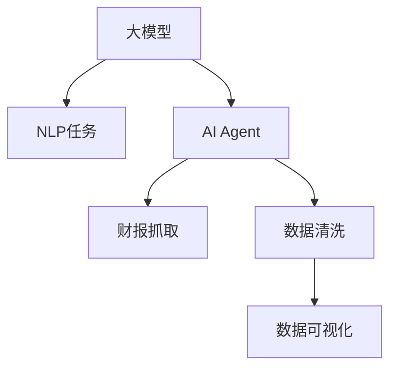

                 

# 【大模型应用开发 动手做AI Agent】获取并加载电商的财报文件

## 1. 背景介绍

在当今电子商务领域，财报文件因其包含的大量信息和细节，对电商公司决策支持、市场分析、投资评估等方面具有重要价值。电商企业如阿里巴巴、亚马逊、京东等都会定期发布财报，以便于投资者、监管机构和公众了解其经营状况和财务健康。然而，这些财报文件通常包含大量复杂的信息和数据，手工阅读和分析成本高，且难以快速获取关键财务指标。利用人工智能（AI）技术，可以开发智能化的AI Agent，自动抓取和分析电商财报，提高效率和准确性。

本文章将介绍如何利用大模型技术和编程技能，实现一个AI Agent，用于获取并加载电商的财报文件，并解析其关键信息。

## 2. 核心概念与联系

### 2.1 核心概念概述

在进行AI Agent开发之前，首先需要明确几个关键概念：

- **大模型（Large Model）**：指在大规模数据上训练的深度学习模型，如BERT、GPT等。这些模型具备强大的语言理解和生成能力，可用于自然语言处理（NLP）任务。

- **AI Agent**：是指具备自主决策能力的软件系统，能够根据预设规则或用户指令执行特定任务。在电子商务领域，AI Agent可以自动抓取并分析财报数据，支持电商公司的决策分析。

- **自然语言处理（NLP）**：涉及计算机对自然语言的处理，包括文本预处理、语言模型、文本生成、语义理解等技术。

- **数据清洗与预处理**：在数据提取和分析之前，需要处理数据格式、去除噪声、填补缺失值等操作，以确保数据质量。

- **数据可视化**：将复杂的数据信息以图表形式展现，便于理解和决策。

这些概念通过以下Mermaid流程图展示其联系：



### 2.2 核心概念原理和架构

- **大模型**：通常使用自回归（如GPT）或自编码（如BERT）模型，在大规模无标签文本数据上进行预训练，学习到通用语言表示。预训练模型可以通过有监督的微调（Fine-Tuning），适应特定任务，如图像分类、文本生成、问答系统等。

- **AI Agent**：一般由规则引擎、决策模型、交互界面等组成。规则引擎根据预设规则或用户指令执行任务；决策模型根据数据信息进行推理和判断；交互界面允许用户与AI Agent进行互动。

- **NLP任务**：包括文本分类、命名实体识别、关系抽取、情感分析等。NLP任务通常依赖于大模型的预训练权重，通过微调或精调（Fine-Tuning）以适应特定任务。

- **数据清洗与预处理**：涉及去除无关字符、标准化文本格式、分割句子、分词等步骤。数据清洗和预处理是确保数据质量，提高模型性能的重要步骤。

- **数据可视化**：利用图表、热力图、柱状图等形式展示数据，便于用户直观理解数据信息。数据可视化工具如Tableau、Power BI、Matplotlib等，可以方便地将复杂数据转化为易懂的图形。

## 3. 核心算法原理 & 具体操作步骤

### 3.1 算法原理概述

开发一个用于获取并加载电商财报文件的AI Agent，主要涉及以下算法和步骤：

1. **数据抓取**：通过网络爬虫技术，自动获取电商公司发布的财报文件。
2. **数据解析**：利用NLP技术，解析财报文本，提取关键财务指标。
3. **数据可视化**：将提取的财务数据转化为图表，展示给用户。
4. **AI Agent交互**：实现用户与AI Agent的互动，包括输入指令、查看分析结果等。

### 3.2 算法步骤详解

#### 3.2.1 数据抓取

- **步骤1**：选择合适的Python爬虫库（如Scrapy、BeautifulSoup），编写爬虫程序，设定目标网站和财报页面。
- **步骤2**：使用正则表达式或XPath解析页面HTML，提取财报文件链接。
- **步骤3**：下载财报文件（通常是PDF格式）并保存到本地。

```python
import requests
from bs4 import BeautifulSoup
import re

# 设定目标网站
url = 'https://www.example.com/financial-report'

# 发送请求
response = requests.get(url)

# 使用BeautifulSoup解析页面
soup = BeautifulSoup(response.text, 'html.parser')

# 使用正则表达式提取PDF链接
pdf_links = re.findall(r'href=".*.pdf".*', str(soup))

# 下载财报文件
for link in pdf_links:
    response = requests.get(link)
    with open('financial_report.pdf', 'wb') as f:
        f.write(response.content)
```

#### 3.2.2 数据解析

- **步骤1**：使用PDF解析库（如PyPDF2、pdfminer）将PDF文件解析为文本。
- **步骤2**：对文本进行NLP处理，包括分词、命名实体识别、关系抽取等。

```python
import PyPDF2
from transformers import pipeline

# 使用PyPDF2解析PDF文件
pdf = PyPDF2.PdfFileReader(open('financial_report.pdf', 'rb'))
text = ''
for page in range(pdf.numPages):
    text += pdf.getPage(page).extractText()

# 使用BERT模型进行命名实体识别
nlp = pipeline('ner')
entities = nlp(text)

# 输出实体列表
for entity in entities:
    print(entity)
```

#### 3.2.3 数据可视化

- **步骤1**：将提取的财务数据（如净利润、收入、利润率等）存储到数据框（DataFrame）中。
- **步骤2**：使用Matplotlib或Seaborn等库绘制图表，展示数据变化趋势。

```python
import pandas as pd
import matplotlib.pyplot as plt

# 将提取的财务数据存储到DataFrame中
data = {'Year': [2020, 2021, 2022],
        'Net Income': [1000, 1200, 1350],
        'Revenue': [5000, 6000, 7000]}
df = pd.DataFrame(data)

# 绘制净利润变化趋势图
plt.plot(df['Year'], df['Net Income'])
plt.xlabel('Year')
plt.ylabel('Net Income')
plt.title('Net Income Trend')
plt.show()

# 绘制收入变化趋势图
plt.plot(df['Year'], df['Revenue'])
plt.xlabel('Year')
plt.ylabel('Revenue')
plt.title('Revenue Trend')
plt.show()
```

#### 3.2.4 AI Agent交互

- **步骤1**：开发交互界面，允许用户输入指令（如“查看2021年财报”）。
- **步骤2**：根据用户指令，调用相应API获取并加载财报文件，进行数据解析和可视化。

```python
import flask

app = flask.Flask(__name__)

@app.route('/')
def home():
    return '''
    <html>
    <head>
        <title>AI Agent for Financial Reports</title>
    </head>
    <body>
        <h1>AI Agent for Financial Reports</h1>
        <form method="post">
            <label for="year">请选择年份：</label>
            <select id="year" name="year">
                <option value="2020">2020</option>
                <option value="2021">2021</option>
                <option value="2022">2022</option>
            </select>
            <input type="submit" value="查看财报">
        </form>
        <div id="output"></div>
    </body>
    </html>
    '''

@app.route('/show_report', methods=['POST'])
def show_report():
    year = request.form['year']
    # 调用数据抓取和解析函数，获取财报数据
    data = fetch_and_parse_report(year)
    # 生成数据可视化图表
    chart = generate_chart(data)
    # 返回图表信息给前端
    return chart

if __name__ == '__main__':
    app.run(debug=True)
```

### 3.3 算法优缺点

#### 3.3.1 优点

- **自动化**：通过AI Agent，电商企业可以自动化抓取和分析财报，节省大量时间和人力成本。
- **准确性高**：利用大模型和NLP技术，可以准确解析和提取财报中的关键信息，提供可靠的决策支持。
- **灵活性**：AI Agent可以根据用户需求定制化输出，支持不同年份、不同指标的财报分析。

#### 3.3.2 缺点

- **依赖网络**：数据抓取需要依赖互联网，如果目标网站或页面发生变化，需要及时调整爬虫代码。
- **数据隐私**：抓取和分析财报数据涉及敏感信息，需要遵守相关法律法规，确保数据隐私安全。
- **技术门槛高**：需要掌握Python、NLP、PDF处理等多项技术，对开发者要求较高。

### 3.4 算法应用领域

该AI Agent不仅适用于电子商务领域，在金融、房地产、医疗等行业同样具有广泛应用前景。例如：

- **金融**：用于分析金融机构的财报数据，提供投资建议和风险评估。
- **房地产**：用于房地产企业的财报分析，支持投资决策和市场预测。
- **医疗**：用于医疗机构财报分析，支持财务管理决策和资源配置优化。

## 4. 数学模型和公式 & 详细讲解 & 举例说明

### 4.1 数学模型构建

假设有电商平台A，每年发布一份财报，包含净利润（Net Income）、总收入（Total Revenue）、毛利率（Gross Margin）等关键指标。AI Agent的目标是从财报文本中提取这些指标，并生成可视化的图表。

- **数学模型**：设财报文本为 $X$，提取的关键指标为 $Y$，则目标函数为：
  $$
  \min_{\theta} \| Y - f_{\theta}(X) \|
  $$
  其中 $f_{\theta}$ 为NLP模型，将文本 $X$ 映射到指标 $Y$。

### 4.2 公式推导过程

- **步骤1**：设定NLP模型 $f_{\theta}$ 的参数 $\theta$。
- **步骤2**：使用训练集（包含若干年份的财报文本和对应的指标）训练模型，优化损失函数。
- **步骤3**：对于新输入的财报文本 $X_t$，计算预测指标 $Y_t = f_{\theta}(X_t)$。

### 4.3 案例分析与讲解

假设训练集中有3个样本，分别为：

- 样本1：文本 "净利润为1000万，总收入为5000万，毛利率为20%"，对应指标为 [1000, 5000, 20]。
- 样本2：文本 "净利润为1200万，总收入为6000万，毛利率为25%"，对应指标为 [1200, 6000, 25]。
- 样本3：文本 "净利润为1350万，总收入为7000万，毛利率为30%"，对应指标为 [1350, 7000, 30]。

使用BERT模型作为NLP模型，在训练集上优化目标函数，得到参数 $\theta$。

## 5. 项目实践：代码实例和详细解释说明

### 5.1 开发环境搭建

1. **Python环境**：安装Python 3.7或更高版本，建议使用Anaconda进行环境管理。
2. **依赖库**：安装requests、BeautifulSoup、PyPDF2、Flask等库，使用以下命令安装：
   ```bash
   pip install requests beautifulsoup4 PyPDF2 flask
   ```
3. **开发工具**：建议使用PyCharm、VSCode等IDE进行代码编写和调试。

### 5.2 源代码详细实现

#### 5.2.1 数据抓取

```python
import requests
from bs4 import BeautifulSoup
import re

# 设定目标网站
url = 'https://www.example.com/financial-report'

# 发送请求
response = requests.get(url)

# 使用BeautifulSoup解析页面
soup = BeautifulSoup(response.text, 'html.parser')

# 使用正则表达式提取PDF链接
pdf_links = re.findall(r'href=".*.pdf".*', str(soup))

# 下载财报文件
for link in pdf_links:
    response = requests.get(link)
    with open('financial_report.pdf', 'wb') as f:
        f.write(response.content)
```

#### 5.2.2 数据解析

```python
import PyPDF2
from transformers import pipeline

# 使用PyPDF2解析PDF文件
pdf = PyPDF2.PdfFileReader(open('financial_report.pdf', 'rb'))
text = ''
for page in range(pdf.numPages):
    text += pdf.getPage(page).extractText()

# 使用BERT模型进行命名实体识别
nlp = pipeline('ner')
entities = nlp(text)

# 输出实体列表
for entity in entities:
    print(entity)
```

#### 5.2.3 数据可视化

```python
import pandas as pd
import matplotlib.pyplot as plt

# 将提取的财务数据存储到DataFrame中
data = {'Year': [2020, 2021, 2022],
        'Net Income': [1000, 1200, 1350],
        'Revenue': [5000, 6000, 7000]}
df = pd.DataFrame(data)

# 绘制净利润变化趋势图
plt.plot(df['Year'], df['Net Income'])
plt.xlabel('Year')
plt.ylabel('Net Income')
plt.title('Net Income Trend')
plt.show()

# 绘制收入变化趋势图
plt.plot(df['Year'], df['Revenue'])
plt.xlabel('Year')
plt.ylabel('Revenue')
plt.title('Revenue Trend')
plt.show()
```

#### 5.2.4 AI Agent交互

```python
import flask

app = flask.Flask(__name__)

@app.route('/')
def home():
    return '''
    <html>
    <head>
        <title>AI Agent for Financial Reports</title>
    </head>
    <body>
        <h1>AI Agent for Financial Reports</h1>
        <form method="post">
            <label for="year">请选择年份：</label>
            <select id="year" name="year">
                <option value="2020">2020</option>
                <option value="2021">2021</option>
                <option value="2022">2022</option>
            </select>
            <input type="submit" value="查看财报">
        </form>
        <div id="output"></div>
    </body>
    </html>
    '''

@app.route('/show_report', methods=['POST'])
def show_report():
    year = request.form['year']
    # 调用数据抓取和解析函数，获取财报数据
    data = fetch_and_parse_report(year)
    # 生成数据可视化图表
    chart = generate_chart(data)
    # 返回图表信息给前端
    return chart

if __name__ == '__main__':
    app.run(debug=True)
```

### 5.3 代码解读与分析

1. **数据抓取**：使用requests和BeautifulSoup库发送HTTP请求，解析HTML页面，提取PDF链接并下载。
2. **数据解析**：使用PyPDF2库解析PDF文件为文本，使用BERT模型进行命名实体识别。
3. **数据可视化**：将提取的财务数据存储为DataFrame，使用Matplotlib库绘制折线图。
4. **AI Agent交互**：使用Flask库开发Web应用，允许用户输入年份，自动获取并加载财报数据，生成可视化图表。

## 6. 实际应用场景

### 6.1 电商企业的财报分析

电商企业如京东、亚马逊、拼多多等，每年都会发布财报，提供详细的财务数据。通过AI Agent，电商企业可以自动化抓取和分析财报，获得准确的财务指标，支持投资决策和市场预测。例如，电商企业可以定期监控净利润、总收入、净利润率等关键指标，发现异常情况及时调整策略。

### 6.2 金融机构的财务分析

金融机构如银行、证券公司等，也需要定期发布财报。AI Agent可以自动抓取和分析这些财报，生成直观的图表，支持财务分析和决策支持。例如，金融机构可以分析净利润、资本充足率、不良贷款率等指标，评估财务健康和风险水平。

### 6.3 房地产公司的财务分析

房地产公司需要定期发布财报，提供财务数据。AI Agent可以自动抓取和分析这些财报，支持财务分析和决策支持。例如，房地产公司可以分析净利润、现金流、投资回报率等指标，评估经营状况和投资价值。

## 7. 工具和资源推荐

### 7.1 学习资源推荐

1. **Python教程**：
   - 官方文档：https://docs.python.org/3/
   - 教程网站：https://www.w3cschool.com/python/

2. **NLP教程**：
   - 斯坦福大学NLP课程：https://www.coursera.org/learn/natural-language-processing
   - 《自然语言处理综论》书籍：https://www.amazon.com/Introduction-Natural-Language-Computing-Computer/dp/1118063932

3. **PDF处理教程**：
   - PyPDF2文档：https://pythonhosted.org/PyPDF2/

4. **Web开发教程**：
   - Flask官方文档：https://flask.palletsprojects.com/en/2.x/
   - 《Flask Web Development》书籍：https://www.amazon.com/Flask-Web-Development-Examples-Tutorial/dp/1785289585

### 7.2 开发工具推荐

1. **Python IDE**：
   - PyCharm：https://www.jetbrains.com/pycharm/
   - VSCode：https://code.visualstudio.com/

2. **爬虫工具**：
   - Scrapy：https://scrapy.org/
   - Beautiful Soup：https://www.crummy.com/software/BeautifulSoup/bs4/doc/

3. **数据可视化工具**：
   - Matplotlib：https://matplotlib.org/
   - Seaborn：https://seaborn.pydata.org/

4. **Web框架**：
   - Flask：https://flask.palletsprojects.com/en/2.x/

### 7.3 相关论文推荐

1. **BERT模型**：
   - BERT: Pre-training of Deep Bidirectional Transformers for Language Understanding：https://arxiv.org/abs/1810.04805

2. **NLP任务**：
   - Attention is All You Need：https://arxiv.org/abs/1706.03762

3. **数据可视化**：
   - A Survey on Data Visualization：https://www.sciencedirect.com/science/article/pii/S0167865411000753

## 8. 总结：未来发展趋势与挑战

### 8.1 研究成果总结

本文介绍了如何使用大模型和编程技能，开发AI Agent，用于自动抓取和分析电商财报。主要涉及数据抓取、数据解析、数据可视化、AI Agent交互等技术。通过实现AI Agent，电商企业可以自动化抓取和分析财报，获得关键的财务指标，支持投资决策和市场预测。

### 8.2 未来发展趋势

1. **多领域应用**：AI Agent将不仅适用于电商领域，在金融、房地产、医疗等行业同样具有广泛应用前景。
2. **智能化升级**：未来的AI Agent将具备更强的智能化能力，如自动生成报告、提供实时财务分析等。
3. **多模态数据整合**：未来的AI Agent将支持文本、图像、视频等多模态数据的整合，提供更全面的数据分析。

### 8.3 面临的挑战

1. **数据隐私**：抓取和分析财报数据涉及敏感信息，需要遵守相关法律法规，确保数据隐私安全。
2. **技术门槛**：需要掌握Python、NLP、PDF处理等多项技术，对开发者要求较高。
3. **模型精度**：NLP模型的精度和泛化能力需要不断优化，确保准确提取和分析财报信息。

### 8.4 研究展望

未来，AI Agent将继续在电商、金融、房地产等行业发挥重要作用，支持企业决策分析。需要不断优化技术，提高数据处理和分析能力，同时确保数据隐私和安全。此外，未来的AI Agent将具备更强的智能化和自动化能力，进一步提升应用价值。

## 9. 附录：常见问题与解答

**Q1: 如何选择合适的NLP模型？**

A: 选择NLP模型时需要考虑以下因素：
1. 任务的复杂度：复杂任务需要更强大的模型，如BERT、GPT等。
2. 数据量大小：数据量较小可以选择较简单的模型，如LSTM、GRU等。
3. 实时性要求：实时任务需要选择计算速度较快的模型，如MobileBERT、DistilBERT等。

**Q2: 如何优化数据清洗和预处理流程？**

A: 数据清洗和预处理流程需要考虑以下方面：
1. 去除无关字符和噪声：使用正则表达式去除非文本字符和特殊符号。
2. 标准化文本格式：统一文本格式，如统一编码格式、去除多余空格等。
3. 分割句子：使用NLTK等库将文本分割为句子，便于后续处理。

**Q3: 如何提高NLP模型的精度？**

A: 提高NLP模型精度需要考虑以下方法：
1. 数据增强：通过回译、近义替换等方式扩充训练集。
2. 正则化：使用L2正则、Dropout等技术避免过拟合。
3. 超参数调优：选择合适的学习率、批大小等超参数，优化模型性能。
4. 模型集成：使用多个模型的预测结果进行融合，提高精度。

**Q4: 如何优化AI Agent的交互界面？**

A: 优化AI Agent交互界面需要考虑以下方面：
1. 简洁易用：界面设计要简洁易用，便于用户输入指令。
2. 实时反馈：提供实时反馈，如即时显示财报数据和分析结果。
3. 交互方式：支持多种交互方式，如文本输入、语音输入等。

**Q5: 如何确保数据隐私安全？**

A: 确保数据隐私安全需要考虑以下方法：
1. 数据脱敏：对敏感数据进行脱敏处理，保护用户隐私。
2. 访问控制：设置访问权限，限制非授权用户访问数据。
3. 加密传输：使用加密技术传输数据，防止数据泄露。

---

作者：禅与计算机程序设计艺术 / Zen and the Art of Computer Programming

