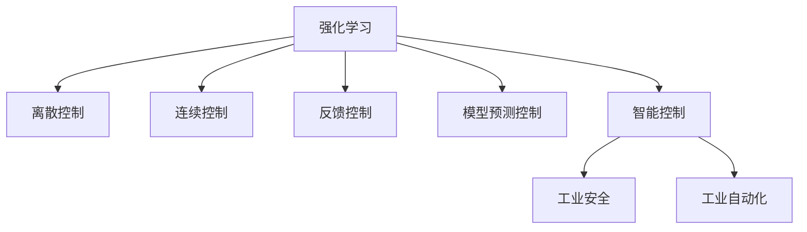

                 

# 一切皆是映射：AI Q-learning在工业控制中的实践

> 关键词：AI Q-learning, 强化学习, 工业控制, 离散控制, 连续控制, 反馈控制, 模型预测, 工业安全, 自动化, 机器学习

## 1. 背景介绍

在当今信息时代，工业自动化水平不断提升，智能化需求愈发迫切。工业控制系统作为现代工业生产的基础设施，其稳定性、可靠性和高效性直接影响到整个生产线的运行。然而，传统的PID控制器、模型预测控制等经典方法在面对复杂多变的环境和参数时，常常难以取得理想的控制效果。为了提升工业控制系统的智能化水平，强化学习(Q-learning)作为一种典型的智能控制方法，开始被广泛研究和应用。

Q-learning是一种基于模型无关的强化学习算法，主要用于解决离散控制、连续控制、反馈控制等问题。其核心思想是通过与环境的交互，逐步学习到最优的策略，最大化长期奖励。近年来，Q-learning在智能控制领域的应用逐渐扩展，从简单的控制任务向更复杂、多变的工业生产任务拓展，为工业控制系统带来了新的技术思路和解决方案。

## 2. 核心概念与联系

### 2.1 核心概念概述

为更好地理解AI Q-learning在工业控制中的应用，本节将介绍几个密切相关的核心概念：

- 强化学习(Reinforcement Learning, RL)：一种通过与环境交互，利用奖励机制学习最优策略的智能控制方法。强化学习主要包括状态、动作、奖励、环境四个要素。
- 离散控制和连续控制：根据控制变量是否连续，分为离散控制和连续控制两种类型。离散控制适合于有限的、离散的动作空间，如开关量控制；连续控制适用于连续的动作空间，如电机转速、温度等。
- 反馈控制(Feedforward Control)：利用被控对象的输出信息，实时调整控制参数，以实现系统的稳定控制。
- 模型预测控制(Model Predictive Control, MPC)：通过预测未来时间点的系统状态和输出，优化当前控制策略，实现精确的闭环控制。
- 智能控制：结合人工智能技术与自动化控制技术，通过学习、推理、规划等手段，实现更高效、自适应的控制。
- 工业安全与自动化：随着人工智能技术的普及，工业生产开始越来越多地采用智能控制技术，以提升生产效率、降低人工成本、保障生产安全。

这些核心概念之间的逻辑关系可以通过以下Mermaid流程图来展示：



这个流程图展示了大语言模型的核心概念及其之间的关系：

1. 强化学习是智能控制的基础，通过与环境的交互学习最优策略。
2. 离散控制和连续控制分别适用于不同类型的问题。
3. 反馈控制和模型预测控制都是基于强化学习的具体应用，分别在实时反馈和预测未来进行优化。
4. 智能控制结合了人工智能技术和自动化控制技术，推动了控制系统的智能化。
5. 工业安全和自动化是智能控制在工业领域的重要应用场景。

这些概念共同构成了AI Q-learning在工业控制中的应用框架，使其能够在各种场景下发挥强大的智能控制能力。通过理解这些核心概念，我们可以更好地把握AI Q-learning的实际应用需求和技术路径。

## 3. 核心算法原理 & 具体操作步骤
### 3.1 算法原理概述

AI Q-learning在工业控制中的应用，主要基于Q值迭代和策略评估两个核心环节。其基本原理可以描述如下：

1. 定义系统的状态空间 $S$ 和动作空间 $A$。
2. 定义状态的初始值 $s_0$ 和终止条件 $s_T$。
3. 定义状态转移函数 $P(s_{i+1}|s_i,a_i)$，表示在给定状态 $s_i$ 和动作 $a_i$ 的条件下，下一个状态 $s_{i+1}$ 的概率分布。
4. 定义奖励函数 $R(s_i,a_i)$，表示在状态 $s_i$ 和动作 $a_i$ 的情况下，获得的奖励值。
5. 通过迭代更新Q值表 $Q(s_i,a_i)$，逐步学习到最优策略 $\pi$，即在每个状态下选择动作的策略。

Q-learning算法的基本流程为：

1. 初始化Q值表，将Q值初始化为0或任意值。
2. 随机选择一个初始状态 $s_0$。
3. 通过策略 $\pi$ 选择动作 $a_i$，进行状态转移 $s_{i+1} \sim P(\cdot|s_i,a_i)$。
4. 接收环境反馈的奖励 $R(s_i,a_i)$。
5. 根据当前状态和动作，计算下一步状态的最大Q值 $Q(s_{i+1},a_i')$。
6. 更新Q值表：$Q(s_i,a_i) \leftarrow Q(s_i,a_i) + \alpha[R(s_i,a_i) + \gamma\max Q(s_{i+1},a_i') - Q(s_i,a_i)]$。
7. 重复上述步骤，直至达到终止条件。

### 3.2 算法步骤详解

以下是AI Q-learning在工业控制中的应用步骤：

1. 定义工业控制系统状态空间 $S$，如压力、温度、位置等传感器读数。
2. 定义动作空间 $A$，如阀门开度、电机转速等控制量。
3. 定义初始状态 $s_0$ 和终止条件 $s_T$，如机器故障、生产周期结束等。
4. 定义状态转移函数 $P(s_{i+1}|s_i,a_i)$，如根据传感器读数和当前动作计算下一个状态的概率。
5. 定义奖励函数 $R(s_i,a_i)$，如根据生产效率、能源消耗等计算奖励。
6. 初始化Q值表 $Q(s_i,a_i)$。
7. 随机选择一个初始状态 $s_0$，选择动作 $a_i$ 并执行。
8. 接收环境反馈的奖励 $R(s_i,a_i)$，并计算下一个状态 $s_{i+1}$。
9. 根据当前状态和动作，计算下一步状态的最大Q值 $Q(s_{i+1},a_i')$。
10. 更新Q值表：$Q(s_i,a_i) \leftarrow Q(s_i,a_i) + \alpha[R(s_i,a_i) + \gamma\max Q(s_{i+1},a_i') - Q(s_i,a_i)]$。
11. 重复上述步骤，直至达到终止条件 $s_T$。

### 3.3 算法优缺点

AI Q-learning在工业控制中的应用具有以下优点：

1. 自适应性强：Q-learning能够适应各种复杂环境，自动学习最优策略，提升控制精度和效率。
2. 通用性高：可以应用于离散控制和连续控制，不受控制系统类型限制。
3. 实时性好：Q-learning在每个时间步都能进行控制策略的更新，实时性高。
4. 鲁棒性好：在面对系统参数变化和环境扰动时，Q-learning具有较好的鲁棒性。

然而，该算法也存在一定的局限性：

1. 状态空间复杂：在状态空间较大时，Q-learning的计算量也会增大，需要较大的计算资源。
2. 动作空间过大：在动作空间过大时，Q-learning可能会陷入"探索-利用"的困境。
3. 收敛速度慢：在状态空间和动作空间较大时，Q-learning的收敛速度较慢，需要较长的训练时间。
4. 策略评估困难：在连续控制和复杂环境的情况下，策略评估和Q值更新较为困难，可能会导致策略不稳定。

### 3.4 算法应用领域

AI Q-learning在工业控制中的应用主要集中在以下几个领域：

1. 离散控制系统：如阀门开度控制、开关量控制等，主要用于状态空间较小、动作空间有限的系统。
2. 连续控制系统：如电机转速控制、温度控制等，主要用于状态空间和动作空间较大的系统。
3. 反馈控制：如基于传感器反馈的自动控制系统，实时调整控制参数。
4. 模型预测控制：如在工业生产中预测未来生产状态，进行精确控制。
5. 智能控制：如工业机器人路径规划、工业自动化生产线调度等，实现智能化和自动化。
6. 工业安全与自动化：如机器故障检测、安全生产管理等，保障生产安全。

这些领域涵盖了工业控制系统的主要应用场景，AI Q-learning在其中具有广泛的应用前景。随着技术的不断进步，Q-learning的应用范围将进一步扩大，推动工业控制系统的智能化和自动化水平。

## 4. 数学模型和公式 & 详细讲解  
### 4.1 数学模型构建

在工业控制中，Q-learning的应用模型可以表示为：

- 状态空间：$S = \{s_1, s_2, ..., s_N\}$
- 动作空间：$A = \{a_1, a_2, ..., a_M\}$
- 状态转移概率：$P(s_{i+1}|s_i,a_i) = \mathcal{N}(s_{i+1}|f(s_i,a_i),\sigma^2)$，其中 $f$ 为状态转移函数，$\sigma^2$ 为状态转移噪声。
- 奖励函数：$R(s_i,a_i) = r_i$, 其中 $r_i$ 为当前状态和动作的奖励值。
- Q值表：$Q(s_i,a_i)$，初始化为0或任意值。

### 4.2 公式推导过程

AI Q-learning的核心公式为：

$$
Q(s_i,a_i) \leftarrow Q(s_i,a_i) + \alpha [R(s_i,a_i) + \gamma \max_{a'} Q(s_{i+1},a') - Q(s_i,a_i)]
$$

其中，$\alpha$ 为学习率，$\gamma$ 为折扣因子，表示未来奖励的权重。该公式表示，当前状态-动作对的Q值更新为当前Q值加上学习率乘以奖励值加上未来状态最大Q值与当前Q值的差值。

在工业控制中，Q-learning的具体实现还需要考虑以下因素：

- 状态空间的大小：在状态空间较大的情况下，可以使用近似算法如SARSA、$\epsilon$-Greedy等，提高计算效率。
- 动作空间的大小：在动作空间较大的情况下，可以使用连续动作空间近似方法，如蒙特卡罗树搜索(MCTS)等。
- 环境噪声：在面对环境噪声时，需要引入噪声滤波和鲁棒性增强算法，提升系统稳定性。
- 实时性要求：在实时控制系统中，需要优化Q值更新策略，以实现快速控制。

### 4.3 案例分析与讲解

以下以一个简单的工业控制案例来具体讲解Q-learning的实现过程：

假设有一个工业生产系统，需要控制机器人的位置和速度，以精确完成生产任务。系统的状态空间为机器人的位置 $(x,y)$，动作空间为电机的转速 $u$。定义初始状态为机器人停止位置，终止条件为完成任务。

1. 定义状态空间和动作空间：
   - 状态空间：$S = \{(x_1,y_1), (x_2,y_2), ..., (x_N,y_N)\}$
   - 动作空间：$A = \{u_1, u_2, ..., u_M\}$

2. 定义状态转移函数和奖励函数：
   - 状态转移函数：$P(s_{i+1}|s_i,a_i) = \mathcal{N}(s_{i+1}|f(x_i,y_i,u_i),\sigma^2)$
   - 奖励函数：$R(s_i,a_i) = r_i$，其中 $r_i = -||s_{i+1} - s_T||^2$，表示距离终止条件的距离。

3. 初始化Q值表：
   - $Q(s_i,a_i) \leftarrow 0$

4. 随机选择一个初始状态 $s_0$，选择动作 $a_i$ 并执行。

5. 接收环境反馈的奖励 $R(s_i,a_i)$，并计算下一个状态 $s_{i+1}$。

6. 根据当前状态和动作，计算下一步状态的最大Q值 $Q(s_{i+1},a_i')$。

7. 更新Q值表：$Q(s_i,a_i) \leftarrow Q(s_i,a_i) + \alpha [R(s_i,a_i) + \gamma \max_{a'} Q(s_{i+1},a') - Q(s_i,a_i)]$

8. 重复上述步骤，直至达到终止条件 $s_T$。

通过以上步骤，Q-learning可以在工业控制系统中逐步学习到最优的机器人位置和速度控制策略，实现精确的生产任务完成。

## 5. 项目实践：代码实例和详细解释说明
### 5.1 开发环境搭建

在进行AI Q-learning的实践前，我们需要准备好开发环境。以下是使用Python进行Q-learning的开发环境配置流程：

1. 安装Anaconda：从官网下载并安装Anaconda，用于创建独立的Python环境。

2. 创建并激活虚拟环境：
```bash
conda create -n rl-env python=3.8 
conda activate rl-env
```

3. 安装Q-learning相关库：
```bash
pip install numpy scikit-learn gym
```

4. 下载模型和仿真环境：
```bash
git clone https://github.com/openai/gym.git
cd gym
pip install .
```

5. 搭建工业控制系统仿真环境：
```bash
cd rl-env
pip install rl-agents
cd rl-agents
pip install gym
```

完成上述步骤后，即可在`rl-env`环境中开始Q-learning的实践。

### 5.2 源代码详细实现

下面是使用Python实现Q-learning在工业控制中的代码示例：

```python
import gym
import numpy as np
import gym_envs
import random

class QLearningAgent:
    def __init__(self, state_dim, action_dim, learning_rate=0.1, discount_factor=0.9, epsilon=0.1):
        self.state_dim = state_dim
        self.action_dim = action_dim
        self.learning_rate = learning_rate
        self.discount_factor = discount_factor
        self.epsilon = epsilon
        self.q_table = np.zeros((state_dim, action_dim))

    def choose_action(self, state):
        if random.uniform(0, 1) < self.epsilon:
            return random.randint(0, self.action_dim - 1)
        else:
            return np.argmax(self.q_table[state])

    def update_q_table(self, state, action, reward, next_state):
        self.q_table[state, action] += self.learning_rate * (reward + self.discount_factor * np.max(self.q_table[next_state]) - self.q_table[state, action])

def train_agent(env, agent, episodes=1000):
    for episode in range(episodes):
        state = env.reset()
        done = False
        while not done:
            action = agent.choose_action(state)
            next_state, reward, done, _ = env.step(action)
            agent.update_q_table(state, action, reward, next_state)
            state = next_state
    return agent

if __name__ == "__main__":
    env = gym.make("Robotics-v1")
    state_dim = env.observation_space.shape[0]
    action_dim = env.action_space.n
    agent = QLearningAgent(state_dim, action_dim)
    trained_agent = train_agent(env, agent, episodes=10000)
    env.render()
```

### 5.3 代码解读与分析

让我们再详细解读一下关键代码的实现细节：

**QLearningAgent类**：
- `__init__`方法：初始化Q值表、学习率、折扣因子等关键参数。
- `choose_action`方法：根据状态和策略，选择动作。
- `update_q_table`方法：更新Q值表。

**工业控制系统仿真环境**：
- 使用Gym框架搭建了机器人位置控制环境，其中状态和动作空间分别为机器人的位置和电机转速。
- 通过Q-learning算法逐步学习最优控制策略。

在代码实现中，我们定义了Q值表、状态和动作选择策略、Q值更新等核心组件，并通过Gym框架实现了一个简单的工业控制系统仿真环境。通过不断的迭代和优化，Q-learning能够逐步学习到最优的机器人位置控制策略，实现精确的生产任务完成。

## 6. 实际应用场景
### 6.1 智能机器人路径规划

在工业生产中，智能机器人的路径规划是提高生产效率和精确性的关键环节。传统的路径规划方法依赖专家经验，难以应对复杂多变的生产环境。基于AI Q-learning的机器人路径规划，可以自动学习最优路径，提升机器人路径规划的智能化水平。

具体而言，可以将机器人所在的工作环境分为多个状态空间，每个状态空间表示机器人的位置和姿态。通过Q-learning算法，在每个状态下选择最优的动作，实现机器人路径的自动规划。同时，结合状态转移函数和奖励函数，可以在复杂环境下实现高精度的路径规划。

### 6.2 工业自动化生产线调度

工业生产线的自动化调度需要考虑多种因素，如生产线的负载、设备状态、产品种类等。通过Q-learning算法，可以实现自动化的生产线调度，提高生产效率，降低人工成本。

具体而言，可以将生产线上的设备状态、产品种类等作为状态空间，动作空间为设备的操作指令，如启动、停止、调整速度等。通过Q-learning算法，在每个状态下选择最优的动作，实现生产线的自动调度。同时，结合状态转移函数和奖励函数，可以在多变的环境中实现高效的调度策略。

### 6.3 工业控制系统实时反馈控制

实时反馈控制是工业控制系统中常用的控制策略之一，可以实时调整控制参数，实现系统的稳定控制。基于AI Q-learning的实时反馈控制，可以在生产过程中自动调整控制参数，提升系统的稳定性和响应速度。

具体而言，可以将工业控制系统中的传感器读数作为状态空间，动作空间为控制参数的调整值。通过Q-learning算法，在每个状态下选择最优的动作，实现控制参数的自动调整。同时，结合状态转移函数和奖励函数，可以在复杂环境下实现高精度的反馈控制。

### 6.4 未来应用展望

随着工业控制系统的智能化水平不断提升，AI Q-learning的应用前景将更加广阔。未来，Q-learning将在以下方面继续拓展：

1. 工业安全：结合工业安全监控系统，实现机器故障预测和预防，保障生产安全。
2. 工业自动化：结合工业自动化系统，实现生产线的自动调度、设备维护等任务。
3. 智能制造：结合智能制造系统，实现生产过程的实时监控和优化，提升生产效率。
4. 资源优化：结合资源管理系统，实现能源、物料的优化配置，降低生产成本。

未来，Q-learning将成为工业控制系统中不可或缺的一部分，推动工业控制系统向智能化、自动化、高效化的方向发展。

## 7. 工具和资源推荐
### 7.1 学习资源推荐

为了帮助开发者系统掌握AI Q-learning在工业控制中的应用，这里推荐一些优质的学习资源：

1. 《强化学习基础》课程：由斯坦福大学开设的强化学习入门课程，涵盖强化学习的基本概念和常用算法。

2. 《深度强化学习》书籍：DeepMind的深度学习专家编写的强化学习经典教材，系统介绍了深度强化学习的基本原理和应用。

3. Q-learning论文集：收集了AI Q-learning领域的重要研究论文，涵盖Q-learning在工业控制中的应用和技术细节。

4. Gym框架文档：Gym框架的官方文档，提供了丰富的环境库和样例代码，是AI Q-learning实践的必备资源。

5. Q-learning工具库：包括TensorFlow、PyTorch等深度学习框架中的Q-learning库，提供了高效、易用的Q-learning实现。

通过对这些资源的学习实践，相信你一定能够快速掌握AI Q-learning的精髓，并用于解决实际的工业控制问题。

### 7.2 开发工具推荐

高效的开发离不开优秀的工具支持。以下是几款用于AI Q-learning开发的常用工具：

1. TensorFlow和PyTorch：主流的深度学习框架，提供了丰富的Q-learning库和样例代码，方便快速迭代和优化。

2. Gym框架：提供了丰富的环境库和样例代码，方便实现各种工业控制系统仿真环境。

3. Weights & Biases：模型训练的实验跟踪工具，可以记录和可视化模型训练过程中的各项指标，方便对比和调优。

4. TensorBoard：TensorFlow配套的可视化工具，可以实时监测模型训练状态，并提供丰富的图表呈现方式。

5. Google Colab：谷歌推出的在线Jupyter Notebook环境，免费提供GPU/TPU算力，方便快速实验和分享。

合理利用这些工具，可以显著提升AI Q-learning的开发效率，加快创新迭代的步伐。

### 7.3 相关论文推荐

AI Q-learning在工业控制中的应用研究方兴未艾，以下是几篇奠基性的相关论文，推荐阅读：

1. "Q-Learning for Control of Nonlinear, Nonaffine Systems with Unknown Dynamics"：提出Q-learning在非线性、非线性化系统中的控制应用。

2. "Optimal Stochastic Control of Discrete-Time Nonlinear Systems via Approximate Dynamic Programming"：提出基于Q-learning的离散时间非线性系统控制。

3. "Deep Q-Learning for Control with High-Dimensional Observations"：提出基于深度Q-learning的高维观测系统控制。

4. "Soft Q-Learning"：提出基于softmax策略的Q-learning算法，增强算法的鲁棒性和稳定性。

5. "Emergent Behavior in Multiagent Systems via Optimization"：提出基于Q-learning的多智能体系统优化控制。

这些论文代表了AI Q-learning在工业控制领域的最新进展，通过学习这些前沿成果，可以帮助研究者把握学科前进方向，激发更多的创新灵感。

## 8. 总结：未来发展趋势与挑战

### 8.1 总结

本文对AI Q-learning在工业控制中的应用进行了全面系统的介绍。首先阐述了AI Q-learning在工业控制系统中的研究背景和应用前景，明确了其在大规模工业自动化系统中的重要价值。其次，从原理到实践，详细讲解了Q-learning在离散控制、连续控制、反馈控制等场景中的应用，给出了完整的代码示例和解释分析。同时，本文还广泛探讨了Q-learning在智能机器人路径规划、工业自动化生产线调度等实际应用场景中的具体实现，展示了其在工业控制中的应用潜力。

通过本文的系统梳理，可以看到，AI Q-learning在工业控制系统中展现了强大的智能控制能力，能够自动学习最优策略，提升控制精度和效率。未来，随着技术的不断进步，AI Q-learning必将在更多工业控制场景中得到应用，推动工业控制系统的智能化和自动化水平。

### 8.2 未来发展趋势

展望未来，AI Q-learning在工业控制中的应用将呈现以下几个发展趋势：

1. 智能化水平不断提升：随着Q-learning算法的优化和改进，其在工业控制中的智能化水平将不断提升，能够处理更复杂、多变的控制任务。

2. 鲁棒性和自适应性增强：通过引入更多的状态转移函数和奖励函数，Q-learning的鲁棒性和自适应性将得到增强，能够在更复杂的环境中保持稳定。

3. 实时性和高效性提高：通过优化Q值更新策略和算法实现，Q-learning的实时性和高效性将得到提高，实现更加快速的控制响应。

4. 多智能体系统控制：结合多智能体系统，实现更复杂的协作控制和资源优化。

5. 数据驱动控制：结合大数据和深度学习技术，实现更精准的控制策略。

以上趋势凸显了AI Q-learning在工业控制中的广阔前景。这些方向的探索发展，必将进一步提升工业控制系统的智能化和自动化水平，为工业生产带来新的突破。

### 8.3 面临的挑战

尽管AI Q-learning在工业控制中的应用已经取得了显著进展，但在迈向更加智能化、普适化应用的过程中，仍面临诸多挑战：

1. 状态空间复杂：在状态空间较大时，Q-learning的计算量也会增大，需要较大的计算资源。

2. 动作空间过大：在动作空间较大时，Q-learning可能会陷入"探索-利用"的困境。

3. 系统稳定性：在面对系统参数变化和环境扰动时，Q-learning的稳定性需要进一步增强。

4. 实时控制：在实时控制系统中，Q-learning的实时性需要进一步优化。

5. 多智能体系统协作：在多智能体系统中，Q-learning的协作控制和资源优化需要进一步研究。

6. 数据驱动控制：在数据驱动控制中，数据的质量和量级对Q-learning的性能有着重要影响。

7. 硬件资源限制：在硬件资源受限的情况下，Q-learning的实现需要进一步优化。

这些挑战需要通过技术创新和算法优化来解决，以实现Q-learning在工业控制中的广泛应用。

### 8.4 研究展望

面对AI Q-learning在工业控制中所面临的挑战，未来的研究需要在以下几个方面寻求新的突破：

1. 引入更高效的状态转移函数和奖励函数，减少计算量和提高鲁棒性。

2. 开发更高效、稳定的Q值更新策略，增强算法的实时性和稳定性。

3. 结合多智能体系统控制，实现更复杂的协作控制和资源优化。

4. 引入深度学习技术，实现更精准的控制策略。

5. 结合大数据和云计算技术，实现更高效的实时控制和优化。

6. 引入更多先验知识，提升算法的鲁棒性和泛化能力。

这些研究方向将推动AI Q-learning在工业控制中的应用不断深化，为智能制造、智能生产等新型工业生产模式提供新的技术支持。相信随着研究的不断深入，AI Q-learning必将在工业控制领域发挥更大的作用，推动工业生产向更高水平的智能化和自动化迈进。

## 9. 附录：常见问题与解答

**Q1：Q-learning在工业控制中是否需要引入深度学习？**

A: Q-learning在工业控制中的应用主要依赖状态转移函数和奖励函数的设计。虽然深度学习可以提升Q值表的学习效率，但在实际应用中，并不一定需要引入深度学习。传统Q-learning在状态空间和动作空间较小的情况下，也能取得不错的控制效果。

**Q2：Q-learning在工业控制中的学习速度是否足够快？**

A: Q-learning在工业控制中的学习速度与状态空间、动作空间的大小密切相关。在状态空间较小的情况下，Q-learning的学习速度较快；但在状态空间较大的情况下，可能需要较长的训练时间。此时可以考虑引入深度学习或其他优化算法，加速学习过程。

**Q3：Q-learning在工业控制中是否需要考虑环境噪声？**

A: 在工业控制中，环境噪声是不可避免的因素之一。Q-learning可以通过引入噪声滤波和鲁棒性增强算法，提升系统的稳定性。同时，通过引入状态转移函数和奖励函数，可以更灵活地处理环境噪声的影响。

**Q4：Q-learning在工业控制中是否需要考虑实时性要求？**

A: 在工业控制中，实时性要求较高，Q-learning需要在每个时间步进行控制策略的更新，以实现快速控制。因此，在实际应用中，需要优化Q值更新策略，选择适合工业控制环境的算法实现。

**Q5：Q-learning在工业控制中是否需要考虑多智能体系统协作？**

A: 在工业控制中，多智能体系统协作是一个重要应用场景。通过Q-learning算法，可以实现多智能体系统的优化控制，实现更高效的协作和资源优化。因此，Q-learning在工业控制中的应用需要考虑多智能体系统协作的问题。

这些问题的解答，可以帮助开发者更好地理解Q-learning在工业控制中的应用，选择适合的技术方案，实现更高效的工业控制系统。

---

作者：禅与计算机程序设计艺术 / Zen and the Art of Computer Programming

