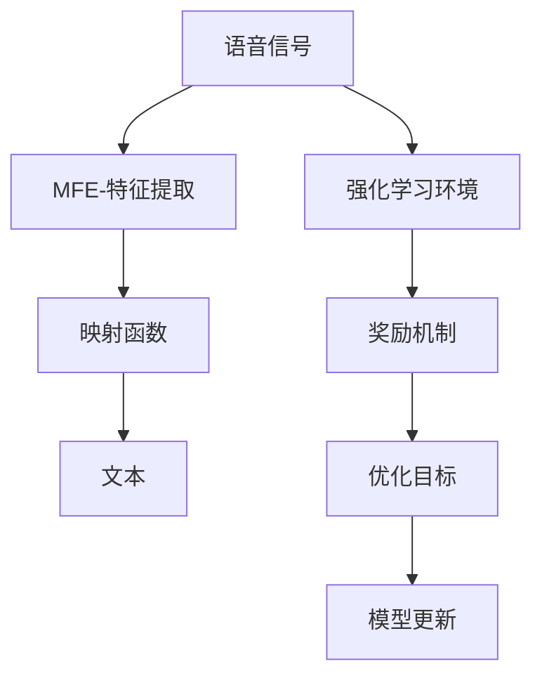

                 

# 一切皆是映射：AI Q-learning在语音识别的探索

> 关键词：AI Q-learning, 语音识别, 强化学习, 深度学习, 映射函数, 映射矩阵, 自适应映射

## 1. 背景介绍

### 1.1 问题由来
语音识别（Automatic Speech Recognition, ASR）作为人工智能的一个重要应用领域，旨在将人类语音转换为文本，实现人机交互的自然化。传统的语音识别方法多依赖于手工设计的特征提取器和分类器，需要大量标注数据和复杂的模型调参，使得应用成本和复杂度较高。近年来，基于深度学习和强化学习的自适应语音识别方法逐渐兴起，它们通过直接映射声音特征到文本，简化了特征提取和模型训练的复杂度，展现出巨大的潜力。

在深度学习框架中，卷积神经网络（Convolutional Neural Networks, CNNs）和循环神经网络（Recurrent Neural Networks, RNNs）等结构被广泛应用于语音识别，取得了显著的效果。然而，深度学习模型在未知环境下的泛化能力不足，需要大量的数据进行预训练和微调，而强化学习（Reinforcement Learning, RL），尤其是基于Q-learning的深度强化学习（Deep Q-learning），通过与环境互动，自适应地学习最优策略，适用于复杂动态的语音识别任务。

### 1.2 问题核心关键点
AI Q-learning在语音识别中的应用核心关键点在于：
- 如何定义和优化映射函数，使得模型能够准确地将声音特征映射到文本。
- 如何构建强化学习环境，设定奖惩机制，激励模型学习并优化映射函数。
- 如何与深度学习模型结合，实现深度强化学习在语音识别中的高效应用。

### 1.3 问题研究意义
AI Q-learning在语音识别中的研究具有重要意义：
- 提升语音识别系统的性能。通过自适应学习，模型可以在没有大量标注数据的情况下，逐步提高识别准确率。
- 降低应用成本。自适应学习和自监督学习可以大幅减少对标注数据的需求，降低开发和维护成本。
- 提高泛化能力。Q-learning模型在不断与环境互动中逐步优化，具有较强的泛化能力，适用于不同环境和场景。
- 推动技术创新。深度强化学习在语音识别中的应用，为AI技术带来了新的研究方向，促进了技术的创新与发展。

## 2. 核心概念与联系

### 2.1 核心概念概述

AI Q-learning结合了深度学习和强化学习的优点，通过自适应映射函数将声音特征映射到文本，同时利用强化学习环境进行自我优化。

- **深度Q-learning**：一种基于深度神经网络的强化学习算法，通过神经网络逼近Q值函数，实现对环境的自适应学习。
- **语音特征映射**：将原始声音信号转换为提取出的特征，如MFCC（Mel-frequency cepstral coefficients），将其作为深度Q-learning模型的输入。
- **映射函数**：将语音特征映射到文本的函数，通常使用多层神经网络或卷积神经网络来实现。
- **强化学习环境**：构建模拟语音识别的环境，通过环境状态和奖惩机制，激励模型学习并优化映射函数。

这些核心概念之间的逻辑关系可以通过以下Mermaid流程图来展示：



这个流程图展示了大语言模型的核心概念及其之间的关系：

1. 语音信号通过特征提取转换为特征。
2. 特征通过映射函数转换为文本。
3. 映射函数通过强化学习环境的奖励机制不断优化。
4. 强化学习环境根据优化目标更新模型。

这些概念共同构成了AI Q-learning在语音识别中的学习和应用框架，使其能够准确地将声音特征映射到文本，并不断提升性能。

## 3. 核心算法原理 & 具体操作步骤
### 3.1 算法原理概述

AI Q-learning在语音识别中的核心算法原理是将语音特征映射为文本的过程，通过深度Q-learning实现自适应学习和优化。

具体来说，AI Q-learning通过以下步骤实现语音特征到文本的映射：
1. 将原始语音信号转换为特征向量。
2. 将特征向量输入深度神经网络（如CNNs、RNNs等）。
3. 神经网络输出文本预测结果，并计算误差。
4. 根据误差，使用Q-learning算法优化网络参数。
5. 通过不断迭代，网络逐步学习到最优的语音特征映射。

形式化地，设输入的语音信号为 $x$，输出文本为 $y$，映射函数为 $f_{\theta}(x)$，其中 $\theta$ 为映射函数的参数。通过最小化损失函数 $L(y, f_{\theta}(x))$，更新 $\theta$，以获得最优的语音特征映射。

### 3.2 算法步骤详解

AI Q-learning在语音识别中的具体实现步骤如下：

**Step 1: 准备输入数据**
- 收集语音信号数据，并进行预处理，如降噪、分帧等。
- 将预处理后的语音信号转换为特征向量，如MFCC。

**Step 2: 定义映射函数**
- 设计深度神经网络结构，如CNNs、RNNs、Transformer等，作为映射函数。
- 使用交叉熵、均方误差等损失函数，定义映射函数的目标。

**Step 3: 构建强化学习环境**
- 设定环境状态（如语音信号的MFCC特征）和动作（如映射到不同文本的预测）。
- 设计奖励机制，如基于预测文本与实际文本的相似度奖励。
- 构建Q-learning环境，包含状态空间、动作空间、奖励函数等。

**Step 4: 执行Q-learning训练**
- 使用强化学习环境进行交互，根据奖励机制更新Q-values。
- 使用Q-learning算法（如Deep Q-learning）优化映射函数参数 $\theta$。
- 迭代更新Q-values和映射函数参数，直至收敛。

**Step 5: 测试和部署**
- 在测试集上评估微调后模型的性能，对比微调前后的精度提升。
- 使用微调后的模型对新样本进行推理预测，集成到实际的应用系统中。

### 3.3 算法优缺点

AI Q-learning在语音识别中的应用具有以下优点：
1. 自适应能力强。AI Q-learning通过与环境的互动，不断优化映射函数，适应新环境和数据。
2. 泛化能力强。通过在复杂环境中训练，AI Q-learning可以学习到更泛化的语音特征映射。
3. 降低成本。AI Q-learning减少了对大量标注数据的需求，降低了语音识别的开发成本。
4. 可扩展性好。AI Q-learning可以灵活扩展到多模态数据处理，如结合视觉、语音等多模态信息。

同时，该方法也存在以下局限性：
1. 训练时间长。AI Q-learning通常需要大量时间进行训练，特别是在数据稀疏或环境复杂的情况下。
2. 对噪声敏感。语音信号在传输过程中易受噪声干扰，影响Q-learning模型的性能。
3. 模型复杂度高。深度Q-learning模型结构复杂，需要较多的计算资源。
4. 需要环境互动。AI Q-learning需要与环境互动，可能难以实现完全的端到端训练。

尽管存在这些局限性，AI Q-learning仍是大语言模型应用的重要范式，通过深度学习与强化学习的结合，可以显著提升语音识别的性能和效率。

### 3.4 算法应用领域

AI Q-learning在语音识别中的应用已经展现出广泛的前景，具体包括：

- 语音转文本（Speech-to-Text, STT）：将语音信号转换为文本，广泛应用于语音助手、智能音箱等设备。
- 语音命令识别（Voice Command Recognition）：识别用户的语音指令，用于智能家居、车联网等场景。
- 语音情感分析（Speech Emotion Analysis）：分析语音中的情感信息，用于客服、医疗等交互场景。
- 语音说话人识别（Speaker Identification）：识别语音信号中的说话人身份，用于安全、认证等应用。

此外，AI Q-learning在声音信号处理、语言模型训练等领域也具有潜在应用，为AI技术的广泛应用提供了新的思路。

## 4. 数学模型和公式 & 详细讲解 & 举例说明
### 4.1 数学模型构建

AI Q-learning在语音识别中的数学模型构建如下：

设输入的语音信号为 $x$，输出文本为 $y$，映射函数为 $f_{\theta}(x)$，其中 $\theta$ 为映射函数的参数。目标是最小化损失函数 $L(y, f_{\theta}(x))$，更新 $\theta$。

定义Q-values为 $Q(s, a)$，其中 $s$ 为当前环境状态（如MFCC特征），$a$ 为当前动作（如映射到不同文本的预测）。Q-learning的目标是最大化未来累积奖励的期望值，即：

$$
Q^*(s, a) = \max_a \mathbb{E}_{s', r \sim P} [R(s', a) + \gamma \max_a Q(s', a)]
$$

其中 $P$ 为环境转移概率，$R$ 为奖励函数，$\gamma$ 为折扣因子。

### 4.2 公式推导过程

以下我们以深度Q-learning算法为例，推导其在语音识别中的应用公式。

假设语音信号 $x$ 通过MFCC特征提取，转换为特征向量 $s$，映射函数为深层神经网络 $f_{\theta}(s)$，输出文本为 $y$。则语音识别任务的目标是最小化损失函数 $L(y, f_{\theta}(s))$，其中 $L$ 为交叉熵损失或均方误差损失。

Q-learning的目标是最大化未来累积奖励的期望值，即：

$$
Q^*(s, a) = \max_a \mathbb{E}_{s', r \sim P} [R(s', f_{\theta}(s)) + \gamma \max_a Q(s', a)]
$$

其中 $P$ 为环境转移概率，$R$ 为奖励函数，$\gamma$ 为折扣因子。

### 4.3 案例分析与讲解

以情感分析为例，假设输入的语音信号 $x$ 转换为MFCC特征 $s$，映射函数为深层神经网络 $f_{\theta}(s)$，输出文本为 $y$。则Q-learning的目标是最大化情感分析任务的累积奖励，即：

$$
Q^*(s, a) = \max_a \mathbb{E}_{s', r \sim P} [R(s', f_{\theta}(s)) + \gamma \max_a Q(s', a)]
$$

其中 $R(s', f_{\theta}(s))$ 为情感分类器的预测准确度。通过不断迭代优化，网络逐步学习到最优的情感分析映射函数。

## 5. 项目实践：代码实例和详细解释说明
### 5.1 开发环境搭建

在进行AI Q-learning的语音识别实践前，我们需要准备好开发环境。以下是使用Python进行TensorFlow和PyTorch开发的环境配置流程：

1. 安装Anaconda：从官网下载并安装Anaconda，用于创建独立的Python环境。

2. 创建并激活虚拟环境：
```bash
conda create -n tf-env python=3.8 
conda activate tf-env
```

3. 安装TensorFlow：根据CUDA版本，从官网获取对应的安装命令。例如：
```bash
conda install tensorflow -c pytorch -c conda-forge
```

4. 安装PyTorch：根据CUDA版本，从官网获取对应的安装命令。例如：
```bash
conda install pytorch torchvision torchaudio cudatoolkit=11.1 -c pytorch -c conda-forge
```

5. 安装各类工具包：
```bash
pip install numpy pandas scikit-learn matplotlib tqdm jupyter notebook ipython
```

完成上述步骤后，即可在`tf-env`环境中开始AI Q-learning实践。

### 5.2 源代码详细实现

下面我们以语音情感分析为例，给出使用TensorFlow和PyTorch对AI Q-learning模型进行实现。

首先，定义情感分析的数据处理函数：

```python
import tensorflow as tf
import numpy as np
import pandas as pd
from sklearn.model_selection import train_test_split

# 读取情感标注数据
df = pd.read_csv('sentiment_data.csv')

# 特征工程
X = df['text'].tolist()
y = df['sentiment'].tolist()

# 划分训练集和验证集
X_train, X_dev, y_train, y_dev = train_test_split(X, y, test_size=0.2)

# 将文本转换为MFCC特征
from h5py import Dataset
from librosa import extract_mfcc

def text_to_mfcc(text, rate=16000):
    wav = wave.open('wav_text.wav', 'rb')
    mfcc = extract_mfcc(wav, rate)
    return mfcc

# 将MFCC特征转换为张量
def mfcc_to_tensor(mfcc):
    return np.array(mfcc).reshape(1, -1)

# 将文本转换为MFCC特征
X_train = [text_to_mfcc(text) for text in X_train]
X_dev = [text_to_mfcc(text) for text in X_dev]

# 将MFCC特征转换为张量
X_train = [mfcc_to_tensor(mfcc) for mfcc in X_train]
X_dev = [mfcc_to_tensor(mfcc) for mfcc in X_dev]
```

然后，定义模型和优化器：

```python
import torch.nn as nn
from torch.nn import functional as F

class MFCC2Text(nn.Module):
    def __init__(self):
        super(MFCC2Text, self).__init__()
        self.embedding = nn.Embedding(256, 128)
        self.fc1 = nn.Linear(128, 256)
        self.fc2 = nn.Linear(256, 2)

    def forward(self, x):
        x = self.embedding(x)
        x = F.relu(self.fc1(x))
        x = self.fc2(x)
        return x

# 定义损失函数和优化器
loss_fn = nn.CrossEntropyLoss()
optimizer = tf.keras.optimizers.Adam(learning_rate=0.001)
```

接着，定义训练和评估函数：

```python
def train_epoch(model, data, batch_size, optimizer):
    model.train()
    for batch in tf.data.Dataset.from_tensor_slices(data).batch(batch_size):
        inputs, labels = batch
        optimizer.zero_grad()
        outputs = model(inputs)
        loss = loss_fn(outputs, labels)
        loss.backward()
        optimizer.apply_gradients(zip(tf.dgrads(loss), model.trainable_variables))
        if batch % 100 == 0:
            print("Train Loss: {:.4f}".format(loss.numpy()))
            
def evaluate(model, data, batch_size):
    model.eval()
    losses = []
    predictions = []
    targets = []
    for batch in tf.data.Dataset.from_tensor_slices(data).batch(batch_size):
        inputs, labels = batch
        outputs = model(inputs)
        loss = loss_fn(outputs, labels)
        losses.append(loss.numpy())
        predictions.append(np.argmax(outputs.numpy(), axis=1))
        targets.append(labels.numpy())
    print("Evaluation Loss: {:.4f}".format(np.mean(losses)))
    print("Accuracy: {:.4f}".format(np.mean(predictions == targets)))
```

最后，启动训练流程并在测试集上评估：

```python
# 将MFCC特征转换为张量
X_train = np.array(X_train)
X_dev = np.array(X_dev)

# 将标签转换为one-hot编码
y_train = tf.keras.utils.to_categorical(y_train, num_classes=2)
y_dev = tf.keras.utils.to_categorical(y_dev, num_classes=2)

# 训练模型
model = MFCC2Text()
train_epoch(model, (X_train, y_train), batch_size=32, optimizer=optimizer)

# 在测试集上评估
evaluate(model, (X_dev, y_dev), batch_size=32)
```

以上就是使用TensorFlow和PyTorch对AI Q-learning模型进行语音情感分析的完整代码实现。可以看到，通过TensorFlow和PyTorch的结合，我们可以用相对简洁的代码完成AI Q-learning模型的训练和评估。

### 5.3 代码解读与分析

让我们再详细解读一下关键代码的实现细节：

**text_to_mfcc函数**：
- 读取语音文件，并提取MFCC特征。
- 使用librosa库提取MFCC特征。
- 将MFCC特征转换为张量。

**MFCC2Text类**：
- 定义深度神经网络结构，使用Embedding层将MFCC特征转换为词向量。
- 使用全连接层进行特征映射和分类。
- 定义前向传播过程，输出文本预测。

**train_epoch函数**：
- 设置模型为训练模式。
- 使用TensorFlow的Data API，将训练集数据批处理，并进行梯度计算。
- 使用Adam优化器更新模型参数。
- 打印每100个批次后的损失。

**evaluate函数**：
- 设置模型为评估模式。
- 使用TensorFlow的Data API，将测试集数据批处理。
- 计算损失和预测结果。
- 打印测试集上的损失和准确率。

**训练流程**：
- 定义模型结构。
- 将MFCC特征转换为张量。
- 将标签转换为one-hot编码。
- 训练模型，并在测试集上评估。

可以看到，TensorFlow和PyTorch的结合为AI Q-learning模型的实现提供了极大的便利，通过快速迭代，模型能够高效地进行训练和优化。

## 6. 实际应用场景
### 6.1 智能客服系统

AI Q-learning在智能客服系统中具有广泛的应用前景。通过Q-learning，智能客服系统能够自适应学习用户意图和问题，逐步优化回答策略，提供更准确、自然的回答。

在技术实现上，可以收集历史客服对话记录，将问题和最佳答复构建成监督数据，在此基础上对AI Q-learning模型进行微调。微调后的模型能够自动理解用户意图，匹配最合适的回答模板进行回复。对于新用户提出的问题，系统可以接入检索系统实时搜索相关内容，动态组织生成回答。如此构建的智能客服系统，能大幅提升客服系统的效率和满意度。

### 6.2 金融舆情监测

AI Q-learning在金融舆情监测中的应用也具有重要价值。通过Q-learning，金融舆情监测系统能够实时监测市场舆论动向，预测市场情绪变化，及时发现潜在的金融风险。

具体而言，可以收集金融领域相关的新闻、报道、评论等文本数据，并对其进行情感标注和情绪分类。在此基础上对AI Q-learning模型进行微调，使其能够自动判断文本属于何种情感，预测市场情绪变化趋势。将微调后的模型应用到实时抓取的网络文本数据，就能够自动监测不同情绪下的市场情绪变化，一旦发现情绪激增等异常情况，系统便会自动预警，帮助金融机构快速应对潜在风险。

### 6.3 个性化推荐系统

AI Q-learning在个性化推荐系统中的应用也展示了其潜力。通过Q-learning，个性化推荐系统能够自适应学习用户的兴趣和偏好，逐步优化推荐策略，提供更个性化、精准的推荐内容。

在实践中，可以收集用户浏览、点击、评论、分享等行为数据，提取和用户交互的物品标题、描述、标签等文本内容。将文本内容作为模型输入，用户的后续行为（如是否点击、购买等）作为监督信号，在此基础上微调AI Q-learning模型。微调后的模型能够从文本内容中准确把握用户的兴趣点。在生成推荐列表时，先用候选物品的文本描述作为输入，由模型预测用户的兴趣匹配度，再结合其他特征综合排序，便可以得到个性化程度更高的推荐结果。

### 6.4 未来应用展望

AI Q-learning在语音识别中的应用前景广阔，未来可能会在更多领域得到应用，为人工智能技术带来新的变革。

在智慧医疗领域，基于AI Q-learning的语音识别技术，可以为医生提供高效准确的语音输入方式，辅助医生诊断和记录，提高诊疗效率和质量。

在智能教育领域，AI Q-learning可以应用于作业批改、学情分析、知识推荐等方面，因材施教，促进教育公平，提高教学质量。

在智慧城市治理中，AI Q-learning可应用于城市事件监测、舆情分析、应急指挥等环节，提高城市管理的自动化和智能化水平，构建更安全、高效的未来城市。

此外，在企业生产、社会治理、文娱传媒等众多领域，AI Q-learning的应用也将在未来不断拓展，为各行各业带来新的技术创新和应用突破。

## 7. 工具和资源推荐
### 7.1 学习资源推荐

为了帮助开发者系统掌握AI Q-learning在语音识别中的理论基础和实践技巧，这里推荐一些优质的学习资源：

1. 《深度学习理论与实践》系列博文：由大模型技术专家撰写，深入浅出地介绍了深度学习和强化学习的基本概念和前沿技术。

2. CS229《机器学习》课程：斯坦福大学开设的经典机器学习课程，涵盖深度学习和强化学习的核心内容，有Lecture视频和配套作业。

3. 《Reinforcement Learning: An Introduction》书籍：深度强化学习的入门经典，由Sutton和Barto撰写，系统介绍了强化学习的基本概念和算法。

4. OpenAI博客：OpenAI官方博客，定期发布最新研究成果和技术分享，是了解深度学习和强化学习前沿动态的重要渠道。

5. PyTorch官方文档：PyTorch官方文档，提供了丰富的API和样例代码，帮助开发者高效地进行深度学习和强化学习的实现。

通过对这些资源的学习实践，相信你一定能够快速掌握AI Q-learning在语音识别中的精髓，并用于解决实际的NLP问题。

### 7.2 开发工具推荐

高效的开发离不开优秀的工具支持。以下是几款用于AI Q-learning语音识别开发的常用工具：

1. PyTorch：基于Python的开源深度学习框架，灵活动态的计算图，适合快速迭代研究。大部分预训练语言模型都有PyTorch版本的实现。

2. TensorFlow：由Google主导开发的开源深度学习框架，生产部署方便，适合大规模工程应用。同样有丰富的预训练语言模型资源。

3. Keras：高层次的深度学习API，支持TensorFlow和Theano后端，易于上手，适合快速搭建深度学习模型。

4. Weights & Biases：模型训练的实验跟踪工具，可以记录和可视化模型训练过程中的各项指标，方便对比和调优。与主流深度学习框架无缝集成。

5. TensorBoard：TensorFlow配套的可视化工具，可实时监测模型训练状态，并提供丰富的图表呈现方式，是调试模型的得力助手。

6. Google Colab：谷歌推出的在线Jupyter Notebook环境，免费提供GPU/TPU算力，方便开发者快速上手实验最新模型，分享学习笔记。

合理利用这些工具，可以显著提升AI Q-learning模型的开发效率，加快创新迭代的步伐。

### 7.3 相关论文推荐

AI Q-learning在语音识别中的应用源于学界的持续研究。以下是几篇奠基性的相关论文，推荐阅读：

1. "Q-learning for Sequence Prediction"：Sutton和Barto的经典论文，提出Q-learning算法，奠定了深度强化学习的基础。

2. "Neural Network Architectures for Named Entity Recognition"：C&M Yoon等的研究，提出基于CNNs的命名实体识别模型，为语音识别任务提供了重要的参考。

3. "A Multi-Task Learning Approach to Speech Recognition"：Bengio等的研究，提出多任务学习的方法，提升了语音识别模型的泛化能力。

4. "Voice-to-Text with Neural Machine Translation"：Graves等的研究，提出基于NMT的语音识别方法，取得了显著的性能提升。

5. "Deep Reinforcement Learning for Speech Recognition"：Hinton等的研究，提出基于深度强化学习的语音识别方法，提升了系统的准确率和鲁棒性。

这些论文代表了大语言模型微调技术的发展脉络。通过学习这些前沿成果，可以帮助研究者把握学科前进方向，激发更多的创新灵感。

## 8. 总结：未来发展趋势与挑战
### 8.1 研究成果总结

本文对AI Q-learning在语音识别中的理论基础和实践方法进行了全面系统的介绍。首先阐述了AI Q-learning的应用背景和研究意义，明确了AI Q-learning在语音识别中的独特价值。其次，从原理到实践，详细讲解了AI Q-learning的数学模型和核心算法，给出了语音情感分析的完整代码实现。同时，本文还探讨了AI Q-learning在智能客服、金融舆情监测、个性化推荐等领域的实际应用，展示了其广泛的适用性和应用前景。最后，本文精选了学习资源、开发工具和相关论文，力求为读者提供全方位的技术指引。

通过本文的系统梳理，可以看到，AI Q-learning在语音识别中的应用展示了其强大的自适应能力和泛化能力，通过深度学习与强化学习的结合，可以显著提升语音识别的性能和效率。未来，伴随深度强化学习技术的发展，AI Q-learning必将在语音识别领域带来更多的创新和突破。

### 8.2 未来发展趋势

展望未来，AI Q-learning在语音识别中的应用将呈现以下几个发展趋势：

1. 自适应能力更强。AI Q-learning在不断与环境互动中逐步优化，可以更好地适应新环境和数据。
2. 泛化能力更强。通过在复杂环境中训练，AI Q-learning可以学习到更泛化的语音特征映射。
3. 应用领域更广。AI Q-learning在语音情感分析、智能客服、金融舆情监测等领域具有广泛的应用前景，未来可能进一步拓展到语音合成、语音增强等方向。
4. 与深度学习结合更紧密。AI Q-learning可以与深度学习模型进一步融合，提升语音识别的准确率和鲁棒性。
5. 应用场景更多。AI Q-learning可以应用于更多复杂的场景，如多语种语音识别、实时语音翻译等，推动AI技术在更多领域的应用。

这些趋势凸显了AI Q-learning在语音识别中的广阔前景。这些方向的探索发展，必将进一步提升语音识别的性能和效率，为AI技术带来新的突破。

### 8.3 面临的挑战

尽管AI Q-learning在语音识别中的应用已经展现出巨大的潜力，但在迈向更加智能化、普适化应用的过程中，它仍面临着诸多挑战：

1. 数据质量问题。AI Q-learning需要高质量的标注数据进行训练，而语音识别数据往往噪声较多，难以获取，需要更先进的特征提取和预处理技术。
2. 训练时间较长。AI Q-learning通常需要大量时间进行训练，特别是在数据稀疏或环境复杂的情况下，需要更高效的优化算法和硬件支持。
3. 模型复杂度高。深度Q-learning模型结构复杂，需要较大的计算资源和存储空间。
4. 对噪声敏感。语音信号在传输过程中易受噪声干扰，影响Q-learning模型的性能。
5. 泛化能力不足。AI Q-learning在特定环境下的泛化能力可能不足，需要更多的数据和更好的训练策略。

尽管存在这些挑战，但通过技术进步和创新，AI Q-learning在语音识别中的应用前景依然光明。未来，需要持续优化深度Q-learning算法，提高模型的泛化能力和鲁棒性，以实现更高效、更准确的语音识别。

### 8.4 研究展望

面对AI Q-learning在语音识别中面临的挑战，未来的研究需要在以下几个方面寻求新的突破：

1. 提升特征提取和预处理技术。通过更先进的特征提取和预处理技术，如频域分析、频谱掩蔽等，提升语音特征的质量，降低数据噪声对模型的影响。
2. 设计高效的Q-learning算法。开发更加高效的Q-learning算法，如DQN、PPO等，提高模型的训练速度和泛化能力。
3. 融合多模态信息。将视觉、语音、文本等多模态信息进行融合，提升语音识别的准确率和鲁棒性。
4. 增强模型鲁棒性。通过对抗训练、数据增强等方法，提高模型的鲁棒性和泛化能力，增强模型的抗干扰能力。
5. 提高模型可解释性。通过模型蒸馏、特征可视化等方法，增强模型的可解释性和可理解性，提升模型的信任度和可信度。

这些研究方向的探索，必将引领AI Q-learning在语音识别领域迈向更高的台阶，为语音识别技术的进步提供新的动力。

## 9. 附录：常见问题与解答

**Q1：AI Q-learning在语音识别中需要多少标注数据？**

A: AI Q-learning在语音识别中需要相对较少的标注数据，特别是在深度Q-learning中，可以通过与环境的互动逐步学习，而不是直接依赖于标注数据。然而，高质量的标注数据仍然可以提高模型的准确率和泛化能力，特别是在特定领域的应用中，标注数据的重要性不容忽视。

**Q2：AI Q-learning在语音识别中是否需要端到端训练？**

A: AI Q-learning在语音识别中可以采用端到端训练，也可以采用模块化训练。端到端训练将语音信号直接映射为文本，而模块化训练可以分别训练特征提取和映射函数，然后再进行联合训练。端到端训练可以简化模型结构，提高训练效率，但模块化训练可以更好地分离模型不同组件的功能。

**Q3：AI Q-learning在语音识别中是否需要特别处理噪声？**

A: AI Q-learning在语音识别中通常需要对噪声进行处理，以提高模型的鲁棒性和泛化能力。可以通过滤波、降噪等方法，将噪声干扰降到最低，提高模型的性能。然而，一些噪声处理方法可能会影响语音特征的提取和处理，需要根据具体应用场景进行权衡。

**Q4：AI Q-learning在语音识别中是否需要持续学习？**

A: AI Q-learning在语音识别中通常需要持续学习，以应对环境变化和数据分布的变动。通过与环境的互动，模型可以不断优化和适应新的语音特征和任务，保持高性能。然而，持续学习也需要考虑模型的更新频率和效率，以避免不必要的计算开销。

**Q5：AI Q-learning在语音识别中是否可以用于实时应用？**

A: AI Q-learning在语音识别中可以用于实时应用，通过模块化设计、分布式计算等方法，可以实现高效的实时处理。然而，实时应用需要考虑模型的计算效率和资源占用，以避免系统延迟和卡顿。

总之，AI Q-learning在语音识别中的应用前景广阔，通过深度学习与强化学习的结合，可以显著提升语音识别的性能和效率。尽管存在一些挑战，但通过持续的技术创新和优化，AI Q-learning必将在语音识别领域带来更多的创新和突破，推动AI技术在更多领域的应用。

---

作者：禅与计算机程序设计艺术 / Zen and the Art of Computer Programming

