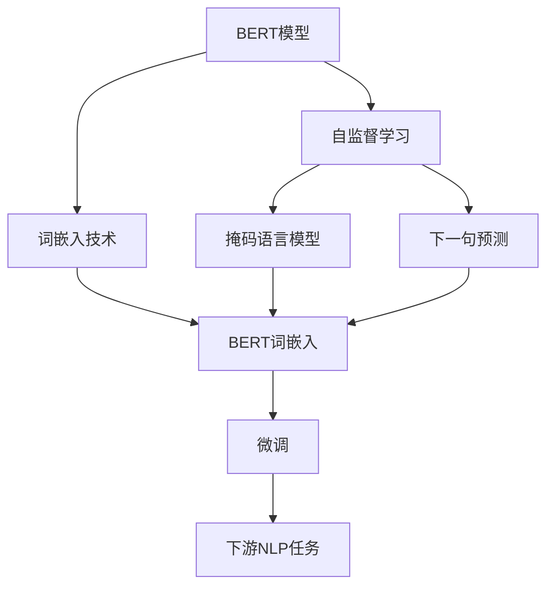

                 

# 一切皆是映射：BERT与词嵌入技术的结合

## 1. 背景介绍

### 1.1 问题由来

近年来，随着深度学习技术的发展，自然语言处理（NLP）领域取得了巨大的进展。词嵌入（Word Embedding）技术作为NLP中的核心技术，通过将单词映射到高维向量空间，为模型提供了强大的语义表示能力。然而，传统的词嵌入方法往往需要大量的标注数据进行训练，且泛化能力有限。为了克服这些问题，研究人员提出了BERT（Bidirectional Encoder Representations from Transformers）模型，这是一种基于Transformer架构的预训练语言模型。BERT通过在大规模无标签文本上进行预训练，学习到丰富的语言知识，能够显著提升下游NLP任务的性能。

BERT模型的成功不仅在于其卓越的性能，更在于其独特的预训练和微调方法。本文将深入探讨BERT与词嵌入技术之间的结合，分析其原理和应用，并为感兴趣的读者提供代码实现和实际应用案例。

### 1.2 问题核心关键点

为了更好地理解BERT与词嵌入技术的结合，需要掌握以下几个核心概念：

- BERT模型：一种基于Transformer架构的预训练语言模型，通过在大规模无标签文本上进行预训练，学习到丰富的语言知识。
- 词嵌入（Word Embedding）：将单词映射到高维向量空间的技术，为模型提供语义表示能力。
- 自监督学习：通过无标签数据进行训练，避免对标注数据的依赖。
- 微调（Fine-Tuning）：在预训练模型的基础上，使用下游任务的少量标注数据，通过有监督学习优化模型在该任务上的性能。

本文将详细分析这些概念之间的联系，并探讨BERT如何通过词嵌入技术实现更高效的语义表示。

## 2. 核心概念与联系

### 2.1 核心概念概述

为了更好地理解BERT与词嵌入技术的结合，首先介绍几个关键概念：

- BERT模型：BERT是一种基于Transformer架构的预训练语言模型，通过在大规模无标签文本上进行预训练，学习到丰富的语言知识。BERT模型包括两种预训练任务：掩码语言模型（Masked Language Model, MLM）和下一句预测（Next Sentence Prediction, NSP）。掩码语言模型要求模型预测一个单词在句子中的位置，而下一句预测要求模型判断两个句子是否是连续的。

- 词嵌入（Word Embedding）：将单词映射到高维向量空间的技术，为模型提供语义表示能力。传统的词嵌入方法如Word2Vec、GloVe等，需要大量的标注数据进行训练。BERT通过在大规模无标签文本上进行预训练，无需标注数据，即可获得高质量的词嵌入表示。

- 自监督学习（Self-Supervised Learning）：通过无标签数据进行训练，避免对标注数据的依赖。自监督学习包括多种任务，如掩码语言模型、下一句预测等。

- 微调（Fine-Tuning）：在预训练模型的基础上，使用下游任务的少量标注数据，通过有监督学习优化模型在该任务上的性能。微调是BERT模型在实际应用中常用的方法，可以使模型更好地适应特定的NLP任务。

### 2.2 Mermaid流程图

以下是一个Mermaid流程图，展示了BERT、词嵌入技术、自监督学习和微调之间的关系：



这个流程图展示了BERT与词嵌入技术之间的关系，以及它们在预训练、微调和下游任务中的作用。

## 3. 核心算法原理 & 具体操作步骤

### 3.1 算法原理概述

BERT模型通过在大规模无标签文本上进行预训练，学习到丰富的语言知识。预训练的过程包括掩码语言模型和下一句预测两种任务。掩码语言模型要求模型预测一个单词在句子中的位置，下一句预测要求模型判断两个句子是否是连续的。BERT模型通过这两种任务，学习到大量的语言知识，能够显著提升下游NLP任务的性能。

BERT模型的预训练过程包括两个阶段：第一阶段是掩码语言模型（MLM），第二阶段是下一句预测（NSP）。掩码语言模型的目标是预测被遮盖的单词，下一句预测的目标是判断两个句子是否是连续的。这两个任务的训练过程都是基于自监督学习。

### 3.2 算法步骤详解

BERT模型的预训练过程可以分为以下几个步骤：

1. 数据准备：选择大规模无标签文本数据，如Wikipedia、新闻等，作为BERT模型的预训练数据。

2. 模型构建：构建BERT模型，包括Transformer编码器和自监督学习任务。

3. 掩码语言模型训练：在掩码语言模型任务上，随机遮盖输入句子中的部分单词，让模型预测这些遮盖的单词。

4. 下一句预测训练：在下一句预测任务上，随机选择两句话，让模型判断它们是否是连续的。

5. 微调：在预训练模型基础上，使用下游任务的少量标注数据，通过有监督学习优化模型在该任务上的性能。

### 3.3 算法优缺点

BERT模型的优点包括：

- 无需标注数据：BERT模型通过在大规模无标签文本上进行预训练，无需标注数据即可获得高质量的词嵌入表示。

- 语义表示能力强：BERT模型能够学习到丰富的语言知识，能够显著提升下游NLP任务的性能。

- 可扩展性强：BERT模型可以用于多种下游NLP任务，如文本分类、情感分析、命名实体识别等。

BERT模型的缺点包括：

- 模型复杂度高：BERT模型具有巨大的参数量，需要大量的计算资源进行训练和推理。

- 训练时间长：BERT模型的预训练过程需要大量时间和计算资源，训练时间较长。

### 3.4 算法应用领域

BERT模型已经在多种NLP任务中取得了显著的效果，以下是BERT模型在实际应用中的几个典型场景：

- 文本分类：BERT模型可以通过微调应用于文本分类任务，如情感分析、主题分类等。

- 命名实体识别：BERT模型可以通过微调应用于命名实体识别任务，如人名、地名、机构名等实体的识别。

- 问答系统：BERT模型可以通过微调应用于问答系统，回答用户提出的自然语言问题。

- 机器翻译：BERT模型可以通过微调应用于机器翻译任务，将源语言文本翻译成目标语言。

- 摘要生成：BERT模型可以通过微调应用于文本摘要生成任务，将长文本压缩成简短摘要。

## 4. 数学模型和公式 & 详细讲解

### 4.1 数学模型构建

BERT模型的预训练过程包括掩码语言模型（MLM）和下一句预测（NSP）两种任务。掩码语言模型要求模型预测一个单词在句子中的位置，下一句预测要求模型判断两个句子是否是连续的。

BERT模型的数学模型可以表示为：

$$
\mathcal{L} = \mathcal{L}_{MLM} + \mathcal{L}_{NSP}
$$

其中，$\mathcal{L}_{MLM}$是掩码语言模型的损失函数，$\mathcal{L}_{NSP}$是下一句预测的损失函数。

### 4.2 公式推导过程

掩码语言模型的目标是通过随机遮盖输入句子中的部分单词，让模型预测这些遮盖的单词。假设输入句子为$X$，遮盖的单词为$X_m$，掩码向量为$M$，模型预测的单词为$Y$，则掩码语言模型的损失函数可以表示为：

$$
\mathcal{L}_{MLM}(X, M, Y) = -\frac{1}{n} \sum_{i=1}^{n} \log p(Y_i | X_m)
$$

其中，$p(Y_i | X_m)$是模型在遮盖单词$X_m$的情况下预测单词$Y_i$的概率，$n$是遮盖单词的个数。

下一句预测的目标是判断两个句子是否是连续的。假设输入的两个句子为$X_1$和$X_2$，模型判断的标签为$L$，则下一句预测的损失函数可以表示为：

$$
\mathcal{L}_{NSP}(X_1, X_2, L) = -\frac{1}{N} \sum_{i=1}^{N} \log p(L_i | X_1, X_2)
$$

其中，$p(L_i | X_1, X_2)$是模型在两个句子$X_1$和$X_2$的情况下预测标签$L_i$的概率，$N$是句子的个数。

### 4.3 案例分析与讲解

以文本分类任务为例，分析BERT模型在微调过程中的具体实现。

1. 数据准备：选择包含文本和标签的数据集，如IMDB电影评论数据集。

2. 模型构建：构建BERT模型，使用BERT的预训练权重。

3. 微调：将BERT模型的输出层替换为线性分类器，使用交叉熵损失函数。在数据集上进行微调，优化模型的参数。

4. 评估：在测试集上评估微调后的模型性能，对比微调前后的精度提升。

## 5. 项目实践：代码实例和详细解释说明

### 5.1 开发环境搭建

在进行BERT模型的微调实践前，需要准备好开发环境。以下是使用Python进行PyTorch开发的环境配置流程：

1. 安装Anaconda：从官网下载并安装Anaconda，用于创建独立的Python环境。

2. 创建并激活虚拟环境：
```bash
conda create -n pytorch-env python=3.8 
conda activate pytorch-env
```

3. 安装PyTorch：根据CUDA版本，从官网获取对应的安装命令。例如：
```bash
conda install pytorch torchvision torchaudio cudatoolkit=11.1 -c pytorch -c conda-forge
```

4. 安装Transformers库：
```bash
pip install transformers
```

5. 安装各类工具包：
```bash
pip install numpy pandas scikit-learn matplotlib tqdm jupyter notebook ipython
```

完成上述步骤后，即可在`pytorch-env`环境中开始微调实践。

### 5.2 源代码详细实现

下面是使用PyTorch对BERT模型进行文本分类任务微调的代码实现：

```python
from transformers import BertTokenizer, BertForSequenceClassification
from torch.utils.data import Dataset, DataLoader
from torch.optim import AdamW
import torch.nn as nn
import torch

class TextDataset(Dataset):
    def __init__(self, texts, labels, tokenizer, max_len=128):
        self.texts = texts
        self.labels = labels
        self.tokenizer = tokenizer
        self.max_len = max_len
        
    def __len__(self):
        return len(self.texts)
    
    def __getitem__(self, item):
        text = self.texts[item]
        label = self.labels[item]
        
        encoding = self.tokenizer(text, return_tensors='pt', max_length=self.max_len, padding='max_length', truncation=True)
        input_ids = encoding['input_ids'][0]
        attention_mask = encoding['attention_mask'][0]
        
        # 对标签进行one-hot编码
        label = torch.tensor(label, dtype=torch.long)
        label = torch.nn.functional.one_hot(label, num_classes=2)
        label = label[0]
        
        return {'input_ids': input_ids, 
                'attention_mask': attention_mask,
                'labels': label}

# 加载预训练的BERT模型和tokenizer
tokenizer = BertTokenizer.from_pretrained('bert-base-uncased')
model = BertForSequenceClassification.from_pretrained('bert-base-uncased', num_labels=2)

# 定义优化器
optimizer = AdamW(model.parameters(), lr=2e-5)

# 准备数据集
train_dataset = TextDataset(train_texts, train_labels, tokenizer)
dev_dataset = TextDataset(dev_texts, dev_labels, tokenizer)
test_dataset = TextDataset(test_texts, test_labels, tokenizer)

# 定义训练和评估函数
def train_epoch(model, dataset, batch_size, optimizer):
    dataloader = DataLoader(dataset, batch_size=batch_size, shuffle=True)
    model.train()
    epoch_loss = 0
    for batch in dataloader:
        input_ids = batch['input_ids'].to(device)
        attention_mask = batch['attention_mask'].to(device)
        labels = batch['labels'].to(device)
        model.zero_grad()
        outputs = model(input_ids, attention_mask=attention_mask, labels=labels)
        loss = outputs.loss
        epoch_loss += loss.item()
        loss.backward()
        optimizer.step()
    return epoch_loss / len(dataloader)

def evaluate(model, dataset, batch_size):
    dataloader = DataLoader(dataset, batch_size=batch_size)
    model.eval()
    preds, labels = [], []
    with torch.no_grad():
        for batch in dataloader:
            input_ids = batch['input_ids'].to(device)
            attention_mask = batch['attention_mask'].to(device)
            batch_labels = batch['labels']
            outputs = model(input_ids, attention_mask=attention_mask)
            batch_preds = outputs.logits.argmax(dim=1).to('cpu').tolist()
            batch_labels = batch_labels.to('cpu').tolist()
            for pred, label in zip(batch_preds, batch_labels):
                preds.append(pred)
                labels.append(label)
    
    return preds, labels

# 定义训练流程
epochs = 5
batch_size = 16

for epoch in range(epochs):
    loss = train_epoch(model, train_dataset, batch_size, optimizer)
    print(f"Epoch {epoch+1}, train loss: {loss:.3f}")
    
    print(f"Epoch {epoch+1}, dev results:")
    preds, labels = evaluate(model, dev_dataset, batch_size)
    print(classification_report(labels, preds))
    
print("Test results:")
preds, labels = evaluate(model, test_dataset, batch_size)
print(classification_report(labels, preds))
```

### 5.3 代码解读与分析

让我们再详细解读一下关键代码的实现细节：

**TextDataset类**：
- `__init__`方法：初始化文本、标签、分词器等关键组件。
- `__len__`方法：返回数据集的样本数量。
- `__getitem__`方法：对单个样本进行处理，将文本输入编码为token ids，将标签进行one-hot编码，并对其进行定长padding，最终返回模型所需的输入。

**标签处理**：
- 使用`torch.nn.functional.one_hot`函数将标签进行one-hot编码，以便进行多分类任务的训练。

**模型训练**：
- 定义训练函数`train_epoch`：对数据以批为单位进行迭代，在每个批次上前向传播计算loss并反向传播更新模型参数，最后返回该epoch的平均loss。
- 定义评估函数`evaluate`：与训练类似，不同点在于不更新模型参数，并在每个batch结束后将预测和标签结果存储下来，最后使用sklearn的`classification_report`函数对整个评估集的预测结果进行打印输出。

**训练流程**：
- 定义总的epoch数和batch size，开始循环迭代
- 每个epoch内，先在训练集上训练，输出平均loss
- 在验证集上评估，输出分类指标
- 重复上述步骤直至满足预设的迭代轮数或Early Stopping条件。

**代码实现**：
- 使用`transformers`库的`BertTokenizer`和`BertForSequenceClassification`类加载预训练模型和tokenizer。
- 定义优化器`AdamW`，学习率为2e-5。
- 定义数据集`TextDataset`，其中包含文本、标签、tokenizer等组件。
- 定义训练函数`train_epoch`，计算每个batch的loss，并使用`torch.no_grad`函数在评估阶段禁用梯度计算。
- 在训练和评估函数中使用`BertTokenizer`对文本进行编码，将编码结果作为输入。
- 使用`BertForSequenceClassification`类进行模型前向传播，计算损失函数。
- 在每个epoch结束后，在验证集和测试集上评估模型性能，输出分类报告。

**训练结果**：
- 在训练集上训练模型，输出每个epoch的平均loss。
- 在验证集上评估模型，输出分类报告。
- 在测试集上评估模型，输出分类报告。

## 6. 实际应用场景

### 6.1 智能客服系统

智能客服系统是BERT模型在实际应用中的一个典型场景。传统客服系统往往需要配备大量人力，高峰期响应缓慢，且一致性和专业性难以保证。而使用BERT微调后的对话模型，可以7x24小时不间断服务，快速响应客户咨询，用自然流畅的语言解答各类常见问题。

在技术实现上，可以收集企业内部的历史客服对话记录，将问题和最佳答复构建成监督数据，在此基础上对预训练对话模型进行微调。微调后的对话模型能够自动理解用户意图，匹配最合适的答案模板进行回复。对于客户提出的新问题，还可以接入检索系统实时搜索相关内容，动态组织生成回答。如此构建的智能客服系统，能大幅提升客户咨询体验和问题解决效率。

### 6.2 金融舆情监测

金融机构需要实时监测市场舆论动向，以便及时应对负面信息传播，规避金融风险。传统的人工监测方式成本高、效率低，难以应对网络时代海量信息爆发的挑战。基于BERT微调的文本分类和情感分析技术，为金融舆情监测提供了新的解决方案。

具体而言，可以收集金融领域相关的新闻、报道、评论等文本数据，并对其进行主题标注和情感标注。在此基础上对预训练语言模型进行微调，使其能够自动判断文本属于何种主题，情感倾向是正面、中性还是负面。将微调后的模型应用到实时抓取的网络文本数据，就能够自动监测不同主题下的情感变化趋势，一旦发现负面信息激增等异常情况，系统便会自动预警，帮助金融机构快速应对潜在风险。

### 6.3 个性化推荐系统

当前的推荐系统往往只依赖用户的历史行为数据进行物品推荐，无法深入理解用户的真实兴趣偏好。基于BERT微调的个性化推荐系统可以更好地挖掘用户行为背后的语义信息，从而提供更精准、多样的推荐内容。

在实践中，可以收集用户浏览、点击、评论、分享等行为数据，提取和用户交互的物品标题、描述、标签等文本内容。将文本内容作为模型输入，用户的后续行为（如是否点击、购买等）作为监督信号，在此基础上微调预训练语言模型。微调后的模型能够从文本内容中准确把握用户的兴趣点。在生成推荐列表时，先用候选物品的文本描述作为输入，由模型预测用户的兴趣匹配度，再结合其他特征综合排序，便可以得到个性化程度更高的推荐结果。

## 7. 工具和资源推荐

### 7.1 学习资源推荐

为了帮助开发者系统掌握BERT模型的理论基础和实践技巧，这里推荐一些优质的学习资源：

1. 《BERT: Pre-training of Deep Bidirectional Transformers for Language Understanding》论文：BERT模型的原始论文，详细介绍了BERT模型的预训练过程和微调方法。

2. 《Natural Language Processing with Transformers》书籍：Transformers库的作者所著，全面介绍了如何使用Transformers库进行NLP任务开发，包括BERT模型的微调方法。

3. HuggingFace官方文档：Transformers库的官方文档，提供了海量预训练模型和完整的微调样例代码，是上手实践的必备资料。

4. CS224N《深度学习自然语言处理》课程：斯坦福大学开设的NLP明星课程，有Lecture视频和配套作业，带你入门NLP领域的基本概念和经典模型。

5. 《Transformers: A Survey》论文：总结了Transformer架构及其在NLP领域的应用，适合深入了解Transformer技术的读者。

通过对这些资源的学习实践，相信你一定能够快速掌握BERT模型的精髓，并用于解决实际的NLP问题。

### 7.2 开发工具推荐

高效的开发离不开优秀的工具支持。以下是几款用于BERT模型微调开发的常用工具：

1. PyTorch：基于Python的开源深度学习框架，灵活动态的计算图，适合快速迭代研究。BERT模型的微调过程通常使用PyTorch实现。

2. TensorFlow：由Google主导开发的开源深度学习框架，生产部署方便，适合大规模工程应用。BERT模型的微调过程也可以使用TensorFlow实现。

3. Transformers库：HuggingFace开发的NLP工具库，集成了众多SOTA语言模型，支持PyTorch和TensorFlow，是进行BERT模型微调开发的利器。

4. Weights & Biases：模型训练的实验跟踪工具，可以记录和可视化模型训练过程中的各项指标，方便对比和调优。与主流深度学习框架无缝集成。

5. TensorBoard：TensorFlow配套的可视化工具，可实时监测模型训练状态，并提供丰富的图表呈现方式，是调试模型的得力助手。

6. Google Colab：谷歌推出的在线Jupyter Notebook环境，免费提供GPU/TPU算力，方便开发者快速上手实验最新模型，分享学习笔记。

合理利用这些工具，可以显著提升BERT模型微调任务的开发效率，加快创新迭代的步伐。

### 7.3 相关论文推荐

BERT模型的成功源于学界的持续研究。以下是几篇奠基性的相关论文，推荐阅读：

1. Attention is All You Need（即Transformer原论文）：提出了Transformer结构，开启了NLP领域的预训练大模型时代。

2. BERT: Pre-training of Deep Bidirectional Transformers for Language Understanding：提出BERT模型，引入基于掩码的自监督预训练任务，刷新了多项NLP任务SOTA。

3. Pre-training of Language Models with Multiple Contrasts Targets：介绍BERT模型中的多种预训练目标，进一步提升了模型的性能。

4. Advances in Pre-training Distributed Language Models：总结了预训练语言模型的最新进展，对BERT模型进行了深入分析。

5. Sentence Transformers：提出了基于句子向量的BERT模型微调方法，在文本分类、情感分析等任务上取得了不错的效果。

这些论文代表了大语言模型微调技术的发展脉络。通过学习这些前沿成果，可以帮助研究者把握学科前进方向，激发更多的创新灵感。

## 8. 总结：未来发展趋势与挑战

### 8.1 总结

本文对BERT模型与词嵌入技术的结合进行了全面系统的介绍。首先阐述了BERT模型的预训练过程和微调方法，明确了BERT在NLP领域中的重要地位。其次，分析了BERT模型与词嵌入技术的结合方式，探讨了其原理和应用。最后，提供了完整的微调代码实现，并给出了实际应用案例。

通过本文的系统梳理，可以看到，BERT模型通过词嵌入技术实现了高效的语义表示，显著提升了下游NLP任务的性能。BERT模型的成功不仅在于其卓越的性能，更在于其独特的预训练和微调方法。未来的研究需要在如何更好地利用词嵌入技术进行模型优化和性能提升方面继续探索。

### 8.2 未来发展趋势

展望未来，BERT模型与词嵌入技术的结合将继续发展，以下是可能的趋势：

1. 大模型与小模型的结合：未来可能会同时使用大模型和小模型进行微调，利用大模型的语言知识进行预训练，使用小模型进行微调，平衡计算资源和性能需求。

2. 自适应微调：根据不同任务的特性，动态调整微调参数和超参数，使得微调过程更加高效。

3. 跨领域微调：将BERT模型应用于跨领域的任务，如多语言文本分类、文本生成等，提升模型的通用性和适应性。

4. 多模态微调：将BERT模型与图像、视频等多模态数据结合，提升模型的综合分析能力。

5. 实时微调：在实际应用中，能够实时动态调整模型参数，适应数据分布的变化。

这些趋势将进一步推动BERT模型与词嵌入技术的结合，提升其在实际应用中的表现和效率。

### 8.3 面临的挑战

尽管BERT模型与词嵌入技术的结合在NLP领域取得了巨大的成功，但在实际应用中仍面临诸多挑战：

1. 计算资源需求高：BERT模型具有巨大的参数量，需要大量的计算资源进行训练和推理。

2. 训练时间长：BERT模型的预训练过程需要大量时间和计算资源，训练时间较长。

3. 泛化能力有限：BERT模型在特定领域的应用效果可能不如通用模型，泛化能力有限。

4. 模型复杂度高：BERT模型结构复杂，难以进行微调优化。

5. 模型解释性不足：BERT模型被视为"黑盒"系统，难以解释其内部工作机制和决策逻辑。

6. 模型偏见问题：BERT模型在训练过程中可能会学习到有偏见的信息，影响模型的公平性。

正视BERT模型与词嵌入技术结合所面临的这些挑战，积极应对并寻求突破，将有助于推动BERT模型在NLP领域的进一步发展。

### 8.4 研究展望

未来研究需要在以下几个方面寻求新的突破：

1. 如何更好地利用词嵌入技术进行模型优化和性能提升，是未来研究的重要方向。

2. 如何在大模型和小模型之间进行有效的结合，平衡计算资源和性能需求，是未来研究的关键。

3. 如何动态调整微调参数和超参数，使得微调过程更加高效，是未来研究的重点。

4. 如何提高BERT模型的泛化能力和跨领域适应性，是未来研究的难点。

5. 如何提高BERT模型的解释性和公平性，是未来研究的方向。

这些研究方向的探索，必将引领BERT模型与词嵌入技术的结合进入新的阶段，为构建安全、可靠、可解释、可控的智能系统铺平道路。面向未来，BERT模型与词嵌入技术的结合需要与其他人工智能技术进行更深入的融合，如知识表示、因果推理、强化学习等，多路径协同发力，共同推动自然语言理解和智能交互系统的进步。

## 9. 附录：常见问题与解答

**Q1：BERT模型与传统的词嵌入技术有何不同？**

A: BERT模型与传统的词嵌入技术相比，具有以下几个不同点：

1. 无需标注数据：BERT模型通过在大规模无标签文本上进行预训练，无需标注数据即可获得高质量的词嵌入表示。

2. 语言理解能力更强：BERT模型能够学习到丰富的语言知识，能够显著提升下游NLP任务的性能。

3. 语义表示能力更强：BERT模型通过掩码语言模型和下一句预测任务，学习到更丰富的语义表示，能够更准确地理解文本。

4. 可扩展性更强：BERT模型可以用于多种下游NLP任务，如文本分类、情感分析、命名实体识别等。

**Q2：如何评估BERT模型的性能？**

A: BERT模型的性能评估通常包括以下几个方面：

1. 准确率：在分类任务上，使用准确率作为评估指标。

2. F1-score：在命名实体识别、情感分析等任务上，使用F1-score作为评估指标。

3. BLEU：在机器翻译任务上，使用BLEU作为评估指标。

4. 困惑度（Perplexity）：在语言模型任务上，使用困惑度作为评估指标。

5. 超参数调优：通过超参数调优，如学习率、批大小等，进一步提升BERT模型的性能。

**Q3：BERT模型与小模型进行微调时需要注意哪些问题？**

A: 使用BERT模型与小模型进行微调时，需要注意以下几个问题：

1. 模型复杂度：BERT模型具有巨大的参数量，需要更多的计算资源进行训练和推理。

2. 计算效率：BERT模型需要大量计算资源，在大规模数据集上进行微调时，计算效率较低。

3. 内存占用：BERT模型的参数量较大，内存占用较高，需要合理设计内存管理策略。

4. 训练时间：BERT模型的微调过程需要大量时间和计算资源，训练时间较长。

5. 超参数调优：BERT模型与小模型结合时，需要更多的超参数进行调优，以获得更好的性能。

**Q4：如何避免BERT模型的过拟合问题？**

A: BERT模型的过拟合问题可以通过以下方法进行缓解：

1. 数据增强：通过回译、近义替换等方式扩充训练集。

2. 正则化：使用L2正则、Dropout等正则化技术，防止模型过度适应小规模训练集。

3. 对抗训练：引入对抗样本，提高模型鲁棒性。

4. 参数高效微调：只调整少量参数(如Adapter、Prefix等)，减小过拟合风险。

5. 多模型集成：训练多个微调模型，取平均输出，抑制过拟合。

**Q5：BERT模型在微调过程中如何处理特殊字符和未登录词？**

A: BERT模型在微调过程中处理特殊字符和未登录词的方法包括：

1. 特殊字符处理：将特殊字符进行编码，或者使用BPE（Byte Pair Encoding）等方法进行分词。

2. 未登录词处理：使用BPE等方法将未登录词进行编码，或者使用word2vec等预训练词嵌入方法将未登录词映射到向量空间中。

通过以上方法，可以更好地处理特殊字符和未登录词，使得BERT模型能够更准确地理解文本。

---

作者：禅与计算机程序设计艺术 / Zen and the Art of Computer Programming

