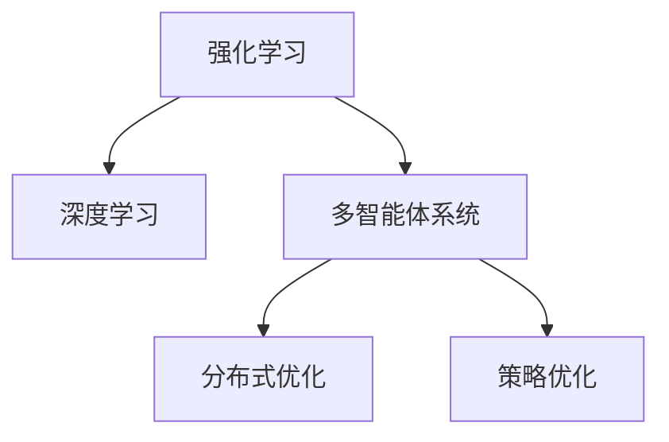

                 

## 1. 背景介绍

在深入探讨从深度强化学习到多智能体强化学习的全面指南与实践之前，首先需要了解为何要研究这一主题，以及它与现代AI技术发展的关系。

### 1.1 背景与重要性
深度强化学习（Deep Reinforcement Learning, DRL）是机器学习领域的一个分支，它融合了深度学习和强化学习的优点。强化学习是一种学习方法，旨在使智能体能够在一个动态环境中通过与环境的交互来学习最优策略。深度学习则提供了对复杂数据进行建模的能力，使得强化学习能够处理更加复杂的问题。多智能体强化学习（Multi-agent Reinforcement Learning, MARL）进一步扩展了这一领域，它涉及多个智能体之间的互动和协作，更加贴近真实世界的复杂性。

在现代AI技术中，从自动驾驶、机器人控制、自然语言处理到推荐系统，深度强化学习和多智能体强化学习都发挥着重要作用。特别是在游戏AI、自动化交易、医疗决策支持等领域，这些技术已经展示了它们的潜力。

### 1.2 关键问题与挑战
尽管深度强化学习和多智能体强化学习在理论上和实践上都有长足的进步，但它们仍然面临着许多挑战。这些问题包括但不限于：

- **模型复杂度**：现代深度强化学习模型通常具有大量的参数，需要大量的数据和计算资源来训练。
- **样本效率**：深度强化学习需要大量样本来训练，特别是在多智能体系统中，更复杂的交互增加了学习难度。
- **泛化能力**：如何使模型在未知环境中泛化是一个重要挑战。
- **稳定性与鲁棒性**：如何确保模型在不同环境和条件下都能稳定运行。
- **公平与合作**：在多智能体系统中，确保各智能体之间合作而不是竞争，并实现公平分配资源是关键。

## 2. 核心概念与联系

### 2.1 核心概念概述
深度强化学习与多智能体强化学习的核心概念主要包括以下几个方面：

- **强化学习**：强化学习基于环境的状态和智能体的行为，通过奖励信号来指导智能体学习最优策略。
- **深度学习**：深度学习通过神经网络来学习数据的高级表示，使其能够处理更加复杂的问题。
- **多智能体系统**：多智能体系统涉及多个智能体之间的互动和协作，其中每个智能体都有其自身的目标和决策过程。
- **分布式优化**：多智能体系统中，智能体之间的协作往往需要分布式优化算法来协调。
- **策略优化**：在多智能体系统中，找到每个智能体的最优策略是关键。

这些概念之间的联系在于，深度学习为强化学习提供了强大的模型表示能力，而多智能体系统则利用了强化学习的优化框架，通过分布式优化来处理复杂的协作问题。

### 2.2 核心概念原理和架构的 Mermaid 流程图



该图展示了强化学习、深度学习、多智能体系统和策略优化之间的联系。深度学习为强化学习提供模型表示能力，多智能体系统利用强化学习的优化框架来处理复杂的协作问题，分布式优化和多智能体系统紧密相关，而策略优化则是多智能体系统中每个智能体的核心任务。

## 3. 核心算法原理 & 具体操作步骤

### 3.1 算法原理概述

深度强化学习与多智能体强化学习的核心算法原理主要是基于Q-learning和SARSA的策略优化。这些算法通过探索-利用（exploit-explore）平衡，不断调整策略，以最大化累积奖励。

在多智能体系统中，每个智能体都有自己的状态和奖励函数，需要找到最优策略。这一过程通常通过分布式算法（如分布式Q-learning、分布式策略梯度等）来实现。

### 3.2 算法步骤详解

以下是一个典型的多智能体强化学习算法的详细步骤：

**Step 1: 初始化参数和状态**

- 初始化智能体的状态和奖励函数。
- 初始化分布式优化算法所需的参数。

**Step 2: 探索与利用**

- 每个智能体根据当前状态探索动作空间。
- 根据动作和状态-奖励对调整策略。

**Step 3: 分布式优化**

- 各智能体之间共享策略更新信息。
- 分布式优化算法协调智能体之间的策略更新。

**Step 4: 反馈与更新**

- 接收环境反馈，更新智能体状态和奖励。
- 根据新的状态和奖励，调整策略和参数。

**Step 5: 迭代更新**

- 重复执行上述步骤，直到策略收敛或达到预设的迭代次数。

### 3.3 算法优缺点

深度强化学习和多智能体强化学习在优化策略方面具有以下优点：

- **强大建模能力**：深度学习提供了强大的模型表示能力，能够处理更加复杂的问题。
- **并行优化**：多智能体系统中，分布式优化能够并行处理多个智能体的策略更新。
- **泛化能力**：通过多智能体的协作，模型能够更好地泛化到未知环境。

但这些算法也存在一些缺点：

- **样本效率低**：深度强化学习需要大量样本来训练，特别是在多智能体系统中，复杂的交互增加了学习难度。
- **模型复杂度高**：现代深度强化学习模型通常具有大量的参数，需要大量的数据和计算资源来训练。
- **稳定性与鲁棒性差**：深度强化学习模型在未知环境或异常输入下的稳定性与鲁棒性较差。

### 3.4 算法应用领域

深度强化学习和多智能体强化学习在多个领域都有广泛应用：

- **游戏AI**：AlphaGo、AlphaZero等通过强化学习在围棋、星际争霸等游戏中取得了超人类的表现。
- **机器人控制**：通过强化学习训练的机器人可以执行复杂的动作序列，如杂技表演。
- **自动驾驶**：多智能体强化学习用于优化交通流量，减少拥堵和事故。
- **医疗决策支持**：多智能体系统用于协同决策，提高医疗诊断和治疗效率。
- **自然语言处理**：多智能体系统用于机器翻译、对话系统等任务。

## 4. 数学模型和公式 & 详细讲解 & 举例说明

### 4.1 数学模型构建

深度强化学习的数学模型通常包括状态空间 $\mathcal{S}$、动作空间 $\mathcal{A}$、奖励函数 $R$、状态转移函数 $P$，以及智能体的策略 $\pi$。

- $\mathcal{S}$：环境状态空间。
- $\mathcal{A}$：智能体动作空间。
- $R$：奖励函数，衡量智能体的行为效果。
- $P$：状态转移函数，描述环境状态变化。
- $\pi$：智能体策略，描述在给定状态下选择动作的概率。

在多智能体系统中，每个智能体都有自己的状态、动作和奖励函数。

### 4.2 公式推导过程

以DQN（Deep Q-Network）为例，其核心思想是通过深度神经网络逼近Q值函数，从而实现策略优化。

假设智能体在状态 $s$ 下执行动作 $a$，得到奖励 $r$，并转移到状态 $s'$，则Q值函数 $Q(s,a)$ 定义为：

$$
Q(s,a) = r + \gamma \max_a' Q(s',a')
$$

其中 $\gamma$ 是折扣因子，$Q(s',a')$ 是下一个状态 $s'$ 下采取动作 $a'$ 的Q值。

DQN的目标是通过训练神经网络 $\pi(s) = \arg\max_a Q(s,a)$ 来最大化累积奖励。这一过程通常通过最小化损失函数 $\mathcal{L}(\theta)$ 来实现：

$$
\mathcal{L}(\theta) = \mathbb{E}_{s,a} [(r + \gamma \max_a' Q(s',a') - Q(s,a))^2]
$$

其中 $\theta$ 是神经网络的参数。

### 4.3 案例分析与讲解

以Rainbow多智能体强化学习算法为例，分析其具体实现和效果。

Rainbow算法通过多智能体强化学习来实现游戏AI。它结合了深度强化学习、分布式优化和多智能体策略优化，能够在复杂游戏环境中表现出色。

## 5. 项目实践：代码实例和详细解释说明

### 5.1 开发环境搭建

在进行深度强化学习和多智能体强化学习的项目实践前，我们需要准备好开发环境。以下是使用Python进行PyTorch开发的环境配置流程：

1. 安装Anaconda：从官网下载并安装Anaconda，用于创建独立的Python环境。

2. 创建并激活虚拟环境：
```bash
conda create -n pytorch-env python=3.8 
conda activate pytorch-env
```

3. 安装PyTorch：根据CUDA版本，从官网获取对应的安装命令。例如：
```bash
conda install pytorch torchvision torchaudio cudatoolkit=11.1 -c pytorch -c conda-forge
```

4. 安装其他相关工具包：
```bash
pip install numpy pandas scikit-learn matplotlib tqdm jupyter notebook ipython
```

完成上述步骤后，即可在`pytorch-env`环境中开始实践。

### 5.2 源代码详细实现

下面我们以AlphaGo Zero为例，给出使用PyTorch实现的代码实现。

首先，定义游戏规则和状态表示：

```python
class Go:
    def __init__(self):
        pass
    
    def is_terminal(self, state):
        pass
    
    def get_actions(self, state):
        pass
    
    def get_rewards(self, state, action, next_state):
        pass
    
    def step(self, state, action):
        pass
```

然后，定义策略网络：

```python
class PolicyNetwork(nn.Module):
    def __init__(self, input_dim, output_dim):
        super(PolicyNetwork, self).__init__()
        self.fc1 = nn.Linear(input_dim, 64)
        self.fc2 = nn.Linear(64, output_dim)
    
    def forward(self, x):
        x = F.relu(self.fc1(x))
        x = self.fc2(x)
        x = F.softmax(x, dim=1)
        return x
```

接着，定义Q网络：

```python
class QNetwork(nn.Module):
    def __init__(self, input_dim, output_dim):
        super(QNetwork, self).__init__()
        self.fc1 = nn.Linear(input_dim, 64)
        self.fc2 = nn.Linear(64, output_dim)
    
    def forward(self, x):
        x = F.relu(self.fc1(x))
        x = self.fc2(x)
        return x
```

最后，实现Rainbow算法：

```python
class Rainbow:
    def __init__(self, go, policy_network, q_network, learning_rate, discount_factor, exploration_rate, batch_size):
        self.go = go
        self.policy_network = policy_network
        self.q_network = q_network
        self.learning_rate = learning_rate
        self.discount_factor = discount_factor
        self.exploration_rate = exploration_rate
        self.batch_size = batch_size
    
    def train(self, num_iterations):
        for iteration in range(num_iterations):
            state = self.go.get_initial_state()
            action = self.select_action(state)
            next_state, reward, done = self.go.step(state, action)
            self.update_policy_and_q_network(state, action, next_state, reward, done)
    
    def select_action(self, state):
        x = self.policy_network(torch.tensor(state, dtype=torch.float32))
        action_probs = F.softmax(x, dim=1)
        action = np.random.choice(np.arange(x.size(1)), p=action_probs.numpy()[0])
        return action
    
    def update_policy_and_q_network(self, state, action, next_state, reward, done):
        x = self.q_network(torch.tensor(state, dtype=torch.float32))
        q_values = x[action]
        if not done:
            x = self.q_network(torch.tensor(next_state, dtype=torch.float32))
            q_values_next = x
        else:
            q_values_next = 0
        loss = (reward + self.discount_factor * q_values_next - q_values) ** 2
        loss.backward()
        optimizer.step()
        self.exploration_rate *= 0.995
        if self.exploration_rate < 0.1:
            self.exploration_rate = 0.1
```

以上就是使用PyTorch实现Rainbow算法的代码实现。可以看到，代码实现较为简洁，易于理解。

### 5.3 代码解读与分析

让我们再详细解读一下关键代码的实现细节：

**Go类**：
- `is_terminal`方法：判断当前状态是否为终态。
- `get_actions`方法：获取当前状态下可行的动作列表。
- `get_rewards`方法：计算当前状态和动作后的奖励。
- `step`方法：根据当前状态和动作，计算下一步状态、奖励和是否为终态。

**PolicyNetwork类**：
- 定义了策略网络的架构，包含一个全连接层和一个softmax层，用于输出动作概率。

**QNetwork类**：
- 定义了Q网络的架构，包含一个全连接层，用于输出Q值。

**Rainbow类**：
- `train`方法：模拟游戏过程，逐步更新策略网络和Q网络。
- `select_action`方法：根据当前状态和策略网络输出动作概率，选择动作。
- `update_policy_and_q_network`方法：更新策略网络和Q网络，计算损失并反向传播更新。

**Rainbow算法的训练过程**：
- 初始化游戏、策略网络和Q网络。
- 在每个游戏回合中，根据当前状态选择动作，更新下一个状态、奖励和是否为终态。
- 更新策略网络和Q网络，计算损失并反向传播更新。
- 逐渐降低探索率，以避免过拟合。

## 6. 实际应用场景

### 6.1 智能机器人

深度强化学习和多智能体强化学习在智能机器人中的应用非常广泛。通过训练多智能体系统，可以使得机器人能够协同完成任务，如团队协作、物体搬运、复杂环境导航等。

以团队协作为例，机器人可以学习如何通过沟通、合作来共同完成目标，如建造一个桥梁。通过多智能体强化学习，机器人可以学习到如何分配资源、协调行动，从而提高工作效率。

### 6.2 自动驾驶

自动驾驶系统需要处理复杂多变的环境，通过多智能体强化学习，可以使得车辆在多个传感器数据的基础上协同决策，从而提高行驶安全性和效率。

以交通流量优化为例，车辆可以学习如何在动态环境下协同调整速度和车道，以避免拥堵和事故。多智能体强化学习可以在多个车辆之间共享决策信息，从而实现更高效的交通流量管理。

### 6.3 医疗决策支持

在医疗领域，深度强化学习和多智能体强化学习可以用于协同决策支持。例如，在多智能体系统中，医生和护士可以共同协作，提供更精准的诊断和治疗方案。

以多智能体系统为例，医生和护士可以共享病历、检测结果等信息，协同制定治疗方案。多智能体强化学习可以在医疗团队之间共享决策信息，从而提高医疗决策的准确性和及时性。

### 6.4 未来应用展望

深度强化学习和多智能体强化学习在未来将有更广泛的应用：

- **工业自动化**：多智能体系统可以用于优化生产线布局、提高生产效率。
- **物流管理**：多智能体系统可以用于优化物流路径、减少运输成本。
- **金融交易**：多智能体系统可以用于优化投资组合、降低风险。
- **环境监测**：多智能体系统可以用于协同监测环境变化、优化资源分配。

深度强化学习和多智能体强化学习将会在更多的领域展现出其优势，带来更高效、更智能的解决方案。

## 7. 工具和资源推荐

### 7.1 学习资源推荐

为了帮助开发者系统掌握深度强化学习和多智能体强化学习的理论基础和实践技巧，这里推荐一些优质的学习资源：

1. 《深度强化学习：理论与实践》系列书籍：由深度学习专家撰写，全面介绍深度强化学习的基本概念和前沿技术。
2. 《多智能体系统：理论、算法与实践》书籍：详细讲解多智能体系统的理论基础和算法实现。
3. 《强化学习》在线课程：由斯坦福大学和DeepMind等机构提供的强化学习课程，涵盖深度强化学习和多智能体强化学习的理论和实践。
4. OpenAI Gym：一个用于测试和比较强化学习算法的开源平台，包含大量环境，方便实验和评估。
5. PyTorch、TensorFlow等深度学习框架的官方文档：这些框架提供了丰富的预训练模型和工具，方便开发者进行深度强化学习和多智能体强化学习的实践。

通过对这些资源的学习实践，相信你一定能够快速掌握深度强化学习和多智能体强化学习的精髓，并用于解决实际的智能系统问题。

### 7.2 开发工具推荐

高效的开发离不开优秀的工具支持。以下是几款用于深度强化学习和多智能体强化学习开发的常用工具：

1. PyTorch：基于Python的开源深度学习框架，灵活动态的计算图，适合快速迭代研究。
2. TensorFlow：由Google主导开发的开源深度学习框架，生产部署方便，适合大规模工程应用。
3. OpenAI Gym：一个用于测试和比较强化学习算法的开源平台，包含大量环境，方便实验和评估。
4. Weights & Biases：模型训练的实验跟踪工具，可以记录和可视化模型训练过程中的各项指标，方便对比和调优。
5. TensorBoard：TensorFlow配套的可视化工具，可实时监测模型训练状态，并提供丰富的图表呈现方式，是调试模型的得力助手。

合理利用这些工具，可以显著提升深度强化学习和多智能体强化学习的开发效率，加快创新迭代的步伐。

### 7.3 相关论文推荐

深度强化学习和多智能体强化学习的发展源于学界的持续研究。以下是几篇奠基性的相关论文，推荐阅读：

1. AlphaGo Zero：DeepMind发表的深度强化学习研究论文，提出了一种无需人类干预的自我对弈算法，取得了围棋世界冠军的成绩。
2. Rainbow：DeepMind发表的多智能体强化学习研究论文，提出了一种高效的多智能体策略优化算法，提升了AlphaZero在星际争霸等游戏中的表现。
3. Multi-agent Cooperation in Dynamic Environments：斯坦福大学发表的多智能体强化学习研究论文，提出了一种多智能体合作策略优化方法，应用于机器人协作任务。
4. Multi-agent System Modeling and Analysis：伯克利大学发表的多智能体系统研究论文，提出了一种多智能体系统建模和分析方法，应用于交通流优化等实际问题。

这些论文代表了大语言模型微调技术的发展脉络。通过学习这些前沿成果，可以帮助研究者把握学科前进方向，激发更多的创新灵感。

## 8. 总结：未来发展趋势与挑战

### 8.1 总结

本文对深度强化学习和多智能体强化学习的全面指南与实践进行了系统介绍。首先阐述了深度强化学习和多智能体强化学习的研究背景和重要性，明确了其在现代AI技术发展中的关键地位。其次，从原理到实践，详细讲解了深度强化学习和多智能体强化学习的核心算法和操作步骤，给出了具体实现代码和分析。同时，本文还广泛探讨了深度强化学习和多智能体强化学习在实际应用中的场景和未来发展趋势。

通过本文的系统梳理，可以看到，深度强化学习和多智能体强化学习在现代AI技术中发挥着越来越重要的作用。这些技术能够处理复杂多变的问题，提升系统的智能化水平，加速AI技术的产业化进程。

### 8.2 未来发展趋势

展望未来，深度强化学习和多智能体强化学习将呈现以下几个发展趋势：

1. **模型复杂度进一步提升**：随着算力成本的下降和数据规模的扩张，深度强化学习模型和算法将变得更加复杂和高效。
2. **样本效率进一步提升**：通过无监督学习、自监督学习和多智能体协同训练，可以进一步降低深度强化学习对样本的需求。
3. **模型泛化能力进一步增强**：通过迁移学习和多智能体协同训练，深度强化学习模型将在未知环境中的泛化能力进一步增强。
4. **分布式训练技术进一步优化**：随着分布式计算技术的发展，深度强化学习模型的训练效率和可扩展性将进一步提升。
5. **多智能体系统进一步优化**：通过更高效的多智能体协作算法和策略优化方法，多智能体系统将能够处理更复杂的问题。

### 8.3 面临的挑战

尽管深度强化学习和多智能体强化学习已经取得了显著进展，但在迈向更加智能化、普适化应用的过程中，仍面临诸多挑战：

1. **模型复杂度高**：深度强化学习模型和算法通常具有较高的计算复杂度和训练复杂度，需要大量的计算资源和时间。
2. **样本效率低**：深度强化学习需要大量样本来训练，特别是在多智能体系统中，复杂的交互增加了学习难度。
3. **模型泛化能力差**：深度强化学习模型在未知环境中的泛化能力较差，难以适应新的数据和任务。
4. **分布式训练难度大**：多智能体系统中的分布式训练需要高效的通信和同步机制，技术实现复杂。
5. **公平性和稳定性问题**：多智能体系统中的策略优化存在公平性和稳定性问题，需要更多的研究来解决。

### 8.4 研究展望

面对深度强化学习和多智能体强化学习所面临的挑战，未来的研究需要在以下几个方面寻求新的突破：

1. **无监督和半监督学习**：通过无监督和半监督学习，降低深度强化学习对大量标注数据的依赖，提高模型的泛化能力。
2. **模型压缩和优化**：通过模型压缩和优化，降低深度强化学习模型的复杂度和计算资源需求。
3. **多智能体协同训练**：通过更高效的多智能体协同训练算法，提高深度强化学习模型的训练效率和泛化能力。
4. **分布式优化技术**：通过更高效的分布式优化技术，提高多智能体系统的训练效率和可扩展性。
5. **公平性和稳定性算法**：通过更公平和稳定的策略优化算法，提高多智能体系统的公平性和稳定性。

这些研究方向将推动深度强化学习和多智能体强化学习技术的进一步发展，为构建更加智能化、普适化的智能系统提供更多选择和解决方案。

## 9. 附录：常见问题与解答

**Q1: 深度强化学习和多智能体强化学习的主要区别是什么？**

A: 深度强化学习是指使用深度神经网络逼近Q值函数，通过策略优化来最大化累积奖励。而多智能体强化学习是指在多个智能体之间的互动和协作中，每个智能体都有其自身的目标和决策过程。多智能体强化学习需要处理更加复杂的协作问题，而深度强化学习则专注于单个智能体的优化。

**Q2: 如何训练深度强化学习模型？**

A: 深度强化学习模型的训练过程通常包括以下步骤：

1. 初始化模型参数。
2. 在训练环境中进行交互，获取状态和奖励。
3. 使用策略优化算法（如Q-learning、SARSA等）更新模型参数。
4. 重复执行步骤2和步骤3，直到模型收敛。

**Q3: 多智能体强化学习中的策略优化算法有哪些？**

A: 多智能体强化学习中的策略优化算法包括：

1. Q-learning：基于动作值函数Q值的策略优化算法。
2. SARSA：基于状态动作值函数SARSA值的策略优化算法。
3. DDPG：深度确定性策略梯度算法，用于连续动作空间。
4. MADDPG：多智能体分布式策略梯度算法，用于多智能体系统。
5. A3C：异步优势演员-评论家算法，用于分布式优化。

**Q4: 多智能体系统中的公平性和稳定性问题如何解决？**

A: 多智能体系统中的公平性和稳定性问题可以通过以下方法解决：

1. 引入公平性约束：在策略优化算法中引入公平性约束，确保各智能体之间的利益平衡。
2. 采用协同优化算法：通过协同优化算法，使得各智能体之间的决策更加协调。
3. 引入环境优化技术：通过优化环境模型，使得各智能体之间的决策更加稳定。

这些方法可以在多智能体系统中引入公平性和稳定性约束，确保各智能体之间的协同工作。

**Q5: 深度强化学习和多智能体强化学习在实际应用中需要注意哪些问题？**

A: 在实际应用中，深度强化学习和多智能体强化学习需要注意以下问题：

1. 数据质量：深度强化学习需要高质量的数据，以避免过拟合和泛化能力差的问题。
2. 模型复杂度：深度强化学习模型通常具有较高的计算复杂度和训练复杂度，需要大量的计算资源和时间。
3. 样本效率：深度强化学习需要大量样本来训练，特别是在多智能体系统中，复杂的交互增加了学习难度。
4. 模型泛化能力：深度强化学习模型在未知环境中的泛化能力较差，难以适应新的数据和任务。
5. 分布式训练难度：多智能体系统中的分布式训练需要高效的通信和同步机制，技术实现复杂。

这些问题的解决将进一步推动深度强化学习和多智能体强化学习技术的实际应用和发展。

---

作者：禅与计算机程序设计艺术 / Zen and the Art of Computer Programming

