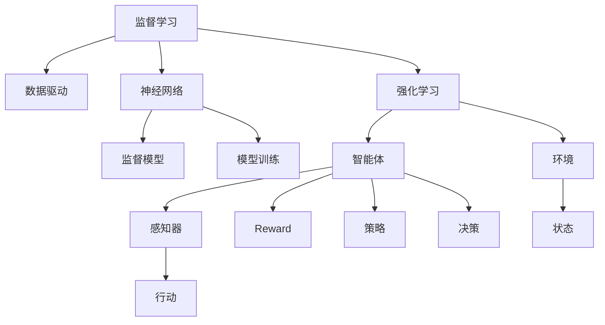

                 

# 一切皆是映射：从监督学习到DQN强化学习的思想转变

> 关键词：监督学习,强化学习,深度学习,神经网络,映射,强化学习算法,探索与利用,奖惩机制

## 1. 背景介绍

### 1.1 问题由来
深度学习作为人工智能领域的重要分支，已经广泛应用于图像、语音、自然语言处理(NLP)等多个领域。监督学习作为深度学习的主流范式，通过大量的有标签数据训练神经网络模型，使其能够完成分类、回归等任务。然而，现实世界中的许多问题，如自动驾驶、机器人控制等，往往需要模型能够在没有明确标签的环境中做出决策，这正是强化学习(Reinforcement Learning, RL)的用武之地。

### 1.2 问题核心关键点
强化学习通过构建智能体(Agent)与环境之间的交互，让智能体在不断的试错中学习如何最大化长期累积的奖励(Reward)。在强化学习中，智能体通过感知环境状态(State)，根据当前策略(Policy)采取行动(Action)，并根据环境反馈的奖励信号调整策略。这一过程与监督学习的“给标签”截然不同，更像是一场自动的“试错-反馈”循环。

强化学习的核心在于平衡“探索(Exploration)”和“利用(Exploitation)”。探索是指尝试新行动以获取未知奖励；利用则是指利用已知信息进行最优选择。这种平衡在实际应用中尤为重要，因为过度的探索可能导致低效，而过度的利用则可能导致策略停滞。

## 2. 核心概念与联系

### 2.1 核心概念概述

为更好地理解从监督学习到强化学习的转变，本节将介绍几个关键概念：

- 监督学习(Supervised Learning)：使用有标签数据训练模型，使其能够根据输入进行输出。监督学习通过最小化预测误差，最大化模型准确度。

- 强化学习(Reinforcement Learning)：通过智能体与环境的交互，让智能体根据反馈信号调整策略，最大化长期累积奖励。强化学习注重策略的优化和行为的适应性。

- 深度学习(Deep Learning)：使用多层神经网络进行复杂模式识别和预测。深度学习通过层次化的特征提取，自动学习特征表示。

- 神经网络(Neural Network)：由大量人工神经元组成的计算模型，能够处理大规模数据和高维空间中的复杂关系。

- 映射(Mapping)：将输入数据映射到输出数据的过程，是机器学习的基础。监督学习通过映射学习输入-输出对应关系，强化学习通过映射学习状态-动作对应关系。

- 探索与利用(Exploration & Exploitation)：强化学习中的两个核心过程，探索用于发现新的信息，利用用于确定最优策略。

- 奖惩机制(Reward Mechanism)：强化学习中通过给予智能体奖励或惩罚来指导其行为，促进或抑制某些动作的执行。

这些核心概念之间的逻辑关系可以通过以下Mermaid流程图来展示：



这个流程图展示了我文章的核心概念及其之间的联系：

1. 监督学习通过数据驱动，神经网络学习输入-输出映射关系。
2. 强化学习通过智能体-环境交互，学习状态-动作映射关系。
3. 探索与利用是强化学习中智能体行为的两种模式。
4. 奖惩机制用于指导智能体行为，促进或抑制某些动作。

这些概念共同构成了从监督学习到强化学习的转变框架，帮助理解二者的内在联系与区别。

## 3. 核心算法原理 & 具体操作步骤
### 3.1 算法原理概述

从监督学习到强化学习的转变，核心在于从“给标签”到“给奖励”的思维转变。监督学习的目标是最大化预测准确度，通过损失函数衡量模型预测与标签之间的差异；而强化学习的目标是最大化长期累积奖励，通过策略函数指导智能体行为。

形式化地，设智能体在状态 $s_t$ 时采取动作 $a_t$，环境返回奖励 $r_{t+1}$ 和状态 $s_{t+1}$，智能体的累计奖励为 $G_t=\sum_{k=0}^{\infty}\gamma^k r_{t+k+1}$，其中 $\gamma$ 为折扣因子。强化学习的目标是找到一个策略 $\pi(a|s)$，使得 $G_t$ 最大。

### 3.2 算法步骤详解

强化学习通常分为以下几个步骤：

**Step 1: 构建环境**
- 定义环境状态空间 $S$ 和动作空间 $A$。
- 设计状态转换规则 $s_{t+1}=f(s_t,a_t,r_{t+1})$。
- 定义奖励函数 $r_{t+1}$，通常为连续奖励或稀疏奖励。

**Step 2: 选择策略**
- 定义策略函数 $\pi(a|s)$，表示在状态 $s$ 时采取动作 $a$ 的概率。
- 根据策略函数定义智能体的决策过程：$a_t=\pi(a|s_t)$。

**Step 3: 更新策略**
- 通过智能体与环境的交互，记录状态-动作对 $(s_t,a_t)$ 和累积奖励 $G_t$。
- 根据记录的奖励信号和状态-动作对，利用经验回放、蒙特卡洛模拟等方法，更新策略函数。

**Step 4: 策略评估**
- 利用奖励信号和策略函数，计算智能体在不同状态下的累积奖励。
- 通过统计不同策略下的累积奖励，评估策略的优劣。

**Step 5: 训练智能体**
- 重复执行上述步骤，通过策略更新和策略评估，逐步提升智能体的表现。
- 当智能体策略收敛时，训练终止。

### 3.3 算法优缺点

强化学习的优势在于：

1. 适应性强。智能体可以在没有明确标签的环境中学习，适用于处理复杂决策问题。
2. 鲁棒性好。强化学习模型能够从噪声中提取信号，对数据分布的变化有较强的适应性。
3. 自主性高。智能体能够主动探索最优策略，无需人工干预。
4. 可以处理序列数据。强化学习适用于处理时间序列数据，如机器人控制、股票交易等。

强化学习的劣势在于：

1. 训练复杂度高。强化学习需要大量的训练数据和计算资源，且训练过程易陷入局部最优。
2. 数据稀疏。强化学习在许多领域中数据稀疏，难以得到有效训练。
3. 探索与利用平衡困难。过多探索导致训练效率低，过多利用导致策略停滞。

### 3.4 算法应用领域

强化学习已经被广泛应用于多个领域，例如：

- 机器人控制：如机械臂抓取、无人车导航等。智能体通过与环境交互，学习如何控制机器人完成复杂动作。
- 游戏AI：如AlphaGo、OpenAI Gym等。智能体通过学习游戏规则，达到获胜的目标。
- 股票交易：如AlphaGo交易系统。智能体通过学习历史交易数据，优化投资策略，提升收益。
- 自动驾驶：如UAV轨迹规划。智能体通过学习道路信息，优化车辆行驶路径。
- 自然语言处理：如文本摘要、机器翻译等。智能体通过学习语言模型，实现自然语言理解和生成。

除了上述这些经典任务外，强化学习还被创新性地应用于更多场景中，如推荐系统、供应链优化、交通流控制等，为各行各业带来了新的解决方案。

## 4. 数学模型和公式 & 详细讲解 & 举例说明
### 4.1 数学模型构建

本节将使用数学语言对强化学习的核心概念进行详细刻画。

设智能体在状态 $s_t$ 时采取动作 $a_t$，环境返回奖励 $r_{t+1}$ 和状态 $s_{t+1}$，智能体的累计奖励为 $G_t=\sum_{k=0}^{\infty}\gamma^k r_{t+k+1}$。则强化学习的目标是最小化策略的平均损失，即：

$$
\min_{\pi} \mathbb{E}_{\pi} [G_t - \mathbb{E}_{\pi} [G_t]^2]
$$

其中 $\mathbb{E}_{\pi} [G_t]$ 表示在策略 $\pi$ 下的平均累积奖励。

强化学习的核心在于策略的优化，常用的优化方法包括：

- 蒙特卡洛方法：通过模拟环境，记录智能体在每个状态下的累积奖励，统计其平均值。
- 时序差分法：通过差分更新状态-动作值函数，来更新策略。

### 4.2 公式推导过程

以下我们以蒙特卡洛方法为例，推导平均累积奖励的计算公式。

设智能体在状态 $s_t$ 时采取动作 $a_t$，环境返回奖励 $r_{t+1}$ 和状态 $s_{t+1}$，智能体的累计奖励为 $G_t=\sum_{k=0}^{\infty}\gamma^k r_{t+k+1}$。

根据蒙特卡洛方法，计算智能体在状态 $s_t$ 的平均累积奖励：

$$
\begin{aligned}
\mathbb{E}_{\pi} [G_t] &= \sum_{s_{t+1}}\sum_{s_t}\pi(s_t)\pi(a_t|s_t) \mathbb{E}_{r_t} [G_t|s_t,a_t] \\
&= \sum_{s_{t+1}}\sum_{s_t}\pi(s_t)\pi(a_t|s_t) \left(\frac{r_{t+1}}{1-\gamma}\right) \\
&= \frac{1}{1-\gamma}\sum_{s_{t+1}}\pi(s_{t+1})r_{t+1}
\end{aligned}
$$

通过统计智能体在不同状态下的平均累积奖励，可以评估策略的优劣。在训练过程中，通过最小化平均累积奖励与期望的累积奖励之差的平方，即可更新策略函数。

### 4.3 案例分析与讲解

假设智能体需要在两个状态 $s_1$ 和 $s_2$ 之间选择行动。在状态 $s_1$ 时，智能体可以采取行动 $a_1$ 或 $a_2$，在状态 $s_2$ 时，智能体只能采取行动 $a_2$。智能体希望最大化在两个状态下的累积奖励，状态转移和奖励如下：

- $s_1 \rightarrow s_2$，$P(s_2|s_1,a_1)=0.8$, $P(s_2|s_1,a_2)=0.2$，$r(s_1,a_1)=1$, $r(s_1,a_2)=2$
- $s_2 \rightarrow s_1$, $P(s_1|s_2,a_2)=1$, $r(s_2,a_2)=5$

定义策略函数 $\pi(a|s)$ 为：

$$
\pi(a|s)=\left\{\begin{array}{ll}
0.5, & \text { if } s=s_{1}, a=a_{1} \\
0.5, & \text { if } s=s_{1}, a=a_{2} \\
0, & \text { if } s=s_{2}, a=a_{2}
\end{array}\right.
$$

在状态 $s_1$ 时，智能体在行动 $a_1$ 和 $a_2$ 之间均匀选择，在状态 $s_2$ 时，智能体只选择 $a_2$。计算智能体在状态 $s_1$ 和 $s_2$ 的平均累积奖励：

$$
\mathbb{E}_{\pi} [G_{s_{1}}]=0.5(1)+0.5(2)=1.5
$$

$$
\mathbb{E}_{\pi} [G_{s_{2}}]=0
$$

因此，智能体应该优先选择行动 $a_2$，而不是 $a_1$，以最大化整体累积奖励。这便是强化学习中的“利用”过程。

## 5. 项目实践：代码实例和详细解释说明
### 5.1 开发环境搭建

在进行强化学习项目实践前，我们需要准备好开发环境。以下是使用Python进行PyTorch开发的环境配置流程：

1. 安装Anaconda：从官网下载并安装Anaconda，用于创建独立的Python环境。

2. 创建并激活虚拟环境：
```bash
conda create -n reinforcement-env python=3.8 
conda activate reinforcement-env
```

3. 安装PyTorch：根据CUDA版本，从官网获取对应的安装命令。例如：
```bash
conda install pytorch torchvision torchaudio cudatoolkit=11.1 -c pytorch -c conda-forge
```

4. 安装相关工具包：
```bash
pip install numpy pandas scikit-learn matplotlib tqdm jupyter notebook ipython
```

完成上述步骤后，即可在`reinforcement-env`环境中开始强化学习实践。

### 5.2 源代码详细实现

下面我们以著名的DQN算法为例，给出使用PyTorch实现DQN算法的代码实现。

首先，定义智能体和环境类：

```python
import torch
import torch.nn as nn
import torch.optim as optim
import random
from collections import deque
from torch.autograd import Variable

class Agent(nn.Module):
    def __init__(self, input_size, output_size):
        super(Agent, self).__init__()
        self.fc1 = nn.Linear(input_size, 32)
        self.fc2 = nn.Linear(32, output_size)
        
class Environment:
    def __init__(self):
        self.state = 0
        self.action_space = [0, 1]
        self.reward_range = [-1, 1]
        
    def step(self, action):
        self.state += 1
        if self.state > 10:
            self.state = 0
        reward = random.uniform(self.reward_range[0], self.reward_range[1])
        return reward, self.state == 0
```

然后，定义DQN算法的核心组件：

```python
class DQN:
    def __init__(self, input_size, output_size, learning_rate, gamma):
        self.input_size = input_size
        self.output_size = output_size
        self.learning_rate = learning_rate
        self.gamma = gamma
        
        self.model = Agent(input_size, output_size)
        self.target_model = Agent(input_size, output_size)
        
        self.memory = deque(maxlen=2000)
        self.optimizer = optim.Adam(self.model.parameters(), lr=learning_rate)
        self.loss_fn = nn.MSELoss()
        
        self.update_target_model()
    
    def update_target_model(self):
        self.target_model.load_state_dict(self.model.state_dict())
    
    def act(self, state):
        state = Variable(torch.FloatTensor([state])).double()
        with torch.no_grad():
            action_values = self.model(state)
        return action_values.argmax().item()
    
    def remember(self, state, action, reward, next_state, done):
        self.memory.append((state, action, reward, next_state, done))
    
    def replay(self, batch_size):
        minibatch = random.sample(self.memory, batch_size)
        for state, action, reward, next_state, done in minibatch:
            q_next = self.target_model(Variable(torch.FloatTensor(next_state)).double()).detach().numpy()[0]
            q_value = reward + self.gamma * q_next if done else reward + self.gamma * q_next
            q_value = Variable(torch.FloatTensor([q_value])).double()
            q_pred = self.model(Variable(torch.FloatTensor(state)).double()).detach().numpy()[0]
            self.loss_fn(q_pred, q_value).backward()
            self.optimizer.step()
```

最后，启动DQN算法的训练流程：

```python
input_size = 1
output_size = 2
learning_rate = 0.01
gamma = 0.9

env = Environment()
agent = DQN(input_size, output_size, learning_rate, gamma)

for episode in range(1000):
    state = env.state
    done = False
    while not done:
        action = agent.act(state)
        reward, done = env.step(action)
        state = env.state
        agent.remember(state, action, reward, next_state, done)
        if len(agent.memory) > batch_size:
            agent.replay(batch_size)
```

以上就是使用PyTorch实现DQN算法的完整代码实现。可以看到，通过简单的定义类和函数，即可快速构建DQN模型并完成训练。

### 5.3 代码解读与分析

让我们再详细解读一下关键代码的实现细节：

**Agent类**：
- `__init__`方法：定义神经网络模型，包括两个全连接层。
- `act`方法：前向传播，根据输入状态输出动作概率。
- `update_target_model`方法：更新目标模型的权重，与当前模型保持同步。

**Environment类**：
- `__init__`方法：定义环境状态、动作空间和奖励范围。
- `step`方法：根据动作返回状态和奖励，模拟环境交互。

**DQN类**：
- `__init__`方法：初始化DQN模型，包括神经网络、优化器和损失函数。
- `update_target_model`方法：更新目标模型的权重，使目标模型与当前模型保持一致。
- `act`方法：根据输入状态输出动作概率。
- `remember`方法：记录状态、动作、奖励、下一状态和完成标志。
- `replay`方法：从记忆中随机抽取一批样本，进行策略更新。

**训练流程**：
- 定义训练环境、智能体和超参数。
- 循环进行训练，在每个epoch内不断模拟环境，收集样本，并从内存中抽取样本来更新策略。

DQN算法的核心在于策略更新，通过最小化经验回放样本与模型预测输出之间的差距，调整智能体的决策策略。在训练过程中，智能体不断地从环境中获得反馈，并根据反馈调整策略，最终找到最优策略。

## 6. 实际应用场景
### 6.1 智能推荐系统

强化学习在推荐系统中的应用日益广泛。传统的推荐系统往往基于协同过滤或矩阵分解等方法，依赖大量用户历史数据进行推荐。而强化推荐系统则可以通过不断与用户互动，学习用户的偏好和行为模式，实现更个性化、更动态的推荐。

具体而言，智能推荐系统可以采用基于Q-learning、SARSA等强化学习算法，通过用户与推荐系统的交互，学习推荐策略。在训练过程中，系统不断模拟用户对推荐结果的反馈，调整推荐策略，最终实现更精准的推荐。例如，某电商平台可以采用强化推荐系统，根据用户浏览、点击、购买等行为，实时调整推荐算法，提升用户满意度和购买转化率。

### 6.2 自动控制与机器人学习

强化学习在自动控制和机器人学习中也得到了广泛应用。传统的控制方法依赖于手动设计控制器，而强化学习则可以自动发现最优控制策略。例如，智能机器人可以在复杂环境中自动导航、避障，通过与环境的互动学习最优动作策略。

具体而言，智能机器人的控制系统可以采用基于策略梯度、深度Q-learning等方法，通过不断模拟环境，调整控制策略，最终实现高效的自动化控制。例如，某物流仓储机器人可以采用强化学习方法，学习如何在仓库中高效地移动、取放物品，从而提升工作效率和安全性。

### 6.3 股票交易与投资策略优化

强化学习在金融领域中的应用也在逐步增多。传统的投资策略往往依赖于手动设计规则和模型，而强化学习则可以通过市场数据进行自适应学习，优化投资策略。

具体而言，智能投资系统可以采用基于深度Q-learning、蒙特卡洛方法等强化学习算法，通过历史交易数据进行学习，优化投资策略。在训练过程中，系统不断模拟市场变化，调整投资策略，最终实现更优的收益。例如，某投资基金可以采用强化学习方法，学习如何根据市场动态调整仓位和交易策略，从而提升投资回报率。

### 6.4 未来应用展望

随着强化学习技术的不断进步，其在更广泛的领域将发挥更大作用。

- 智能交通管理：强化学习可以优化交通流量控制，提升道路通行效率。
- 自动驾驶与无人车：强化学习可以优化无人车行为策略，提升行车安全性。
- 工业制造：强化学习可以优化生产过程，提高生产效率和产品质量。
- 医疗健康：强化学习可以优化医疗决策，提升治疗效果和患者满意度。
- 农业管理：强化学习可以优化农业生产策略，提高资源利用率。

强化学习的应用前景广阔，未来将进一步推动各行各业的智能化转型，提升生产效率和决策效果。

## 7. 工具和资源推荐
### 7.1 学习资源推荐

为了帮助开发者系统掌握强化学习技术，这里推荐一些优质的学习资源：

1. 《强化学习基础》书籍：由David Silver等著，系统介绍了强化学习的核心概念和算法，是入门学习的最佳选择。

2. 《Deep Reinforcement Learning》课程：DeepMind开设的深度强化学习课程，深入浅出地讲解了强化学习的核心算法。

3. OpenAI Gym：一个用于强化学习研究与开发的开源环境，包含大量模拟环境和预训练模型。

4. Gym环境的Python API文档：详细介绍了Gym环境的使用方法和API接口。

5. PyTorch官方文档：PyTorch深度学习框架的官方文档，提供了丰富的强化学习算法的实现示例。

6. 强化学习相关的论文集：如《Human-level Control Through Deep Reinforcement Learning》等，深入探讨了强化学习的最新研究进展。

通过对这些资源的学习实践，相信你一定能够快速掌握强化学习的精髓，并用于解决实际的强化学习问题。

### 7.2 开发工具推荐

高效的开发离不开优秀的工具支持。以下是几款用于强化学习开发的常用工具：

1. PyTorch：基于Python的开源深度学习框架，灵活动态的计算图，适合快速迭代研究。适合实现各种深度强化学习算法。

2. TensorFlow：由Google主导开发的开源深度学习框架，生产部署方便，适合大规模工程应用。适合实现各种深度强化学习算法。

3. OpenAI Gym：一个用于强化学习研究与开发的开源环境，包含大量模拟环境和预训练模型。

4. Weights & Biases：模型训练的实验跟踪工具，可以记录和可视化模型训练过程中的各项指标，方便对比和调优。与主流深度学习框架无缝集成。

5. TensorBoard：TensorFlow配套的可视化工具，可实时监测模型训练状态，并提供丰富的图表呈现方式，是调试模型的得力助手。

6. Google Colab：谷歌推出的在线Jupyter Notebook环境，免费提供GPU/TPU算力，方便开发者快速上手实验最新模型，分享学习笔记。

合理利用这些工具，可以显著提升强化学习任务的开发效率，加快创新迭代的步伐。

### 7.3 相关论文推荐

强化学习作为深度学习的重要分支，近年来取得了大量研究成果。以下是几篇具有代表性的强化学习论文，推荐阅读：

1. "Playing Atari with Deep Reinforcement Learning"：DeepMind发表的深度强化学习论文，展示了深度Q-learning在Atari游戏中的应用。

2. "DQN: Deep Reinforcement Learning for Playing Atari Games"：DeepMind发表的DQN算法论文，提出了深度Q-learning的基本框架。

3. "Human-level Control Through Deep Reinforcement Learning"：DeepMind发表的AlphaGo论文，展示了深度强化学习在围棋游戏中的应用。

4. "Asymptotically Optimal Reinforcement Learning"：由John C. Langford和Cynthia Dwork发表，探讨了强化学习中的探索与利用平衡问题。

5. "A Survey of Reinforcement Learning"：由Andrew Ng等发表的综述论文，系统介绍了强化学习的最新进展和应用。

这些论文代表了大强化学习领域的研究前沿，通过对这些论文的学习实践，可以帮助研究者把握学科发展方向，激发更多的创新灵感。

## 8. 总结：未来发展趋势与挑战
### 8.1 总结

本文对强化学习的核心概念、算法原理和具体操作步骤进行了详细讲解，并通过一个具体的代码实现，展示了强化学习从模型定义到训练的完整流程。同时，我们介绍了强化学习在多个领域的应用前景，并提供了丰富的学习资源和开发工具推荐。

通过本文的系统梳理，可以看到，强化学习作为深度学习的重要分支，通过智能体与环境的交互，实现了对未知环境的自主探索和优化。这种从“给标签”到“给奖励”的思想转变，展示了人工智能技术的强大潜力和应用前景。

### 8.2 未来发展趋势

强化学习的未来发展趋势在于以下几个方向：

1. 深度学习与强化学习的融合。未来将更多采用深度强化学习技术，提高模型性能和泛化能力。例如，通过深度神经网络来处理复杂的决策问题，利用强化学习来优化网络结构。

2. 多智能体的协作与竞争。未来将更多探索多智能体的协作与竞争机制，应用于复杂的群体决策问题。例如，在自动驾驶、机器人协作等领域，利用多智能体的协同学习，提高决策效率和安全性。

3. 强化学习在医疗、金融等高风险领域的应用。未来将更多探索强化学习在医疗、金融等高风险领域的应用，提升决策效率和准确性。

4. 强化学习在未知领域的应用。未来将更多探索强化学习在未知领域的应用，例如在无人探索、自动控制等未知环境下，利用强化学习实现智能决策。

5. 强化学习与其他AI技术的融合。未来将更多探索强化学习与其他AI技术的融合，例如与自然语言处理、计算机视觉等技术的结合，实现更加全面的人工智能系统。

这些趋势将推动强化学习技术不断演进，为各行各业带来更加智能、高效、可靠的解决方案。

### 8.3 面临的挑战

尽管强化学习技术取得了显著进展，但在实际应用中仍面临诸多挑战：

1. 探索与利用平衡的难题。过多探索导致训练效率低，过多利用导致策略停滞。如何优化探索与利用策略，是一个长期的研究课题。

2. 奖励函数的设计。奖励函数的设计直接影响智能体的学习效果。如何设计合理、公平、可解释的奖励函数，是一个重要的研究课题。

3. 数据稀疏的问题。在许多领域中，数据往往稀疏，难以进行有效训练。如何处理数据稀疏问题，提高训练效率，是一个重要的研究方向。

4. 模型的可解释性。强化学习模型往往被视为"黑盒"系统，难以解释其内部工作机制和决策逻辑。如何增强模型的可解释性，是一个重要的研究课题。

5. 模型的鲁棒性。强化学习模型面对噪声和干扰时，往往容易发生不稳定，难以保证决策的可靠性。如何提高模型的鲁棒性，是一个重要的研究方向。

6. 模型的计算效率。强化学习模型的计算复杂度高，难以在大规模数据上训练。如何优化模型的计算效率，是一个重要的研究方向。

### 8.4 研究展望

面对强化学习面临的这些挑战，未来的研究需要在以下几个方面寻求新的突破：

1. 探索与利用策略的优化。通过引入新的探索策略，如信息熵最大化、贝叶斯优化等，提高智能体的探索效率。

2. 奖励函数的设计与优化。通过引入奖惩机制、公平性约束等方法，设计更合理、可解释的奖励函数。

3. 数据增强与模拟环境的设计。通过数据增强、模拟环境等方法，缓解数据稀疏问题，提高训练效率。

4. 模型的可解释性提升。通过引入因果分析、可视化工具等方法，增强模型的可解释性，帮助理解其决策过程。

5. 模型的鲁棒性提升。通过引入鲁棒性训练、噪声注入等方法，提高模型的鲁棒性，确保决策的可靠性。

6. 计算效率的优化。通过引入分布式训练、模型压缩等方法，优化强化学习模型的计算效率，适应大规模数据训练。

这些研究方向的探索，必将引领强化学习技术迈向更高的台阶，为构建安全、可靠、可解释、可控的智能系统铺平道路。面向未来，强化学习技术还需要与其他人工智能技术进行更深入的融合，例如与自然语言处理、计算机视觉等技术的结合，实现更加全面的人工智能系统。

## 9. 附录：常见问题与解答

**Q1: 强化学习和监督学习有什么区别？**

A: 强化学习与监督学习的主要区别在于：强化学习是通过智能体与环境的交互，学习如何最大化长期累积奖励；监督学习是通过给定标签数据，学习输入-输出映射关系。

**Q2: 强化学习中的探索与利用策略有哪些？**

A: 强化学习中的探索与利用策略主要包括：
1. ε-greedy策略：以固定概率ε选择探索动作，以1-ε概率选择利用动作。
2. 软max策略：引入温度参数β，将动作概率分布进行平滑，以固定概率ε探索。
3. 上置信界(UCB)策略：根据当前动作的置信度，选择探索或利用动作。

**Q3: 如何设计合理的奖励函数？**

A: 设计合理的奖励函数需要考虑以下几个因素：
1. 奖励的公平性：确保奖励函数的公平性，避免对某些动作的过度奖励或惩罚。
2. 奖励的及时性：及时给予智能体反馈，帮助其快速调整策略。
3. 奖励的多样性：避免智能体陷入局部最优，鼓励其探索新策略。
4. 奖励的可解释性：确保奖励函数的可解释性，帮助理解其行为机制。

**Q4: 强化学习在实际应用中面临哪些挑战？**

A: 强化学习在实际应用中面临的挑战包括：
1. 探索与利用平衡的难题：过多探索导致训练效率低，过多利用导致策略停滞。
2. 奖励函数的设计：奖励函数的设计直接影响智能体的学习效果。
3. 数据稀疏的问题：在许多领域中，数据往往稀疏，难以进行有效训练。
4. 模型的可解释性：强化学习模型往往被视为"黑盒"系统，难以解释其内部工作机制和决策逻辑。
5. 模型的鲁棒性：强化学习模型面对噪声和干扰时，往往容易发生不稳定，难以保证决策的可靠性。
6. 计算效率的优化：强化学习模型的计算复杂度高，难以在大规模数据上训练。

**Q5: 强化学习在推荐系统中的应用有哪些？**

A: 强化学习在推荐系统中的应用主要包括：
1. 基于Q-learning的推荐系统：通过用户与推荐系统的交互，学习推荐策略。
2. 基于深度强化学习的推荐系统：利用深度神经网络处理推荐问题，提高推荐精度。
3. 多智能体的推荐系统：利用多智能体的协作与竞争机制，提高推荐效率。

通过本文的系统梳理，可以看到，强化学习作为深度学习的重要分支，通过智能体与环境的交互，实现了对未知环境的自主探索和优化。这种从“给标签”到“给奖励”的思想转变，展示了人工智能技术的强大潜力和应用前景。通过不断探索和突破，强化学习技术必将在各行各业发挥更大的作用，推动智能系统的全面发展。

