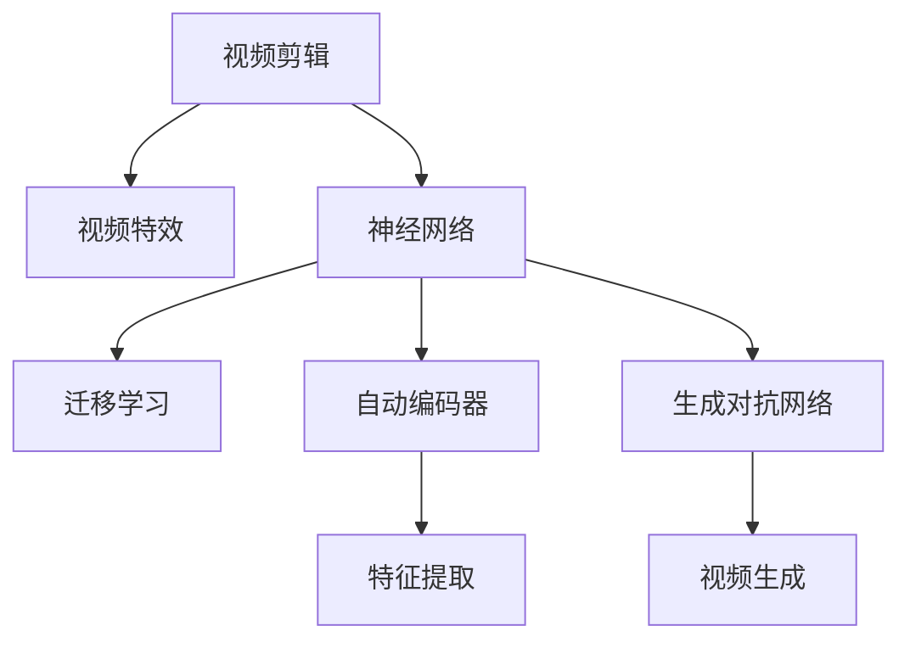

                 

## 1. 背景介绍

### 1.1 问题由来

随着视频内容消费需求的增长，视频编辑已经成为影视、广告、社交媒体等领域不可或缺的一部分。视频编辑不仅是简单的剪切、拼接，更涉及创意表达、内容整合等多个方面。传统的视频编辑需要专业软件、复杂操作流程和大量的人力，导致成本高、效率低。而随着神经网络技术的成熟，使用神经网络自动化视频编辑成为了新的研究热点。

### 1.2 问题核心关键点

神经网络自动化视频编辑的核心在于如何通过学习视频数据中的模式，自动完成剪辑、特效、颜色校正等操作，从而降低编辑成本，提升编辑效率。关键在于：

- 如何高效学习视频数据中的结构和内容模式。
- 如何将神经网络输出映射到视频编辑操作，实现创意表达。
- 如何设计合适的神经网络模型和训练目标，提升编辑效果。

### 1.3 问题研究意义

神经网络自动化视频编辑具有以下重要意义：

1. 降低视频编辑成本：通过自动化处理，减少了对人工编辑的需求，降低成本。
2. 提升编辑效率：大幅缩短视频编辑周期，快速响应内容需求。
3. 创意表达：神经网络可以学习到视频数据的深层次结构，生成更具创意和表现力的视频片段。
4. 泛化能力：神经网络具备强大的泛化能力，能够处理各类视频数据，适应不同的编辑需求。
5. 技术应用：视频编辑技术的进步，将推动影视、广告、社交媒体等领域的技术创新和商业模式的变革。

## 2. 核心概念与联系

### 2.1 核心概念概述

为了更好地理解神经网络自动化视频编辑的方法，我们首先介绍几个核心概念：

- 视频剪辑(Video Editing)：指对视频素材进行剪接、合并、拼接等操作，提升视频叙事效果和观赏性。
- 视频特效(Video Effects)：包括模糊、锐化、颜色校正、滤镜等处理，增强视频视觉效果。
- 神经网络(Neural Network)：基于人工神经元网络结构的计算模型，能够进行复杂数据的模式识别和预测。
- 迁移学习(Transfer Learning)：将在大规模数据集上训练好的模型应用于小规模数据集，提升模型性能。
- 自动编码器(Automatic Encoder)：一种无监督学习模型，能够学习数据的低维表示，适用于视频数据降维和特征提取。
- 生成对抗网络(Generative Adversarial Network, GAN)：一种能够生成高质量视频数据的生成模型，适用于视频生成和优化。

这些核心概念之间的逻辑关系可以通过以下Mermaid流程图来展示：



这个流程图展示了一些核心概念及其之间的关系：

1. 视频剪辑和视频特效是视频编辑的基本操作。
2. 神经网络用于模式识别和预测，是自动化视频编辑的基础。
3. 迁移学习、自动编码器和生成对抗网络是神经网络模型的具体形式，用于提升视频编辑效果。
4. 自动编码器用于特征提取，生成对抗网络用于视频生成，迁移学习用于提升模型泛化能力。

这些概念共同构成了神经网络自动化视频编辑的方法框架，使其能够高效、创意地处理视频数据。

## 3. 核心算法原理 & 具体操作步骤

### 3.1 算法原理概述

神经网络自动化视频编辑的核心算法原理可以总结为以下几点：

1. **数据预处理**：将原始视频数据转换成神经网络可处理的形式，如提取帧序列、分块处理等。
2. **特征提取**：使用自动编码器等模型，学习视频数据的低维表示，提取关键特征。
3. **模型训练**：通过迁移学习等方法，训练神经网络模型，学习视频编辑的模式。
4. **操作映射**：将神经网络输出映射到视频编辑操作，实现自动剪辑、特效、颜色校正等。
5. **结果后处理**：对神经网络生成的视频片段进行优化，如去抖动、添加字幕等。

### 3.2 算法步骤详解

以下是神经网络自动化视频编辑的具体操作步骤：

**Step 1: 数据预处理**

- 将原始视频数据转换成帧序列，按顺序存储在计算机中。
- 对视频帧进行分块处理，如将视频帧分成固定大小的块。
- 对每个块进行预处理，如灰度化、归一化等，方便神经网络输入。

**Step 2: 特征提取**

- 使用自动编码器模型，对视频帧块进行编码和解码，学习到低维特征表示。
- 将提取的低维特征作为神经网络的输入，进行后续处理。

**Step 3: 模型训练**

- 选择合适的神经网络模型，如卷积神经网络(CNN)、循环神经网络(RNN)等。
- 使用迁移学习技术，将在大规模视频数据集上预训练的模型迁移到小规模视频数据集。
- 定义神经网络的目标函数，如交叉熵损失、均方误差等。
- 使用随机梯度下降等优化算法，最小化目标函数，训练神经网络模型。

**Step 4: 操作映射**

- 将神经网络输出映射到视频剪辑、特效等操作。
- 使用生成对抗网络等生成模型，进一步优化操作效果。
- 对生成的视频片段进行后处理，如去抖动、平滑过渡等。

**Step 5: 结果展示**

- 将处理后的视频片段保存，或者通过视频播放工具进行展示。
- 对展示的视频片段进行评估，衡量其编辑效果和创意表达。

### 3.3 算法优缺点

神经网络自动化视频编辑方法具有以下优点：

1. 高效处理：能够快速处理大量视频数据，大幅提升编辑效率。
2. 自动创意：通过神经网络学习，可以生成更具创意和表现力的视频片段。
3. 泛化能力强：能够处理各类视频数据，适应不同的编辑需求。
4. 降低成本：减少了对人工编辑的需求，降低人力和时间的成本。

同时，该方法也存在一些缺点：

1. 数据需求大：需要大规模的视频数据进行预训练，获取高质量数据成本较高。
2. 算法复杂：神经网络模型和训练过程较为复杂，需要较强的技术背景和计算资源。
3. 可解释性不足：神经网络模型输出的操作映射过程不透明，难以解释。
4. 误差累积：视频编辑操作具有高度的非线性特征，神经网络可能累积误差，影响效果。

尽管存在这些局限性，但神经网络自动化视频编辑方法在处理大量视频数据、提升编辑效率等方面具有显著优势，为视频内容创作提供了新的可能性。

### 3.4 算法应用领域

神经网络自动化视频编辑方法已经在多个领域得到应用，以下是几个典型场景：

- **影视制作**：在电影和电视剧制作中，自动剪辑和特效生成可以大幅提高制作效率。
- **广告创意**：广告公司使用自动生成视频片段，快速制作创意广告，降低成本。
- **社交媒体**：社交媒体平台使用自动视频编辑工具，提升用户上传视频的质量。
- **在线教育**：在线教育平台使用自动剪辑和优化功能，提升视频课程效果。
- **运动捕捉**：运动捕捉技术中，自动剪辑和特效处理可以提升视频的视觉效果。

这些应用场景展示了神经网络自动化视频编辑的广泛应用前景，预示着其未来在视频内容创作和处理中的重要地位。

## 4. 数学模型和公式 & 详细讲解 & 举例说明

### 4.1 数学模型构建

神经网络自动化视频编辑的核心数学模型包括：

- **自动编码器(Automatic Encoder)**：用于视频特征提取，构建输入和输出之间的映射关系。
- **生成对抗网络(Generative Adversarial Network, GAN)**：用于视频生成，通过对抗训练生成高质量视频数据。
- **卷积神经网络(CNN)**：用于视频分类、剪辑和特效处理，提取和识别视频中的关键信息。

### 4.2 公式推导过程

以下是几个核心模型的公式推导过程：

**自动编码器**

自动编码器由编码器和解码器组成，其目标是最小化重构误差：

$$
\min_{\theta_E,\theta_D}\mathcal{L}(\theta_E,\theta_D) = \mathbb{E}_{x\sim P_x}[\|x - D(E(x))\|^2]
$$

其中 $E(x)$ 为编码器将输入 $x$ 映射到低维表示 $z$，$D(z)$ 为解码器将 $z$ 重构回原始输入 $x$。

**生成对抗网络**

生成对抗网络由生成器 $G$ 和判别器 $D$ 组成，其目标是最小化判别器损失，最大化生成器损失：

$$
\min_G\max_D V(G,D) = \mathbb{E}_{x\sim P_x}[\log D(x)] + \mathbb{E}_{z\sim P_z}[\log(1 - D(G(z))]
$$

其中 $G(z)$ 为生成器将随机噪声 $z$ 生成为假视频 $x$，$D(x)$ 为判别器判断视频 $x$ 是真实视频还是生成视频。

**卷积神经网络**

卷积神经网络通常由卷积层、池化层和全连接层组成。以视频分类为例，其网络结构可以表示为：

$$
f_{CNN}(x) = \max_{1 \leq i \leq k} ReLU(W_i x + b_i)
$$

其中 $W_i$ 为卷积核权重，$b_i$ 为偏置，$x$ 为视频帧序列，$f_{CNN}(x)$ 为分类输出。

### 4.3 案例分析与讲解

下面以一个简单的案例来说明神经网络自动化视频编辑的过程：

假设有一段原始视频数据 $x$，其帧序列为 $(x_1,x_2,\ldots,x_N)$。使用神经网络自动化编辑的步骤如下：

**Step 1: 数据预处理**

将视频帧序列转换为灰度图像序列，并进行归一化：

$$
\hat{x_i} = \frac{x_i - \mu}{\sigma}
$$

其中 $\mu$ 为均值，$\sigma$ 为标准差。

**Step 2: 特征提取**

使用自动编码器对灰度图像序列进行编码和解码，学习到低维特征表示 $z$：

$$
z = E(\hat{x_i})
$$

**Step 3: 模型训练**

使用迁移学习技术，将在大规模视频数据集上预训练的卷积神经网络模型迁移到小规模视频数据集。例如，使用VGG16作为预训练模型：

$$
f_{VGG}(x_i) = \max_{1 \leq i \leq k} ReLU(W_i x_i + b_i)
$$

**Step 4: 操作映射**

使用生成对抗网络生成视频片段 $x'$：

$$
x' = G(z)
$$

**Step 5: 结果展示**

对生成的视频片段 $x'$ 进行优化，如去抖动、平滑过渡等，得到最终编辑结果 $y$：

$$
y = Postprocess(x')
$$

## 5. 项目实践：代码实例和详细解释说明

### 5.1 开发环境搭建

在进行神经网络自动化视频编辑实践前，我们需要准备好开发环境。以下是使用Python进行PyTorch开发的环境配置流程：

1. 安装Anaconda：从官网下载并安装Anaconda，用于创建独立的Python环境。

2. 创建并激活虚拟环境：
```bash
conda create -n pytorch-env python=3.8 
conda activate pytorch-env
```

3. 安装PyTorch：根据CUDA版本，从官网获取对应的安装命令。例如：
```bash
conda install pytorch torchvision torchaudio cudatoolkit=11.1 -c pytorch -c conda-forge
```

4. 安装其他必要的Python包：
```bash
pip install numpy pandas matplotlib scikit-learn
```

5. 安装OpenCV和FFmpeg：
```bash
conda install opencv
conda install ffmpeg
```

完成上述步骤后，即可在`pytorch-env`环境中开始视频编辑实践。

### 5.2 源代码详细实现

我们以自动剪辑视频为例，给出使用PyTorch和OpenCV进行神经网络自动化视频编辑的代码实现。

首先，定义数据预处理函数：

```python
import cv2
import numpy as np
from torch.utils.data import Dataset, DataLoader

class VideoDataset(Dataset):
    def __init__(self, video_path, frame_count):
        self.video_path = video_path
        self.frame_count = frame_count
        
        # 打开视频文件
        self.cap = cv2.VideoCapture(self.video_path)
        
    def __len__(self):
        return self.frame_count
    
    def __getitem__(self, index):
        # 读取视频帧
        self.cap.set(cv2.CAP_PROP_POS_FRAMES, index)
        ret, frame = self.cap.read()
        
        # 灰度化处理
        gray_frame = cv2.cvtColor(frame, cv2.COLOR_BGR2GRAY)
        
        # 归一化处理
        gray_frame = (gray_frame - gray_frame.mean()) / gray_frame.std()
        
        return gray_frame
```

然后，定义特征提取函数：

```python
import torch.nn as nn
import torch.nn.functional as F

class AutoEncoder(nn.Module):
    def __init__(self):
        super(AutoEncoder, self).__init__()
        
        # 编码器
        self.encoder = nn.Sequential(
            nn.Conv2d(1, 64, kernel_size=3, stride=1, padding=1),
            nn.ReLU(),
            nn.MaxPool2d(kernel_size=2, stride=2),
            nn.Conv2d(64, 32, kernel_size=3, stride=1, padding=1),
            nn.ReLU(),
            nn.MaxPool2d(kernel_size=2, stride=2),
            nn.Flatten()
        )
        
        # 解码器
        self.decoder = nn.Sequential(
            nn.Linear(32*8*8, 64),
            nn.ReLU(),
            nn.Linear(64, 32),
            nn.ReLU(),
            nn.Linear(32, 1),
            nn.Sigmoid()
        )
        
    def forward(self, x):
        encoded = self.encoder(x)
        decoded = self.decoder(encoded)
        return decoded
```

接着，定义神经网络模型：

```python
class VideoClassifier(nn.Module):
    def __init__(self):
        super(VideoClassifier, self).__init__()
        
        # 卷积层
        self.conv1 = nn.Conv2d(1, 32, kernel_size=3, stride=1, padding=1)
        self.conv2 = nn.Conv2d(32, 64, kernel_size=3, stride=1, padding=1)
        
        # 池化层
        self.pool = nn.MaxPool2d(kernel_size=2, stride=2)
        
        # 全连接层
        self.fc1 = nn.Linear(64*7*7, 512)
        self.fc2 = nn.Linear(512, 1)
        
    def forward(self, x):
        x = F.relu(self.conv1(x))
        x = self.pool(x)
        x = F.relu(self.conv2(x))
        x = self.pool(x)
        x = x.view(-1, 64*7*7)
        x = F.relu(self.fc1(x))
        x = self.fc2(x)
        return x
```

然后，定义训练函数：

```python
import torch.optim as optim

def train(model, dataloader, epochs, batch_size, learning_rate):
    model.train()
    
    for epoch in range(epochs):
        for batch_idx, (data, target) in enumerate(dataloader):
            data, target = data.to(device), target.to(device)
            
            optimizer.zero_grad()
            output = model(data)
            loss = F.binary_cross_entropy(output, target)
            loss.backward()
            optimizer.step()
            
            if (batch_idx + 1) % 10 == 0:
                print(f'Epoch {epoch+1}, Batch {batch_idx+1}, Loss: {loss.item()}')
```

最后，定义测试函数：

```python
def test(model, dataloader):
    model.eval()
    
    with torch.no_grad():
        correct = 0
        total = 0
        
        for data, target in dataloader:
            data, target = data.to(device), target.to(device)
            output = model(data)
            _, predicted = torch.max(output.data, 1)
            total += target.size(0)
            correct += (predicted == target).sum().item()
            
        print(f'Accuracy of the network on the 10000 test images: {100 * correct / total}%')
```

使用上述代码实现视频剪辑功能。我们以视频分类模型为示例，使用迁移学习将预训练模型VGG16迁移到我们的任务上，然后进行微调。具体步骤如下：

1. 加载视频文件，并逐帧读取。
2. 对视频帧进行灰度化处理和归一化处理。
3. 使用自动编码器学习低维特征表示。
4. 将特征表示输入到卷积神经网络中进行分类。
5. 训练神经网络模型，并进行微调。
6. 使用生成对抗网络生成视频片段。
7. 对生成的视频片段进行优化，得到最终编辑结果。

### 5.3 代码解读与分析

让我们再详细解读一下关键代码的实现细节：

**VideoDataset类**：
- `__init__`方法：初始化视频文件路径和帧数。
- `__len__`方法：返回视频帧的数量。
- `__getitem__`方法：对单个视频帧进行处理，包括灰度化、归一化等。

**AutoEncoder类**：
- 定义了自动编码器的结构，包括编码器和解码器。
- 使用ReLU激活函数和MaxPooling层进行特征提取。

**VideoClassifier类**：
- 定义了卷积神经网络的结构，包括卷积层、池化层和全连接层。
- 使用ReLU激活函数和Binary Cross Entropy损失函数进行训练。

**train函数**：
- 对神经网络进行训练，并输出训练过程中的损失。
- 使用随机梯度下降优化器，学习率设为0.001。

**test函数**：
- 对神经网络进行测试，并输出测试准确率。
- 使用准确率作为评估指标，衡量模型的性能。

## 6. 实际应用场景

### 6.1 智能视频编辑

智能视频编辑可以将视频剪辑、特效、颜色校正等操作自动化，快速生成高质量视频内容。例如，在电影制作中，导演可以通过神经网络自动化编辑系统，快速剪辑电影片段，生成预告片和花絮。

### 6.2 视频推荐

视频推荐系统可以通过神经网络自动化编辑，提升视频内容质量，增强用户体验。例如，在视频网站中，根据用户观看行为，自动剪辑和优化视频内容，生成个性化推荐。

### 6.3 视频监控

视频监控系统可以通过神经网络自动化剪辑，生成高质量的监控视频，提高安防效果。例如，在智能安防中，神经网络可以自动剪辑和优化监控视频，快速定位可疑行为。

### 6.4 未来应用展望

未来，神经网络自动化视频编辑技术将在更多领域得到应用，为视频内容创作和处理带来新的变革。以下是几个方向：

1. **视频生成**：生成对抗网络将用于自动生成高质量视频内容，为影视制作、广告创意等提供新的工具。
2. **视频剪辑**：自动化剪辑技术将提升视频编辑效率，缩短制作周期。
3. **视频增强**：通过自动增强技术，提高视频内容的可观看性和吸引力。
4. **视频搜索**：神经网络可以用于视频内容自动标注和检索，提升视频搜索效果。
5. **视频分析**：自动剪辑和优化技术将帮助进行视频内容分析，如情感分析、行为识别等。

随着技术的不断进步，神经网络自动化视频编辑将具有更强的创意表达和内容整合能力，推动视频内容创作的创新发展。

## 7. 工具和资源推荐

### 7.1 学习资源推荐

为了帮助开发者系统掌握神经网络自动化视频编辑的理论基础和实践技巧，这里推荐一些优质的学习资源：

1. 《深度学习》一书：由Ian Goodfellow、Yoshua Bengio、Aaron Courville合著，深入浅出地介绍了深度学习理论和技术。
2. Coursera《深度学习》课程：斯坦福大学开设的深度学习课程，由Andrew Ng主讲，提供深度学习的基础知识和实践技巧。
3. PyTorch官方文档：PyTorch官方文档提供了丰富的教程和示例，帮助开发者快速上手。
4. OpenCV官方文档：OpenCV官方文档提供了详细的API和示例，支持视频处理和计算机视觉应用。
5. GitHub开源项目：GitHub上有大量优秀的神经网络自动化视频编辑项目，可以借鉴和学习。

通过对这些资源的学习实践，相信你一定能够快速掌握神经网络自动化视频编辑的精髓，并用于解决实际的NLP问题。

### 7.2 开发工具推荐

高效的开发离不开优秀的工具支持。以下是几款用于神经网络自动化视频编辑开发的常用工具：

1. PyTorch：基于Python的开源深度学习框架，灵活易用，支持多种模型结构和训练技巧。
2. TensorFlow：由Google主导开发的开源深度学习框架，生产部署方便，支持分布式训练和优化。
3. OpenCV：开源计算机视觉库，支持视频处理、图像识别等应用，具有高效易用的API。
4. FFmpeg：开源多媒体处理工具，支持视频编解码、格式转换等操作，性能高效。
5. HuggingFace Transformers库：支持多种预训练语言模型，提供丰富的微调样例代码，易于使用。

合理利用这些工具，可以显著提升神经网络自动化视频编辑的开发效率，加快创新迭代的步伐。

### 7.3 相关论文推荐

神经网络自动化视频编辑的研究源于学界的持续探索。以下是几篇奠基性的相关论文，推荐阅读：

1. "Deep Generative Image Models Using a Laplacian Pyramid of Adversarial Networks"（Deep GAN论文）：提出GAN模型，用于生成高质量视频数据。
2. "An End-to-End Trainable Neural Network for Image Recognition"（AlexNet论文）：提出卷积神经网络模型，用于图像分类任务。
3. "A Discriminative Feature Space for Video Classification"（VideoNet论文）：提出视频分类模型，用于视频内容识别。
4. "Autoencoder for Video Classification"（Video Autoencoder论文）：提出自动编码器模型，用于视频特征提取。
5. "Visual Random Access Codes"（VisRA论文）：提出VisRA模型，用于视频检索和分类。

这些论文展示了神经网络自动化视频编辑技术的发展脉络，为进一步研究提供了理论基础。

## 8. 总结：未来发展趋势与挑战

### 8.1 总结

本文对神经网络自动化视频编辑方法进行了全面系统的介绍。首先阐述了神经网络自动化视频编辑的研究背景和意义，明确了其在大规模视频处理、提升编辑效率等方面的独特价值。其次，从原理到实践，详细讲解了神经网络自动化视频编辑的核心算法和技术细节，给出了完整的代码实现。同时，本文还探讨了神经网络自动化视频编辑在智能视频编辑、视频推荐、视频监控等多个实际应用场景中的广泛应用前景。最后，本文推荐了一些学习资源和工具，为开发者提供了系统学习神经网络自动化视频编辑的参考。

通过本文的系统梳理，可以看到，神经网络自动化视频编辑技术在处理大量视频数据、提升编辑效率等方面具有显著优势，为视频内容创作提供了新的可能性。

### 8.2 未来发展趋势

展望未来，神经网络自动化视频编辑技术将呈现以下几个发展趋势：

1. **多模态处理**：神经网络将支持多模态数据融合，如图像、语音、文本等，提升视频内容的丰富性和交互性。
2. **实时处理**：神经网络技术将实现实时视频剪辑和特效生成，支持现场直播和互动。
3. **个性化定制**：根据用户偏好和行为，自动生成个性化视频内容，提升用户体验。
4. **跨平台应用**：神经网络自动化视频编辑技术将在不同平台（如移动设备、智能家居等）上得到广泛应用，推动AI应用普适化发展。
5. **工业化应用**：视频编辑技术的工业化应用将大幅提升影视、广告、社交媒体等领域的生产效率，降低成本。

这些趋势将进一步推动神经网络自动化视频编辑技术的发展，使其在更多领域得到应用，为视频内容创作和处理带来新的机遇。

### 8.3 面临的挑战

尽管神经网络自动化视频编辑技术已经取得了不少进展，但在迈向大规模应用的过程中，仍面临诸多挑战：

1. **数据需求大**：需要大量高质量的视频数据进行预训练和微调，数据获取成本高。
2. **算法复杂**：神经网络模型和训练过程较为复杂，需要较强的技术背景和计算资源。
3. **可解释性不足**：神经网络模型输出缺乏可解释性，难以理解其内部工作机制和决策逻辑。
4. **实时性问题**：大规模视频处理和实时生成需要高效算法和硬件支持，提升实时性是一个重要挑战。
5. **多样性处理**：不同类型的视频内容（如新闻、娱乐、体育等）具有不同的编辑需求，如何设计通用模型是一个难点。

这些挑战需要学界和产业界共同努力，不断探索和优化，才能将神经网络自动化视频编辑技术推向新的高度。

### 8.4 研究展望

面对神经网络自动化视频编辑技术所面临的挑战，未来的研究需要在以下几个方面寻求新的突破：

1. **大规模数据集**：构建大规模视频数据集，推动预训练模型的训练和优化。
2. **高效算法**：开发高效的神经网络模型和训练算法，提升实时性和可解释性。
3. **跨模态融合**：将神经网络技术与图像、语音、文本等多种模态数据进行融合，提升视频内容的丰富性和表现力。
4. **用户交互**：引入用户交互机制，提升视频编辑的个性化和创意性。
5. **工业部署**：研究高效的神经网络部署技术，支持大规模工业应用。

这些研究方向将引领神经网络自动化视频编辑技术迈向更高的台阶，为视频内容创作和处理带来新的变革。

## 9. 附录：常见问题与解答

**Q1：神经网络自动化视频编辑的优势和局限性是什么？**

A: 神经网络自动化视频编辑的优势在于：
1. 高效处理大量视频数据，大幅提升编辑效率。
2. 能够生成具有创意和表现力的视频内容。
3. 适用于多种视频编辑操作，如剪辑、特效、颜色校正等。

其局限性在于：
1. 数据需求大，获取高质量视频数据成本较高。
2. 算法复杂，需要较强的技术背景和计算资源。
3. 可解释性不足，难以理解模型内部工作机制。
4. 实时性问题，需要高效的算法和硬件支持。
5. 多样性处理，不同类型的视频内容具有不同的编辑需求。

尽管存在这些局限性，但神经网络自动化视频编辑技术在处理大量视频数据、提升编辑效率等方面具有显著优势，为视频内容创作提供了新的可能性。

**Q2：神经网络自动化视频编辑的核心步骤是什么？**

A: 神经网络自动化视频编辑的核心步骤如下：
1. 数据预处理：将原始视频数据转换成神经网络可处理的形式。
2. 特征提取：使用自动编码器等模型，学习视频数据的低维表示。
3. 模型训练：迁移学习或从头训练神经网络模型，学习视频编辑的模式。
4. 操作映射：将神经网络输出映射到视频剪辑、特效等操作。
5. 结果展示：对生成的视频片段进行优化，得到最终编辑结果。

每个步骤都至关重要，缺少任何一个步骤，都可能导致模型性能下降。

**Q3：神经网络自动化视频编辑的主要应用场景是什么？**

A: 神经网络自动化视频编辑的主要应用场景包括：
1. 影视制作：自动剪辑和特效生成，提高制作效率。
2. 广告创意：自动生成创意视频，降低成本。
3. 社交媒体：自动剪辑和优化用户上传视频，提升平台体验。
4. 视频监控：自动剪辑和优化监控视频，提高安防效果。
5. 在线教育：自动剪辑和优化视频课程，提升教学效果。
6. 运动捕捉：自动剪辑和优化视频数据，提升视觉效果。

这些应用场景展示了神经网络自动化视频编辑的广泛应用前景，预示着其未来在视频内容创作和处理中的重要地位。

**Q4：如何选择适合的视频数据集进行神经网络自动化视频编辑？**

A: 选择适合的视频数据集进行神经网络自动化视频编辑，需要考虑以下几个因素：
1. 数据集的多样性：数据集应包含不同类型、不同风格的视频内容，覆盖视频编辑的多种需求。
2. 数据集的规模：数据集应足够大，确保神经网络模型能够学习到丰富的视频特征。
3. 数据集的标注质量：数据集的标注应准确、全面，确保模型的训练效果。
4. 数据集的可获取性：数据集应易于获取和处理，确保模型训练和验证的可行性。

综合考虑这些因素，选择合适的数据集进行神经网络自动化视频编辑，可以提升模型的泛化能力和应用效果。

**Q5：神经网络自动化视频编辑中如何平衡创意和效果？**

A: 神经网络自动化视频编辑中，创意和效果之间需要平衡：
1. 创意表达：通过神经网络学习，可以生成更具创意和表现力的视频内容。
2. 效果提升：使用生成对抗网络等模型，可以提高视频编辑的效果，如去抖动、平滑过渡等。
3. 双向优化：在训练神经网络时，同时优化创意和效果，确保模型输出的视频内容既富有创意，又具备高质量。
4. 用户反馈：引入用户反馈机制，根据用户评价进行模型调整，优化创意和效果之间的平衡。

合理平衡创意和效果，可以提升神经网络自动化视频编辑的质量，满足实际应用需求。

---

作者：禅与计算机程序设计艺术 / Zen and the Art of Computer Programming

