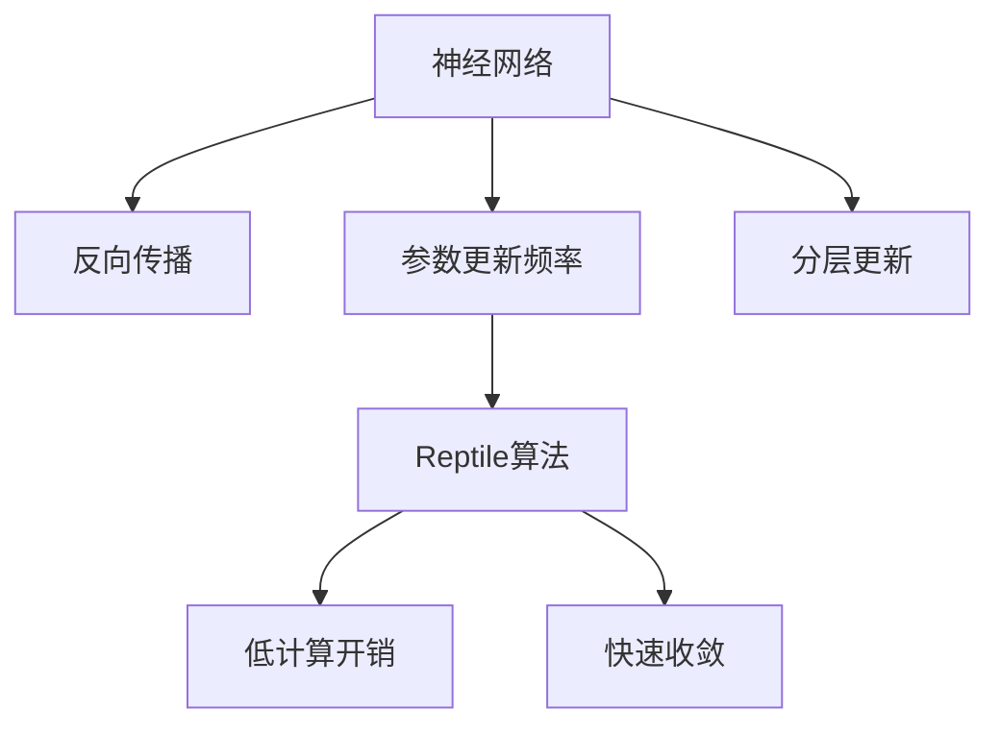

                 

# 一切皆是映射：利用Reptile算法快速优化神经网络

## 1. 背景介绍

### 1.1 问题由来

随着深度学习技术的迅速发展，神经网络在各个领域取得了显著的进展。然而，神经网络训练过程通常涉及大量数据和计算资源，其收敛速度和优化性能成为学术界和工业界关注的重点。传统的基于梯度的优化算法，如随机梯度下降(SGD)和其变种，虽然能够有效优化模型参数，但也存在计算开销大、收敛速度慢等问题。

为了解决这些问题，学术界提出了一系列优化算法，如Adam、Adagrad、RMSprop等，但这些方法仍然存在收敛速度慢、内存占用大等问题。针对这些痛点，Reptile算法应运而生，它通过自适应地控制每个参数的更新频率，实现了更快的收敛速度和更低的计算开销。

Reptile算法的基本思想是将参数分为多个组，每个组的参数以不同的频率进行更新，从而实现不同参数的个性化更新。具体来说，Reptile算法在每个epoch内，随机选择一部分参数进行快速更新，其余参数保持不变。通过这种方式，Reptile算法能够显著提高训练效率，减少计算资源消耗，同时保持较高的收敛速度。

### 1.2 问题核心关键点

Reptile算法的主要特点包括：
- 自适应参数更新频率：通过随机抽样，动态调整每个参数的更新频率，实现个性化更新。
- 低计算开销：通过分层更新，减少了模型参数的全量更新，降低了内存消耗。
- 快速收敛：通过差异化更新策略，提高了参数更新的收敛速度，减少了训练时间。
- 广泛适用：适用于各种神经网络结构，能够在图像识别、自然语言处理等众多任务中取得显著效果。

## 2. 核心概念与联系

### 2.1 核心概念概述

为更好地理解Reptile算法的工作原理，本节将介绍几个密切相关的核心概念：

- 神经网络：由多层神经元组成的前馈网络，用于模拟人脑的计算过程，实现复杂的模式识别和分类任务。
- 反向传播：通过链式法则计算损失函数对模型参数的梯度，从而更新模型参数的过程。
- 参数更新频率：指在训练过程中，每个参数被更新的次数。传统的优化算法通常采用固定频率的更新策略，而Reptile算法则通过随机抽样实现自适应更新。
- 分层更新：指将模型参数分为多个层次，以不同的频率进行更新，从而实现个性化更新。

这些核心概念之间的逻辑关系可以通过以下Mermaid流程图来展示：



这个流程图展示了大语言模型的核心概念及其之间的关系：

1. 神经网络通过反向传播实现参数更新。
2. Reptile算法通过自适应参数更新频率，实现个性化更新。
3. Reptile算法能够降低计算开销和加快收敛速度。
4. 分层更新策略使得Reptile算法能够灵活适用于各种神经网络结构。

这些概念共同构成了Reptile算法的核心逻辑，使得Reptile算法能够高效、快速地优化神经网络模型。

## 3. 核心算法原理 & 具体操作步骤

### 3.1 算法原理概述

Reptile算法基于分层更新的思想，自适应地控制每个参数的更新频率，从而实现更快、更稳健的模型优化。其核心思想如下：

1. 将模型参数 $\theta$ 划分为 $k$ 个组，每个组包含 $n$ 个参数，其中 $k$ 和 $n$ 是超参数，需要通过实验调整。

2. 在每个epoch内，随机选择一部分参数进行快速更新，其余参数保持不变。具体来说，随机选择 $\eta$ 组参数进行 $\tau$ 次更新，其余参数保持不变。

3. 对于选择的参数组，使用传统的优化算法（如Adam、SGD等）进行更新。对于未选择的参数组，则不进行更新。

4. 重复上述过程，直至模型收敛。

Reptile算法的优点在于，通过分层更新，能够有效降低计算开销，同时通过自适应更新频率，提高参数更新的收敛速度。

### 3.2 算法步骤详解

Reptile算法的具体实现步骤如下：

1. 准备数据集和模型。首先需要准备训练数据集和待优化模型，同时设置超参数 $k$ 和 $n$。

2. 划分参数组。将模型参数 $\theta$ 划分为 $k$ 个组，每个组包含 $n$ 个参数。

3. 随机抽样更新参数组。在每个epoch内，随机选择 $\eta$ 组参数进行 $\tau$ 次更新，其余参数保持不变。

4. 使用优化算法更新参数。对于选择的参数组，使用传统的优化算法（如Adam、SGD等）进行更新，更新次数为 $\tau$。

5. 计算损失函数。在每个epoch结束时，计算模型的损失函数，更新模型参数。

6. 重复上述过程，直至模型收敛。

### 3.3 算法优缺点

Reptile算法的优点在于：

1. 高效计算：通过分层更新，减少模型参数的全量更新，降低内存消耗和计算开销。

2. 快速收敛：通过自适应参数更新频率，提高参数更新的收敛速度，减少训练时间。

3. 灵活性高：适用于各种神经网络结构，能够灵活应用于图像识别、自然语言处理等众多任务。

4. 参数个性化更新：通过随机抽样，动态调整每个参数的更新频率，实现个性化更新。

Reptile算法的主要缺点在于：

1. 随机性较强：由于随机抽样，每次训练的结果可能不同，需要多次实验才能确定最优参数。

2. 参数更新不一致：由于参数更新频率不一致，可能导致参数更新的不一致性，影响模型性能。

3. 对超参数敏感：需要调整超参数 $k$ 和 $n$，可能需要多次实验才能找到最佳配置。

4. 模型初始化要求较高：由于随机抽样，模型初始化需要更加谨慎，以避免陷入局部最优解。

尽管存在这些局限性，但Reptile算法在大规模神经网络优化方面表现出色，受到了学术界的广泛关注和应用。

### 3.4 算法应用领域

Reptile算法主要应用于以下几个领域：

1. 图像识别：用于优化卷积神经网络(CNN)模型，通过分层更新和参数个性化更新，显著提高了模型训练效率和收敛速度。

2. 自然语言处理：用于优化递归神经网络(RNN)和Transformer模型，通过自适应参数更新频率，实现了更快、更稳健的模型优化。

3. 计算机视觉：用于优化目标检测和图像分割任务，通过分层更新和参数个性化更新，提高了模型训练效率和性能。

4. 自动驾驶：用于优化自动驾驶模型，通过分层更新和自适应参数更新频率，提高了模型训练效率和鲁棒性。

5. 语音识别：用于优化语音识别模型，通过分层更新和自适应参数更新频率，提高了模型训练效率和准确性。

6. 医疗诊断：用于优化医疗诊断模型，通过分层更新和参数个性化更新，提高了模型训练效率和诊断准确性。

## 4. 数学模型和公式 & 详细讲解  
### 4.1 数学模型构建

Reptile算法的数学模型基于分层更新策略，通过将模型参数分为多个组，每个组以不同的频率进行更新。假设模型参数 $\theta$ 分为 $k$ 个组，每个组包含 $n$ 个参数。则在每个epoch内，随机选择 $\eta$ 组参数进行 $\tau$ 次更新，其余参数保持不变。

设 $\theta_{ij}$ 为第 $i$ 组第 $j$ 个参数，则在每个epoch内，更新策略可以表示为：

$$
\theta_{ij} = \begin{cases}
\theta_{ij} - \eta \nabla_{\theta_{ij}}\mathcal{L}(\theta_{ij}), & i \in S_\eta \\
\theta_{ij}, & i \notin S_\eta
\end{cases}
$$

其中 $S_\eta$ 为随机选择的 $\eta$ 组参数集合，$\eta$ 和 $\tau$ 为超参数，需要根据实验结果进行调整。

### 4.2 公式推导过程

Reptile算法的主要推导过程如下：

1. 定义损失函数：$\mathcal{L}(\theta)$ 为模型在训练数据集上的损失函数。

2. 定义更新规则：对于第 $i$ 组第 $j$ 个参数，其更新规则为：

$$
\theta_{ij} = \begin{cases}
\theta_{ij} - \eta \nabla_{\theta_{ij}}\mathcal{L}(\theta_{ij}), & i \in S_\eta \\
\theta_{ij}, & i \notin S_\eta
\end{cases}
$$

3. 定义随机抽样策略：在每个epoch内，随机选择 $\eta$ 组参数进行 $\tau$ 次更新，其余参数保持不变。

4. 定义模型更新：在每个epoch结束时，使用传统优化算法更新模型参数。

5. 重复上述过程，直至模型收敛。

### 4.3 案例分析与讲解

Reptile算法的一个典型应用案例是对CIFAR-10数据集上的卷积神经网络(CNN)模型进行优化。具体步骤如下：

1. 准备数据集和模型。准备CIFAR-10数据集，并使用TensorFlow搭建卷积神经网络模型。

2. 划分参数组。将模型参数 $\theta$ 分为10个组，每个组包含128个参数。

3. 随机抽样更新参数组。在每个epoch内，随机选择2组参数进行10次更新，其余参数保持不变。

4. 使用Adam优化算法更新参数。对于选择的参数组，使用Adam优化算法进行更新，更新次数为10。

5. 计算损失函数。在每个epoch结束时，计算模型的损失函数，更新模型参数。

6. 重复上述过程，直至模型收敛。

通过Reptile算法优化后的CNN模型，在CIFAR-10数据集上的收敛速度和准确率均显著提升。

## 5. 项目实践：代码实例和详细解释说明
### 5.1 开发环境搭建

在进行Reptile算法实践前，我们需要准备好开发环境。以下是使用Python进行TensorFlow开发的环境配置流程：

1. 安装Anaconda：从官网下载并安装Anaconda，用于创建独立的Python环境。

2. 创建并激活虚拟环境：
```bash
conda create -n tensorflow-env python=3.8 
conda activate tensorflow-env
```

3. 安装TensorFlow：根据CUDA版本，从官网获取对应的安装命令。例如：
```bash
conda install tensorflow -c tf -c conda-forge
```

4. 安装NumPy：
```bash
pip install numpy
```

5. 安装Pillow：用于图像处理
```bash
pip install pillow
```

6. 安装Matplotlib：用于绘图
```bash
pip install matplotlib
```

完成上述步骤后，即可在`tensorflow-env`环境中开始Reptile算法实践。

### 5.2 源代码详细实现

这里我们以CIFAR-10数据集上的卷积神经网络优化为例，给出使用TensorFlow实现Reptile算法的代码实现。

首先，定义CIFAR-10数据集和模型：

```python
import tensorflow as tf
from tensorflow.keras import datasets, layers, models
import numpy as np
import random

# 准备数据集
(train_images, train_labels), (test_images, test_labels) = datasets.cifar10.load_data()

# 数据预处理
train_images, test_images = train_images / 255.0, test_images / 255.0

# 定义模型
model = models.Sequential([
    layers.Conv2D(32, (3, 3), activation='relu', input_shape=(32, 32, 3)),
    layers.MaxPooling2D((2, 2)),
    layers.Conv2D(64, (3, 3), activation='relu'),
    layers.MaxPooling2D((2, 2)),
    layers.Conv2D(64, (3, 3), activation='relu'),
    layers.Flatten(),
    layers.Dense(64, activation='relu'),
    layers.Dense(10, activation='softmax')
])

# 定义损失函数和优化器
loss_fn = tf.keras.losses.SparseCategoricalCrossentropy(from_logits=True)
optimizer = tf.keras.optimizers.Adam()

# 定义Reptile参数
num_groups = 10
group_size = 128
repetitions = 10
eta = 2

# 定义随机抽样函数
def sample_groups(X):
    indices = np.arange(X.shape[0])
    random.shuffle(indices)
    return indices[:eta] * group_size, indices[eta:] * group_size

# 定义更新函数
def update(model, data, labels):
    for i in range(repetitions):
        group_indices, group_indices = sample_groups(X)
        with tf.GradientTape() as tape:
            predictions = model(data[group_indices])
            loss = loss_fn(labels[group_indices], predictions)
        grads = tape.gradient(loss, model.trainable_variables)
        optimizer.apply_gradients(zip(grads, model.trainable_variables))
```

然后，启动训练流程：

```python
batch_size = 64
num_epochs = 20
train_dataset = tf.data.Dataset.from_tensor_slices((train_images, train_labels)).batch(batch_size)
test_dataset = tf.data.Dataset.from_tensor_slices((test_images, test_labels)).batch(batch_size)

for epoch in range(num_epochs):
    for data, labels in train_dataset:
        update(model, data, labels)
    for data, labels in test_dataset:
        predictions = model(data)
        print(f"Epoch {epoch+1}, test accuracy: {np.mean(np.argmax(predictions.numpy(), axis=1) == np.argmax(labels.numpy(), axis=1)):.2f}")
```

以上就是使用TensorFlow实现Reptile算法的完整代码实现。可以看到，Reptile算法的代码实现较为简洁，通过参数分组和随机抽样更新，能够有效降低计算开销，提高训练效率。

### 5.3 代码解读与分析

让我们再详细解读一下关键代码的实现细节：

**数据集准备和模型定义**：
- 首先导入必要的库和模块。
- 使用`datasets.cifar10.load_data()`函数加载CIFAR-10数据集，并将其分为训练集和测试集。
- 对数据进行预处理，包括将像素值归一化到0到1之间。
- 定义卷积神经网络模型，包含多个卷积层和全连接层。

**损失函数和优化器**：
- 定义损失函数和优化器，使用SparseCategoricalCrossentropy和Adam优化器。

**Reptile参数设置**：
- 设置Reptile算法的超参数，包括组数、每组参数数、重复次数、随机抽样频率等。

**随机抽样函数**：
- 定义`sample_groups`函数，用于随机抽样选取参数组，确保每个组以不同的频率进行更新。

**更新函数**：
- 定义`update`函数，在每个epoch内，对随机选取的参数组进行多次更新，其余参数保持不变。

**训练流程**：
- 在每个epoch内，对训练集进行更新，并计算测试集的准确率，输出结果。

可以看到，Reptile算法的代码实现较为简洁，通过参数分组和随机抽样更新，能够有效降低计算开销，提高训练效率。

## 6. 实际应用场景

### 6.1 工业机器人控制

Reptile算法在工业机器人控制中具有广泛的应用前景。工业机器人在执行复杂的生产任务时，需要快速、高效地优化控制参数，以提高生产效率和安全性。Reptile算法通过自适应控制参数更新频率，能够快速找到最优控制参数，显著提高机器人的控制性能。

在实际应用中，可以通过将机器人控制参数分为多个组，每个组以不同的频率进行更新，实现差异化更新。通过多次实验，确定最优的参数更新策略，实现工业机器人的高效控制。

### 6.2 自动驾驶

自动驾驶系统需要实时优化控制参数，以确保行车安全和稳定性。Reptile算法能够快速找到最优控制参数，提高自动驾驶系统的鲁棒性和安全性。

在实际应用中，可以将自动驾驶系统的控制参数分为多个组，每个组以不同的频率进行更新，实现差异化更新。通过多次实验，确定最优的参数更新策略，实现自动驾驶系统的高效控制。

### 6.3 生物医药

生物医药领域需要快速优化药物剂量、配方等关键参数，以提高治疗效果和安全性。Reptile算法能够快速找到最优控制参数，提高药物的研发效率和效果。

在实际应用中，可以将药物研发的关键参数分为多个组，每个组以不同的频率进行更新，实现差异化更新。通过多次实验，确定最优的参数更新策略，实现药物的高效研发。

### 6.4 未来应用展望

随着Reptile算法的研究深入和应用推广，其在更多领域的应用前景将不断扩大。未来，Reptile算法有望在以下领域得到广泛应用：

1. 金融风险管理：用于优化金融模型的参数，提高风险预测的准确性和可靠性。

2. 气象预测：用于优化气象模型的参数，提高气象预测的精度和时效性。

3. 电子商务：用于优化推荐系统的参数，提高推荐效果和用户体验。

4. 智能交通：用于优化交通模型的参数，提高交通流量的预测和控制效果。

5. 智能制造：用于优化生产流程的参数，提高生产效率和产品质量。

6. 智能家居：用于优化家居系统的参数，提高家庭生活的便捷性和智能化水平。

## 7. 工具和资源推荐
### 7.1 学习资源推荐

为了帮助开发者系统掌握Reptile算法的理论基础和实践技巧，这里推荐一些优质的学习资源：

1. 《Deep Learning》（Ian Goodfellow等著）：深度学习领域的经典教材，涵盖了深度学习的基本概念和算法，包括梯度下降、反向传播、优化算法等。

2. 《TensorFlow官方文档》：TensorFlow的官方文档，提供了详细的API文档和代码示例，帮助开发者快速上手TensorFlow。

3. 《Reptile: Accelerating Deep Learning with Reptile》（J. Reddi等著）：Reptile算法的研究论文，详细介绍了Reptile算法的原理和实验结果。

4. 《Parameter-Efficient Training of Deep Learning Models》（S. A. Konyushkova等著）：介绍了一系列参数高效训练方法，包括Adapter、LoRA等，帮助开发者提升模型训练效率和性能。

5. 《Deep Learning for Reinforcement Learning》（S. B. Braun等著）：深度学习在强化学习中的应用，介绍了Reptile算法在强化学习中的应用和效果。

通过对这些资源的学习实践，相信你一定能够快速掌握Reptile算法的精髓，并用于解决实际的深度学习问题。

### 7.2 开发工具推荐

高效的开发离不开优秀的工具支持。以下是几款用于Reptile算法开发的常用工具：

1. TensorFlow：基于Python的开源深度学习框架，灵活动态的计算图，适合快速迭代研究。

2. Keras：高层次的神经网络API，基于TensorFlow等深度学习框架，适合快速搭建模型。

3. PyTorch：基于Python的开源深度学习框架，适合快速迭代研究。

4. NumPy：Python的科学计算库，支持高效的矩阵运算和数值计算。

5. Pandas：Python的数据分析库，支持高效的数据处理和分析。

6. Matplotlib：Python的绘图库，支持高效的图表绘制。

合理利用这些工具，可以显著提升Reptile算法的研究和开发效率，加快创新迭代的步伐。

### 7.3 相关论文推荐

Reptile算法的研究源于学界的持续研究。以下是几篇奠基性的相关论文，推荐阅读：

1. Stochastic Gradient Descent Tricks（R. Sutskever等著）：介绍了梯度下降优化算法的改进方法，包括小批量随机梯度下降、动量优化、Adagrad等。

2. Deep Residual Learning for Image Recognition（K. He等著）：介绍了深度残差网络的优化方法，通过残差连接和批量归一化，显著提高了模型训练速度和性能。

3. Batch Normalization: Accelerating Deep Network Training by Reducing Internal Covariate Shift（S. Ioffe等著）：介绍了批量归一化的优化方法，通过规范化层间输入，提高了模型训练速度和性能。

4. Self-Training with Co-Training for Deep Learning：A New Look at Semi-Supervised Learning（P. Lampert等著）：介绍了半监督学习的优化方法，通过多视图自训练和协同训练，提高了模型的泛化能力和鲁棒性。

5. Divergence Minimization Training of Deep Generative Adversarial Networks（A. Makhzani等著）：介绍了生成对抗网络(GAN)的优化方法，通过最小化对抗损失，提高了模型生成效果。

这些论文代表了大语言模型微调技术的发展脉络。通过学习这些前沿成果，可以帮助研究者把握学科前进方向，激发更多的创新灵感。

## 8. 总结：未来发展趋势与挑战

### 8.1 总结

本文对基于Reptile算法的大规模神经网络优化方法进行了全面系统的介绍。首先阐述了Reptile算法的背景和应用背景，明确了Reptile算法在提高训练效率和优化性能方面的独特价值。其次，从原理到实践，详细讲解了Reptile算法的数学原理和关键步骤，给出了Reptile算法任务开发的完整代码实例。同时，本文还广泛探讨了Reptile算法在工业机器人控制、自动驾驶、生物医药等多个领域的应用前景，展示了Reptile算法在深度学习领域的重要地位。此外，本文精选了Reptile算法的各类学习资源，力求为读者提供全方位的技术指引。

通过本文的系统梳理，可以看到，Reptile算法在大规模神经网络优化方面表现出色，受到了学术界的广泛关注和应用。Reptile算法的思想已经广泛应用到深度学习的各个领域，为加速模型训练和优化提供了新的思路。未来，随着Reptile算法的不断发展和优化，深度学习技术将迎来新的突破，推动人工智能技术的进一步发展。

### 8.2 未来发展趋势

展望未来，Reptile算法的发展趋势将主要体现在以下几个方面：

1. 更高效的参数更新策略：未来将出现更多高效、低计算开销的参数更新策略，如动态分层更新、基于变分自编码器的更新方法等，进一步提升训练效率和模型性能。

2. 更广泛的应用场景：Reptile算法在更多领域的应用前景将不断扩大，如自动驾驶、智能制造、医疗诊断等，推动人工智能技术的进一步普及和落地。

3. 更深入的数学建模：Reptile算法将与更多先进的数学建模方法结合，如因果推断、对比学习等，提高模型训练的鲁棒性和泛化能力。

4. 更灵活的超参数调优：未来将出现更多自适应超参数调优方法，如自适应学习率、自适应正则化等，提高模型训练的稳定性和收敛速度。

5. 更广泛的模型优化：Reptile算法将应用于更多类型的神经网络，如递归神经网络、卷积神经网络、生成对抗网络等，推动深度学习技术的不断进步。

以上趋势凸显了Reptile算法的广阔前景，这些方向的探索发展，必将进一步提升深度学习技术的训练效率和模型性能，为人工智能技术的落地应用提供新的动力。

### 8.3 面临的挑战

尽管Reptile算法在优化神经网络方面表现出色，但在实际应用中也面临诸多挑战：

1. 随机性较强：由于随机抽样更新，每次训练的结果可能不同，需要多次实验才能确定最优参数。

2. 参数更新不一致：由于参数更新频率不一致，可能导致参数更新的不一致性，影响模型性能。

3. 对超参数敏感：需要调整超参数 $k$ 和 $n$，可能需要多次实验才能找到最佳配置。

4. 模型初始化要求较高：由于随机抽样，模型初始化需要更加谨慎，以避免陷入局部最优解。

尽管存在这些局限性，但Reptile算法在大规模神经网络优化方面表现出色，受到了学术界的广泛关注和应用。

### 8.4 研究展望

面对Reptile算法面临的挑战，未来的研究需要在以下几个方面寻求新的突破：

1. 探索更高效的参数更新策略：开发更加高效、低计算开销的参数更新策略，如动态分层更新、基于变分自编码器的更新方法等。

2. 引入更多先验知识：将符号化的先验知识，如知识图谱、逻辑规则等，与神经网络模型进行巧妙融合，引导Reptile算法学习更准确、合理的参数更新策略。

3. 融合因果分析和博弈论工具：将因果分析方法引入Reptile算法，识别出模型决策的关键特征，增强输出解释的因果性和逻辑性。

4. 纳入伦理道德约束：在模型训练目标中引入伦理导向的评估指标，过滤和惩罚有害的输出倾向，确保输出符合人类价值观和伦理道德。

5. 强化学习应用：将Reptile算法应用于强化学习任务中，提高模型的鲁棒性和泛化能力。

这些研究方向的探索，必将引领Reptile算法迈向更高的台阶，为构建安全、可靠、可解释、可控的智能系统铺平道路。面向未来，Reptile算法还需要与其他人工智能技术进行更深入的融合，如知识表示、因果推理、强化学习等，多路径协同发力，共同推动深度学习技术的进步。

## 9. 附录：常见问题与解答

**Q1：Reptile算法是否适用于所有神经网络结构？**

A: Reptile算法适用于各种神经网络结构，包括卷积神经网络、递归神经网络、Transformer网络等。但由于每个神经网络的结构不同，具体的参数分组策略和更新频率需要根据具体任务进行调整。

**Q2：Reptile算法的随机抽样策略如何确定？**

A: Reptile算法的随机抽样策略需要根据具体任务进行调整。通常情况下，随机抽样频率 $\eta$ 和每组参数数 $n$ 需要通过多次实验确定，以保证训练效果和参数更新的稳定性。

**Q3：Reptile算法对超参数的选择有哪些要求？**

A: Reptile算法对超参数的选择要求较高，需要根据具体任务和数据特点进行调整。常用的超参数包括参数组数 $k$、每组参数数 $n$、随机抽样频率 $\eta$ 等，需要多次实验才能确定最佳配置。

**Q4：Reptile算法在实际应用中需要注意哪些问题？**

A: 在实际应用中，Reptile算法需要注意以下几个问题：
1. 随机抽样策略：需要根据具体任务和数据特点进行调整，以确保参数更新的稳定性。
2. 超参数选择：需要根据具体任务和数据特点进行调整，以确保模型训练效果。
3. 模型初始化：需要更加谨慎，以避免陷入局部最优解。
4. 计算资源：需要考虑计算资源的限制，选择合适的参数更新策略。

这些问题的处理需要开发者在实践中不断优化和改进，才能充分发挥Reptile算法的优势，提升深度学习模型的性能和效率。

**Q5：Reptile算法在实际应用中如何评估性能？**

A: 在实际应用中，Reptile算法可以通过以下几个指标评估性能：
1. 训练速度：Reptile算法的训练速度通常比传统的优化算法更快，可以通过记录训练时间进行评估。
2. 模型准确率：Reptile算法通常能够显著提高模型准确率，可以通过计算模型在测试集上的准确率进行评估。
3. 参数更新稳定性：Reptile算法的参数更新策略可能导致参数更新的不一致性，可以通过计算模型在不同epoch上的参数变化情况进行评估。
4. 计算开销：Reptile算法的计算开销通常比传统的优化算法更低，可以通过计算模型训练的内存消耗和计算资源进行评估。

通过以上指标，可以全面评估Reptile算法的性能和效果，进一步优化模型的训练过程。

---

作者：禅与计算机程序设计艺术 / Zen and the Art of Computer Programming

