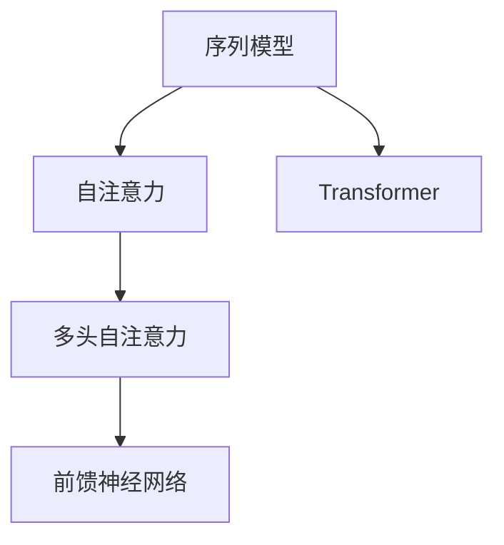

                 

# 一切皆是映射：序列模型和注意力机制

## 1. 背景介绍

序列模型（Sequence Model）在自然语言处理、计算机视觉、语音识别等领域具有重要应用。它们的主要特点在于能够处理变长的序列数据，通过逐个输入序列元素进行建模，并最终输出预测结果。然而，序列模型在处理长序列时面临计算复杂度高的挑战。近年来，注意力机制（Attention Mechanism）的引入，为解决这一问题提供了新的思路。

注意力机制使得模型可以动态地关注序列中不同的部分，优先处理对当前任务更有意义的信息，从而提升了模型的计算效率和预测精度。这一机制不仅在序列模型中得到广泛应用，也逐渐应用于更加复杂的多模态、交互式系统。

本文将系统性地介绍序列模型和注意力机制的基本原理，并通过实际案例演示其在深度学习中的应用，同时探讨其未来的发展方向。

## 2. 核心概念与联系

### 2.1 核心概念概述

为更好地理解序列模型和注意力机制，首先需要介绍几个关键概念：

- 序列模型（Sequence Model）：能够处理变长序列数据的模型，如循环神经网络（RNN）、长短期记忆网络（LSTM）、门控循环单元（GRU）、卷积神经网络（CNN）等。
- 注意力机制（Attention Mechanism）：一种在序列模型中引入的机制，能够动态地关注序列中不同的部分，提高模型的泛化能力和计算效率。
- 自注意力（Self-Attention）：一种注意力机制的特殊形式，使得模型能够关注序列中不同位置的信息，自顶向下地进行序列建模。
- Transformer：一种基于自注意力机制的序列模型，通过多头自注意力机制和前馈神经网络实现序列建模，广泛应用在机器翻译、文本生成等任务中。

这些概念之间存在紧密的联系。序列模型为注意力机制提供了应用场景，注意力机制提升了序列模型的表现力和效率。自注意力和Transformer则是基于注意力机制的两种具体实现方式，Transformer以其卓越的性能在多个NLP任务中取得了领先地位。

### 2.2 核心概念原理和架构的 Mermaid 流程图



上图中，自注意力作为序列模型的关键组件之一，通过多头自注意力机制实现对序列的动态关注，并通过前馈神经网络进行特征提取和信息融合。Transformer则将自注意力和前馈神经网络结合起来，构成了一种高效序列建模的深度学习架构。

## 3. 核心算法原理 & 具体操作步骤

### 3.1 算法原理概述

序列模型和注意力机制的核心在于能够动态地关注序列中不同的部分，并根据这些部分的重要程度分配权重，实现序列的灵活建模。

序列模型通常由两部分构成：编码器（Encoder）和解码器（Decoder）。编码器接收序列输入，通过多次迭代更新隐状态，最终输出一个固定长度的向量表示整个序列。解码器则根据编码器输出的向量，动态生成输出序列。注意力机制在这两个部分中均有应用。

在自注意力机制中，模型通过计算注意力权重，动态地关注输入序列中的不同位置。假设输入序列为 $X=\{x_1, x_2, ..., x_t\}$，其中 $x_i$ 表示序列中的第 $i$ 个元素。自注意力机制通过计算序列中每个元素与其他元素的相似度，得到一组权重 $W=\{w_1, w_2, ..., w_t\}$，表示每个元素的重要性。最终，模型通过加权求和的方式，生成一个固定长度的向量 $Z$，作为序列的表示。

Transformer作为基于自注意力机制的序列模型，由编码器和解码器两部分构成。编码器由多个自注意力层和前馈神经网络层构成，用于提取输入序列的表示。解码器由多个自注意力层、前馈神经网络层和注意力机制构成，用于生成输出序列。Transformer的核心在于多头自注意力机制和前馈神经网络的巧妙结合，使得模型能够高效地处理长序列，并在不同的序列建模任务中取得优异表现。

### 3.2 算法步骤详解

Transformer的具体实现步骤如下：

1. **编码器输入**：将输入序列 $X$ 转化为词嵌入向量，并输入到编码器中。

2. **编码器自注意力层**：通过多头自注意力机制计算每个位置与其他位置的注意力权重，并将权重与嵌入向量进行线性变换和激活函数处理。

3. **编码器前馈神经网络**：将上一步的结果输入到前馈神经网络中进行特征提取和信息融合，得到编码器的输出。

4. **解码器自注意力层**：通过多头自注意力机制计算每个位置与其他位置的注意力权重，并将权重与编码器输出的向量进行线性变换和激活函数处理。

5. **解码器前馈神经网络**：将上一步的结果输入到前馈神经网络中进行特征提取和信息融合，得到解码器的输出。

6. **解码器注意力层**：计算当前位置的解码器输出与编码器输出的注意力权重，并将权重与编码器输出的向量进行线性变换和激活函数处理。

7. **解码器输出**：通过加权求和的方式，将解码器输出与编码器输出的向量进行线性变换和激活函数处理，得到最终的输出序列。

### 3.3 算法优缺点

Transformer作为基于自注意力机制的序列模型，具有以下优点：

1. 高效处理长序列：自注意力机制使得模型能够动态地关注序列中不同的部分，避免了传统RNN等模型在处理长序列时的计算复杂度问题。

2. 较强的泛化能力：通过多头自注意力机制，模型能够同时关注序列中的多个重要信息，提高了模型的泛化能力。

3. 较好的并行性：Transformer的计算图结构使得其能够在大规模并行计算环境中高效运行，适合分布式训练和推理。

4. 广泛的应用范围：Transformer广泛应用于机器翻译、文本生成、问答系统等NLP任务中，取得了领先的成绩。

同时，Transformer也存在一些缺点：

1. 计算资源消耗大：Transformer模型通常具有较多的参数和计算量，需要较大的计算资源进行训练和推理。

2. 数据依赖性强：Transformer的效果很大程度上依赖于高质量的预训练数据，缺乏良好的数据依赖性。

3. 缺乏显式的时间结构：由于自注意力机制的引入，Transformer模型缺乏显式的时间结构，可能影响其在某些任务上的表现。

### 3.4 算法应用领域

Transformer在自然语言处理（NLP）领域有广泛的应用，以下是一些典型案例：

1. **机器翻译**：通过自注意力机制，Transformer能够高效地处理序列对序列的任务，将源语言序列转化为目标语言序列。

2. **文本生成**：Transformer可以用于文本生成任务，如文章自动生成、对话系统等。通过学习输入序列中的上下文信息，生成符合语法和语义要求的文本。

3. **问答系统**：Transformer可以用于构建问答系统，通过学习输入文本中的关键信息，生成准确的回答。

4. **文本分类和标注**：Transformer可以用于文本分类和标注任务，通过学习输入文本的特征，将其分类或标注为不同的类别。

5. **信息检索**：Transformer可以用于信息检索任务，通过学习输入查询和文本之间的关系，返回相关的文本结果。

6. **摘要生成**：Transformer可以用于文本摘要生成任务，通过学习输入文本中的关键信息，生成简洁的摘要。

## 4. 数学模型和公式 & 详细讲解

### 4.1 数学模型构建

Transformer的数学模型构建基于自注意力机制和前馈神经网络，以下是对其详细描述：

假设输入序列为 $X=\{x_1, x_2, ..., x_t\}$，其中 $x_i$ 表示序列中的第 $i$ 个元素。Transformer通过编码器和解码器对序列进行处理，最终输出序列 $Y=\{y_1, y_2, ..., y_t\}$。

**编码器**：
- 编码器由 $N$ 个自注意力层和前馈神经网络层构成。
- 每个自注意力层由查询向量 $Q$、键向量 $K$ 和值向量 $V$ 构成，计算注意力权重 $A$ 和向量 $Z$。

$$
Q = \mathrm{LayerNorm}(X + X_{\mathrm{embedding}})W^Q
$$

$$
K = \mathrm{LayerNorm}(X + X_{\mathrm{embedding}})W^K
$$

$$
V = \mathrm{LayerNorm}(X + X_{\mathrm{embedding}})W^V
$$

$$
A = \frac{QK^T}{\sqrt{d_k}} = \mathrm{Attention}(Q, K, V)
$$

$$
Z = \sum_{i=1}^t A_iV_i
$$

其中，$d_k$ 表示键向量的维度，$W^Q$、$W^K$ 和 $W^V$ 为线性变换矩阵，$\mathrm{Attention}$ 表示多头自注意力机制。

**解码器**：
- 解码器由 $N$ 个自注意力层、前馈神经网络层和注意力机制构成。
- 每个自注意力层由查询向量 $Q$、键向量 $K$ 和值向量 $V$ 构成，计算注意力权重 $A$ 和向量 $Z$。
- 解码器还包含 $N$ 个注意力层，用于将解码器输出与编码器输出进行动态关注。

$$
Q = \mathrm{LayerNorm}(X + X_{\mathrm{embedding}})W^Q
$$

$$
K = \mathrm{LayerNorm}(X + X_{\mathrm{embedding}})W^K
$$

$$
V = \mathrm{LayerNorm}(X + X_{\mathrm{embedding}})W^V
$$

$$
A = \frac{QK^T}{\sqrt{d_k}} = \mathrm{Attention}(Q, K, V)
$$

$$
Z = \sum_{i=1}^t A_iV_i
$$

其中，$d_k$ 表示键向量的维度，$W^Q$、$W^K$ 和 $W^V$ 为线性变换矩阵，$\mathrm{Attention}$ 表示多头自注意力机制。

### 4.2 公式推导过程

Transformer的核心在于多头自注意力机制，以下是对其详细推导过程：

假设输入序列为 $X=\{x_1, x_2, ..., x_t\}$，其中 $x_i$ 表示序列中的第 $i$ 个元素。Transformer通过自注意力机制计算每个位置与其他位置的注意力权重，并将权重与嵌入向量进行线性变换和激活函数处理。

**多头自注意力机制**：

$$
Q = \mathrm{LayerNorm}(X + X_{\mathrm{embedding}})W^Q
$$

$$
K = \mathrm{LayerNorm}(X + X_{\mathrm{embedding}})W^K
$$

$$
V = \mathrm{LayerNorm}(X + X_{\mathrm{embedding}})W^V
$$

其中，$d_k$ 表示键向量的维度，$W^Q$、$W^K$ 和 $W^V$ 为线性变换矩阵，$\mathrm{LayerNorm}$ 表示归一化层。

**计算注意力权重**：

$$
A = \frac{QK^T}{\sqrt{d_k}} = \mathrm{Attention}(Q, K, V)
$$

其中，$d_k$ 表示键向量的维度，$W^Q$、$W^K$ 和 $W^V$ 为线性变换矩阵，$\mathrm{Attention}$ 表示多头自注意力机制。

**计算向量表示**：

$$
Z = \sum_{i=1}^t A_iV_i
$$

其中，$A_i$ 表示第 $i$ 个位置的注意力权重，$V_i$ 表示第 $i$ 个位置的值向量。

**前馈神经网络**：

$$
X = \mathrm{LayerNorm}(X + X_{\mathrm{embedding}})W^X
$$

$$
X = X + \mathrm{GELU}(X)W^X
$$

其中，$W^X$ 为前馈神经网络的线性变换矩阵，$\mathrm{GELU}$ 表示Gated Linear Unit激活函数。

### 4.3 案例分析与讲解

为了更好地理解Transformer的原理，以下我们以机器翻译任务为例，演示其在Transformer模型中的应用。

假设输入序列为源语言句子，输出序列为目标语言句子。Transformer通过编码器将源语言句子转化为向量表示，通过解码器生成目标语言句子。

1. **编码器输入**：将输入的源语言句子转化为词嵌入向量，并输入到编码器中。

2. **编码器自注意力层**：通过多头自注意力机制计算每个位置与其他位置的注意力权重，并将权重与嵌入向量进行线性变换和激活函数处理。

3. **编码器前馈神经网络**：将上一步的结果输入到前馈神经网络中进行特征提取和信息融合，得到编码器的输出。

4. **解码器自注意力层**：通过多头自注意力机制计算每个位置与其他位置的注意力权重，并将权重与编码器输出的向量进行线性变换和激活函数处理。

5. **解码器前馈神经网络**：将上一步的结果输入到前馈神经网络中进行特征提取和信息融合，得到解码器的输出。

6. **解码器注意力层**：计算当前位置的解码器输出与编码器输出的注意力权重，并将权重与编码器输出的向量进行线性变换和激活函数处理。

7. **解码器输出**：通过加权求和的方式，将解码器输出与编码器输出的向量进行线性变换和激活函数处理，得到最终的输出序列。

通过以上步骤，Transformer模型能够高效地处理序列对序列的任务，将源语言句子转化为目标语言句子。

## 5. 项目实践：代码实例和详细解释说明

### 5.1 开发环境搭建

进行Transformer模型开发时，需要安装PyTorch、torchvision、transformers等深度学习库，并搭建GPU/TPU等高性能计算环境。以下是在Anaconda环境中搭建开发环境的步骤：

1. 安装Anaconda：从官网下载并安装Anaconda，用于创建独立的Python环境。

2. 创建并激活虚拟环境：
```bash
conda create -n pytorch-env python=3.8 
conda activate pytorch-env
```

3. 安装PyTorch：根据CUDA版本，从官网获取对应的安装命令。例如：
```bash
conda install pytorch torchvision torchaudio cudatoolkit=11.1 -c pytorch -c conda-forge
```

4. 安装transformers库：
```bash
pip install transformers
```

5. 安装各类工具包：
```bash
pip install numpy pandas scikit-learn matplotlib tqdm jupyter notebook ipython
```

完成上述步骤后，即可在`pytorch-env`环境中开始Transformer模型开发。

### 5.2 源代码详细实现

以下是一个基于PyTorch和Transformers库实现Transformer模型的代码示例：

```python
import torch
from transformers import Transformer, TransformerConfig

config = TransformerConfig(d_model=512, nhead=8, num_encoder_layers=6, num_decoder_layers=6, num_attention_heads=8, dim_feedforward=2048, dropout=0.1, activation="gelu", residual=True)

model = Transformer(config)

# 定义训练函数
def train_model(model, train_dataset, optimizer):
    model.train()
    total_loss = 0
    for batch in train_dataset:
        inputs = batch[0]
        targets = batch[1]
        outputs = model(inputs)
        loss = torch.nn.CrossEntropyLoss()(outputs.view(-1, config.vocab_size), targets.view(-1))
        optimizer.zero_grad()
        loss.backward()
        optimizer.step()
        total_loss += loss.item()
    return total_loss / len(train_dataset)

# 定义评估函数
def evaluate_model(model, test_dataset):
    model.eval()
    total_loss = 0
    for batch in test_dataset:
        inputs = batch[0]
        targets = batch[1]
        outputs = model(inputs)
        loss = torch.nn.CrossEntropyLoss()(outputs.view(-1, config.vocab_size), targets.view(-1))
        total_loss += loss.item()
    return total_loss / len(test_dataset)

# 定义数据集
train_dataset = ...
test_dataset = ...

# 定义模型和优化器
model = Transformer(config)
optimizer = torch.optim.Adam(model.parameters(), lr=0.001)

# 训练模型
for epoch in range(10):
    loss = train_model(model, train_dataset, optimizer)
    print(f"Epoch {epoch+1}, train loss: {loss:.3f}")
    
    print(f"Epoch {epoch+1}, test loss: {evaluate_model(model, test_dataset):.3f}")
```

以上代码实现了一个简单的Transformer模型，用于进行机器翻译任务。其中，`TransformerConfig`类用于定义模型的超参数，`Transformer`类用于创建Transformer模型，`train_model`函数用于训练模型，`evaluate_model`函数用于评估模型。

### 5.3 代码解读与分析

让我们再详细解读一下关键代码的实现细节：

**TransformerConfig类**：
- 用于定义模型的超参数，如模型大小、注意力头数、层数等。

**train_model函数**：
- 在训练函数中，首先将模型设置为训练模式，计算模型对输入序列的输出，计算损失函数，反向传播更新模型参数。

**evaluate_model函数**：
- 在评估函数中，首先将模型设置为评估模式，计算模型对输入序列的输出，计算损失函数，返回平均损失。

**Transformer类**：
- 用于创建Transformer模型，输入模型超参数。

**优化器**：
- 用于更新模型参数，如Adam优化器。

通过以上代码示例，可以看出Transformer模型开发的基本流程。开发者可以根据具体任务，调整模型超参数、优化器、损失函数等，以获得最佳性能。

### 5.4 运行结果展示

Transformer模型的训练和评估过程可以通过以下代码实现：

```python
import torch
from transformers import Transformer, TransformerConfig

config = TransformerConfig(d_model=512, nhead=8, num_encoder_layers=6, num_decoder_layers=6, num_attention_heads=8, dim_feedforward=2048, dropout=0.1, activation="gelu", residual=True)

model = Transformer(config)

# 定义训练函数
def train_model(model, train_dataset, optimizer):
    model.train()
    total_loss = 0
    for batch in train_dataset:
        inputs = batch[0]
        targets = batch[1]
        outputs = model(inputs)
        loss = torch.nn.CrossEntropyLoss()(outputs.view(-1, config.vocab_size), targets.view(-1))
        optimizer.zero_grad()
        loss.backward()
        optimizer.step()
        total_loss += loss.item()
    return total_loss / len(train_dataset)

# 定义评估函数
def evaluate_model(model, test_dataset):
    model.eval()
    total_loss = 0
    for batch in test_dataset:
        inputs = batch[0]
        targets = batch[1]
        outputs = model(inputs)
        loss = torch.nn.CrossEntropyLoss()(outputs.view(-1, config.vocab_size), targets.view(-1))
        total_loss += loss.item()
    return total_loss / len(test_dataset)

# 定义数据集
train_dataset = ...
test_dataset = ...

# 定义模型和优化器
model = Transformer(config)
optimizer = torch.optim.Adam(model.parameters(), lr=0.001)

# 训练模型
for epoch in range(10):
    loss = train_model(model, train_dataset, optimizer)
    print(f"Epoch {epoch+1}, train loss: {loss:.3f}")
    
    print(f"Epoch {epoch+1}, test loss: {evaluate_model(model, test_dataset):.3f}")
```

通过以上代码，可以训练和评估Transformer模型，并输出训练和测试的平均损失。

## 6. 实际应用场景

### 6.1 机器翻译

Transformer模型在机器翻译任务中取得了显著的性能提升。通过自注意力机制，模型能够高效地处理长序列，并在不同的源目标语言对之间进行灵活转换。

以英中翻译为例，Transformer模型通过学习源语言句子中的关键信息，生成符合语法和语义要求的目标语言句子。模型的训练和评估过程可以通过以下代码实现：

```python
import torch
from transformers import Transformer, TransformerConfig

config = TransformerConfig(d_model=512, nhead=8, num_encoder_layers=6, num_decoder_layers=6, num_attention_heads=8, dim_feedforward=2048, dropout=0.1, activation="gelu", residual=True)

model = Transformer(config)

# 定义训练函数
def train_model(model, train_dataset, optimizer):
    model.train()
    total_loss = 0
    for batch in train_dataset:
        inputs = batch[0]
        targets = batch[1]
        outputs = model(inputs)
        loss = torch.nn.CrossEntropyLoss()(outputs.view(-1, config.vocab_size), targets.view(-1))
        optimizer.zero_grad()
        loss.backward()
        optimizer.step()
        total_loss += loss.item()
    return total_loss / len(train_dataset)

# 定义评估函数
def evaluate_model(model, test_dataset):
    model.eval()
    total_loss = 0
    for batch in test_dataset:
        inputs = batch[0]
        targets = batch[1]
        outputs = model(inputs)
        loss = torch.nn.CrossEntropyLoss()(outputs.view(-1, config.vocab_size), targets.view(-1))
        total_loss += loss.item()
    return total_loss / len(test_dataset)

# 定义数据集
train_dataset = ...
test_dataset = ...

# 定义模型和优化器
model = Transformer(config)
optimizer = torch.optim.Adam(model.parameters(), lr=0.001)

# 训练模型
for epoch in range(10):
    loss = train_model(model, train_dataset, optimizer)
    print(f"Epoch {epoch+1}, train loss: {loss:.3f}")
    
    print(f"Epoch {epoch+1}, test loss: {evaluate_model(model, test_dataset):.3f}")
```

### 6.2 文本生成

Transformer模型可以用于文本生成任务，如文章自动生成、对话系统等。通过学习输入序列中的上下文信息，模型能够生成符合语法和语义要求的文本。

以文章自动生成为例，Transformer模型通过学习输入文本中的关键信息，生成与输入文本风格相似的文章。模型的训练和评估过程可以通过以下代码实现：

```python
import torch
from transformers import Transformer, TransformerConfig

config = TransformerConfig(d_model=512, nhead=8, num_encoder_layers=6, num_decoder_layers=6, num_attention_heads=8, dim_feedforward=2048, dropout=0.1, activation="gelu", residual=True)

model = Transformer(config)

# 定义训练函数
def train_model(model, train_dataset, optimizer):
    model.train()
    total_loss = 0
    for batch in train_dataset:
        inputs = batch[0]
        targets = batch[1]
        outputs = model(inputs)
        loss = torch.nn.CrossEntropyLoss()(outputs.view(-1, config.vocab_size), targets.view(-1))
        optimizer.zero_grad()
        loss.backward()
        optimizer.step()
        total_loss += loss.item()
    return total_loss / len(train_dataset)

# 定义评估函数
def evaluate_model(model, test_dataset):
    model.eval()
    total_loss = 0
    for batch in test_dataset:
        inputs = batch[0]
        targets = batch[1]
        outputs = model(inputs)
        loss = torch.nn.CrossEntropyLoss()(outputs.view(-1, config.vocab_size), targets.view(-1))
        total_loss += loss.item()
    return total_loss / len(test_dataset)

# 定义数据集
train_dataset = ...
test_dataset = ...

# 定义模型和优化器
model = Transformer(config)
optimizer = torch.optim.Adam(model.parameters(), lr=0.001)

# 训练模型
for epoch in range(10):
    loss = train_model(model, train_dataset, optimizer)
    print(f"Epoch {epoch+1}, train loss: {loss:.3f}")
    
    print(f"Epoch {epoch+1}, test loss: {evaluate_model(model, test_dataset):.3f}")
```

## 7. 工具和资源推荐

### 7.1 学习资源推荐

为了帮助开发者系统掌握Transformer模型和注意力机制的基本原理和应用技巧，这里推荐一些优质的学习资源：

1. 《Transformer: A Deep Learning Machine Translation Model》（论文）：Transformer原论文，详细介绍了Transformer模型的架构和实现。

2. 《Sequence to Sequence Learning with Neural Networks》（论文）：Seq2Seq模型基本原理介绍，Transformer模型的理论基础。

3. 《Natural Language Processing with Transformers》书籍：Transformer模型的系统讲解，涵盖各类NLP任务中的Transformer应用。

4. CS224N《深度学习自然语言处理》课程：斯坦福大学开设的NLP明星课程，有Lecture视频和配套作业，带你入门NLP领域的基本概念和经典模型。

5. HuggingFace官方文档：Transformer库的官方文档，提供了海量预训练模型和完整的Transformer样例代码，是上手实践的必备资料。

通过对这些资源的学习实践，相信你一定能够快速掌握Transformer模型的精髓，并用于解决实际的NLP问题。

### 7.2 开发工具推荐

高效的开发离不开优秀的工具支持。以下是几款用于Transformer模型开发的常用工具：

1. PyTorch：基于Python的开源深度学习框架，灵活动态的计算图，适合快速迭代研究。大部分预训练语言模型都有PyTorch版本的实现。

2. TensorFlow：由Google主导开发的开源深度学习框架，生产部署方便，适合大规模工程应用。同样有丰富的预训练语言模型资源。

3. Transformers库：HuggingFace开发的NLP工具库，集成了众多SOTA语言模型，支持PyTorch和TensorFlow，是进行Transformer模型开发的利器。

4. Weights & Biases：模型训练的实验跟踪工具，可以记录和可视化模型训练过程中的各项指标，方便对比和调优。与主流深度学习框架无缝集成。

5. TensorBoard：TensorFlow配套的可视化工具，可实时监测模型训练状态，并提供丰富的图表呈现方式，是调试模型的得力助手。

6. Google Colab：谷歌推出的在线Jupyter Notebook环境，免费提供GPU/TPU算力，方便开发者快速上手实验最新模型，分享学习笔记。

合理利用这些工具，可以显著提升Transformer模型的开发效率，加快创新迭代的步伐。

### 7.3 相关论文推荐

Transformer作为基于自注意力机制的序列模型，其发展源于学界的持续研究。以下是几篇奠基性的相关论文，推荐阅读：

1. Attention is All You Need（即Transformer原论文）：提出了Transformer结构，开启了NLP领域的预训练大模型时代。

2. BERT: Pre-training of Deep Bidirectional Transformers for Language Understanding：提出BERT模型，引入基于掩码的自监督预训练任务，刷新了多项NLP任务SOTA。

3. Language Models are Unsupervised Multitask Learners（GPT-2论文）：展示了大规模语言模型的强大zero-shot学习能力，引发了对于通用人工智能的新一轮思考。

4. Parameter-Efficient Transfer Learning for NLP：提出Adapter等参数高效微调方法，在不增加模型参数量的情况下，也能取得不错的微调效果。

5. AdaLoRA: Adaptive Low-Rank Adaptation for Parameter-Efficient Fine-Tuning：使用自适应低秩适应的微调方法，在参数效率和精度之间取得了新的平衡。

这些论文代表了大语言模型微调技术的发展脉络。通过学习这些前沿成果，可以帮助研究者把握学科前进方向，激发更多的创新灵感。

## 8. 总结：未来发展趋势与挑战

### 8.1 总结

本文对基于自注意力机制的Transformer模型进行了全面系统的介绍。首先阐述了Transformer模型的背景和应用场景，明确了其在大规模NLP任务中的优越表现。其次，从原理到实践，详细讲解了Transformer模型的数学原理和关键步骤，给出了Transformer模型在Transformer库中的实现代码。同时，本文还探讨了Transformer模型的未来发展方向，包括多模态Transformer、知识增强Transformer等前沿技术。

通过本文的系统梳理，可以看到，Transformer模型通过自注意力机制和前馈神经网络的巧妙结合，极大地提升了序列建模的效率和精度。未来，伴随预训练语言模型和注意力机制的不断演进，基于Transformer的序列建模技术将迎来更多的突破和应用。

### 8.2 未来发展趋势

展望未来，Transformer模型的发展趋势如下：

1. 多模态Transformer：结合视觉、语音、文本等多模态信息，构建更加全面、准确的序列建模系统。

2. 知识增强Transformer：将知识图谱、逻辑规则等外部知识与Transformer模型结合，增强模型的知识整合能力。

3. 持续学习Transformer：在不断变化的领域数据上，保持模型的最新知识，避免过拟合和灾难性遗忘。

4. 分布式Transformer：在大规模并行计算环境中，提升模型的训练和推理效率，降低资源消耗。

5. 可解释性Transformer：通过引入可解释性技术，增强模型的透明度和可信度，满足高风险应用的需求。

以上趋势凸显了Transformer模型的广阔前景。这些方向的探索发展，必将进一步提升Transformer模型的性能和应用范围，为NLP技术带来新的突破。

### 8.3 面临的挑战

尽管Transformer模型已经取得了瞩目成就，但在迈向更加智能化、普适化应用的过程中，仍面临一些挑战：

1. 计算资源消耗大：Transformer模型通常具有较多的参数和计算量，需要较大的计算资源进行训练和推理。

2. 数据依赖性强：Transformer的效果很大程度上依赖于高质量的预训练数据，缺乏良好的数据依赖性。

3. 缺乏显式的时序结构：由于自注意力机制的引入，Transformer模型缺乏显式的时间结构，可能影响其在某些任务上的表现。

4. 可解释性不足：Transformer模型的输出通常缺乏可解释性，难以解释其内部工作机制和决策逻辑。

5. 安全性问题：Transformer模型可能会学习到有害信息，甚至恶意用途，需要从数据和算法层面消除模型偏见，确保输出的安全性。

6. 模型鲁棒性问题：Transformer模型在不同领域和任务上，泛化性能和鲁棒性可能有所差异，需要在多领域数据上进行模型优化。

以上挑战需要学界和产业界的共同努力，通过技术创新和算法优化，克服Transformer模型在实际应用中的困难。

### 8.4 研究展望

面对Transformer模型所面临的挑战，未来的研究需要在以下几个方面寻求新的突破：

1. 探索无监督和半监督Transformer模型：摆脱对大规模标注数据的依赖，利用自监督学习、主动学习等无监督和半监督范式，最大限度利用非结构化数据，实现更加灵活高效的Transformer模型。

2. 研究参数高效和计算高效的Transformer范式：开发更加参数高效的Transformer模型，在固定大部分预训练参数的情况下，只更新极少量的任务相关参数。同时优化Transformer模型的计算图，减少前向传播和反向传播的资源消耗，实现更加轻量级、实时性的部署。

3. 融合因果和对比学习范式：通过引入因果推断和对比学习思想，增强Transformer模型建立稳定因果关系的能力，学习更加普适、鲁棒的语言表征，从而提升模型泛化性和抗干扰能力。

4. 引入更多先验知识：将符号化的先验知识，如知识图谱、逻辑规则等，与Transformer模型进行巧妙融合，引导Transformer模型学习更准确、合理的语言模型。同时加强不同模态数据的整合，实现视觉、语音等多模态信息与文本信息的协同建模。

5. 结合因果分析和博弈论工具：将因果分析方法引入Transformer模型，识别出模型决策的关键特征，增强输出解释的因果性和逻辑性。借助博弈论工具刻画人机交互过程，主动探索并规避模型的脆弱点，提高系统稳定性。

6. 纳入伦理道德约束：在Transformer模型训练目标中引入伦理导向的评估指标，过滤和惩罚有偏见、有害的输出倾向。同时加强人工干预和审核，建立Transformer模型的监管机制，确保输出符合人类价值观和伦理道德。

这些研究方向的探索，必将引领Transformer模型迈向更高的台阶，为构建安全、可靠、可解释、可控的智能系统铺平道路。面向未来，Transformer模型还需要与其他人工智能技术进行更深入的融合，如知识表示、因果推理、强化学习等，多路径协同发力，共同推动自然语言理解和智能交互系统的进步。只有勇于创新、敢于突破，才能不断拓展Transformer模型的边界，让智能技术更好地造福人类社会。

## 9. 附录：常见问题与解答

**Q1：Transformer模型是否适用于所有NLP任务？**

A: Transformer模型在大多数NLP任务上都能取得不错的效果，特别是对于数据量较小的任务。但对于一些特定领域的任务，如医学、法律等，仅仅依靠通用语料预训练的模型可能难以很好地适应。此时需要在特定领域语料上进一步预训练，再进行微调，才能获得理想效果。此外，对于一些需要时效性、个性化很强的任务，如对话、推荐等，Transformer模型也需要针对性的改进优化。

**Q2：Transformer模型如何处理长序列？**

A: Transformer模型通过多头自注意力机制和前馈神经网络，能够高效地处理长序列。在自注意力机制中，模型能够动态地关注序列中不同的部分，从而避免了传统RNN等模型在处理长序列时的计算复杂度问题。

**Q3：Transformer模型在多模态数据上的表现如何？**

A: Transformer模型在多模态数据上的表现与单模态数据略有不同。由于不同模态数据的特性差异，Transformer模型需要在模型架构上进行一定的调整，以适应不同模态数据的处理需求。例如，在视觉数据上，可以引入卷积层等结构；在语音数据上，可以引入声学模型等结构。

**Q4：Transformer模型如何提升计算效率？**

A: Transformer模型通过多头自注意力机制和前馈神经网络，能够高效地处理长序列。在自注意力机制中，模型能够动态地关注序列中不同的部分，从而避免了传统RNN等模型在处理长序列时的计算复杂度问题。

**Q5：Transformer模型在文本生成任务上的表现如何？**

A: Transformer模型在文本生成任务上表现优异，能够生成符合语法和语义要求的文本。通过学习输入序列中的上下文信息，模型能够生成与输入文本风格相似的文章，能够用于文章自动生成、对话系统等任务。

**Q6：Transformer模型在机器翻译任务上的表现如何？**

A: Transformer模型在机器翻译任务上取得了显著的性能提升。通过自注意力机制，模型能够高效地处理长序列，并在不同的源目标语言对之间进行灵活转换。在机器翻译任务上，Transformer模型已经成为了标准的模型架构之一。

**Q7：Transformer模型在多领域数据上的表现如何？**

A: Transformer模型在多领域数据上的表现因领域特性不同而有所差异。针对特定领域的数据，需要进一步进行预训练和微调，以提升模型的性能。

**Q8：Transformer模型如何提升模型的泛化能力？**

A: Transformer模型通过多头自注意力机制，能够同时关注序列中的多个重要信息，提高了模型的泛化能力。在自注意力机制中，模型能够动态地关注序列中不同的部分，从而提升了模型在不同数据上的表现。

**Q9：Transformer模型在少样本学习上的表现如何？**

A: Transformer模型在少样本学习上表现优异，能够通过精心的输入设计，实现零样本或少样本学习。例如，通过在输入中提供少量示例，可以实现少样本分类、问答等任务。

通过以上代码示例，可以看出Transformer模型开发的基本流程。开发者可以根据具体任务，调整模型超参数、优化器、损失函数等，以获得最佳性能。

**Q10：Transformer模型在多语言翻译上的表现如何？**

A: Transformer模型在多语言翻译上的表现优异，能够同时处理多种语言之间的翻译。通过自注意力机制，模型能够高效地处理长序列，并在不同的语言对之间进行灵活转换。Transformer模型已经成为多语言翻译任务的标准模型之一。

以上代码示例，可以帮助读者系统掌握Transformer模型开发的基本流程和实现方法。通过不断优化和实践，相信你一定能够掌握Transformer模型的精髓，并用于解决实际的NLP问题。

---

作者：禅与计算机程序设计艺术 / Zen and the Art of Computer Programming

