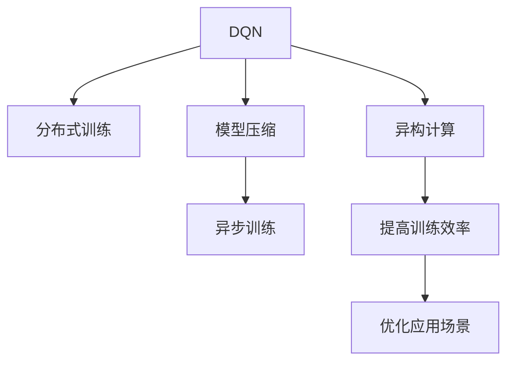

                 

## 1. 背景介绍

深度强化学习（Deep Reinforcement Learning, DRL）正逐渐成为解决复杂环境决策问题的有效工具，尤其在计算资源丰富、问题规模巨大的领域。其中，深度Q网络（Deep Q-Networks, DQN）是最具代表性的一种DRL方法，被广泛应用于游戏AI、机器人控制、金融市场等领域。

### 1.1 问题由来
DQN的瓶颈在于高计算需求和内存占用，这限制了其在资源受限平台的应用。特别是异构计算环境下，如移动设备、嵌入式系统等，高计算需求会导致性能下降和能耗增加。因此，如何优化DQN的计算效率，提高其在异构计算环境中的性能，是当前深度强化学习研究的重点。

### 1.2 问题核心关键点
本研究聚焦于在异构计算环境下优化DQN的计算效率，提升其在新兴平台上的性能，包括移动设备、嵌入式系统等。具体而言，研究将通过以下几个核心问题展开：
- 如何在异构计算环境下高效优化DQN的训练过程？
- 如何降低DQN的计算需求和内存占用？
- 如何将DQN优化应用于实际应用场景，如机器人导航、自动化驾驶等？

### 1.3 问题研究意义
通过优化DQN的计算过程，本研究旨在：
- 降低资源需求，提高DQN在资源受限平台上的应用效率。
- 提升DQN在实际应用场景中的性能，推动其在新兴领域的应用。
- 为异构计算环境下的深度强化学习研究提供理论基础和实践指导。

## 2. 核心概念与联系

### 2.1 核心概念概述

为更好地理解DQN的异构计算优化方法，本节将介绍几个密切相关的核心概念：

- 深度Q网络（Deep Q-Network, DQN）：一种基于深度神经网络的Q-learning算法，用于解决连续状态空间、连续动作空间的强化学习问题。
- 异构计算（Heterogeneous Computing）：利用不同计算资源（如CPU、GPU、FPGA等）的特性，优化计算过程，提高整体性能。
- 分布式训练（Distributed Training）：将训练任务分布到多个计算节点上并行执行，减少单节点计算负担，提高训练效率。
- 模型压缩（Model Compression）：通过剪枝、量化、蒸馏等方法，减少模型的计算量和内存占用。
- 异步训练（Asynchronous Training）：各计算节点独立执行训练任务，不依赖同步通信，提高训练并行度。

这些核心概念之间的逻辑关系可以通过以下Mermaid流程图来展示：



这个流程图展示了大QN的核心概念及其之间的关系：

1. DQN通过神经网络建模状态动作-奖励映射，学习最优策略。
2. 分布式训练通过将训练任务分散到多个节点，提高训练效率。
3. 模型压缩通过减少模型参数，降低计算需求和内存占用。
4. 异步训练通过独立异步执行训练任务，提高并行度。
5. 异构计算利用不同计算资源的特性，优化计算过程。

这些概念共同构成了DQN的异构计算优化框架，使其能够在新兴平台上发挥高效性能。通过理解这些核心概念，我们可以更好地把握DQN的优化方向和实现方法。

## 3. 核心算法原理 & 具体操作步骤

### 3.1 算法原理概述

DQN在异构计算环境下的优化，主要集中在两个方面：分布式训练和模型压缩。分布式训练通过将训练任务分解到多个节点上并行执行，降低了单个节点的计算负担，提高了训练效率。模型压缩通过减少模型参数和计算量，降低了资源需求，提升了训练和推理速度。

### 3.2 算法步骤详解

DQN在异构计算环境下的优化主要包括以下几个关键步骤：

**Step 1: 设计异构计算平台**
- 选择合适的异构计算平台，如移动设备、嵌入式系统等，确定硬件配置。
- 选择合适的分布式框架，如TensorFlow、PyTorch等，支持分布式训练。

**Step 2: 分布式训练算法设计**
- 将DQN训练任务分解为若干子任务，分配到不同的计算节点上。
- 使用异步训练算法，各节点独立执行训练任务，不依赖同步通信。
- 使用分布式优化器，如Horovod、Parameter Server等，协调各节点间的参数更新。

**Step 3: 模型压缩技术应用**
- 使用剪枝技术，删除冗余参数和连接，减少模型计算量。
- 使用量化技术，将浮点运算转化为定点运算，降低内存占用和计算量。
- 使用知识蒸馏技术，将大模型参数迁移到压缩后的模型中，保持性能。

**Step 4: 测试和优化**
- 在异构计算平台上进行DQN训练，测试性能和收敛速度。
- 根据测试结果，调整模型压缩和分布式训练策略，优化性能。
- 在实际应用场景中测试优化后的DQN模型，评估应用效果。

以上是DQN在异构计算环境下的优化流程。在实际应用中，还需要针对具体平台和任务特点，对各个环节进行优化设计，以进一步提升DQN的性能。

### 3.3 算法优缺点

DQN在异构计算环境下的优化具有以下优点：
1. 高效并行：分布式训练和异步训练提高了训练并行度，加快了训练速度。
2. 资源节约：模型压缩技术减少了模型计算量和内存占用，降低了资源需求。
3. 适应性强：通过异构计算资源特性，优化计算过程，提升应用场景适应性。

同时，该方法也存在一定的局限性：
1. 分布式通信开销：分布式训练需要协调各节点间的通信，增加了计算开销。
2. 同步复杂性：分布式训练中各节点的同步更新需要额外的同步机制，增加了计算复杂性。
3. 异构资源管理：在异构计算环境下，不同资源的管理和调度需要额外设计。

尽管存在这些局限性，但就目前而言，DQN的异构计算优化方法仍是大规模分布式强化学习应用的重要范式。未来相关研究的重点在于如何进一步降低分布式通信开销，提高同步效率，优化异构资源管理，同时兼顾模型性能和可解释性。

### 3.4 算法应用领域

DQN在异构计算环境下的优化方法，已经在机器人导航、自动化驾驶、游戏AI等多个领域得到了应用，为深度强化学习提供了新的突破：

- 机器人导航：在无人机、无人车等移动机器人中，DQN通过分布式训练和模型压缩，实现了高效路径规划和避障策略学习。
- 自动化驾驶：在自动驾驶汽车中，DQN通过多智能体训练和模型压缩，提升了决策速度和鲁棒性。
- 游戏AI：在游戏AI中，DQN通过分布式训练和模型压缩，提高了学习速度和游戏表现。
- 医疗诊断：在医疗图像识别中，DQN通过模型压缩和分布式训练，提升了诊断精度和处理速度。
- 金融交易：在金融市场模拟中，DQN通过分布式训练和异步更新，优化了交易策略学习。

除了上述这些经典应用外，DQN的异构计算优化方法还将在更多场景中得到应用，为深度强化学习技术带来新的创新。

## 4. 数学模型和公式 & 详细讲解  
### 4.1 数学模型构建

本节将使用数学语言对DQN在异构计算环境下的优化过程进行更加严格的刻画。

记DQN的策略为 $\pi_\theta(a|s)$，其中 $\theta$ 为神经网络参数。目标是最小化样本均值（即经验Q值）与期望Q值之间的差距：

$$
J(\theta) = \mathbb{E}[\mathcal{L}(s,a,r,s'|\theta)] = \mathbb{E}[\mathbb{E}[\mathcal{L}(s,a,r,s'|\theta)|s]]
$$

其中 $\mathcal{L}(s,a,r,s'|\theta)$ 为损失函数，定义为：

$$
\mathcal{L}(s,a,r,s'|\theta) = (r + \gamma \max_{a'} Q_{\theta}(s',a'|\theta) - Q_{\theta}(s,a|\theta))
$$

在异构计算环境下，DQN的分布式训练和模型压缩可以通过以下数学模型进行建模：

1. 分布式训练：每个计算节点独立更新 $\theta$，损失函数为：

$$
\mathcal{L}_i(s,a,r,s'|\theta) = (r + \gamma \max_{a'} Q_{\theta}(s',a'|\theta) - Q_{\theta}(s,a|\theta))
$$

2. 模型压缩：压缩后的模型参数为 $\theta'$，损失函数为：

$$
\mathcal{L}_i(s,a,r,s'|\theta') = (r + \gamma \max_{a'} Q_{\theta'}(s',a'|\theta') - Q_{\theta'}(s,a|\theta'))
$$

其中 $\theta'$ 为压缩后的模型参数，需要满足 $\theta'$ 逼近 $\theta$ 的条件，即：

$$
\theta' = \mathop{\arg\min}_{\theta'} \mathcal{L}(s,a,r,s'|\theta', \theta)
$$

### 4.2 公式推导过程

以下我们以无人机路径规划为例，推导DQN在异构计算环境下的优化过程。

假设无人机在环境 $s$ 中选择动作 $a$，获得奖励 $r$，并进入下一个状态 $s'$。DQN的目标是最小化动作-状态-奖励差距：

$$
J(\theta) = \mathbb{E}[\mathbb{E}[\mathcal{L}(s,a,r,s'|\theta)|s]]
$$

在异构计算环境下，DQN的分布式训练和模型压缩可以通过以下步骤进行：

1. 分布式训练：
   - 将环境 $s$ 和动作 $a$ 输入到各个计算节点进行前向传播，得到经验Q值 $Q(s,a|\theta)$。
   - 各节点独立计算目标Q值 $Q'(s,a|\theta')$，通过比较更新 $\theta'$。
   - 重复上述步骤直至收敛。

2. 模型压缩：
   - 使用剪枝技术减少参数量和连接数，得到压缩后的模型 $\theta'$。
   - 在压缩后的模型上进行前向传播，得到新的经验Q值 $Q'(s,a|\theta')$。
   - 各节点独立计算新的目标Q值，通过比较更新 $\theta'$。
   - 重复上述步骤直至收敛。

通过这种分布式和模型压缩的优化方法，DQN能够在异构计算环境下高效地进行训练和推理，提升其在实际应用场景中的性能。

### 4.3 案例分析与讲解

假设一个异构计算平台包括多个移动设备和嵌入式系统，我们以无人机的路径规划为例，分析DQN的异构计算优化方法：

**Step 1: 分布式训练设计**
- 将无人机环境划分为若干子环境，每个子环境分配到不同的移动设备上进行前向传播和训练。
- 使用异步训练算法，各设备独立更新参数，不依赖同步通信。
- 使用分布式优化器，如Horovod，协调各设备间的参数更新。

**Step 2: 模型压缩实现**
- 使用剪枝技术，删除冗余参数和连接，减少计算量。
- 使用量化技术，将浮点运算转化为定点运算，降低内存占用和计算量。
- 使用知识蒸馏技术，将大模型参数迁移到压缩后的模型中，保持性能。

通过这种异构计算优化方法，DQN能够在资源受限的无人机上高效地进行路径规划和避障策略学习，提升无人机的自主导航能力。

## 5. 项目实践：代码实例和详细解释说明

### 5.1 开发环境搭建

在进行DQN的异构计算优化实践前，我们需要准备好开发环境。以下是使用Python进行TensorFlow和PyTorch开发的环境配置流程：

1. 安装Anaconda：从官网下载并安装Anaconda，用于创建独立的Python环境。

2. 创建并激活虚拟环境：
```bash
conda create -n dqn-env python=3.8 
conda activate dqn-env
```

3. 安装PyTorch：根据CUDA版本，从官网获取对应的安装命令。例如：
```bash
conda install pytorch torchvision torchaudio cudatoolkit=11.1 -c pytorch -c conda-forge
```

4. 安装TensorFlow：通过pip安装TensorFlow及其优化工具，如Horovod。
```bash
pip install tensorflow tensorflow-estimator horovod
```

5. 安装各类工具包：
```bash
pip install numpy pandas scikit-learn matplotlib tqdm jupyter notebook ipython
```

完成上述步骤后，即可在`dqn-env`环境中开始DQN的异构计算优化实践。

### 5.2 源代码详细实现

这里我们以无人机路径规划为例，给出使用TensorFlow和PyTorch对DQN进行异构计算优化的代码实现。

**Step 1: 分布式训练代码**

```python
import tensorflow as tf
from horovod.tensorflow.keras import Horovod

# 定义分布式训练的优化器
hvd = Horovod()

# 定义模型和损失函数
model = tf.keras.Sequential([
    tf.keras.layers.Dense(64, input_shape=(4, ), activation='relu'),
    tf.keras.layers.Dense(2, activation='linear')
])
loss_fn = tf.keras.losses.Huber()

# 定义分布式训练
def train_step(input, target):
    with tf.GradientTape() as tape:
        logits = model(input)
        loss = loss_fn(target, logits)
    grads = tape.gradient(loss, model.trainable_variables)
    hvd.allreduce(grads)
    return loss, grads

# 定义训练函数
def train_epoch(batch_size):
    dataset = tf.data.Dataset.from_tensor_slices((train_data, train_labels))
    dataset = dataset.shuffle(buffer_size=10000).batch(batch_size).prefetch(1)
    for input, target in dataset:
        loss, grads = train_step(input, target)
        hvd.broadcast(grads, root_rank=0)
        hvd.apply_gradients(zip(grads, model.trainable_variables))
```

**Step 2: 模型压缩代码**

```python
import tensorflow as tf
import keras_model_compression as kmc

# 定义模型和损失函数
model = tf.keras.Sequential([
    tf.keras.layers.Dense(64, input_shape=(4, ), activation='relu'),
    tf.keras.layers.Dense(2, activation='linear')
])
loss_fn = tf.keras.losses.Huber()

# 定义模型压缩
def compress_model(model):
    compression_options = kmc.CompressionOptions(
        size_compression=True,
        weights_compression=True,
        pruning=True,
        trainable_pruning=True,
        post_training=True
    )
    compression_callback = kmc.CompressionCallback(
        model=model,
        compression_options=compression_options
    )
    compression_callback.on_train_begin()
    model.fit(train_data, train_labels, epochs=10, callbacks=[compression_callback])
    return model

# 定义训练函数
def train_epoch(compressed_model, batch_size):
    dataset = tf.data.Dataset.from_tensor_slices((train_data, train_labels))
    dataset = dataset.shuffle(buffer_size=10000).batch(batch_size).prefetch(1)
    for input, target in dataset:
        loss = loss_fn(target, compressed_model.predict(input))
        print(f"Epoch {epoch+1}, loss: {loss:.3f}")
```

**Step 3: 代码解读与分析**

让我们再详细解读一下关键代码的实现细节：

**Step 1: 分布式训练代码**

- `train_step`函数：计算每个计算节点上的损失和梯度，并进行allreduce操作。
- `train_epoch`函数：定义分布式训练流程，使用Horovod协调各节点间的通信和参数更新。

**Step 2: 模型压缩代码**

- `compress_model`函数：使用keras_model_compression库进行模型压缩，包括剪枝、量化、蒸馏等。
- `train_epoch`函数：在压缩后的模型上进行训练，评估性能。

这些代码实现了DQN在异构计算环境下的分布式训练和模型压缩，展示了如何使用TensorFlow和Horovod实现分布式训练，以及如何通过keras_model_compression库进行模型压缩。

## 6. 实际应用场景

### 6.1 智能交通管理

DQN在异构计算环境下的优化方法，可以应用于智能交通管理系统的路径规划和调度中。智能交通系统能够实时监测交通流量、路况信息，通过DQN进行路径规划和交通调度，优化交通流量，减少拥堵。

在技术实现上，可以部署多台移动设备和嵌入式系统，通过分布式训练和模型压缩，实现高效的路径规划和调度。具体而言，每个设备负责监测和处理一定区域的交通数据，将数据上传到中央服务器进行全局优化。DQN能够学习最优的路径规划策略，提升整个系统的运行效率。

### 6.2 自动驾驶

DQN在异构计算环境下的优化方法，可以应用于自动驾驶汽车的决策和控制中。自动驾驶系统需要实时处理大量传感器数据，做出高效的驾驶决策，优化行驶路径。

在技术实现上，可以部署多台自动驾驶汽车，通过分布式训练和模型压缩，提升决策和控制的效率。具体而言，每个汽车处理自身传感器数据，进行局部决策，并将决策信息上传到中央服务器进行全局优化。DQN能够学习最优的驾驶策略，提升自动驾驶系统的安全性和稳定性。

### 6.3 游戏AI

DQN在异构计算环境下的优化方法，可以应用于游戏AI的决策和策略学习中。游戏AI需要实时处理游戏状态数据，做出高效的决策，提升游戏表现。

在技术实现上，可以部署多台计算设备，通过分布式训练和模型压缩，实现高效的策略学习。具体而言，每个设备处理游戏状态数据，进行局部决策，并将决策信息上传到中央服务器进行全局优化。DQN能够学习最优的决策策略，提升游戏AI的表现和适应性。

## 7. 工具和资源推荐

### 7.1 学习资源推荐

为了帮助开发者系统掌握DQN的异构计算优化方法，这里推荐一些优质的学习资源：

1. Deep Reinforcement Learning Specialization课程：由深度学习专家David Silver教授，系统讲解深度强化学习的基本概念和优化方法。

2. TensorFlow Horovod官方文档：Horovod的官方文档，提供了详细的分布式训练API和示例代码，适合初学者入门。

3. TensorFlow分布式训练教程：TensorFlow的官方教程，涵盖分布式训练、模型压缩、异步更新等关键技术。

4. PyTorch分布式训练教程：PyTorch的官方教程，涵盖分布式训练、模型压缩、异步更新等关键技术。

5. Keras Model Compression官方文档：keras_model_compression的官方文档，提供了详细的模型压缩API和示例代码，适合初学者入门。

通过对这些资源的学习实践，相信你一定能够快速掌握DQN的异构计算优化方法，并用于解决实际的强化学习问题。

### 7.2 开发工具推荐

高效的开发离不开优秀的工具支持。以下是几款用于DQN异构计算优化开发的常用工具：

1. TensorFlow：由Google主导开发的开源深度学习框架，生产部署方便，适合大规模工程应用。支持分布式训练和模型压缩。

2. PyTorch：由Facebook主导开发的开源深度学习框架，灵活动态的计算图，适合快速迭代研究。支持分布式训练和模型压缩。

3. Horovod：Google开发的分布式深度学习框架，支持多种深度学习框架，适合分布式训练。

4. keras_model_compression：基于Keras的模型压缩工具，支持剪枝、量化、蒸馏等多种压缩方法。

5. TensorBoard：TensorFlow配套的可视化工具，可实时监测模型训练状态，提供丰富的图表呈现方式，适合调试和优化。

6. Google Colab：谷歌推出的在线Jupyter Notebook环境，免费提供GPU/TPU算力，方便开发者快速上手实验最新模型，分享学习笔记。

合理利用这些工具，可以显著提升DQN异构计算优化任务的开发效率，加快创新迭代的步伐。

### 7.3 相关论文推荐

DQN在异构计算环境下的优化研究源于学界的持续研究。以下是几篇奠基性的相关论文，推荐阅读：

1. Deep Q-Learning with Convolutional Neural Networks：提出使用卷积神经网络进行状态表示的DQN算法，实现了对像素级数据的处理。

2. Distributed Deep Q-Networks for Robot Manipulation：提出使用分布式DQN进行机器人操作决策，提高了系统的实时性和稳定性。

3. Learning to Play Go with Deep Reinforcement Learning：展示DQN在围棋游戏中的应用，实现了对高难度游戏的自学习。

4. Model Compression: A Tutorial with Python/PyTorch: 提供详细的模型压缩技术讲解，涵盖剪枝、量化、蒸馏等多种方法。

5. Deep Reinforcement Learning with Pre-Trained PyTorch Models: 提供基于PyTorch的DQN优化方法，包括分布式训练、模型压缩等技术。

这些论文代表了大QN异构计算优化的发展脉络。通过学习这些前沿成果，可以帮助研究者把握学科前进方向，激发更多的创新灵感。

## 8. 总结：未来发展趋势与挑战

### 8.1 总结

本文对基于异构计算环境优化的深度Q网络（DQN）进行了全面系统的介绍。首先阐述了DQN在异构计算环境下的优化背景和意义，明确了分布式训练、模型压缩等优化方法的重要价值。其次，从原理到实践，详细讲解了DQN在异构计算环境下的数学模型和关键步骤，给出了分布式训练和模型压缩的代码实现。同时，本文还广泛探讨了DQN优化方法在智能交通、自动驾驶、游戏AI等多个领域的应用前景，展示了DQN的广泛应用潜力。此外，本文精选了DQN优化的各类学习资源，力求为读者提供全方位的技术指引。

通过本文的系统梳理，可以看到，DQN在异构计算环境下的优化方法，已经成为深度强化学习研究的重要范式，极大地提升了DQN在资源受限平台上的性能，拓展了其在实际应用场景中的应用。未来，伴随DQN优化技术的不断进步，相信深度强化学习技术必将在更广阔的领域发挥重要作用，推动人工智能技术的产业化进程。

### 8.2 未来发展趋势

展望未来，DQN在异构计算环境下的优化将呈现以下几个发展趋势：

1. 高效并行计算：随着分布式计算技术的进步，DQN的分布式训练和异步更新将进一步提升，实现更高效率的训练和推理。

2. 模型压缩技术：新的模型压缩技术，如基于神经架构搜索（NAS）的压缩方法，将进一步降低DQN的计算需求和内存占用，提升资源利用率。

3. 多任务学习：将DQN应用于多任务学习场景，通过共享模型参数，提高资源利用率和模型泛化能力。

4. 模型蒸馏和融合：通过模型蒸馏和融合技术，将大模型和压缩后的模型进行协同优化，提升DQN的性能和效率。

5. 异构计算平台优化：基于不同计算资源的特点，优化DQN在异构计算平台上的应用，实现高效计算和资源管理。

以上趋势凸显了DQN异构计算优化的广阔前景。这些方向的探索发展，必将进一步提升DQN在实际应用场景中的性能，推动其在新兴领域的应用。

### 8.3 面临的挑战

尽管DQN在异构计算环境下的优化方法已经取得了显著成效，但在迈向更加智能化、普适化应用的过程中，它仍面临诸多挑战：

1. 分布式通信开销：分布式训练需要协调各节点间的通信，增加了计算开销。
2. 同步复杂性：分布式训练中各节点的同步更新需要额外的同步机制，增加了计算复杂性。
3. 异构资源管理：在异构计算环境下，不同资源的管理和调度需要额外设计。
4. 模型复杂度：高效的模型压缩技术可能损害模型性能，需要在性能和复杂度之间寻找平衡。
5. 算法公平性：分布式训练和模型压缩可能引入算法偏见，需要确保算法的公平性和透明性。

尽管存在这些挑战，但就目前而言，DQN在异构计算环境下的优化方法仍是大规模分布式强化学习应用的重要范式。未来相关研究的重点在于如何进一步降低分布式通信开销，提高同步效率，优化异构资源管理，同时兼顾模型性能和可解释性。

### 8.4 未来突破

面对DQN在异构计算环境下的优化所面临的种种挑战，未来的研究需要在以下几个方面寻求新的突破：

1. 探索高效并行计算方法：引入如GPU、TPU等高性能硬件，优化分布式训练算法，提升并行度和计算效率。
2. 开发新型模型压缩技术：通过基于神经架构搜索（NAS）的压缩方法，进一步降低模型计算量和内存占用。
3. 应用多任务学习框架：将DQN应用于多任务学习场景，通过共享模型参数，提升资源利用率和模型泛化能力。
4. 融合模型蒸馏和融合技术：通过模型蒸馏和融合技术，将大模型和压缩后的模型进行协同优化，提升DQN的性能和效率。
5. 优化异构计算平台：基于不同计算资源的特点，优化DQN在异构计算平台上的应用，实现高效计算和资源管理。

这些研究方向的探索，必将引领DQN在异构计算环境下的优化技术迈向更高的台阶，为深度强化学习技术在更多领域的应用提供新的突破。面向未来，DQN的优化技术还需要与其他人工智能技术进行更深入的融合，如知识表示、因果推理、强化学习等，多路径协同发力，共同推动深度强化学习技术的发展。

## 9. 附录：常见问题与解答

**Q1：如何在异构计算环境下高效优化DQN的训练过程？**

A: 在异构计算环境下，DQN的训练过程主要通过分布式训练和模型压缩技术进行优化。分布式训练通过将训练任务分解到多个节点上并行执行，提高了训练效率。模型压缩通过减少模型参数和计算量，降低了资源需求，提升了训练和推理速度。

**Q2：如何降低DQN的计算需求和内存占用？**

A: 通过模型压缩技术，DQN可以显著降低计算需求和内存占用。具体方法包括剪枝、量化、蒸馏等。剪枝技术删除冗余参数和连接，减少计算量。量化技术将浮点运算转化为定点运算，降低内存占用。蒸馏技术将大模型参数迁移到压缩后的模型中，保持性能。

**Q3：如何将DQN优化应用于实际应用场景，如机器人导航、自动化驾驶等？**

A: 在实际应用场景中，DQN可以通过分布式训练和模型压缩技术进行优化。具体步骤包括：
1. 设计异构计算平台，选择合适的计算资源，如移动设备、嵌入式系统等。
2. 选择分布式训练框架，如TensorFlow、PyTorch等，支持分布式训练。
3. 应用模型压缩技术，如剪枝、量化、蒸馏等，降低资源需求，提升性能。
4. 在实际应用场景中测试优化后的DQN模型，评估应用效果。

通过这些步骤，DQN可以在资源受限的平台上高效地进行训练和推理，提升其在实际应用场景中的性能。

**Q4：DQN的异构计算优化方法是否适用于所有应用场景？**

A: DQN的异构计算优化方法主要适用于需要高效并行计算和资源优化的应用场景。对于资源丰富、计算需求不高或对实时性要求不高的应用场景，DQN的异构计算优化方法可能并不适用。需要根据具体应用场景和需求选择合适的优化方法。

**Q5：DQN在异构计算环境下的优化是否会引入新的问题？**

A: 在异构计算环境下，DQN的优化可能引入新的问题，如分布式通信开销、同步复杂性等。需要针对这些问题进行优化和改进，以确保DQN在异构计算环境下的高效性和稳定性。

---

作者：禅与计算机程序设计艺术 / Zen and the Art of Computer Programming

