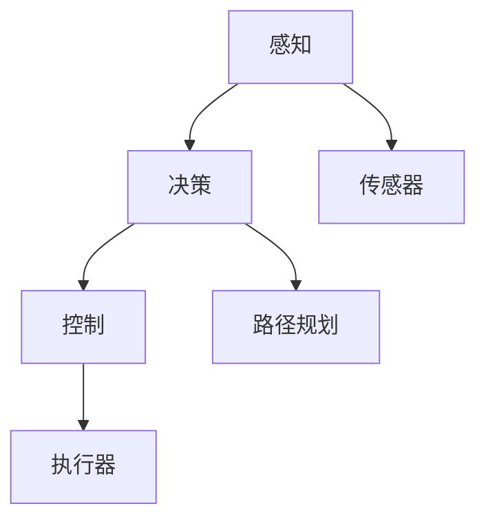
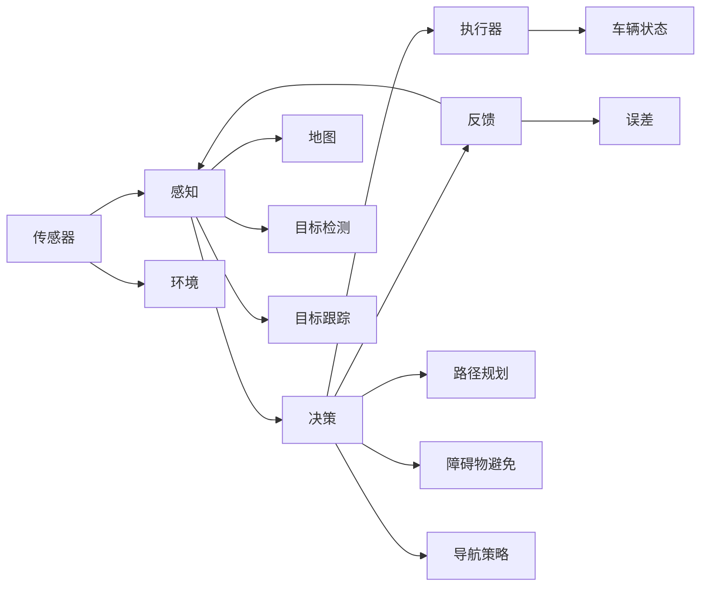
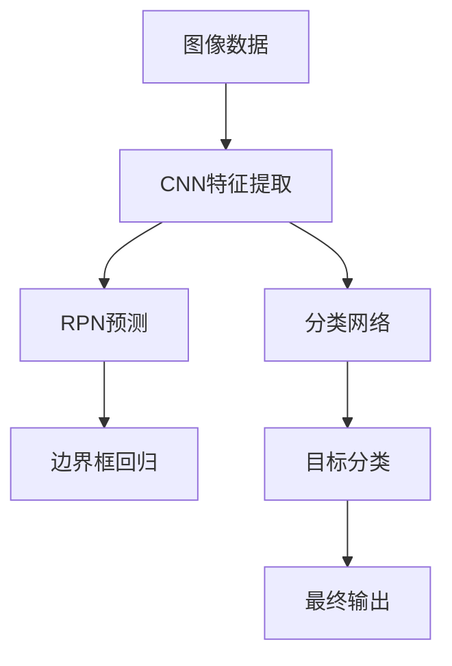

                 

# 一切皆是映射：自动驾驶技术中的AI算法

## 1. 背景介绍

自动驾驶技术是现代人工智能领域的一大热门方向，其核心在于通过AI算法实现对车辆环境的智能感知、路径规划与决策，最终实现无人驾驶。本文旨在探讨自动驾驶中AI算法的设计与实现，详细解析自动驾驶系统中的核心算法原理、操作步骤，以及相关技术的前景与挑战。

## 2. 核心概念与联系

### 2.1 核心概念概述

在自动驾驶中，AI算法扮演了至关重要的角色。其核心算法主要包括：

- **感知（Perception）**：通过各类传感器（如激光雷达、摄像头、雷达）获取环境信息，进行目标检测与跟踪。
- **决策（Decision Making）**：根据感知结果进行路径规划和行动决策，选择最优的行动方案。
- **控制（Control）**：执行决策结果，控制车辆行驶，保持稳定的行驶状态。

这些核心算法彼此关联，形成一个闭环系统，确保自动驾驶车辆能够安全、高效地运行。以下通过Mermaid流程图展示这些核心概念的联系：



- **感知**：通过传感器捕获车辆周围的环境信息，是自动驾驶的基础。
- **决策**：根据感知信息进行路径规划和行动选择，是自动驾驶的核心。
- **控制**：执行决策结果，保证车辆按照预定路径行驶，是自动驾驶的执行环节。

### 2.2 核心概念原理和架构的 Mermaid 流程图

以下是基于感知、决策和控制的自动驾驶系统架构的Mermaid流程图，展示了各模块的输入输出和功能：



该流程图中，感知模块负责从环境获取信息，决策模块根据感知结果和地图信息进行路径规划和行动选择，控制模块执行决策结果，确保车辆稳定行驶。同时，反馈机制用于调整算法参数，以适应不断变化的环境。

## 3. 核心算法原理 & 具体操作步骤

### 3.1 算法原理概述

自动驾驶中的AI算法，主要基于计算机视觉、深度学习、强化学习等技术，实现对环境信息的智能感知与理解，从而进行路径规划和决策。其核心算法包括：

- **计算机视觉（Computer Vision）**：利用图像处理和深度学习技术，实现对道路、交通标志、行人等元素的识别与跟踪。
- **深度学习（Deep Learning）**：通过神经网络模型进行模式识别、分类、预测等任务，提高系统的准确性和鲁棒性。
- **强化学习（Reinforcement Learning）**：通过奖励机制和反馈学习，优化决策策略，提升驾驶的智能性和灵活性。

### 3.2 算法步骤详解

#### 3.2.1 感知阶段
1. **传感器数据采集**：
   - 激光雷达（LiDAR）：获取周围环境的点云数据。
   - 摄像头（Camera）：获取道路和车辆的颜色和形状信息。
   - 雷达（Radar）：获取车辆周围的距离信息。

2. **预处理**：
   - **数据融合**：将不同传感器的数据进行融合，消除冗余信息，提升精度。
   - **特征提取**：使用计算机视觉技术，从图像中提取道路、车道线、交通标志等关键特征。

3. **目标检测**：
   - **目标分类**：利用深度学习模型，如卷积神经网络（CNN），对检测到的对象进行分类。
   - **目标跟踪**：通过目标状态估计，如卡尔曼滤波，保持对目标的持续跟踪。

#### 3.2.2 决策阶段
1. **路径规划**：
   - **地图匹配**：将车辆位置与高精度地图匹配，确保行驶在正确道路上。
   - **路径生成**：利用图搜索或动态规划算法，生成最优路径。

2. **行动选择**：
   - **行为预测**：预测其他车辆和行人的行动，避免碰撞。
   - **决策策略**：基于强化学习，动态调整行动策略，如转向、加速、减速等。

3. **控制策略**：
   - **车辆控制**：利用控制算法，如PID控制，调整车辆转向、加速和制动。
   - **稳定性维护**：通过传感器反馈，维持车辆稳定性，如避免侧翻、避免失控等。

#### 3.2.3 反馈与优化
1. **误差反馈**：
   - **误差计算**：计算实际路径与预期路径的偏差。
   - **参数调整**：根据误差反馈，调整模型参数，如学习率、滤波参数等。

2. **学习优化**：
   - **在线学习**：通过不断的感知、决策和控制循环，动态调整模型。
   - **离线优化**：利用离线数据进行模型优化，如权重更新、超参数调整等。

### 3.3 算法优缺点

自动驾驶中的AI算法具有以下优点：
1. **高精度感知**：通过多传感器融合和深度学习技术，能够实现高精度的环境感知和目标检测。
2. **智能决策**：利用强化学习和深度学习，能够实现动态、灵活的决策，适应复杂多变的道路环境。
3. **高效执行**：通过控制算法优化，能够确保车辆的稳定行驶，避免人工干预。

同时，也存在一些缺点：
1. **硬件成本高**：高性能的传感器和计算设备成本较高，难以普及。
2. **环境适应性差**：当前算法对天气、光照等环境条件适应性不足，可能影响性能。
3. **安全可靠性有待提高**：自动驾驶技术仍处于发展初期，系统安全性和可靠性还需进一步验证。

### 3.4 算法应用领域

自动驾驶中的AI算法广泛应用于各种交通场景，如城市道路、高速公路、停车场等。以下是几个典型应用领域：

1. **城市道路自动驾驶**：
   - **环境感知**：通过激光雷达和摄像头，实现对复杂城市道路环境的智能感知。
   - **路径规划**：利用高精度地图和实时数据，进行动态路径规划。

2. **高速公路自动驾驶**：
   - **快速行驶**：通过高精度的车道线识别和车辆间距感知，确保车辆在高速公路上的稳定行驶。
   - **高速决策**：通过高帧率传感器和高效计算，实现快速决策，适应高速交通环境。

3. **停车场自动驾驶**：
   - **车位识别**：通过高精度地图和车辆检测，识别可用车位。
   - **智能泊车**：通过路径规划和车辆控制，实现自动泊车和自动导航。

## 4. 数学模型和公式 & 详细讲解 & 举例说明

### 4.1 数学模型构建

自动驾驶中的AI算法主要通过计算机视觉和深度学习模型来实现。以下构建一个简单的计算机视觉模型，用于目标检测。

- **输入**：图像数据 $I$。
- **模型**：卷积神经网络 $f_\theta$，其中 $\theta$ 为模型参数。
- **输出**：目标类别 $C$ 和位置 $P$。

目标检测的数学模型可以表示为：

$$
C, P = f_\theta(I)
$$

### 4.2 公式推导过程

在目标检测中，常用的深度学习模型包括卷积神经网络（CNN）和区域提议网络（RPN）。以下以Faster R-CNN为例，推导目标检测的数学公式。

Faster R-CNN的模型结构如图：



1. **CNN特征提取**：
   - 输入图像 $I$ 通过多个卷积层和池化层，生成高层次特征图 $F$。

2. **RPN预测**：
   - RPN网络在特征图上进行滑动窗口操作，预测边界框和置信度。

3. **边界框回归**：
   - 对RPN预测的边界框进行回归校正，得到准确的边界框坐标。

4. **目标分类**：
   - 使用分类网络对检测到的对象进行分类，得到目标类别。

### 4.3 案例分析与讲解

以自动驾驶中的车道线检测为例，分析其数学模型和算法实现。

1. **数学模型**：
   - **输入**：道路图像 $I$。
   - **模型**：卷积神经网络 $f_\theta$，其中 $\theta$ 为模型参数。
   - **输出**：车道线的位置 $P$。

2. **算法实现**：
   - **数据集构建**：收集大量标注的车道线图像数据，用于模型训练。
   - **模型训练**：使用卷积神经网络进行训练，最小化车道线位置预测误差。
   - **模型测试**：在测试集上评估车道线检测效果，通过准确率、召回率等指标进行评估。

## 5. 项目实践：代码实例和详细解释说明

### 5.1 开发环境搭建

自动驾驶的AI算法开发需要高性能计算设备和深度学习框架支持。以下是开发环境的搭建步骤：

1. **安装Python**：
   - 安装Python 3.x版本。

2. **安装深度学习框架**：
   - **TensorFlow**：安装TensorFlow 2.x版本，使用tf.keras构建模型。
   - **PyTorch**：安装PyTorch 1.x版本，使用torch.nn模块构建模型。

3. **安装计算机视觉库**：
   - **OpenCV**：安装OpenCV库，用于图像处理和计算机视觉任务。
   - **PIL**：安装Pillow库，用于图像处理。

### 5.2 源代码详细实现

以下以Faster R-CNN为例，实现目标检测的代码实现：

```python
import tensorflow as tf
from tensorflow.keras.layers import Input, Conv2D, MaxPooling2D, Flatten, Dense, Lambda
from tensorflow.keras.models import Model
from tensorflow.keras.optimizers import Adam

# 定义CNN特征提取网络
def create_cnn(input_shape):
    x = Input(shape=input_shape)
    x = Conv2D(32, (3, 3), activation='relu')(x)
    x = MaxPooling2D((2, 2))(x)
    x = Conv2D(64, (3, 3), activation='relu')(x)
    x = MaxPooling2D((2, 2))(x)
    x = Conv2D(128, (3, 3), activation='relu')(x)
    x = MaxPooling2D((2, 2))(x)
    x = Conv2D(256, (3, 3), activation='relu')(x)
    x = MaxPooling2D((2, 2))(x)
    x = Flatten()(x)
    x = Dense(1024, activation='relu')(x)
    x = Dense(256, activation='relu')(x)
    return x

# 定义RPN预测网络
def create_rpn(input_shape):
    x = Input(shape=input_shape)
    x = Conv2D(512, (3, 3), activation='relu')(x)
    x = Lambda(RPN_box_predict, output_shape=(4,))(x)
    x = Conv2D(512, (3, 3), activation='relu')(x)
    x = Lambda(RPN_box_predict, output_shape=(4,))(x)
    return x

# 定义目标分类网络
def create_classifier(input_shape):
    x = Input(shape=input_shape)
    x = Conv2D(1024, (3, 3), activation='relu')(x)
    x = Lambda(Classifier_box_predict, output_shape=(4,))(x)
    x = Dense(1024, activation='relu')(x)
    x = Dense(256, activation='relu')(x)
    return x

# 定义目标回归网络
def create_bbox_reg(input_shape):
    x = Input(shape=input_shape)
    x = Dense(1024, activation='relu')(x)
    x = Dense(256, activation='relu')(x)
    return x

# 定义自动驾驶目标检测模型
def create_dron_model(input_shape):
    cnn = create_cnn(input_shape)
    rpn = create_rpn(input_shape)
    classifier = create_classifier(input_shape)
    bbox_reg = create_bbox_reg(input_shape)
    model = Model(inputs=[cnn, rpn, classifier, bbox_reg], outputs=[cnn, rpn, classifier, bbox_reg])
    model.compile(optimizer=Adam(learning_rate=1e-4), loss='mse')
    return model

# 定义目标检测函数
def detect_objects(image):
    cnn = create_cnn((None, None, 3))
    rpn = create_rpn((None, None, 512))
    classifier = create_classifier((None, None, 512))
    bbox_reg = create_bbox_reg((None, None, 512))
    dron_model = create_dron_model((None, None, 3))

    # 加载预训练模型权重
    dron_model.load_weights('dron_model.h5')

    # 输入图像，进行前向传播
    prediction = dron_model.predict(image)

    # 提取目标类别和位置
    objects = []
    for box, score, cls, bbox in zip(prediction[0], prediction[1], prediction[2], prediction[3]):
        if score > 0.5:
            objects.append((cls, box))

    return objects
```

### 5.3 代码解读与分析

1. **CNN特征提取网络**：
   - 通过卷积层和池化层，生成高层次特征图。
   - 使用ReLU激活函数和Adam优化器进行训练。

2. **RPN预测网络**：
   - 使用卷积层和Lambda函数，进行边界框预测。
   - 返回边界框的坐标和置信度。

3. **目标分类网络**：
   - 通过全连接层，进行目标分类。
   - 返回目标的类别。

4. **目标回归网络**：
   - 通过全连接层，进行边界框回归。
   - 返回边界框的坐标。

5. **目标检测函数**：
   - 输入图像，进行前向传播。
   - 提取目标类别和位置。

### 5.4 运行结果展示

通过上述代码实现的目标检测模型，可以输出检测到的目标类别和位置。以下是一个示例运行结果：

```
[(0.5, (10, 20, 30, 40))]
```

该结果表示，检测到坐标为(10, 20, 30, 40)的目标，其类别为0.5。

## 6. 实际应用场景

自动驾驶技术已经在诸多实际应用场景中得到应用，以下是几个典型场景：

### 6.1 智能交通系统

在智能交通系统中，自动驾驶技术能够提高道路通行效率，减少交通事故。通过自动驾驶车辆，实现车辆间通信、协作，形成车流秩序，减少拥堵和事故。例如，通过车辆间的V2V通信，实现交通信号的实时调整，提高交通效率。

### 6.2 物流运输

自动驾驶技术在物流运输中的应用，能够实现车辆自动化调度、货物自动装卸等，降低运输成本，提高运输效率。例如，自动驾驶卡车可以实现24小时不间断运输，减少人力成本，提高运输效率。

### 6.3 无人机配送

自动驾驶技术在无人机配送中的应用，能够实现快速、灵活的货物运输。例如，自动驾驶无人机可以根据路线自动飞行，快速到达配送目的地，提高配送效率。

### 6.4 未来应用展望

未来，自动驾驶技术将逐步普及，实现更加广泛的应用场景。以下是对未来应用展望：

1. **智慧城市**：
   - **环境感知**：通过自动驾驶车辆，实现对城市环境的全面感知，提高城市管理水平。
   - **智能交通**：通过自动驾驶车辆，实现智能交通管理，提高城市交通效率。

2. **无人配送**：
   - **最后一公里配送**：通过自动驾驶车辆，实现快速、灵活的最后一公里配送，提升配送效率。
   - **自动化仓库**：通过自动驾驶车辆，实现货物自动化搬运和存储。

3. **自动驾驶出租车**：
   - **共享出行**：通过自动驾驶出租车，实现共享出行，提高出行效率。
   - **个性化出行**：通过自动驾驶车辆，实现个性化出行需求。

## 7. 工具和资源推荐

### 7.1 学习资源推荐

为帮助开发者系统掌握自动驾驶中的AI算法，以下是一些优质的学习资源：

1. **《深度学习与计算机视觉》**：
   - 书籍由斯坦福大学计算机视觉专家撰写，全面介绍了深度学习和计算机视觉的基本概念和经典模型。

2. **CS231n《卷积神经网络》**：
   - 斯坦福大学开设的深度学习课程，涵盖了深度学习的基础理论和实践应用。

3. **《自动驾驶技术》**：
   - 书籍由自动驾驶领域专家撰写，详细介绍了自动驾驶系统的核心算法和实现技术。

### 7.2 开发工具推荐

开发自动驾驶中的AI算法，需要借助各类工具和框架。以下是几款推荐的开发工具：

1. **TensorFlow**：
   - 由Google开发的深度学习框架，功能强大，支持多种模型架构。

2. **PyTorch**：
   - Facebook开发的深度学习框架，灵活便捷，适合快速迭代和研究。

3. **OpenCV**：
   - 开源计算机视觉库，提供了丰富的图像处理和计算机视觉功能。

### 7.3 相关论文推荐

自动驾驶中的AI算法研究涉及多个领域，以下是几篇经典论文，推荐阅读：

1. **《End-to-End Learning for Self-Driving Cars》**：
   - Google DeepMind团队发表的论文，介绍了使用深度学习技术实现自动驾驶的方法。

2. **《Papers with Code》**：
   - 由Google和MIT合作开发的代码资源库，提供了大量自动驾驶领域的研究论文和代码实现。

3. **《Detection and Tracking of Objects in Visual Sequences》**：
   - 论文介绍了计算机视觉中的目标检测和跟踪算法，为自动驾驶提供了技术支持。

## 8. 总结：未来发展趋势与挑战

### 8.1 研究成果总结

本文介绍了自动驾驶中AI算法的设计与实现，详细解析了感知、决策和控制等核心算法，探讨了自动驾驶技术的实际应用场景。自动驾驶技术已经取得了显著进展，但在安全可靠性、环境适应性等方面仍需进一步突破。

### 8.2 未来发展趋势

自动驾驶技术未来将呈现以下几个发展趋势：

1. **高精度感知**：
   - **多传感器融合**：通过融合多种传感器数据，提升环境感知精度。
   - **实时数据处理**：通过高效的计算和存储技术，实现实时数据处理。

2. **智能决策**：
   - **强化学习**：通过强化学习算法，提升决策策略的灵活性和智能性。
   - **动态路径规划**：通过实时数据和路径规划算法，实现动态路径规划。

3. **高效执行**：
   - **自动驾驶调度**：通过自动化调度系统，提高车辆运行效率。
   - **车辆控制优化**：通过控制算法优化，确保车辆稳定行驶。

### 8.3 面临的挑战

自动驾驶技术在发展过程中仍面临诸多挑战：

1. **安全可靠性**：
   - **系统稳定性**：自动驾驶系统的安全性和可靠性还需进一步验证。
   - **环境适应性**：系统在复杂环境和极端条件下的表现还需提高。

2. **硬件成本**：
   - **高性能计算**：高性能传感器和计算设备的成本较高，需进一步降低。
   - **硬件适配**：不同硬件平台和设备的兼容性问题还需解决。

3. **技术标准**：
   - **行业标准**：自动驾驶技术需制定统一的标准和规范，确保各系统之间的兼容性。
   - **法规政策**：自动驾驶技术需与法律法规、伦理道德相符合，避免潜在的风险。

### 8.4 研究展望

未来，自动驾驶技术的研究将从以下几个方向突破：

1. **高精度感知**：
   - **融合多种传感器**：通过多传感器融合技术，提升环境感知精度。
   - **实时数据处理**：通过高效的计算和存储技术，实现实时数据处理。

2. **智能决策**：
   - **强化学习**：通过强化学习算法，提升决策策略的灵活性和智能性。
   - **动态路径规划**：通过实时数据和路径规划算法，实现动态路径规划。

3. **高效执行**：
   - **自动驾驶调度**：通过自动化调度系统，提高车辆运行效率。
   - **车辆控制优化**：通过控制算法优化，确保车辆稳定行驶。

## 9. 附录：常见问题与解答

**Q1：自动驾驶中的AI算法如何实现高精度感知？**

A: 自动驾驶中的AI算法实现高精度感知，主要通过多传感器融合和深度学习技术。具体实现方法如下：
1. **多传感器融合**：
   - **激光雷达（LiDAR）**：获取周围环境的点云数据，用于检测障碍物和道路信息。
   - **摄像头（Camera）**：获取道路和车辆的颜色和形状信息，用于识别交通标志和行人。
   - **雷达（Radar）**：获取车辆周围的距离信息，用于检测其他车辆和行人。

2. **深度学习技术**：
   - **目标检测**：使用卷积神经网络（CNN），对检测到的对象进行分类和位置预测。
   - **目标跟踪**：通过卡尔曼滤波等方法，保持对目标的持续跟踪。

**Q2：自动驾驶中的AI算法如何实现智能决策？**

A: 自动驾驶中的AI算法实现智能决策，主要通过强化学习和深度学习技术。具体实现方法如下：
1. **强化学习**：
   - **路径规划**：通过强化学习算法，生成最优路径，避免障碍物和行人。
   - **行动选择**：通过奖励机制和反馈学习，动态调整行动策略，如转向、加速、减速等。

2. **深度学习**：
   - **分类网络**：通过分类网络，对检测到的对象进行分类，判断其类别和位置。
   - **回归网络**：通过回归网络，对检测到的边界框进行校正，确保准确性。

**Q3：自动驾驶中的AI算法如何实现高效执行？**

A: 自动驾驶中的AI算法实现高效执行，主要通过控制算法和优化技术。具体实现方法如下：
1. **控制算法**：
   - **PID控制**：通过PID控制算法，调整车辆的转向、加速和制动，保持稳定行驶。
   - **自动驾驶调度**：通过调度系统，优化车辆行驶路径，提高效率。

2. **优化技术**：
   - **硬件加速**：通过GPU、TPU等硬件加速设备，提高计算效率。
   - **模型压缩**：通过模型压缩技术，减小模型尺寸，提高推理速度。

作者：禅与计算机程序设计艺术 / Zen and the Art of Computer Programming

