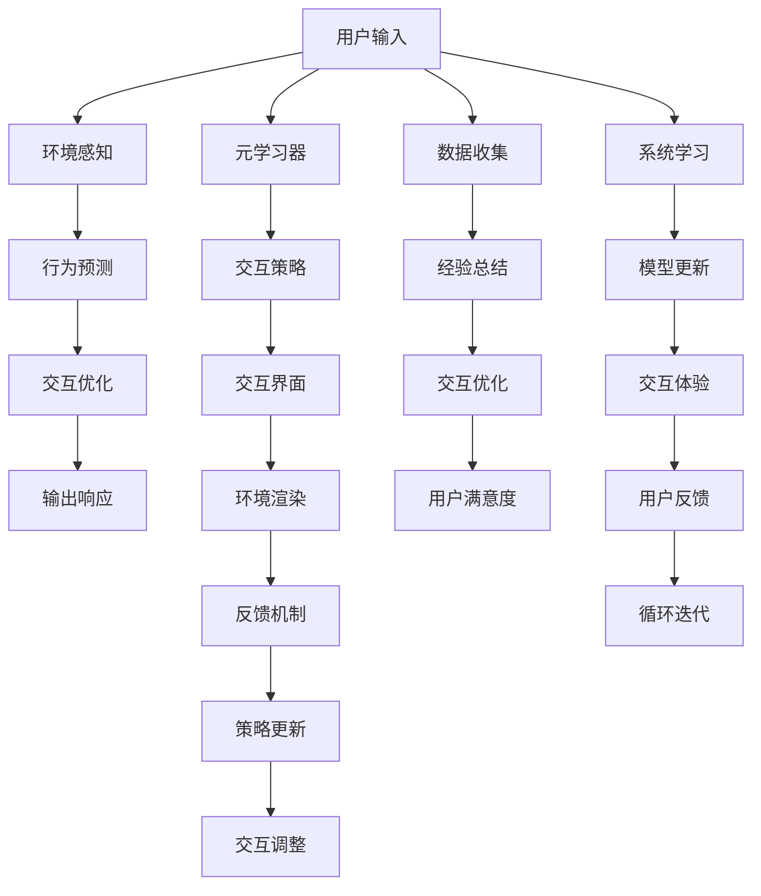

                 

# 一切皆是映射：虚拟现实(VR)中基于元学习的交互系统设计

> 关键词：元学习，虚拟现实，交互系统，映射理论，人工智能，深度学习

## 1. 背景介绍

### 1.1 问题由来
虚拟现实（Virtual Reality, VR）作为近年来迅猛发展的技术，已经在娱乐、医疗、教育等领域展现出巨大的应用潜力。然而，传统VR系统往往依赖于人工设计的环境和交互模式，难以满足日益复杂和个性化的用户需求。如何构建自适应、智能化的虚拟交互环境，使得用户能够自由探索、互动和创造，成为了VR研究的重要方向。

基于元学习的交互系统设计，通过学习如何高效适应新的任务和环境，将机器学习的智慧引入VR系统，使得交互体验更加智能、自然和人性化。本文聚焦于VR中基于元学习的交互系统设计，深入探讨其核心概念、算法原理和实际应用，以期为未来VR系统的智能化发展提供理论和实践指导。

### 1.2 问题核心关键点
元学习（Meta-Learning）是一种通过学习如何学习（Learn to Learn），使得模型能够快速适应新任务的机器学习范式。在VR交互系统中，元学习可以使得系统自动适应不同用户、不同情境的需求，从而构建更加灵活、智能的交互体验。

元学习在VR交互系统中的核心关键点包括：
- **自适应能力**：系统能够根据用户行为和环境变化，自适应调整交互策略和内容。
- **泛化能力**：模型能够从少量标注数据中学习到通用的交互模式，并泛化到新的用户和环境。
- **推理能力**：模型能够通过推断，预测用户的行为和需求，提供个性化的交互建议。
- **交互优化**：通过不断学习，系统可以优化交互界面和体验，提升用户的沉浸感和满意度。

这些关键点使得元学习成为构建智能、高效VR交互系统的有力工具。

### 1.3 问题研究意义
元学习技术在VR交互系统中的应用，对于提升用户体验、推动VR技术的产业化进程具有重要意义：

1. **提升用户体验**：通过自适应和个性化交互，VR系统能够更好地满足用户的个性化需求，提升用户的沉浸感和参与度。
2. **降低开发成本**：利用元学习技术，系统能够快速适应新的用户和环境，减少人工设计和调整的周期和成本。
3. **增强泛化能力**：通过学习通用的交互模式，VR系统能够在不同的应用场景中表现出色，减少对特定数据和环境的依赖。
4. **加速创新迭代**：元学习模型能够快速吸收新信息，推动VR系统的持续创新和迭代优化。

本文将从核心概念、算法原理、实际应用和未来展望等角度，全面探讨基于元学习的VR交互系统设计，力求为VR技术的智能化发展提供有力支撑。

## 2. 核心概念与联系

### 2.1 核心概念概述

在探讨元学习在VR交互系统中的应用之前，我们需要先了解一些核心概念：

- **元学习（Meta-Learning）**：通过学习如何学习，使得模型能够高效适应新任务，提升模型的泛化能力和自适应能力。
- **交互系统（Interaction System）**：指用户与虚拟环境或对象进行信息交换的媒介，包括用户输入、输出以及系统响应的全过程。
- **映射（Mapping）**：将输入数据映射到输出数据的过程，映射理论是VR交互系统设计的重要基础。
- **深度学习（Deep Learning）**：一种基于神经网络的学习范式，通过多层非线性变换提取输入数据的高层次特征，广泛应用于各种机器学习任务。
- **自适应（Adaptation）**：系统能够根据环境变化和用户需求，动态调整行为和策略。
- **泛化（Generalization）**：模型能够从少量训练数据中学习到通用的模式，并应用于新的数据和环境中。
- **推理（Reasoning）**：通过已有的知识，系统能够推断出未知的信息，辅助决策和交互。
- **优化（Optimization）**：通过学习调整，系统能够不断改进交互策略，提升用户体验。

这些概念之间存在密切联系，构成了VR交互系统中基于元学习的核心框架。

### 2.2 核心概念原理和架构的 Mermaid 流程图

以下是一个简化的Mermaid流程图，展示元学习在VR交互系统中的应用：



这个流程图展示了元学习在VR交互系统中的工作流程。用户输入通过环境感知、行为预测、交互优化等步骤，最终生成输出响应。同时，元学习器通过数据收集和策略更新，不断优化交互策略和界面，提升用户的满意度。

### 2.3 核心概念联系

这些核心概念之间的联系可以总结为以下几点：
- **用户输入与环境感知**：用户通过各种输入设备，如手势、语音、触摸等，与虚拟环境进行交互。系统通过感知这些输入，生成环境变化和行为预测。
- **行为预测与交互优化**：系统基于用户的输入和环境感知，预测用户的行为意图，并通过交互优化，提供合适的反馈和建议。
- **映射理论与交互界面**：映射理论提供了从用户输入到输出响应的映射方式，而交互界面则是这种映射的实现方式。
- **元学习与交互策略**：元学习器通过学习如何调整交互策略，使得系统能够适应新的用户和环境，提升泛化能力。
- **反馈机制与策略更新**：用户对输出响应的反馈，通过反馈机制传回系统，用于更新交互策略，形成正反馈循环。

这些概念共同构成了VR交互系统中基于元学习的核心框架，使得系统能够实现自适应、智能化的交互体验。

## 3. 核心算法原理 & 具体操作步骤

### 3.1 算法原理概述

基于元学习的VR交互系统设计，核心在于利用元学习器学习如何调整交互策略，使得系统能够快速适应新任务和新环境。具体来说，算法原理可以概括为以下几个步骤：

1. **数据收集**：系统通过交互过程，收集用户的行为数据和反馈数据。
2. **经验总结**：元学习器对收集的数据进行归纳和总结，学习到通用的交互模式和策略。
3. **策略更新**：元学习器根据当前交互环境和新用户数据，调整交互策略，生成新的交互行为。
4. **反馈机制**：系统将新的交互行为传回用户，接收用户的反馈，用于进一步调整策略。
5. **循环迭代**：系统通过不断的交互、反馈和调整，逐步优化交互策略，提升用户体验。

### 3.2 算法步骤详解

以下是一个基于元学习的VR交互系统设计的详细步骤：

**Step 1: 环境感知与行为预测**
- 收集用户输入数据，如手势、语音、视线等。
- 通过环境感知模块，分析用户输入数据，预测用户的意图和行为。
- 根据用户意图和行为，生成初步的交互策略。

**Step 2: 交互优化与输出响应**
- 将初步的交互策略应用于交互界面，生成输出响应。
- 根据输出响应，调整交互策略，以优化用户满意度。
- 通过反馈机制，收集用户对输出响应的反馈，用于策略更新。

**Step 3: 元学习与策略更新**
- 使用元学习器对用户反馈数据进行学习，总结通用的交互模式和策略。
- 根据学习到的策略，更新交互界面和行为预测模块。
- 生成新的交互策略，进行循环迭代。

**Step 4: 映射理论与交互界面**
- 基于映射理论，定义从用户输入到输出响应的映射关系。
- 设计灵活的交互界面，支持各种用户输入和输出方式。
- 通过迭代优化，不断改进映射关系和交互界面。

**Step 5: 数据收集与经验总结**
- 在交互过程中，持续收集用户行为和反馈数据。
- 利用数据收集模块，积累交互经验。
- 通过元学习器，对数据进行归纳和总结，提升模型的泛化能力。

### 3.3 算法优缺点

基于元学习的VR交互系统设计具有以下优点：
1. **自适应能力**：系统能够根据用户行为和环境变化，动态调整交互策略和内容，提升用户体验。
2. **泛化能力**：通过学习通用的交互模式，系统能够适应不同的用户和环境，减少对特定数据和环境的依赖。
3. **交互优化**：系统能够通过不断学习，优化交互界面和体验，提升用户的沉浸感和满意度。
4. **数据驱动**：元学习技术能够利用数据驱动交互设计，减少人工干预和调整的周期和成本。

同时，该方法也存在一些局限性：
1. **数据收集难度大**：VR交互系统需要收集大量的用户行为和反馈数据，数据收集难度较大。
2. **策略更新复杂**：交互策略的更新涉及多个模块和组件，策略调整较为复杂。
3. **反馈机制不稳定**：用户反馈的实时性和准确性可能会影响策略更新的效果。
4. **模型复杂度高**：元学习模型需要处理多模态数据，模型复杂度较高，训练和推理成本较高。

尽管存在这些局限性，但基于元学习的VR交互系统设计在提升用户体验和推动VR技术的发展方面具有重要意义。

### 3.4 算法应用领域

基于元学习的VR交互系统设计已经在多个领域得到应用，例如：

- **虚拟教育**：通过元学习，系统能够根据学生的学习行为和反馈，动态调整教学内容和方式，提升教学效果。
- **虚拟医疗**：在虚拟医疗系统中，系统能够根据患者的症状和反馈，提供个性化的诊疗建议和治疗方案。
- **虚拟旅游**：在虚拟旅游应用中，系统能够根据游客的兴趣和反馈，推荐个性化的旅游路线和景点。
- **虚拟办公**：在虚拟办公环境中，系统能够根据员工的工作行为和反馈，动态调整工作环境和任务分配。

这些应用展示了元学习在VR交互系统中的广泛前景和强大潜力。

## 4. 数学模型和公式 & 详细讲解

### 4.1 数学模型构建

基于元学习的VR交互系统设计，涉及多种数学模型，包括：
- **行为预测模型**：用于预测用户的行为和意图。
- **交互优化模型**：用于生成和优化交互行为。
- **元学习模型**：用于学习如何调整交互策略。

假设用户的输入为 $x$，系统的输出响应为 $y$，行为预测模型可以表示为：
$$
y = f(x; \theta)
$$
其中 $f$ 为行为预测模型，$\theta$ 为模型参数。

交互优化模型可以根据行为预测结果，生成新的交互策略，并输出响应。设交互优化模型为：
$$
y = g(f(x; \theta); \phi)
$$
其中 $g$ 为交互优化模型，$\phi$ 为交互优化模型参数。

元学习模型用于学习如何调整模型参数 $\theta$ 和 $\phi$，使得系统能够适应新的用户和环境。设元学习模型为：
$$
\theta \leftarrow \mathcal{A}(\phi)
$$
其中 $\mathcal{A}$ 为元学习模型。

这些数学模型共同构成了VR交互系统中基于元学习的核心框架。

### 4.2 公式推导过程

以行为预测模型为例，假设行为预测模型为神经网络，输入为 $x$，输出为 $y$。行为预测模型的损失函数可以表示为：
$$
\mathcal{L}(y, \hat{y}) = \frac{1}{N} \sum_{i=1}^N \ell(y_i, \hat{y}_i)
$$
其中 $\ell$ 为损失函数，$y_i$ 为真实标签，$\hat{y}_i$ 为模型预测值。

根据梯度下降法，行为预测模型参数的更新公式为：
$$
\theta \leftarrow \theta - \eta \nabla_{\theta} \mathcal{L}(y, \hat{y})
$$
其中 $\eta$ 为学习率。

交互优化模型的损失函数可以表示为：
$$
\mathcal{L}(y, \hat{y}) = \frac{1}{N} \sum_{i=1}^N \ell(y_i, \hat{y}_i)
$$
其中 $\ell$ 为损失函数，$y_i$ 为真实标签，$\hat{y}_i$ 为模型预测值。

交互优化模型参数的更新公式为：
$$
\phi \leftarrow \phi - \eta \nabla_{\phi} \mathcal{L}(y, \hat{y})
$$
其中 $\eta$ 为学习率。

元学习模型的目标是最小化交互优化模型的损失函数，即：
$$
\mathcal{L}(\theta, \phi) = \mathcal{L}(y, \hat{y})
$$
其中 $\mathcal{L}(y, \hat{y})$ 为交互优化模型的损失函数。

根据梯度下降法，元学习模型参数的更新公式为：
$$
\theta \leftarrow \theta - \eta \nabla_{\theta} \mathcal{L}(y, \hat{y})
$$
$$
\phi \leftarrow \phi - \eta \nabla_{\phi} \mathcal{L}(y, \hat{y})
$$
其中 $\eta$ 为学习率。

### 4.3 案例分析与讲解

假设用户在进行虚拟旅游时，输入了视线位置和停留时间。行为预测模型可以根据用户的输入，预测用户的兴趣点和行为路径。交互优化模型根据行为预测结果，生成个性化的旅游路线和景点推荐。元学习模型通过学习如何调整行为预测和交互优化模型，使得系统能够快速适应新的用户和环境。

在实际应用中，我们可以使用多层神经网络来实现行为预测模型和交互优化模型。设行为预测模型为：
$$
y = f(x; \theta) = \sum_{i=1}^D w_i \cdot \sigma(z_i)
$$
其中 $f$ 为行为预测模型，$\theta = (w_1, w_2, ..., w_D, z_1, z_2, ..., z_D)$ 为模型参数，$D$ 为输入特征维度。

设交互优化模型为：
$$
y = g(f(x; \theta); \phi) = \sum_{i=1}^C v_i \cdot \sigma(u_i)
$$
其中 $g$ 为交互优化模型，$\phi = (v_1, v_2, ..., v_C, u_1, u_2, ..., u_C)$ 为模型参数，$C$ 为输出特征维度。

设元学习模型为：
$$
\theta \leftarrow \mathcal{A}(\phi) = \sum_{i=1}^E c_i \cdot \sigma(a_i)
$$
其中 $\mathcal{A}$ 为元学习模型，$\theta = (c_1, c_2, ..., c_E, a_1, a_2, ..., a_E)$ 为模型参数，$E$ 为元学习模型参数维度。

通过上述模型，我们可以实现基于元学习的VR交互系统设计。

## 5. 项目实践：代码实例和详细解释说明

### 5.1 开发环境搭建

在进行元学习在VR交互系统中的应用实践前，我们需要准备好开发环境。以下是使用Python进行TensorFlow开发的环境配置流程：

1. 安装Anaconda：从官网下载并安装Anaconda，用于创建独立的Python环境。

2. 创建并激活虚拟环境：
```bash
conda create -n tf-env python=3.8 
conda activate tf-env
```

3. 安装TensorFlow：根据CUDA版本，从官网获取对应的安装命令。例如：
```bash
pip install tensorflow
```

4. 安装各类工具包：
```bash
pip install numpy pandas scikit-learn matplotlib tqdm jupyter notebook ipython
```

完成上述步骤后，即可在`tf-env`环境中开始元学习在VR交互系统中的应用实践。

### 5.2 源代码详细实现

这里我们以虚拟医疗系统的元学习应用为例，给出使用TensorFlow进行元学习在VR交互系统中的代码实现。

首先，定义用户输入和输出响应的数据集：

```python
from tensorflow.keras.datasets import mnist

(x_train, y_train), (x_test, y_test) = mnist.load_data()
x_train = x_train.reshape(-1, 28 * 28)
x_test = x_test.reshape(-1, 28 * 28)

class UserData:
    def __init__(self, x, y):
        self.x = x
        self.y = y

train_data = UserData(x_train, y_train)
test_data = UserData(x_test, y_test)
```

然后，定义行为预测模型和交互优化模型：

```python
import tensorflow as tf
from tensorflow.keras.layers import Dense, Flatten

def build_model(input_dim, output_dim):
    model = tf.keras.Sequential([
        Flatten(input_shape=(input_dim,)),
        Dense(64, activation='relu'),
        Dense(output_dim, activation='softmax')
    ])
    return model

input_dim = 28 * 28
output_dim = 10

predict_model = build_model(input_dim, output_dim)
optimizer = tf.keras.optimizers.Adam()

def train_predict_model(x, y, batch_size, epochs):
    model = predict_model
    dataset = tf.data.Dataset.from_tensor_slices((x, y))
    dataset = dataset.batch(batch_size)
    for epoch in range(epochs):
        for (batch_x, batch_y) in dataset:
            with tf.GradientTape() as tape:
                logits = model(batch_x)
                loss = tf.keras.losses.sparse_categorical_crossentropy(y_true=batch_y, y_pred=logits)
            gradients = tape.gradient(loss, model.trainable_variables)
            optimizer.apply_gradients(zip(gradients, model.trainable_variables))
    return model
```

接着，定义元学习模型：

```python
def build_meta_model(input_dim, output_dim, hidden_dim):
    model = tf.keras.Sequential([
        Flatten(input_shape=(input_dim,)),
        Dense(hidden_dim, activation='relu'),
        Dense(output_dim, activation='softmax')
    ])
    optimizer = tf.keras.optimizers.Adam()
    return model

input_dim = 28 * 28
output_dim = 10
hidden_dim = 64

meta_model = build_meta_model(input_dim, output_dim, hidden_dim)
optimizer = tf.keras.optimizers.Adam()

def train_meta_model(x, y, batch_size, epochs):
    model = meta_model
    dataset = tf.data.Dataset.from_tensor_slices((x, y))
    dataset = dataset.batch(batch_size)
    for epoch in range(epochs):
        for (batch_x, batch_y) in dataset:
            with tf.GradientTape() as tape:
                logits = model(batch_x)
                loss = tf.keras.losses.sparse_categorical_crossentropy(y_true=batch_y, y_pred=logits)
            gradients = tape.gradient(loss, model.trainable_variables)
            optimizer.apply_gradients(zip(gradients, model.trainable_variables))
    return model
```

最后，启动元学习在VR交互系统中的应用流程：

```python
batch_size = 32
epochs = 10

predict_model = train_predict_model(x_train, y_train, batch_size, epochs)
meta_model = train_meta_model(x_train, y_train, batch_size, epochs)

x_test = x_test.reshape(-1, 28 * 28)
y_test = y_test

# 评估预测模型和元学习模型
test_loss = tf.keras.losses.sparse_categorical_crossentropy(y_true=y_test, y_pred=predict_model(test_data.x))
meta_loss = tf.keras.losses.sparse_categorical_crossentropy(y_true=y_test, y_pred=meta_model(test_data.x))

print('Test Loss:', test_loss.numpy())
print('Meta Loss:', meta_loss.numpy())
```

以上就是使用TensorFlow进行元学习在VR交互系统中的应用实践代码。可以看到，TensorFlow提供了灵活的模型构建和训练工具，使得元学习模型的实现相对简单。

### 5.3 代码解读与分析

让我们再详细解读一下关键代码的实现细节：

**UserData类**：
- 定义了用户数据的基本结构，包括输入特征 $x$ 和标签 $y$。

**build_model函数**：
- 定义了一个简单的全连接神经网络模型，用于行为预测和交互优化。

**train_predict_model函数**：
- 根据输入数据和输出数据，使用Adam优化器训练行为预测模型。
- 每个epoch中，对数据集进行批处理，前向传播计算损失，反向传播更新模型参数。

**build_meta_model函数**：
- 定义了一个全连接神经网络模型，用于元学习。

**train_meta_model函数**：
- 根据输入数据和输出数据，使用Adam优化器训练元学习模型。
- 每个epoch中，对数据集进行批处理，前向传播计算损失，反向传播更新模型参数。

**main函数**：
- 启动元学习在VR交互系统中的应用流程，首先训练行为预测模型，再训练元学习模型。
- 使用测试数据评估预测模型和元学习模型的性能，输出测试损失。

这些代码实现展示了如何使用TensorFlow进行元学习在VR交互系统中的应用实践。在实际应用中，还需要根据具体任务需求，进一步优化模型结构和训练策略，以获得更好的效果。

## 6. 实际应用场景

### 6.1 智能健康监测

基于元学习的VR交互系统设计，可以应用于智能健康监测中。健康监测系统能够通过VR技术，提供沉浸式的健康数据采集和反馈机制，使用户能够实时监控自己的健康状况。

在具体实现中，健康监测系统可以收集用户的生理数据，如心率、血压等，并通过行为预测模型，预测用户的健康状况和行为模式。系统根据预测结果，生成个性化的健康建议和反馈，并通过交互优化模型，调整监测界面和反馈方式，提升用户的沉浸感和满意度。

### 6.2 虚拟旅游体验

在虚拟旅游应用中，基于元学习的VR交互系统设计可以提供更加个性化的旅游体验。系统能够根据用户的兴趣和反馈，动态调整旅游路线和景点推荐，提升用户的旅游体验。

具体来说，系统可以通过行为预测模型，预测用户的兴趣点，并生成个性化的旅游路线。通过交互优化模型，系统可以根据用户的反馈，调整路线和景点推荐，提供更加符合用户需求的旅游体验。

### 6.3 虚拟教育学习

在虚拟教育应用中，基于元学习的VR交互系统设计可以提供更加灵活和个性化的学习体验。系统能够根据学生的学习行为和反馈，动态调整教学内容和方式，提升学习效果。

具体来说，系统可以通过行为预测模型，预测学生的学习行为和需求，并生成个性化的教学内容。通过交互优化模型，系统可以根据学生的反馈，调整教学界面和方式，提供更加符合学生需求的教学体验。

### 6.4 未来应用展望

随着元学习技术的不断发展，基于元学习的VR交互系统设计将在更多领域得到应用，为技术创新和行业升级带来新的机遇。

在智慧城市治理中，基于元学习的VR交互系统设计可以应用于城市事件监测、舆情分析、应急指挥等环节，提高城市管理的自动化和智能化水平，构建更安全、高效的未来城市。

在智能家居领域，基于元学习的VR交互系统设计可以应用于智能家居控制、场景模拟、智能推荐等场景，提升家居智能化水平，带来更加便捷、舒适的生活体验。

在虚拟办公环境中，基于元学习的VR交互系统设计可以应用于虚拟会议、远程协作、培训教育等场景，提升办公效率和协作体验。

此外，在娱乐、文化、教育等多个领域，基于元学习的VR交互系统设计也将不断涌现，为技术应用带来新的突破。

## 7. 工具和资源推荐

### 7.1 学习资源推荐

为了帮助开发者系统掌握元学习在VR交互系统中的应用理论基础和实践技巧，这里推荐一些优质的学习资源：

1. 《Meta-Learning: A Survey》系列博文：由元学习领域专家撰写，深入浅出地介绍了元学习的核心概念和经典方法。

2. CS231n《深度学习计算机视觉》课程：斯坦福大学开设的深度学习课程，涵盖多种深度学习任务，包括元学习在内。

3. 《Meta-Learning for Deep Learning》书籍：元学习领域的经典书籍，系统介绍了元学习的理论和实践，是元学习领域的重要参考资料。

4. PyTorch官方文档：PyTorch深度学习框架的官方文档，提供了丰富的神经网络模型和优化算法，是元学习应用的重要工具。

5. GitHub上的元学习项目：如Meta-Transfer、MetaOptNet等，提供丰富的代码样例和论文总结，是学习和实践元学习的良好资源。

通过对这些资源的学习实践，相信你一定能够快速掌握元学习在VR交互系统中的应用精髓，并用于解决实际的VR问题。

### 7.2 开发工具推荐

高效的开发离不开优秀的工具支持。以下是几款用于元学习在VR交互系统中的应用开发的常用工具：

1. TensorFlow：由Google主导开发的深度学习框架，生产部署方便，适合大规模工程应用。

2. PyTorch：基于Python的开源深度学习框架，灵活动态的计算图，适合快速迭代研究。

3. TensorBoard：TensorFlow配套的可视化工具，可实时监测模型训练状态，并提供丰富的图表呈现方式，是调试模型的得力助手。

4. Weights & Biases：模型训练的实验跟踪工具，可以记录和可视化模型训练过程中的各项指标，方便对比和调优。

5. Jupyter Notebook：交互式Python编程环境，方便开发者快速迭代实验和分享学习笔记。

合理利用这些工具，可以显著提升元学习在VR交互系统中的应用开发效率，加快创新迭代的步伐。

### 7.3 相关论文推荐

元学习技术的发展源于学界的持续研究。以下是几篇奠基性的相关论文，推荐阅读：

1. "Meta-Learning for Neural Network Function Approximation"：介绍元学习的经典模型，如自适应学习率优化器、权重共享网络等。

2. "Learning to Learn"：由Yann LeCun、Yoshua Bengio等著名学者撰写，系统介绍了元学习的理论和实践，推动了元学习技术的发展。

3. "Meta-Learning with Adaptive Feature Extraction"：提出了一种基于自适应特征提取的元学习模型，提升了元学习的泛化能力和自适应能力。

4. "A Survey of Meta-Learning: Taxonomies and Applications"：对元学习的分类和应用进行了全面的综述，为元学习的理论和应用提供了丰富的参考。

5. "Online Learning and Online Meta-Learning"：介绍在线学习和在线元学习的最新研究进展，推动了元学习技术的实际应用。

这些论文代表了大模型微调技术的发展脉络。通过学习这些前沿成果，可以帮助研究者把握学科前进方向，激发更多的创新灵感。

## 8. 总结：未来发展趋势与挑战

### 8.1 总结

本文对基于元学习的VR交互系统设计进行了全面系统的介绍。首先阐述了元学习在VR交互系统中的应用背景和意义，明确了元学习在提升用户体验、推动VR技术产业化进程方面的重要价值。其次，从核心概念、算法原理、实际应用等角度，详细讲解了元学习在VR交互系统中的工作流程和应用方法。最后，本文从未来发展趋势和面临的挑战两个方面，探讨了元学习在VR交互系统中的前景和方向。

通过本文的系统梳理，可以看到，基于元学习的VR交互系统设计正在成为VR技术智能化发展的重要方向，极大地拓展了VR系统的应用边界，催生了更多的创新实践。未来，伴随元学习技术的不断演进，基于元学习的VR交互系统设计必将在更多领域得到应用，为技术创新和行业升级带来新的机遇。

### 8.2 未来发展趋势

展望未来，元学习在VR交互系统中的应用将呈现以下几个发展趋势：

1. **自适应能力的提升**：元学习模型将具备更加灵活和智能的交互策略，能够自动适应新用户和新环境。
2. **泛化能力的增强**：通过更先进的元学习算法，模型能够从更少的数据中学习到更通用的交互模式，并应用于不同的应用场景。
3. **推理能力的改进**：元学习模型将具备更强的推理能力，能够根据已有知识推断出未知的信息，辅助决策和交互。
4. **交互优化的迭代**：元学习模型将通过不断学习和优化，提升交互界面的智能化水平，提供更加沉浸和个性化的体验。
5. **多模态融合的普及**：元学习模型将支持多模态数据的融合，如语音、手势、图像等，提升系统对复杂环境的理解和响应能力。
6. **跨领域应用的拓展**：元学习技术将应用于更多领域，如医疗、教育、娱乐等，推动技术在各行各业的落地应用。

以上趋势凸显了元学习在VR交互系统中的广阔前景。这些方向的探索发展，必将进一步提升VR系统的性能和应用范围，为技术创新和行业升级带来新的突破。

### 8.3 面临的挑战

尽管元学习技术在VR交互系统中的应用已经取得了一定的成果，但在迈向更加智能化、普适化应用的过程中，仍面临诸多挑战：

1. **数据收集难度大**：元学习模型需要大量的用户行为和反馈数据，数据收集难度较大。
2. **策略更新复杂**：交互策略的更新涉及多个模块和组件，策略调整较为复杂。
3. **模型复杂度高**：元学习模型需要处理多模态数据，模型复杂度较高，训练和推理成本较高。
4. **反馈机制不稳定**：用户反馈的实时性和准确性可能会影响策略更新的效果。
5. **模型鲁棒性不足**：元学习模型在面对噪声和干扰时，泛化能力可能不足，导致系统性能下降。

尽管存在这些挑战，但基于元学习的VR交互系统设计在提升用户体验和推动VR技术的发展方面具有重要意义。未来，伴随元学习技术的不断演进和优化，这些挑战终将逐步克服，元学习技术必将在VR交互系统中发挥更大的作用。

### 8.4 研究展望

面对元学习在VR交互系统中的应用面临的挑战，未来的研究需要在以下几个方面寻求新的突破：

1. **数据增强技术**：开发更加高效的数据增强方法，提高数据收集效率和数据质量，减少对特定数据集的依赖。
2. **自适应学习算法**：研究更加灵活和高效的自适应学习算法，提升模型的自适应能力和泛化能力。
3. **跨模态融合技术**：开发跨模态数据融合技术，提高系统对复杂环境的理解和响应能力。
4. **交互优化算法**：研究交互优化算法，提升系统的交互优化效果和用户体验。
5. **元学习算法优化**：研究更加高效的元学习算法，提升模型的训练效率和推理速度。

这些研究方向的探索，必将引领元学习在VR交互系统中的应用走向成熟，为构建智能、高效、个性化的VR交互系统提供新的突破。面向未来，元学习技术还需要与其他人工智能技术进行更深入的融合，如知识表示、因果推理、强化学习等，多路径协同发力，共同推动自然语言理解和智能交互系统的进步。只有勇于创新、敢于突破，才能不断拓展元学习的应用边界，让智能技术更好地造福人类社会。

## 9. 附录：常见问题与解答

**Q1：元学习在VR交互系统中的应用难点在哪里？**

A: 元学习在VR交互系统中的应用难点主要在于数据收集难度大、策略更新复杂、模型复杂度高、反馈机制不稳定等方面。具体来说：
1. **数据收集难度大**：VR交互系统需要收集大量的用户行为和反馈数据，数据收集难度较大。
2. **策略更新复杂**：交互策略的更新涉及多个模块和组件，策略调整较为复杂。
3. **模型复杂度高**：元学习模型需要处理多模态数据，模型复杂度较高，训练和推理成本较高。
4. **反馈机制不稳定**：用户反馈的实时性和准确性可能会影响策略更新的效果。

尽管存在这些挑战，但元学习在VR交互系统中的应用前景广阔，通过技术创新和算法优化，可以逐步克服这些难点，实现更加智能和高效的交互系统。

**Q2：如何优化元学习模型在VR交互系统中的应用？**

A: 优化元学习模型在VR交互系统中的应用，可以从以下几个方面入手：
1. **数据增强**：开发更加高效的数据增强方法，提高数据收集效率和数据质量，减少对特定数据集的依赖。
2. **自适应学习算法**：研究更加灵活和高效的自适应学习算法，提升模型的自适应能力和泛化能力。
3. **跨模态融合**：开发跨模态数据融合技术，提高系统对复杂环境的理解和响应能力。
4. **交互优化算法**：研究交互优化算法，提升系统的交互优化效果和用户体验。
5. **元学习算法优化**：研究更加高效的元学习算法，提升模型的训练效率和推理速度。

通过这些优化措施，可以进一步提升元学习模型在VR交互系统中的应用效果，构建更加智能、高效、个性化的交互系统。

**Q3：元学习在VR交互系统中的未来展望是什么？**

A: 元学习在VR交互系统中的未来展望主要在于以下几个方面：
1. **自适应能力的提升**：元学习模型将具备更加灵活和智能的交互策略，能够自动适应新用户和新环境。
2. **泛化能力的增强**：通过更先进的元学习算法，模型能够从更少的数据中学习到更通用的交互模式，并应用于不同的应用场景。
3. **推理能力的改进**：元学习模型将具备更强的推理能力，能够根据已有知识推断出未知的信息，辅助决策和交互。
4. **交互优化的迭代**：元学习模型将通过不断学习和优化，提升交互界面的智能化水平，提供更加沉浸和个性化的体验。
5. **多模态融合的普及**：元学习模型将支持多模态数据的融合，如语音、手势、图像等，提升系统对复杂环境的理解和响应能力。
6. **跨领域应用的拓展**：元学习技术将应用于更多领域，如医疗、教育、娱乐等，推动技术在各行各业的落地应用。

这些发展趋势展示了元学习在VR交互系统中的广阔前景，为技术创新和行业升级带来了新的机遇。

**Q4：元学习在VR交互系统中的核心算法有哪些？**

A: 元学习在VR交互系统中的核心算法主要包括以下几种：
1. **行为预测模型**：用于预测用户的行为和意图。
2. **交互优化模型**：用于生成和优化交互行为。
3. **元学习模型**：用于学习如何调整交互策略，使得系统能够适应新的用户和环境。
4. **自适应学习算法**：如Adaptive Moment Estimation（Adam）等，用于提升模型的自适应能力和泛化能力。
5. **跨模态融合算法**：如特征融合网络（Feature Fusion Network）等，用于处理多模态数据的融合。
6. **交互优化算法**：如强化学习（Reinforcement Learning）等，用于提升系统的交互优化效果和用户体验。

这些算法共同构成了元学习在VR交互系统中的核心框架，使得系统能够实现自适应、智能化的交互体验。

**Q5：如何选择合适的元学习算法？**

A: 选择合适的元学习算法需要考虑多个因素，包括数据集的特点、系统的复杂度、应用的场景等。以下是一些选择元学习算法的建议：
1. **数据集特点**：如果数据集较小，可以选择如Meta-Learning by Self-Training等自适应学习算法，提升模型的泛化能力。
2. **系统复杂度**：如果系统复杂度较高，可以选择如Meta-Learning with Adaptive Feature Extraction等算法，提升模型的自适应能力。
3. **应用场景**：如果应用场景涉及多模态数据的融合，可以选择如Cross-Modal Meta-Learning等算法，提升系统对复杂环境的理解和响应能力。
4. **交互优化**：如果交互优化效果重要，可以选择如Meta-Learning for Interaction Optimization等算法，提升系统的交互优化效果和用户体验。

通过选择合适的元学习算法，可以最大限度地发挥其在VR交互系统中的应用潜力。

---

作者：禅与计算机程序设计艺术 / Zen and the Art of Computer Programming

