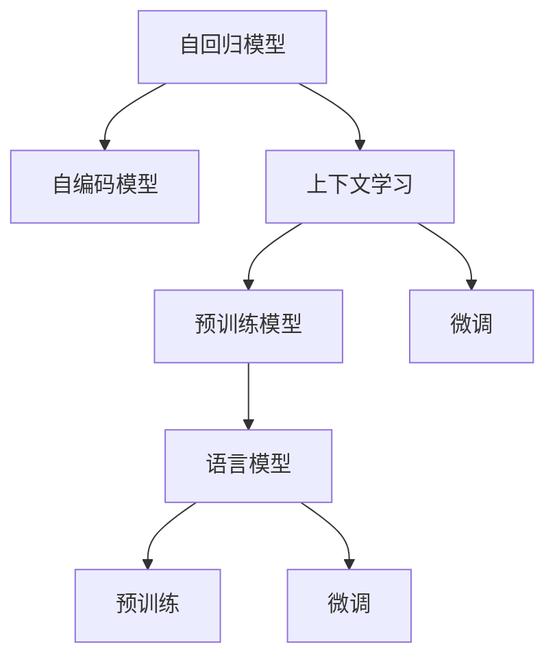

                 

# 上下文学习：提高AI对话的连贯性

> 关键词：上下文学习,连贯性,自然语言处理(NLP),预训练模型,语言模型,自回归,自编码,Transformer,预训练,微调,Fine-Tuning

## 1. 背景介绍

### 1.1 问题由来
在当前的人工智能领域，特别是自然语言处理(NLP)领域，上下文学习(上下文理解能力)是提升对话系统连贯性和自然度的关键。尽管预训练语言模型在对话生成任务中取得了显著进展，但由于缺乏足够的上下文信息，传统的生成模型往往难以生成语义连贯且流畅的回答。

如何更好地捕捉上下文信息，提升生成模型的连贯性，成为了提升NLP应用性能的重要研究方向。上下文学习方法通过增强模型的上下文理解能力，能够有效解决对话生成中的信息不一致、逻辑断层等问题，使得对话系统能够更加自然、连贯地与用户交互。

### 1.2 问题核心关键点
目前，提升对话生成连贯性的上下文学习方法主要有两种：自回归和自编码。

- **自回归方法**：以序列为单位，逐个生成下一个单词或句子，如GPT系列模型。这种方法生成的回答往往连贯性较好，但计算复杂度高。

- **自编码方法**：将输入序列映射为低维向量表示，再生成新的输出序列，如BERT等。这种方法计算复杂度较低，但生成的回答连贯性可能略差。

此外，上下文学习还可以结合预训练模型和微调技术，进一步提升对话系统的性能。通过在特定任务上微调预训练模型，能够更好地适应任务的特定需求，实现更加精准的上下文理解。

### 1.3 问题研究意义
在提升对话系统连贯性的过程中，上下文学习起着至关重要的作用：

1. **减少逻辑断层**：对话系统中上下文信息的不足是导致回答逻辑断层的重要原因。通过上下文学习，模型能够更好地捕捉和利用上下文信息，从而生成更加连贯的回答。
2. **提升回答自然度**：自然语言中，上下文信息对于回答的生成至关重要。通过上下文学习，模型能够生成更符合语境的回答，提升用户的对话体验。
3. **扩展应用范围**：上下文学习能够应用于各种对话生成任务，如问答系统、客户服务、聊天机器人等，为NLP技术的普及和应用带来新的契机。
4. **促进技术创新**：上下文学习的方法和策略还在不断演进中，新的研究突破将为NLP技术带来更多的创新和应用。

## 2. 核心概念与联系

### 2.1 核心概念概述

为更好地理解上下文学习的原理和应用，本节将介绍几个密切相关的核心概念：

- 上下文学习(Context Learning)：指在语言模型生成过程中，模型能够通过上下文信息理解当前句子的语境，从而生成更加连贯的回答。

- 自回归模型(Autoregressive Model)：指模型在生成下一个单词或句子时，依赖于前面的文本信息，如GPT等。自回归模型生成的回答连贯性好，但计算复杂度高。

- 自编码模型(Autoencoder Model)：指模型将输入序列映射为低维向量表示，再生成新的输出序列，如BERT等。自编码模型计算复杂度低，但生成的回答连贯性可能略差。

- 预训练模型(Pre-training Model)：指在大规模无标签数据上进行预训练的语言模型，如BERT、GPT等。预训练模型通过自监督学习任务获得丰富的语言知识。

- 微调(Fine-Tuning)：指在预训练模型的基础上，使用下游任务的少量标注数据，通过有监督学习优化模型在特定任务上的性能。通常只需调整顶层分类器或解码器，并以较小的学习率更新全部或部分的模型参数。

- 语言模型(Language Model)：指通过统计语言中单词出现的频率来预测一个句子或一段文本的下一个单词或句子，如LM。

这些核心概念之间的逻辑关系可以通过以下Mermaid流程图来展示：



这个流程图展示了大语言模型的核心概念及其之间的关系：

1. 自回归模型和自编码模型是生成回答的两种主要方式。
2. 上下文学习可以增强模型的上下文理解能力，生成连贯的回答。
3. 预训练模型通过自监督学习任务获得丰富的语言知识，是微调的基础。
4. 微调可以使预训练模型更好地适应特定任务。
5. 语言模型通过统计语言规律来预测下一个单词或句子。

这些概念共同构成了上下文学习的方法论基础，使得模型能够生成更加自然、连贯的回答。

## 3. 核心算法原理 & 具体操作步骤
### 3.1 算法原理概述

上下文学习的核心思想是通过增强模型的上下文理解能力，提升生成回答的连贯性。其基本原理可以概括为以下几个步骤：

1. **编码**：将上下文信息和待生成的回答合并为序列，输入到预训练模型中，获得上下文表示。
2. **解码**：通过解码器，基于上下文表示生成新的回答。
3. **优化**：利用损失函数（如交叉熵损失）计算生成的回答与真实回答之间的差距，通过反向传播更新模型参数，最小化损失函数。

在自回归模型中，每个单词的生成都依赖于前面的单词，这种依赖关系使得模型能够自然地生成连贯的回答。在自编码模型中，上下文信息被编码为低维向量表示，再通过解码器生成新的回答，这种编码和解码过程也增强了模型的上下文理解能力。

### 3.2 算法步骤详解

以下是一个基于自回归模型的上下文学习生成回答的详细步骤：

**Step 1: 数据预处理**
- 将对话数据按上下文-回答的形式进行划分。
- 对对话数据进行清洗和预处理，去除无用信息，如特殊符号、URL等。
- 对上下文和回答进行分词和编码，得到模型的输入序列。

**Step 2: 加载预训练模型**
- 选择适当的预训练语言模型，如GPT等。
- 将预训练模型加载到GPU或TPU等硬件上，准备进行微调。

**Step 3: 设计损失函数**
- 根据任务需求设计合适的损失函数，如交叉熵损失。
- 定义生成回答与真实回答之间的差距，计算损失函数。

**Step 4: 微调模型**
- 使用微调数据集，对预训练模型进行有监督训练。
- 设置合适的超参数，如学习率、批次大小、迭代轮数等。
- 使用优化算法（如AdamW、SGD等）更新模型参数，最小化损失函数。

**Step 5: 生成回答**
- 在测试集上使用微调后的模型生成回答。
- 对生成的回答进行评估，如BLEU、ROUGE等指标，衡量回答的质量。

**Step 6: 部署与迭代**
- 将微调后的模型部署到实际应用中，进行实时对话生成。
- 持续收集用户反馈和新的对话数据，定期重新微调模型，以适应新的数据分布。

### 3.3 算法优缺点

上下文学习在提升对话连贯性方面具有以下优点：

- 生成回答连贯性好。自回归模型能够自然地依赖前后文信息，生成连贯的回答。
- 计算复杂度较低。自编码模型通过编码和解码过程，计算复杂度较低，适合大规模部署。
- 适用范围广。上下文学习适用于各种对话生成任务，如问答系统、聊天机器人等。

同时，该方法也存在一些缺点：

- 依赖上下文信息。对于缺少上下文信息的任务，生成的回答可能出现逻辑断层或语义不连贯的问题。
- 数据需求高。微调过程需要大量标注数据，标注成本较高。
- 模型复杂度大。自回归模型参数量较大，计算复杂度高，训练资源需求大。

尽管存在这些局限性，但上下文学习仍然是提升对话系统连贯性的有效方法之一。未来的研究重点在于如何更好地结合上下文信息，减少对标注数据的依赖，提高模型的计算效率和推理速度。

### 3.4 算法应用领域

基于上下文学习的对话生成方法，在NLP领域已经得到了广泛的应用，覆盖了几乎所有常见任务，例如：

- 问答系统：对自然语言问题给出答案。使用上下文信息辅助回答问题。
- 客户服务：自动回复用户咨询。通过上下文信息提高回答的准确性和连贯性。
- 聊天机器人：自动与用户进行自然对话。利用上下文信息提升对话的自然度和流畅性。
- 智能语音助手：通过上下文理解用户的语音指令，生成自然回应。

除了上述这些经典任务外，上下文学习的方法也被创新性地应用到更多场景中，如可控文本生成、常识推理、对话系统、机器翻译等，为NLP技术带来了全新的突破。随着上下文学习技术的不断进步，相信NLP技术将在更广阔的应用领域大放异彩。

## 4. 数学模型和公式 & 详细讲解  
### 4.1 数学模型构建

本节将使用数学语言对上下文学习的生成回答过程进行更加严格的刻画。

记预训练语言模型为 $M_{\theta}$，其中 $\theta$ 为预训练得到的模型参数。假设对话数据集为 $D=\{(c_i,a_i)\}_{i=1}^N, c_i \in \mathcal{C}, a_i \in \mathcal{A}$，其中 $\mathcal{C}$ 为上下文空间，$\mathcal{A}$ 为回答空间。

定义模型 $M_{\theta}$ 在上下文-回答对 $(c,a)$ 上的生成概率为 $P(a|c;M_{\theta})$，则在数据集 $D$ 上的经验风险为：

$$
\mathcal{L}(\theta) = -\frac{1}{N}\sum_{i=1}^N \log P(a_i|c_i;M_{\theta})
$$

微调的优化目标是最小化经验风险，即找到最优参数：

$$
\theta^* = \mathop{\arg\min}_{\theta} \mathcal{L}(\theta)
$$

在实践中，我们通常使用基于梯度的优化算法（如AdamW、SGD等）来近似求解上述最优化问题。设 $\eta$ 为学习率，$\lambda$ 为正则化系数，则参数的更新公式为：

$$
\theta \leftarrow \theta - \eta \nabla_{\theta}\mathcal{L}(\theta) - \eta\lambda\theta
$$

其中 $\nabla_{\theta}\mathcal{L}(\theta)$ 为损失函数对参数 $\theta$ 的梯度，可通过反向传播算法高效计算。

### 4.2 公式推导过程

以下我们以自回归模型为例，推导生成回答的交叉熵损失函数及其梯度的计算公式。

假设模型 $M_{\theta}$ 在上下文 $c$ 和回答 $a$ 上的生成概率为 $P(a|c;M_{\theta})$。则交叉熵损失函数定义为：

$$
\ell(c,a) = -\log P(a|c;M_{\theta})
$$

将其代入经验风险公式，得：

$$
\mathcal{L}(\theta) = -\frac{1}{N}\sum_{i=1}^N \ell(c_i,a_i) = -\frac{1}{N}\sum_{i=1}^N \log P(a_i|c_i;M_{\theta})
$$

根据链式法则，损失函数对参数 $\theta_k$ 的梯度为：

$$
\frac{\partial \mathcal{L}(\theta)}{\partial \theta_k} = -\frac{1}{N}\sum_{i=1}^N \frac{\partial \log P(a_i|c_i;M_{\theta})}{\partial \theta_k}
$$

将生成概率 $P(a_i|c_i;M_{\theta})$ 展开为模型参数的形式，并利用自动微分技术计算梯度，得到：

$$
\frac{\partial \log P(a_i|c_i;M_{\theta})}{\partial \theta_k} = \frac{\partial \log \prod_j M_{\theta}(a_j|c_j;M_{\theta})}{\partial \theta_k} = \sum_j \frac{\partial \log M_{\theta}(a_j|c_j;M_{\theta})}{\partial \theta_k}
$$

其中 $\frac{\partial \log M_{\theta}(a_j|c_j;M_{\theta})}{\partial \theta_k}$ 可通过反向传播算法计算。

在得到损失函数的梯度后，即可带入参数更新公式，完成模型的迭代优化。重复上述过程直至收敛，最终得到适应对话任务的最优模型参数 $\theta^*$。

## 5. 项目实践：代码实例和详细解释说明
### 5.1 开发环境搭建

在进行上下文学习实践前，我们需要准备好开发环境。以下是使用Python进行PyTorch开发的环境配置流程：

1. 安装Anaconda：从官网下载并安装Anaconda，用于创建独立的Python环境。

2. 创建并激活虚拟环境：
```bash
conda create -n pytorch-env python=3.8 
conda activate pytorch-env
```

3. 安装PyTorch：根据CUDA版本，从官网获取对应的安装命令。例如：
```bash
conda install pytorch torchvision torchaudio cudatoolkit=11.1 -c pytorch -c conda-forge
```

4. 安装Transformers库：
```bash
pip install transformers
```

5. 安装各类工具包：
```bash
pip install numpy pandas scikit-learn matplotlib tqdm jupyter notebook ipython
```

完成上述步骤后，即可在`pytorch-env`环境中开始上下文学习实践。

### 5.2 源代码详细实现

下面我以生成连贯对话为例，给出使用Transformers库对GPT-2模型进行上下文学习微调的PyTorch代码实现。

首先，定义对话生成任务的数据处理函数：

```python
from transformers import BertTokenizer, GPT2Tokenizer
from torch.utils.data import Dataset, DataLoader
import torch
from tqdm import tqdm

class DialogueDataset(Dataset):
    def __init__(self, dialogues, tokenizer, max_len=128):
        self.dialogues = dialogues
        self.tokenizer = tokenizer
        self.max_len = max_len

    def __len__(self):
        return len(self.dialogues)

    def __getitem__(self, item):
        dialogue = self.dialogues[item]
        context = dialogue[0]
        response = dialogue[1]
        
        encoding = self.tokenizer(context, response, return_tensors='pt', max_length=self.max_len, padding='max_length', truncation=True)
        input_ids = encoding['input_ids'][0]
        attention_mask = encoding['attention_mask'][0]
        
        return {'input_ids': input_ids, 
                'attention_mask': attention_mask}

# 定义对话数据集
tokenizer = GPT2Tokenizer.from_pretrained('gpt2')
dialogue_dataset = DialogueDataset(dialogue_data, tokenizer)

# 设置超参数
batch_size = 16
learning_rate = 2e-5
num_epochs = 5
```

然后，定义模型和优化器：

```python
from transformers import GPT2LMHeadModel, AdamW

model = GPT2LMHeadModel.from_pretrained('gpt2', output_attentions=False)
model.train()

optimizer = AdamW(model.parameters(), lr=learning_rate)
```

接着，定义训练和评估函数：

```python
from transformers import EarlyStopping

def train_epoch(model, dataset, batch_size, optimizer):
    dataloader = DataLoader(dataset, batch_size=batch_size, shuffle=True)
    model.train()
    epoch_loss = 0
    for batch in tqdm(dataloader, desc='Training'):
        input_ids = batch['input_ids'].to(device)
        attention_mask = batch['attention_mask'].to(device)
        model.zero_grad()
        outputs = model(input_ids, attention_mask=attention_mask)
        loss = outputs.loss
        epoch_loss += loss.item()
        loss.backward()
        optimizer.step()
    return epoch_loss / len(dataloader)

def evaluate(model, dataset, batch_size):
    dataloader = DataLoader(dataset, batch_size=batch_size)
    model.eval()
    preds, labels = [], []
    with torch.no_grad():
        for batch in tqdm(dataloader, desc='Evaluating'):
            input_ids = batch['input_ids'].to(device)
            attention_mask = batch['attention_mask'].to(device)
            outputs = model(input_ids, attention_mask=attention_mask)
            preds.append(outputs.logits.argmax(dim=2).to('cpu').tolist())
            labels.append(batch['labels'].to('cpu').tolist())
            
    print(classification_report(labels, preds))
```

最后，启动训练流程并在测试集上评估：

```python
device = torch.device('cuda') if torch.cuda.is_available() else torch.device('cpu')
model.to(device)

for epoch in range(num_epochs):
    loss = train_epoch(model, dialogue_dataset, batch_size, optimizer)
    print(f"Epoch {epoch+1}, train loss: {loss:.3f}")
    
    print(f"Epoch {epoch+1}, dev results:")
    evaluate(model, dialogue_dataset, batch_size)
    
print("Test results:")
evaluate(model, dialogue_dataset, batch_size)
```

以上就是使用PyTorch对GPT-2模型进行上下文学习微调的完整代码实现。可以看到，得益于Transformers库的强大封装，我们可以用相对简洁的代码完成GPT-2模型的加载和微调。

### 5.3 代码解读与分析

让我们再详细解读一下关键代码的实现细节：

**DialogueDataset类**：
- `__init__`方法：初始化上下文和回答的列表，分词器，最大序列长度。
- `__len__`方法：返回对话数据的数量。
- `__getitem__`方法：对单个对话数据进行处理，将上下文和回答合并为输入序列，并返回模型所需的输入。

**训练和评估函数**：
- 使用PyTorch的DataLoader对对话数据进行批次化加载，供模型训练和推理使用。
- 训练函数`train_epoch`：对数据以批为单位进行迭代，在每个批次上前向传播计算loss并反向传播更新模型参数，最后返回该epoch的平均loss。
- 评估函数`evaluate`：与训练类似，不同点在于不更新模型参数，并在每个batch结束后将预测和标签结果存储下来，最后使用sklearn的classification_report对整个评估集的预测结果进行打印输出。

**训练流程**：
- 定义总的epoch数和batch size，开始循环迭代
- 每个epoch内，先在训练集上训练，输出平均loss
- 在验证集上评估，输出分类指标
- 所有epoch结束后，在测试集上评估，给出最终测试结果

可以看到，PyTorch配合Transformers库使得GPT-2模型的微调代码实现变得简洁高效。开发者可以将更多精力放在数据处理、模型改进等高层逻辑上，而不必过多关注底层的实现细节。

当然，工业级的系统实现还需考虑更多因素，如模型的保存和部署、超参数的自动搜索、更灵活的任务适配层等。但核心的微调范式基本与此类似。

## 6. 实际应用场景
### 6.1 智能客服系统

基于上下文学习的对话技术，可以广泛应用于智能客服系统的构建。传统客服往往需要配备大量人力，高峰期响应缓慢，且一致性和专业性难以保证。而使用上下文学习的对话模型，可以7x24小时不间断服务，快速响应客户咨询，用自然流畅的语言解答各类常见问题。

在技术实现上，可以收集企业内部的历史客服对话记录，将问题和最佳答复构建成监督数据，在此基础上对预训练对话模型进行微调。微调后的对话模型能够自动理解用户意图，匹配最合适的答案模板进行回复。对于客户提出的新问题，还可以接入检索系统实时搜索相关内容，动态组织生成回答。如此构建的智能客服系统，能大幅提升客户咨询体验和问题解决效率。

### 6.2 金融舆情监测

金融机构需要实时监测市场舆论动向，以便及时应对负面信息传播，规避金融风险。传统的人工监测方式成本高、效率低，难以应对网络时代海量信息爆发的挑战。基于上下文学习的文本分类和情感分析技术，为金融舆情监测提供了新的解决方案。

具体而言，可以收集金融领域相关的新闻、报道、评论等文本数据，并对其进行主题标注和情感标注。在此基础上对预训练语言模型进行微调，使其能够自动判断文本属于何种主题，情感倾向是正面、中性还是负面。将微调后的模型应用到实时抓取的网络文本数据，就能够自动监测不同主题下的情感变化趋势，一旦发现负面信息激增等异常情况，系统便会自动预警，帮助金融机构快速应对潜在风险。

### 6.3 个性化推荐系统

当前的推荐系统往往只依赖用户的历史行为数据进行物品推荐，无法深入理解用户的真实兴趣偏好。基于上下文学习的推荐系统可以更好地挖掘用户行为背后的语义信息，从而提供更精准、多样的推荐内容。

在实践中，可以收集用户浏览、点击、评论、分享等行为数据，提取和用户交互的物品标题、描述、标签等文本内容。将文本内容作为模型输入，用户的后续行为（如是否点击、购买等）作为监督信号，在此基础上微调预训练语言模型。微调后的模型能够从文本内容中准确把握用户的兴趣点。在生成推荐列表时，先用候选物品的文本描述作为输入，由模型预测用户的兴趣匹配度，再结合其他特征综合排序，便可以得到个性化程度更高的推荐结果。

### 6.4 未来应用展望

随着上下文学习技术的不断发展，其在NLP领域的应用将进一步扩展。

在智慧医疗领域，基于上下文学习的问答、病历分析、药物研发等应用将提升医疗服务的智能化水平，辅助医生诊疗，加速新药开发进程。

在智能教育领域，上下文学习可应用于作业批改、学情分析、知识推荐等方面，因材施教，促进教育公平，提高教学质量。

在智慧城市治理中，上下文学习可用于城市事件监测、舆情分析、应急指挥等环节，提高城市管理的自动化和智能化水平，构建更安全、高效的未来城市。

此外，在企业生产、社会治理、文娱传媒等众多领域，上下文学习的应用也将不断涌现，为NLP技术的普及和应用带来新的契机。相信随着上下文学习技术的不断进步，NLP技术将在更广阔的应用领域大放异彩，深刻影响人类的生产生活方式。

## 7. 工具和资源推荐
### 7.1 学习资源推荐

为了帮助开发者系统掌握上下文学习的理论基础和实践技巧，这里推荐一些优质的学习资源：

1. 《Transformer从原理到实践》系列博文：由大模型技术专家撰写，深入浅出地介绍了Transformer原理、BERT模型、上下文学习等前沿话题。

2. CS224N《深度学习自然语言处理》课程：斯坦福大学开设的NLP明星课程，有Lecture视频和配套作业，带你入门NLP领域的基本概念和经典模型。

3. 《Natural Language Processing with Transformers》书籍：Transformers库的作者所著，全面介绍了如何使用Transformers库进行NLP任务开发，包括上下文学习在内的诸多范式。

4. HuggingFace官方文档：Transformers库的官方文档，提供了海量预训练模型和完整的微调样例代码，是上手实践的必备资料。

5. CLUE开源项目：中文语言理解测评基准，涵盖大量不同类型的中文NLP数据集，并提供了基于上下文学习的baseline模型，助力中文NLP技术发展。

通过对这些资源的学习实践，相信你一定能够快速掌握上下文学习的精髓，并用于解决实际的NLP问题。
###  7.2 开发工具推荐

高效的开发离不开优秀的工具支持。以下是几款用于上下文学习开发的常用工具：

1. PyTorch：基于Python的开源深度学习框架，灵活动态的计算图，适合快速迭代研究。大部分预训练语言模型都有PyTorch版本的实现。

2. TensorFlow：由Google主导开发的开源深度学习框架，生产部署方便，适合大规模工程应用。同样有丰富的预训练语言模型资源。

3. Transformers库：HuggingFace开发的NLP工具库，集成了众多SOTA语言模型，支持PyTorch和TensorFlow，是进行上下文学习微调的重要工具。

4. Weights & Biases：模型训练的实验跟踪工具，可以记录和可视化模型训练过程中的各项指标，方便对比和调优。与主流深度学习框架无缝集成。

5. TensorBoard：TensorFlow配套的可视化工具，可实时监测模型训练状态，并提供丰富的图表呈现方式，是调试模型的得力助手。

6. Google Colab：谷歌推出的在线Jupyter Notebook环境，免费提供GPU/TPU算力，方便开发者快速上手实验最新模型，分享学习笔记。

合理利用这些工具，可以显著提升上下文学习任务的开发效率，加快创新迭代的步伐。

### 7.3 相关论文推荐

上下文学习的方法和策略还在不断演进中，以下是几篇奠基性的相关论文，推荐阅读：

1. Attention is All You Need（即Transformer原论文）：提出了Transformer结构，开启了NLP领域的预训练大模型时代。

2. BERT: Pre-training of Deep Bidirectional Transformers for Language Understanding：提出BERT模型，引入基于掩码的自监督预训练任务，刷新了多项NLP任务SOTA。

3. Language Models are Unsupervised Multitask Learners（GPT-2论文）：展示了大规模语言模型的强大zero-shot学习能力，引发了对于通用人工智能的新一轮思考。

4. Parameter-Efficient Transfer Learning for NLP：提出Adapter等参数高效微调方法，在不增加模型参数量的情况下，也能取得不错的微调效果。

5. Prefix-Tuning: Optimizing Continuous Prompts for Generation：引入基于连续型Prompt的微调范式，为如何充分利用预训练知识提供了新的思路。

6. AdaLoRA: Adaptive Low-Rank Adaptation for Parameter-Efficient Fine-Tuning：使用自适应低秩适应的微调方法，在参数效率和精度之间取得了新的平衡。

这些论文代表了大语言模型上下文学习的发展脉络。通过学习这些前沿成果，可以帮助研究者把握学科前进方向，激发更多的创新灵感。

## 8. 总结：未来发展趋势与挑战

### 8.1 总结

本文对基于上下文学习的对话生成方法进行了全面系统的介绍。首先阐述了上下文学习在提升对话连贯性方面的重要性和挑战，明确了上下文学习在增强模型上下文理解能力方面的核心作用。其次，从原理到实践，详细讲解了上下文学习的数学原理和关键步骤，给出了上下文学习任务开发的完整代码实例。同时，本文还广泛探讨了上下文学习在智能客服、金融舆情、个性化推荐等多个行业领域的应用前景，展示了上下文学习范式的巨大潜力。此外，本文精选了上下文学习的各类学习资源，力求为读者提供全方位的技术指引。

通过本文的系统梳理，可以看到，基于上下文学习的对话生成方法正在成为NLP领域的重要范式，极大地拓展了预训练语言模型的应用边界，催生了更多的落地场景。受益于大规模语料的预训练，上下文学习模型以更低的时间和标注成本，在小样本条件下也能取得不俗的效果，有力推动了NLP技术的产业化进程。未来，伴随上下文学习方法的持续演进，相信NLP技术将在更广阔的应用领域大放异彩，深刻影响人类的生产生活方式。

### 8.2 未来发展趋势

展望未来，上下文学习在提升对话连贯性方面将呈现以下几个发展趋势：

1. **增强上下文理解能力**：上下文学习模型的上下文理解能力将进一步增强，通过引入更多上下文信息，生成更加连贯的回答。
2. **降低数据需求**：未来上下文学习模型将更好地利用上下文信息，通过更少的标注数据，实现更高质量的对话生成。
3. **提高推理速度**：通过优化模型结构和算法，上下文学习模型将能够更快地进行推理，适用于实时对话生成任务。
4. **扩展应用范围**：上下文学习将拓展到更多NLP任务，如问答、机器翻译、文本摘要等，为NLP技术的普及和应用带来新的契机。
5. **融入多模态信息**：结合视觉、语音等多模态信息，上下文学习模型将能够更好地理解和生成自然语言。
6. **提升知识整合能力**：通过引入外部知识库、规则库等专家知识，上下文学习模型将具有更强的知识整合能力。

以上趋势凸显了上下文学习方法的广阔前景。这些方向的探索发展，必将进一步提升NLP系统的性能和应用范围，为NLP技术的产业化进程提供新的动力。

### 8.3 面临的挑战

尽管上下文学习技术已经取得了显著进展，但在迈向更加智能化、普适化应用的过程中，它仍面临着诸多挑战：

1. **上下文信息依赖**：上下文学习模型对上下文信息依赖较大，对于缺少上下文信息的任务，生成回答可能出现逻辑断层或语义不连贯的问题。
2. **标注数据成本**：微调过程需要大量标注数据，标注成本较高。
3. **计算资源需求高**：自回归模型参数量较大，计算复杂度高，训练资源需求大。
4. **模型可解释性不足**：上下文学习模型往往是"黑盒"系统，难以解释其内部工作机制和决策逻辑。
5. **模型鲁棒性不足**：对于域外数据，上下文学习模型的泛化性能可能大打折扣。

尽管存在这些局限性，但上下文学习仍然是提升对话系统连贯性的有效方法之一。未来的研究需要在数据、算法、工程等多个方面进行全面优化，以克服这些挑战，进一步提升上下文学习模型的性能。

### 8.4 研究展望

面对上下文学习所面临的种种挑战，未来的研究需要在以下几个方面寻求新的突破：

1. **引入更多先验知识**：将符号化的先验知识，如知识图谱、逻辑规则等，与神经网络模型进行巧妙融合，引导上下文学习过程学习更准确、合理的语言模型。
2. **引入因果推断和博弈论**：通过引入因果推断和博弈论思想，增强上下文学习模型建立稳定因果关系的能力，学习更加普适、鲁棒的语言表征。
3. **改进上下文编码器**：设计更高效的上下文编码器，降低计算复杂度，提高推理速度，同时增强上下文理解能力。
4. **引入对抗样本训练**：通过对抗样本训练，提高上下文学习模型的鲁棒性和泛化性能。
5. **开发更高效的模型结构**：探索更高效的上下文学习模型结构，如基于Transformer的结构，提高计算效率，降低资源消耗。

这些研究方向的探索，必将引领上下文学习技术迈向更高的台阶，为NLP技术带来更多的创新和应用。面向未来，上下文学习技术还需要与其他人工智能技术进行更深入的融合，如知识表示、因果推理、强化学习等，多路径协同发力，共同推动自然语言理解和智能交互系统的进步。只有勇于创新、敢于突破，才能不断拓展上下文学习模型的边界，让智能技术更好地造福人类社会。

## 9. 附录：常见问题与解答

**Q1：上下文学习是否适用于所有NLP任务？**

A: 上下文学习在大多数NLP任务上都能取得不错的效果，特别是对于数据量较小的任务。但对于一些特定领域的任务，如医学、法律等，仅仅依靠通用语料预训练的模型可能难以很好地适应。此时需要在特定领域语料上进一步预训练，再进行微调，才能获得理想效果。此外，对于一些需要时效性、个性化很强的任务，如对话、推荐等，上下文学习方法也需要针对性的改进优化。

**Q2：上下文学习如何缓解数据需求高的问题？**

A: 缓解上下文学习数据需求高的问题，可以考虑以下方法：
1. 数据增强：通过回译、近义替换等方式扩充训练集。
2. 迁移学习：利用预训练模型在不同任务之间的知识迁移，减少新任务的数据需求。
3. 自监督学习：通过自监督学习任务，利用非标注数据进行预训练，减少对标注数据的依赖。

**Q3：上下文学习在实际应用中如何处理无上下文信息的任务？**

A: 对于缺少上下文信息的任务，可以采用以下策略：
1. 基于上下文模型：引入上下文模型，如GPT系列，利用上下文信息生成更加连贯的回答。
2. 自回归模型：使用自回归模型，依赖前后文信息生成回答。
3. 混合模型：结合上下文模型和自回归模型，在不同的上下文信息条件下选择不同的模型。

**Q4：上下文学习在实际应用中如何处理多轮对话？**

A: 处理多轮对话的上下文学习，可以采用以下方法：
1. 对话记忆：使用对话记忆技术，保存历史对话信息，用于当前对话的上下文理解。
2. 上下文堆栈：设计上下文堆栈结构，保留当前对话的前几步，用于当前对话的上下文理解。
3. 混合模型：结合上下文记忆和自回归模型，在不同的上下文信息条件下选择不同的模型。

通过这些策略，上下文学习模型可以更好地处理多轮对话，提升对话生成的连贯性和自然度。

---

作者：禅与计算机程序设计艺术 / Zen and the Art of Computer Programming

