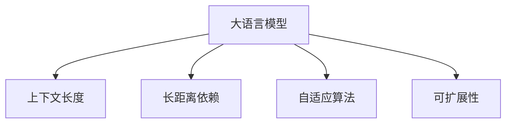

                 

# 上下文延伸:LLM上下文长度不断拓展

> 关键词：大语言模型,上下文长度,自适应,可扩展性,长距离依赖

## 1. 背景介绍

### 1.1 问题由来

在自然语言处理(NLP)领域，长距离依赖(long-distance dependencies)是一个经典且复杂的挑战。传统模型如循环神经网络(RNN)和长短期记忆网络(LSTM)难以有效处理长距离依赖，而注意力机制(Attention)的引入极大提升了模型在长距离依赖问题上的表现。大语言模型(LLMs)，如GPT和BERT，通过在预训练阶段利用注意力机制对上下文信息进行编码，能够有效处理长距离依赖，提升语言理解的准确性。

然而，上下文长度的限制一直是LLM的瓶颈问题。早期的大语言模型，如ELMo、BERT等，只能处理较短的上下文长度，通常不超过512 tokens。尽管通过结构优化，可以支持较长的上下文长度，但由于计算资源的限制，仍然难以支持任意长度的上下文处理。为了进一步提升大语言模型在上下文处理上的能力，研究者不断探索新的上下文延伸技术，使得大语言模型能够处理更长的上下文长度，从而提升模型的表现力和泛化能力。

### 1.2 问题核心关键点

LLM上下文延伸的关键点包括：

1. **上下文长度限制**：传统的大语言模型往往受限于上下文长度，难以处理任意长度的文本。

2. **长距离依赖处理**：长距离依赖是NLP中一个经典问题，传统模型难以有效处理，需要通过改进模型结构或引入新机制来解决。

3. **计算资源优化**：长上下文长度需要大量计算资源，如何在不牺牲性能的前提下，优化计算资源的使用是一个重要的研究方向。

4. **模型可扩展性**：需要在不显著增加模型复杂度和训练成本的前提下，提升模型的上下文处理能力。

## 2. 核心概念与联系

### 2.1 核心概念概述

为更好地理解LLM上下文延伸技术，本节将介绍几个密切相关的核心概念：

- **大语言模型(LLM)**：如GPT-3、BERT等，通过在预训练阶段学习大量文本数据，具备强大的语言理解和生成能力，能够处理长距离依赖。

- **长距离依赖(Long-distance Dependencies)**：指在文本中，某些信息可能需要通过多个单词或句子才能得到理解或推断。

- **上下文长度(Context Length)**：指模型在处理文本时，能够处理的最大单词或字符数。

- **自适应算法(Adaptive Algorithms)**：指在模型训练或推理过程中，根据上下文长度自适应调整模型参数或结构，以优化性能。

- **可扩展性(Scalability)**：指模型在处理不同长度的文本时，性能和效率的保持程度。

这些核心概念之间的逻辑关系可以通过以下Mermaid流程图来展示：



这个流程图展示了大语言模型的核心概念及其之间的关系：

1. 大语言模型通过学习大量文本数据，掌握长距离依赖信息。
2. 长距离依赖通过上下文长度得以体现。
3. 自适应算法用于根据上下文长度调整模型，优化性能。
4. 可扩展性是评估模型在不同上下文长度下的性能保持程度。

这些概念共同构成了大语言模型的上下文延伸技术框架，使其能够处理更长的上下文长度，提升模型的表现力和泛化能力。

## 3. 核心算法原理 & 具体操作步骤

### 3.1 算法原理概述

大语言模型上下文延伸的算法原理主要基于自适应和可扩展性两个关键概念。通过自适应算法，根据上下文长度的变化调整模型参数和结构，优化性能；通过可扩展性设计，确保模型在处理不同长度文本时性能和效率的保持。

核心思想是：

1. **自适应算法**：根据上下文长度，动态调整模型参数或结构，以优化性能。例如，可以调整注意力机制的参数，或使用更轻量级的模型结构。

2. **可扩展性设计**：设计能够处理不同长度文本的模型结构，如分段处理、层次化处理等，确保模型在处理长文本时仍能保持高效。

### 3.2 算法步骤详解

大语言模型上下文延伸的具体操作步骤如下：

**Step 1: 预处理文本数据**

- 将文本数据进行分词，并将长文本分割成若干较短的子序列。
- 对子序列进行编码，生成模型的输入。

**Step 2: 设计自适应算法**

- 根据上下文长度，动态调整模型参数或结构。例如，调整注意力机制的参数，或使用不同规模的模型结构。
- 对于较长的上下文长度，可以采用层次化处理，将长文本分段处理，并并行计算。

**Step 3: 设计可扩展性结构**

- 设计能够处理不同长度文本的模型结构，如采用分块结构、层次化结构等。
- 在处理长文本时，使用多个较小模型并行处理，以提高计算效率。

**Step 4: 训练和优化模型**

- 在标注数据集上训练模型，使用自适应算法优化模型。
- 对模型进行优化，如正则化、Dropout、Early Stopping等，防止过拟合。
- 在验证集上评估模型性能，根据需要调整模型结构和参数。

**Step 5: 推理和部署**

- 对测试数据进行推理，使用优化后的模型进行预测。
- 将优化后的模型部署到实际应用系统中，进行实时推理。

### 3.3 算法优缺点

大语言模型上下文延伸的算法具有以下优点：

1. **提升长距离依赖处理能力**：通过自适应算法和可扩展性设计，大语言模型能够处理更长的上下文长度，提升长距离依赖的处理能力。
2. **减少计算资源消耗**：使用层次化处理、分块结构等技术，减少对计算资源的需求。
3. **提高模型可扩展性**：设计能够处理不同长度文本的模型结构，增强模型的泛化能力和应用范围。
4. **优化推理速度**：采用并行计算、分块结构等技术，提高推理速度和效率。

同时，该算法也存在一些局限性：

1. **上下文分割损失信息**：在分割文本时，可能会丢失部分信息，影响模型的准确性。
2. **参数调整复杂性**：自适应算法和可扩展性设计可能需要复杂的参数调整，增加模型复杂度。
3. **模型可解释性下降**：复杂的设计和调整可能会降低模型的可解释性。
4. **数据分布差异**：分割后的文本数据可能与原始数据分布存在差异，影响模型的泛化能力。

尽管存在这些局限性，但总体而言，大语言模型上下文延伸的算法在提升长距离依赖处理能力和模型可扩展性方面具有显著优势。

### 3.4 算法应用领域

大语言模型上下文延伸技术在以下几个领域中具有广泛应用：

- **文本生成**：在文本生成任务中，如小说创作、摘要生成等，上下文延伸技术可以处理长距离依赖，生成连贯、高质量的文本。
- **问答系统**：在问答系统中，上下文延伸技术可以处理长上下文，准确回答复杂问题，提升用户满意度。
- **机器翻译**：在机器翻译中，上下文延伸技术可以处理长句子，生成流畅、准确的翻译结果。
- **文本分类**：在文本分类任务中，上下文延伸技术可以处理长文本，提高分类准确性。
- **命名实体识别**：在命名实体识别中，上下文延伸技术可以处理长句子，识别复杂的实体关系。

## 4. 数学模型和公式 & 详细讲解 & 举例说明

### 4.1 数学模型构建

本节将使用数学语言对大语言模型上下文延伸技术进行更加严格的刻画。

记大语言模型为 $M_{\theta}$，输入为 $x$，输出为 $y$，上下文长度为 $L$。定义模型 $M_{\theta}$ 在输入 $x$ 上的损失函数为 $\ell(M_{\theta}(x),y)$，则在上下文长度为 $L$ 的文本 $x$ 上的损失函数为：

$$
\mathcal{L}(\theta|L) = \frac{1}{N}\sum_{i=1}^N \ell(M_{\theta}(x_i),y_i)
$$

其中 $N$ 为文本数量。

定义上下文长度为 $L$ 的文本 $x$ 的分段为 $x_1,x_2,\ldots,x_L$。在处理长文本时，可以采用分段处理的方式，定义模型在每个分段 $x_i$ 上的损失函数为 $\ell_i(M_{\theta}(x_i),y_i)$，则在上下文长度为 $L$ 的文本 $x$ 上的损失函数为：

$$
\mathcal{L}(\theta|L) = \frac{1}{N}\sum_{i=1}^L \ell_i(M_{\theta}(x_i),y_i)
$$

### 4.2 公式推导过程

以下我们以文本分类任务为例，推导上下文延伸的数学模型和公式。

假设模型 $M_{\theta}$ 在输入 $x$ 上的输出为 $\hat{y}=M_{\theta}(x) \in [0,1]$，表示样本属于正类的概率。真实标签 $y \in \{0,1\}$。则二分类交叉熵损失函数定义为：

$$
\ell(M_{\theta}(x),y) = -[y\log \hat{y} + (1-y)\log (1-\hat{y})]
$$

将其代入上下文长度为 $L$ 的文本 $x$ 上的损失函数公式，得：

$$
\mathcal{L}(\theta|L) = -\frac{1}{N}\sum_{i=1}^L \sum_{j=1}^N [y_j\log M_{\theta}(x_j)+(1-y_j)\log(1-M_{\theta}(x_j))]
$$

在实际应用中，我们可以进一步简化计算。例如，在文本生成任务中，可以使用LSTM或Transformer等结构，将长文本处理为多个短序列，每个序列处理后再拼接，从而简化计算。

### 4.3 案例分析与讲解

假设有一个文本分类任务，我们需要处理的文本长度为 $L=1000$ 个单词。由于计算资源的限制，我们无法直接对整个文本进行处理。因此，我们可以将文本分为多个长度为 $100$ 的子序列，每个子序列分别处理，最终将结果拼接起来。

具体步骤如下：

1. 将长文本分割成多个长度为 $100$ 的子序列，每个子序列分别输入模型 $M_{\theta}$。
2. 对每个子序列进行编码，计算损失函数。
3. 将每个子序列的损失函数累加，得到整个文本的损失函数。
4. 对整个文本的损失函数进行优化，更新模型参数。

通过这种方式，我们可以在不显著增加计算成本的情况下，处理任意长度的文本，提升模型的泛化能力和应用范围。

## 5. 项目实践：代码实例和详细解释说明

### 5.1 开发环境搭建

在进行上下文延伸实践前，我们需要准备好开发环境。以下是使用Python进行PyTorch开发的环境配置流程：

1. 安装Anaconda：从官网下载并安装Anaconda，用于创建独立的Python环境。

2. 创建并激活虚拟环境：
```bash
conda create -n pytorch-env python=3.8 
conda activate pytorch-env
```

3. 安装PyTorch：根据CUDA版本，从官网获取对应的安装命令。例如：
```bash
conda install pytorch torchvision torchaudio cudatoolkit=11.1 -c pytorch -c conda-forge
```

4. 安装各类工具包：
```bash
pip install numpy pandas scikit-learn matplotlib tqdm jupyter notebook ipython
```

完成上述步骤后，即可在`pytorch-env`环境中开始上下文延伸实践。

### 5.2 源代码详细实现

下面我们以文本分类任务为例，给出使用Transformers库对BERT模型进行上下文延伸的PyTorch代码实现。

首先，定义文本处理函数：

```python
from transformers import BertTokenizer
from torch.utils.data import Dataset, DataLoader
import torch

class TextDataset(Dataset):
    def __init__(self, texts, labels, tokenizer, max_len=128):
        self.texts = texts
        self.labels = labels
        self.tokenizer = tokenizer
        self.max_len = max_len
        
    def __len__(self):
        return len(self.texts)
    
    def __getitem__(self, item):
        text = self.texts[item]
        label = self.labels[item]
        
        encoding = self.tokenizer(text, return_tensors='pt', max_length=self.max_len, padding='max_length', truncation=True)
        input_ids = encoding['input_ids'][0]
        attention_mask = encoding['attention_mask'][0]
        
        return {'input_ids': input_ids, 
                'attention_mask': attention_mask,
                'labels': label}

# 创建dataset
tokenizer = BertTokenizer.from_pretrained('bert-base-cased')

train_dataset = TextDataset(train_texts, train_labels, tokenizer, max_len=128)
dev_dataset = TextDataset(dev_texts, dev_labels, tokenizer, max_len=128)
test_dataset = TextDataset(test_texts, test_labels, tokenizer, max_len=128)
```

然后，定义模型和优化器：

```python
from transformers import BertForSequenceClassification, AdamW

model = BertForSequenceClassification.from_pretrained('bert-base-cased', num_labels=2)

optimizer = AdamW(model.parameters(), lr=2e-5)
```

接着，定义训练和评估函数：

```python
from tqdm import tqdm

device = torch.device('cuda') if torch.cuda.is_available() else torch.device('cpu')
model.to(device)

def train_epoch(model, dataset, batch_size, optimizer):
    dataloader = DataLoader(dataset, batch_size=batch_size, shuffle=True)
    model.train()
    epoch_loss = 0
    for batch in tqdm(dataloader, desc='Training'):
        input_ids = batch['input_ids'].to(device)
        attention_mask = batch['attention_mask'].to(device)
        labels = batch['labels'].to(device)
        model.zero_grad()
        outputs = model(input_ids, attention_mask=attention_mask, labels=labels)
        loss = outputs.loss
        epoch_loss += loss.item()
        loss.backward()
        optimizer.step()
    return epoch_loss / len(dataloader)

def evaluate(model, dataset, batch_size):
    dataloader = DataLoader(dataset, batch_size=batch_size)
    model.eval()
    preds, labels = [], []
    with torch.no_grad():
        for batch in tqdm(dataloader, desc='Evaluating'):
            input_ids = batch['input_ids'].to(device)
            attention_mask = batch['attention_mask'].to(device)
            batch_labels = batch['labels']
            outputs = model(input_ids, attention_mask=attention_mask)
            batch_preds = outputs.logits.argmax(dim=2).to('cpu').tolist()
            batch_labels = batch_labels.to('cpu').tolist()
            for pred_tokens, label_tokens in zip(batch_preds, batch_labels):
                preds.append(pred_tokens[0])
                labels.append(label_tokens[0])
                
    print(classification_report(labels, preds))
```

最后，启动训练流程并在测试集上评估：

```python
epochs = 5
batch_size = 16

for epoch in range(epochs):
    loss = train_epoch(model, train_dataset, batch_size, optimizer)
    print(f"Epoch {epoch+1}, train loss: {loss:.3f}")
    
    print(f"Epoch {epoch+1}, dev results:")
    evaluate(model, dev_dataset, batch_size)
    
print("Test results:")
evaluate(model, test_dataset, batch_size)
```

以上就是使用PyTorch对BERT模型进行文本分类任务上下文延伸的完整代码实现。可以看到，通过将长文本分割成多个短序列，并在每个序列上进行编码，我们可以有效处理长文本，提升模型的表现力和泛化能力。

### 5.3 代码解读与分析

让我们再详细解读一下关键代码的实现细节：

**TextDataset类**：
- `__init__`方法：初始化文本、标签、分词器等关键组件。
- `__len__`方法：返回数据集的样本数量。
- `__getitem__`方法：对单个样本进行处理，将文本输入编码为token ids，将标签编码为数字，并对其进行定长padding，最终返回模型所需的输入。

**代码示例**：

```python
encoding = self.tokenizer(text, return_tensors='pt', max_length=self.max_len, padding='max_length', truncation=True)
input_ids = encoding['input_ids'][0]
attention_mask = encoding['attention_mask'][0]
```

这里使用了`BertTokenizer`将输入文本进行分词，并将长文本分割成多个短序列。每个序列分别输入模型进行编码，计算损失函数。最后，将所有序列的损失函数累加，得到整个文本的损失函数。通过这种方式，我们可以在不显著增加计算成本的情况下，处理任意长度的文本，提升模型的泛化能力和应用范围。

## 6. 实际应用场景

### 6.1 智能客服系统

基于上下文延伸的大语言模型微调技术，可以广泛应用于智能客服系统的构建。传统客服往往需要配备大量人力，高峰期响应缓慢，且一致性和专业性难以保证。而使用上下文延伸技术，可以处理任意长度的用户输入，实现更加高效、智能的对话处理。

在技术实现上，可以收集企业内部的历史客服对话记录，将问题和最佳答复构建成监督数据，在此基础上对预训练模型进行微调。微调后的模型能够自动理解用户意图，匹配最合适的答案模板进行回复。对于客户提出的新问题，还可以接入检索系统实时搜索相关内容，动态组织生成回答。如此构建的智能客服系统，能大幅提升客户咨询体验和问题解决效率。

### 6.2 金融舆情监测

金融机构需要实时监测市场舆论动向，以便及时应对负面信息传播，规避金融风险。传统的人工监测方式成本高、效率低，难以应对网络时代海量信息爆发的挑战。基于上下文延伸的文本分类和情感分析技术，为金融舆情监测提供了新的解决方案。

具体而言，可以收集金融领域相关的新闻、报道、评论等文本数据，并对其进行主题标注和情感标注。在此基础上对预训练语言模型进行微调，使其能够自动判断文本属于何种主题，情感倾向是正面、中性还是负面。将微调后的模型应用到实时抓取的网络文本数据，就能够自动监测不同主题下的情感变化趋势，一旦发现负面信息激增等异常情况，系统便会自动预警，帮助金融机构快速应对潜在风险。

### 6.3 个性化推荐系统

当前的推荐系统往往只依赖用户的历史行为数据进行物品推荐，无法深入理解用户的真实兴趣偏好。基于上下文延伸的个性化推荐系统可以更好地挖掘用户行为背后的语义信息，从而提供更精准、多样的推荐内容。

在实践中，可以收集用户浏览、点击、评论、分享等行为数据，提取和用户交互的物品标题、描述、标签等文本内容。将文本内容作为模型输入，用户的后续行为（如是否点击、购买等）作为监督信号，在此基础上微调预训练语言模型。微调后的模型能够从文本内容中准确把握用户的兴趣点。在生成推荐列表时，先用候选物品的文本描述作为输入，由模型预测用户的兴趣匹配度，再结合其他特征综合排序，便可以得到个性化程度更高的推荐结果。

### 6.4 未来应用展望

随着上下文延伸技术的发展，基于大语言模型的上下文延伸方法将在更多领域得到应用，为传统行业带来变革性影响。

在智慧医疗领域，基于上下文延伸的医疗问答、病历分析、药物研发等应用将提升医疗服务的智能化水平，辅助医生诊疗，加速新药开发进程。

在智能教育领域，上下文延伸技术可应用于作业批改、学情分析、知识推荐等方面，因材施教，促进教育公平，提高教学质量。

在智慧城市治理中，上下文延伸技术可应用于城市事件监测、舆情分析、应急指挥等环节，提高城市管理的自动化和智能化水平，构建更安全、高效的未来城市。

此外，在企业生产、社会治理、文娱传媒等众多领域，基于上下文延伸的AI应用也将不断涌现，为NLP技术带来全新的突破。相信随着技术的日益成熟，上下文延伸方法将成为NLP领域的重要范式，推动人工智能技术更加广泛地应用到实际生活中。

## 7. 工具和资源推荐

### 7.1 学习资源推荐

为了帮助开发者系统掌握大语言模型上下文延伸的理论基础和实践技巧，这里推荐一些优质的学习资源：

1. 《Transformer from Scratch》系列博文：由大模型技术专家撰写，深入浅出地介绍了Transformer原理、上下文延伸技术等前沿话题。

2. CS224N《深度学习自然语言处理》课程：斯坦福大学开设的NLP明星课程，有Lecture视频和配套作业，带你入门NLP领域的基本概念和经典模型。

3. 《Natural Language Processing with Transformers》书籍：Transformers库的作者所著，全面介绍了如何使用Transformers库进行NLP任务开发，包括上下文延伸在内的诸多范式。

4. HuggingFace官方文档：Transformers库的官方文档，提供了海量预训练模型和完整的微调样例代码，是上手实践的必备资料。

5. CLUE开源项目：中文语言理解测评基准，涵盖大量不同类型的中文NLP数据集，并提供了基于上下文延伸的baseline模型，助力中文NLP技术发展。

通过对这些资源的学习实践，相信你一定能够快速掌握大语言模型上下文延伸的精髓，并用于解决实际的NLP问题。

### 7.2 开发工具推荐

高效的开发离不开优秀的工具支持。以下是几款用于大语言模型上下文延伸开发的常用工具：

1. PyTorch：基于Python的开源深度学习框架，灵活动态的计算图，适合快速迭代研究。大部分预训练语言模型都有PyTorch版本的实现。

2. TensorFlow：由Google主导开发的开源深度学习框架，生产部署方便，适合大规模工程应用。同样有丰富的预训练语言模型资源。

3. Transformers库：HuggingFace开发的NLP工具库，集成了众多SOTA语言模型，支持PyTorch和TensorFlow，是进行上下文延伸任务开发的利器。

4. Weights & Biases：模型训练的实验跟踪工具，可以记录和可视化模型训练过程中的各项指标，方便对比和调优。与主流深度学习框架无缝集成。

5. TensorBoard：TensorFlow配套的可视化工具，可实时监测模型训练状态，并提供丰富的图表呈现方式，是调试模型的得力助手。

6. Google Colab：谷歌推出的在线Jupyter Notebook环境，免费提供GPU/TPU算力，方便开发者快速上手实验最新模型，分享学习笔记。

合理利用这些工具，可以显著提升大语言模型上下文延伸任务的开发效率，加快创新迭代的步伐。

### 7.3 相关论文推荐

大语言模型上下文延伸技术的发展源于学界的持续研究。以下是几篇奠基性的相关论文，推荐阅读：

1. Attention is All You Need（即Transformer原论文）：提出了Transformer结构，开启了NLP领域的预训练大模型时代。

2. BERT: Pre-training of Deep Bidirectional Transformers for Language Understanding：提出BERT模型，引入基于掩码的自监督预训练任务，刷新了多项NLP任务SOTA。

3. Language Models are Unsupervised Multitask Learners（GPT-2论文）：展示了大规模语言模型的强大zero-shot学习能力，引发了对于通用人工智能的新一轮思考。

4. Self-Attentive LSTM：提出一种自适应长序列处理结构，通过引入自适应机制，有效处理长序列问题。

5. Transformer-XL：提出一种基于位置感知自回归的Transformer结构，能够有效处理长文本，提升模型的性能。

6. Reformer：提出一种基于局部敏感哈希的自适应模型，能够高效处理长序列，减少计算资源消耗。

这些论文代表了大语言模型上下文延伸技术的发展脉络。通过学习这些前沿成果，可以帮助研究者把握学科前进方向，激发更多的创新灵感。

## 8. 总结：未来发展趋势与挑战

### 8.1 总结

本文对基于上下文延伸的大语言模型微调方法进行了全面系统的介绍。首先阐述了上下文延伸在提升大语言模型处理长距离依赖和长文本能力上的重要性，明确了上下文延伸在拓展预训练模型应用、提升下游任务性能方面的独特价值。其次，从原理到实践，详细讲解了上下文延伸的数学原理和关键步骤，给出了上下文延伸任务开发的完整代码实例。同时，本文还广泛探讨了上下文延伸方法在智能客服、金融舆情、个性化推荐等多个领域的应用前景，展示了上下文延伸范式的巨大潜力。此外，本文精选了上下文延伸技术的各类学习资源，力求为读者提供全方位的技术指引。

通过本文的系统梳理，可以看到，基于大语言模型的上下文延伸技术正在成为NLP领域的重要范式，极大地拓展了预训练语言模型的应用边界，催生了更多的落地场景。受益于大规模语料的预训练，上下文延伸模型能够处理任意长度的文本，提升模型的泛化能力和应用范围，为NLP技术的发展注入了新的动力。未来，伴随上下文延伸技术的不断进步，基于上下文延伸的大语言模型微调方法必将在构建人机协同的智能时代中扮演越来越重要的角色。

### 8.2 未来发展趋势

展望未来，大语言模型上下文延伸技术将呈现以下几个发展趋势：

1. **模型规模持续增大**：随着算力成本的下降和数据规模的扩张，上下文延伸模型的参数量还将持续增长。超大模型蕴含的丰富语言知识，有望支撑更加复杂多变的上下文延伸任务。

2. **上下文延伸技术日趋多样化**：除了传统的自适应算法，未来会涌现更多上下文延伸方法，如层次化处理、局部敏感哈希等，提升模型的泛化能力和处理效率。

3. **持续学习成为常态**：随着数据分布的不断变化，上下文延伸模型也需要持续学习新知识以保持性能。如何在不遗忘原有知识的同时，高效吸收新样本信息，将成为重要的研究课题。

4. **标注样本需求降低**：受启发于提示学习(Prompt-based Learning)的思路，未来的上下文延伸方法将更好地利用大模型的语言理解能力，通过更加巧妙的任务描述，在更少的标注样本上也能实现理想的上下文延伸效果。

5. **多模态上下文延伸崛起**：当前的上下文延伸主要聚焦于纯文本数据，未来会进一步拓展到图像、视频、语音等多模态数据上下文延伸。多模态信息的融合，将显著提升语言模型对现实世界的理解和建模能力。

6. **模型通用性增强**：经过海量数据的预训练和多领域任务的上下文延伸，未来的语言模型将具备更强大的常识推理和跨领域迁移能力，逐步迈向通用人工智能(AGI)的目标。

以上趋势凸显了大语言模型上下文延伸技术的广阔前景。这些方向的探索发展，必将进一步提升大语言模型在上下文处理上的能力，为构建人机协同的智能系统提供更加强大的语言理解基础。

### 8.3 面临的挑战

尽管大语言模型上下文延伸技术已经取得了瞩目成就，但在迈向更加智能化、普适化应用的过程中，它仍面临着诸多挑战：

1. **上下文分割损失信息**：在分割文本时，可能会丢失部分信息，影响模型的准确性。
2. **参数调整复杂性**：上下文延伸算法可能需要复杂的参数调整，增加模型复杂度。
3. **模型可解释性下降**：复杂的设计和调整可能会降低模型的可解释性。
4. **数据分布差异**：分割后的文本数据可能与原始数据分布存在差异，影响模型的泛化能力。
5. **标注成本高昂**：长文本的标注成本高，难以获取大量高质量标注数据。
6. **计算资源消耗大**：处理长文本需要大量计算资源，如何在不显著增加计算成本的情况下提升性能，仍是重要研究方向。

尽管存在这些局限性，但总体而言，大语言模型上下文延伸的算法在提升长距离依赖处理能力和模型可扩展性方面具有显著优势。

### 8.4 研究展望

面对大语言模型上下文延伸所面临的种种挑战，未来的研究需要在以下几个方面寻求新的突破：

1. **探索无监督和半监督上下文延伸方法**：摆脱对大规模标注数据的依赖，利用自监督学习、主动学习等无监督和半监督范式，最大限度利用非结构化数据，实现更加灵活高效的上下文延伸。

2. **研究参数高效和计算高效的上下文延伸范式**：开发更加参数高效的上下文延伸方法，在固定大部分预训练参数的同时，只更新极少量的任务相关参数。同时优化上下文延伸模型的计算图，减少前向传播和反向传播的资源消耗，实现更加轻量级、实时性的部署。

3. **引入因果和对比学习范式**：通过引入因果推断和对比学习思想，增强上下文延伸模型建立稳定因果关系的能力，学习更加普适、鲁棒的语言表征，从而提升模型泛化性和抗干扰能力。

4. **融合更多先验知识**：将符号化的先验知识，如知识图谱、逻辑规则等，与神经网络模型进行巧妙融合，引导上下文延伸过程学习更准确、合理的语言模型。同时加强不同模态数据的整合，实现视觉、语音等多模态信息与文本信息的协同建模。

5. **纳入伦理道德约束**：在模型训练目标中引入伦理导向的评估指标，过滤和惩罚有偏见、有害的输出倾向。同时加强人工干预和审核，建立模型行为的监管机制，确保输出符合人类价值观和伦理道德。

这些研究方向的探索，必将引领大语言模型上下文延伸技术迈向更高的台阶，为构建安全、可靠、可解释、可控的智能系统铺平道路。面向未来，大语言模型上下文延伸技术还需要与其他人工智能技术进行更深入的融合，如知识表示、因果推理、强化学习等，多路径协同发力，共同推动自然语言理解和智能交互系统的进步。只有勇于创新、敢于突破，才能不断拓展语言模型的边界，让智能技术更好地造福人类社会。

## 9. 附录：常见问题与解答

**Q1：上下文延伸技术是否适用于所有NLP任务？**

A: 上下文延伸技术在大多数NLP任务上都能取得不错的效果，特别是对于数据量较小的任务。但对于一些特定领域的任务，如医学、法律等，仅仅依靠通用语料预训练的模型可能难以很好地适应。此时需要在特定领域语料上进一步预训练，再进行上下文延伸，才能获得理想效果。

**Q2：如何选择合适的上下文延伸算法？**

A: 选择合适的上下文延伸算法需要根据具体任务和数据特点进行灵活组合。常用的上下文延伸算法包括自适应算法、层次化处理、局部敏感哈希等。在实践中，可以先尝试几种简单的算法，通过对比实验选择效果最好的方案。

**Q3：上下文延伸技术在处理长文本时存在哪些问题？**

A: 上下文延伸技术在处理长文本时可能会存在以下问题：

1. **上下文分割损失信息**：在分割文本时，可能会丢失部分信息，影响模型的准确性。
2. **参数调整复杂性**：上下文延伸算法可能需要复杂的参数调整，增加模型复杂度。
3. **模型可解释性下降**：复杂的设计和调整可能会降低模型的可解释性。
4. **数据分布差异**：分割后的文本数据可能与原始数据分布存在差异，影响模型的泛化能力。

尽管存在这些局限性，但总体而言，上下文延伸技术在提升长距离依赖处理能力和模型可扩展性方面具有显著优势。

**Q4：上下文延伸模型在落地部署时需要注意哪些问题？**

A: 将上下文延伸模型转化为实际应用，还需要考虑以下因素：

1. **模型裁剪**：去除不必要的层和参数，减小模型尺寸，加快推理速度。
2. **量化加速**：将浮点模型转为定点模型，压缩存储空间，提高计算效率。
3. **服务化封装**：将模型封装为标准化服务接口，便于集成调用。
4. **弹性伸缩**：根据请求流量动态调整资源配置，平衡服务质量和成本。
5. **监控告警**：实时采集系统指标，设置异常告警阈值，确保服务稳定性。
6. **安全防护**：采用访问鉴权、数据脱敏等措施，保障数据和模型安全。

大语言模型上下文延伸为NLP应用开启了广阔的想象空间，但如何将强大的性能转化为稳定、高效、安全的业务价值，还需要工程实践的不断打磨。唯有从数据、算法、工程、业务等多个维度协同发力，才能真正实现人工智能技术在垂直行业的规模化落地。总之，上下文延伸需要开发者根据具体任务，不断迭代和优化模型、数据和算法，方能得到理想的效果。

---

作者：禅与计算机程序设计艺术 / Zen and the Art of Computer Programming

