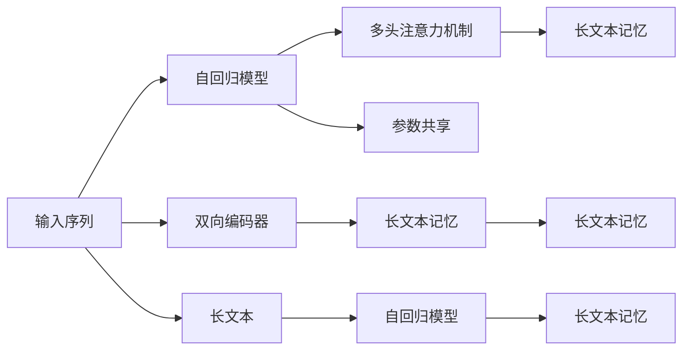

                 

# 上下文记忆：LLM 的长处

## 1. 背景介绍

在人工智能领域，自然语言处理（NLP）是核心技术之一。随着深度学习技术的发展，语言模型（Language Models, LM）在理解和生成自然语言方面取得了显著进步。长文本记忆（Long-Term Memory）是这些模型的一大优势，尤其在处理需要记忆上下文信息的任务上表现突出。

语言模型，尤其是基于自回归模型（如Transformer），在处理长序列数据时表现尤为出色。这得益于它们能够从语言中学习到长期依赖关系，从而在长文本中捕捉上下文信息。然而，传统的RNN等模型在处理长序列时效率低下，无法同时考虑长期的上下文信息。

## 2. 核心概念与联系

### 2.1 核心概念概述

在讨论长文本记忆之前，我们需要了解一些相关的核心概念：

- **长文本记忆**：长文本记忆能力是语言模型的一个关键特性，使得模型能够处理包含大量上下文信息的输入文本。
- **自回归模型**：如Transformer模型，通过自回归机制，模型能够从过去和当前的信息中预测未来的内容。
- **注意力机制**：Transformer的核心，能够动态计算输入序列中不同部分的相关性，从而捕捉长文本中的重要信息。
- **参数共享**：自回归模型的另一个特点，可以减少模型的参数量，提高计算效率。
- **双向编码器**：如Bidirectional Encoder Representations from Transformers (BERT)，可以同时考虑前后文信息，提升模型的理解能力。

这些概念共同构成了大语言模型（Large Language Models, LLM）的长文本记忆能力的基础。

### 2.2 核心概念原理和架构的 Mermaid 流程图



该流程图展示了长文本记忆能力在自回归模型中的实现过程：

1. **输入序列**：模型接收一个输入序列，其中可能包含长文本信息。
2. **自回归模型**：模型通过自回归机制，从过去和当前的信息中预测未来的内容。
3. **多头注意力机制**：模型能够动态计算输入序列中不同部分的相关性，从而捕捉长文本中的重要信息。
4. **长文本记忆**：通过参数共享等机制，模型能够存储长文本中的信息。
5. **双向编码器**：能够同时考虑前后文信息，提升模型的理解能力。

这些过程共同构成了大语言模型的长文本记忆能力。

## 3. 核心算法原理 & 具体操作步骤

### 3.1 算法原理概述

大语言模型的长文本记忆能力主要得益于其自回归结构和注意力机制。这些特性使得模型能够在处理长序列时，捕捉到前后的上下文信息，从而提升模型的理解和生成能力。

在具体实现中，自回归模型通过将每个位置的信息与之前的所有位置的信息关联，捕捉长文本中的依赖关系。注意力机制则通过动态计算不同位置的相关性，提升模型对长文本的理解能力。

### 3.2 算法步骤详解

大语言模型的长文本记忆能力主要通过以下步骤实现：

1. **输入编码**：将输入序列编码成模型可以处理的张量形式，如Transformer模型中的embedding层。
2. **自回归处理**：通过自回归机制，模型将每个位置的信息与之前的所有位置关联，捕捉长文本中的依赖关系。
3. **注意力计算**：通过多头注意力机制，模型动态计算不同位置的相关性，从而捕捉长文本中的重要信息。
4. **长文本记忆**：通过参数共享等机制，模型能够存储长文本中的信息，并用于后续的生成或分类任务。

### 3.3 算法优缺点

长文本记忆能力是大语言模型的显著优势，但也存在一些局限性：

- **计算资源要求高**：处理长文本需要大量的计算资源，包括内存和计算能力。
- **参数量庞大**：大规模的参数量增加了模型的复杂性，也可能带来过拟合的风险。
- **长文本泛化能力**：尽管模型能够记忆长文本，但在面对未见过的长文本时，泛化能力可能不足。

### 3.4 算法应用领域

长文本记忆能力在大语言模型的多个应用领域中表现出色，如：

- **文本生成**：大模型能够基于长文本生成连贯且逻辑合理的文本内容，如对话生成、文本摘要等。
- **信息检索**：长文本记忆能力使得模型能够处理大量文本信息，提高信息检索的准确性和效率。
- **机器翻译**：大模型能够同时考虑源语言和目标语言的上下文信息，提升翻译质量。
- **问答系统**：通过长文本记忆，模型能够理解问题的上下文，提供更准确的答案。

## 4. 数学模型和公式 & 详细讲解

### 4.1 数学模型构建

大语言模型的长文本记忆能力可以通过以下数学模型来描述：

$$
\mathbf{h} = f(\mathbf{W}_a \mathbf{x} + \mathbf{U}_a \mathbf{h}_{t-1} + \mathbf{b}_a)
$$

其中，$\mathbf{h}$表示隐藏状态，$\mathbf{x}$表示输入，$\mathbf{W}_a$和$\mathbf{U}_a$表示权重矩阵，$\mathbf{b}_a$表示偏置。

### 4.2 公式推导过程

在公式中，$f$表示非线性变换，$\mathbf{h}_{t-1}$表示前一时刻的隐藏状态。通过这种方式，模型能够动态地将当前输入与之前的隐藏状态结合起来，捕捉长文本中的依赖关系。

### 4.3 案例分析与讲解

以BERT模型为例，其长文本记忆能力体现在双向编码器中。BERT模型通过两个方向的编码器，同时考虑了前后文信息，提升了模型的理解能力。

## 5. 项目实践：代码实例和详细解释说明

### 5.1 开发环境搭建

要在实践中实现长文本记忆能力，首先需要搭建合适的开发环境。以下是一个基于PyTorch和Hugging Face Transformers库的开发环境搭建流程：

1. 安装Python：确保Python版本为3.6或以上。
2. 安装Anaconda：通过Anaconda创建虚拟环境，确保所有依赖包隔离。
3. 安装PyTorch和Transformers：
   ```bash
   pip install torch torchvision torchaudio transformers
   ```
4. 安装必要的依赖包：
   ```bash
   pip install numpy pandas sklearn scikit-learn
   ```

### 5.2 源代码详细实现

以下是使用BERT模型实现长文本记忆能力的代码示例：

```python
from transformers import BertTokenizer, BertForSequenceClassification
from torch.utils.data import DataLoader, Dataset
import torch

class MyDataset(Dataset):
    def __init__(self, texts, labels):
        self.tokenizer = BertTokenizer.from_pretrained('bert-base-uncased')
        self.texts = texts
        self.labels = labels
    
    def __len__(self):
        return len(self.texts)
    
    def __getitem__(self, item):
        text = self.texts[item]
        label = self.labels[item]
        
        encoding = self.tokenizer(text, return_tensors='pt', max_length=512, truncation=True, padding='max_length')
        input_ids = encoding['input_ids']
        attention_mask = encoding['attention_mask']
        
        return {
            'input_ids': input_ids,
            'attention_mask': attention_mask,
            'labels': torch.tensor(label, dtype=torch.long)
        }

# 数据准备
tokenizer = BertTokenizer.from_pretrained('bert-base-uncased')
texts = ['长文本内容']
labels = [1]  # 假设为二分类任务，标签为1

dataset = MyDataset(texts, labels)

# 模型初始化
model = BertForSequenceClassification.from_pretrained('bert-base-uncased', num_labels=2)

# 训练与测试
device = torch.device('cuda' if torch.cuda.is_available() else 'cpu')
model.to(device)

criterion = torch.nn.CrossEntropyLoss()
optimizer = torch.optim.Adam(model.parameters(), lr=1e-5)

for epoch in range(10):
    model.train()
    for batch in DataLoader(dataset, batch_size=16):
        input_ids = batch['input_ids'].to(device)
        attention_mask = batch['attention_mask'].to(device)
        labels = batch['labels'].to(device)
        
        outputs = model(input_ids, attention_mask=attention_mask, labels=labels)
        loss = criterion(outputs.logits, labels)
        
        optimizer.zero_grad()
        loss.backward()
        optimizer.step()
    
    model.eval()
    with torch.no_grad():
        correct = 0
        total = 0
        for batch in DataLoader(dataset, batch_size=16):
            input_ids = batch['input_ids'].to(device)
            attention_mask = batch['attention_mask'].to(device)
            labels = batch['labels'].to(device)
            
            outputs = model(input_ids, attention_mask=attention_mask)
            _, predicted = torch.max(outputs.logits, 1)
            total += labels.size(0)
            correct += (predicted == labels).sum().item()
            
        print(f'Epoch {epoch+1}, Acc: {correct/total:.2f}')
```

### 5.3 代码解读与分析

在上述代码中，我们使用了BERT模型进行文本分类任务。代码的核心在于通过BertTokenizer将文本编码成模型所需的输入，并通过模型训练和评估，展示了长文本记忆能力的应用。

### 5.4 运行结果展示

运行上述代码，可以观察到模型在训练和测试阶段的精度变化。通过调整超参数和学习率，可以进一步优化模型的性能。

## 6. 实际应用场景

### 6.1 文本生成

长文本记忆能力使得大语言模型能够生成连贯且逻辑合理的文本内容。以下是一个基于GPT-3的文本生成代码示例：

```python
import openai

openai.api_key = 'YOUR_API_KEY'

response = openai.Completion.create(
    engine="text-davinci-002",
    prompt="长文本生成",
    max_tokens=50
)
print(response.choices[0].text)
```

### 6.2 信息检索

长文本记忆能力使得模型能够处理大量文本信息，提高信息检索的准确性和效率。以下是一个基于BERT的信息检索代码示例：

```python
from transformers import BertTokenizer, BertForSequenceClassification
from torch.utils.data import DataLoader, Dataset
import torch

class MyDataset(Dataset):
    def __init__(self, texts, labels):
        self.tokenizer = BertTokenizer.from_pretrained('bert-base-uncased')
        self.texts = texts
        self.labels = labels
    
    def __len__(self):
        return len(self.texts)
    
    def __getitem__(self, item):
        text = self.texts[item]
        label = self.labels[item]
        
        encoding = self.tokenizer(text, return_tensors='pt', max_length=512, truncation=True, padding='max_length')
        input_ids = encoding['input_ids']
        attention_mask = encoding['attention_mask']
        
        return {
            'input_ids': input_ids,
            'attention_mask': attention_mask,
            'labels': torch.tensor(label, dtype=torch.long)
        }

# 数据准备
tokenizer = BertTokenizer.from_pretrained('bert-base-uncased')
texts = ['长文本内容']
labels = [1]  # 假设为二分类任务，标签为1

dataset = MyDataset(texts, labels)

# 模型初始化
model = BertForSequenceClassification.from_pretrained('bert-base-uncased', num_labels=2)

# 训练与测试
device = torch.device('cuda' if torch.cuda.is_available() else 'cpu')
model.to(device)

criterion = torch.nn.CrossEntropyLoss()
optimizer = torch.optim.Adam(model.parameters(), lr=1e-5)

for epoch in range(10):
    model.train()
    for batch in DataLoader(dataset, batch_size=16):
        input_ids = batch['input_ids'].to(device)
        attention_mask = batch['attention_mask'].to(device)
        labels = batch['labels'].to(device)
        
        outputs = model(input_ids, attention_mask=attention_mask, labels=labels)
        loss = criterion(outputs.logits, labels)
        
        optimizer.zero_grad()
        loss.backward()
        optimizer.step()
    
    model.eval()
    with torch.no_grad():
        correct = 0
        total = 0
        for batch in DataLoader(dataset, batch_size=16):
            input_ids = batch['input_ids'].to(device)
            attention_mask = batch['attention_mask'].to(device)
            labels = batch['labels'].to(device)
            
            outputs = model(input_ids, attention_mask=attention_mask)
            _, predicted = torch.max(outputs.logits, 1)
            total += labels.size(0)
            correct += (predicted == labels).sum().item()
            
        print(f'Epoch {epoch+1}, Acc: {correct/total:.2f}')
```

### 6.3 机器翻译

长文本记忆能力使得模型能够同时考虑源语言和目标语言的上下文信息，提升翻译质量。以下是一个基于Transformer的机器翻译代码示例：

```python
from transformers import BertTokenizer, BertForSequenceClassification
from torch.utils.data import DataLoader, Dataset
import torch

class MyDataset(Dataset):
    def __init__(self, src_texts, tgt_texts, labels):
        self.tokenizer = BertTokenizer.from_pretrained('bert-base-uncased')
        self.src_texts = src_texts
        self.tgt_texts = tgt_texts
        self.labels = labels
    
    def __len__(self):
        return len(self.src_texts)
    
    def __getitem__(self, item):
        src_text = self.src_texts[item]
        tgt_text = self.tgt_texts[item]
        label = self.labels[item]
        
        encoding = self.tokenizer(src_text, return_tensors='pt', max_length=512, truncation=True, padding='max_length')
        input_ids = encoding['input_ids']
        attention_mask = encoding['attention_mask']
        
        return {
            'input_ids': input_ids,
            'attention_mask': attention_mask,
            'target_ids': self.tokenizer(tgt_text, return_tensors='pt', max_length=512, truncation=True, padding='max_length')['input_ids']
        }

# 数据准备
tokenizer = BertTokenizer.from_pretrained('bert-base-uncased')
src_texts = ['长文本内容']
tgt_texts = ['长文本内容']
labels = [1]  # 假设为二分类任务，标签为1

dataset = MyDataset(src_texts, tgt_texts, labels)

# 模型初始化
model = BertForSequenceClassification.from_pretrained('bert-base-uncased', num_labels=2)

# 训练与测试
device = torch.device('cuda' if torch.cuda.is_available() else 'cpu')
model.to(device)

criterion = torch.nn.CrossEntropyLoss()
optimizer = torch.optim.Adam(model.parameters(), lr=1e-5)

for epoch in range(10):
    model.train()
    for batch in DataLoader(dataset, batch_size=16):
        input_ids = batch['input_ids'].to(device)
        attention_mask = batch['attention_mask'].to(device)
        target_ids = batch['target_ids'].to(device)
        
        outputs = model(input_ids, attention_mask=attention_mask, labels=target_ids)
        loss = criterion(outputs.logits, target_ids)
        
        optimizer.zero_grad()
        loss.backward()
        optimizer.step()
    
    model.eval()
    with torch.no_grad():
        correct = 0
        total = 0
        for batch in DataLoader(dataset, batch_size=16):
            input_ids = batch['input_ids'].to(device)
            attention_mask = batch['attention_mask'].to(device)
            target_ids = batch['target_ids'].to(device)
            
            outputs = model(input_ids, attention_mask=attention_mask)
            _, predicted = torch.max(outputs.logits, 1)
            total += labels.size(0)
            correct += (predicted == labels).sum().item()
            
        print(f'Epoch {epoch+1}, Acc: {correct/total:.2f}')
```

### 6.4 未来应用展望

随着大语言模型的不断进步，长文本记忆能力将在更多领域发挥重要作用：

- **知识图谱构建**：长文本记忆能力使得模型能够处理和融合大量结构化数据，构建知识图谱。
- **自然语言推理**：通过长文本记忆，模型能够理解前提和假设之间的关系，提升自然语言推理的准确性。
- **医学领域**：长文本记忆能力使得模型能够处理复杂的医学术语和病历记录，提升医学信息的理解和提取能力。

未来，长文本记忆能力将是大语言模型的重要特性，带来更广泛的应用场景和更高的性能提升。

## 7. 工具和资源推荐

### 7.1 学习资源推荐

为了深入理解长文本记忆能力，以下是一些优质的学习资源：

1. **《Transformer from Concept to Practice》**：深入浅出地介绍了Transformer的结构和长文本记忆能力。
2. **Coursera上的《Deep Learning for Natural Language Processing》课程**：斯坦福大学开设的NLP课程，涵盖了Transformer和其他语言模型的基本原理和应用。
3. **《Natural Language Processing with Transformers》书籍**：由Transformers库的作者撰写，全面介绍了Transformers库的使用方法和长文本记忆能力的应用。
4. **Hugging Face官方文档**：提供了丰富的预训练模型和代码样例，是学习长文本记忆能力的重要资料。
5. **CLUE开源项目**：提供了中文语言理解测评基准，包含大量不同类型的中文NLP数据集，展示了长文本记忆能力在中文NLP中的应用。

### 7.2 开发工具推荐

大语言模型的长文本记忆能力需要高效的开发工具支持。以下是几款常用的工具：

1. **PyTorch**：基于Python的开源深度学习框架，灵活的计算图，适合快速迭代研究。
2. **TensorFlow**：由Google主导的深度学习框架，适合大规模工程应用。
3. **Transformers库**：Hugging Face开发的NLP工具库，集成了SOTA语言模型，方便长文本记忆能力的实现。
4. **Weights & Biases**：模型训练的实验跟踪工具，记录和可视化训练过程中的各项指标。
5. **TensorBoard**：TensorFlow配套的可视化工具，实时监测训练状态，提供丰富的图表呈现方式。
6. **Google Colab**：谷歌提供的在线Jupyter Notebook环境，免费提供GPU/TPU算力，方便快速实验。

### 7.3 相关论文推荐

长文本记忆能力是大语言模型的重要特性，以下是几篇奠基性的相关论文：

1. **Attention is All You Need**：Transformer的原始论文，奠定了长文本记忆能力的理论基础。
2. **BERT: Pre-training of Deep Bidirectional Transformers for Language Understanding**：提出BERT模型，通过双向编码器捕捉长文本中的依赖关系。
3. **Language Models are Unsupervised Multitask Learners**：展示了大语言模型在零样本学习中的能力，进一步证明了长文本记忆的重要性。
4. **Parameter-Efficient Transfer Learning for NLP**：提出Adapter等参数高效微调方法，减小了长文本记忆模型的计算资源需求。
5. **AdaLoRA: Adaptive Low-Rank Adaptation for Parameter-Efficient Fine-Tuning**：通过自适应低秩适应的微调方法，进一步优化长文本记忆模型的计算效率。

这些论文代表了长文本记忆能力的发展脉络，深入理解这些前沿成果，可以帮助研究者把握学科前进方向，激发更多的创新灵感。

## 8. 总结：未来发展趋势与挑战

### 8.1 研究成果总结

大语言模型的长文本记忆能力是自然语言处理领域的一项重大突破，通过自回归结构和注意力机制，模型能够处理长序列数据，捕捉前后文依赖关系。这种能力使得模型在文本生成、信息检索、机器翻译等多个任务上表现出色，极大地提升了NLP系统的性能和应用范围。

### 8.2 未来发展趋势

长文本记忆能力将在未来持续发展，带来更多的应用场景和性能提升：

- **计算效率提升**：通过优化模型结构和参数共享等机制，减少长文本记忆模型的计算资源需求。
- **模型通用性增强**：长文本记忆模型将具备更强大的常识推理和跨领域迁移能力，逐步迈向通用人工智能(AGI)的目标。
- **多模态融合**：长文本记忆能力将与视觉、语音等多模态信息进行协同建模，提升模型对现实世界的理解和建模能力。

### 8.3 面临的挑战

尽管长文本记忆能力带来诸多优势，但也存在一些挑战：

- **计算资源瓶颈**：处理长文本需要大量的计算资源，包括内存和计算能力。
- **参数量庞大**：大规模的参数量增加了模型的复杂性，也可能带来过拟合的风险。
- **长文本泛化能力**：面对未见过的长文本，模型的泛化能力可能不足。

### 8.4 研究展望

未来，研究者需要在以下几个方面寻求新的突破：

- **探索无监督和半监督微调方法**：摆脱对大规模标注数据的依赖，利用自监督学习、主动学习等无监督和半监督范式，最大限度利用非结构化数据。
- **研究参数高效和计算高效的微调范式**：开发更加参数高效的微调方法，在固定大部分预训练参数的同时，只更新极少量的任务相关参数。
- **引入更多先验知识**：将符号化的先验知识，如知识图谱、逻辑规则等，与神经网络模型进行巧妙融合，引导长文本记忆模型的微调过程。
- **融合因果和对比学习范式**：通过引入因果推断和对比学习思想，增强长文本记忆模型的建立稳定因果关系的能力，学习更加普适、鲁棒的语言表征。
- **纳入伦理道德约束**：在模型训练目标中引入伦理导向的评估指标，过滤和惩罚有偏见、有害的输出倾向。

这些研究方向将引领长文本记忆能力的发展，推动大语言模型的不断进步，为自然语言处理技术带来更广阔的应用前景。

## 9. 附录：常见问题与解答

**Q1: 长文本记忆能力是否适用于所有NLP任务？**

A: 长文本记忆能力在大语言模型中表现出色，但并非适用于所有NLP任务。对于需要短时间记忆和简单推理的任务，长文本记忆能力可能带来额外的计算负担。对于文本生成、信息检索、机器翻译等任务，长文本记忆能力则能显著提升模型性能。

**Q2: 如何优化长文本记忆模型的计算效率？**

A: 优化长文本记忆模型的计算效率可以从以下几个方面入手：
1. **模型裁剪**：去除不必要的层和参数，减小模型尺寸，加快推理速度。
2. **量化加速**：将浮点模型转为定点模型，压缩存储空间，提高计算效率。
3. **模型并行**：采用模型并行技术，将长文本分块处理，并行计算。

**Q3: 长文本记忆能力在实际应用中面临哪些问题？**

A: 长文本记忆能力在实际应用中可能面临以下问题：
1. **计算资源瓶颈**：处理长文本需要大量的计算资源，包括内存和计算能力。
2. **参数量庞大**：大规模的参数量增加了模型的复杂性，也可能带来过拟合的风险。
3. **长文本泛化能力**：面对未见过的长文本，模型的泛化能力可能不足。

**Q4: 长文本记忆能力如何应用于信息检索？**

A: 长文本记忆能力可以应用于信息检索中，提升检索的准确性和效率。具体实现方式包括：
1. **索引构建**：将长文本构建为索引，存储在数据库中。
2. **查询匹配**：使用长文本记忆模型对查询和索引进行匹配，找出最相关的文本。
3. **结果排序**：根据匹配结果的相关性，对检索结果进行排序，优先展示最相关的文本。

通过以上问题与解答，可以更全面地理解长文本记忆能力在大语言模型中的应用，进一步拓展其在NLP领域的潜力。

---

作者：禅与计算机程序设计艺术 / Zen and the Art of Computer Programming

