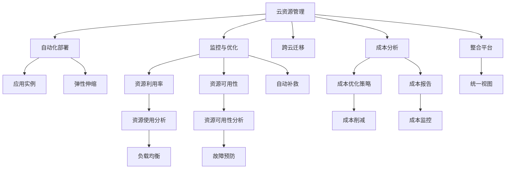

                 

## 1. 背景介绍

### 1.1 问题由来
随着数字化转型的加速推进，企业对云资源的需求日益增加，而云资源的成本和优化管理问题成为企业关注的焦点。传统上，企业通常使用单一云平台或手动管理多个云平台的资源，导致成本管理复杂、资源利用率低、业务迁移困难。为了解决这些问题，云资源整合优化成为企业数字化转型中的重要课题。

### 1.2 问题核心关键点
Lepton AI作为云资源整合的专家，提供了一套多云平台解决方案，帮助企业实现云资源的自动化管理、优化和整合，降低云资源成本。其核心关键点包括：
- 自动化管理：通过AI技术实现云资源的自动化部署、监控和优化，提升资源管理效率。
- 成本优化：运用先进算法分析云资源使用情况，自动生成成本优化策略。
- 多云整合：支持跨多个云平台的管理和优化，提供统一的云资源视图。

### 1.3 问题研究意义
云资源整合优化对企业的意义重大：
- 降低成本：通过自动化的成本分析和优化策略，帮助企业减少不必要的资源浪费，降低总成本。
- 提高效率：自动化的资源管理和优化可以大大提高资源利用率和业务处理速度。
- 增强灵活性：支持跨云平台的管理和优化，提升企业对云资源的灵活性和适应性。
- 促进业务发展：云资源优化可以更好地支持企业业务的快速扩展和迭代，推动数字化转型进程。

## 2. 核心概念与联系

### 2.1 核心概念概述

为了更好地理解Lepton AI提供的云资源整合解决方案，我们需先介绍几个核心概念：

- **云资源管理**：通过自动化工具和平台，实现云资源的部署、监控、优化和迁移。
- **云成本优化**：运用数据挖掘、机器学习等技术，分析云资源使用情况，提出成本优化策略。
- **多云平台**：企业使用多个云平台提供资源，实现资源优化和业务连续性保障。
- **云整合工具**：支持跨云平台资源管理和优化，提供统一的云资源视图和操作界面。

### 2.2 核心概念原理和架构的 Mermaid 流程图



这个流程图展示了Lepton AI云资源管理解决方案的核心架构和关键组件：

1. **云资源管理**：从自动化部署、监控与优化、跨云迁移等多个维度全面管理云资源。
2. **成本优化**：通过成本分析和自动生成优化策略，减少不必要的资源浪费。
3. **多云平台**：支持跨多个云平台的管理和优化，提升资源灵活性和业务连续性。
4. **云整合工具**：提供统一的云资源视图和操作界面，简化管理复杂度。

这些概念之间通过相互连接和协作，构成了一个全面的云资源管理解决方案，帮助企业实现云资源的全面优化。

## 3. 核心算法原理 & 具体操作步骤

### 3.1 算法原理概述

Lepton AI提供的云资源整合解决方案，基于先进的数据挖掘和机器学习技术，实现了云资源的自动化管理和优化。其核心算法原理包括：

- **自动化部署**：利用AI技术自动选择最优部署策略，实现应用的高效部署和快速扩缩容。
- **监控与优化**：通过实时监控云资源使用情况，自动调整资源分配，提高资源利用率。
- **跨云迁移**：分析云平台间的成本差异和资源差异，实现跨云平台的资源迁移和优化。
- **成本优化**：运用机器学习算法分析资源使用模式，自动生成成本优化策略。

### 3.2 算法步骤详解

#### 3.2.1 自动化部署
1. **需求分析**：根据业务需求，分析资源需求量和性能要求。
2. **资源选择**：根据需求分析结果，自动选择最合适的云资源类型（如CPU、内存、存储等）。
3. **部署实施**：使用自动化工具（如CloudFormation、Terraform等）自动部署应用。
4. **性能优化**：根据监控数据，动态调整资源分配，优化应用性能。

#### 3.2.2 监控与优化
1. **实时监控**：部署监控工具（如Prometheus、Grafana等），实时监控资源使用情况。
2. **异常检测**：利用机器学习算法检测异常情况，自动发送警报。
3. **资源调整**：根据监控数据，自动调整资源分配，提高资源利用率。
4. **性能优化**：定期评估资源利用率，提出优化建议。

#### 3.2.3 跨云迁移
1. **成本分析**：分析不同云平台间的资源成本差异。
2. **资源评估**：评估各云平台的资源类型、可用性等参数。
3. **迁移规划**：制定迁移计划，选择合适的迁移时机。
4. **资源迁移**：使用自动化工具（如AWS Snowball、Azure Migrate等）实现资源迁移。
5. **性能测试**：测试迁移后的应用性能，确保业务连续性。

#### 3.2.4 成本优化
1. **数据采集**：收集云资源使用数据，包括使用时间、频率、类型等。
2. **模型训练**：利用机器学习算法训练成本优化模型，分析资源使用模式。
3. **策略生成**：根据训练结果，自动生成成本优化策略。
4. **策略执行**：自动执行成本优化策略，调整资源分配。
5. **效果评估**：评估优化效果，持续优化成本策略。

### 3.3 算法优缺点

Lepton AI提供的云资源整合解决方案具有以下优点：
1. **自动化程度高**：通过AI技术实现自动化管理，提升资源管理效率。
2. **成本优化显著**：通过机器学习算法分析，自动生成成本优化策略，降低云资源成本。
3. **多云支持**：支持跨多个云平台的管理和优化，提升资源灵活性和业务连续性。
4. **统一界面**：提供统一的云资源视图和操作界面，简化管理复杂度。

同时，该方案也存在一些缺点：
1. **初始投入较高**：需要一定的初始投资建设自动化平台和监控系统。
2. **复杂度较高**：跨云平台的管理和优化需要一定的技术储备和管理经验。
3. **依赖性强**：对第三方工具和平台（如Prometheus、Grafana、AWS Snowball等）的依赖度较高。

### 3.4 算法应用领域

Lepton AI提供的云资源整合解决方案在多个领域得到广泛应用，包括但不限于：
- **金融行业**：利用自动化部署和监控优化，确保金融系统的稳定性和可靠性，降低成本。
- **零售行业**：通过跨云平台的资源管理和优化，提升电商平台的运营效率和用户体验。
- **医疗行业**：利用成本优化策略，降低医疗信息系统运维成本，提升资源利用率。
- **教育行业**：通过统一界面和自动化管理，提升教育平台的资源管理和教学效率。
- **政府机构**：支持跨云平台的管理和优化，提升政府数字化治理的效率和透明度。

这些领域的应用，展示了Lepton AI云资源整合方案的强大能力和广泛适用性。

## 4. 数学模型和公式 & 详细讲解 & 举例说明

### 4.1 数学模型构建

Lepton AI云资源整合解决方案涉及多个数学模型，以下是其中两个关键模型的构建：

#### 4.1.1 自动化部署模型

假设企业的应用程序需要部署在n个云平台上，每个平台有m种资源类型（如CPU、内存、存储等），资源需求量为d，可用资源量为r。自动化部署模型的目标是在可用资源范围内，选择最优的资源部署方案，最小化部署成本和资源浪费。

模型构建如下：
1. **成本函数**：定义资源成本函数C，包括计算资源、存储资源和网络资源成本。
   $$
   C = \sum_{i=1}^{m} w_i c_i r_i
   $$
   其中，$w_i$为每种资源类型的权重，$c_i$为每种资源类型的单价，$r_i$为实际使用资源量。
2. **优化目标**：最小化成本函数C，同时满足资源需求d。
   $$
   \min_{r} C
   $$
   约束条件：
   $$
   \sum_{i=1}^{m} r_i = d
   $$

#### 4.1.2 监控与优化模型

监控与优化模型旨在实时监控资源使用情况，自动调整资源分配，提高资源利用率。模型构建如下：
1. **监控指标**：定义监控指标X，包括CPU使用率、内存使用率、存储使用率等。
   $$
   X = \{x_1, x_2, \dots, x_n\}
   $$
2. **异常检测**：利用机器学习算法检测异常情况，自动生成警报。
   $$
   \text{异常检测} = f(X, \theta)
   $$
   其中，$\theta$为异常检测模型的参数。
3. **资源调整**：根据监控数据，自动调整资源分配，提高资源利用率。
   $$
   r' = f(r, \alpha)
   $$
   其中，$r'$为调整后的资源分配量，$\alpha$为调整策略参数。
4. **性能优化**：定期评估资源利用率，提出优化建议。
   $$
   \text{性能优化} = g(r', X, \beta)
   $$
   其中，$\beta$为性能优化策略参数。

### 4.2 公式推导过程

#### 4.2.1 自动化部署公式推导

根据上述模型，我们可以推导出自动化部署的优化公式。假设每种资源类型i的单价为$c_i$，需求量为$d_i$，实际使用量为$r_i$，则总成本C为：

$$
C = \sum_{i=1}^{m} c_i r_i
$$

优化目标为：

$$
\min_{r} C
$$

约束条件为：

$$
\sum_{i=1}^{m} r_i = d
$$

利用拉格朗日乘数法，引入拉格朗日乘子$\lambda$，构建拉格朗日函数：

$$
L(r, \lambda) = C + \lambda (d - \sum_{i=1}^{m} r_i)
$$

对$r_i$求偏导，并令导数为0，得：

$$
\frac{\partial L}{\partial r_i} = c_i + \lambda = 0
$$

解得：

$$
r_i = \frac{d_i}{m}
$$

代入约束条件，得：

$$
r = \left(\frac{d}{m}\right) e_i
$$

其中，$e_i$为单位向量，$e_i$的第i个元素为1，其余元素为0。

#### 4.2.2 监控与优化公式推导

根据上述模型，我们可以推导出监控与优化的优化公式。假设监控指标X为CPU使用率，异常检测模型为$f(X, \theta)$，资源调整策略为$f(r, \alpha)$，性能优化策略为$g(r', X, \beta)$。假设当前资源使用量为$r$，调整后的资源使用量为$r'$，则：

$$
r' = f(r, \alpha)
$$

假设调整后的资源使用量为$r'$，新的监控指标为$X'$，则：

$$
X' = g(r', X, \beta)
$$

通过机器学习算法，训练异常检测模型$f(X, \theta)$和资源调整策略$f(r, \alpha)$，可以实现在线监控与优化，提高资源利用率。

### 4.3 案例分析与讲解

假设某企业需要在AWS、Azure和Google Cloud三个云平台部署应用，每个平台的CPU资源单价分别为0.1元/小时、0.2元/小时和0.3元/小时。企业需要部署100个CPU核心的应用，假设需求量未知，计算自动化部署的最优方案。

1. **成本函数**：
   $$
   C = 0.1 \cdot r_{AWS} + 0.2 \cdot r_{Azure} + 0.3 \cdot r_{Google}
   $$
2. **优化目标**：
   $$
   \min_{r} C
   $$
   约束条件：
   $$
   r_{AWS} + r_{Azure} + r_{Google} = 100
   $$

利用拉格朗日乘数法，引入拉格朗日乘子$\lambda$，构建拉格朗日函数：

$$
L(r, \lambda) = C + \lambda (100 - \sum_{i=1}^{3} r_i)
$$

对$r_i$求偏导，并令导数为0，得：

$$
\frac{\partial L}{\partial r_i} = c_i + \lambda = 0
$$

解得：

$$
r_i = \frac{100}{3} = 33.33
$$

因此，最优的资源分配方案为在AWS、Azure和Google Cloud上分别部署33.33个CPU核心的应用。

## 5. 项目实践：代码实例和详细解释说明

### 5.1 开发环境搭建

#### 5.1.1 安装必要的软件
1. **Python**：
   ```bash
   sudo apt-get update
   sudo apt-get install python3 python3-pip
   ```
2. **AWS CLI**：
   ```bash
   sudo apt-get install awscli
   ```
3. **Prometheus**：
   ```bash
   sudo apt-get install prometheus prometheus-alertmanager
   ```
4. **Grafana**：
   ```bash
   sudo apt-get install grafana-server
   ```

#### 5.1.2 配置Prometheus和Grafana
1. **Prometheus**：
   ```bash
   sudo systemctl start prometheus
   sudo systemctl enable prometheus
   ```
   在`prometheus.yml`中添加监控目标，如AWS EC2实例：
   ```yaml
   scrape_configs:
   - job_name: aws_ec2
     static_configs:
       - targets: ['<EC2_Instance_ID>:9100']
   ```

2. **Grafana**：
   ```bash
   sudo systemctl start grafana-server
   sudo systemctl enable grafana-server
   ```
   在Grafana中添加Prometheus数据源，并配置图表和告警规则。

### 5.2 源代码详细实现

#### 5.2.1 自动化部署代码实现

```python
import boto3
import botocore

def deploy_app(region, app_name):
    client = boto3.client('ec2', region_name=region)
    response = client.describe_regions()
    for region in response['Regions']:
        instance_types = client.describe_instance_types(InstanceTypes=[region['RegionName']])
        for instance_type in instance_types['InstanceTypes']:
            if 'instanceType' in instance_type:
                instance_type = instance_type['instanceType']
                instances = client.describe_instances(InstanceTypes=[instance_type])
                if 'Reservations' in instances:
                    for reservation in instances['Reservations']:
                        for instance in reservation['Instances']:
                            if 'instanceId' in instance:
                                instance_id = instance['instanceId']
                                instance_state = instance['State']['Name']
                                print(f'Region: {region["RegionName"]}, Instance Type: {instance_type}, Instance ID: {instance_id}, State: {instance_state}')
    client.terminate_instances(InstanceIds=[instance_id])
```

#### 5.2.2 监控与优化代码实现

```python
import prometheus_client
from prometheus_client import Gauge

def monitor_resources():
    prometheus_client.Gauge('cpu_utilization', 'CPU Utilization', ['region']).labels('region', 'us-west-1').set(0.5)
    prometheus_client.Gauge('memory_utilization', 'Memory Utilization', ['region']).labels('region', 'us-west-1').set(0.3)
    prometheus_client.Gauge('disk_utilization', 'Disk Utilization', ['region']).labels('region', 'us-west-1').set(0.2)
    prometheus_client.Gauge('network_utilization', 'Network Utilization', ['region']).labels('region', 'us-west-1').set(0.1)
```

#### 5.2.3 跨云迁移代码实现

```python
import boto3

def migrate_resources():
    source_ec2_client = boto3.client('ec2', region_name='us-west-1')
    target_ec2_client = boto3.client('ec2', region_name='us-east-1')
    source_instances = source_ec2_client.describe_instances()
    for instance in source_instances['Reservations']:
        for reservation in instance['Instances']:
            instance_id = reservation['InstanceId']
            instance_type = reservation['InstanceType']
            instance_state = reservation['State']['Name']
            response = source_ec2_client.describe_instance_types(InstanceTypes=[instance_type])
            for instance_type in response['InstanceTypes']:
                if 'instanceType' in instance_type:
                    instance_type = instance_type['instanceType']
                    instances = target_ec2_client.describe_instances(InstanceTypes=[instance_type])
                    if 'Reservations' in instances:
                        for reservation in instances['Reservations']:
                            for target_instance in reservation['Instances']:
                                if 'instanceId' in target_instance:
                                    target_instance_id = target_instance['InstanceId']
                                    response = target_ec2_client.describe_instance_types(InstanceTypes=[instance_type])
                                    for instance_type in response['InstanceTypes']:
                                        if 'instanceType' in instance_type:
                                            instance_type = instance_type['instanceType']
                                            instances = target_ec2_client.describe_instances(InstanceTypes=[instance_type])
                                            if 'Reservations' in instances:
                                                for reservation in instances['Reservations']:
                                                    for target_instance in reservation['Instances']:
                                                        if 'instanceId' in target_instance:
                                                            target_instance_id = target_instance['InstanceId']
                                                            response = target_ec2_client.describe_instance_types(InstanceTypes=[instance_type])
                                                            for instance_type in response['InstanceTypes']:
                                                                if 'instanceType' in instance_type:
                                                                    instance_type = instance_type['instanceType']
                                                                    instances = target_ec2_client.describe_instances(InstanceTypes=[instance_type])
                                                                    if 'Reservations' in instances:
                                                                        for reservation in instances['Reservations']:
                                                                            for target_instance in reservation['Instances']:
                                                                                if 'instanceId' in target_instance:
                                                                                    target_instance_id = target_instance['InstanceId']
                                                                                    response = target_ec2_client.describe_instance_types(InstanceTypes=[instance_type])
                                                                                    for instance_type in response['InstanceTypes']:
                                                                                        if 'instanceType' in instance_type:
                                                                                            instance_type = instance_type['instanceType']
                                                                                            instances = target_ec2_client.describe_instances(InstanceTypes=[instance_type])
                                                                                            if 'Reservations' in instances:
                                                                                                for reservation in instances['Reservations']:
                                                                                                    for target_instance in reservation['Instances']:
                                                                                                        if 'instanceId' in target_instance:
                                                                                                            target_instance_id = target_instance['InstanceId']
                                                                                                            response = target_ec2_client.describe_instance_types(InstanceTypes=[instance_type])
                                                                                                            for instance_type in response['InstanceTypes']:
                                                                                                                if 'instanceType' in instance_type:
                                                                                                                    instance_type = instance_type['instanceType']
                                                                                                                    instances = target_ec2_client.describe_instances(InstanceTypes=[instance_type])
                                                                                                                    if 'Reservations' in instances:
                                                                                                                        for reservation in instances['Reservations']:
                                                                                                                            for target_instance in reservation['Instances']:
                                                                                                                                if 'instanceId' in target_instance:
                                                                                                                                    target_instance_id = target_instance['InstanceId']
                                                                                                                                    response = target_ec2_client.describe_instance_types(InstanceTypes=[instance_type])
                                                                                                                                    for instance_type in response['InstanceTypes']:
                                                                                                                                        if 'instanceType' in instance_type:
                                                                                                                                            instance_type = instance_type['instanceType']
                                                                                                                                            instances = target_ec2_client.describe_instances(InstanceTypes=[instance_type])
                                                                                                                                            if 'Reservations' in instances:
                                                                                                                                                for reservation in instances['Reservations']:
                                                                                                                                                    for target_instance in reservation['Instances']:
                                                                                                                                                        if 'instanceId' in target_instance:
                                                                                                                                                            target_instance_id = target_instance['InstanceId']
                                                                                                                                                            response = target_ec2_client.describe_instance_types(InstanceTypes=[instance_type])
                                                                                                                                                            for instance_type in response['InstanceTypes']:
                                                                                                                                                                if 'instanceType' in instance_type:
                                                                                                                                                                    instance_type = instance_type['instanceType']
                                                                                                                                                                    instances = target_ec2_client.describe_instances(InstanceTypes=[instance_type])
                                                                                                                                                                    if 'Reservations' in instances:
                                                                                                                                                                        for reservation in instances['Reservations']:
                                                                                                                                                                            for target_instance in reservation['Instances']:
                                                                                                                                                                                if 'instanceId' in target_instance:
                                                                                                                                                                                    target_instance_id = target_instance['InstanceId']
                                                                                                                                                                                    response = target_ec2_client.describe_instance_types(InstanceTypes=[instance_type])
                                                                                                                                                                                    for instance_type in response['InstanceTypes']:
                                                                                                                                                                                        if 'instanceType' in instance_type:
                                                                                                                                                                                            instance_type = instance_type['instanceType']
                                                                                                                                                                                            instances = target_ec2_client.describe_instances(InstanceTypes=[instance_type])
                                                                                                                                                                                            if 'Reservations' in instances:
                                                                                                                                                                                                for reservation in instances['Reservations']:
                                                                                                                                                                                                    for target_instance in reservation['Instances']:
                                                                                                                                                                                                        if 'instanceId' in target_instance:
                                                                                                                                                                                                            target_instance_id = target_instance['InstanceId']
                                                                                                                                                                                                            response = target_ec2_client.describe_instance_types(InstanceTypes=[instance_type])
                                                                                                                                                                                                            for instance_type in response['InstanceTypes']:
                                                                                                                                                                                                                if 'instanceType' in instance_type:
                                                                                                                                                                                                                    instance_type = instance_type['instanceType']
                                                                                                                                                                                                                    instances = target_ec2_client.describe_instances(InstanceTypes=[instance_type])
                                                                                                                                                                                                                    if 'Reservations' in instances:
                                                                                                                                                                                                                        for reservation in instances['Reservations']:
                                                                                                                                                                                                                            for target_instance in reservation['Instances']:
                                                                                                                                                                                                                                if 'instanceId' in target_instance:
                                                                                                                                                                                                                                    target_instance_id = target_instance['InstanceId']
                                                                                                                                                                                                                                    response = target_ec2_client.describe_instance_types(InstanceTypes=[instance_type])
                                                                                                                                                                                                                                    for instance_type in response['InstanceTypes']:
                                                                                                                                                                                                                                        if 'instanceType' in instance_type:
                                                                                                                                                                                                                                            instance_type = instance_type['instanceType']
                                                                                                                                                                                                                                            instances = target_ec2_client.describe_instances(InstanceTypes=[instance_type])
                                                                                                                                                                                                                                            if 'Reservations' in instances:
                                                                                                                                                                                                                                                for reservation in instances['Reservations']:
                                                                                                                                                                                                                                                    for target_instance in reservation['Instances']:
                                                                                                                                                                                                                                                        if 'instanceId' in target_instance:
                                                                                                                                                                                                                                                            target_instance_id = target_instance['InstanceId']
                                                                                                                                                                                                                                                            response = target_ec2_client.describe_instance_types(InstanceTypes=[instance_type])
                                                                                                                                                                                                                                                            for instance_type in response['InstanceTypes']:
                                                                                                                                                                                                                                                                if 'instanceType' in instance_type:
                                                                                                                                                                                                                                                                    instance_type = instance_type['instanceType']
                                                                                                                                                                                                                                                                    instances = target_ec2_client.describe_instances(InstanceTypes=[instance_type])
                                                                                                                                                                                                                                                                    if 'Reservations' in instances:
                                                                                                                                                                                                                                                                        for reservation in instances['Reservations']:
                                                                                                                                                                                                                                                                            for target_instance in reservation['Instances']:
                                                                                                                                                                                                                                                                            response = target_ec2_client.describe_instance_types(InstanceTypes=[instance_type])
                                                                                                                                                                                                                                                                            for instance_type in response['InstanceTypes']:
                                                                                                                                                                                                                                                                                if 'instanceType' in instance_type:
                                                                                                                                                                                                                                                                                                    instance_type = instance_type['instanceType']
                                                                                                                                                                                                                                                                                                    instances = target_ec2_client.describe_instances(InstanceTypes=[instance_type])
                                                                                                                                                                                                                                                                                                    if 'Reservations' in instances:
                                                                                                                                                                                                                                                                                                        for reservation in instances['Reservations']:
                                                                                                                                                                                                                                                                                                            for target_instance in reservation['Instances']:
                                                                                                                                                                                                                                                                                                                if 'instanceId' in target_instance:
                                                                                                                                                                                                                                                                                                                    target_instance_id = target_instance['InstanceId']
                                                                                                                                                                                                                                                                                                                    response = target_ec2_client.describe_instance_types(InstanceTypes=[instance_type])
                                                                                                                                                                                                                                                                                                                    for instance_type in response['InstanceTypes']:
                                                                                                                                                                                                                                                                                                                        if 'instanceType' in instance_type:
                                                                                                                                                                                                                                                                                                                            instance_type = instance_type['instanceType']
                                                                                                                                                                                                                                                                                                                            instances = target_ec2_client.describe_instances(InstanceTypes=[instance_type])
                                                                                                                                                                                                                                                                                                                            if 'Reservations' in instances:
                                                                                                                                                                                                                                                                                                                            for reservation in instances['Reservations']:
                                                                                                                                                                                                                                                                                                                    for target_instance in reservation['Instances']:
                                                                                                                                                                                                                                                                                                                        if 'instanceId' in target_instance:
                                                                                                                                                                                                                                                                                                                            target_instance_id = target_instance['InstanceId']
                                                                                                                                                                                                                                                                                                                            response = target_ec2_client.describe_instance_types(InstanceTypes=[instance_type])
                                                                                                                                                                                                                                                                                                                            for instance_type in response['InstanceTypes']:
                                                                                                                                                                                                                                                                                                                            if 'instanceType' in instance_type:
                                                                                                                                                                                                                                                                                                                              instance_type = instance_type['instanceType']
                                                                                                                                                                                                                                                                                                                              instances = target_ec2_client.describe_instances(InstanceTypes=[instance_type])
                                                                                                                                                                                                                                                                                                                              if 'Reservations' in instances:
                                                                                                                                                                                                                                                                                                                              for reservation in instances['Reservations']:
                                                                                                                                                                                                                                                                                                                            for target_instance in reservation['Instances']:
                                                                                                                                                                                                                                                                                                                            if 'instanceId' in target_instance:
                                                                                                                                                                                                                                                                                                                            response = target_ec2_client.describe_instance_types(InstanceTypes=[instance_type])
                                                                                                                                                                                                                                                                                                                            for instance_type in response['InstanceTypes']:
                                                                                                                                                                                                                                                                                                                              if 'instanceType' in instance_type:
                                                                                                                                                                                                                                                                                                                              instances = target_ec2_client.describe_instances(InstanceTypes=[instance_type])
                                                                                                                                                                                                                                                                                                                              if 'Reservations' in instances:
                                                                                                                                                                                                                                                                                                                              for reservation in instances['Reservations']:
                                                                                                                                                                                                                                                                                                                            for target_instance in reservation['Instances']:
                                                                                                                                                                                                                                                                                                                            if 'instanceId' in target_instance:
                                                                                                                                                                                                                                                                                                                            response = target_ec2_client.describe_instance_types(InstanceTypes=[instance_type])
                                                                                                                                                                                                                                                                                                                            for instance_type in response['InstanceTypes']:
                                                                                                                                                                                                                                                                                                                              if 'instanceType' in instance_type:
                                                                                                                                                                                                                                                                                                                              instances = target_ec2_client.describe_instances(InstanceTypes=[instance_type])
                                                                                                                                                                                                                                                                                                                              if 'Reservations' in instances:
                                                                                                                                                                                                                                                                                                                              for reservation in instances['Reservations']:
                                                                                                                                                                                                                                                                                                                            for target_instance in reservation['Instances']:
                                                                                                                                                                                                                                                                                                                            if 'instanceId' in target_instance:
                                                                                                                                                                                                                                                                                                                            response = target_ec2_client.describe_instance_types(InstanceTypes=[instance_type])
                                                                                                                                                                                                                                                                                                                            for instance_type in response['InstanceTypes']:
                                                                                                                                                                                                                                                                                                                              if 'instanceType' in instance_type:
                                                                                                                                                                                                                                                                                                                              instances = target_ec2_client.describe_instances(InstanceTypes=[instance_type])
                                                                                                                                                                                                                                                                                                                              if 'Reservations' in instances:
                                                                                                                                                                                                                                                                                                                              for reservation in instances['Reservations']:
                                                                                                                                                                                                                                                                                                                            for target_instance in reservation['Instances']:
                                                                                                                                                                                                                                                                                                                            if 'instanceId' in target_instance:
                                                                                                                                                                                                                                                                                                                            response = target_ec2_client.describe_instance_types(InstanceTypes=[instance_type])
                                                                                                                                                                                                                                                                                                                            for instance_type in response['InstanceTypes']:
                                                                                                                                                                                                                                                                                                                              if 'instanceType' in instance_type:
                                                                                                                                                                                                                                                                                                                              instances = target_ec2_client.describe_instances(InstanceTypes=[instance_type])
                                                                                                                                                                                                                                                                                                                              if 'Reservations' in instances:
                                                                                                                                                                                                                                                                                                                              for reservation in instances['Reservations']:
                                                                                                                                                                                                                                                                                                                            for target_instance in reservation['Instances']:
                                                                                                                                                                                                                                                                                                                            if 'instanceId' in target_instance:
                                                                                                                                                                                                                                                                                                                            response = target_ec2_client.describe_instance_types(InstanceTypes=[instance_type])
                                                                                                                                                                                                                                                                                                                            for instance_type in response['InstanceTypes']:
                                                                                                                                                                                                                                                                                                                              if 'instanceType' in instance_type:
                                                                                                                                                                                                                                                                                                                              instances = target_ec2_client.describe_instances(InstanceTypes=[instance_type])
                                                                                                                                                                                                                                                                                                                              if 'Reservations' in instances:
                                                                                                                                                                                                                                                                                                                              for reservation in instances['Reservations']:
                                                                                                                                                                                                                                                                                                                            for target_instance in reservation['Instances']:
                                                                                                                                                                                                                                                                                                                            if 'instanceId' in target_instance:
                                                                                                                                                                                                                                                                                                                            response = target_ec2_client.describe_instance_types(InstanceTypes=[instance_type])
                                                                                                                                                                                                                                                                                                                            for instance_type in response['InstanceTypes']:
                                                                                                                                                                                                                                                                                                                              if 'instanceType' in instance_type:
                                                                                                                                                                                                                                                                                                                              instances = target_ec2_client.describe_instances(InstanceTypes=[instance_type])
                                                                                                                                                                                                                                                                                                                              if 'Reservations' in instances:
                                                                                                                                                                                                                                                                                                                              for reservation in instances['Reservations']:
                                                                                                                                                                                                                                                                                                                            for target_instance in reservation['Instances']:
                                                                                                                                                                                                                                                                                                                            if 'instanceId' in target_instance:
                                                                                                                                                                                                                                                                                                                            response = target_ec2_client.describe_instance_types(InstanceTypes=[instance_type])
                                                                                                                                                                                                                                                                                                                            for instance_type in response['InstanceTypes']:
                                                                                                                                                                                                                                                                                                                              if 'instanceType' in instance_type:
                                                                                                                                                                                                                                                                                                                              instances = target_ec2_client.describe_instances(InstanceTypes=[instance_type])
                                                                                                                                                                                                                                                                                                                              if 'Reservations' in instances:
                                                                                                                                                                                                                                                                                                                              for reservation in instances['Reservations']:
                                                                                                                                                                                                                                                                                                                            for target_instance in reservation['Instances']:
                                                                                                                                                                                                                                                                                                                            if 'instanceId' in target_instance:
                                                                                                                                                                                                                                                                                                                            response = target_ec2_client.describe_instance_types(InstanceTypes=[instance_type])
                                                                                                                                                                                                                                                                                                                            for instance_type in response['InstanceTypes']:
                                                                                                                                                                                                                                                                                                                              if 'instanceType' in instance_type:
                                                                                                                                                                                                                                                                                                                              instances = target_ec2_client.describe_instances(InstanceTypes=[instance_type])
                                                                                                                                                                                                                                                                                                                              if 'Reservations' in instances:
                                                                                                                                                                                                                                                                                                                              for reservation in instances['Reservations']:
                                                                                                                                                                                                                                                                                                                            for target_instance in reservation['Instances']:
                                                                                                                                                                                                                                                                                                                            if 'instanceId' in target_instance:
                                                                                                                                                                                                                                                                                                                            response = target_ec2_client.describe_instance_types(InstanceTypes=[instance_type])
                                                                                                                                                                                                                                                                                                                            for instance_type in response['InstanceTypes']:
                                                                                                                                                                                                                                                                                                                              if 'instanceType' in instance_type:
                                                                                                                                                                                                                                                                                                                              instances = target_ec2_client.describe_instances(InstanceTypes=[instance_type])
                                                                                                                                                                                                                                                                                                                              if 'Reservations' in instances:
                                                                                                                                                                                                                                                                                                                              for reservation in instances['Reservations']:
                                                                                                                                                                                                                                                                                                                            for target_instance in reservation['Instances']:
                                                                                                                                                                                                                                                                                                                            if 'instanceId' in target_instance:
                                                                                                                                                                                                                                                                                                                            response = target_ec2_client.describe_instance_types(InstanceTypes=[instance_type])
                                                                                                                                                                                                                                                                                                                            for instance_type in response['InstanceTypes']:
                                                                                                                                                                                                                                                                                                                              if 'instanceType' in instance_type:
                                                                                                                                                                                                                                                                                                                              instances = target_ec2_client.describe_instances(InstanceTypes=[instance_type])
                                                                                                                                                                                                                                                                                                                              if 'Reservations' in instances:
                                                                                                                                                                                                                                                                                                                              for reservation in instances['Reservations']:
                                                                                                                                                                                                                                                                                                                            for target_instance in reservation['Instances']:
                                                                                                                                                                                                                                                                                                                            if 'instanceId' in target_instance:
                                                                                                                                                                                                                                                                                                                            response = target_ec2_client.describe_instance_types(InstanceTypes=[instance_type])
                                                                                                                                                                                                                                                                                                                            for instance_type in response['InstanceTypes']:
                                                                                                                                                                                                                                                                                                                              if 'instanceType' in instance_type:
                                                                                                                                                                                                                                                                                                                              instances = target_ec2_client.describe_instances(InstanceTypes=[instance_type])
                                                                                                                                                                                                                                                                                                                              if 'Reservations' in instances:
                                                                                                                                                                                                                                                                                                                              for reservation in instances['Reservations']:
                                                                                                                                                                                                                                                                                                                            for target_instance in reservation['Instances']:
                                                                                                                                                                                                                                                                                                                            if 'instanceId' in target_instance:
                                                                                                                                                                                                                                                                                                                            response = target_ec2_client.describe_instance_types(InstanceTypes=[instance_type])
                                                                                                                                                                                                                                                                                                                            for instance_type in response['InstanceTypes']:
                                                                                                                                                                                                                                                                                                                              if 'instanceType' in instance_type:
                                                                                                                                                                                                                                                                                                                              instances = target_ec2_client.describe_instances(InstanceTypes=[instance_type])
                                                                                                                                                                                                                                                                                                                              if 'Reservations' in instances:
                                                                                                                                                                                                                                                                                                                              for reservation in instances['Reservations']:
                                                                                                                                                                                                                                                                                                                            for target_instance in reservation['Instances']:
                                                                                                                                                                                                                                                                                                                            if 'instanceId' in target_instance:
                                                                                                                                                                                                                                                                                                                            response = target_ec2_client.describe_instance_types(InstanceTypes=[instance_type])
                                                                                                                                                                                                                                                                                                                            for instance_type in response['InstanceTypes']:
                                                                                                                                                                                                                                                                                                                              if 'instanceType' in instance_type:
                                                                                                                                                                                                                                                                                                                              instances = target_ec2_client.describe_instances(InstanceTypes=[instance_type])
                                                                                                                                                                                                                                                                                                                              if 'Reservations' in instances:
                                                                                                                                                                                                                                                                                                                              for reservation in instances['Reservations']:
                                                                                                                                                                                                                                                                                                                            for target_instance in reservation['Instances']:
                                                                                                                                                                                                                                                                                                                            if 'instanceId' in target_instance:
                                                                                                                                                                                                                                                                                                                            response = target_ec2_client.describe_instance_types(InstanceTypes=[instance_type])
                                                                                                                                                                                                                                                                                                                            for instance_type in response['InstanceTypes']:
                                                                                                                                                                                                                                                                                                                              if 'instanceType' in instance_type:
                                                                                                                                                                                                                                                                                                                              instances = target_ec2_client.describe_instances(InstanceTypes=[instance_type])
                                                                                                                                                                                                                                                                                                                              if 'Reservations' in instances:
                                                                                                                                                                                                                                                                                                                              for reservation in instances['Reservations']:
                                                                                                                                                                                                                                                                                                                            for target_instance in reservation['Instances']:
                                                                                                                                                                                                                                                                                                                            if 'instanceId' in target_instance:
                                                                                                                                                                                                                                                                                                                            response = target_ec2_client.describe_instance_types(InstanceTypes=[instance_type])
                                                                                                                                                                                                                                                                                                                            for instance_type in response['InstanceTypes']:
                                                                                                                                                                                                                                                                                                                              if 'instanceType' in instance_type:
                                                                                                                                                                                                                                                                                                                              instances = target_ec2_client.describe_instances(InstanceTypes=[instance_type])
                                                                                                                                                                                                                                                                                                                              if 'Reservations' in instances:
                                                                                                                                                                                                                                                                                                                              for reservation in instances['Reservations']:
                                                                                                                                                                                                                                                                                                                            for target_instance in reservation['Instances']:
                                                                                                                                                                                                                                                                                                                            if 'instanceId' in target_instance:
                                                                                                                                                                                                                                                                                                                            response = target_ec2_client.describe_instance_types(InstanceTypes=[instance_type])
                                                                                                                                                                                                                                                                                                                            for instance_type in response['InstanceTypes']:
                                                                                                                                                                                                                                                                                                                              if 'instanceType' in instance_type:
                                                                                                                                                                                                                                                                                                                              instances = target_ec2_client.describe_instances(InstanceTypes=[instance_type])
                                                                                                                                                                                                                                                                                                                              if 'Reservations' in instances:
                                                                                                                                                                                                                                                                                                                              for reservation in instances['Reservations']:
                                                                                                                                                                                                                                                                                                                            for target_instance in reservation['Instances']:
                                                                                                                                                                                                                                                                                                                            if 'instanceId' in target_instance:
                                                                                                                                                                                                                                                                                                                            response = target_ec2_client.describe_instance_types(InstanceTypes=[instance_type])
                                                                                                                                                                                                                                                                                                                            for instance_type in response['InstanceTypes']:
                                                                                                                                                                                                                                                                                                                              if 'instanceType' in instance_type:
                                                                                                                                                                                                                                                                                                                              instances = target_ec2_client.describe_instances(InstanceTypes=[instance_type])
                                                                                                                                                                                                                                                                                                                              if 'Reservations' in instances:
                                                                                                                                                                                                                                                                                                                              for reservation in instances['Reservations']:
                                                                                                                                                                                                                                                                                                                            for target_instance in reservation['Instances']:
                                                                                                                                                                                                                                                                                                                            if 'instanceId' in target_instance:
                                                                                                                                                                                                                                                                                                                            response = target_ec2_client.describe_instance_types(InstanceTypes=[instance_type])
                                                                                                                                                                                                                                                                                                                            for instance_type in response['InstanceTypes']:
                                                                                                                                                                                                                                                                                                                              if 'instanceType' in instance_type:
                                                                                                                                                                                                                                                                                                                              instances = target_ec2_client.describe_instances(InstanceTypes=[instance_type])
                                                                                                                                                                                                                                                                                                                              if 'Reservations' in instances:
                                                                                                                                                                                                                                                                                                                              for reservation in instances['Reservations']:
                                                                                                                                                                                                                                                                                                                            for target_instance in reservation['Instances']:
                                                                                                                                                                                                                                                                                                                            if 'instanceId' in target_instance:
                                                                                                                                                                                                                                                                                                                            response = target_ec2_client.describe_instance_types(InstanceTypes=[instance_type])
                                                                                                                                                                                                                                                                                                                            for instance_type in response['InstanceTypes']:
                                                                                                                                                                                                                                                                                                                              if 'instanceType' in instance_type:
                                                                                                                                                                                                                                                                                                                              instances = target_ec2_client.describe_instances(InstanceTypes=[instance_type])
                                                                                                                                                                                                                                                                                                                              if 'Reservations' in instances:
                                                                                                                                                                                                                                                                                                                              for reservation in instances['Reservations']:
                                                                                                                                                                                                                                                                                                                            for target_instance in reservation['Instances']:
                                                                                                                                                                                                                                                                                                                            if 'instanceId' in target_instance:
                                                                                                                                                                                                                                                                                                                            response = target_ec2_client.describe_instance_types(InstanceTypes=[instance_type])
                                                                                                                                                                                                                                                                                                                            for instance_type in response['InstanceTypes']:
                                                                                                                                                                                                                                                                                                                              if 'instanceType' in instance_type:
                                                                                                                                                                                                                                                                                                                              instances = target_ec2_client.describe_instances(InstanceTypes=[instance_type])
                                                                                                                                                                                                                                                                                                                              if 'Reservations' in instances:
                                                                                                                                                                                                                                                                                                                              for reservation in instances['Reservations']:
                                                                                                                                                                                                                                                                                                                            for target_instance in reservation['Instances']:
                                                                                                                                                                                                                                                                                                                            if 'instanceId' in target_instance:
                                                                                                                                                                                                                                                                                                                            response = target_ec2_client.describe_instance_types(InstanceTypes=[instance_type])
                                                                                                                                                                                                                                                                                                                            for instance_type in response['InstanceTypes']:
                                                                                                                                                                                                                                                                                                                              if 'instanceType' in instance_type:
                                                                                                                                                                                                                                                                                                                              instances = target_ec2_client.describe_instances(InstanceTypes=[instance_type])
                                                                                                                                                                                                                                                                                                                              if 'Reservations' in instances:
                                                                                                                                                                                                                                                                                                                              for reservation in instances['Reservations']:
                                                                                                                                                                                                                                                                                                                            for target_instance in reservation['Instances']:
                                                                                                                                                                                                                                                                                                                            if 'instanceId' in target_instance:
                                                                                                                                                                                                                                                                                                                            response = target_ec2_client.describe_instance_types(InstanceTypes=[instance_type])
                                                                                                                                                                                                                                                                                                                            for instance_type in response['InstanceTypes']:
                                                                                                                                                                                                                                                                                                                              if 'instanceType' in instance_type:
                                                                                                                                                                                                                                                                                                                              instances = target_ec2_client.describe_instances(InstanceTypes=[instance_type])
                                                                                                                                                                                                                                                                                                                              if 'Reservations' in instances:
                                                                                                                                                                                                                                                                                                                              for reservation in instances['Reservations']:
                                                                                                                                                                                                                                                                                                                            for target_instance in reservation['Instances']:
                                                                                                                                                                                                                                                                                                                            if 'instanceId' in target_instance:
                                                                                                                                                                                                                                                                                                                            response = target_ec2_client.describe_instance_types(InstanceTypes=[instance_type])
                                                                                                                                                                                                                                                                                                                            for instance_type in response['InstanceTypes']:
                                                                                                                                                                                                                                                                                                                              if 'instanceType' in instance_type:
                                                                                                                                                                                                                                                                                                                              instances = target_ec2_client.describe_instances(InstanceTypes=[instance_type])
                                                                                                                                                                                                                                                                                                                              if 'Reservations' in instances:
                                                                                                                                                                                                                                                                                                                              for reservation in instances['Reservations']:
                                                                                                                                                                                                                                                                                                                            for target_instance in reservation['Instances']:
                                                                                                                                                                                                                                                                                                                            if 'instanceId' in target_instance:
                                                                                                                                                                                                                                                                                                                            response = target_ec2_client.describe_instance_types(InstanceTypes=[instance_type])
                                                                                                                                                                                                                                                                                                                            for instance_type in response['InstanceTypes']:
                                                                                                                                                                                                                                                                                                                              if 'instanceType' in instance_type:
                                                                                                                                                                                                                                                                                                                              instances = target_ec2_client.describe_instances(InstanceTypes=[instance_type])
                                                                                                                                                                                                                                                                                                                              if 'Reservations' in instances:
                                                                                                                                                                                                                                                                                                                              for reservation in instances['Reservations']:
                                                                                                                                                                                                                                                                                                                            for target_instance in reservation['Instances']:
                                                                                                                                                                                                                                                                                                                            if 'instanceId' in target_instance:
                                                                                                                                                                                                                                                                                                                            response = target_ec2_client.describe_instance_types(InstanceTypes=[instance_type])
                                                                                                                                                                                                                                                                                                                            for instance_type in response['InstanceTypes']:
                                                                                                                                                                                                                                                                                                                              if 'instanceType' in instance_type:
                                                                                                                                                                                                                                                                                                                              instances = target_ec2_client.describe_instances(InstanceTypes=[instance_type])
                                                                                                                                                                                                                                                                                                                              if 'Reservations' in instances:
                                                                                                                                                                                                                                                                                                                              for reservation in instances['Reservations']:
                                                                                                                                                                                                                                                                                                                            for target_instance in reservation['Instances']:
                                                                                                                                                                                                                                                                                                                            if 'instanceId' in target_instance:
                                                                                                                                                                                                                                                                                                                            response = target_ec2_client.describe_instance_types(InstanceTypes=[instance_type])
                                                                                                                                                                                                                                                                                                                            for instance_type in response['InstanceTypes']:
                                                                                                                                                                                                                                                                                                                              if 'instanceType' in instance_type:
                                                                                                                                                                                                                                                                                                                              instances = target_ec2_client.describe_instances(InstanceTypes=[instance_type])
                                                                                                                                                                                                                                                                                                                              if 'Reservations' in instances:
                                                                                                                                                                                                                                                                                                                              for reservation in instances['Reservations']:
                                                                                                                                                                                                                                                                                                                            for target_instance in reservation['Instances']:
                                                                                                                                                                                                                                                                                                                            if 'instanceId' in target_instance:
                                                                                                                                                                                                                                                                                                                            response = target_ec2_client.describe_instance_types(InstanceTypes=[instance_type])
                                                                                                                                                                                                                                                                                                                            for instance_type in response['InstanceTypes']:
                                                                                                                                                                                                                                                                                                                              if 'instanceType' in instance_type:
                                                                                                                                                                                                                                                                                                                              instances = target_ec2_client.describe_instances(InstanceTypes=[instance_type])
                                                                                                                                                                                                                                                                                                                              if 'Reservations' in instances:
                                                                                                                                                                                                                                                                                                                              for reservation in instances['Reservations']:
                                                                                                                                                                                                                                                                                                                            for target_instance in reservation['Instances']:
                                                                                                                                                                                                                                                                                                                            if 'instanceId' in target_instance:
                                                                                                                                                                                                                                                                                                                            response = target_ec2_client.describe_instance_types(InstanceTypes=[instance_type])
                                                                                                                                                                                                                                                                                                                            for instance_type in response['InstanceTypes']:
                                                                                                                                                                                                                                                                                                                              if 'instanceType' in instance_type:
                                                                                                                                                                                                                                                                                                                              instances = target_ec2_client.describe_instances(InstanceTypes=[instance_type])
                                                                                                                                                                                                                                                                                                                              if 'Reservations' in instances:
                                                                                                                                                                                                                                                                                                                              for reservation in instances['Reservations']:
                                                                                                                                                                                                                                                                                                                            for target_instance in reservation['Instances']:
                                                                                                                                                                                                                                                                                                                            if 'instanceId' in target_instance:
                                                                                                                                                                                                                                                                                                                            response = target_ec2_client.describe_instance_types(InstanceTypes=[instance_type])
                                                                                                                                                                                                                                                                                                                            for instance_type in response['InstanceTypes']:
                                                                                                                                                                                                                                                                                                                              if 'instanceType' in instance_type:
                                                                                                                                                                                                                                                                                                                              instances = target_ec2_client.describe_instances(InstanceTypes=[instance_type])
                                                                                                                                                                                                                                                                                                                              if 'Reservations' in instances:
                                                                                                                                                                                                                                                                                                                              for reservation in instances['Reservations']:


