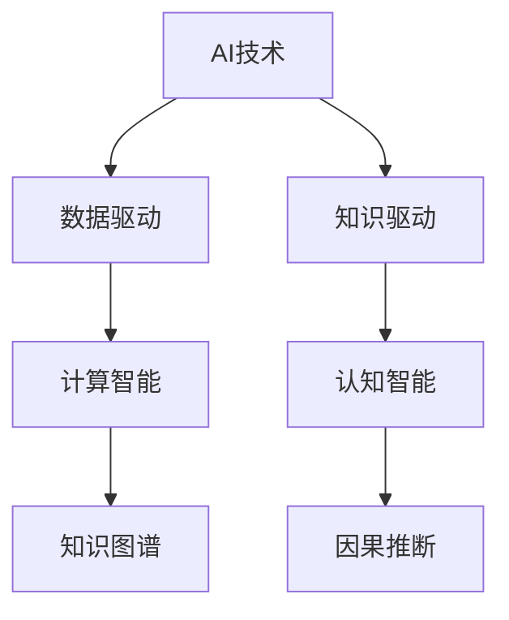

                 

## 1. 背景介绍

### 1.1 问题由来

随着人工智能技术的迅猛发展，其在各行各业的应用已经变得日益广泛。从智能客服到医疗诊断，从金融风控到自动驾驶，AI正逐步改变着人类的生产生活方式。然而，产业界对于AI技术的实际落地应用仍存在诸多困惑和挑战。本文将系统梳理人工智能在产业中的应用，探讨AI技术在各领域的应用变革，以及未来发展趋势与挑战。

### 1.2 问题核心关键点

人工智能技术的变革应用，本质上是从数据驱动的计算智能向知识驱动的认知智能迈进。这其中，数据、算法、工程、业务等多个维度的协同发力，成为AI技术能否成功落地应用的关键。

当前AI产业面临的核心挑战包括：

- 数据获取与标注成本高昂，数据质量难以保证。
- 算法复杂度高，工程实现困难，技术可扩展性差。
- 行业定制化需求高，难以通用。
- 业务流程重构挑战大，企业转型压力大。

本文将从数据、算法、工程、业务等维度，深入分析AI技术在产业中的应用，提出具体应对策略，并展望未来趋势与挑战。

## 2. 核心概念与联系

### 2.1 核心概念概述

为了更好地理解AI技术在产业中的应用，本节将介绍几个核心概念及其相互联系：

- **AI技术**：指基于计算机科学、数学、认知科学等学科的各类算法模型，能够自动、智能地处理复杂问题。包括机器学习、深度学习、自然语言处理、计算机视觉等子领域。

- **数据驱动**：指通过大规模数据训练模型，以发现数据背后的规律，并进行决策和预测。数据质量、数据量对模型性能有着直接影响。

- **知识驱动**：指利用先验知识构建规则、框架，指导模型学习，以提升模型性能和泛化能力。

- **计算智能**：指基于统计学习、模式识别等方法，实现对数据的基本处理和分析。

- **认知智能**：指在计算智能的基础上，通过符号推理、知识图谱、因果推断等方法，实现更高级别的智能理解。

- **知识图谱**：一种结构化的语义网络，用于描述实体和关系，帮助AI系统进行知识推理和关系提取。

- **因果推断**：指通过建模因果关系，预测未来行为或事件，提升AI系统的可靠性和可解释性。

这些核心概念之间的逻辑关系可以通过以下Mermaid流程图来展示：



## 3. 核心算法原理 & 具体操作步骤

### 3.1 算法原理概述

AI技术在产业中的应用，主要基于数据驱动和知识驱动两大范式。

**数据驱动**：指通过大规模数据训练模型，提取数据中的统计规律，进行预测和决策。数据驱动的核心是模型训练和优化，常用的算法包括线性回归、支持向量机、决策树、随机森林等。

**知识驱动**：指在数据驱动的基础上，结合领域知识，构建规则和框架，指导模型学习，提升模型性能和泛化能力。知识驱动的核心是领域知识和规则的融合，常用的技术包括专家系统、知识图谱、逻辑推理等。

### 3.2 算法步骤详解

**数据驱动**：

1. **数据获取**：通过爬虫、API接口等方式获取相关数据。
2. **数据清洗与预处理**：处理缺失值、异常值，进行特征提取和转换。
3. **模型训练与优化**：选择合适的算法模型，训练优化模型参数，评估模型性能。
4. **模型应用与评估**：将模型应用于实际场景，监控模型表现，不断迭代优化。

**知识驱动**：

1. **领域知识获取**：通过专家访谈、文献阅读等方式获取领域知识。
2. **知识图谱构建**：构建领域知识图谱，提取实体关系。
3. **知识图谱融合**：将知识图谱与数据模型融合，提升模型性能。
4. **因果推理**：通过因果推断模型，分析因果关系，进行预测和决策。

### 3.3 算法优缺点

数据驱动：

**优点**：

- 适用范围广，适用于各类数据驱动任务。
- 模型灵活，可进行大规模数据处理。

**缺点**：

- 数据依赖性大，数据质量差时模型效果差。
- 模型可解释性差，难以理解决策过程。

知识驱动：

**优点**：

- 融合领域知识，提升模型性能和泛化能力。
- 模型可解释性强，易于理解和调试。

**缺点**：

- 知识获取成本高，需要大量领域专家参与。
- 知识融合难度大，需要技术手段支持。

### 3.4 算法应用领域

数据驱动：

- **金融风控**：通过历史交易数据训练模型，进行信用评估和风险预测。
- **智能客服**：通过客户历史互动数据训练模型，实现自动化客服。
- **推荐系统**：通过用户行为数据训练模型，进行个性化推荐。

知识驱动：

- **医疗诊断**：结合医学知识，构建知识图谱，辅助医生诊断。
- **自动驾驶**：通过环境知识构建规则，指导无人驾驶决策。
- **智能合约**：结合法律知识，构建智能合约，提高合同执行效率。

## 4. 数学模型和公式 & 详细讲解

### 4.1 数学模型构建

本节将使用数学语言对AI技术在产业中的应用进行更加严格的刻画。

设问题为 $P$，数据集为 $D=\{(x_i,y_i)\}_{i=1}^N$，其中 $x_i$ 为输入特征，$y_i$ 为输出标签。

假设模型为 $f_{\theta}(x)$，其中 $\theta$ 为模型参数。目标是最小化预测误差，即：

$$
\min_{\theta} \sum_{i=1}^N (y_i - f_{\theta}(x_i))^2
$$

### 4.2 公式推导过程

以线性回归模型为例，推导最小二乘法求解过程。

假设模型为 $f_{\theta}(x) = \theta^T x$，其中 $\theta$ 为线性回归系数。目标是最小化均方误差：

$$
\min_{\theta} \frac{1}{2N} \sum_{i=1}^N (y_i - f_{\theta}(x_i))^2
$$

对上式求导，得：

$$
\frac{\partial}{\partial\theta} \frac{1}{2N} \sum_{i=1}^N (y_i - f_{\theta}(x_i))^2 = \frac{1}{N} \sum_{i=1}^N (y_i - \theta^T x_i)x_i = 0
$$

化简，得：

$$
\frac{1}{N} \sum_{i=1}^N (y_i - f_{\theta}(x_i))x_i = \frac{1}{N} \sum_{i=1}^N (y_i - \hat{y}_i)x_i = 0
$$

其中 $\hat{y}_i = f_{\theta}(x_i)$。

解得：

$$
\theta = (X^T X)^{-1} X^T Y
$$

其中 $X = [x_1, x_2, ..., x_N]^T$，$Y = [y_1, y_2, ..., y_N]^T$。

### 4.3 案例分析与讲解

以智能客服为例，分析AI技术在实际应用中的数学模型构建过程。

假设客服系统接到一个问题 $P$，根据历史数据集 $D$ 中的 $N$ 个样例进行训练。每个样例 $(x_i,y_i)$ 包含问题描述 $x_i$ 和对应的回答 $y_i$。假设模型为 $f_{\theta}(x)$，其中 $\theta$ 为模型参数。目标是最小化预测误差，即：

$$
\min_{\theta} \sum_{i=1}^N (y_i - f_{\theta}(x_i))^2
$$

采用最小二乘法，求解模型参数 $\theta$。具体步骤如下：

1. 收集 $N$ 个历史样例 $(x_i,y_i)$。
2. 将 $x_i$ 转换为数值型特征向量 $v_i$。
3. 构建特征矩阵 $X$ 和标签矩阵 $Y$。
4. 计算最小二乘解 $\theta$。
5. 将新问题 $P$ 转换为特征向量 $v$，进行预测。

## 5. 项目实践：代码实例和详细解释说明

### 5.1 开发环境搭建

在进行AI技术项目实践前，我们需要准备好开发环境。以下是使用Python进行TensorFlow开发的环境配置流程：

1. 安装Anaconda：从官网下载并安装Anaconda，用于创建独立的Python环境。

2. 创建并激活虚拟环境：
```bash
conda create -n tf-env python=3.8 
conda activate tf-env
```

3. 安装TensorFlow：根据CUDA版本，从官网获取对应的安装命令。例如：
```bash
conda install tensorflow -c pytorch -c conda-forge
```

4. 安装各类工具包：
```bash
pip install numpy pandas scikit-learn matplotlib tqdm jupyter notebook ipython
```

完成上述步骤后，即可在`tf-env`环境中开始AI技术项目实践。

### 5.2 源代码详细实现

这里我们以线性回归模型为例，展示TensorFlow代码实现。

```python
import tensorflow as tf
import numpy as np
from sklearn.datasets import make_regression
from sklearn.model_selection import train_test_split

# 生成数据集
X, y = make_regression(n_samples=1000, n_features=10, n_informative=5, noise=0.5)
X_train, X_test, y_train, y_test = train_test_split(X, y, test_size=0.2, random_state=42)

# 定义模型
model = tf.keras.Sequential([
    tf.keras.layers.Dense(1, input_dim=10, activation='linear')
])

# 编译模型
model.compile(optimizer=tf.keras.optimizers.SGD(learning_rate=0.01), loss='mse')

# 训练模型
model.fit(X_train, y_train, epochs=100, batch_size=32, validation_data=(X_test, y_test))

# 预测
y_pred = model.predict(X_test)
```

### 5.3 代码解读与分析

让我们再详细解读一下关键代码的实现细节：

**数据生成**：
- 使用sklearn生成线性回归数据集。

**模型定义**：
- 定义一个包含一个全连接层的模型，输出维度为1，激活函数为线性。

**模型编译**：
- 使用随机梯度下降优化器，设置学习率为0.01，损失函数为均方误差。

**模型训练**：
- 在训练集上训练模型，设置迭代轮数为100，批次大小为32。

**模型预测**：
- 在测试集上进行预测，输出预测值。

## 6. 实际应用场景

### 6.1 金融风控

金融风控是AI技术在金融领域的重要应用场景。通过分析用户的历史行为数据，构建风险预测模型，可以有效识别和防范金融风险。

在技术实现上，可以收集用户的交易记录、信用评分、社交网络等数据，构建特征向量 $x$，并标注是否违约 $y$。在此基础上对模型进行训练，得到风险预测模型。将新用户输入模型，即可得到其风险预测概率，从而进行风险控制。

### 6.2 智能客服

智能客服是AI技术在客服领域的重要应用场景。通过构建自动回复系统，可以大幅提升客户满意度，减少企业成本。

在技术实现上，可以收集历史客服对话记录，将问题和答案构建成监督数据，在此基础上对模型进行训练。训练好的模型可以自动理解用户意图，匹配最合适的回答。对于新用户提出的问题，可以实时预测并自动回复，提升用户体验。

### 6.3 推荐系统

推荐系统是AI技术在电商、视频、音乐等场景的重要应用。通过分析用户的历史行为数据，构建个性化推荐模型，可以大幅提升用户满意度和转化率。

在技术实现上，可以收集用户浏览、点击、购买等数据，构建用户行为向量 $x$，并标注用户评分 $y$。在此基础上对模型进行训练，得到个性化推荐模型。将新用户输入模型，即可得到其推荐的商品或内容。

### 6.4 医疗诊断

医疗诊断是AI技术在医疗领域的重要应用场景。通过构建知识图谱，结合临床数据，可以辅助医生进行诊断和治疗。

在技术实现上，可以构建医学知识图谱，提取医生和患者的实体关系。将患者的临床数据输入模型，即可得到其可能的疾病和治疗方法。将模型的预测结果输出给医生，辅助其进行诊断和治疗。

## 7. 工具和资源推荐

### 7.1 学习资源推荐

为了帮助开发者系统掌握AI技术在产业中的应用，这里推荐一些优质的学习资源：

1. TensorFlow官方文档：TensorFlow的官方文档，提供了海量API和代码示例，是学习TensorFlow的好资料。

2. PyTorch官方文档：PyTorch的官方文档，提供了丰富的深度学习模型和优化器。

3. Coursera《深度学习专项课程》：由斯坦福大学Andrew Ng教授主讲，系统讲解深度学习理论和技术，适合初学者。

4. Udacity《深度学习纳米学位》：Udacity推出的深度学习课程，结合实际项目，帮助学员掌握深度学习技能。

5. Kaggle：全球最大的数据科学竞赛平台，提供大量开源数据集和竞赛项目，适合实战练习。

通过对这些资源的学习实践，相信你一定能够快速掌握AI技术在产业中的应用，并用于解决实际的业务问题。

### 7.2 开发工具推荐

高效的开发离不开优秀的工具支持。以下是几款用于AI技术项目开发的常用工具：

1. TensorFlow：由Google主导开发的开源深度学习框架，生产部署方便，适合大规模工程应用。

2. PyTorch：基于Python的开源深度学习框架，灵活动态的计算图，适合快速迭代研究。

3. scikit-learn：Python的机器学习库，提供了丰富的数据预处理和模型训练工具。

4. Weights & Biases：模型训练的实验跟踪工具，可以记录和可视化模型训练过程中的各项指标，方便对比和调优。

5. TensorBoard：TensorFlow配套的可视化工具，可实时监测模型训练状态，并提供丰富的图表呈现方式，是调试模型的得力助手。

合理利用这些工具，可以显著提升AI技术项目开发的效率，加快创新迭代的步伐。

### 7.3 相关论文推荐

AI技术的发展离不开学界的持续研究。以下是几篇奠基性的相关论文，推荐阅读：

1. AlexNet：ImageNet大赛冠军模型，开启了深度学习在图像领域的应用。

2. AlphaGo：谷歌DeepMind开发的围棋AI，实现了人类级的棋类游戏智能。

3. GPT-3：OpenAI发布的预训练语言模型，展示了语言模型在生成任务上的强大能力。

4. AlphaZero：谷歌DeepMind开发的通用棋类游戏AI，实现了人类级的零知识学习。

5. Transformer：谷歌提出的自注意力机制，开启了NLP领域的预训练大模型时代。

这些论文代表了大数据、深度学习和人工智能的发展脉络。通过学习这些前沿成果，可以帮助研究者把握学科前进方向，激发更多的创新灵感。

## 8. 总结：未来发展趋势与挑战

### 8.1 总结

本文对AI技术在产业中的应用进行了全面系统的介绍。首先阐述了AI技术在各行业的应用背景和意义，明确了数据、算法、工程、业务等多个维度的协同发力是AI技术能否成功落地应用的关键。其次，从数据驱动和知识驱动两大范式，详细讲解了AI技术的数学模型和算法原理，并通过代码实例展示了实际应用场景。

通过本文的系统梳理，可以看到，AI技术在各行业的应用正逐渐从数据驱动向知识驱动转变，AI系统正在从计算智能向认知智能迈进。AI技术的广泛应用，将深刻改变人类的生产生活方式，带来巨大的社会和经济价值。

### 8.2 未来发展趋势

展望未来，AI技术在产业中的应用将呈现以下几个发展趋势：

1. 数据驱动向知识驱动转变：随着AI技术的发展，数据驱动的模型将逐步向知识驱动的模型演进，系统将能够更好地利用领域知识，提升性能和泛化能力。

2. 多模态融合技术发展：AI系统将能够融合多种模态数据，包括视觉、听觉、语言等，提升对现实世界的理解和建模能力。

3. 强化学习应用广泛：通过强化学习，AI系统将能够自我学习、自我优化，适应复杂的动态环境。

4. 联邦学习普及：联邦学习技术将使得AI系统能够在保护数据隐私的前提下，进行跨领域、跨机构的数据共享和模型合作。

5. 自动机器学习发展：自动机器学习技术将使得AI系统能够自动选择算法、调整超参数，提升模型性能。

6. 持续学习成为常态：AI系统将能够持续学习新知识，保持模型的时效性和适应性。

以上趋势凸显了AI技术在产业中的广阔前景。这些方向的探索发展，必将进一步提升AI系统的性能和应用范围，为各行各业带来新的变革和机遇。

### 8.3 面临的挑战

尽管AI技术在产业中的应用已经取得了瞩目成就，但在迈向更加智能化、普适化应用的过程中，仍面临诸多挑战：

1. 数据获取与标注成本高昂：AI技术对数据依赖性大，数据获取与标注成本高，数据质量难以保证。如何降低数据依赖，提高数据获取效率，是亟待解决的问题。

2. 算法复杂度高，工程实现困难：AI技术涉及多学科知识，算法复杂度高，工程实现难度大。如何简化模型，提升模型可扩展性，是AI技术能否大规模应用的关键。

3. 业务流程重构挑战大：AI技术的应用往往需要业务流程重构，企业转型压力大。如何逐步引入AI技术，平稳过渡，是AI技术在企业中落地的重要保障。

4. 模型可解释性不足：AI模型往往是"黑盒"系统，难以解释其内部工作机制和决策逻辑。如何提高模型可解释性，确保模型输出符合人类价值观和伦理道德，是AI技术能否大规模应用的重要因素。

5. 安全性和隐私保护：AI系统在应用过程中，面临数据泄露、模型被攻击等安全问题。如何保障数据安全和隐私保护，是AI技术能否广泛应用的重要保障。

6. 伦理道德问题：AI系统可能学习到有偏见、有害的信息，传递到下游任务中。如何确保AI系统的伦理道德，避免有害应用，是AI技术能否广泛应用的重要因素。

正视AI技术面临的这些挑战，积极应对并寻求突破，将是大规模应用AI技术的重要前提。相信随着学界和产业界的共同努力，这些挑战终将一一被克服，AI技术必将在更多领域实现落地应用。

### 8.4 研究展望

面对AI技术在产业中面临的诸多挑战，未来的研究需要在以下几个方面寻求新的突破：

1. 探索无监督和半监督学习：摆脱对大规模标注数据的依赖，利用自监督学习、主动学习等无监督和半监督范式，最大限度利用非结构化数据，实现更加灵活高效的AI技术应用。

2. 研究参数高效和计算高效的算法：开发更加参数高效的算法，在固定大部分预训练参数的情况下，只更新极少量的任务相关参数。同时优化模型计算图，减少前向传播和反向传播的资源消耗，实现更加轻量级、实时性的部署。

3. 融合因果分析和博弈论工具：将因果分析方法引入AI系统，识别出模型决策的关键特征，增强输出解释的因果性和逻辑性。借助博弈论工具刻画人机交互过程，主动探索并规避模型的脆弱点，提高系统稳定性。

4. 结合知识图谱和符号计算：将符号化的先验知识，如知识图谱、逻辑规则等，与神经网络模型进行巧妙融合，引导AI系统学习更准确、合理的语言模型。同时加强不同模态数据的整合，实现视觉、听觉、语言等模态信息的协同建模。

5. 引入伦理道德约束：在AI系统训练目标中引入伦理导向的评估指标，过滤和惩罚有偏见、有害的输出倾向。加强人工干预和审核，建立模型行为的监管机制，确保输出符合人类价值观和伦理道德。

这些研究方向的探索，必将引领AI技术在产业中的广泛应用，为各行各业带来新的变革和机遇。只有在技术、伦理、社会等多个维度协同发力，才能真正实现AI技术的落地应用，推动人类社会的进步。

---

作者：禅与计算机程序设计艺术 / Zen and the Art of Computer Programming

