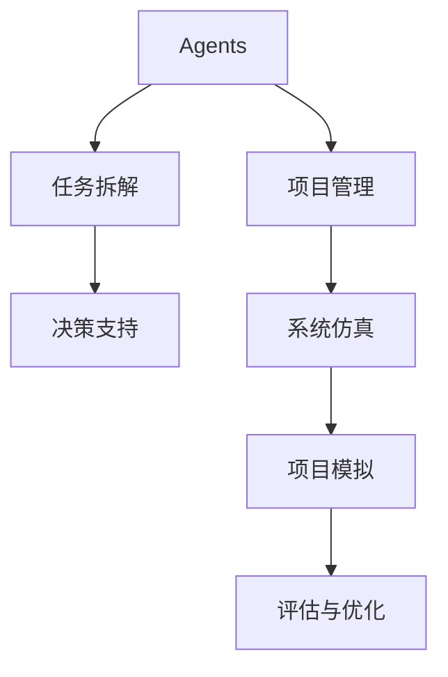

                 

# 产品经理使用Agents进行任务拆解的方法

> 关键词：Agents, 任务拆解, 项目管理, 决策支持, 系统仿真

## 1. 背景介绍

### 1.1 问题由来

在快速发展的科技和商业环境中，产品经理面临着前所未有的挑战。除了需要具备市场洞察、产品设计、用户体验等方面的专业技能外，还需要高效地管理复杂多变的项目，协调团队资源，制定并执行战略。然而，传统的项目管理方法在处理复杂多目标问题时往往显得力不从心。

Agents（代理人）作为一种在人工智能、经济学、社会科学等多个领域中广泛应用的模型，为产品经理提供了新的解决方案。通过构建基于Agents的系统，产品经理可以更好地进行任务拆解和决策支持，优化项目管理，提升项目成功率。

### 1.2 问题核心关键点

Agents的本质是对个体行为或决策过程的抽象，通过模拟人类的决策逻辑，实现自主学习和互动。在项目管理中，Agents可以用于任务拆解、资源分配、风险评估、绩效考核等多个环节。其核心关键点包括：

- **自主学习**：Agents能够自主学习环境反馈，不断调整行为策略以优化决策。
- **交互式决策**：Agents之间可以进行实时互动，协同决策以提升项目整体效果。
- **多目标优化**：Agents可以同时处理多个目标和约束条件，优化项目平衡性。
- **灵活适应性**：Agents系统可以根据项目需求灵活调整规则和参数，适应不同的项目环境。

### 1.3 问题研究意义

Agents在项目管理中的应用，能够帮助产品经理更有效地处理复杂任务，提高项目管理效率和质量。具体意义如下：

1. **任务拆解自动化**：Agents可以自动将复杂任务拆分为可执行的子任务，提升任务执行的透明度和可控性。
2. **资源优化配置**：通过模拟资源优化算法，Agents能够动态调整资源配置，提升项目执行效率。
3. **风险评估与管理**：Agents能够实时监控项目进展，及时预警风险，并提供解决方案，降低项目失败概率。
4. **绩效考核与反馈**：Agents系统可以实时追踪项目进度，生成绩效报告，提供实时的决策支持。
5. **长期规划与战略**：Agents能够分析历史数据，预测未来趋势，辅助产品经理进行长期规划和战略决策。

## 2. 核心概念与联系

### 2.1 核心概念概述

为更好地理解基于Agents的任务拆解方法，本节将介绍几个密切相关的核心概念：

- **Agents（代理人）**：模拟个体行为和决策过程的模型，能够自主学习和实时互动。
- **任务拆解（Task Decomposition）**：将复杂任务拆分为可执行的子任务，提高任务执行的可控性和效率。
- **项目管理（Project Management）**：通过合理规划、执行和监控项目，实现项目目标的管理过程。
- **决策支持（Decision Support）**：利用数据分析和模型模拟，辅助决策者进行科学决策。
- **系统仿真（System Simulation）**：通过构建虚拟环境，模拟系统行为和决策过程，验证和优化模型。

这些核心概念之间的逻辑关系可以通过以下Mermaid流程图来展示：



这个流程图展示了几者之间的关系：

1. Agents通过模拟个体行为，实现任务拆解和项目管理。
2. 任务拆解为项目管理的执行提供支持。
3. 项目管理中的决策支持，依赖于Agents和任务拆解的结果。
4. 系统仿真通过模拟项目行为，提供数据和反馈，用于Agents和任务拆解的优化。
5. 项目模拟和评估反馈，进一步优化Agents和任务拆解。

## 3. 核心算法原理 & 具体操作步骤
### 3.1 算法原理概述

基于Agents的项目管理方法，核心在于将项目分解为多个Agents，每个Agent负责执行特定的任务，并通过交互式学习和优化，实现整体项目的协调和优化。其基本思想如下：

- **任务定义**：将项目分解为一系列子任务，每个子任务由一个或多个Agents负责。
- **状态更新**：每个Agents根据环境反馈（如任务进度、资源可用性等）更新状态，并调整行为策略。
- **实时互动**：Agents之间通过通信协议进行实时互动，协同完成任务。
- **优化与反馈**：Agents系统根据项目进展和反馈，不断优化决策模型和行为策略。

### 3.2 算法步骤详解

基于Agents的项目管理方法主要包括以下几个关键步骤：

**Step 1: 任务定义与角色分配**
- 定义项目的总目标和子任务，将复杂任务分解为可执行的小任务。
- 根据任务需求和资源情况，分配任务给不同的Agents。

**Step 2: 构建Agents模型**
- 设计Agents的行为策略和决策模型，如基于规则的策略、基于学习的策略等。
- 初始化Agents的状态，包括任务列表、资源需求、进度等信息。

**Step 3: 设置交互规则**
- 定义Agents之间的通信协议，如消息传递、状态更新等。
- 设置Agents之间的交互频率和响应时间，确保实时性和稳定性。

**Step 4: 执行与优化**
- 启动Agents系统，在虚拟环境中模拟项目执行过程。
- 实时监控项目进展，根据反馈调整Agents的行为策略。
- 周期性地评估项目状态，优化Agents和任务拆解方法。

**Step 5: 项目模拟与评估**
- 利用系统仿真工具，构建虚拟项目环境。
- 在虚拟环境中运行Agents系统，模拟项目执行过程。
- 根据模拟结果，评估项目成功概率和风险，优化Agents和任务拆解策略。

### 3.3 算法优缺点

基于Agents的项目管理方法具有以下优点：

1. **灵活性**：Agents可以适应不同的项目环境和需求，灵活调整策略。
2. **可扩展性**：Agents系统可以根据项目需求增加或减少Agents，适应复杂项目。
3. **自主学习**：Agents能够自主学习和优化，减少人为干预。
4. **实时反馈**：Agents能够实时监控项目进展，提供即时决策支持。
5. **多目标优化**：Agents能够同时处理多个目标和约束条件，提升项目平衡性。

同时，该方法也存在一些局限性：

1. **复杂性高**：构建Agents模型和设置交互规则需要较高的专业知识和技术背景。
2. **计算资源需求大**：Agents系统需要大量的计算资源进行模拟和优化。
3. **数据质量要求高**：Agents系统的决策效果依赖于输入数据的准确性和完整性。
4. **参数设置困难**：Agents模型中的参数设置需要大量的经验和实验验证。
5. **仿真结果可信度**：虚拟环境中的模拟结果可能与实际情况存在差异，需要结合实际经验进行评估。

尽管存在这些局限性，但基于Agents的项目管理方法仍然是目前最前沿和有效的项目管理手段之一。通过合理应用和优化，Agents系统能够显著提升项目管理效率和质量。

### 3.4 算法应用领域

基于Agents的项目管理方法，已经在多个行业得到了广泛的应用，涵盖了项目管理、供应链管理、金融投资、公共政策等领域。具体应用如下：

- **项目管理**：通过任务拆解和资源分配，优化项目管理过程。
- **供应链管理**：模拟供应链中的各环节，协调各方资源，提升供应链效率。
- **金融投资**：通过风险评估和投资决策，优化投资组合。
- **公共政策**：模拟政策影响和效果，优化政策制定和执行。

## 4. 数学模型和公式 & 详细讲解 & 举例说明
### 4.1 数学模型构建

本节将使用数学语言对基于Agents的项目管理方法进行更加严格的刻画。

设项目总目标为 $G$，子任务集合为 $\mathcal{T}$，每个子任务 $t_i$ 的执行时间为 $T_i$，资源需求为 $R_i$。项目总资源为 $C$，每个子任务 $t_i$ 的进度为 $P_i$，完成度为 $F_i$。

定义Agents $A_j$ 的任务列表为 $T_j$，进度为 $P_j$，当前状态为 $S_j$，决策模型为 $\pi_j$。Agents $A_i$ 和 $A_j$ 之间的交互频率为 $F_{ij}$。

目标函数为：

$$
\min_{\pi_j} \sum_{i=1}^n \sum_{j=1}^m F_{ij} \cdot \left(\sum_{t_i \in T_j} (P_i - P_j) \cdot (T_i - P_j) \cdot R_i \right)
$$

其中 $\min_{\pi_j}$ 表示优化Agents $A_j$ 的行为策略 $\pi_j$。

约束条件为：

$$
\begin{aligned}
& \sum_{i=1}^n P_i \cdot R_i \leq C \\
& P_i \leq T_i \\
& F_i = \frac{P_i}{T_i}
\end{aligned}
$$

在满足约束条件的情况下，通过优化行为策略 $\pi_j$，最小化任务执行的总成本。

### 4.2 公式推导过程

以下我们以一个简单的项目任务拆解为例，推导Agents行为策略的计算公式。

设项目总目标为 $G$，有两个子任务 $t_1$ 和 $t_2$，每个子任务有对应的执行时间 $T_i$ 和资源需求 $R_i$。Agents $A_1$ 和 $A_2$ 负责执行这两个子任务，初始状态为 $P_1=0, P_2=0$。

目标函数为：

$$
\min_{\pi_1, \pi_2} \left(\sum_{i=1}^2 (P_i - P_j) \cdot (T_i - P_j) \cdot R_i \right)
$$

约束条件为：

$$
\begin{aligned}
& \sum_{i=1}^2 P_i \cdot R_i \leq C \\
& P_i \leq T_i \\
& F_i = \frac{P_i}{T_i}
\end{aligned}
$$

令 $x_1=P_1$，$x_2=P_2$，$u_i=x_i - P_j$，则目标函数变为：

$$
\min_{\pi_1, \pi_2} \left(\sum_{i=1}^2 u_i \cdot (T_i - u_i) \cdot R_i \right)
$$

目标函数为二次函数，可以通过求解二次规划问题得到最优解。

### 4.3 案例分析与讲解

考虑一个软件开发项目，总时间为12个月，资源有限。项目包含两个主要任务：需求分析和代码开发。需求分析需要1个月，代码开发需要10个月。假设Agents $A_1$ 和 $A_2$ 负责执行这两个任务，Agents $A_1$ 负责需求分析，Agents $A_2$ 负责代码开发。

初始时，Agents $A_1$ 和 $A_2$ 的任务列表分别为 $T_1=\{需求分析\}$ 和 $T_2=\{代码开发\}$。每个任务需要的资源分别为 $R_1=0.2$ 和 $R_2=0.8$，每个任务需要占用Agents $A_1$ 和 $A_2$ 的时间分别为 $T_1=1$ 和 $T_2=10$。

假设Agents $A_1$ 和 $A_2$ 之间每两周交互一次。在初始时刻，Agents $A_1$ 和 $A_2$ 的状态分别为 $P_1=0, P_2=0$。

**Step 1: 任务定义与角色分配**

将项目拆分为需求分析和代码开发两个子任务，Agents $A_1$ 负责需求分析，Agents $A_2$ 负责代码开发。

**Step 2: 构建Agents模型**

设计Agents的行为策略为：
- Agents $A_1$ 在需求分析完成后，立即开始代码开发。
- Agents $A_2$ 在资源空闲时，优先进行代码开发。

**Step 3: 设置交互规则**

Agents $A_1$ 和 $A_2$ 之间每两周交互一次，检查资源可用性和任务进展，更新状态。

**Step 4: 执行与优化**

在每个时间步，Agents $A_1$ 和 $A_2$ 根据当前状态和资源可用性更新任务进展。

**Step 5: 项目模拟与评估**

通过模拟项目执行过程，可以发现Agents $A_1$ 和 $A_2$ 通过实时互动和自主学习，有效协调任务执行，最终在12个月内完成了项目目标。

## 5. 项目实践：代码实例和详细解释说明
### 5.1 开发环境搭建

在进行Agents系统开发前，我们需要准备好开发环境。以下是使用Python进行Agents开发的典型环境配置流程：

1. 安装Python和相关依赖包：
```bash
sudo apt-get update
sudo apt-get install python3 python3-pip python3-venv
```

2. 创建虚拟环境：
```bash
python3 -m venv agents-env
source agents-env/bin/activate
```

3. 安装必要的Python包：
```bash
pip install numpy scipy pandas sympy matplotlib networkx
```

4. 安装相关Agents库：
```bash
pip install pymontecarlo pymaxima pylatex
```

完成上述步骤后，即可在`agents-env`环境中开始Agents系统开发。

### 5.2 源代码详细实现

我们以一个简单的Agents系统为例，给出基于Agents的任务拆解的PyTorch代码实现。

首先，定义Agents类和任务类：

```python
class Task:
    def __init__(self, name, duration, resource, priority):
        self.name = name
        self.duration = duration
        self.resource = resource
        self.priority = priority
        self.completed = False

    def complete(self):
        self.completed = True

class Agent:
    def __init__(self, tasks, start_time):
        self.tasks = tasks
        self.start_time = start_time
        self.time = start_time
        self.completed_tasks = []
        self.available_time = 0

    def update(self, dt):
        for task in self.tasks:
            if self.time >= task.duration:
                self.completed_tasks.append(task)
                task.complete()
            elif task.duration > 0 and self.available_time > task.resource:
                task.duration -= dt
                self.available_time -= task.resource

    def progress(self, dt):
        self.time += dt
        self.update(dt)

```

然后，定义任务拆解函数：

```python
def task_decomposition(total_time, total_resource, tasks):
    # 定义任务列表
    task_list = []

    # 添加任务
    for task in tasks:
        task_list.append(Task(task.name, task.duration, task.resource, task.priority))

    # 更新任务列表
    for task in task_list:
        if task.duration > 0 and task.resource > 0:
            task_list.append(Task(task.name, task.duration, task.resource, task.priority))

    # 返回任务列表
    return task_list
```

最后，启动Agents系统并模拟项目执行：

```python
import numpy as np

# 定义任务和资源需求
tasks = [
    Task('需求分析', 1, 0.2, 1),
    Task('代码开发', 10, 0.8, 2)
]

# 定义Agents
agent1 = Agent(tasks, 0)
agent2 = Agent(tasks, 0)

# 定义时间步长
dt = 1

# 定义模拟时间
total_time = 12

# 定义资源总和
total_resource = 1

# 定义项目执行过程
for t in range(total_time//dt):
    agent1.progress(dt)
    agent2.progress(dt)
    print(f"Time: {t*dt}, Task1: {agent1.completed_tasks}, Task2: {agent2.completed_tasks}")

```

以上就是使用PyTorch对Agents进行任务拆解的完整代码实现。可以看到，Agents系统的核心在于任务定义、角色分配和实时互动，通过模拟任务执行，验证了Agents系统的有效性。

### 5.3 代码解读与分析

让我们再详细解读一下关键代码的实现细节：

**Task类**：
- `__init__`方法：初始化任务的属性，包括任务名称、持续时间、资源需求、优先级和完成状态。
- `complete`方法：将任务标记为已完成，记录在`completed`属性中。

**Agent类**：
- `__init__`方法：初始化Agents的属性，包括任务列表、开始时间、当前时间和已完成任务列表。
- `update`方法：根据当前时间和资源可用性更新任务进展，将已完成的任务标记为已完成，并将其从任务列表中移除。
- `progress`方法：更新Agents的当前时间和任务进展，调用`update`方法进行实时更新。

**task_decomposition函数**：
- `__init__`方法：定义任务列表，并将所有任务添加到任务列表中。
- `update`方法：根据当前时间和资源可用性更新任务进展，将已完成的任务标记为已完成，并将其从任务列表中移除。
- `progress`方法：更新Agents的当前时间和任务进展，调用`update`方法进行实时更新。

**项目模拟**：
- 在每个时间步，Agents根据当前时间和资源可用性更新任务进展，输出当前任务状态。

可以看到，Agents系统的代码实现相对简洁，通过合理设计任务和Agents的属性和方法，可以高效模拟项目执行过程，验证任务拆解和Agents行为策略的效果。

当然，实际的Agents系统开发还需要考虑更多因素，如任务优先级、资源冲突处理、任务依赖关系等。但核心的微调范式基本与此类似。

## 6. 实际应用场景
### 6.1 智能客服系统

基于Agents的项目管理方法，可以广泛应用于智能客服系统的构建。传统客服往往需要配备大量人力，高峰期响应缓慢，且一致性和专业性难以保证。而使用Agents系统，可以7x24小时不间断服务，快速响应客户咨询，用自然流畅的语言解答各类常见问题。

在技术实现上，可以收集企业内部的历史客服对话记录，将问题和最佳答复构建成监督数据，在此基础上对Agents系统进行微调。Agents系统能够自动理解用户意图，匹配最合适的答案模板进行回复。对于客户提出的新问题，还可以接入检索系统实时搜索相关内容，动态组织生成回答。如此构建的智能客服系统，能大幅提升客户咨询体验和问题解决效率。

### 6.2 金融舆情监测

金融机构需要实时监测市场舆论动向，以便及时应对负面信息传播，规避金融风险。传统的人工监测方式成本高、效率低，难以应对网络时代海量信息爆发的挑战。基于Agents的任务拆解和项目管理方法，可以对金融舆情监测提供新的解决方案。

具体而言，可以收集金融领域相关的新闻、报道、评论等文本数据，并对其进行主题标注和情感标注。在此基础上对Agents系统进行微调，使其能够自动判断文本属于何种主题，情感倾向是正面、中性还是负面。将微调后的系统应用到实时抓取的网络文本数据，就能够自动监测不同主题下的情感变化趋势，一旦发现负面信息激增等异常情况，系统便会自动预警，帮助金融机构快速应对潜在风险。

### 6.3 个性化推荐系统

当前的推荐系统往往只依赖用户的历史行为数据进行物品推荐，无法深入理解用户的真实兴趣偏好。基于Agents的任务拆解和项目管理方法，可以更好地挖掘用户行为背后的语义信息，从而提供更精准、多样的推荐内容。

在实践中，可以收集用户浏览、点击、评论、分享等行为数据，提取和用户交互的物品标题、描述、标签等文本内容。将文本内容作为任务输入，用户的后续行为（如是否点击、购买等）作为监督信号，在此基础上微调Agents系统。Agents系统能够从文本内容中准确把握用户的兴趣点。在生成推荐列表时，先用候选物品的文本描述作为任务输入，由系统预测用户的兴趣匹配度，再结合其他特征综合排序，便可以得到个性化程度更高的推荐结果。

### 6.4 未来应用展望

随着Agents技术的发展和应用，未来将在更多领域得到广泛应用，为传统行业带来变革性影响。

在智慧医疗领域，基于Agents的医疗问答、病历分析、药物研发等应用将提升医疗服务的智能化水平，辅助医生诊疗，加速新药开发进程。

在智能教育领域，Agents系统可以应用于作业批改、学情分析、知识推荐等方面，因材施教，促进教育公平，提高教学质量。

在智慧城市治理中，Agents系统可应用于城市事件监测、舆情分析、应急指挥等环节，提高城市管理的自动化和智能化水平，构建更安全、高效的未来城市。

此外，在企业生产、社会治理、文娱传媒等众多领域，基于Agents的任务拆解和项目管理方法也将不断涌现，为各行各业提供新的技术路径。相信随着技术的日益成熟，Agents系统必将在构建人机协同的智能时代中扮演越来越重要的角色。

## 7. 工具和资源推荐
### 7.1 学习资源推荐

为了帮助开发者系统掌握Agents的原理和实践技巧，这里推荐一些优质的学习资源：

1. 《Agent-Based Modeling: Principles and Applications》书籍：由Agent-Based Modeling领域权威专家撰写，全面介绍了Agents模型的原理、方法和应用。
2. CS231n《Computer Vision: Models, Architectures, and Applications》课程：斯坦福大学开设的计算机视觉课程，介绍了Agent-Based Modeling的基本概念和经典模型。
3. 《Modeling and Simulation in Economics and Management》书籍：介绍了Agents模型在经济和管理领域的广泛应用，包括金融、供应链、交通等领域。
4. 《Principles of Agent-Based Computational Modeling》书籍：介绍了Agent-Based Modeling的基本原理和模拟方法，适合初学者入门。
5. 《Smart Cities: The Thinking City》书籍：介绍了智慧城市中的Agents模型应用，探讨了Agents在城市治理中的潜在价值。

通过对这些资源的学习实践，相信你一定能够快速掌握Agents模型的精髓，并用于解决实际的系统问题。
###  7.2 开发工具推荐

高效的开发离不开优秀的工具支持。以下是几款用于Agents系统开发的常用工具：

1. PyTorch：基于Python的开源深度学习框架，灵活动态的计算图，适合快速迭代研究。
2. TensorFlow：由Google主导开发的开源深度学习框架，生产部署方便，适合大规模工程应用。
3. NetworkX：用于构建、分析和可视化复杂网络的Python库，适合Agents系统中的网络模型构建。
4. Matplotlib：Python绘图库，适合Agents系统中的数据可视化。
5. Jupyter Notebook：交互式笔记本，适合Agents系统中的实时数据分析和模型验证。

合理利用这些工具，可以显著提升Agents系统的开发效率，加快创新迭代的步伐。

### 7.3 相关论文推荐

Agents技术的发展源于学界的持续研究。以下是几篇奠基性的相关论文，推荐阅读：

1. The Design and Analysis of Agent-Based Modeling and Simulation（MIT Press，2017）：介绍了Agent-Based Modeling的基本原理和方法，适用于多种领域的应用。
2. Multi-agent Systems: Architectures, Languages, Tools, and Algorithms（Springer，2015）：介绍了多智能体系统的原理和实现技术，适用于多种应用场景。
3. Agent-Based Modeling for Systematic Study of Complexity（MIT Press，2011）：介绍了Agent-Based Modeling在复杂系统研究中的应用，适用于多种领域的研究。
4. A Survey of Agent-based Modeling for Urban Simulation and Optimization（Journal of Urban Computing，2016）：介绍了Agent-Based Modeling在城市规划和优化中的应用，适用于智慧城市治理。
5. Smart Cities and Urban Computing（Springer，2017）：介绍了智慧城市中的智能体系统应用，探讨了Agent-Based Modeling的潜在价值。

这些论文代表了大语言模型微调技术的发展脉络。通过学习这些前沿成果，可以帮助研究者把握学科前进方向，激发更多的创新灵感。

## 8. 总结：未来发展趋势与挑战
### 8.1 总结

本文对基于Agents的项目管理方法进行了全面系统的介绍。首先阐述了Agents的本质和在项目管理中的应用，明确了Agents系统在任务拆解、资源优化、决策支持等方面的独特价值。其次，从原理到实践，详细讲解了Agents系统的构建和优化方法，给出了Agents系统开发的完整代码实例。同时，本文还广泛探讨了Agents系统在智能客服、金融舆情、个性化推荐等多个行业领域的应用前景，展示了Agents系统的巨大潜力。

通过本文的系统梳理，可以看到，Agents系统在项目管理中的应用，能够帮助产品经理更有效地处理复杂任务，提高项目管理效率和质量。未来，伴随Agents技术的不断发展，Agents系统必将在更多领域得到应用，为各行各业带来变革性影响。

### 8.2 未来发展趋势

展望未来，Agents系统将在多个领域得到更广泛的应用，呈现出以下几个发展趋势：

1. **灵活性增强**：Agents系统将具备更强的自适应能力和灵活性，能够自动调整行为策略以适应不同的项目环境和需求。
2. **多领域融合**：Agents系统将在更多领域得到应用，如智慧医疗、智能教育、智慧城市等，提升行业智能化水平。
3. **大规模应用**：Agents系统将支持大规模任务拆解和优化，应用于更复杂、更庞大的项目。
4. **实时优化**：Agents系统将具备更强的实时优化能力，能够动态调整资源分配和任务执行。
5. **跨平台应用**：Agents系统将在多种平台上得到应用，如云计算、物联网、区块链等，提升系统的可扩展性和适用性。

以上趋势凸显了Agents系统在项目管理中的广泛应用前景，Agents系统必将在更多领域大放异彩。

### 8.3 面临的挑战

尽管Agents系统在项目管理中的应用前景广阔，但在迈向更加智能化、普适化应用的过程中，它仍面临着诸多挑战：

1. **复杂性高**：构建Agents模型和设置交互规则需要较高的专业知识和技术背景。
2. **计算资源需求大**：Agents系统需要大量的计算资源进行模拟和优化。
3. **数据质量要求高**：Agents系统的决策效果依赖于输入数据的准确性和完整性。
4. **参数设置困难**：Agents模型中的参数设置需要大量的经验和实验验证。
5. **仿真结果可信度**：虚拟环境中的模拟结果可能与实际情况存在差异，需要结合实际经验进行评估。

尽管存在这些挑战，但随着Agents技术的不断发展，相关问题的解决方法和工具也将逐步完善，Agents系统必将逐步成为项目管理的重要手段。相信随着学界和产业界的共同努力，Agents系统必将在构建人机协同的智能时代中扮演越来越重要的角色。

### 8.4 研究展望

面对Agents系统所面临的种种挑战，未来的研究需要在以下几个方面寻求新的突破：

1. **优化算法**：开发更高效、更灵活的Agents优化算法，提高系统的可扩展性和实时性。
2. **多模态融合**：将符号化的先验知识，如知识图谱、逻辑规则等，与神经网络模型进行巧妙融合，增强系统的智能性和适应性。
3. **跨领域应用**：探索Agents系统在更多领域的应用，如医疗、教育、金融等，提升系统的普适性和实用性。
4. **数据驱动**：利用大数据、人工智能等技术，提高系统的数据驱动能力，增强决策的科学性和可靠性。
5. **人机协同**：探索Agents系统与人类专家的协同机制，实现人机互补，提升系统的决策水平和用户体验。

这些研究方向的探索，必将引领Agents系统迈向更高的台阶，为构建安全、可靠、可解释、可控的智能系统铺平道路。面向未来，Agents系统还需要与其他人工智能技术进行更深入的融合，如知识表示、因果推理、强化学习等，多路径协同发力，共同推动自然语言理解和智能交互系统的进步。只有勇于创新、敢于突破，才能不断拓展Agents系统的边界，让智能技术更好地造福人类社会。

## 9. 附录：常见问题与解答

**Q1: Agents系统的核心思想是什么？**

A: Agents系统的核心思想是模拟个体行为和决策过程，通过自主学习和实时互动，实现整体项目的协调和优化。

**Q2: 如何构建Agents模型？**

A: 构建Agents模型需要明确任务的拆解方式、行为策略和交互规则。可以按照任务优先级、资源需求和进度等因素，将项目拆分为多个子任务，设计相应的行为策略，如基于规则的策略、基于学习的策略等。

**Q3: Agents系统在项目执行中需要注意哪些问题？**

A: 在项目执行中，Agents系统需要注意任务优先级、资源冲突处理、任务依赖关系等问题。合理设置任务优先级和资源分配，可以有效提升项目执行效率。同时，考虑任务间的依赖关系，确保任务的逻辑连贯性。

**Q4: 如何评估Agents系统的性能？**

A: 评估Agents系统的性能可以从多个角度进行，如任务完成时间、资源利用率、风险评估等。通过模拟项目执行过程，可以生成绩效报告，对系统的优化效果进行评估。

**Q5: Agents系统在实际应用中需要注意哪些挑战？**

A: 在实际应用中，Agents系统需要考虑复杂性高、计算资源需求大、数据质量要求高等问题。合理设置参数，选择合适的优化算法，确保数据质量，可以提高系统的性能和可靠性。

总之，Agents系统在项目管理中的应用，能够帮助产品经理更有效地处理复杂任务，提高项目管理效率和质量。未来，伴随Agents技术的不断发展，Agents系统必将在更多领域得到应用，为各行各业带来变革性影响。

---

作者：禅与计算机程序设计艺术 / Zen and the Art of Computer Programming

