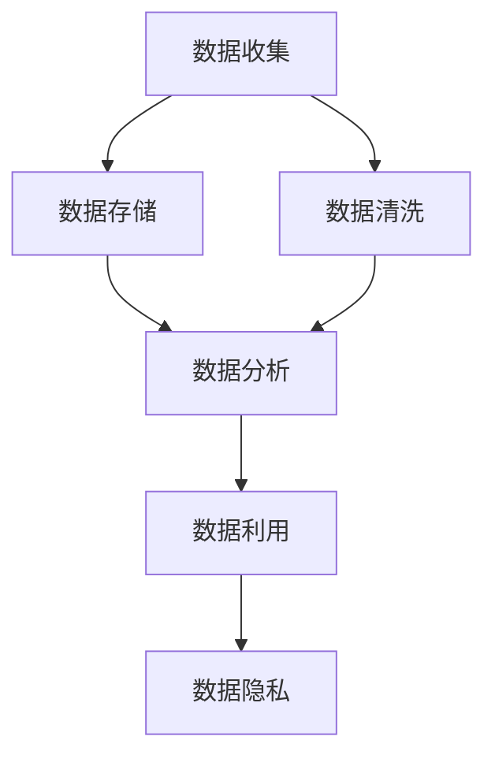

                 

# 人工智能创业数据管理的核心方法

> 关键词：人工智能, 创业, 数据管理, 大数据, 机器学习, 数据清洗, 数据隐私, 数据质量

## 1. 背景介绍

在人工智能(AI)领域，数据管理是创业企业成功的基石。优质的数据是AI模型创新的关键，而科学的数据管理方式则是保证数据高质量的重要手段。随着AI技术的日渐成熟，越来越多的创业企业将数据管理作为核心竞争力之一。本文旨在探讨人工智能创业数据管理的核心方法，通过逻辑清晰、结构紧凑的框架，帮助读者深入理解AI创业中数据管理的原理、步骤和技巧。

## 2. 核心概念与联系

### 2.1 核心概念概述

在人工智能创业过程中，数据管理是一个多维度的复杂系统，涉及数据的收集、存储、清洗、分析、利用和保护等多个方面。为更好地理解人工智能创业中的数据管理，本节将介绍几个核心概念：

- **数据收集**：获取数据来源，包括线上爬取、API接口调用、传感器数据收集等。
- **数据存储**：将收集的数据按格式和类别存储在合适的介质中，保证数据的安全性和可访问性。
- **数据清洗**：处理缺失、异常、重复数据，保证数据的质量和一致性。
- **数据分析**：使用统计方法、机器学习模型等工具对数据进行挖掘，发现数据背后的规律和关联。
- **数据利用**：根据业务需求，将分析结果转化为应用，如推荐系统、预测模型、智能决策系统等。
- **数据隐私**：确保数据处理和使用符合隐私保护法律法规和道德标准。

这些核心概念之间的逻辑关系可以通过以下Mermaid流程图来展示：



这个流程图展示了大数据管理的关键环节及其相互关系：

1. 数据收集是数据管理的起点。
2. 数据存储为后续的数据清洗和分析提供了基础。
3. 数据清洗是保证数据质量的重要步骤。
4. 数据分析可以发现数据的内在关系，为数据利用提供依据。
5. 数据利用将分析结果转化为业务应用，实现数据价值最大化。
6. 数据隐私保护贯穿于数据管理的全过程。

## 3. 核心算法原理 & 具体操作步骤
### 3.1 算法原理概述

人工智能创业中的数据管理方法，通常基于数据管理的经典理论框架，结合最新的大数据和机器学习技术。其核心原理包括：

- **数据收集**：利用爬虫技术、API接口等手段，从不同来源收集数据。
- **数据清洗**：通过去重、填充缺失值、异常值处理等技术，保证数据质量。
- **数据分析**：采用统计学、机器学习等方法，挖掘数据中的模式和规律。
- **数据利用**：构建机器学习模型，将数据分析结果应用于业务决策和自动化流程。
- **数据隐私**：实施数据匿名化、访问控制等技术手段，保护用户隐私。

### 3.2 算法步骤详解

基于上述核心原理，数据管理的详细步骤可以概括为：

**Step 1: 数据收集与存储**
- 收集不同来源的数据，确保数据多样性和代表性。
- 选择合适的存储介质和结构，如分布式文件系统、数据库等。
- 实现数据的高效存储和快速读取。

**Step 2: 数据清洗与预处理**
- 使用ETL工具（抽取、转换、加载）对数据进行预处理。
- 去除重复数据、处理缺失值和异常值。
- 数据格式化和标准化，保证数据一致性。

**Step 3: 数据分析与建模**
- 使用统计学方法进行基础数据分析，如描述性统计、回归分析等。
- 应用机器学习模型进行高级分析，如分类、聚类、回归等。
- 使用深度学习技术构建高级模型，如神经网络、Transformer等。

**Step 4: 数据利用与业务应用**
- 将模型应用于业务场景，构建推荐系统、预测模型等。
- 实现自动化决策流程，提升运营效率。
- 利用实时数据分析，实现动态业务优化。

**Step 5: 数据隐私与安全保护**
- 实施数据匿名化处理，去除敏感信息。
- 设置访问控制策略，限制数据访问权限。
- 定期进行安全审计，确保数据安全。

### 3.3 算法优缺点

人工智能创业中数据管理方法具有以下优点：

- **数据驱动**：通过大规模数据挖掘，发现潜在规律和商机。
- **高效利用**：将数据转化为业务应用，提升决策效率和自动化水平。
- **隐私保护**：通过隐私保护技术，减少数据泄露风险。

同时，该方法也存在一定的局限性：

- **数据依赖**：依赖大量高质量数据的收集和处理，成本较高。
- **模型复杂**：高级机器学习模型和深度学习模型计算复杂，需要强大计算资源。
- **隐私风险**：数据隐私保护技术仍有局限，可能存在隐私泄露风险。
- **数据质量**：数据质量不稳定，可能影响分析结果的准确性。

尽管存在这些局限性，但基于数据管理的AI创业方法仍是大势所趋，其广泛的应用前景和高效性是其他方法难以匹敌的。

### 3.4 算法应用领域

人工智能创业中的数据管理方法，在多个领域得到广泛应用，例如：

- **电子商务**：通过数据驱动的推荐系统，提升用户购物体验和转化率。
- **金融科技**：构建风控模型，实时监控交易风险，保障金融安全。
- **健康医疗**：分析患者数据，实现疾病预测和个性化治疗。
- **智能制造**：利用数据驱动的生产优化，提升生产效率和质量。
- **自动驾驶**：通过实时数据分析，优化车辆导航和决策。
- **智能客服**：构建基于数据的客服机器人，提升客户服务质量。

## 4. 数学模型和公式 & 详细讲解 & 举例说明

### 4.1 数学模型构建

人工智能创业中的数据管理方法涉及多种数学模型，以下以线性回归模型为例，展示数学模型的构建过程：

假设我们有数据集 $(x_i, y_i)$，其中 $x_i$ 为自变量，$y_i$ 为因变量。构建线性回归模型 $y = \theta_0 + \theta_1 x + \epsilon$，其中 $\theta_0, \theta_1$ 为模型参数，$\epsilon$ 为误差项。

### 4.2 公式推导过程

将数据集 $(x_i, y_i)$ 带入模型 $y = \theta_0 + \theta_1 x + \epsilon$，得到：

$$
\hat{y} = \theta_0 + \theta_1 x
$$

为了最小化误差项 $\epsilon$，我们使用均方误差作为损失函数：

$$
\text{MSE} = \frac{1}{N} \sum_{i=1}^N (y_i - \hat{y}_i)^2
$$

通过求解最小化问题 $\min_{\theta_0, \theta_1} \text{MSE}$，得到模型参数：

$$
\hat{\theta} = (X^T X)^{-1} X^T y
$$

其中 $X = \begin{bmatrix} 1 & x_1 \\ 1 & x_2 \\ \vdots & \vdots \\ 1 & x_n \end{bmatrix}$，$y = \begin{bmatrix} y_1 \\ y_2 \\ \vdots \\ y_n \end{bmatrix}$。

### 4.3 案例分析与讲解

以电商平台的推荐系统为例，我们收集用户浏览记录和购买行为数据，通过数据清洗和预处理，建立用户-物品关联矩阵 $X$ 和用户评分向量 $y$。构建线性回归模型，使用均方误差作为损失函数，最小化预测评分和实际评分之间的差异。训练得到的模型参数 $\hat{\theta}$ 将作为推荐系统的一部分，根据用户的新行为预测其感兴趣的商品。

## 5. 项目实践：代码实例和详细解释说明

### 5.1 开发环境搭建

在进行数据管理项目实践前，我们需要准备好开发环境。以下是使用Python进行数据管理开发的常用环境配置：

1. 安装Anaconda：从官网下载并安装Anaconda，用于创建独立的Python环境。

2. 创建并激活虚拟环境：
```bash
conda create -n data-manage python=3.8 
conda activate data-manage
```

3. 安装必要的库：
```bash
conda install pandas numpy scikit-learn matplotlib seaborn tensorflow
```

完成上述步骤后，即可在`data-manage`环境中开始数据管理实践。

### 5.2 源代码详细实现

以下是一个简单的电商推荐系统数据管理的Python代码实现：

```python
import pandas as pd
import numpy as np
from sklearn.model_selection import train_test_split
from sklearn.linear_model import LinearRegression

# 加载数据集
data = pd.read_csv('data.csv')

# 数据清洗与预处理
X = data[['feature1', 'feature2', 'feature3']] # 自变量
y = data['label'] # 因变量

# 数据划分
X_train, X_test, y_train, y_test = train_test_split(X, y, test_size=0.2, random_state=42)

# 模型训练
model = LinearRegression()
model.fit(X_train, y_train)

# 预测与评估
y_pred = model.predict(X_test)
print('预测结果为：', y_pred)
print('均方误差：', np.mean((y_pred - y_test)**2))
```

### 5.3 代码解读与分析

让我们详细解读一下关键代码的实现细节：

**数据加载与清洗**：
- 使用pandas库加载CSV文件，将数据集转换为DataFrame对象。
- 对数据集进行清洗，如去除缺失值、异常值等，保证数据质量。

**模型训练**：
- 使用sklearn库的train_test_split方法，将数据集划分为训练集和测试集。
- 实例化线性回归模型，使用训练集数据拟合模型。

**预测与评估**：
- 使用训练好的模型对测试集进行预测，并计算预测值与真实值之间的均方误差。

**代码输出**：
- 打印预测结果和均方误差，评估模型性能。

## 6. 实际应用场景

### 6.1 智能客服系统

智能客服系统通过数据管理方法，实时收集和分析用户互动数据，实现自动化的客户服务。例如，通过分析用户的历史查询和反馈，智能客服系统可以自动回复常见问题，提升用户体验。

### 6.2 金融风险管理

在金融领域，数据管理方法帮助金融机构实时监控和分析交易数据，构建风险预测模型，提前发现潜在风险，保障金融安全。

### 6.3 医疗诊断系统

医疗诊断系统通过数据管理方法，收集和分析患者数据，构建预测模型，辅助医生进行疾病诊断和治疗决策。

## 7. 工具和资源推荐

### 7.1 学习资源推荐

为了帮助开发者系统掌握数据管理的理论基础和实践技巧，这里推荐一些优质的学习资源：

1. **《Python数据科学手册》**：全面介绍了Python在数据科学中的应用，包括数据清洗、数据分析、机器学习等。
2. **Kaggle**：提供大量数据集和竞赛平台，帮助开发者实践数据管理技能。
3. **Coursera**：提供多个数据科学和机器学习课程，包括数据管理方法的教学。
4. **DataCamp**：提供互动式编程练习，帮助开发者掌握数据管理工具和库。
5. **GitHub**：查找和学习开源数据管理项目，学习最佳实践。

通过对这些资源的学习实践，相信你一定能够快速掌握数据管理的精髓，并用于解决实际的数据问题。

### 7.2 开发工具推荐

高效的数据管理开发离不开优秀的工具支持。以下是几款用于数据管理开发的常用工具：

1. **Jupyter Notebook**：交互式编程环境，便于开发和调试数据管理脚本。
2. **Pandas**：数据处理和分析库，支持高效的数据清洗和预处理。
3. **Scikit-Learn**：机器学习库，支持多种数据管理模型和算法。
4. **TensorFlow**：深度学习框架，支持构建复杂的数据管理模型。
5. **Google Colab**：免费的在线Jupyter Notebook环境，便于实验最新数据管理技术。
6. **Dask**：分布式计算库，支持大规模数据管理的计算。

合理利用这些工具，可以显著提升数据管理任务的开发效率，加快创新迭代的步伐。

### 7.3 相关论文推荐

数据管理方法的发展源于学界的持续研究。以下是几篇奠基性的相关论文，推荐阅读：

1. **《数据挖掘：概念与技术》**：介绍数据挖掘的基本概念和技术，是数据管理方法的入门必读。
2. **《大数据时代的机器学习》**：探讨大数据环境下机器学习的方法和应用，强调数据管理的重要性。
3. **《TensorFlow数据管道》**：介绍TensorFlow数据管道的使用，展示了如何构建高效的数据管理流程。
4. **《机器学习实战》**：通过实践项目，展示机器学习在数据管理中的应用。
5. **《深度学习》**：介绍深度学习在数据管理中的应用，包括数据预处理、模型构建等。

这些论文代表了大数据管理技术的发展脉络。通过学习这些前沿成果，可以帮助研究者把握学科前进方向，激发更多的创新灵感。

## 8. 总结：未来发展趋势与挑战

### 8.1 总结

本文对人工智能创业数据管理的核心方法进行了全面系统的介绍。首先阐述了数据管理在人工智能创业中的重要性，明确了数据管理在提升模型性能、优化业务流程方面的关键作用。其次，从原理到实践，详细讲解了数据管理的数学模型和操作步骤，给出了数据管理任务开发的完整代码实例。同时，本文还广泛探讨了数据管理方法在智能客服、金融风险、医疗诊断等领域的实际应用，展示了数据管理方法的广泛适用性。

通过本文的系统梳理，可以看到，数据管理方法在人工智能创业中具有不可替代的作用。其高效的数据驱动、智能化的模型应用，使得数据管理成为人工智能技术落地应用的重要支撑。未来，伴随数据管理技术的不断进步，相信人工智能技术将在更广阔的领域大放异彩。

### 8.2 未来发展趋势

展望未来，数据管理技术将呈现以下几个发展趋势：

1. **数据质量管理**：随着数据量的增加，数据质量问题将日益突出。数据质量管理技术将不断发展，提升数据清洗和预处理的效率和准确性。
2. **实时数据管理**：实时数据管理技术将越来越重要，数据管理方法将更好地支持实时数据分析和业务优化。
3. **自动化数据管理**：自动化数据管理工具将更加普及，减少人工干预，提升数据管理效率。
4. **数据可视化**：数据可视化技术将进一步发展，帮助开发者更直观地理解和分析数据。
5. **数据安全和隐私保护**：数据安全和隐私保护技术将更加严格，确保数据管理过程中的隐私安全。

以上趋势凸显了数据管理技术的广阔前景。这些方向的探索发展，必将进一步提升数据管理的效率和质量，为人工智能技术的持续创新提供坚实的基础。

### 8.3 面临的挑战

尽管数据管理技术已经取得了显著进展，但在迈向更加智能化、普适化应用的过程中，其仍面临诸多挑战：

1. **数据规模和质量**：随着数据量的爆炸性增长，数据质量问题将愈加严峻。如何在大规模数据中高效进行数据清洗和预处理，是未来的重要挑战。
2. **计算资源**：高级数据管理方法（如深度学习模型）计算资源需求高，需要强大的计算基础设施支持。
3. **数据隐私和安全**：数据隐私和安全问题日益突出，如何平衡数据利用和隐私保护，是一个复杂且亟待解决的问题。
4. **数据标准化**：不同来源的数据格式和结构差异大，如何统一数据格式，实现数据标准化，是实现数据高效管理的重要一步。
5. **模型可解释性**：复杂的数据管理模型（如深度学习模型）难以解释，如何提升模型的可解释性，是提升用户信任和接受度的关键。

这些挑战需要科技界和产业界的共同努力，不断创新和优化数据管理方法，才能实现数据管理的可持续发展。

### 8.4 研究展望

面对数据管理面临的这些挑战，未来的研究需要在以下几个方面寻求新的突破：

1. **自动化数据清洗**：开发更高效、更智能的数据清洗工具，自动识别和处理数据中的噪声和异常值。
2. **数据增强技术**：利用数据增强技术，提升数据质量，降低数据收集成本。
3. **跨领域数据管理**：研究跨领域数据管理方法，实现不同数据源的融合和统一。
4. **数据生命周期管理**：建立数据生命周期管理机制，确保数据从收集到销毁的完整性和安全性。
5. **数据驱动决策**：研究如何通过数据管理方法，实现更智能化的业务决策和自动化流程。

这些研究方向将推动数据管理技术的进一步发展，为人工智能创业提供更加坚实的技术保障。总之，数据管理是人工智能创业中不可或缺的一环，只有不断优化和提升数据管理水平，才能更好地利用数据驱动技术创新，实现业务的持续增长和用户价值的最大化。

## 9. 附录：常见问题与解答

**Q1：数据管理中的数据清洗步骤包括哪些？**

A: 数据清洗是数据管理的重要步骤，主要包括以下几个环节：
1. 去重：去除数据集中的重复记录。
2. 处理缺失值：填补或删除缺失数据。
3. 异常值处理：识别和处理数据中的异常值。
4. 格式转换：将数据转换为统一格式，便于后续分析。

**Q2：如何选择适合的数据管理工具？**

A: 选择数据管理工具时，需要考虑以下几个因素：
1. 工具的易用性：选择易于上手和使用的工具。
2. 工具的功能和性能：根据项目需求，选择功能全面、性能优化的工具。
3. 工具的社区支持：选择有活跃社区支持的工具，便于获取帮助和资源。
4. 工具的兼容性和可扩展性：选择支持多种数据源和格式的通用工具。

**Q3：数据隐私保护有哪些常见方法？**

A: 数据隐私保护的方法包括：
1. 数据匿名化：去除或模糊化敏感信息。
2. 访问控制：设置数据访问权限，限制数据访问范围。
3. 加密存储：使用加密技术保护数据在存储和传输过程中的安全性。
4. 差分隐私：在数据分析过程中加入噪声，保护用户隐私。

**Q4：如何评估数据管理模型的性能？**

A: 评估数据管理模型的性能可以从以下几个方面入手：
1. 数据清洗效果：评估数据清洗后的数据质量，如缺失值比例、异常值数量等。
2. 数据利用效果：评估数据管理模型在业务应用中的效果，如推荐系统中的推荐准确率、医疗诊断中的诊断准确率等。
3. 数据安全和隐私保护：评估数据管理模型在数据隐私和安全方面的表现，如数据泄露事件数量等。

通过这些评估方法，可以全面了解数据管理模型的性能和效果，帮助优化和改进数据管理策略。

---

作者：禅与计算机程序设计艺术 / Zen and the Art of Computer Programming

