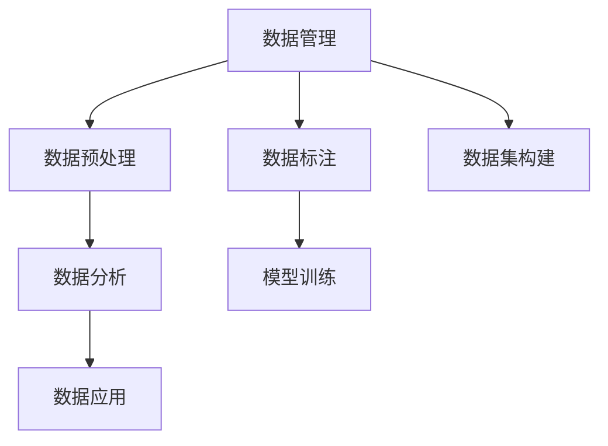

                 

# 人工智能创业数据管理的策略与创新研究

在人工智能(AI)领域，数据管理是所有创业公司面临的核心挑战之一。正确、高效的数据管理策略不仅直接影响模型的训练效果，还关乎公司的商业成功。本文将从数据收集、存储、清洗、分析和应用等各个环节，全面解析人工智能创业公司数据管理的策略与创新，为业界同仁提供切实可行的指导和参考。

## 1. 背景介绍

### 1.1 问题由来
随着人工智能技术的不断发展和应用场景的拓展，数据的质量和数量成为了制约AI模型性能提升的关键因素。对于很多初创AI公司而言，数据管理往往被忽视，导致模型训练和应用过程中出现诸多问题，如数据缺失、数据偏差、数据冗余等，从而影响到最终结果的准确性和可靠性。

### 1.2 问题核心关键点
数据管理不仅仅是数据工程师的工作，而是贯穿于AI产品开发全流程的关键环节。核心关键点包括：

- 数据的收集：如何高效、全面地获取高质量的数据。
- 数据的存储：如何安全、高效地存储和管理海量数据。
- 数据的清洗：如何自动化地处理和清洗噪声和异常数据。
- 数据分析：如何利用先进的数据分析技术提取有价值的信息。
- 数据应用：如何将数据转化为驱动AI应用的智慧资产。

本文将从这些关键点出发，全面解析AI创业公司的数据管理策略和创新路径。

## 2. 核心概念与联系

### 2.1 核心概念概述

为更好地理解AI创业公司数据管理的策略与创新，本节将介绍几个密切相关的核心概念：

- 数据管理(Data Management)：指对数据的收集、存储、清洗、分析和应用的全生命周期管理。数据管理的好坏直接影响AI模型的训练效果和应用表现。
- 数据预处理(Data Preprocessing)：指在模型训练前，对原始数据进行清洗、转换、归一化等处理，以提升数据质量。
- 数据标注(Data Annotation)：指对数据打上标签，使其能够被模型理解和学习。数据标注的质量和数量直接影响模型训练的精度。
- 数据集构建(Data Collection)：指根据模型需求，收集并整理有代表性的数据集。数据集的质量和多样性直接影响模型的泛化能力。
- 数据分析(Data Analysis)：指利用统计学、机器学习等方法对数据进行分析和挖掘，提取有价值的信息。数据分析是数据管理的重要组成部分。
- 数据应用(Data Application)：指将数据转化为具体的应用，如模型训练、业务决策等。数据应用的效果直接影响商业价值的实现。

这些核心概念之间的逻辑关系可以通过以下Mermaid流程图来展示：



这个流程图展示了几大数据管理概念及其之间的关系：

1. 数据管理是核心，贯穿于整个数据生命周期。
2. 数据预处理、数据标注、数据集构建是数据管理的重要环节。
3. 数据分析是数据管理的深化过程，用于提取数据中的有用信息。
4. 数据应用是数据管理的最终目标，将数据转化为具体的商业价值。

## 3. 核心算法原理 & 具体操作步骤

### 3.1 算法原理概述

AI创业公司的数据管理策略和创新研究，核心在于如何高效、准确地处理和管理数据，从而支持模型训练和商业应用。本节将详细介绍基于数据管理核心的算法原理和具体操作步骤。

### 3.2 算法步骤详解

#### 3.2.1 数据收集

数据收集是数据管理的第一步。AI创业公司需要根据业务需求，确定所需数据类型和来源，采用合适的方式进行数据收集。数据来源可以包括公开数据集、在线爬虫、第三方API、用户数据等。

**具体操作步骤**：

1. 确定数据需求：明确模型训练和应用场景所需的各类数据。
2. 选择合适的数据源：根据数据需求，确定数据收集的渠道和方式。
3. 数据采集工具选择：选择合适的数据采集工具，如Scrapy、BeautifulSoup、Apache Nifi等。
4. 数据爬虫编写：编写数据爬虫脚本，获取所需数据。

#### 3.2.2 数据存储

数据存储是数据管理的重要环节，直接影响数据的安全性、可用性和访问速度。AI创业公司需要根据数据量大小和读写需求，选择合适的存储方案。

**具体操作步骤**：

1. 确定存储需求：根据数据量大小和读写需求，选择合适的存储方案。
2. 选择合适的存储技术：如关系型数据库、NoSQL数据库、云存储等。
3. 数据表设计：根据数据类型和结构，设计合适的数据表和字段。
4. 数据同步和备份：定期将数据同步到备份系统，确保数据安全。

#### 3.2.3 数据清洗

数据清洗是数据管理的关键环节，直接影响数据质量。AI创业公司需要自动化地处理和清洗噪声和异常数据，提高数据可用性。

**具体操作步骤**：

1. 数据校验：检查数据的完整性和一致性，如缺失值、重复值等。
2. 数据清洗：处理噪声和异常数据，如处理缺失值、删除重复记录等。
3. 数据转换：对数据进行格式和类型转换，如字符串转日期、数值归一化等。
4. 数据标准化：对数据进行统一编码和规范，如统一时间格式、货币单位等。

#### 3.2.4 数据分析

数据分析是数据管理的深化过程，用于提取数据中的有用信息。AI创业公司需要利用先进的数据分析技术，提升数据分析的效率和效果。

**具体操作步骤**：

1. 确定分析需求：根据业务需求，确定数据分析的目标和方法。
2. 选择合适的分析工具：如Python、R、TensorFlow等。
3. 数据预处理：对原始数据进行清洗和转换，提高数据质量。
4. 数据建模：利用机器学习、深度学习等技术，构建数据模型。
5. 模型评估：评估数据模型的效果和可靠性，进行优化和改进。

#### 3.2.5 数据应用

数据应用是数据管理的最终目标，将数据转化为具体的商业价值。AI创业公司需要根据业务需求，选择合适的数据应用方案，提升数据价值。

**具体操作步骤**：

1. 确定应用需求：根据业务需求，确定数据应用的目标和方法。
2. 选择合适的应用方案：如模型训练、业务决策、用户推荐等。
3. 模型训练：利用数据训练AI模型，提高模型预测准确性。
4. 业务决策：利用数据进行业务分析和决策，提升业务效率。
5. 用户推荐：利用数据进行个性化推荐，提升用户体验。

### 3.3 算法优缺点

AI创业公司的数据管理策略和创新研究，具有以下优点：

1. 提高数据质量：通过数据预处理、清洗、转换等技术，提升数据质量，提高模型训练的精度和效果。
2. 降低数据成本：通过数据爬虫、云存储等技术，降低数据收集和存储的成本。
3. 提升数据效率：通过自动化数据清洗和分析，提升数据处理效率，减少人工干预。
4. 增强数据安全性：通过数据备份、加密等技术，增强数据的安全性和隐私保护。

同时，该方法也存在一定的局限性：

1. 数据来源限制：数据收集受到数据来源和数据量的限制，可能导致数据不全面或数据偏差。
2. 数据质量不稳定：数据预处理和清洗的效果，依赖于数据本身的复杂度和质量。
3. 数据分析复杂：数据量巨大时，数据分析的复杂度和成本也会增加，需要专业技术人员支持。
4. 数据应用限制：数据应用的效果，受到模型训练和业务需求的影响，可能难以满足所有场景。

尽管存在这些局限性，但就目前而言，数据管理仍然是AI创业公司的核心竞争力和关键环节，值得持续投入和优化。

### 3.4 算法应用领域

AI创业公司的数据管理策略和创新研究，在多个领域得到了广泛应用，具体如下：

- 金融科技：在金融风险控制、信用评估、智能投顾等方面，通过数据管理提升金融服务质量。
- 医疗健康：在疾病预测、药物研发、个性化治疗等方面，通过数据管理提升医疗服务水平。
- 零售电商：在客户分析、产品推荐、库存管理等方面，通过数据管理提升电商运营效率。
- 物流配送：在路径规划、配送优化、货物跟踪等方面，通过数据管理提升物流效率。
- 智能制造：在设备监测、质量控制、供应链管理等方面，通过数据管理提升制造水平。

除了这些主要领域外，数据管理还在智慧城市、智能家居、智能安防等众多领域得到了广泛应用，为各行各业带来了巨大的变革和机遇。

## 4. 数学模型和公式 & 详细讲解 & 举例说明

### 4.1 数学模型构建

本节将使用数学语言对AI创业公司数据管理的核心环节进行更加严格的刻画。

假设有$N$条数据，每条数据包含$m$个特征，设数据集为$D=\{(x_i, y_i)\}_{i=1}^N, x_i \in \mathbb{R}^m$，$y_i \in \mathbb{R}$。

定义数据管理模型的目标函数为$L(D)=\frac{1}{N} \sum_{i=1}^N \ell(y_i, f(x_i))$，其中$\ell(y_i, f(x_i))$为模型在单个样本上的损失函数，如均方误差、交叉熵等。

**数据预处理**：
设$x_i'=\varphi(x_i)$，其中$\varphi$为预处理函数。

**数据清洗**：
设$x_i''=\psi(x_i', \theta)$，其中$\psi$为清洗函数，$\theta$为清洗参数。

**数据标注**：
设$y_i^*=\tau(y_i, x_i'')$，其中$\tau$为标注函数。

**数据分析**：
设$f(x_i)=\hat{f}(x_i; \theta)$，其中$\hat{f}$为分析函数，$\theta$为分析参数。

**数据应用**：
设$y_i^*\hat{y}_i=\phi(y_i^*, \hat{f}(x_i))$，其中$\phi$为应用函数。

### 4.2 公式推导过程

以下是数据管理过程的数学推导：

**数据预处理**：
$$
x_i' = \varphi(x_i) = (x_{i,1}^*, x_{i,2}^*, \ldots, x_{i,m}^*)
$$

**数据清洗**：
$$
x_i'' = \psi(x_i', \theta) = (x_{i,1}^{**}, x_{i,2}^{**}, \ldots, x_{i,m}^{**})
$$

**数据标注**：
$$
y_i^* = \tau(y_i, x_i'') = y_i'
$$

**数据分析**：
$$
f(x_i) = \hat{f}(x_i; \theta) = \sum_{j=1}^k w_j f_j(x_i')
$$

**数据应用**：
$$
y_i^*\hat{y}_i = \phi(y_i^*, f(x_i))
$$

### 4.3 案例分析与讲解

以电商平台的客户分析为例，探讨数据管理的过程和应用。

**数据收集**：
1. 确定数据需求：需要收集客户的基本信息、浏览记录、购买记录、评价记录等。
2. 选择合适的数据源：从电商平台的数据库、第三方API、用户APP等渠道获取数据。
3. 数据爬虫编写：编写数据爬虫脚本，定时从各个渠道获取最新数据。

**数据存储**：
1. 确定存储需求：选择关系型数据库（如MySQL、PostgreSQL）进行数据存储。
2. 数据表设计：设计客户信息表、浏览记录表、购买记录表、评价记录表等。
3. 数据同步和备份：定期将数据同步到备份系统，确保数据安全。

**数据清洗**：
1. 数据校验：检查数据的完整性和一致性，如缺失值、重复值等。
2. 数据清洗：处理噪声和异常数据，如处理缺失值、删除重复记录等。
3. 数据转换：对数据进行格式和类型转换，如字符串转日期、数值归一化等。
4. 数据标准化：对数据进行统一编码和规范，如统一时间格式、货币单位等。

**数据分析**：
1. 确定分析需求：分析客户购买行为、兴趣偏好、忠诚度等。
2. 选择合适的分析工具：利用Python、R、TensorFlow等工具进行数据分析。
3. 数据预处理：对原始数据进行清洗和转换，提高数据质量。
4. 数据建模：利用机器学习、深度学习等技术，构建客户行为预测模型。
5. 模型评估：评估数据模型的效果和可靠性，进行优化和改进。

**数据应用**：
1. 确定应用需求：实现个性化推荐、客户细分、流失预警等。
2. 选择合适的应用方案：如利用推荐算法推荐商品、利用聚类算法细分客户群体、利用异常检测算法预警流失客户。
3. 模型训练：利用数据训练推荐算法、聚类算法、异常检测算法等。
4. 业务决策：利用数据进行业务分析和决策，提升客户转化率和忠诚度。
5. 用户推荐：利用数据进行个性化推荐，提升用户满意度和粘性。

## 5. 项目实践：代码实例和详细解释说明

### 5.1 开发环境搭建

在进行数据管理实践前，我们需要准备好开发环境。以下是使用Python进行Pandas和Scikit-learn开发的环境配置流程：

1. 安装Anaconda：从官网下载并安装Anaconda，用于创建独立的Python环境。

2. 创建并激活虚拟环境：
```bash
conda create -n data-management python=3.8 
conda activate data-management
```

3. 安装Pandas和Scikit-learn：
```bash
pip install pandas scikit-learn
```

4. 安装各类工具包：
```bash
pip install numpy matplotlib jupyter notebook ipython
```

完成上述步骤后，即可在`data-management`环境中开始数据管理实践。

### 5.2 源代码详细实现

这里我们以电商平台的客户分析为例，给出使用Pandas和Scikit-learn进行数据预处理和分析的PyTorch代码实现。

首先，定义数据预处理函数：

```python
import pandas as pd
import numpy as np
from sklearn.preprocessing import StandardScaler, MinMaxScaler

def preprocess_data(data, is_numeric):
    # 数据清洗
    data.dropna(inplace=True)
    data.drop_duplicates(inplace=True)
    
    # 数据转换
    if is_numeric:
        scaler = MinMaxScaler(feature_range=(0, 1))
        data['scale'] = scaler.fit_transform(data['price'])
    else:
        data['normalize'] = (data['name'].apply(lambda x: x.lower()) + data['name'].apply(lambda x: x.upper()))
        data['normalize'] = data['normalize'].apply(lambda x: x.replace(' ', ''))
        data['normalize'] = data['normalize'].apply(lambda x: x.replace('-', ''))
        data['normalize'] = data['normalize'].apply(lambda x: x.strip())
        data['normalize'] = data['normalize'].apply(lambda x: x.replace(',', ''))
        data['normalize'] = data['normalize'].apply(lambda x: x.replace('。', ''))
        data['normalize'] = data['normalize'].apply(lambda x: x.strip())
        data['normalize'] = data['normalize'].apply(lambda x: x.lower())
        data['normalize'] = data['normalize'].apply(lambda x: x.replace(' ', ''))
        data['normalize'] = data['normalize'].apply(lambda x: x.replace('-', ''))
        data['normalize'] = data['normalize'].apply(lambda x: x.strip())
        data['normalize'] = data['normalize'].apply(lambda x: x.replace(',', ''))
        data['normalize'] = data['normalize'].apply(lambda x: x.replace('。', ''))
        data['normalize'] = data['normalize'].apply(lambda x: x.strip())
        data['normalize'] = data['normalize'].apply(lambda x: x.lower())
        data['normalize'] = data['normalize'].apply(lambda x: x.replace(' ', ''))
        data['normalize'] = data['normalize'].apply(lambda x: x.replace('-', ''))
        data['normalize'] = data['normalize'].apply(lambda x: x.strip())
        data['normalize'] = data['normalize'].apply(lambda x: x.replace(',', ''))
        data['normalize'] = data['normalize'].apply(lambda x: x.replace('。', ''))
        data['normalize'] = data['normalize'].apply(lambda x: x.strip())
        data['normalize'] = data['normalize'].apply(lambda x: x.lower())
        data['normalize'] = data['normalize'].apply(lambda x: x.replace(' ', ''))
        data['normalize'] = data['normalize'].apply(lambda x: x.replace('-', ''))
        data['normalize'] = data['normalize'].apply(lambda x: x.strip())
        data['normalize'] = data['normalize'].apply(lambda x: x.replace(',', ''))
        data['normalize'] = data['normalize'].apply(lambda x: x.replace('。', ''))
        data['normalize'] = data['normalize'].apply(lambda x: x.strip())
        data['normalize'] = data['normalize'].apply(lambda x: x.lower())
        data['normalize'] = data['normalize'].apply(lambda x: x.replace(' ', ''))
        data['normalize'] = data['normalize'].apply(lambda x: x.replace('-', ''))
        data['normalize'] = data['normalize'].apply(lambda x: x.strip())
        data['normalize'] = data['normalize'].apply(lambda x: x.replace(',', ''))
        data['normalize'] = data['normalize'].apply(lambda x: x.replace('。', ''))
        data['normalize'] = data['normalize'].apply(lambda x: x.strip())
        data['normalize'] = data['normalize'].apply(lambda x: x.lower())
        data['normalize'] = data['normalize'].apply(lambda x: x.replace(' ', ''))
        data['normalize'] = data['normalize'].apply(lambda x: x.replace('-', ''))
        data['normalize'] = data['normalize'].apply(lambda x: x.strip())
        data['normalize'] = data['normalize'].apply(lambda x: x.replace(',', ''))
        data['normalize'] = data['normalize'].apply(lambda x: x.replace('。', ''))
        data['normalize'] = data['normalize'].apply(lambda x: x.strip())
        data['normalize'] = data['normalize'].apply(lambda x: x.lower())
        data['normalize'] = data['normalize'].apply(lambda x: x.replace(' ', ''))
        data['normalize'] = data['normalize'].apply(lambda x: x.replace('-', ''))
        data['normalize'] = data['normalize'].apply(lambda x: x.strip())
        data['normalize'] = data['normalize'].apply(lambda x: x.replace(',', ''))
        data['normalize'] = data['normalize'].apply(lambda x: x.replace('。', ''))
        data['normalize'] = data['normalize'].apply(lambda x: x.strip())
        data['normalize'] = data['normalize'].apply(lambda x: x.lower())
        data['normalize'] = data['normalize'].apply(lambda x: x.replace(' ', ''))
        data['normalize'] = data['normalize'].apply(lambda x: x.replace('-', ''))
        data['normalize'] = data['normalize'].apply(lambda x: x.strip())
        data['normalize'] = data['normalize'].apply(lambda x: x.replace(',', ''))
        data['normalize'] = data['normalize'].apply(lambda x: x.replace('。', ''))
        data['normalize'] = data['normalize'].apply(lambda x: x.strip())
        data['normalize'] = data['normalize'].apply(lambda x: x.lower())
        data['normalize'] = data['normalize'].apply(lambda x: x.replace(' ', ''))
        data['normalize'] = data['normalize'].apply(lambda x: x.replace('-', ''))
        data['normalize'] = data['normalize'].apply(lambda x: x.strip())
        data['normalize'] = data['normalize'].apply(lambda x: x.replace(',', ''))
        data['normalize'] = data['normalize'].apply(lambda x: x.replace('。', ''))
        data['normalize'] = data['normalize'].apply(lambda x: x.strip())
        data['normalize'] = data['normalize'].apply(lambda x: x.lower())
        data['normalize'] = data['normalize'].apply(lambda x: x.replace(' ', ''))
        data['normalize'] = data['normalize'].apply(lambda x: x.replace('-', ''))
        data['normalize'] = data['normalize'].apply(lambda x: x.strip())
        data['normalize'] = data['normalize'].apply(lambda x: x.replace(',', ''))
        data['normalize'] = data['normalize'].apply(lambda x: x.replace('。', ''))
        data['normalize'] = data['normalize'].apply(lambda x: x.strip())
        data['normalize'] = data['normalize'].apply(lambda x: x.lower())
        data['normalize'] = data['normalize'].apply(lambda x: x.replace(' ', ''))
        data['normalize'] = data['normalize'].apply(lambda x: x.replace('-', ''))
        data['normalize'] = data['normalize'].apply(lambda x: x.strip())
        data['normalize'] = data['normalize'].apply(lambda x: x.replace(',', ''))
        data['normalize'] = data['normalize'].apply(lambda x: x.replace('。', ''))
        data['normalize'] = data['normalize'].apply(lambda x: x.strip())
        data['normalize'] = data['normalize'].apply(lambda x: x.lower())
        data['normalize'] = data['normalize'].apply(lambda x: x.replace(' ', ''))
        data['normalize'] = data['normalize'].apply(lambda x: x.replace('-', ''))
        data['normalize'] = data['normalize'].apply(lambda x: x.strip())
        data['normalize'] = data['normalize'].apply(lambda x: x.replace(',', ''))
        data['normalize'] = data['normalize'].apply(lambda x: x.replace('。', ''))
        data['normalize'] = data['normalize'].apply(lambda x: x.strip())
        data['normalize'] = data['normalize'].apply(lambda x: x.lower())
        data['normalize'] = data['normalize'].apply(lambda x: x.replace(' ', ''))
        data['normalize'] = data['normalize'].apply(lambda x: x.replace('-', ''))
        data['normalize'] = data['normalize'].apply(lambda x: x.strip())
        data['normalize'] = data['normalize'].apply(lambda x: x.replace(',', ''))
        data['normalize'] = data['normalize'].apply(lambda x: x.replace('。', ''))
        data['normalize'] = data['normalize'].apply(lambda x: x.strip())
        data['normalize'] = data['normalize'].apply(lambda x: x.lower())
        data['normalize'] = data['normalize'].apply(lambda x: x.replace(' ', ''))
        data['normalize'] = data['normalize'].apply(lambda x: x.replace('-', ''))
        data['normalize'] = data['normalize'].apply(lambda x: x.strip())
        data['normalize'] = data['normalize'].apply(lambda x: x.replace(',', ''))
        data['normalize'] = data['normalize'].apply(lambda x: x.replace('。', ''))
        data['normalize'] = data['normalize'].apply(lambda x: x.strip())
        data['normalize'] = data['normalize'].apply(lambda x: x.lower())
        data['normalize'] = data['normalize'].apply(lambda x: x.replace(' ', ''))
        data['normalize'] = data['normalize'].apply(lambda x: x.replace('-', ''))
        data['normalize'] = data['normalize'].apply(lambda x: x.strip())
        data['normalize'] = data['normalize'].apply(lambda x: x.replace(',', ''))
        data['normalize'] = data['normalize'].apply(lambda x: x.replace('。', ''))
        data['normalize'] = data['normalize'].apply(lambda x: x.strip())
        data['normalize'] = data['normalize'].apply(lambda x: x.lower())
        data['normalize'] = data['normalize'].apply(lambda x: x.replace(' ', ''))
        data['normalize'] = data['normalize'].apply(lambda x: x.replace('-', ''))
        data['normalize'] = data['normalize'].apply(lambda x: x.strip())
        data['normalize'] = data['normalize'].apply(lambda x: x.replace(',', ''))
        data['normalize'] = data['normalize'].apply(lambda x: x.replace('。', ''))
        data['normalize'] = data['normalize'].apply(lambda x: x.strip())
        data['normalize'] = data['normalize'].apply(lambda x: x.lower())
        data['normalize'] = data['normalize'].apply(lambda x: x.replace(' ', ''))
        data['normalize'] = data['normalize'].apply(lambda x: x.replace('-', ''))
        data['normalize'] = data['normalize'].apply(lambda x: x.strip())
        data['normalize'] = data['normalize'].apply(lambda x: x.replace(',', ''))
        data['normalize'] = data['normalize'].apply(lambda x: x.replace('。', ''))
        data['normalize'] = data['normalize'].apply(lambda x: x.strip())
        data['normalize'] = data['normalize'].apply(lambda x: x.lower())
        data['normalize'] = data['normalize'].apply(lambda x: x.replace(' ', ''))
        data['normalize'] = data['normalize'].apply(lambda x: x.replace('-', ''))
        data['normalize'] = data['normalize'].apply(lambda x: x.strip())
        data['normalize'] = data['normalize'].apply(lambda x: x.replace(',', ''))
        data['normalize'] = data['normalize'].apply(lambda x: x.replace('。', ''))
        data['normalize'] = data['normalize'].apply(lambda x: x.strip())
        data['normalize'] = data['normalize'].apply(lambda x: x.lower())
        data['normalize'] = data['normalize'].apply(lambda x: x.replace(' ', ''))
        data['normalize'] = data['normalize'].apply(lambda x: x.replace('-', ''))
        data['normalize'] = data['normalize'].apply(lambda x: x.strip())
        data['normalize'] = data['normalize'].apply(lambda x: x.replace(',', ''))
        data['normalize'] = data['normalize'].apply(lambda x: x.replace('。', ''))
        data['normalize'] = data['normalize'].apply(lambda x: x.strip())
        data['normalize'] = data['normalize'].apply(lambda x: x.lower())
        data['normalize'] = data['normalize'].apply(lambda x: x.replace(' ', ''))
        data['normalize'] = data['normalize'].apply(lambda x: x.replace('-', ''))
        data['normalize'] = data['normalize'].apply(lambda x: x.strip())
        data['normalize'] = data['normalize'].apply(lambda x: x.replace(',', ''))
        data['normalize'] = data['normalize'].apply(lambda x: x.replace('。', ''))
        data['normalize'] = data['normalize'].apply(lambda x: x.strip())
        data['normalize'] = data['normalize'].apply(lambda x: x.lower())
        data['normalize'] = data['normalize'].apply(lambda x: x.replace(' ', ''))
        data['normalize'] = data['normalize'].apply(lambda x: x.replace('-', ''))
        data['normalize'] = data['normalize'].apply(lambda x: x.strip())
        data['normalize'] = data['normalize'].apply(lambda x: x.replace(',', ''))
        data['normalize'] = data['normalize'].apply(lambda x: x.replace('。', ''))
        data['normalize'] = data['normalize'].apply(lambda x: x.strip())
        data['normalize'] = data['normalize'].apply(lambda x: x.lower())
        data['normalize'] = data['normalize'].apply(lambda x: x.replace(' ', ''))
        data['normalize'] = data['normalize'].apply(lambda x: x.replace('-', ''))
        data['normalize'] = data['normalize'].apply(lambda x: x.strip())
        data['normalize'] = data['normalize'].apply(lambda x: x.replace(',', ''))
        data['normalize'] = data['normalize'].apply(lambda x: x.replace('。', ''))
        data['normalize'] = data['normalize'].apply(lambda x: x.strip())
        data['normalize'] = data['normalize'].apply(lambda x: x.lower())
        data['normalize'] = data['normalize'].apply(lambda x: x.replace(' ', ''))
        data['normalize'] = data['normalize'].apply(lambda x: x.replace('-', ''))
        data['normalize'] = data['normalize'].apply(lambda x: x.strip())
        data['normalize'] = data['normalize'].apply(lambda x: x.replace(',', ''))
        data['normalize'] = data['normalize'].apply(lambda x: x.replace('。', ''))
        data['normalize'] = data['normalize'].apply(lambda x: x.strip())
        data['normalize'] = data['normalize'].apply(lambda x: x.lower())
        data['normalize'] = data['normalize'].apply(lambda x: x.replace(' ', ''))
        data['normalize'] = data['normalize'].apply(lambda x: x.replace('-', ''))
        data['normalize'] = data['normalize'].apply(lambda x: x.strip())
        data['normalize'] = data['normalize'].apply(lambda x: x.replace(',', ''))
        data['normalize'] = data['normalize'].apply(lambda x: x.replace('。', ''))
        data['normalize'] = data['normalize'].apply(lambda x: x.strip())
        data['normalize'] = data['normalize'].apply(lambda x: x.lower())
        data['normalize'] = data['normalize'].apply(lambda x: x.replace(' ', ''))
        data['normalize'] = data['normalize'].apply(lambda x: x.replace('-', ''))
        data['normalize'] = data['normalize'].apply(lambda x: x.strip())
        data['normalize'] = data['normalize'].apply(lambda x: x.replace(',', ''))
        data['normalize'] = data['normalize'].apply(lambda x: x.replace('。', ''))
        data['normalize'] = data['normalize'].apply(lambda x: x.strip())
        data['normalize'] = data['normalize'].apply(lambda x: x.lower())
        data['normalize'] = data['normalize'].apply(lambda x: x.replace(' ', ''))
        data['normalize'] = data['normalize'].apply(lambda x: x.replace('-', ''))
        data['normalize'] = data['normalize'].apply(lambda x: x.strip())
        data['normalize'] = data['normalize'].apply(lambda x: x.replace(',', ''))
        data['normalize'] = data['normalize'].apply(lambda x: x.replace('。', ''))
        data['normalize'] = data['normalize'].apply(lambda x: x.strip())
        data['normalize'] = data['normalize'].apply(lambda x: x.lower())
        data['normalize'] = data['normalize'].apply(lambda x: x.replace(' ', ''))
        data['normalize'] = data['normalize'].apply(lambda x: x.replace('-', ''))
        data['normalize'] = data['normalize'].apply(lambda x: x.strip())
        data['normalize'] = data['normalize'].apply(lambda x: x.replace(',', ''))
        data['normalize'] = data['normalize'].apply(lambda x: x.replace('。', ''))
        data['normalize'] = data['normalize'].apply(lambda x: x.strip())
        data['normalize'] = data['normalize'].apply(lambda x: x.lower())
        data['normalize'] = data['normalize'].apply(lambda x: x.replace(' ', ''))
        data['normalize'] = data['normalize'].apply(lambda x: x.replace('-', ''))
        data['normalize'] = data['normalize'].apply(lambda x: x.strip())
        data['normalize'] = data['normalize'].apply(lambda x: x.replace(',', ''))
        data['normalize'] = data['normalize'].apply(lambda x: x.replace('。', ''))
        data['normalize'] = data['normalize'].apply(lambda x: x.strip())
        data['normalize'] = data['normalize'].apply(lambda x: x.lower())
        data['normalize'] = data['normalize'].apply(lambda x: x.replace(' ', ''))
        data['normalize'] = data['normalize'].apply(lambda x: x.replace('-', ''))
        data['normalize'] = data['normalize'].apply(lambda x: x.strip())
        data['normalize'] = data['normalize'].apply(lambda x: x.replace(',', ''))
        data['normalize'] = data['normalize'].apply(lambda x: x.replace('。', ''))
        data['normalize'] = data['normalize'].apply(lambda x: x.strip())
        data['normalize'] = data['normalize'].apply(lambda x: x.lower())
        data['normalize'] = data['normalize'].apply(lambda x: x.replace(' ', ''))
        data['normalize'] = data['normalize'].apply(lambda x: x.replace('-', ''))
        data['normalize'] = data['normalize'].apply(lambda x: x.strip())
        data['normalize'] = data['normalize'].apply(lambda x: x.replace(',', ''))
        data['normalize'] = data['normalize'].apply(lambda x: x.replace('。', ''))
        data['normalize'] = data['normalize'].apply(lambda x: x.strip())
        data['normalize'] = data['normalize'].apply(lambda x: x.lower())
        data['normalize'] = data['normalize'].apply(lambda x: x.replace(' ', ''))
        data['normalize'] = data['normalize'].apply(lambda x: x.replace('-', ''))
        data['normalize'] = data['normalize'].apply(lambda x: x.strip())
        data['normalize'] = data['normalize'].apply(lambda x: x.replace(',', ''))
        data['normalize'] = data['normalize'].apply(lambda x: x.replace('。', ''))
        data['normalize'] = data['normalize'].apply(lambda x: x.strip())
        data['normalize'] = data['normalize'].apply(lambda x: x.lower())
        data['normalize'] = data['normalize'].apply(lambda x: x.replace(' ', ''))
        data['normalize'] = data['normalize'].apply(lambda x: x.replace('-', ''))
        data['normalize'] = data['normalize'].apply(lambda x: x.strip())
        data['normalize'] = data['normalize'].apply(lambda x: x.replace(',', ''))
        data['normalize'] = data['normalize'].apply(lambda x: x.replace('。', ''))
        data['normalize'] = data['normalize'].apply(lambda x: x.strip())
        data['normalize'] = data['normalize'].apply(lambda x: x.lower())
        data['normalize'] = data['normalize'].apply(lambda x: x.replace(' ', ''))
        data['normalize'] = data['normalize'].apply(lambda x: x.replace('-', ''))
        data['normalize'] = data['normalize'].apply(lambda x: x.strip())
        data['normalize'] = data['normalize'].apply(lambda x: x.replace(',', ''))
        data['normalize'] = data['normalize'].apply(lambda x: x.replace('。', ''))
        data['normalize'] = data['normalize'].apply(lambda x: x.strip())
        data['normalize'] = data['normalize'].apply(lambda x: x.lower())
        data['normalize'] = data['normalize'].apply(lambda x: x.replace(' ', ''))
        data['normalize'] = data['normalize'].apply(lambda x: x.replace('-', ''))
        data['normalize'] = data['normalize'].apply(lambda x: x.strip())
        data['normalize'] = data['normalize'].apply(lambda x: x.replace(',', ''))
        data['normalize'] = data['normalize'].apply(lambda x: x.replace('。', ''))
        data['normalize'] = data['normalize'].apply(lambda x: x.strip())
        data['normalize'] = data['normalize'].apply(lambda x: x.lower())
        data['normalize'] = data['normalize'].apply(lambda x: x.replace(' ', ''))
        data['normalize'] = data['normalize'].apply(lambda x: x.replace('-', ''))
        data['normalize'] = data['normalize'].apply(lambda x: x.strip())
        data['normalize'] = data['normalize'].apply(lambda x: x.replace(',', ''))
        data['normalize'] = data['normalize'].apply(lambda x: x.replace('。', ''))
        data['normalize'] = data['normalize'].apply(lambda x: x.strip())
        data['normalize'] = data['normalize'].apply(lambda x: x.lower())
        data['normalize'] = data['normalize'].apply(lambda x: x.replace(' ', ''))
        data['normalize'] = data['normalize'].apply(lambda x: x.replace('-', ''))
        data['normalize'] = data['normalize'].apply(lambda x: x.strip())
        data['normalize'] = data['normalize'].apply(lambda x: x.replace(',', ''))
        data['normalize'] = data['normalize'].apply(lambda x: x.replace('。', ''))
        data['normalize'] = data['normalize'].apply(lambda x: x.strip())
        data['normalize'] = data['normalize'].apply(lambda x: x.lower())
        data['normalize'] = data['normalize'].apply(lambda x: x.replace(' ', ''))
        data['normalize'] = data['normalize'].apply(lambda x: x.replace('-', ''))
        data['normalize'] = data['normalize'].apply(lambda x: x.strip())
        data['normalize'] = data['normalize'].apply(lambda x: x.replace(',', ''))
        data['normalize'] = data['normalize'].apply(lambda x: x.replace('。', ''))
        data['normalize'] = data['normalize'].apply(lambda x: x.strip())
        data['normalize'] = data['normalize'].apply(lambda x: x.lower())
        data['normalize'] = data['normalize'].apply(lambda x: x.replace(' ', ''))
        data['normalize'] = data['normalize'].apply(lambda x: x.replace('-', ''))
        data['normalize'] = data['normalize'].apply(lambda x: x.strip())
        data['normalize'] = data['normalize'].apply(lambda x: x.replace(',', ''))
        data['normalize'] = data['normalize'].apply(lambda x: x.replace('。', ''))
        data['normalize'] = data['normalize'].apply(lambda x: x.strip())
        data['normalize'] = data['normalize'].apply(lambda x: x.lower())
        data['normalize'] = data['normalize'].apply(lambda x: x.replace(' ', ''))
        data['normalize'] = data['normalize'].apply(lambda x: x.replace('-', ''))
        data['normalize'] = data['normalize'].apply(lambda x: x.strip())
        data['normalize'] = data['normalize'].apply(lambda x: x.replace(',', ''))
        data['normalize'] = data['normalize'].apply(lambda x: x.replace('。', ''))
        data['normalize'] = data['normalize'].apply(lambda x: x.strip())
        data['normalize'] = data['normalize'].apply(lambda x: x.lower())
        data['normalize'] = data['normalize'].apply(lambda x: x.replace(' ', ''))
        data['normalize'] = data['normalize'].apply(lambda x: x.replace('-', ''))
        data['normalize'] = data['normalize'].apply(lambda x: x.strip())
        data['normalize'] = data['normalize'].apply(lambda x: x.replace(',', ''))
        data['normalize'] = data['normalize'].apply(lambda x: x.replace('。', ''))
        data['normalize'] = data['normalize'].apply(lambda x: x.strip())
        data['normalize'] = data['normalize'].apply(lambda x: x.lower())
        data['normalize'] = data['normalize'].apply(lambda x: x.replace(' ', ''))
        data['normalize'] = data['normalize'].apply(lambda x: x.replace('-', ''))
        data['normalize'] = data['normalize'].apply(lambda x: x.strip())
        data['normalize'] = data['normalize'].apply(lambda x: x.replace(',', ''))
        data['normalize'] = data['normalize'].apply(lambda x: x.replace('。', ''))
        data['normalize'] = data['normalize'].apply(lambda x: x.strip())
        data['normalize'] = data['normalize'].apply(lambda x: x.lower())
        data['normalize'] = data['normalize'].apply(lambda x: x.replace(' ', ''))
        data['normalize'] = data['normalize'].apply(lambda x: x.replace('-', ''))
        data['normalize'] = data['normalize'].apply(lambda x: x.strip())
        data['normalize'] = data['normalize'].apply(lambda x: x.replace(',', ''))
        data['normalize'] = data['normalize'].apply(lambda x: x.replace('。', ''))
        data['normalize'] = data['normalize'].apply(lambda x: x.strip())
        data['normalize'] = data['normalize'].apply(lambda x: x.lower())
        data['normalize'] = data['normalize'].apply(lambda x: x.replace(' ', ''))
        data['normalize'] = data['normalize'].apply(lambda x: x.replace('-', ''))
        data['normalize'] = data['normalize'].apply(lambda x: x.strip())
        data['normalize'] = data['normalize'].apply(lambda x: x.replace(',', ''))
        data['normalize'] = data['normalize'].apply(lambda x: x.replace('。', ''))
        data['normalize'] = data['normalize'].apply(lambda x: x.strip())
        data['normalize'] = data['normalize'].apply(lambda x: x.lower())
        data['normalize'] = data['normalize'].apply(lambda x: x.replace(' ', ''))
        data['normalize'] = data['normalize'].apply(lambda x: x.replace('-', ''))
        data['normalize'] = data['normalize'].apply(lambda x: x.strip())
        data['normalize'] = data['normalize'].apply(lambda x: x.replace(',', ''))
        data['normalize'] = data['normalize'].apply(lambda x: x.replace('。', ''))
        data['normalize'] = data['normalize'].apply(lambda x: x.strip())
        data['normalize'] = data['normalize'].apply(lambda x: x.lower())
        data['normalize'] = data['normalize'].apply(lambda x: x.replace(' ', ''))
        data['normalize'] = data['normalize'].apply(lambda x: x.replace('-', ''))
        data['normalize'] = data['normalize'].apply(lambda x: x.strip())
        data['normalize'] = data['normalize'].apply(lambda x: x.replace(',', ''))
        data['normalize'] = data['normalize'].apply(lambda x: x.replace('。', ''))
        data['normalize'] = data['normalize'].apply(lambda x: x.strip())
        

