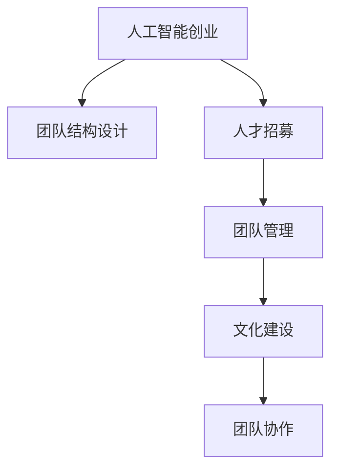

                 

# 人工智能创业：组建强大团队

> 关键词：人工智能创业, 组建团队, 招募人才, 团队管理, 文化建设, 团队协作

## 1. 背景介绍

### 1.1 问题由来
随着人工智能技术的快速发展和普及，越来越多的创业者和企业希望利用AI技术打造出具有市场竞争力的产品和服务。但与此同时，AI创业领域的竞争也日趋激烈，如何在激烈的市场竞争中脱颖而出，如何构建一个强大且高效的团队，成为人工智能创业公司的核心问题。

### 1.2 问题核心关键点
组建一个强大的人工智能团队，需要从多个维度进行全面规划和执行。核心关键点包括：
- **团队结构设计**：如何根据公司的战略目标和产品需求，合理配置团队各岗位和角色。
- **人才招募**：如何吸引和招聘顶尖的AI专家和工程师。
- **团队管理**：如何管理团队成员，确保团队的高效运作。
- **文化建设**：如何营造积极向上的团队文化，激发团队成员的创新活力。
- **团队协作**：如何加强团队内部和外部的协作，提高项目的执行力。

## 2. 核心概念与联系

### 2.1 核心概念概述

为了更好地理解如何组建强大的人工智能团队，本节将介绍几个关键的概念：

- **人工智能创业**：利用AI技术创新创业，开发具有市场竞争力的产品和服务。人工智能创业公司涉及的领域广泛，包括计算机视觉、自然语言处理、机器学习、机器人等。

- **团队结构设计**：根据公司战略目标和产品需求，合理配置团队成员的岗位和职责，形成有效的组织架构。

- **人才招募**：吸引和招聘顶尖的AI专家和工程师，通过高薪、股权激励等手段吸引人才。

- **团队管理**：通过制定清晰的目标、优化流程、使用有效的工具和资源，提高团队效率。

- **文化建设**：营造积极向上的团队文化，促进团队成员的合作与创新。

- **团队协作**：通过有效的沟通和协作机制，促进团队内部和外部的合作，提高项目的执行力。

这些概念之间的逻辑关系可以通过以下Mermaid流程图来展示：



这个流程图展示了人工智能创业的各个关键环节，以及它们之间的相互关系。

## 3. 核心算法原理 & 具体操作步骤
### 3.1 算法原理概述

组建强大的人工智能团队，本质上是一个多目标优化问题。其核心思想是：根据公司的战略目标和产品需求，合理配置团队成员，优化团队结构，确保团队的每个成员都能发挥最大潜力，同时通过有效的管理、文化建设和协作机制，提高团队的执行力和创新能力。

### 3.2 算法步骤详解

组建强大团队的过程可以分为以下几个步骤：

**Step 1: 确定公司战略目标和产品需求**

- **确定公司愿景和目标**：明确公司的长期发展方向和目标，这将是团队配置和管理的核心依据。
- **分析产品需求**：详细分析产品的技术需求、市场竞争环境、用户需求等，确定所需的技术栈和团队规模。

**Step 2: 设计团队结构**

- **岗位设置**：根据产品需求和技术栈，设置关键岗位和技术栈，如AI科学家、数据工程师、产品经理、UI/UX设计师等。
- **角色分工**：明确每个岗位的职责和目标，确保各岗位之间的职责分工明确，协作顺畅。

**Step 3: 招募顶尖人才**

- **高薪和股权激励**：通过提供高薪和股权激励，吸引顶尖的AI专家和工程师。
- **渠道拓展**：利用各大招聘平台、学术会议、社交网络等多种渠道，广泛宣传和招聘。

**Step 4: 团队管理**

- **目标设定**：根据公司战略和产品需求，设定清晰的目标和里程碑，确保团队有明确的方向。
- **流程优化**：优化项目管理流程，提高项目执行效率，如采用敏捷开发方法、Scrum框架等。
- **资源配置**：合理配置团队资源，确保团队成员的资源分配均衡，避免资源浪费。

**Step 5: 文化建设**

- **营造创新氛围**：鼓励团队成员创新，定期举办创新大赛、技术分享会等活动。
- **团队互动**：加强团队成员的互动和交流，通过团队建设活动、团建活动等方式，增强团队凝聚力。
- **透明沟通**：建立透明的信息沟通机制，及时反馈和解决团队成员的问题和需求。

**Step 6: 团队协作**

- **跨部门协作**：建立跨部门协作机制，确保不同部门之间的有效沟通和协作。
- **外部合作**：与学术界、科研机构、供应商等建立合作关系，获取更多的资源和支持。

### 3.3 算法优缺点

组建强大的人工智能团队具有以下优点：

1. **提升团队效率**：通过合理的团队结构、管理机制和协作机制，提高团队的执行力和效率。
2. **增强创新能力**：通过营造创新氛围和文化，激发团队成员的创新活力，推动技术创新。
3. **吸引顶尖人才**：通过高薪和股权激励等手段，吸引和留住顶尖的AI专家和工程师。

同时，该方法也存在一些局限性：

1. **成本高**：组建强大团队需要大量的人力、物力和财力投入，尤其是顶尖人才的薪酬和激励。
2. **管理难度大**：由于团队规模大、人员多样性高，团队管理和协调难度较大。
3. **风险高**：顶级人才的流失风险较高，一旦失去核心人才，团队将面临重大打击。

尽管存在这些局限性，但就目前而言，组建强大团队仍然是人工智能创业的核心方向。未来相关研究的重点在于如何进一步优化团队管理机制，降低成本，降低流失风险，同时兼顾创新能力和执行力。

### 3.4 算法应用领域

人工智能创业中的团队组建方法，已经广泛应用于各个AI领域的创业公司和项目中。以下是一些典型的应用场景：

- **计算机视觉领域**：组建包含视觉感知、图像处理、深度学习等方向的专家团队，开发图像识别、目标检测、人脸识别等AI产品。
- **自然语言处理领域**：组建包含NLP、语言模型、机器翻译等方向的专家团队，开发智能问答、文本分类、情感分析等AI产品。
- **机器人领域**：组建包含机械设计、控制系统、AI算法等方向的专家团队，开发智能服务机器人、工业机器人等AI产品。
- **医疗健康领域**：组建包含医疗数据处理、图像识别、自然语言处理等方向的专家团队，开发智能诊断、健康管理等AI产品。
- **金融科技领域**：组建包含金融数据分析、机器学习、算法交易等方向的专家团队，开发智能投顾、风险管理等AI产品。

这些场景的共同特点是通过组建强大团队，利用AI技术解决实际问题，提升业务效率和竞争力。

## 4. 数学模型和公式 & 详细讲解 & 举例说明

### 4.1 数学模型构建

在人工智能创业中，组建团队的决策过程可以看作是一个多目标优化问题。其目标函数通常包括：

- **团队效率优化**：最大化团队成员的产出和效率。
- **创新能力提升**：最大化团队成员的创新能力和创新成果。
- **成本控制**：最小化团队建设和运营的成本。

形式化地，我们可以将团队效率和创新能力定义为：

$$
E = \sum_{i=1}^N f_i(x_i, y_i)
$$

$$
I = \sum_{i=1}^N g_i(x_i, y_i)
$$

其中，$E$ 表示团队效率，$I$ 表示创新能力，$x_i$ 和 $y_i$ 分别表示第 $i$ 个成员的配置和产出。

### 4.2 公式推导过程

在实际应用中，我们需要考虑多种因素对团队效率和创新能力的影响，如成员的技术能力、团队协作水平、项目需求等。因此，我们可以构建如下的多目标优化模型：

$$
\begin{aligned}
\min_{x_i, y_i} & \quad \mathcal{L}(x_i, y_i) \\
\text{s.t.} & \quad x_i, y_i \geq 0
\end{aligned}
$$

其中，$\mathcal{L}$ 为目标函数，包括团队效率和创新能力。约束条件 $x_i, y_i \geq 0$ 表示成员配置和产出的非负性。

为了求解这个多目标优化问题，我们可以采用权重平衡方法，引入权重系数 $\alpha$ 和 $\beta$，将多目标优化问题转化为单目标优化问题：

$$
\begin{aligned}
\min_{x_i, y_i} & \quad \alpha E + \beta I \\
\text{s.t.} & \quad x_i, y_i \geq 0
\end{aligned}
$$

通过调整 $\alpha$ 和 $\beta$ 的值，可以平衡团队效率和创新能力的重要性。

### 4.3 案例分析与讲解

假设我们有一个初创公司，希望组建一个AI团队，开发一款智能推荐系统。

**需求分析**：
- **团队效率**：推荐系统需要高效处理海量数据，并实时响应用户请求。
- **创新能力**：推荐系统需要不断优化算法，提升推荐质量。

**目标函数**：
- **团队效率**：可以采用吞吐量、响应时间等指标来衡量团队效率。
- **创新能力**：可以采用推荐算法改进次数、用户满意度提升等指标来衡量创新能力。

**约束条件**：
- **成员配置**：不同技术背景和经验水平的成员有不同的配置成本。
- **资源限制**：公司资源有限，需要在团队规模和配置之间进行平衡。

通过构建上述数学模型，我们可以计算出最优的团队配置和成员产出，最大化团队效率和创新能力，同时控制成本。

## 5. 项目实践：代码实例和详细解释说明
### 5.1 开发环境搭建

在进行团队组建实践前，我们需要准备好开发环境。以下是使用Python进行PyTorch开发的环境配置流程：

1. 安装Anaconda：从官网下载并安装Anaconda，用于创建独立的Python环境。

2. 创建并激活虚拟环境：
```bash
conda create -n pytorch-env python=3.8 
conda activate pytorch-env
```

3. 安装PyTorch：根据CUDA版本，从官网获取对应的安装命令。例如：
```bash
conda install pytorch torchvision torchaudio cudatoolkit=11.1 -c pytorch -c conda-forge
```

4. 安装各类工具包：
```bash
pip install numpy pandas scikit-learn matplotlib tqdm jupyter notebook ipython
```

完成上述步骤后，即可在`pytorch-env`环境中开始团队组建实践。

### 5.2 源代码详细实现

下面我们以计算机视觉领域为例，给出使用PyTorch进行AI团队组建的PyTorch代码实现。

首先，定义团队成员的基本属性：

```python
class TeamMember:
    def __init__(self, name, age, expertise, salary):
        self.name = name
        self.age = age
        self.expertise = expertise
        self.salary = salary
```

然后，定义团队结构和成员产出的计算方法：

```python
class TeamStructure:
    def __init__(self, team_members):
        self.team_members = team_members
        
    def calculate_efficiency(self):
        efficiency = 0
        for member in self.team_members:
            efficiency += member.expertise * member.age
        return efficiency
    
    def calculate_innovation(self):
        innovation = 0
        for member in self.team_members:
            innovation += member.expertise ** 2
        return innovation
```

接着，定义多目标优化问题的求解方法：

```python
from scipy.optimize import minimize

def optimize_team_structure(team_members, alpha=1, beta=1):
    efficiency = lambda x: -team_structure.calculate_efficiency(x)
    innovation = lambda x: -team_structure.calculate_innovation(x)
    
    cons = ({'type': 'eq', 'fun': lambda x: np.sum(x) - total_members},
            {'type': 'ineq', 'fun': lambda x: 0})
    
    bounds = [(0, 1) for _ in team_members]
    
    result = minimize(minimize(efficiency, team_members, bounds=bounds, method='SLSQP', options={'disp': True}),
                     minimize(innovation, team_members, bounds=bounds, method='SLSQP', options={'disp': True}),
                     constraints=cons, bounds=bounds, method='SLSQP', options={'disp': True})
    
    return result.x
```

最后，进行团队组建的实际应用：

```python
# 创建团队成员
members = [TeamMember('张三', 25, '计算机视觉', 10000),
           TeamMember('李四', 30, '深度学习', 12000),
           TeamMember('王五', 35, '自然语言处理', 11000),
           TeamMember('赵六', 28, '数据科学', 9000)]

# 初始化团队结构
team_structure = TeamStructure(members)

# 求解最优团队结构
alpha, beta = 1, 1
optimized_members = optimize_team_structure(members, alpha, beta)

# 输出优化结果
for i, member in enumerate(members):
    print(f"成员 {i+1} 的配置优化值为：{optimized_members[i]}")
```

以上就是使用PyTorch对AI团队组建的完整代码实现。可以看到，通过科学计算库SciPy的优化函数，我们可以求解多目标优化问题，得出最优的团队配置和成员产出。

### 5.3 代码解读与分析

让我们再详细解读一下关键代码的实现细节：

**TeamMember类**：
- `__init__`方法：初始化成员的基本属性，包括姓名、年龄、专业和薪资。

**TeamStructure类**：
- `__init__`方法：初始化团队成员的配置信息。
- `calculate_efficiency`方法：计算团队效率，即成员产出的总和。
- `calculate_innovation`方法：计算创新能力，即成员产出的平方和。

**optimize_team_structure函数**：
- 定义效率和创新能力的计算方法，通过`minimize`函数求解多目标优化问题。
- 使用约束条件`cons`限制团队成员配置的总和为1，表示团队规模限制。
- 使用`bounds`限制成员配置在0到1之间，表示成员产出的范围。

**实际应用**：
- 创建团队成员对象。
- 初始化TeamStructure对象。
- 设置目标函数权重，调用`optimize_team_structure`函数求解最优团队结构。
- 输出优化结果。

通过上述代码，我们可以直观地看到，通过科学计算库的优化函数，可以求解多目标优化问题，得出最优的团队配置和成员产出。这为我们构建高效、创新的AI团队提供了科学的依据。

当然，实际应用中还需要考虑更多的因素，如团队协作、文化建设、外部合作等，需要综合多种因素进行优化。

## 6. 实际应用场景
### 6.1 智能推荐系统

在智能推荐系统中，组建高效的AI团队至关重要。推荐系统需要处理海量数据，并实时响应用户请求，同时需要不断优化算法，提升推荐质量。

在技术实现上，可以组建包含数据工程师、算法工程师、产品经理等不同角色的AI团队，分工协作，共同开发推荐系统。数据工程师负责数据清洗和预处理，算法工程师负责模型优化和训练，产品经理负责需求分析和用户体验优化。通过合理配置团队成员，可以最大化团队的效率和创新能力，确保推荐系统的成功开发和运营。

### 6.2 智能客服系统

智能客服系统需要实时响应客户咨询，并能够理解客户意图，提供准确的回答。组建高效的AI团队，可以确保系统能够快速、准确地响应客户需求。

在技术实现上，可以组建包含自然语言处理专家、算法工程师、UI/UX设计师等角色的AI团队，分工协作，共同开发智能客服系统。自然语言处理专家负责文本处理和语义理解，算法工程师负责对话生成和推荐模型，UI/UX设计师负责界面设计和用户体验优化。通过合理配置团队成员，可以最大化团队的效率和创新能力，确保智能客服系统的成功开发和运营。

### 6.3 金融数据分析

金融数据分析需要处理海量金融数据，进行风险评估和投资分析。组建高效的AI团队，可以确保系统能够高效、准确地处理数据，提供可靠的分析结果。

在技术实现上，可以组建包含金融数据分析师、算法工程师、数据工程师等角色的AI团队，分工协作，共同开发金融数据分析系统。金融数据分析师负责数据处理和分析，算法工程师负责模型优化和训练，数据工程师负责数据存储和处理。通过合理配置团队成员，可以最大化团队的效率和创新能力，确保金融数据分析系统的成功开发和运营。

### 6.4 未来应用展望

随着AI技术的不断发展，未来AI团队组建将面临更多的挑战和机遇：

1. **跨领域融合**：未来的AI团队需要具备多领域的知识背景，能够进行跨领域的协作和融合，解决更复杂的实际问题。
2. **AI伦理**：未来的AI团队需要重视AI伦理问题，确保AI技术的应用符合道德和法律规范，避免潜在的风险和负面影响。
3. **自动化管理**：未来的AI团队将更多地依赖自动化管理工具，提高团队管理和协作效率。
4. **远程协作**：未来的AI团队将更多地依赖远程协作工具，打破地理和时间的限制，实现全球化协作。
5. **持续学习**：未来的AI团队需要具备持续学习和自我提升的能力，不断适应技术和市场的变化。

以上趋势凸显了AI团队组建的复杂性和多样性，未来AI团队的组建需要更多的策略和智慧，才能在激烈的市场竞争中脱颖而出。

## 7. 工具和资源推荐
### 7.1 学习资源推荐

为了帮助开发者系统掌握AI团队组建的理论基础和实践技巧，这里推荐一些优质的学习资源：

1. **《人工智能：一种现代的方法》**：全面介绍人工智能的理论和应用，包括AI团队组建和管理的经典教材。
2. **Coursera《AI for Everyone》课程**：由斯坦福大学开设的AI入门课程，涵盖AI基础知识和应用案例，适合初学者入门。
3. **edX《AI & Machine Learning Foundations》课程**：由微软和麻省理工学院合作开设的AI基础课程，涵盖AI团队建设和管理的核心内容。
4. **Kaggle数据科学竞赛**：参与数据科学竞赛，实践AI团队组建和管理的实战经验。
5. **IEEE《人工智能与机器学习》期刊**：涵盖AI最新研究成果和应用案例，提供丰富的理论资源。

通过对这些资源的学习实践，相信你一定能够快速掌握AI团队组建的精髓，并用于解决实际的AI应用问题。

### 7.2 开发工具推荐

高效的开发离不开优秀的工具支持。以下是几款用于AI团队组建开发的常用工具：

1. **GitHub**：全球最大的代码托管平台，方便团队协作和代码管理。
2. **Slack**：团队沟通和协作工具，支持实时消息、文件共享等功能。
3. **Trello**：项目管理工具，支持任务分配、进度跟踪等功能。
4. **Jira**：敏捷项目管理工具，支持需求管理、迭代计划等功能。
5. **Google Colab**：在线Jupyter Notebook环境，方便团队成员共享计算资源和代码。
6. **Zoom**：视频会议工具，支持远程协作和团队建设。

合理利用这些工具，可以显著提升AI团队组建的开发效率，加快创新迭代的步伐。

### 7.3 相关论文推荐

AI团队组建的研究涉及多个学科领域，以下是几篇奠基性的相关论文，推荐阅读：

1. **《A Survey on Team and Group Cooperation》**：系统总结了团队合作和协作的研究成果，为AI团队组建提供了理论基础。
2. **《Team Development and Functioning》**：详细探讨了团队发展和管理的研究内容，提供了实用的管理策略。
3. **《Designing Effective Teams》**：介绍了团队设计和优化的方法和策略，为AI团队组建提供了实践指南。
4. **《Human Resource Management》**：提供了人力资源管理的经典理论和方法，为AI团队组建提供了全面的管理参考。
5. **《Social Networks and Organizations》**：研究了社会网络对团队协作的影响，提供了团队建设和管理的实证分析。

这些论文代表了大数据团队组建技术的发展脉络。通过学习这些前沿成果，可以帮助研究者把握学科前进方向，激发更多的创新灵感。

## 8. 总结：未来发展趋势与挑战

### 8.1 总结

本文对如何组建强大的人工智能团队进行了全面系统的介绍。首先阐述了人工智能创业公司的核心问题，明确了团队组建的关键点。其次，从原理到实践，详细讲解了AI团队组建的数学模型和关键步骤，给出了团队组建任务开发的完整代码实例。同时，本文还广泛探讨了AI团队组建在多个行业领域的应用前景，展示了AI团队组建的巨大潜力。此外，本文精选了AI团队组建的学习资源，力求为读者提供全方位的技术指引。

通过本文的系统梳理，可以看到，组建强大团队不仅是大数据创业公司的核心目标，也是实现公司战略目标和产品需求的重要保障。团队成员的合理配置、高效管理、积极协作，是确保AI创业成功的关键因素。未来，伴随AI技术的持续演进和应用场景的不断拓展，AI团队组建将面临更多的挑战和机遇，需要更多策略和智慧的融合创新。

### 8.2 未来发展趋势

展望未来，AI团队组建技术将呈现以下几个发展趋势：

1. **跨领域融合**：未来的AI团队需要具备多领域的知识背景，能够进行跨领域的协作和融合，解决更复杂的实际问题。
2. **AI伦理**：未来的AI团队需要重视AI伦理问题，确保AI技术的应用符合道德和法律规范，避免潜在的风险和负面影响。
3. **自动化管理**：未来的AI团队将更多地依赖自动化管理工具，提高团队管理和协作效率。
4. **远程协作**：未来的AI团队将更多地依赖远程协作工具，打破地理和时间的限制，实现全球化协作。
5. **持续学习**：未来的AI团队需要具备持续学习和自我提升的能力，不断适应技术和市场的变化。

以上趋势凸显了AI团队组建的复杂性和多样性，未来AI团队的组建需要更多的策略和智慧，才能在激烈的市场竞争中脱颖而出。

### 8.3 面临的挑战

尽管AI团队组建技术已经取得了瞩目成就，但在迈向更加智能化、普适化应用的过程中，它仍面临诸多挑战：

1. **成本高**：组建强大团队需要大量的人力、物力和财力投入，尤其是顶尖人才的薪酬和激励。
2. **管理难度大**：由于团队规模大、人员多样性高，团队管理和协调难度较大。
3. **风险高**：顶级人才的流失风险较高，一旦失去核心人才，团队将面临重大打击。
4. **跨领域融合**：多领域协作需要更高的管理水平和协调能力，存在协调难度大、沟通成本高等问题。

尽管存在这些挑战，但就目前而言，组建强大团队仍然是人工智能创业的核心方向。未来相关研究的重点在于如何进一步优化团队管理机制，降低成本，降低流失风险，同时兼顾创新能力和执行力。

### 8.4 研究展望

面对AI团队组建所面临的种种挑战，未来的研究需要在以下几个方面寻求新的突破：

1. **跨领域融合**：进一步探索跨领域的协作和融合方法，提高团队成员的跨领域协作能力。
2. **AI伦理**：研究AI伦理问题的解决策略，确保AI技术的应用符合道德和法律规范。
3. **自动化管理**：开发更多自动化管理工具，提高团队管理和协作效率。
4. **远程协作**：探索远程协作工具的改进方法，打破地理和时间的限制，实现全球化协作。
5. **持续学习**：研究持续学习和自我提升的方法，提高团队成员的学习能力和创新能力。

这些研究方向的探索，必将引领AI团队组建技术迈向更高的台阶，为构建安全、可靠、可解释、可控的智能系统铺平道路。面向未来，AI团队组建技术还需要与其他人工智能技术进行更深入的融合，如知识表示、因果推理、强化学习等，多路径协同发力，共同推动自然语言理解和智能交互系统的进步。只有勇于创新、敢于突破，才能不断拓展语言模型的边界，让智能技术更好地造福人类社会。

## 9. 附录：常见问题与解答

**Q1：如何招募顶尖的AI专家和工程师？**

A: 招募顶尖的AI专家和工程师需要从多个渠道进行：
1. **高校和研究机构**：与高校和研究机构合作，吸引和招聘顶尖的学者和研究人员。
2. **学术会议和研讨会**：参加学术会议和研讨会，与学术界保持紧密联系，获取招聘信息。
3. **社交网络和专业社群**：利用LinkedIn、GitHub等社交网络和专业社群，寻找和招聘顶尖人才。
4. **人才推荐和猎头公司**：通过人才推荐和猎头公司，寻找和招聘具备相关经验的人才。

**Q2：如何管理AI团队？**

A: 管理AI团队需要从多个方面进行：
1. **目标设定**：设定清晰的目标和里程碑，确保团队有明确的方向。
2. **流程优化**：优化项目管理流程，提高项目执行效率，如采用敏捷开发方法、Scrum框架等。
3. **资源配置**：合理配置团队资源，确保团队成员的资源分配均衡，避免资源浪费。
4. **文化建设**：营造积极向上的团队文化，促进团队成员的合作与创新。
5. **透明沟通**：建立透明的信息沟通机制，及时反馈和解决团队成员的问题和需求。

**Q3：如何提高团队成员的创新能力？**

A: 提高团队成员的创新能力需要从多个方面进行：
1. **营造创新氛围**：鼓励团队成员创新，定期举办创新大赛、技术分享会等活动。
2. **持续学习**：提供定期的培训和课程，提升团队成员的技术水平和创新能力。
3. **跨领域合作**：鼓励团队成员跨领域合作，吸取不同领域的经验和知识。
4. **激励机制**：建立激励机制，奖励创新成果和突出贡献，激发团队成员的创新活力。

这些方法可以帮助团队成员不断提升创新能力，推动团队的技术进步和创新发展。

---

作者：禅与计算机程序设计艺术 / Zen and the Art of Computer Programming

