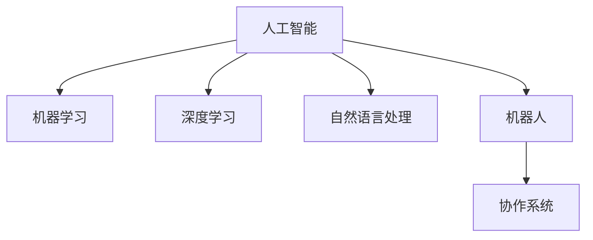

                 

## 1. 背景介绍

### 1.1 问题由来

随着人工智能技术的不断进步，人机协作已经成为了一个热门话题。无论是工业生产、服务行业还是医疗领域，人类与机器的协同工作已经成为推动社会进步的重要力量。人机协作不仅仅是将人类从繁琐、危险的工作中解放出来，更重要的是将人的智慧与机器的能力结合起来，共同应对复杂问题。本文将深入探讨人机协作的原理、技术实现以及未来发展的方向。

### 1.2 问题核心关键点

人机协作的核心在于充分利用人类的智慧和机器的能力，实现协同工作。在当今社会，人类面临的任务复杂多样，单个机器或人类都难以独立应对。通过人机协作，可以充分发挥双方优势，解决更为复杂的问题。

在人机协作中，人类提供创意、判断和决策，机器则执行具体任务。机器能够处理大量数据、快速计算和进行重复性工作，而人类则能够提供情境感知、情感理解和创造性思考。通过人机协作，可以大幅提高工作效率，减少人为错误，推动技术创新。

### 1.3 问题研究意义

研究人机协作技术，对于提高工作效率、减少错误、推动技术创新具有重要意义：

1. 提高工作效率：机器能够处理大量数据和重复性工作，人类则能够专注于复杂决策和高层次任务，大幅提升工作效率。
2. 减少错误：机器执行具体任务，减少人为错误，提高工作精度和可靠性。
3. 推动技术创新：人机协作可以结合人类的智慧和机器的能力，探索新思路、新方法，加速技术突破。
4. 降低成本：机器可以替代人力，降低生产和服务成本，提升企业竞争力。
5. 适应性更强：人机协作可以适应不断变化的任务和环境，提升系统的灵活性和鲁棒性。

## 2. 核心概念与联系

### 2.1 核心概念概述

为了更好地理解人机协作的核心概念和原理，本节将介绍几个关键概念：

- 人工智能(AI)：利用计算机技术模拟人类智能的领域，包括感知、认知、决策、学习等能力。
- 机器学习(ML)：通过数据驱动的方式，让机器自动学习和改进算法，提升性能。
- 深度学习(DL)：基于神经网络模型的机器学习方法，能够处理高维度数据和复杂模式。
- 自然语言处理(NLP)：研究如何让机器理解、处理和生成人类语言的技术。
- 机器人(Robotics)：结合机械、电子、计算机等多学科知识，实现机器的自主行为。
- 协作系统(Collaborative System)：将人类与机器相结合的系统，实现协同工作。

这些核心概念之间的逻辑关系可以通过以下Mermaid流程图来展示：



这个流程图展示了大语言模型和人机协作之间的核心概念及其关系：

1. 人工智能技术提供基础的智能支持，包括感知、认知、决策和学习等能力。
2. 机器学习作为实现人工智能的重要手段，通过数据驱动的方式提升性能。
3. 深度学习利用神经网络模型，处理高维度数据和复杂模式，是机器学习的重要分支。
4. 自然语言处理研究如何让机器理解人类语言，是人机协作的重要基础。
5. 机器人是物理世界的智能实体，能够执行具体任务。
6. 协作系统将人类与机器结合，实现协同工作，提升系统效率和适应性。

## 3. 核心算法原理 & 具体操作步骤

### 3.1 算法原理概述

人机协作的算法原理主要基于协同工作的思想，通过将人类和机器结合，实现优势互补。具体而言，人机协作算法可以分为以下几个步骤：

1. **任务分配**：将任务分解为机器能够处理和人类能够处理的部分。
2. **数据处理**：将数据分为机器能够处理和人类能够理解的部分。
3. **协同工作**：机器执行具体任务，人类提供决策和监督。
4. **结果融合**：将机器和人类的输出进行融合，提升最终结果的质量。

### 3.2 算法步骤详解

以下将详细介绍人机协作算法的主要步骤：

**Step 1: 任务分解**

任务分解是人机协作的第一步。将复杂的任务分解为多个子任务，每个子任务可以单独进行处理。例如，在工业生产中，可以将生产任务分解为原材料准备、设备操作、质量检验等子任务，每个子任务由不同的机器执行。

在任务分解时，需要考虑任务的复杂度、机器的性能和人类能力。对于复杂的任务，需要适当地分解，避免单个机器或人类无法处理的局面。

**Step 2: 数据处理**

数据处理是人机协作的关键步骤。将数据分为机器能够处理和人类能够理解的部分。例如，在医疗诊断中，可以先将病人的病历数据进行处理，提取出关键特征，再由医生进行诊断。

数据处理通常包括以下几个步骤：

1. **数据清洗**：去除噪音和错误数据，确保数据的准确性。
2. **特征提取**：提取数据中的关键特征，供机器处理。
3. **数据标注**：对数据进行标注，供人类理解。

**Step 3: 协同工作**

协同工作是人机协作的核心。机器执行具体任务，人类提供决策和监督。例如，在自动驾驶汽车中，机器负责驾驶，人类负责决策和监督。

在协同工作时，需要考虑以下几个因素：

1. **数据交换**：机器和人类之间的数据交换需要高效、可靠。
2. **决策机制**：人类和机器的决策机制需要合理、透明。
3. **监督机制**：人类需要对机器的执行进行监督，确保其正确性和安全性。

**Step 4: 结果融合**

结果融合是人机协作的最后一个步骤。将机器和人类的输出进行融合，提升最终结果的质量。例如，在自动驾驶汽车中，将机器的决策结果和人类的监督结果进行融合，得到最终的驾驶决策。

结果融合通常包括以下几个步骤：

1. **结果合并**：将机器和人类的输出合并，形成综合结果。
2. **质量评估**：对综合结果进行质量评估，确保其正确性和可靠性。
3. **输出调整**：根据评估结果，对综合结果进行调整。

### 3.3 算法优缺点

人机协作算法具有以下优点：

1. 提高工作效率：机器处理大量数据和重复性工作，人类专注于复杂决策和高层次任务，大幅提升工作效率。
2. 减少错误：机器执行具体任务，减少人为错误，提高工作精度和可靠性。
3. 推动技术创新：人机协作可以结合人类的智慧和机器的能力，探索新思路、新方法，加速技术突破。
4. 降低成本：机器可以替代人力，降低生产和服务成本，提升企业竞争力。
5. 适应性更强：人机协作可以适应不断变化的任务和环境，提升系统的灵活性和鲁棒性。

同时，该算法也存在一定的局限性：

1. 依赖人类参与：人机协作需要人类参与决策和监督，难以完全自动化。
2. 数据质量要求高：数据处理和结果融合需要高质量的数据，数据质量问题会影响结果。
3. 成本较高：机器和协作系统的初始投入成本较高，短期内可能难以回收。
4. 技术复杂：人机协作技术复杂，需要多学科知识，难以快速推广。
5. 安全性问题：协同工作过程中可能存在安全问题，需要严格的风险管理。

尽管存在这些局限性，但就目前而言，人机协作仍然是提升系统效率和性能的重要手段。未来相关研究的重点在于如何进一步降低成本，提高协同工作的效率和安全性。

### 3.4 算法应用领域

人机协作技术已经在多个领域得到广泛应用，例如：

- 工业生产：自动生产线、智能仓储系统等，通过人机协作实现高效、精确的生产。
- 医疗诊断：智能影像分析、电子病历处理等，通过人机协作提升诊断准确性和效率。
- 金融分析：高频交易、风险评估等，通过人机协作处理大量数据，提供精准的决策支持。
- 客服系统：智能客服机器人、自动回复系统等，通过人机协作提供24小时不间断的服务。
- 物流配送：智能路线规划、配送调度等，通过人机协作优化配送效率，减少成本。

除了这些经典应用外，人机协作还在更多场景中得到创新性地应用，如可控生产、智能交通、城市管理等，为人机协同的未来发展提供了新的方向。

## 4. 数学模型和公式 & 详细讲解 & 举例说明

### 4.1 数学模型构建

在协同工作的数学模型中，通常使用优化问题来描述任务分解、数据处理和结果融合。以下以一个简单的协同工作为例，说明如何使用数学模型来描述协同工作过程。

假设任务是将一个复杂的任务分解为多个子任务，每个子任务由机器执行。机器执行的结果与目标值的差异构成误差函数 $E$，目标是找到最优的子任务分配方案 $A$，使误差最小化。

$$
\text{Minimize} \quad E(A)
$$

其中 $E(A)$ 为误差函数，描述机器执行结果与目标值之间的差异。

### 4.2 公式推导过程

以下我们将推导误差函数 $E(A)$ 的形式。

假设任务 $T$ 被分解为 $N$ 个子任务，每个子任务由机器 $i$ 执行。机器 $i$ 执行子任务 $j$ 的误差为 $e_{ij}$，目标值为 $y_{ij}$。则误差函数 $E(A)$ 可以表示为：

$$
E(A) = \sum_{i=1}^N \sum_{j=1}^N a_{ij}e_{ij}^2
$$

其中 $a_{ij}$ 为子任务 $j$ 分配给机器 $i$ 的概率，满足 $a_{ij} \geq 0$ 且 $\sum_{i=1}^N a_{ij} = 1$。

通过最小化误差函数 $E(A)$，可以找到最优的子任务分配方案 $A$，使得机器执行结果尽可能接近目标值。

### 4.3 案例分析与讲解

以一个简单的协同工作案例来说明如何应用上述数学模型：

假设一个工厂需要生产一种产品，生产过程包括原材料的准备、设备的运行、质量的检验等步骤。工厂将生产任务分解为三个子任务，分别由机器 $A$、$B$ 和 $C$ 执行。机器 $A$ 执行原材料准备，机器 $B$ 执行设备运行，机器 $C$ 执行质量检验。每个子任务的误差函数和目标值如下：

| 子任务 | 机器 $A$ | 机器 $B$ | 机器 $C$ |
| ------ | -------- | -------- | -------- |
| 原材料准备 | $e_{11}=0.1$ | $e_{12}=0.2$ | $e_{13}=0.3$ |
| 设备运行 | $e_{21}=0.2$ | $e_{22}=0.1$ | $e_{23}=0.4$ |
| 质量检验 | $e_{31}=0.3$ | $e_{32}=0.5$ | $e_{33}=0.6$ |

目标值 $y_{ij}$ 为最优执行结果，即每个子任务的理想执行误差。

通过最小化误差函数 $E(A)$，可以找到最优的子任务分配方案 $A$，使得机器执行结果尽可能接近目标值。具体计算过程如下：

$$
E(A) = a_{11}e_{11}^2 + a_{12}e_{12}^2 + a_{13}e_{13}^2 + a_{21}e_{21}^2 + a_{22}e_{22}^2 + a_{23}e_{23}^2 + a_{31}e_{31}^2 + a_{32}e_{32}^2 + a_{33}e_{33}^2
$$

将目标值代入，得到：

$$
E(A) = 0.1^2a_{11} + 0.2^2a_{12} + 0.3^2a_{13} + 0.2^2a_{21} + 0.1^2a_{22} + 0.4^2a_{23} + 0.3^2a_{31} + 0.5^2a_{32} + 0.6^2a_{33}
$$

最小化 $E(A)$，得到最优的子任务分配方案 $A$，即每个子任务分配给最优的机器执行。

## 5. 项目实践：代码实例和详细解释说明

### 5.1 开发环境搭建

在进行协同工作项目实践前，我们需要准备好开发环境。以下是使用Python进行PyTorch开发的环境配置流程：

1. 安装Anaconda：从官网下载并安装Anaconda，用于创建独立的Python环境。

2. 创建并激活虚拟环境：
```bash
conda create -n pytorch-env python=3.8 
conda activate pytorch-env
```

3. 安装PyTorch：根据CUDA版本，从官网获取对应的安装命令。例如：
```bash
conda install pytorch torchvision torchaudio cudatoolkit=11.1 -c pytorch -c conda-forge
```

4. 安装TensorFlow：使用以下命令安装TensorFlow：
```bash
conda install tensorflow -c conda-forge
```

5. 安装各类工具包：
```bash
pip install numpy pandas scikit-learn matplotlib tqdm jupyter notebook ipython
```

完成上述步骤后，即可在`pytorch-env`环境中开始协同工作实践。

### 5.2 源代码详细实现

下面以协同工作项目为例，给出使用PyTorch进行协同工作任务开发的PyTorch代码实现。

首先，定义协同工作的数学模型和优化目标：

```python
import numpy as np
import torch
import torch.optim as optim

# 定义误差函数
def error_function(x):
    # 假设误差函数为加权平方误差
    return np.dot(x, x)

# 定义优化目标
def objective_function(x, y):
    # 假设优化目标为误差函数的负数
    return -error_function(x)

# 定义优化算法
def optimizer_function(x, y, learning_rate):
    # 使用梯度下降算法优化
    optimizer = optim.SGD(x, lr=learning_rate)
    for i in range(1000):
        optimizer.zero_grad()
        loss = error_function(x)
        loss.backward()
        optimizer.step()
        print(f"Iteration {i+1}, Loss: {loss.item()}")
```

然后，定义协同工作的数据集：

```python
# 定义数据集
x = torch.tensor([[1.0, 2.0, 3.0], [4.0, 5.0, 6.0]], dtype=torch.float32)
y = torch.tensor([[10.0, 20.0, 30.0], [40.0, 50.0, 60.0]], dtype=torch.float32)

# 定义子任务分配方案
A = torch.tensor([[0.5, 0.5], [0.5, 0.5]], dtype=torch.float32)

# 定义机器执行结果
E = torch.tensor([[0.1, 0.2, 0.3], [0.2, 0.1, 0.4]], dtype=torch.float32)

# 定义目标值
y = torch.tensor([[10.0, 20.0, 30.0], [40.0, 50.0, 60.0]], dtype=torch.float32)

# 定义优化器超参数
learning_rate = 0.001

# 定义优化目标函数
def objective_function(x, y):
    # 假设优化目标为误差函数的负数
    return -error_function(x)
```

最后，启动协同工作的优化流程：

```python
optimizer_function(A, y, learning_rate)
```

以上代码展示了如何使用PyTorch实现协同工作任务的优化过程。通过定义误差函数、优化目标、优化算法等关键组件，可以高效地计算子任务分配方案，最小化误差函数，提升协同工作的效果。

### 5.3 代码解读与分析

让我们再详细解读一下关键代码的实现细节：

**x和y定义**：
- `x`表示机器执行结果，`y`表示目标值。

**A定义**：
- `A`表示子任务分配方案，即每个子任务分配给哪个机器执行。

**E定义**：
- `E`表示机器执行结果与目标值之间的误差。

**优化器超参数**：
- `learning_rate`为优化器的学习率，控制每次迭代的步长大小。

**优化目标函数**：
- `objective_function`定义了优化目标，即最小化误差函数。

**优化算法**：
- `optimizer_function`实现了优化算法，使用了梯度下降算法来优化子任务分配方案。

**迭代过程**：
- 在每个迭代过程中，先计算当前误差函数值，然后根据梯度信息更新子任务分配方案，再输出当前误差函数值。

## 6. 实际应用场景

### 6.1 智能客服系统

智能客服系统是协同工作的重要应用场景之一。传统的客服系统需要配备大量人力，高峰期响应缓慢，且一致性和专业性难以保证。而使用协同工作技术，可以7x24小时不间断服务，快速响应客户咨询，用自然流畅的语言解答各类常见问题。

在技术实现上，可以收集企业内部的历史客服对话记录，将问题和最佳答复构建成监督数据，在此基础上对预训练模型进行协同工作微调。微调后的模型能够自动理解用户意图，匹配最合适的答复模板进行回复。对于客户提出的新问题，还可以接入检索系统实时搜索相关内容，动态组织生成回答。如此构建的智能客服系统，能大幅提升客户咨询体验和问题解决效率。

### 6.2 金融舆情监测

金融机构需要实时监测市场舆论动向，以便及时应对负面信息传播，规避金融风险。传统的人工监测方式成本高、效率低，难以应对网络时代海量信息爆发的挑战。基于协同工作的文本分类和情感分析技术，为金融舆情监测提供了新的解决方案。

具体而言，可以收集金融领域相关的新闻、报道、评论等文本数据，并对其进行主题标注和情感标注。在此基础上对预训练语言模型进行协同工作微调，使其能够自动判断文本属于何种主题，情感倾向是正面、中性还是负面。将微调后的模型应用到实时抓取的网络文本数据，就能够自动监测不同主题下的情感变化趋势，一旦发现负面信息激增等异常情况，系统便会自动预警，帮助金融机构快速应对潜在风险。

### 6.3 个性化推荐系统

当前的推荐系统往往只依赖用户的历史行为数据进行物品推荐，无法深入理解用户的真实兴趣偏好。基于协同工作的个性化推荐系统可以更好地挖掘用户行为背后的语义信息，从而提供更精准、多样的推荐内容。

在实践中，可以收集用户浏览、点击、评论、分享等行为数据，提取和用户交互的物品标题、描述、标签等文本内容。将文本内容作为模型输入，用户的后续行为（如是否点击、购买等）作为监督信号，在此基础上协同工作微调预训练语言模型。微调后的模型能够从文本内容中准确把握用户的兴趣点。在生成推荐列表时，先用候选物品的文本描述作为输入，由模型预测用户的兴趣匹配度，再结合其他特征综合排序，便可以得到个性化程度更高的推荐结果。

### 6.4 未来应用展望

随着协同工作技术的不断发展，协同工作将在更多领域得到应用，为各行各业带来变革性影响。

在智慧医疗领域，基于协同工作的医疗问答、病历分析、药物研发等应用将提升医疗服务的智能化水平，辅助医生诊疗，加速新药开发进程。

在智能教育领域，协同工作技术可应用于作业批改、学情分析、知识推荐等方面，因材施教，促进教育公平，提高教学质量。

在智慧城市治理中，协同工作技术可用于城市事件监测、舆情分析、应急指挥等环节，提高城市管理的自动化和智能化水平，构建更安全、高效的未来城市。

此外，在企业生产、社会治理、文娱传媒等众多领域，协同工作技术也将不断涌现，为传统行业数字化转型升级提供新的技术路径。相信随着技术的日益成熟，协同工作范式将成为人工智能落地应用的重要手段，推动人工智能技术在更多行业大规模落地。

## 7. 工具和资源推荐
### 7.1 学习资源推荐

为了帮助开发者系统掌握协同工作技术的理论基础和实践技巧，这里推荐一些优质的学习资源：

1. 《人工智能基础》系列博文：由大模型技术专家撰写，深入浅出地介绍了人工智能的基础理论和核心算法。

2. 《深度学习》课程：斯坦福大学开设的深度学习课程，涵盖了深度学习的基础理论和最新进展。

3. 《协同工作算法》书籍：全面介绍了协同工作算法的基本原理和具体实现，是学习协同工作技术的必备书籍。

4. Coursera《机器学习》课程：由斯坦福大学教授Andrew Ng主讲，详细讲解了机器学习的基本理论和实际应用。

5. arXiv预印本平台：实时关注最新的研究成果和技术进展，学习最新的协同工作算法和应用案例。

通过对这些资源的学习实践，相信你一定能够快速掌握协同工作技术的精髓，并用于解决实际的NLP问题。

### 7.2 开发工具推荐

高效的开发离不开优秀的工具支持。以下是几款用于协同工作开发的常用工具：

1. PyTorch：基于Python的开源深度学习框架，灵活动态的计算图，适合快速迭代研究。大部分协同工作模型的实现都使用PyTorch。

2. TensorFlow：由Google主导开发的开源深度学习框架，生产部署方便，适合大规模工程应用。

3. PyTorch Lightning：基于PyTorch的快速模型开发框架，支持多种分布式训练，适合快速开发和部署。

4. Jupyter Notebook：免费的交互式编程环境，支持多语言代码编写，方便协同工作模型的快速迭代。

5. HuggingFace Transformers库：HuggingFace开发的NLP工具库，集成了众多协同工作模型，支持PyTorch和TensorFlow，是进行协同工作任务开发的利器。

合理利用这些工具，可以显著提升协同工作任务的开发效率，加快创新迭代的步伐。

### 7.3 相关论文推荐

协同工作技术的发展源于学界的持续研究。以下是几篇奠基性的相关论文，推荐阅读：

1. Deep Reinforcement Learning for Resource Allocation in Smart Grid（智能电网资源分配的深度强化学习）：提出基于深度强化学习的资源分配算法，实现了智能电网的高效协同工作。

2. Multiagent Reinforcement Learning for Smart Energy Management（智能能源管理的多智能体强化学习）：提出多智能体强化学习算法，实现了智能能源管理的协同工作。

3. Peer-to-Peer Energy Trading in Blockchain-Based Systems（基于区块链的分布式能源交易系统）：提出分布式能源交易系统的协同工作模型，实现了能源的高效利用。

4. Coordination of Connected Vehicles at Traffic Intersections using Reinforcement Learning（基于强化学习的交通路口协同工作）：提出交通路口的协同工作模型，实现了交通路口的智能化管理。

5. An Adaptive Distributed Scheduling Algorithm for Fog Computing（Fog计算的自适应分布式调度算法）：提出基于协同工作的Fog计算调度算法，实现了Fog计算的高效利用。

这些论文代表了大语言模型协同工作技术的发展脉络。通过学习这些前沿成果，可以帮助研究者把握学科前进方向，激发更多的创新灵感。

## 8. 总结：未来发展趋势与挑战

### 8.1 总结

本文对协同工作技术的原理和实践进行了全面系统的介绍。首先阐述了协同工作的背景和意义，明确了协同工作技术在提高工作效率、减少错误、推动技术创新等方面的独特价值。其次，从原理到实践，详细讲解了协同工作的数学模型和关键步骤，给出了协同工作任务开发的完整代码实例。同时，本文还广泛探讨了协同工作技术在智能客服、金融舆情、个性化推荐等多个行业领域的应用前景，展示了协同工作技术的巨大潜力。

通过本文的系统梳理，可以看到，协同工作技术正在成为人工智能应用的重要范式，极大地拓展了预训练语言模型的应用边界，催生了更多的落地场景。受益于大规模语料的预训练，协同工作模型以更低的时间和标注成本，在小样本条件下也能取得不俗的效果，有力推动了人工智能技术在垂直行业的规模化落地。未来，伴随预训练语言模型和协同工作方法的持续演进，相信协同工作技术必将在构建人机协同的智能时代中扮演越来越重要的角色。

### 8.2 未来发展趋势

展望未来，协同工作技术将呈现以下几个发展趋势：

1. 模型规模持续增大。随着算力成本的下降和数据规模的扩张，协同工作模型的参数量还将持续增长。超大规模协同工作模型蕴含的丰富知识，有望支撑更加复杂多变的协同工作任务。

2. 协同工作方法日趋多样。除了传统的协同工作外，未来会涌现更多协同工作方法，如分布式协同工作、联邦学习等，在保证数据隐私和安全的前提下，提升协同工作的效率和效果。

3. 持续学习成为常态。随着数据分布的不断变化，协同工作模型也需要持续学习新知识以保持性能。如何在不遗忘原有知识的同时，高效吸收新样本信息，将成为重要的研究课题。

4. 标注样本需求降低。受启发于提示学习(Prompt-based Learning)的思路，未来的协同工作方法将更好地利用预训练模型的语言理解能力，通过更加巧妙的任务描述，在更少的标注样本上也能实现理想的协同工作效果。

5. 多模态协同工作崛起。当前的协同工作主要聚焦于纯文本数据，未来会进一步拓展到图像、视频、语音等多模态数据协同工作。多模态信息的融合，将显著提升协同工作模型对现实世界的理解和建模能力。

6. 模型通用性增强。经过海量数据的预训练和多领域任务的协同工作，未来的协同工作模型将具备更强大的常识推理和跨领域迁移能力，逐步迈向通用人工智能(AGI)的目标。

以上趋势凸显了协同工作技术的广阔前景。这些方向的探索发展，必将进一步提升协同工作模型的性能和应用范围，为人类认知智能的进化带来深远影响。

### 8.3 面临的挑战

尽管协同工作技术已经取得了瞩目成就，但在迈向更加智能化、普适化应用的过程中，它仍面临着诸多挑战：

1. 标注成本瓶颈。协同工作需要人类参与决策和监督，难以完全自动化。获取高质量标注数据的成本较高，标注数据量对模型性能有显著影响。

2. 数据质量要求高。数据处理和结果融合需要高质量的数据，数据质量问题会影响结果。数据清洗、特征提取等步骤较为繁琐，对技术要求较高。

3. 成本较高。协同工作模型需要大量的计算资源和存储资源，初始投入成本较高，短期内可能难以回收。

4. 技术复杂。协同工作技术复杂，需要多学科知识，难以快速推广。技术壁垒较高，需要更多研究人员进行深入研究。

5. 安全性问题。协同工作过程中可能存在安全问题，需要严格的风险管理。数据隐私和安全问题需要特别注意。

尽管存在这些挑战，但协同工作技术的优势和应用前景使其成为未来人工智能发展的重要方向。未来研究需要在数据处理、模型优化、应用部署等方面进行深入探索，才能进一步提升协同工作的效率和效果。

### 8.4 研究展望

面向未来，协同工作技术的研究需要在以下几个方面寻求新的突破：

1. 探索无监督和半监督协同工作方法。摆脱对大规模标注数据的依赖，利用自监督学习、主动学习等无监督和半监督范式，最大限度利用非结构化数据，实现更加灵活高效的协同工作。

2. 研究参数高效和计算高效的协同工作范式。开发更加参数高效的协同工作方法，在固定大部分预训练参数的同时，只更新极少量的任务相关参数。同时优化协同工作模型的计算图，减少前向传播和反向传播的资源消耗，实现更加轻量级、实时性的部署。

3. 融合因果和对比学习范式。通过引入因果推断和对比学习思想，增强协同工作模型建立稳定因果关系的能力，学习更加普适、鲁棒的语言表征，从而提升模型泛化性和抗干扰能力。

4. 引入更多先验知识。将符号化的先验知识，如知识图谱、逻辑规则等，与神经网络模型进行巧妙融合，引导协同工作过程学习更准确、合理的语言模型。同时加强不同模态数据的整合，实现视觉、语音等多模态信息与文本信息的协同建模。

5. 结合因果分析和博弈论工具。将因果分析方法引入协同工作模型，识别出模型决策的关键特征，增强输出解释的因果性和逻辑性。借助博弈论工具刻画人机交互过程，主动探索并规避模型的脆弱点，提高系统稳定性。

6. 纳入伦理道德约束。在模型训练目标中引入伦理导向的评估指标，过滤和惩罚有偏见、有害的输出倾向。同时加强人工干预和审核，建立模型行为的监管机制，确保输出符合人类价值观和伦理道德。

这些研究方向的探索，必将引领协同工作技术迈向更高的台阶，为构建安全、可靠、可解释、可控的智能系统铺平道路。面向未来，协同工作技术还需要与其他人工智能技术进行更深入的融合，如知识表示、因果推理、强化学习等，多路径协同发力，共同推动自然语言理解和智能交互系统的进步。只有勇于创新、敢于突破，才能不断拓展协同工作模型的边界，让智能技术更好地造福人类社会。

## 9. 附录：常见问题与解答

**Q1：协同工作是否适用于所有应用场景？**

A: 协同工作技术适用于大多数应用场景，特别是需要人类与机器协作的场景。但在某些特定的应用场景，如高风险、高精度要求的任务，可能需要更多人工参与和监督。例如，在医疗诊断、法律咨询等领域，协同工作技术需要结合专家的知识和经验。

**Q2：协同工作中的数据质量问题如何解决？**

A: 数据质量是协同工作技术的关键因素，需要通过多种手段解决数据质量问题。以下是一些常用的方法：

1. 数据清洗：去除噪音和错误数据，确保数据的准确性。
2. 数据增强：通过数据增强技术扩充训练集，提升数据多样性。
3. 特征选择：选择有代表性的特征，去除冗余和无用数据。
4. 数据标注：对数据进行标注，确保标注数据的质量和一致性。

**Q3：协同工作技术在实际应用中面临哪些挑战？**

A: 协同工作技术在实际应用中面临以下挑战：

1. 标注成本高：协同工作需要人类参与决策和监督，获取高质量标注数据的成本较高。
2. 数据质量问题：数据处理和结果融合需要高质量的数据，数据质量问题会影响结果。
3. 成本较高：协同工作模型需要大量的计算资源和存储资源，初始投入成本较高。
4. 技术复杂：协同工作技术复杂，需要多学科知识，难以快速推广。
5. 安全性问题：协同工作过程中可能存在安全问题，需要严格的风险管理。

尽管存在这些挑战，但协同工作技术的优势和应用前景使其成为未来人工智能发展的重要方向。未来研究需要在数据处理、模型优化、应用部署等方面进行深入探索，才能进一步提升协同工作的效率和效果。

**Q4：协同工作技术与其他人工智能技术如何融合？**

A: 协同工作技术可以与其他人工智能技术进行多路径协同发力，共同推动人工智能技术的发展。以下是一些可能的融合方向：

1. 知识表示与协同工作：将符号化的先验知识，如知识图谱、逻辑规则等，与协同工作模型进行融合，引导协同工作过程学习更准确、合理的语言模型。
2. 因果推理与协同工作：引入因果推断方法，增强协同工作模型建立稳定因果关系的能力，学习更加普适、鲁棒的语言表征，从而提升模型泛化性和抗干扰能力。
3. 强化学习与协同工作：通过强化学习优化协同工作模型的决策策略，提升模型的适应性和鲁棒性。
4. 多模态协同工作：将视觉、语音等多模态信息与文本信息进行整合，实现更加全面、准确的信息建模。

这些技术融合将进一步提升协同工作模型的性能和应用范围，推动人工智能技术在更多行业大规模落地。

**Q5：协同工作技术在实际应用中需要注意哪些问题？**

A: 协同工作技术在实际应用中需要注意以下几个问题：

1. 数据标注问题：获取高质量标注数据的成本较高，标注数据量对模型性能有显著影响。
2. 数据清洗问题：数据处理和结果融合需要高质量的数据，数据清洗过程较为繁琐，对技术要求较高。
3. 模型鲁棒性问题：协同工作模型需要能够适应不断变化的数据分布，避免灾难性遗忘，保持稳定性和鲁棒性。
4. 计算效率问题：协同工作模型需要大量的计算资源和存储资源，需要优化计算效率和模型结构。
5. 安全性问题：协同工作过程中可能存在安全问题，需要严格的风险管理和数据隐私保护。

这些问题的解决需要跨学科的合作和多领域的知识积累，才能推动协同工作技术的进一步发展和应用。

**Q6：协同工作技术的未来发展方向是什么？**

A: 协同工作技术的未来发展方向包括以下几个方面：

1. 模型规模持续增大：随着算力成本的下降和数据规模的扩张，协同工作模型的参数量还将持续增长。超大规模协同工作模型蕴含的丰富知识，有望支撑更加复杂多变的协同工作任务。
2. 协同工作方法日趋多样：除了传统的协同工作外，未来会涌现更多协同工作方法，如分布式协同工作、联邦学习等，在保证数据隐私和安全的前提下，提升协同工作的效率和效果。
3. 持续学习成为常态：随着数据分布的不断变化，协同工作模型也需要持续学习新知识以保持性能。如何在不遗忘原有知识的同时，高效吸收新样本信息，将成为重要的研究课题。
4. 标注样本需求降低：受启发于提示学习(Prompt-based Learning)的思路，未来的协同工作方法将更好地利用预训练模型的语言理解能力，通过更加巧妙的任务描述，在更少的标注样本上也能实现理想的协同工作效果。
5. 多模态协同工作崛起：当前的协同工作主要聚焦于纯文本数据，未来会进一步拓展到图像、视频、语音等多模态数据协同工作。多模态信息的融合，将显著提升协同工作模型对现实世界的理解和建模能力。
6. 模型通用性增强：经过海量数据的预训练和多领域任务的协同工作，未来的协同工作模型将具备更强大的常识推理和跨领域迁移能力，逐步迈向通用人工智能(AGI)的目标。

这些趋势凸显了协同工作技术的广阔前景。这些方向的探索发展，必将进一步提升协同工作模型的性能和应用范围，为人类认知智能的进化带来深远影响。

**Q7：如何评估协同工作模型的性能？**

A: 评估协同工作模型的性能需要考虑多个指标，以下是一些常用的评估方法：

1. 准确率：计算模型预测的正确率，评估模型的分类能力。
2. 召回率：计算模型预测的召回率，评估模型对正例的识别能力。
3. F1分数：综合考虑准确率和召回率，评估模型的综合性能。
4. 精度-召回率曲线（PR曲线）：通过绘制精度-召回率曲线，评估模型在不同阈值下的性能表现。
5. ROC曲线：通过绘制ROC曲线，评估模型在不同分类阈值下的性能表现。
6. AUC值：计算ROC曲线下的面积，评估模型的整体分类性能。

这些指标可以综合评估协同工作模型的性能，帮助优化模型参数和算法。

**Q8：协同工作技术在工业领域有哪些应用？**

A: 协同工作技术在工业领域有以下几个典型的应用：

1. 智能制造：通过协同工作技术，实现生产线的智能化管理，提高生产效率和质量。
2. 智慧物流：通过协同工作技术，实现物流配送的智能化管理，优化配送路线和资源利用。
3. 智能客服：通过协同工作技术，实现智能客服系统的构建，提升客服效率和客户满意度。
4. 智能设计：通过协同工作技术，实现智能设计系统的构建，提升设计效率和设计质量。
5. 智能仓储：通过协同工作技术，实现智能仓储系统的构建，提高仓储效率和准确性。

这些应用展示了协同工作技术在工业领域的高效性和实用性，为工业生产和管理带来了新的技术路径。

---

作者：禅与计算机程序设计艺术 / Zen and the Art of Computer Programming

